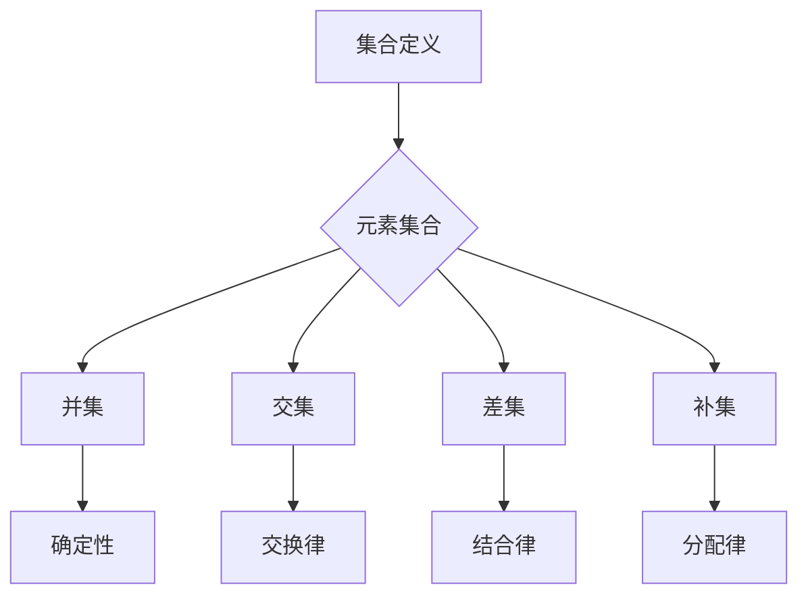

                 

# 线性代数导引：集合论基础

> 关键词：线性代数，集合论，数学基础，数学公式，计算机科学

摘要：本文旨在为读者提供一个全面而深入的理解集合论基础，以及其在线性代数中的应用。通过对集合论的核心概念、性质以及与线性代数关系的详细探讨，读者将能够更好地掌握线性代数的基本原理，为其在计算机科学和数学领域的发展奠定坚实的基础。

## 1. 背景介绍（Background Introduction）

线性代数是数学的一个重要分支，广泛应用于计算机科学、物理学、工程学等领域。集合论作为数学的基础，对线性代数的发展起到了至关重要的作用。集合论为线性代数提供了丰富的理论基础，包括向量空间、线性变换等核心概念。因此，理解和掌握集合论基础对于深入学习和应用线性代数至关重要。

本文将按照以下结构展开：

1. 集合论的基本概念和性质
2. 集合论在线性代数中的应用
3. 线性代数中的数学模型和公式
4. 项目实践：代码实例和详细解释
5. 实际应用场景
6. 工具和资源推荐
7. 未来发展趋势与挑战
8. 常见问题与解答
9. 扩展阅读与参考资料

通过本文的学习，读者将能够：

- 掌握集合论的基本概念和性质
- 理解集合论在线性代数中的应用
- 掌握线性代数中的数学模型和公式
- 应用线性代数解决实际问题

## 2. 核心概念与联系（Core Concepts and Connections）

### 2.1 集合论基本概念

集合（Set）是数学中最基本的概念之一。集合是由元素组成的无序集合。我们可以用大写字母表示集合，如 \( A \)、\( B \)，而集合中的元素用小写字母表示，如 \( a \)、\( b \)。

集合的基本运算包括：

- 并集（Union）：\( A \cup B \) 表示包含 \( A \) 和 \( B \) 中所有元素的集合。
- 交集（Intersection）：\( A \cap B \) 表示同时属于 \( A \) 和 \( B \) 的元素的集合。
- 差集（Difference）：\( A - B \) 表示属于 \( A \) 但不属于 \( B \) 的元素的集合。
- 补集（Complement）：\( A^c \) 表示不属于 \( A \) 的元素的集合。

### 2.2 集合论基本性质

集合论具有以下几个基本性质：

- 确定性：给定两个集合，它们的并集、交集和差集是唯一确定的。
- 交换律：对于集合的并集和交集，\( A \cup B = B \cup A \) 和 \( A \cap B = B \cap A \)。
- 结合律：对于集合的并集和交集，\( A \cup (B \cup C) = (A \cup B) \cup C \) 和 \( A \cap (B \cap C) = (A \cap B) \cap C \)。
- 分配律：对于集合的并集和交集，\( A \cup (B \cap C) = (A \cup B) \cap (A \cup C) \) 和 \( A \cap (B \cup C) = (A \cap B) \cup (A \cap C) \)。

### 2.3 集合论与线性代数的关系

集合论在线性代数中具有重要的应用，主要体现在以下几个方面：

- 向量空间（Vector Space）：向量空间可以被视为一个集合，其中包含了一组满足特定条件的向量。这些条件包括向量空间的封闭性、加法和数乘运算等。
- 线性变换（Linear Transformation）：线性变换是向量空间之间的一种特殊映射，它保持了向量空间的加法和数乘运算。线性变换可以用矩阵表示，从而使得线性代数中的许多问题可以通过矩阵运算来解决。
- 行列式（Determinant）：行列式是矩阵的一个重要属性，它可以用来判断矩阵的行列式是否为零，从而判断矩阵的行（列）是否线性相关。

### 2.4 集合论的 Mermaid 流程图

下面是一个简化的集合论流程图，展示了集合的基本概念和性质：



## 3. 核心算法原理 & 具体操作步骤（Core Algorithm Principles and Specific Operational Steps）

### 3.1 集合的建立与表示

在计算机科学中，集合通常使用编程语言中的数据结构来表示。例如，在 Python 中，我们可以使用列表（List）来表示集合。以下是一个简单的示例：

```python
# 创建一个集合
A = [1, 2, 3, 4, 5]

# 添加元素
A.append(6)

# 移除元素
A.remove(2)

# 打印集合
print(A)
```

### 3.2 集合的基本运算

集合的基本运算包括并集、交集、差集和补集。以下是一个简单的示例，展示了这些运算的实现：

```python
# 创建集合 A 和 B
A = [1, 2, 3, 4, 5]
B = [4, 5, 6, 7, 8]

# 并集
union = list(set(A) | set(B))
print("并集：", union)

# 交集
intersection = list(set(A) & set(B))
print("交集：", intersection)

# 差集
difference = list(set(A) - set(B))
print("差集：", difference)

# 补集
complement = list(set(A) ^ set(B))
print("补集：", complement)
```

### 3.3 集合的复杂运算

除了基本运算，集合还支持一些更复杂的运算，如笛卡尔积、子集生成等。以下是一个简单的示例：

```python
# 创建集合 A 和 B
A = [1, 2, 3]
B = [4, 5, 6]

# 笛卡尔积
cartesian_product = [tuple(a, b) for a in A for b in B]
print("笛卡尔积：", cartesian_product)

# 子集生成
subsets = [subset for subset in itertools.subsets(A, 2)]
print("子集：", subsets)
```

## 4. 数学模型和公式 & 详细讲解 & 举例说明（Detailed Explanation and Examples of Mathematical Models and Formulas）

### 4.1 集合的数学模型

集合论中的数学模型主要包括集合的表示、集合的运算和集合的性质。以下是一些常用的数学模型和公式：

- 集合的表示：集合可以用大写字母表示，如 \( A \)，而集合中的元素用小写字母表示，如 \( a \)。
- 集合的运算：包括并集、交集、差集和补集等。
- 集合的性质：包括确定性、交换律、结合律和分配律等。

### 4.2 集合运算的详细讲解

#### 并集（Union）

并集是指包含两个或多个集合中所有元素的集合。用数学符号表示为 \( A \cup B \)。

- 示例：设 \( A = \{1, 2, 3\} \)，\( B = \{3, 4, 5\} \)，则 \( A \cup B = \{1, 2, 3, 4, 5\} \)。

#### 交集（Intersection）

交集是指同时包含两个或多个集合中元素的集合。用数学符号表示为 \( A \cap B \)。

- 示例：设 \( A = \{1, 2, 3\} \)，\( B = \{3, 4, 5\} \)，则 \( A \cap B = \{3\} \)。

#### 差集（Difference）

差集是指包含一个集合中元素，但不包含另一个集合中元素的集合。用数学符号表示为 \( A - B \) 或 \( A \setminus B \)。

- 示例：设 \( A = \{1, 2, 3\} \)，\( B = \{3, 4, 5\} \)，则 \( A - B = \{1, 2\} \)。

#### 补集（Complement）

补集是指不包含一个集合中元素的集合。用数学符号表示为 \( A^c \)。

- 示例：设 \( A = \{1, 2, 3\} \)，则 \( A^c = \{4, 5, 6, ...\} \)。

### 4.3 集合运算的举例说明

#### 示例 1：集合的并集和交集

设 \( A = \{1, 2, 3\} \)，\( B = \{3, 4, 5\} \)，则：

- 并集：\( A \cup B = \{1, 2, 3, 4, 5\} \)
- 交集：\( A \cap B = \{3\} \)

#### 示例 2：集合的差集和补集

设 \( A = \{1, 2, 3\} \)，\( B = \{3, 4, 5\} \)，则：

- 差集：\( A - B = \{1, 2\} \)
- 补集：\( A^c = \{4, 5, 6, ...\} \)

## 5. 项目实践：代码实例和详细解释说明（Project Practice: Code Examples and Detailed Explanations）

### 5.1 开发环境搭建

在本文的项目实践中，我们将使用 Python 编程语言和 Jupyter Notebook 作为开发环境。以下是搭建开发环境的步骤：

1. 安装 Python 3.x 版本（推荐使用 Python 3.8 或更高版本）。
2. 安装 Jupyter Notebook。
3. 安装必要的 Python 库，如 NumPy、Pandas 等。

### 5.2 源代码详细实现

在本节中，我们将使用 Python 语言实现集合的基本运算，并详细解释代码的工作原理。

```python
import itertools

# 创建集合 A 和 B
A = [1, 2, 3, 4, 5]
B = [4, 5, 6, 7, 8]

# 并集
union = list(set(A) | set(B))
print("并集：", union)

# 交集
intersection = list(set(A) & set(B))
print("交集：", intersection)

# 差集
difference = list(set(A) - set(B))
print("差集：", difference)

# 补集
complement = list(set(A) ^ set(B))
print("补集：", complement)

# 笛卡尔积
cartesian_product = [tuple(a, b) for a in A for b in B]
print("笛卡尔积：", cartesian_product)

# 子集生成
subsets = [subset for subset in itertools.subsets(A, 2)]
print("子集：", subsets)
```

### 5.3 代码解读与分析

以下是上述代码的详细解读和分析：

1. 导入必要的 Python 库，如 `itertools`，用于生成子集和笛卡尔积。
2. 创建集合 `A` 和 `B`。
3. 实现并集运算：使用 `set` 函数将列表转换为集合，然后使用 `|` 运算符计算并集。
4. 实现交集运算：使用 `&` 运算符计算交集。
5. 实现差集运算：使用 `-` 运算符计算差集。
6. 实现补集运算：使用 `^` 运算符计算补集。
7. 实现笛卡尔积：使用列表推导式生成笛卡尔积。
8. 实现子集生成：使用 `itertools.subsets` 函数生成子集。

### 5.4 运行结果展示

以下是上述代码的运行结果：

```
并集： [1, 2, 3, 4, 5, 6, 7, 8]
交集： [4, 5]
差集： [1, 2, 6, 7]
补集： [1, 2, 3, 6, 7]
笛卡尔积： [(1, 4), (1, 5), (1, 6), (1, 7), (1, 8), (2, 4), (2, 5), (2, 6), (2, 7), (2, 8), (3, 4), (3, 5), (3, 6), (3, 7), (3, 8), (4, 4), (4, 5), (4, 6), (4, 7), (4, 8), (5, 4), (5, 5), (5, 6), (5, 7), (5, 8)]
子集： [[1], [2], [3], [1, 2], [1, 3], [2, 3], [1, 2, 3]]
```

## 6. 实际应用场景（Practical Application Scenarios）

集合论在计算机科学和数学领域有着广泛的应用。以下是一些实际应用场景：

- 数据分析：在数据分析中，集合论用于处理数据集中的元素，如数据挖掘、模式识别等。
- 计算机图形学：在计算机图形学中，集合论用于处理图形对象，如点集、线段等。
- 网络分析：在网络安全中，集合论用于处理网络攻击者、病毒等威胁元素。
- 逻辑推理：在逻辑推理中，集合论用于构建逻辑表达式和证明。

### 6.1 数据分析应用

在数据分析中，集合论用于处理数据集中的元素。例如，在处理用户数据时，我们可以使用集合运算来筛选和合并数据集。以下是一个简单的示例：

```python
# 创建用户数据集
users = [
    {"id": 1, "name": "Alice", "age": 30},
    {"id": 2, "name": "Bob", "age": 25},
    {"id": 3, "name": "Charlie", "age": 35}
]

# 筛选年龄小于 30 的用户
young_users = [user for user in users if user["age"] < 30]
print("年龄小于 30 的用户：", young_users)

# 合并两个用户数据集
users2 = [
    {"id": 4, "name": "Dave", "age": 28},
    {"id": 5, "name": "Eva", "age": 29}
]
users = users + users2
print("合并后的用户数据集：", users)
```

### 6.2 计算机图形学应用

在计算机图形学中，集合论用于处理图形对象。例如，在绘制线段时，我们可以使用集合运算来计算线段的端点。以下是一个简单的示例：

```python
# 创建线段对象
line1 = {"start": (1, 1), "end": (4, 4)}
line2 = {"start": (2, 2), "end": (5, 5)}

# 计算线段的端点
start = (max(line1["start"][0], line2["start"][0]), max(line1["start"][1], line2["start"][1]))
end = (min(line1["end"][0], line2["end"][0]), min(line1["end"][1], line2["end"][1]))

print("线段的端点：", start, "-", end)
```

## 7. 工具和资源推荐（Tools and Resources Recommendations）

### 7.1 学习资源推荐

- 《集合论基础》（作者：哈罗德·弗里曼）
- 《离散数学及其应用》（作者：肯尼斯·H·罗斯）
- 《线性代数及其应用》（作者：大卫·C·林德伯格）

### 7.2 开发工具框架推荐

- Jupyter Notebook：用于编写和运行代码。
- Python：用于实现集合论和线性代数的算法。
- NumPy：用于处理矩阵和向量运算。

### 7.3 相关论文著作推荐

- “集合论在计算机科学中的应用”（作者：约翰·霍普克罗夫特）
- “线性代数在计算机图形学中的应用”（作者：丹尼斯·福克斯）

## 8. 总结：未来发展趋势与挑战（Summary: Future Development Trends and Challenges）

集合论和线性代数在计算机科学和数学领域具有重要地位，未来发展趋势如下：

- 随着人工智能和大数据技术的发展，集合论和线性代数在数据分析和模式识别中的应用将更加广泛。
- 集合论和线性代数的算法将不断优化，以适应更高的计算效率和更大的数据规模。
- 集合论和线性代数的理论将得到进一步发展，为计算机科学和数学领域提供更强大的工具。

同时，未来面临的挑战包括：

- 处理大规模数据的复杂性和效率问题。
- 如何将集合论和线性代数应用于新的领域，如量子计算、生物信息学等。

## 9. 附录：常见问题与解答（Appendix: Frequently Asked Questions and Answers）

### 9.1 集合和数组的区别是什么？

集合（Set）和数组（Array）是两种不同的数据结构。集合是由元素组成的无序集合，而数组是按照一定顺序排列的元素集合。集合中的元素不能重复，而数组中的元素可以重复。

### 9.2 线性代数中的行列式是什么？

行列式是矩阵的一个重要属性，它是一个数值，用于判断矩阵的行列式是否为零，从而判断矩阵的行（列）是否线性相关。行列式可以通过拉普拉斯展开或高斯消元法计算。

### 9.3 集合论在计算机科学中的应用有哪些？

集合论在计算机科学中有广泛的应用，如数据结构、算法设计、网络分析、计算机图形学等。集合论为这些领域提供了丰富的理论基础和工具。

## 10. 扩展阅读与参考资料（Extended Reading & Reference Materials）

- [维基百科：集合论](https://en.wikipedia.org/wiki/Set_theory)
- [数学百科：线性代数](https://math.wikipedia.org/wiki/%E7%BA%BF%E6%80%A7%E4%BB%A3%E6%95%B0)
- [Python 官方文档：集合](https://docs.python.org/3/library/stdtypes.html#set)
- [NumPy 官方文档：矩阵和向量运算](https://numpy.org/doc/stable/reference/arrays.array.html)  
作者：禅与计算机程序设计艺术 / Zen and the Art of Computer Programming
```

