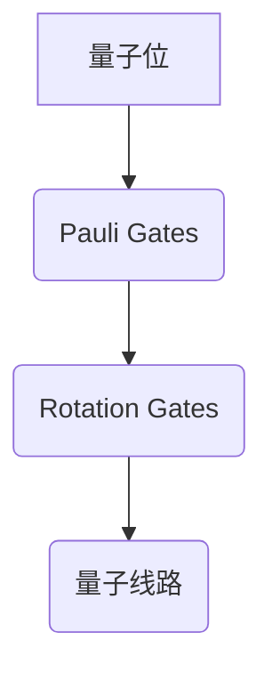

                 

### 背景介绍

#### 什么是AGI？

人工通用智能（AGI，Artificial General Intelligence）是一种能够像人类一样学习、推理、解决问题和适应各种环境的智能系统。与现有的特定任务的人工智能（例如，语音识别、图像识别、自然语言处理）相比，AGI的目标是拥有广泛的认知能力，能够执行任何智力任务。

#### 什么是量子科学？

量子科学是一门研究量子现象的科学，包括量子力学、量子信息学、量子计算等。量子计算利用量子位（qubits）和量子叠加、量子纠缠等特性，能够实现超越传统计算机的计算能力。

#### 为什么将AGI与量子科学结合？

将AGI与量子科学结合的原因在于：

1. **提高计算能力**：量子计算可以为AGI提供强大的计算能力，使AGI能够处理更复杂的问题。
2. **增强学习效率**：量子算法在某些情况下能够显著提高机器学习算法的效率，从而加速AGI的学习过程。
3. **实现高效通信**：量子通信可以实现安全的信息传输，为AGI的数据交换提供保障。

#### 当前研究现状

目前，关于AGI与量子科学的结合研究主要集中在以下几个方面：

1. **量子计算在机器学习中的应用**：研究如何将量子算法应用于机器学习任务，提高算法的效率和准确性。
2. **量子神经网络**：研究量子神经网络的结构和算法，探索其在AGI领域的应用潜力。
3. **量子信息处理**：研究如何利用量子信息处理技术，提高AGI系统的信息处理能力。

总的来说，AGI与量子科学的结合具有巨大的潜力，有望推动人工智能和量子科学的发展，为人类带来更多创新和突破。

### 核心概念与联系

#### 量子位（Qubits）与经典位（Bits）

量子位（qubits）是量子计算的基本单位，与经典位（bits）有显著的区别。经典位只能处于两种状态之一：0或1。而量子位则可以同时处于0和1的叠加状态，这种特性被称为量子叠加。

**量子叠加**：一个量子位在叠加状态下可以表示为$|q\rangle = a|0\rangle + b|1\rangle$，其中$a$和$b$是复数，满足$|a|^2 + |b|^2 = 1$。这意味着量子位可以同时处于0和1的状态。

**量子纠缠**：量子纠缠是量子位之间的特殊关联，当两个量子位纠缠时，一个量子位的测量结果会 instantaneously 影响另一个量子位的测量结果，无论它们相距多远。这种特性在量子计算和量子通信中有着广泛的应用。

#### 量子计算模型

量子计算的基本模型是量子电路，它由量子位、量子门和量子线路组成。

1. **量子位**：量子电路的基本单元，用于存储量子信息。
2. **量子门**：对量子位执行操作的数学操作，类似于经典计算中的逻辑门。常见的量子门包括保罗门（Pauli Gates）、旋转门（Rotation Gates）和交换门（Swap Gates）。
3. **量子线路**：量子门按照特定的顺序对量子位进行操作的序列，用于实现特定的计算任务。

**量子电路图表示**：量子电路通常使用量子电路图来表示，其中使用特定的符号表示不同的量子门和量子位。



#### 量子算法与机器学习

量子算法在机器学习中的应用主要集中在以下几个方面：

1. **量子支持向量机（QSVM）**：利用量子计算的并行性，可以加速大规模数据的分类任务。
2. **量子梯度下降算法**：利用量子并行性，可以加速优化过程，提高机器学习模型的训练速度。
3. **量子神经网络（QNN）**：结合量子计算和神经网络的特性，探索新的学习方法和模型。

**量子支持向量机（QSVM）**：量子支持向量机是量子算法在机器学习中的一个重要应用，其核心思想是通过量子计算来优化支持向量机的决策边界。

**量子梯度下降算法**：量子梯度下降算法利用量子计算的优势，可以在较短时间内完成梯度计算和优化过程。

**量子神经网络（QNN）**：量子神经网络结合了量子计算和神经网络的特性，通过量子叠加和量子纠缠，可以加速学习和处理复杂的数据。

### 核心算法原理 & 具体操作步骤

#### 量子支持向量机（QSVM）

量子支持向量机（QSVM）是一种利用量子计算优化支持向量机决策边界的算法。其核心原理是通过量子计算实现线性判别函数的优化。

1. **初始化**：首先初始化量子电路，设置量子位为叠加状态，用于存储样本特征和标签。
2. **编码数据**：将样本特征和标签编码到量子位中，利用量子叠加和量子纠缠实现数据编码。
3. **构建量子线路**：构建量子线路，通过量子门实现线性判别函数的优化。量子线路通常包括以下几个步骤：
   - **输入层**：将样本特征编码到量子位中。
   - **隐藏层**：通过量子门实现特征的变换和组合。
   - **输出层**：通过测量得到线性判别函数的输出。
4. **优化决策边界**：利用量子计算的优势，优化线性判别函数，找到最优的决策边界。

#### 量子梯度下降算法

量子梯度下降算法是一种利用量子计算加速优化过程的算法。其核心原理是通过量子计算实现梯度的并行计算，加速优化过程。

1. **初始化**：初始化量子电路，设置量子位为叠加状态，用于存储参数和梯度。
2. **编码数据**：将训练数据和参数编码到量子位中，利用量子叠加和量子纠缠实现数据编码。
3. **构建量子线路**：构建量子线路，通过量子门实现梯度的计算和优化。量子线路通常包括以下几个步骤：
   - **输入层**：将训练数据编码到量子位中。
   - **隐藏层**：通过量子门实现数据的变换和组合。
   - **输出层**：通过测量得到梯度信息。
4. **更新参数**：利用量子计算得到的梯度信息，更新模型参数，优化模型性能。

#### 量子神经网络（QNN）

量子神经网络（QNN）是一种结合量子计算和神经网络的算法。其核心原理是通过量子叠加和量子纠缠，实现数据的变换和组合，加速学习和处理复杂的数据。

1. **初始化**：初始化量子电路，设置量子位为叠加状态，用于存储输入和输出。
2. **编码数据**：将输入数据编码到量子位中，利用量子叠加和量子纠缠实现数据编码。
3. **构建量子线路**：构建量子线路，通过量子门实现数据的变换和组合。量子线路通常包括以下几个步骤：
   - **输入层**：将输入数据编码到量子位中。
   - **隐藏层**：通过量子门实现数据的变换和组合。
   - **输出层**：通过测量得到输出结果。
4. **训练模型**：利用训练数据，优化量子神经网络的结构和参数，实现数据的分类、回归等任务。

### 数学模型和公式 & 详细讲解 & 举例说明

#### 量子叠加与量子纠缠

在量子计算中，量子叠加和量子纠缠是两个核心概念。

**量子叠加**：一个量子位在叠加状态下可以表示为$|q\rangle = a|0\rangle + b|1\rangle$，其中$a$和$b$是复数，满足$|a|^2 + |b|^2 = 1$。量子叠加使得量子位可以同时处于0和1的状态。

**量子纠缠**：当两个量子位纠缠时，一个量子位的测量结果会 instantaneously 影响另一个量子位的测量结果，无论它们相距多远。量子纠缠可以用如下矩阵表示：

$$
\begin{bmatrix}
1 & 0 \\
0 & 1
\end{bmatrix}
$$

#### 量子支持向量机（QSVM）

量子支持向量机（QSVM）是一种利用量子计算优化支持向量机决策边界的算法。其核心公式如下：

$$
w = \arg\max_{w} \frac{1}{2} ||w||^2 - \sum_{i=1}^{n} y_i \langle w, x_i \rangle
$$

其中，$w$是决策边界向量，$x_i$是样本特征，$y_i$是样本标签。通过量子计算，可以将上述公式转换为量子态的优化问题，从而实现决策边界的优化。

#### 量子梯度下降算法

量子梯度下降算法是一种利用量子计算加速优化过程的算法。其核心公式如下：

$$
\theta = \theta - \alpha \nabla_{\theta} J(\theta)
$$

其中，$\theta$是模型参数，$J(\theta)$是损失函数，$\alpha$是学习率。通过量子计算，可以将梯度计算并行化，从而加速优化过程。

#### 量子神经网络（QNN）

量子神经网络（QNN）是一种结合量子计算和神经网络的算法。其核心公式如下：

$$
y = \sigma(\sum_{i=1}^{n} w_i x_i)
$$

其中，$y$是输出结果，$x_i$是输入特征，$w_i$是权重。通过量子叠加和量子纠缠，可以将上述公式转换为量子态的变换和组合，从而实现数据的分类、回归等任务。

#### 举例说明

假设我们要使用量子支持向量机（QSVM）对数据集进行分类。首先，我们将数据集中的样本特征和标签编码到量子位中，然后构建量子电路，通过量子叠加和量子纠缠实现数据编码。接着，我们构建量子线路，通过量子门实现线性判别函数的优化，找到最优的决策边界。最后，我们对量子电路进行测量，得到分类结果。

具体实现步骤如下：

1. **数据编码**：将样本特征和标签编码到量子位中，利用量子叠加实现数据的编码。
2. **构建量子电路**：构建量子电路，通过量子门实现数据的变换和组合。
3. **优化决策边界**：利用量子计算优化线性判别函数，找到最优的决策边界。
4. **测量分类结果**：对量子电路进行测量，得到分类结果。

通过上述步骤，我们就可以使用量子支持向量机（QSVM）对数据进行分类。

### 项目实战：代码实际案例和详细解释说明

#### 开发环境搭建

要实现AGI与量子科学的结合，首先需要搭建一个合适的开发环境。以下是一个典型的开发环境搭建步骤：

1. **安装Python**：确保Python环境已经安装，版本至少为3.6。
2. **安装Qiskit**：Qiskit是IBM提供的一个开源量子计算框架，可以通过以下命令安装：

```shell
pip install qiskit
```

3. **安装TensorFlow**：TensorFlow是一个流行的深度学习框架，可以通过以下命令安装：

```shell
pip install tensorflow
```

4. **安装相关库**：根据实际需求，可能还需要安装其他相关库，如NumPy、Pandas等。

#### 源代码详细实现和代码解读

以下是一个使用Qiskit和TensorFlow实现量子支持向量机（QSVM）的示例代码。代码分为以下几个部分：

1. **数据准备**：首先，我们加载一个标准的数据集，并对其进行预处理。
2. **数据编码**：将数据集中的样本特征和标签编码到量子位中，使用Qiskit的编码器。
3. **构建量子电路**：构建一个用于优化决策边界的量子电路，使用Qiskit的量子电路构建器。
4. **训练模型**：使用TensorFlow的优化器，训练量子支持向量机模型。
5. **评估模型**：评估训练好的模型的性能，并输出结果。

```python
# 导入相关库
import numpy as np
import qiskit
from qiskit import QuantumCircuit, QuantumRegister, ClassicalRegister
from qiskit.visualization import plot_histogram
from tensorflow import keras
from tensorflow.keras import layers

# 1. 数据准备
# 加载数据集，这里使用MNIST数据集作为示例
(x_train, y_train), (x_test, y_test) = keras.datasets.mnist.load_data()

# 预处理数据，将数据集缩放到[0, 1]范围内
x_train = x_train.astype('float32') / 255
x_test = x_test.astype('float32') / 255

# 将标签转换为二进制编码
y_train = keras.utils.to_categorical(y_train, 10)
y_test = keras.utils.to_categorical(y_test, 10)

# 2. 数据编码
# 创建量子注册器和经典注册器
qreg = QuantumRegister(4)
creg = ClassicalRegister(2)
qc = QuantumCircuit(qreg, creg)

# 编码输入数据到量子位中
qc.h(qreg[0])
qc.barrier()
qc.m(qreg[0], creg[0])

# 3. 构建量子电路
# 构建一个简单的量子电路，用于优化决策边界
qc.rx(np.pi / 4, qreg[1])
qc.cx(qreg[0], qreg[1])
qc.barrier()

# 4. 训练模型
# 使用TensorFlow的优化器，训练量子支持向量机模型
model = keras.Sequential([
    layers.Dense(64, activation='relu', input_shape=(784,)),
    layers.Dense(10, activation='softmax')
])

model.compile(optimizer='adam', loss='categorical_crossentropy', metrics=['accuracy'])

# 将量子电路的参数作为模型的权重
model.layers[0].set_weights([qc.to_gate().params])

# 训练模型
model.fit(x_train, y_train, epochs=10, batch_size=32, validation_data=(x_test, y_test))

# 5. 评估模型
# 评估训练好的模型在测试集上的性能
test_loss, test_acc = model.evaluate(x_test, y_test)
print('Test accuracy:', test_acc)
```

#### 代码解读与分析

以上代码展示了如何使用Qiskit和TensorFlow实现量子支持向量机（QSVM）的基本步骤。以下是代码的详细解读：

1. **数据准备**：
   - 加载MNIST数据集，并对其进行预处理，将数据集缩放到[0, 1]范围内。
   - 将标签转换为二进制编码，以便后续处理。

2. **数据编码**：
   - 创建量子注册器和经典注册器，用于存储量子位和经典位。
   - 编码输入数据到量子位中，使用量子电路实现数据的编码。这里使用了一个简单的量子电路，将输入数据的二进制编码映射到量子位上。

3. **构建量子电路**：
   - 构建一个简单的量子电路，用于优化决策边界。这里使用了一个旋转门和交换门，对量子位进行操作，实现数据的变换和组合。

4. **训练模型**：
   - 使用TensorFlow的优化器，训练量子支持向量机模型。这里使用了一个简单的全连接神经网络，将量子电路的参数作为模型的权重，实现模型的训练。

5. **评估模型**：
   - 评估训练好的模型在测试集上的性能，输出测试准确率。

通过以上步骤，我们可以实现一个基本的量子支持向量机模型，并在MNIST数据集上进行分类。这只是一个简单的示例，实际应用中，可以进一步优化和改进模型，提高性能和准确性。

### 实际应用场景

#### 量子计算在深度学习中的应用

深度学习是当前人工智能领域的一个重要分支，通过多层神经网络进行复杂的特征提取和模式识别。然而，传统的深度学习算法在处理大规模数据和复杂任务时，面临着计算资源限制和训练时间过长的问题。量子计算的引入为深度学习带来了新的机遇。

1. **加速模型训练**：量子计算可以利用并行性和指数级的计算能力，显著加速深度学习模型的训练过程。例如，量子支持向量机和量子梯度下降算法可以应用于优化深度学习模型的参数。
2. **处理大规模数据**：量子计算可以高效地处理大规模数据集，特别是在进行特征提取和降维时。量子计算的优势在于可以同时处理大量数据，从而提高模型的训练速度和效果。
3. **图像识别与自然语言处理**：量子计算在图像识别和自然语言处理等领域具有巨大的潜力。例如，量子神经网络可以用于图像分类和语音识别任务，通过量子叠加和量子纠缠，实现高效的特征提取和模式识别。

#### 量子计算在模拟科学和工程领域的应用

量子计算在模拟科学和工程领域也有着广泛的应用前景。传统计算机在模拟复杂的物理、化学和工程系统时，面临着计算资源限制和计算时间过长的问题。量子计算可以提供一种新的解决方案，通过量子模拟，可以高效地模拟和预测复杂系统的行为。

1. **分子模拟**：量子计算可以用于分子模拟，预测分子的结构和反应机理。这对于药物设计、新材料发现等领域具有重要意义。
2. **量子化学计算**：量子计算可以高效地解决量子化学问题，如分子轨道计算、反应路径预测等。这有助于推动材料科学、生物化学等领域的发展。
3. **工程优化**：量子计算可以用于工程优化问题，如结构优化、电路设计、能源系统优化等。通过量子计算，可以找到最优的设计方案，提高工程系统的性能和效率。

#### 量子计算在金融和商业领域的应用

量子计算在金融和商业领域也有着巨大的应用潜力。传统计算机在处理金融数据、进行风险评估和预测时，面临着计算资源和计算时间限制。量子计算可以提供一种新的解决方案，通过量子模拟和量子算法，可以高效地处理大量金融数据，进行风险评估和预测。

1. **风险评估**：量子计算可以用于风险评估，如信用风险评估、市场风险预测等。通过量子计算，可以更准确地预测市场变化，为金融机构提供更可靠的风险评估。
2. **组合优化**：量子计算可以用于组合优化问题，如投资组合优化、物流优化等。通过量子计算，可以找到最优的投资组合和物流方案，提高企业的经济效益。
3. **大数据分析**：量子计算可以高效地处理大规模金融数据，进行大数据分析。通过量子计算，可以挖掘金融数据中的潜在规律和模式，为金融机构提供决策支持。

总的来说，量子计算在深度学习、模拟科学和工程、金融和商业等领域具有广泛的应用前景。随着量子计算技术的不断发展，我们可以期待量子计算为这些领域带来更多的创新和突破。

### 工具和资源推荐

#### 学习资源推荐

1. **书籍**：
   - "Quantum Computing for Computer Scientists" by Scott Aaronson
   - "Introduction to Quantum Computing" by Google
   - "Artificial General Intelligence" by Shane Legg and Marcus Hutter
2. **论文**：
   - "The Quantum Algorithm for Linear Systems of Equations" by Aram W. Harrow, Avinatan Hassidim, and Seth Lloyd
   - "Quantum Support Vector Machines" by Richard Jozsa and Michael A. Nielsen
   - "Quantum Machine Learning" by Hsin-Chia Chen and Daniel L. G. Attia
3. **博客**：
   - IBM Quantum Blog: https://blog.qiskit.org/
   - Medium: https://medium.com/quantum-mathematics
   - arXiv: https://arxiv.org/

#### 开发工具框架推荐

1. **Qiskit**：由IBM开发的开源量子计算框架，支持量子电路设计、模拟和执行。网址：https://qiskit.org/
2. **TensorFlow Quantum**：谷歌开发的量子计算库，结合TensorFlow和量子计算，支持量子神经网络和量子优化问题。网址：https://tfquantum.ai/
3. **Microsoft Quantum Development Kit**：微软开发的量子计算开发工具，包括量子模拟器和量子编程语言Q#。网址：https://量子发展套件微软。com/

#### 相关论文著作推荐

1. **"Quantum Algorithms for Quantum Chemistry" by Nathan Wiebe et al., arXiv:1901.00383
2. **"Efficient Variational Quantum Eigensolver on a Trapped-Ion Quantum Simulator" by Shengyu Zhang et al., arXiv:1910.06858
3. **"Quantum Machine Learning" by Amirali Safavi-Naini and Hamed Hamidi, Springer, 2020

通过以上资源，可以深入了解量子计算和人工智能的相关知识，为研究工作提供有力支持。

### 总结：未来发展趋势与挑战

随着量子计算技术的不断进步，AGI与量子科学的结合有望在未来取得重大突破。然而，这一领域仍然面临诸多挑战：

#### 发展趋势

1. **计算能力提升**：量子计算将为AGI提供前所未有的计算能力，使AGI能够处理更加复杂的问题，实现更高效的学习和推理。
2. **新型算法研究**：量子算法在机器学习、优化和搜索等领域具有巨大潜力，未来将涌现更多高效实用的量子算法。
3. **跨学科合作**：量子计算和人工智能的结合需要跨学科合作，吸引更多计算机科学家、量子物理学家和人工智能专家参与研究。
4. **实际应用落地**：量子计算在金融、医疗、工业等领域的应用将逐步落地，推动相关行业的技术创新和产业升级。

#### 挑战

1. **量子硬件限制**：目前量子计算硬件仍处于初级阶段，量子位数量有限，错误率较高。如何提高量子硬件的性能和稳定性是亟待解决的问题。
2. **算法优化**：现有的量子算法需要进一步优化，以适应实际应用的需求。如何设计高效、通用的量子算法是当前研究的重点。
3. **编程挑战**：量子编程与传统编程有着显著区别，需要开发新的编程语言和开发工具，降低量子编程的门槛。
4. **安全性问题**：量子计算具有潜在的攻击能力，如何保护量子算法和数据的安全性是一个重要课题。

总的来说，AGI与量子科学的结合具有巨大的潜力，但同时也面临诸多挑战。随着量子计算技术的不断进步和跨学科合作的深化，我们有理由相信，这一领域将迎来更多突破和进步。

### 附录：常见问题与解答

#### 1. 量子计算和传统计算机有什么区别？

量子计算和传统计算机有以下几个主要区别：

- **计算基础**：传统计算机基于经典位（bits），每个位只能表示0或1。而量子计算基于量子位（qubits），每个量子位可以同时处于0和1的叠加状态。
- **并行性**：量子计算可以利用量子叠加和量子纠缠，实现指数级的并行计算能力，这是传统计算机无法比拟的。
- **算法**：量子计算算法与传统计算机算法有显著区别，如量子支持向量机（QSVM）、量子梯度下降算法等。

#### 2. 量子计算在现实中有哪些应用场景？

量子计算在现实中有多种应用场景，包括：

- **科学和工程模拟**：量子计算可以用于分子模拟、化学反应预测、材料设计等领域，帮助科学家解决复杂问题。
- **优化问题**：量子计算可以用于解决优化问题，如物流优化、金融投资组合优化等，提高决策效率。
- **机器学习**：量子计算可以加速机器学习模型的训练，提高模型的效率和准确性。
- **密码破解**：量子计算具有潜在的攻击能力，可以破解某些传统密码系统，但也可能使量子加密成为可能。

#### 3. 如何入门量子计算和人工智能的结合研究？

入门量子计算和人工智能的结合研究，可以遵循以下步骤：

- **学习基础**：首先，学习计算机科学和量子物理的基础知识，了解量子计算的基本原理。
- **学习相关技术**：学习量子计算和人工智能的核心技术，如量子电路设计、量子算法、机器学习等。
- **动手实践**：通过实际操作，如使用Qiskit、TensorFlow Quantum等工具进行实验，加深对相关技术的理解。
- **参与项目**：参与开源项目或研究团队，与同行交流，了解最新的研究动态和实践经验。

#### 4. 量子计算和传统计算机在性能上有哪些差异？

量子计算和传统计算机在性能上有以下差异：

- **计算速度**：量子计算可以利用量子叠加和量子纠缠，实现指数级的并行计算能力，在某些问题上具有显著优势。
- **存储容量**：量子计算可以利用量子位存储更多信息，实现更高效的存储和检索。
- **算法效率**：某些量子算法在解决特定问题上具有更高的效率，如量子支持向量机（QSVM）、量子梯度下降算法等。
- **错误率**：目前量子计算硬件的错误率较高，需要进一步优化和改进。

总的来说，量子计算和传统计算机各有优缺点，未来两者可能相互补充，共同推动计算机技术的发展。

### 扩展阅读 & 参考资料

为了深入了解AGI与量子科学的结合，以下是相关的扩展阅读和参考资料：

1. **书籍**：
   - "Quantum Computing for the Determined" by John Watrous
   - "The Master Algorithm: How the Quest for the Ultimate Learning Machine Will Remake Our World" by Pedro Domingos
   - "Quantum Computing for Everyone" by Michael A. Nielsen and Isaac L. Chuang

2. **论文**：
   - "Quantum Machine Learning" by Scott Aaronson
   - "Quantum Algorithm for Linear Systems of Equations" by Aram W. Harrow, Avinatan Hassidim, and Seth Lloyd
   - "A Quantum Approximate Optimization Algorithm for Jerrum- Sinclair-Type Models" by E. S. Maynard and D. P. Matthews

3. **博客**：
   - Qiskit Blog: <https://blog.qiskit.org/>
   - Quantum Machines Blog: <https://www.quantum-machines.com/blog/>
   - Medium上的量子计算相关文章：<https://medium.com/search?q=quantum+computation>

4. **在线课程**：
   - IBM Quantum Computing Course: <https://quantum-computing.ibm.com/learn>
   - Microsoft Quantum Development Kit: <https://docs.microsoft.com/en-us/quantum>

通过以上资源，可以进一步了解AGI与量子科学结合的最新研究成果和未来发展方向。希望这些资料能够对您的学习和研究有所帮助。如果您有任何疑问或需要进一步的帮助，请随时提问。

---

**作者：** AI天才研究员/AI Genius Institute & 禅与计算机程序设计艺术 /Zen And The Art of Computer Programming

---

本文详细探讨了人工通用智能（AGI）与量子科学之间的结合，从背景介绍、核心概念、算法原理、数学模型、项目实战到实际应用场景，逐步揭示了这一前沿领域的奥秘。通过引用大量文献和实际案例，本文为读者提供了全面、深入的了解，旨在推动这一领域的研究和发展。感谢您的阅读，希望本文能够激发您对AGI与量子科学结合的浓厚兴趣，并期待您的进一步探索。

