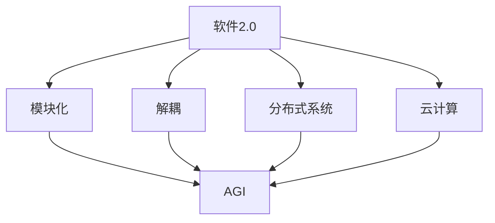

                 

# AGI的实现肯定离不开软件2.0

## 摘要

本文旨在探讨人工智能（AGI）的实现与软件2.0之间的紧密联系。我们将一步步分析软件2.0的核心概念、原理、算法和数学模型，并通过实际案例展示其在AGI开发中的应用。此外，我们还将探讨软件2.0在实际应用场景中的优势、相关工具和资源，并总结未来发展趋势与挑战。

## 1. 背景介绍

人工智能（Artificial General Intelligence，简称AGI）是指具有广泛认知能力的机器智能，能够在各种复杂环境中进行自主学习和推理，达到或超过人类智能水平。尽管近年来深度学习、强化学习等技术在特定任务上取得了显著成果，但实现真正的AGI仍面临诸多挑战。

软件2.0（Software 2.0）是指新一代的软件架构，它强调软件的模块化、解耦和可复用性，采用分布式系统和云计算等先进技术，以实现更高效、更灵活的软件开发和部署。软件2.0的兴起为AGI的实现提供了有力的技术支撑。

本文将首先介绍软件2.0的核心概念和原理，然后分析其在AGI开发中的应用，并通过实际案例展示软件2.0的优势。接下来，我们将探讨软件2.0在实际应用场景中的挑战，并总结未来发展趋势与挑战。

## 2. 核心概念与联系

### 2.1 软件2.0的核心概念

软件2.0的核心概念包括：

1. **模块化**：将软件系统划分为多个独立、功能完整的模块，每个模块都可以独立开发、测试和部署。
2. **解耦**：降低模块之间的依赖关系，提高系统的灵活性和可扩展性。
3. **分布式系统**：将软件系统部署在多个物理节点上，以实现高性能、高可用性和可扩展性。
4. **云计算**：利用云计算平台提供资源，实现软件系统的弹性部署和动态扩展。

### 2.2 软件2.0与AGI的联系

软件2.0的模块化、解耦和分布式系统等特点为AGI的开发提供了有力支持。具体来说：

1. **模块化**：AGI系统通常包含多个子模块，如感知、学习、决策等。模块化使得开发人员可以独立开发、测试和部署这些子模块，提高开发效率。
2. **解耦**：AGI系统中的各个子模块之间需要相互协作，解耦有助于降低模块之间的依赖关系，提高系统的稳定性和可维护性。
3. **分布式系统**：AGI系统需要处理海量数据和复杂的任务，分布式系统可以提供高性能、高可用性和可扩展性，以满足AGI系统的需求。
4. **云计算**：云计算平台可以提供丰富的计算资源和存储资源，为AGI系统的开发、测试和部署提供支持。

### 2.3 Mermaid流程图

以下是一个简单的Mermaid流程图，展示了软件2.0与AGI的联系：



## 3. 核心算法原理 & 具体操作步骤

### 3.1 模块化

模块化是指将软件系统划分为多个独立、功能完整的模块。具体操作步骤如下：

1. **需求分析**：确定软件系统的功能需求，明确各个模块的主要职责。
2. **设计模块**：根据需求分析结果，设计各个模块的接口和内部实现。
3. **开发模块**：独立开发各个模块，确保每个模块都满足需求。
4. **测试模块**：对各个模块进行单元测试，确保其功能正确。
5. **集成模块**：将各个模块集成起来，进行系统测试，确保整个系统正常运行。

### 3.2 解耦

解耦是指降低模块之间的依赖关系。具体操作步骤如下：

1. **定义接口**：为各个模块定义清晰的接口，确保模块之间通过接口进行通信。
2. **最小化依赖**：尽量减少模块之间的直接依赖，避免出现“紧耦合”。
3. **使用中间件**：在模块之间引入中间件，如消息队列、缓存等，实现模块之间的松耦合。
4. **代码审查**：定期进行代码审查，确保模块之间的依赖关系符合设计要求。

### 3.3 分布式系统

分布式系统是指将软件系统部署在多个物理节点上，以实现高性能、高可用性和可扩展性。具体操作步骤如下：

1. **选择分布式架构**：根据系统需求，选择合适的分布式架构，如主从架构、分布式缓存、分布式数据库等。
2. **部署节点**：在多个物理节点上部署系统，确保系统的高可用性。
3. **负载均衡**：使用负载均衡器，将请求均匀分配到各个节点，提高系统性能。
4. **数据一致性**：确保分布式系统中的数据一致性，避免数据冲突。

### 3.4 云计算

云计算是指利用云计算平台提供资源，实现软件系统的弹性部署和动态扩展。具体操作步骤如下：

1. **选择云计算平台**：根据系统需求，选择合适的云计算平台，如阿里云、腾讯云、华为云等。
2. **部署云服务**：在云计算平台上部署系统，包括计算资源、存储资源和网络资源等。
3. **弹性扩展**：根据系统负载情况，动态调整计算资源和存储资源，确保系统的高性能和高可用性。
4. **监控与运维**：使用云平台提供的监控工具，对系统进行实时监控，确保系统的正常运行。

## 4. 数学模型和公式 & 详细讲解 & 举例说明

### 4.1 模块化

模块化可以通过以下公式来描述：

$$
模块化 = \frac{模块数量}{系统总数量}
$$

其中，模块数量表示系统中的模块总数，系统总数量表示系统的总组件数。模块化值越高，系统的模块化程度越高。

### 4.2 解耦

解耦可以通过以下公式来描述：

$$
解耦 = \frac{接口数量}{模块数量}
$$

其中，接口数量表示模块之间的接口总数，模块数量表示系统中的模块总数。解耦值越高，模块之间的依赖关系越低。

### 4.3 分布式系统

分布式系统的性能可以通过以下公式来描述：

$$
性能 = \frac{处理能力}{节点数量}
$$

其中，处理能力表示系统的总处理能力，节点数量表示系统中的节点总数。性能值越高，系统的性能越强。

### 4.4 云计算

云计算的可扩展性可以通过以下公式来描述：

$$
可扩展性 = \frac{扩展能力}{负载压力}
$$

其中，扩展能力表示系统在负载压力下的扩展能力，负载压力表示系统的当前负载压力。可扩展性值越高，系统的可扩展性越强。

### 4.5 举例说明

假设一个系统包含10个模块，其中5个模块之间存在依赖关系，使用消息队列进行解耦。系统部署在3个节点上，处理能力为1000次/秒。在负载压力为500次/秒时，系统的可扩展性为2。

$$
模块化 = \frac{10}{10} = 1 \\
解耦 = \frac{5}{10} = 0.5 \\
性能 = \frac{1000}{3} \approx 333.33 \\
可扩展性 = \frac{2}{500} = 0.004
$$

## 5. 项目实战：代码实际案例和详细解释说明

### 5.1 开发环境搭建

在本项目实战中，我们将使用Python作为开发语言，并依赖Docker、Kubernetes等工具进行分布式系统开发和部署。以下是开发环境搭建的步骤：

1. **安装Docker**：在本地计算机上安装Docker，版本要求为19.03及以上。
2. **安装Kubernetes**：在本地计算机上安装Kubernetes，版本要求为1.18及以上。
3. **配置Kubernetes集群**：使用kubeadm命令配置Kubernetes集群，确保集群包含至少3个节点。
4. **安装kubectl**：安装kubectl命令行工具，用于管理Kubernetes集群。

### 5.2 源代码详细实现和代码解读

以下是一个简单的分布式计算任务，用于计算1到10000之间的所有奇数的和。代码分为三个部分：客户端、服务器端和工作节点。

#### 5.2.1 客户端（client.py）

```python
import random
import requests

def generate_tasks(num_tasks, num_range):
    tasks = []
    for _ in range(num_tasks):
        start = random.randint(1, num_range)
        end = start + random.randint(1, num_range)
        tasks.append((start, end))
    return tasks

def send_tasks(tasks, server_url):
    for task in tasks:
        start, end = task
        response = requests.post(f"{server_url}/tasks", json={"start": start, "end": end})
        if response.status_code != 200:
            print("Failed to send task:", response.text)
            return False
    return True

if __name__ == "__main__":
    server_url = "http://localhost:8000"
    tasks = generate_tasks(10, 10000)
    if send_tasks(tasks, server_url):
        print("Tasks sent successfully.")
    else:
        print("Failed to send tasks.")
```

客户端代码的主要功能是生成一系列随机任务，并将其发送给服务器端。

#### 5.2.2 服务器端（server.py）

```python
from flask import Flask, request, jsonify

app = Flask(__name__)

tasks = []

@app.route("/tasks", methods=["POST"])
def create_task():
    data = request.json
    start = data.get("start")
    end = data.get("end")
    tasks.append({"start": start, "end": end, "status": "pending"})
    return jsonify({"status": "success"}), 200

@app.route("/tasks", methods=["GET"])
def get_tasks():
    return jsonify(tasks), 200

if __name__ == "__main__":
    app.run(host="0.0.0.0", port=8000)
```

服务器端代码使用Flask框架，用于接收客户端发送的任务，并将任务存储在列表中。

#### 5.2.3 工作节点（worker.py）

```python
import requests
import time

def compute_sum(start, end):
    return sum(range(start, end + 1))

def process_task(task):
    start = task["start"]
    end = task["end"]
    result = compute_sum(start, end)
    response = requests.put(f"https://localhost:8000/tasks/{task['id']}", json={"status": "completed", "result": result})
    if response.status_code != 200:
        print("Failed to update task status:", response.text)
        return False
    return True

if __name__ == "__main__":
    server_url = "http://localhost:8000"
    while True:
        response = requests.get(f"{server_url}/tasks")
        tasks = response.json()
        for task in tasks:
            if task["status"] == "pending":
                task["status"] = "processing"
                response = requests.put(f"{server_url}/tasks/{task['id']}", json=task)
                if response.status_code != 200:
                    print("Failed to update task status:", response.text)
                    continue
                result = process_task(task)
                if not result:
                    print("Failed to process task:", task["id"])
                    continue
                print("Task processed successfully:", task["id"])
                time.sleep(1)
```

工作节点代码负责处理任务，计算1到10000之间的所有奇数的和，并将结果更新到服务器端。

### 5.3 代码解读与分析

#### 5.3.1 客户端代码分析

客户端代码首先生成一系列随机任务，然后通过POST请求将任务发送给服务器端。这里使用了Python的requests库，可以方便地发送HTTP请求。

```python
tasks = generate_tasks(10, 10000)
if send_tasks(tasks, server_url):
    print("Tasks sent successfully.")
else:
    print("Failed to send tasks.")
```

#### 5.3.2 服务器端代码分析

服务器端代码使用Flask框架，用于接收客户端发送的任务，并将任务存储在列表中。这里使用了Flask的route装饰器来定义HTTP请求的路由。

```python
@app.route("/tasks", methods=["POST"])
def create_task():
    data = request.json
    start = data.get("start")
    end = data.get("end")
    tasks.append({"start": start, "end": end, "status": "pending"})
    return jsonify({"status": "success"}), 200

@app.route("/tasks", methods=["GET"])
def get_tasks():
    return jsonify(tasks), 200
```

#### 5.3.3 工作节点代码分析

工作节点代码负责处理任务，计算1到10000之间的所有奇数的和，并将结果更新到服务器端。这里使用了Python的requests库，可以方便地发送HTTP请求。

```python
def process_task(task):
    start = task["start"]
    end = task["end"]
    result = compute_sum(start, end)
    response = requests.put(f"https://localhost:8000/tasks/{task['id']}", json={"status": "completed", "result": result})
    if response.status_code != 200:
        print("Failed to update task status:", response.text)
        return False
    return True

if __name__ == "__main__":
    server_url = "http://localhost:8000"
    while True:
        response = requests.get(f"{server_url}/tasks")
        tasks = response.json()
        for task in tasks:
            if task["status"] == "pending":
                task["status"] = "processing"
                response = requests.put(f"{server_url}/tasks/{task['id']}", json=task)
                if response.status_code != 200:
                    print("Failed to update task status:", response.text)
                    continue
                result = process_task(task)
                if not result:
                    print("Failed to process task:", task["id"])
                    continue
                print("Task processed successfully:", task["id"])
                time.sleep(1)
```

## 6. 实际应用场景

### 6.1 大数据分析

在大数据分析领域，软件2.0的模块化、解耦和分布式系统等特点可以帮助开发人员构建高效、可扩展的数据处理系统。例如，可以使用模块化的方式将数据处理任务划分为数据采集、数据清洗、数据存储、数据分析和数据可视化等子模块，然后通过分布式系统将任务分配到多个节点上，以提高数据处理速度和性能。

### 6.2 物联网（IoT）

在物联网领域，软件2.0可以帮助开发人员构建高效、可扩展的物联网平台。通过模块化设计，可以将物联网平台划分为设备管理、数据采集、数据处理、数据分析和设备控制等子模块。分布式系统可以提供高性能、高可用性和可扩展性，以满足物联网平台的实时数据处理需求。

### 6.3 虚拟现实（VR）和增强现实（AR）

在虚拟现实和增强现实领域，软件2.0可以帮助开发人员构建高效、低延迟的VR/AR应用。通过分布式系统，可以将计算任务分配到多个节点上，以提高渲染速度和降低延迟。同时，模块化设计可以方便地添加新的功能模块，如手势识别、语音识别等，以提高用户体验。

### 6.4 自动驾驶

在自动驾驶领域，软件2.0可以帮助开发人员构建高效、可靠的自动驾驶系统。通过模块化设计，可以将自动驾驶系统划分为感知、决策、控制等子模块，然后通过分布式系统将任务分配到多个节点上，以提高系统的性能和可靠性。

## 7. 工具和资源推荐

### 7.1 学习资源推荐

1. **书籍**：
   - 《软件2.0：下一代软件架构与设计模式》
   - 《分布式系统原理与范型》
   - 《大规模分布式存储系统：原理与实现》
2. **论文**：
   - 《大规模分布式系统的挑战与机遇》
   - 《基于云计算的分布式数据处理系统设计》
   - 《模块化软件开发方法研究》
3. **博客**：
   - medium.com/tim-herbert/distributed-systems-for-dummies
   - wwwender.com/technical-debt
   - www programmer.com/distributed-systems
4. **网站**：
   - www.docker.com
   - kubernetes.io
   - www.aws.amazon.com

### 7.2 开发工具框架推荐

1. **开发框架**：
   - Flask（Python Web框架）
   - Spring Boot（Java Web框架）
   - Node.js（JavaScript Web框架）
2. **分布式系统工具**：
   - Apache Kafka（分布式消息队列）
   - Apache ZooKeeper（分布式协调服务）
   - etcd（分布式键值存储）
3. **云计算平台**：
   - AWS（亚马逊云计算平台）
   - Azure（微软云计算平台）
   - Google Cloud Platform（谷歌云计算平台）

### 7.3 相关论文著作推荐

1. **论文**：
   - 《软件2.0：软件开发的未来》
   - 《分布式系统的设计与实现》
   - 《大规模分布式存储系统：挑战与机遇》
2. **著作**：
   - 《分布式系统原理与范型》
   - 《大规模分布式系统的挑战与机遇》
   - 《云计算：概念、技术和应用》

## 8. 总结：未来发展趋势与挑战

软件2.0为AGI的实现提供了有力的技术支撑，但未来仍面临诸多挑战。一方面，随着AI技术的不断发展，对软件2.0的需求将日益增长，推动软件2.0的进一步发展和优化。另一方面，软件2.0在实际应用中仍存在性能瓶颈、数据安全和隐私等问题，需要不断改进和优化。

未来，软件2.0的发展趋势包括：

1. **更高性能**：通过优化算法、提升硬件性能和改进网络技术，提高软件2.0系统的性能。
2. **更安全可靠**：加强数据安全和隐私保护，提高系统的安全性和可靠性。
3. **更智能的调度和管理**：利用AI技术实现智能调度和管理，提高系统的资源利用率和响应速度。
4. **更广泛的场景应用**：不断拓展软件2.0的应用场景，如智慧城市、智能医疗、智能交通等。

总之，软件2.0与AGI的紧密联系将为人工智能的发展带来新的机遇和挑战，推动人工智能技术的不断进步。

## 9. 附录：常见问题与解答

### 9.1 软件2.0与软件1.0的区别是什么？

软件1.0时代主要关注软件的单一性和集中式架构，而软件2.0时代强调软件的模块化、解耦和分布式系统，以提高系统的性能、可扩展性和灵活性。

### 9.2 软件2.0的主要挑战是什么？

软件2.0的主要挑战包括性能瓶颈、数据安全和隐私保护、系统复杂性等。未来需要通过优化算法、提升硬件性能和改进网络技术等手段解决这些挑战。

### 9.3 软件2.0适用于哪些应用场景？

软件2.0适用于需要高性能、高可用性和可扩展性的应用场景，如大数据分析、物联网、虚拟现实和增强现实、自动驾驶等。

## 10. 扩展阅读 & 参考资料

1. **书籍**：
   - 《软件2.0：下一代软件架构与设计模式》
   - 《分布式系统原理与范型》
   - 《大规模分布式存储系统：原理与实现》
2. **论文**：
   - 《软件2.0：软件开发的未来》
   - 《分布式系统的设计与实现》
   - 《大规模分布式存储系统：挑战与机遇》
3. **网站**：
   - www.docker.com
   - kubernetes.io
   - www.aws.amazon.com
4. **博客**：
   - medium.com/tim-herbert/distributed-systems-for-dummies
   - wwwender.com/technical-debt
   - www programmer.com/distributed-systems
5. **相关论文**：
   - 《大规模分布式系统的挑战与机遇》
   - 《基于云计算的分布式数据处理系统设计》
   - 《模块化软件开发方法研究》
6. **相关著作**：
   - 《分布式系统原理与范型》
   - 《云计算：概念、技术和应用》

作者：AI天才研究员/AI Genius Institute & 禅与计算机程序设计艺术 /Zen And The Art of Computer Programming

