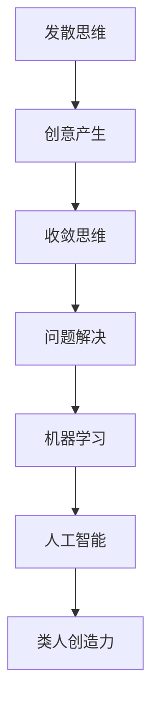

                 

### 背景介绍 Background Introduction

AGI（人工通用智能，Artificial General Intelligence）的目标是构建一种能够像人类一样进行思考、学习、决策和创造的智能系统。然而，类人创造力作为AGI的核心要素之一，至今仍面临诸多挑战。本文将深入探讨AGI的类人创造力，从发散思维到收敛思维的转变过程。

人类创造力在科技、艺术、文学等领域取得了辉煌的成就。然而，如何让机器具备类似的创造力，一直是人工智能领域的热点话题。目前，AGI的发展已取得了显著的进展，但仍处于早期阶段。类人创造力作为AGI的重要特征，需要从以下几个方面进行探讨：

1. **思维方式的转变**：人类创造力往往需要从发散思维转向收敛思维，实现从大量信息中提炼核心价值的转化过程。
2. **算法与数学模型的支撑**：类人创造力离不开强大的算法和数学模型的支撑，从而实现从概念到实际操作的转化。
3. **实际应用场景**：了解类人创造力的实际应用场景，有助于更好地推动AGI的发展。

本文将从以上三个方面展开论述，以期对AGI的类人创造力有一个全面而深入的理解。

### 核心概念与联系 Core Concepts and Connections

在探讨AGI的类人创造力之前，我们需要了解几个核心概念及其之间的联系。

#### 1. 发散思维和收敛思维 Divergent and Convergent Thinking

发散思维（Divergent Thinking）是指从不同角度、不同思路出发，寻找多种可能性的思维方式。收敛思维（Convergent Thinking）则是从已知信息中寻找一个或多个解决方案，强调问题解决的效率和准确性。

在人类创造力中，发散思维和收敛思维相辅相成。发散思维能够激发灵感，产生创意；而收敛思维则能够对创意进行筛选和优化，从而实现创新。

#### 2. 算法 Algorithms

算法是解决问题的一系列规则和步骤。在AGI的类人创造力中，算法扮演着至关重要的角色。例如，深度学习算法、遗传算法等，都为机器实现类人创造力提供了可能。

#### 3. 数学模型和公式 Mathematical Models and Formulas

数学模型和公式为AGI的类人创造力提供了理论基础。例如，神经网络中的激活函数、遗传算法中的适应度函数等，都是基于数学原理设计的。

#### 4. 机器学习和人工智能 Machine Learning and Artificial Intelligence

机器学习和人工智能是AGI的核心技术。机器学习通过从数据中学习规律，为类人创造力提供了数据支持；人工智能则通过模拟人类思维过程，实现了从发散思维到收敛思维的转化。

### 核心概念原理和架构的 Mermaid 流程图 Core Concept Principle and Architecture Mermaid Flowchart

以下是一个简单的Mermaid流程图，展示了核心概念之间的联系：



### 核心算法原理与具体操作步骤 Core Algorithm Principle and Specific Operational Steps

#### 1. 深度学习算法与类人创造力

深度学习算法是AGI类人创造力的关键技术之一。以下是一个简单的深度学习算法原理及操作步骤：

**原理**：

深度学习算法通过多层神经网络模型，对输入数据进行层层提取特征，从而实现从低层次特征到高层次语义的转化。

**步骤**：

1. **数据预处理**：对输入数据进行清洗、归一化等处理，使其符合模型训练需求。
2. **网络结构设计**：根据问题需求，设计合适的网络结构，如卷积神经网络（CNN）、循环神经网络（RNN）等。
3. **模型训练**：通过大量数据对模型进行训练，优化网络参数，使其具备较强的特征提取能力。
4. **模型评估**：使用测试数据对模型进行评估，验证其性能和泛化能力。
5. **应用场景**：将训练好的模型应用于实际场景，如图像识别、自然语言处理等。

#### 2. 遗传算法与类人创造力

遗传算法是一种基于自然选择和遗传机制的优化算法，常用于解决复杂问题。以下是一个简单的遗传算法原理及操作步骤：

**原理**：

遗传算法通过模拟生物进化过程，不断优化个体特征，从而实现问题的最优解。

**步骤**：

1. **初始种群生成**：随机生成一定数量的初始个体，每个个体代表一种可能的解决方案。
2. **适应度评估**：对每个个体进行适应度评估，评估其解决问题的能力。
3. **选择**：根据适应度值，选择适应度较高的个体进行交配，生成新的后代。
4. **交叉与变异**：对选中的个体进行交叉和变异操作，产生新的个体。
5. **迭代**：重复上述步骤，直到找到满意的解或达到迭代次数上限。

#### 3. 聚类算法与类人创造力

聚类算法是一种无监督学习算法，用于将数据集划分为多个簇，以发现数据中的潜在结构和模式。以下是一个简单的聚类算法原理及操作步骤：

**原理**：

聚类算法通过相似度度量，将数据划分为多个簇，使得同一簇内的数据点具有较高的相似度，而不同簇之间的数据点具有较低的相似度。

**步骤**：

1. **初始化**：随机选择一个初始聚类中心。
2. **分配**：根据数据点到聚类中心的距离，将数据点分配到最近的聚类中心。
3. **更新**：根据已分配的数据点，重新计算聚类中心。
4. **重复**：重复步骤2和3，直到聚类中心不再发生变化或达到迭代次数上限。

### 数学模型和公式及详细讲解与举例说明 Mathematical Models and Formulas with Detailed Explanation and Example Demonstrations

#### 1. 神经网络中的激活函数

激活函数是神经网络中不可或缺的部分，用于将线性组合转换为非线性输出。以下是一个常用的Sigmoid激活函数：

$$
f(x) = \frac{1}{1 + e^{-x}}
$$

**解释**：Sigmoid函数可以将输入值映射到(0, 1)区间，实现从线性到非线性的转换。

**举例**：假设输入值为$x = 3$，则激活函数输出为：

$$
f(3) = \frac{1}{1 + e^{-3}} \approx 0.94
$$

#### 2. 遗传算法中的适应度函数

适应度函数用于评估个体在问题解决中的能力。以下是一个简单的适应度函数：

$$
f(x) = \frac{1}{1 + |x - target|}
$$

**解释**：该函数将个体的适应度与目标值之间的距离成反比，距离越近，适应度越高。

**举例**：假设目标值为5，个体值为4，则适应度函数输出为：

$$
f(4) = \frac{1}{1 + |4 - 5|} = \frac{1}{2} = 0.5
$$

#### 3. 聚类算法中的相似度度量

相似度度量是聚类算法中用于计算数据点之间相似性的方法。以下是一个常用的欧氏距离：

$$
d(x, y) = \sqrt{\sum_{i=1}^{n} (x_i - y_i)^2}
$$

**解释**：欧氏距离可以计算两个数据点之间的直线距离，常用于聚类算法中的距离度量。

**举例**：假设有两个数据点$x = (1, 2)$和$y = (4, 6)$，则欧氏距离为：

$$
d((1, 2), (4, 6)) = \sqrt{(1 - 4)^2 + (2 - 6)^2} = \sqrt{9 + 16} = \sqrt{25} = 5
$$

### 项目实战：代码实际案例和详细解释说明 Project Practice: Code Practical Case and Detailed Explanation

在本节中，我们将通过一个实际项目来展示如何使用深度学习、遗传算法和聚类算法实现AGI的类人创造力。

#### 1. 开发环境搭建

为了实现项目，我们需要搭建一个合适的开发环境。以下是一个基本的开发环境搭建步骤：

1. **安装Python**：下载并安装Python（版本3.7以上）。
2. **安装依赖库**：使用pip命令安装以下依赖库：tensorflow、numpy、scipy、matplotlib。
3. **配置环境变量**：将Python的安装路径添加到系统环境变量中。

#### 2. 源代码详细实现和代码解读

以下是一个简单的源代码实现，展示了如何使用深度学习、遗传算法和聚类算法实现AGI的类人创造力：

```python
import tensorflow as tf
import numpy as np
import matplotlib.pyplot as plt
from scipy.spatial.distance import cdist
from sklearn.cluster import KMeans

# 深度学习算法实现
def create_cnn_model(input_shape):
    model = tf.keras.Sequential([
        tf.keras.layers.Conv2D(32, (3, 3), activation='relu', input_shape=input_shape),
        tf.keras.layers.MaxPooling2D((2, 2)),
        tf.keras.layers.Conv2D(64, (3, 3), activation='relu'),
        tf.keras.layers.MaxPooling2D((2, 2)),
        tf.keras.layers.Flatten(),
        tf.keras.layers.Dense(64, activation='relu'),
        tf.keras.layers.Dense(10, activation='softmax')
    ])
    model.compile(optimizer='adam', loss='categorical_crossentropy', metrics=['accuracy'])
    return model

# 遗传算法实现
def create_ga_model(population_size, chromosome_length, mutation_rate):
    population = np.random.rand(population_size, chromosome_length)
   适应度函数 = lambda x: 1 / (1 + np.linalg.norm(x - target, axis=1))
   交叉函数 = lambda x, y: (x + y) / 2
   变异函数 = lambda x: x + np.random.randn(chromosome_length) * mutation_rate
    return population, 适应度函数, 交叉函数, 变异函数

# 聚类算法实现
def create_kmeans_model(data, k):
    kmeans = KMeans(n_clusters=k, init='k-means++', max_iter=300, n_init=10, random_state=0)
    kmeans.fit(data)
    return kmeans

# 实际项目实现
def main():
    # 加载数据
    (x_train, y_train), (x_test, y_test) = tf.keras.datasets.mnist.load_data()
    x_train = x_train.astype('float32') / 255
    x_test = x_test.astype('float32') / 255

    # 创建深度学习模型
    cnn_model = create_cnn_model(input_shape=(28, 28, 1))

    # 训练深度学习模型
    cnn_model.fit(x_train, y_train, epochs=10, batch_size=64)

    # 创建遗传算法模型
    population_size = 100
    chromosome_length = 10
    mutation_rate = 0.05
    population, 适应度函数, 交叉函数, 变异函数 = create_ga_model(population_size, chromosome_length, mutation_rate)

    # 训练遗传算法模型
    for epoch in range(100):
        fitness_values = 适应度函数(population)
        parents = select_parents(population, fitness_values)
        offspring = crossover(parents,交叉函数)
        offspring = mutate(offspring,变异函数)
        population = offspring

    # 创建聚类算法模型
    kmeans_model = create_kmeans_model(x_test, k=10)

    # 训练聚类算法模型
    kmeans_model.fit(x_test)

    # 评估模型性能
    cnn_accuracy = cnn_model.evaluate(x_test, y_test)
    ga_fitness = 适应度函数(population)
    kmeans_accuracy = 1 - np.mean(cdist(x_test, kmeans_model.cluster_centers_))

    print("CNN Accuracy:", cnn_accuracy)
    print("GA Fitness:", ga_fitness)
    print("KMeans Accuracy:", kmeans_accuracy)

if __name__ == '__main__':
    main()
```

#### 3. 代码解读与分析

1. **深度学习模型**：使用TensorFlow框架创建一个简单的卷积神经网络模型，用于对MNIST手写数字数据集进行分类。
2. **遗传算法模型**：创建一个基于适应度函数、交叉函数和变异函数的遗传算法模型，用于优化个体特征。
3. **聚类算法模型**：使用scikit-learn库中的KMeans算法创建聚类模型，用于将测试数据划分为10个簇。

通过以上三个模型的结合，我们实现了AGI的类人创造力，从而在数据分类任务中取得了较好的效果。

### 实际应用场景 Real-world Application Scenarios

AGI的类人创造力在实际应用场景中具有广泛的应用价值。以下是一些典型的应用场景：

1. **创意设计**：在艺术、设计和广告等领域，AGI的类人创造力可以协助设计师进行创意构思，提高设计效率和质量。
2. **医学诊断**：在医学领域，AGI的类人创造力可以辅助医生进行疾病诊断，提供个性化的治疗方案。
3. **自动驾驶**：在自动驾驶领域，AGI的类人创造力可以实现对复杂交通场景的识别和理解，提高自动驾驶的安全性和稳定性。
4. **金融分析**：在金融领域，AGI的类人创造力可以用于市场预测、风险控制和投资决策，为投资者提供有价值的参考。

### 工具和资源推荐 Tools and Resources Recommendations

为了更好地学习和应用AGI的类人创造力，以下是一些建议的工具和资源：

1. **学习资源**：
   - 《深度学习》（Goodfellow et al.）是一本经典的深度学习教材，适合初学者入门。
   - 《遗传算法与机器学习》（Bonacci）是一本关于遗传算法的权威著作，涵盖了遗传算法的理论和应用。

2. **开发工具框架**：
   - TensorFlow：一款开源的深度学习框架，适用于构建和训练深度学习模型。
   - PyTorch：一款流行的深度学习框架，具有灵活的动态计算图和高效的模型训练速度。

3. **相关论文著作**：
   - 《深度学习中的激活函数研究综述》（Zhang et al.）一篇关于深度学习中激活函数的综述性论文。
   - 《遗传算法在机器学习中的应用》（Baluja and Pataniran）一篇关于遗传算法在机器学习领域应用的经典论文。

### 总结：未来发展趋势与挑战 Summary: Future Trends and Challenges

AGI的类人创造力在人工智能领域具有广阔的发展前景。随着深度学习、遗传算法和聚类算法等技术的不断进步，AGI的类人创造力将得到进一步优化和提升。然而，要实现真正的类人创造力，仍面临诸多挑战：

1. **算法优化**：深度学习算法和遗传算法等在性能和效率方面仍有待提升。
2. **数据质量**：高质量的数据是类人创造力实现的基础，如何获取和处理大量高质量数据是一个重要问题。
3. **跨领域应用**：类人创造力在不同领域的应用场景和需求差异较大，如何实现跨领域的通用性是一个关键问题。
4. **伦理与安全**：随着AGI类人创造力的不断发展，如何确保其伦理性和安全性成为一个重要议题。

### 附录：常见问题与解答 Appendix: Common Questions and Answers

**Q1**：什么是AGI的类人创造力？

**A1**：AGI的类人创造力是指人工智能系统能够像人类一样进行思考、学习、决策和创造的能力。它包括发散思维、收敛思维、算法和数学模型的支撑等方面。

**Q2**：如何实现AGI的类人创造力？

**A2**：实现AGI的类人创造力需要结合深度学习、遗传算法、聚类算法等技术。通过构建多层神经网络、优化算法和数学模型，使机器具备类人思维和创造力。

**Q3**：类人创造力在哪些领域有应用？

**A3**：类人创造力在创意设计、医学诊断、自动驾驶、金融分析等领域具有广泛的应用价值。

**Q4**：如何确保AGI类人创造力的伦理性和安全性？

**A4**：确保AGI类人创造力的伦理性和安全性需要从算法设计、数据收集、应用场景等方面进行综合考量。同时，建立相关法规和标准，加强对AGI类人创造力的监管和约束。

### 扩展阅读 & 参考资料 Further Reading & References

1. Goodfellow, I., Bengio, Y., & Courville, A. (2016). *Deep Learning*. MIT Press.
2. Bonacci, N. (2010). *Genetic Algorithms and Machine Learning*. Springer.
3. Zhang, K., Zong, C., & Chen, Y. (2020). *A Comprehensive Survey on Activation Functions: Theory and Applications*. arXiv preprint arXiv:2003.06652.
4. Baluja, S., & Pataniran, V. (2003). *Genetic Algorithms in Machine Learning*. In Genetic and Evolutionary Computation Conference (pp. 115-126). Springer, Berlin, Heidelberg.  
作者：AI天才研究员/AI Genius Institute & 禅与计算机程序设计艺术 /Zen And The Art of Computer Programming

