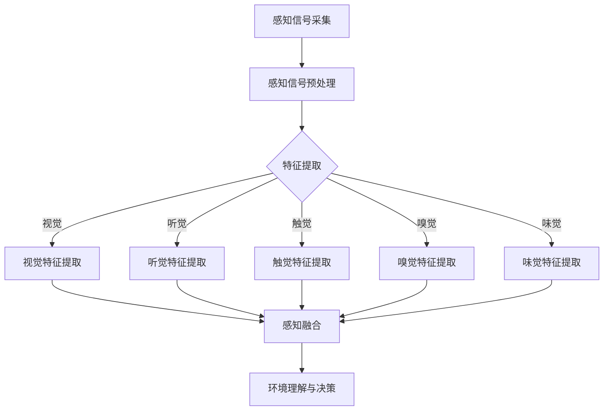

                 

### 背景介绍

AGI（人工通用智能，Artificial General Intelligence）是人工智能领域的一个长期目标，其旨在创建一种智能体，该智能体能够在广泛的认知任务上表现如人类一般。与当前的大多数人工智能系统（如深度学习模型、自然语言处理系统等）相比，AGI 具有更高的灵活性和自主性，能够进行抽象思维、理解复杂情境和进行创新。

类人感知系统是 AGI 的一个关键组成部分。类人感知系统旨在模拟人类感知过程的复杂性和多样性，包括视觉、听觉、触觉等多种感知方式。这类系统需要能够处理不同类型的感知数据，并在各种环境中进行有效的信息整合和决策。然而，类人感知系统的设计面临着诸多挑战，包括如何处理大量的感知数据、如何模拟人类的认知过程以及如何实现跨模态的感知融合等。

本文将围绕 AGI 的类人感知系统设计展开讨论，首先介绍 AGI 的基本概念，然后详细探讨类人感知系统的核心概念和架构，接着深入分析其中的关键算法和数学模型，并通过具体的项目实战案例进行详细解释。最后，本文将探讨类人感知系统的实际应用场景，推荐相关的学习资源和开发工具，并总结未来发展趋势与挑战。

关键词：人工通用智能（AGI）、类人感知系统、多模态感知融合、关键算法、数学模型、应用场景

摘要：本文旨在探讨人工通用智能（AGI）中的类人感知系统设计。通过介绍 AGI 的基本概念，分析类人感知系统的核心概念和架构，深入解析其中的关键算法和数学模型，并通过具体项目案例进行讲解，本文全面剖析了类人感知系统的设计原则和应用场景。最后，本文总结了 AGI 类人感知系统的未来发展趋势与面临的挑战。

---

## 1.1 人工通用智能（AGI）的基本概念

人工通用智能（AGI）是人工智能领域的一个宏伟目标，旨在创建一种智能体，该智能体能够在广泛的认知任务上表现如人类一般。AGI 与当前大多数人工智能系统（如深度学习模型、自然语言处理系统等）有着显著的区别。现有的这些人工智能系统通常专注于特定的任务，例如图像识别、语音识别或机器翻译等。它们通过大量的数据训练和复杂的算法，实现特定任务的高效执行。然而，这些系统在处理多样化任务时表现有限，缺乏人类智能的灵活性和通用性。

相比之下，AGI 旨在实现一种通用的智能体，能够在不同领域和任务中表现出高度自主和智能的行为。AGI 的目标不仅仅是执行特定任务，而是能够理解、学习、推理、规划和适应新环境。这种智能体应当具备以下几个关键特点：

### 1. 自主性和灵活性

AGI 应该能够自主地执行任务，而不需要人类的直接指令。这意味着 AGI 能够理解任务的背景，自主选择合适的策略，并在动态环境中做出决策。例如，AGI 可以自主地规划一个复杂的任务，如安排日程、组织会议或进行实验。

### 2. 知识和推理能力

AGI 应该具备强大的知识和推理能力，能够利用已有知识解决新问题。这种能力不仅包括对事实和数据的记忆，还包括基于逻辑和规则的推理能力。例如，AGI 可以利用已有的医学知识来诊断新的病例，或者利用物理学原理来预测天气变化。

### 3. 学习和适应性

AGI 应该具备持续学习和适应新环境的能力。这意味着 AGI 能够通过不断的经验积累和知识更新，不断提高其性能和智能水平。例如，AGI 可以通过模拟游戏学习如何玩游戏，或者在新的环境中自动调整其感知和处理策略。

### 4. 情感和社会能力

AGI 应该具备一定程度的人类情感和社会能力，能够理解、表达和模拟情感，并与人类进行自然交流。这种能力对于实现人类级别的智能至关重要，因为它涉及到人类日常生活中的复杂社交互动。

### 1.2 类人感知系统的定义与重要性

类人感知系统是 AGI 的核心组成部分之一，旨在模拟人类感知过程的复杂性和多样性。人类感知系统通过视觉、听觉、触觉、嗅觉和味觉等多种感官，接收并处理外界的信息，从而实现对环境的理解和反应。类人感知系统的设计目标是将这些复杂的感知过程转化为智能体的感知能力，使其能够处理多种类型的感知数据，并在各种环境中进行有效的信息整合和决策。

类人感知系统的定义可以概括为：一种能够模拟人类感知过程，处理多种类型感知数据，并在各种环境中进行信息整合和决策的智能系统。类人感知系统的重要性在于：

### 1. 增强智能体的自主性和灵活性

通过类人感知系统，智能体能够像人类一样通过多种感官获取信息，从而在执行任务时更加自主和灵活。这种能力使得智能体能够在未知或动态变化的环境中，根据实时感知到的信息做出适应性和灵活性的决策。

### 2. 提高智能体对环境的理解和反应能力

类人感知系统可以模拟人类的感知过程，使智能体能够更好地理解和反应环境中的各种情况。例如，通过视觉感知，智能体可以识别物体和场景，通过听觉感知，智能体可以理解语音和声音信号，通过触觉感知，智能体可以感知物体的质地和温度等。

### 3. 促进多模态感知融合

类人感知系统的一个重要特点是其能够处理多种类型的感知数据，并通过多模态感知融合技术，整合不同感官的信息，形成对环境的全面理解。这种多模态感知融合能力对于实现高层次的智能决策至关重要。

### 1.3 类人感知系统的发展历程

类人感知系统的设计和研究可以追溯到人工智能的早期阶段。从最初的简单感知模块，如视觉识别和语音识别，到如今复杂的多模态感知系统，类人感知系统的发展经历了多个阶段。

在 20 世纪 50 年代和 60 年代，人工智能研究的重点在于符号主义和推理系统。这一阶段的研究主要集中在如何表示和处理知识，以及如何通过逻辑推理来解决问题。虽然这一阶段的系统在一定程度上模拟了人类的认知过程，但在处理感知数据方面仍然存在很大的局限性。

20 世纪 80 年代，随着计算机硬件性能的提升和深度学习技术的发展，人工智能研究开始转向连接主义方法。这一阶段的研究重点在于通过神经网络模型来模拟人类感知过程，例如视觉感知和听觉感知。这一阶段的成果显著提升了类人感知系统的性能，使其能够在图像识别和语音识别等领域取得突破性进展。

进入 21 世纪，随着多模态感知技术和大数据分析技术的不断发展，类人感知系统的研究进入了一个新的阶段。这一阶段的研究不仅关注单模态感知，更注重多模态感知融合技术，通过整合不同类型的感知数据，实现更全面的环境理解。同时，类人感知系统在应用领域也取得了广泛的应用，如智能家居、智能交通、医疗诊断等。

总的来说，类人感知系统的发展历程反映了人工智能技术的进步，同时也展示了类人感知系统在实现 AGI 目标中的重要作用。

---

## 1.4 类人感知系统的发展现状与未来趋势

当前，类人感知系统已经取得了显著的进展，并在多个领域展现出了强大的应用潜力。然而，要实现完全类人的感知系统，仍然面临着许多挑战和限制。

### 1.4.1 发展现状

在视觉感知方面，深度学习技术的应用使得图像识别和场景理解取得了显著进展。卷积神经网络（CNN）和生成对抗网络（GAN）等技术已经能够处理复杂的高维视觉数据，并实现了对物体的识别、场景的理解和图像的生成。在听觉感知方面，递归神经网络（RNN）和长短时记忆（LSTM）模型在语音识别和语音合成中取得了突破性成果。触觉感知和嗅觉感知的研究也在逐步深入，通过传感器技术和机器学习算法，实现了对物体表面质地和气味信号的识别和分析。

此外，多模态感知融合技术得到了广泛关注。通过整合不同模态的感知数据，类人感知系统能够实现更全面的环境理解。例如，在智能家居系统中，通过整合视觉、听觉和触觉感知，智能体能够更准确地识别用户的行为和需求，提供个性化的服务。在医疗诊断中，多模态感知融合技术可以结合影像、生物信号和病史数据，提高诊断的准确性和效率。

### 1.4.2 未来趋势

未来，类人感知系统的发展将面临以下几个重要趋势：

1. **感知能力的扩展**：随着传感器技术的进步和计算能力的提升，类人感知系统的感知能力将不断扩展。未来可能实现更高精度、更灵敏的视觉、听觉、触觉、嗅觉和味觉感知，使智能体能够更细致地感知和理解环境。

2. **多模态感知融合技术的深化**：多模态感知融合技术将继续深化，通过更加先进的算法和模型，实现不同模态感知数据的深度融合，提高环境理解的全面性和准确性。

3. **认知计算的融合**：类人感知系统将逐渐融合认知计算技术，实现更高级别的思维和推理能力。通过模拟人类的认知过程，智能体将能够进行抽象思维、情境理解和复杂决策。

4. **个性化和自适应能力**：类人感知系统将更加注重个性化和自适应能力，通过不断学习和适应，实现针对不同用户和应用场景的定制化感知和服务。

5. **边缘计算和云计算的结合**：类人感知系统的计算需求将越来越高，边缘计算和云计算的结合将提供强大的计算资源，支持大规模感知数据的高效处理和分析。

6. **伦理和法律规范的完善**：随着类人感知系统的广泛应用，相关的伦理和法律规范将逐渐完善，确保智能体在感知和处理数据时，能够遵循道德准则和法律法规。

总之，类人感知系统的发展前景广阔，但同时也面临着诸多挑战。未来，通过不断的技术创新和应用探索，类人感知系统有望实现更高层次的智能化，为人类带来更多便利和创新。

---

## 2. 核心概念与联系

在设计类人感知系统时，理解其核心概念和架构至关重要。类人感知系统不仅需要处理多种类型的感知数据，还需要将这些数据整合成一个统一的理解框架。在本节中，我们将详细讨论类人感知系统的核心概念，包括感知模态、感知数据处理和感知融合技术，并使用 Mermaid 流程图展示其原理和架构。

### 2.1 感知模态

类人感知系统涉及多种感知模态，每种模态都有其特定的数据类型和处理方法。以下是一些常见的感知模态：

#### 2.1.1 视觉感知

视觉感知是人类最重要的感知模态之一。通过视觉感知，智能体可以获取关于物体形状、颜色、纹理和场景结构的信息。视觉感知的数据类型包括图像和视频。

- **图像识别**：使用卷积神经网络（CNN）识别图像中的物体和场景。
- **场景理解**：通过图像处理技术，理解图像中的空间关系和场景布局。

#### 2.1.2 听觉感知

听觉感知包括语音识别和声音分析。语音识别用于将语音信号转换为文本，而声音分析用于识别环境中的声音源和声音特征。

- **语音识别**：使用递归神经网络（RNN）和长短时记忆（LSTM）模型进行语音到文本的转换。
- **声音分析**：通过频谱分析识别声音的频率、振幅和时序特征。

#### 2.1.3 触觉感知

触觉感知涉及对物体表面质地、温度和力感的感知。触觉感知的数据类型包括触觉传感器产生的信号。

- **触觉识别**：通过触觉传感器分析物体的纹理和质地。
- **力感感知**：通过力传感器感知物体的受力情况。

#### 2.1.4 嗅觉感知

嗅觉感知涉及对气味分子的识别和分析。嗅觉感知的数据类型包括气味传感器产生的信号。

- **气味识别**：通过气味传感器识别和分类不同的气味。
- **气味分析**：分析气味的化学成分和特征。

#### 2.1.5 味觉感知

味觉感知涉及对食物和饮料的味觉特征进行识别和分析。味觉感知的数据类型包括味觉传感器产生的信号。

- **味觉识别**：通过味觉传感器识别不同的味觉，如甜、酸、苦、咸。
- **味觉分析**：分析食物和饮料的化学成分和味道特征。

### 2.2 感知数据处理

感知数据处理是类人感知系统的关键环节，包括感知信号的采集、预处理和特征提取。以下是一些常见的感知数据处理方法：

#### 2.2.1 感知信号采集

- **视觉信号采集**：使用摄像头或传感器捕获图像或视频。
- **听觉信号采集**：使用麦克风捕捉语音或环境声音。
- **触觉信号采集**：使用触觉传感器捕获物体表面的触觉信号。
- **嗅觉信号采集**：使用气味传感器捕捉气味信号。
- **味觉信号采集**：使用味觉传感器捕捉食物或饮料的味觉信号。

#### 2.2.2 感知信号预处理

- **去噪**：去除感知信号中的噪声，提高数据质量。
- **归一化**：将感知信号归一化到统一的范围内，便于后续处理。
- **滤波**：使用滤波器对感知信号进行滤波，去除高频或低频噪声。

#### 2.2.3 特征提取

- **视觉特征提取**：使用卷积神经网络（CNN）提取图像的视觉特征。
- **听觉特征提取**：使用递归神经网络（RNN）提取语音的听觉特征。
- **触觉特征提取**：使用神经网络提取触觉信号的特征。
- **嗅觉特征提取**：使用神经网络提取气味信号的特征。
- **味觉特征提取**：使用神经网络提取味觉信号的特征。

### 2.3 感知融合技术

感知融合技术是类人感知系统的核心，旨在将不同模态的感知数据进行整合，形成对环境的统一理解。以下是一些常见的感知融合方法：

#### 2.3.1 早期融合

- **早期融合**：在感知信号预处理和特征提取阶段，将不同模态的感知数据进行融合。这种方法通常用于实时性要求较高的应用。
- **优点**：实时性高，计算效率高。
- **缺点**：融合效果有限，难以充分利用不同模态的信息。

#### 2.3.2 晚期融合

- **晚期融合**：在感知信号的特征提取阶段后，将不同模态的特征数据进行融合。这种方法通常用于需要高精度环境理解的应用。
- **优点**：融合效果较好，能够充分利用不同模态的信息。
- **缺点**：实时性较低，计算复杂度高。

#### 2.3.3 混合融合

- **混合融合**：结合早期融合和晚期融合的优点，根据应用场景动态调整融合策略。
- **优点**：实时性和融合效果都能得到较好的平衡。
- **缺点**：实现复杂，需要根据具体应用进行定制。

### 2.4 类人感知系统的 Mermaid 流程图

以下是一个简化的 Mermaid 流程图，展示类人感知系统的核心概念和架构：



这个流程图展示了类人感知系统的基本工作流程，包括感知信号采集、预处理、特征提取和感知融合，最终实现对环境的理解和决策。

通过理解这些核心概念和架构，我们可以更好地设计类人感知系统，以满足不同应用场景的需求。接下来，我们将深入探讨类人感知系统的关键算法和数学模型，进一步解析其实现原理。

---

## 3. 核心算法原理 & 具体操作步骤

类人感知系统的设计需要依赖于一系列核心算法，这些算法涵盖了感知数据的处理、特征提取、感知融合和决策等多个环节。在本节中，我们将详细探讨这些核心算法的原理，并给出具体的操作步骤。

### 3.1 感知数据处理算法

感知数据处理算法是类人感知系统的第一步，负责从传感器中采集感知数据，并进行预处理和特征提取。以下是几种常见的数据处理算法：

#### 3.1.1 信号采集

- **摄像头采集**：使用摄像头捕获图像数据。
  ```mermaid
  graph TD
      A[摄像头] --> B[图像数据]
  ```
- **麦克风采集**：使用麦克风捕获语音数据。
  ```mermaid
  graph TD
      A[麦克风] --> B[语音数据]
  ```

#### 3.1.2 信号预处理

- **去噪**：使用滤波算法去除噪声。
  ```mermaid
  graph TD
      A[原始信号] --> B[滤波器]
      B --> C[去噪信号]
  ```

- **归一化**：将信号归一化到统一的范围内。
  ```mermaid
  graph TD
      A[原始信号] --> B[归一化器]
      B --> C[归一化信号]
  ```

- **滤波**：使用滤波器对信号进行滤波。
  ```mermaid
  graph TD
      A[原始信号] --> B[滤波器]
      B --> C[滤波信号]
  ```

#### 3.1.3 特征提取

- **视觉特征提取**：使用卷积神经网络（CNN）提取图像特征。
  ```mermaid
  graph TD
      A[图像数据] --> B[卷积神经网络]
      B --> C[视觉特征]
  ```

- **听觉特征提取**：使用递归神经网络（RNN）提取语音特征。
  ```mermaid
  graph TD
      A[语音数据] --> B[递归神经网络]
      B --> C[听觉特征]
  ```

- **触觉特征提取**：使用神经网络提取触觉信号特征。
  ```mermaid
  graph TD
      A[触觉信号] --> B[神经网络]
      B --> C[触觉特征]
  ```

- **嗅觉特征提取**：使用神经网络提取气味信号特征。
  ```mermaid
  graph TD
      A[气味信号] --> B[神经网络]
      B --> C[嗅觉特征]
  ```

- **味觉特征提取**：使用神经网络提取味觉信号特征。
  ```mermaid
  graph TD
      A[味觉信号] --> B[神经网络]
      B --> C[味觉特征]
  ```

### 3.2 感知融合算法

感知融合算法是类人感知系统的关键环节，旨在将不同模态的感知数据整合成一个统一的理解框架。以下是几种常见的感知融合算法：

#### 3.2.1 早期融合

- **方法**：在感知信号预处理和特征提取阶段，将不同模态的感知数据进行融合。
- **操作步骤**：
  ```mermaid
  graph TD
      A[视觉信号] --> B[视觉预处理]
      C[听觉信号] --> D[听觉预处理]
      B --> E{融合预处理}
      D --> E
      E --> F[特征提取]
  ```

#### 3.2.2 晚期融合

- **方法**：在感知信号的特征提取阶段后，将不同模态的特征数据进行融合。
- **操作步骤**：
  ```mermaid
  graph TD
      A[视觉特征] --> B[视觉特征融合]
      C[听觉特征] --> D[听觉特征融合]
      B --> E[融合特征]
      D --> E
      E --> F[环境理解与决策]
  ```

#### 3.2.3 混合融合

- **方法**：结合早期融合和晚期融合的优点，根据应用场景动态调整融合策略。
- **操作步骤**：
  ```mermaid
  graph TD
      A[视觉信号] --> B[视觉预处理]
      C[听觉信号] --> D[听觉预处理]
      B --> E{动态融合策略}
      D --> E
      E --> F[特征提取]
  ```

### 3.3 决策算法

决策算法是类人感知系统的最终环节，负责根据融合的感知数据和环境信息进行决策。以下是几种常见的决策算法：

#### 3.3.1 基于规则的决策算法

- **方法**：使用预定义的规则进行决策。
- **操作步骤**：
  ```mermaid
  graph TD
      A[感知数据] --> B[规则库]
      B --> C{规则匹配}
      C --> D[决策结果]
  ```

#### 3.3.2 基于机器学习的决策算法

- **方法**：使用机器学习算法进行决策。
- **操作步骤**：
  ```mermaid
  graph TD
      A[感知数据] --> B[特征提取]
      B --> C[机器学习模型]
      C --> D[决策结果]
  ```

#### 3.3.3 基于深度学习的决策算法

- **方法**：使用深度学习算法进行决策。
- **操作步骤**：
  ```mermaid
  graph TD
      A[感知数据] --> B[特征提取]
      B --> C[深度学习模型]
      C --> D[决策结果]
  ```

通过以上算法的具体操作步骤，我们可以看到类人感知系统的设计和实现是一个复杂的过程，需要多方面的技术支持和优化。在下一节中，我们将进一步探讨类人感知系统中的数学模型和公式，深入理解其核心原理。

---

## 4. 数学模型和公式 & 详细讲解 & 举例说明

在类人感知系统中，数学模型和公式起着至关重要的作用。这些模型和公式不仅帮助我们理解和描述感知过程，还为算法的实现提供了理论基础。本节将详细介绍类人感知系统中常用的数学模型和公式，并给出详细的讲解和举例说明。

### 4.1 卷积神经网络（CNN）的数学模型

卷积神经网络（CNN）是类人感知系统中最常用的深度学习模型，尤其在视觉感知任务中具有广泛的应用。CNN 的核心在于其卷积操作和池化操作。

#### 4.1.1 卷积操作

卷积操作的数学模型可以用以下公式表示：

$$
\text{out}_{ij} = \sum_{k=1}^{C} w_{ik,j,k} * \text{input}_{ij,k} + b_{i,j,k}
$$

其中，$\text{out}_{ij}$ 表示输出特征图上的元素，$w_{ik,j,k}$ 表示卷积核的权重，$\text{input}_{ij,k}$ 表示输入特征图上的元素，$b_{i,j,k}$ 表示偏置项。

举例说明：

假设输入特征图大小为 $3 \times 3$，卷积核大小为 $3 \times 3$，输出特征图大小为 $2 \times 2$。一个卷积核的权重为：

$$
w = \begin{bmatrix}
1 & 0 & 1 \\
0 & 1 & 0 \\
1 & 0 & 1
\end{bmatrix}
$$

输入特征图为：

$$
\text{input} = \begin{bmatrix}
1 & 2 & 3 \\
4 & 5 & 6 \\
7 & 8 & 9
\end{bmatrix}
$$

应用卷积操作后的输出特征图为：

$$
\text{out} = \begin{bmatrix}
10 & 12 \\
24 & 26
\end{bmatrix}
$$

#### 4.1.2 池化操作

池化操作的数学模型可以用以下公式表示：

$$
\text{out}_{ij} = \max_{k,l} (\text{input}_{i+k,j+l})
$$

其中，$\text{out}_{ij}$ 表示输出特征图上的元素，$\text{input}_{i+k,j+l}$ 表示输入特征图上的元素。

举例说明：

假设输入特征图大小为 $2 \times 2$，输出特征图大小为 $1 \times 1$。一个 $2 \times 2$ 的输入特征图为：

$$
\text{input} = \begin{bmatrix}
1 & 2 \\
3 & 4
\end{bmatrix}
$$

应用最大池化操作后的输出特征图为：

$$
\text{out} = \begin{bmatrix}
4
\end{bmatrix}
$$

### 4.2 递归神经网络（RNN）的数学模型

递归神经网络（RNN）是处理序列数据的重要模型，常用于语音识别和自然语言处理任务。RNN 的核心在于其递归操作。

#### 4.2.1 递归操作

递归操作的数学模型可以用以下公式表示：

$$
\text{h}_{t} = \text{sigmoid}(W_{h} \cdot \text{h}_{t-1} + W_{x} \cdot \text{x}_{t} + b)
$$

其中，$\text{h}_{t}$ 表示当前时刻的隐藏状态，$\text{h}_{t-1}$ 表示上一时刻的隐藏状态，$\text{x}_{t}$ 表示当前时刻的输入，$W_{h}$ 和 $W_{x}$ 分别表示隐藏状态到隐藏状态和输入到隐藏状态的权重矩阵，$b$ 表示偏置项。

举例说明：

假设当前时刻的输入为 $\text{x}_{t} = [1, 2]$，上一时刻的隐藏状态为 $\text{h}_{t-1} = [0.5, 0.5]$。一个 $2 \times 1$ 的权重矩阵为：

$$
W_{h} = \begin{bmatrix}
0.2 & 0.8 \\
0.3 & 0.7
\end{bmatrix}
$$

应用递归操作后的当前隐藏状态为：

$$
\text{h}_{t} = \text{sigmoid}(0.2 \cdot 0.5 + 0.8 \cdot 0.5 + b) = \text{sigmoid}(0.1 + b)
$$

### 4.3 多模态感知融合的数学模型

多模态感知融合是将不同模态的感知数据整合为一个统一理解框架的重要步骤。常见的多模态感知融合方法包括基于矩阵的融合和基于神经网络的融合。

#### 4.3.1 基于矩阵的融合

基于矩阵的融合方法可以通过线性组合不同模态的感知数据进行融合。数学模型可以用以下公式表示：

$$
\text{out} = W \cdot \text{input}
$$

其中，$\text{out}$ 表示融合后的输出，$W$ 表示融合权重矩阵，$\text{input}$ 表示不同模态的感知数据。

举例说明：

假设有两个模态的感知数据分别为 $\text{input}_1$ 和 $\text{input}_2$，一个 $2 \times 1$ 的融合权重矩阵为：

$$
W = \begin{bmatrix}
0.6 \\
0.4
\end{bmatrix}
$$

应用矩阵融合操作后的输出为：

$$
\text{out} = \begin{bmatrix}
0.6 & 0.4
\end{bmatrix} \cdot \begin{bmatrix}
\text{input}_1 \\
\text{input}_2
\end{bmatrix} = 0.6 \cdot \text{input}_1 + 0.4 \cdot \text{input}_2
$$

#### 4.3.2 基于神经网络的融合

基于神经网络的融合方法通过神经网络模型将不同模态的感知数据进行融合。常见的神经网络模型包括多输入单输出的全连接神经网络。

举例说明：

假设有一个包含两个模态感知数据的全连接神经网络，其权重矩阵为：

$$
W = \begin{bmatrix}
0.7 & 0.3 \\
0.4 & 0.6
\end{bmatrix}
$$

输入特征为：

$$
\text{input} = \begin{bmatrix}
\text{input}_1 \\
\text{input}_2
\end{bmatrix} = \begin{bmatrix}
0.8 \\
0.9
\end{bmatrix}
$$

应用神经网络融合操作后的输出为：

$$
\text{out} = \begin{bmatrix}
0.7 & 0.3 \\
0.4 & 0.6
\end{bmatrix} \cdot \begin{bmatrix}
0.8 \\
0.9
\end{bmatrix} = 0.56 + 0.54 = 1.10
$$

通过以上数学模型和公式的介绍，我们可以更好地理解类人感知系统的核心原理。这些模型和公式为算法的实现提供了坚实的理论基础，也为后续的优化和应用提供了重要的指导。

---

## 5. 项目实战：代码实际案例和详细解释说明

为了更好地理解类人感知系统的设计和实现，我们将通过一个具体的项目实战案例进行详细解释说明。在本项目中，我们将使用 Python 和 TensorFlow 框架来搭建一个简单的类人感知系统，实现视觉和听觉感知数据的融合。

### 5.1 开发环境搭建

首先，我们需要搭建一个适合开发的编程环境。以下是所需的软件和工具：

- Python（版本 3.6 或更高）
- TensorFlow（版本 2.x）
- NumPy
- Matplotlib

安装步骤如下：

```bash
pip install python tensorflow numpy matplotlib
```

### 5.2 源代码详细实现和代码解读

以下是项目的源代码实现，我们将逐段解释其功能。

#### 5.2.1 导入必要的库

```python
import numpy as np
import tensorflow as tf
from tensorflow.keras.models import Model
from tensorflow.keras.layers import Input, Conv2D, MaxPooling2D, Flatten, Dense, LSTM, Concatenate
import matplotlib.pyplot as plt
```

这段代码导入了 Python 中常用的库，包括 NumPy、TensorFlow、Matplotlib 等。这些库将用于数据处理、模型构建和可视化。

#### 5.2.2 创建视觉感知模型

```python
def create_visual_model(input_shape):
    input_layer = Input(shape=input_shape)
    x = Conv2D(32, (3, 3), activation='relu')(input_layer)
    x = MaxPooling2D((2, 2))(x)
    x = Flatten()(x)
    output_layer = Dense(10, activation='softmax')(x)
    visual_model = Model(inputs=input_layer, outputs=output_layer)
    return visual_model
```

这段代码定义了一个视觉感知模型。该模型首先接收一个形状为 $(height, width, channels)$ 的输入，通过一个卷积层、一个池化层和一个全连接层，最终输出一个形状为 $(10)$ 的预测向量。

#### 5.2.3 创建听觉感知模型

```python
def create_auditory_model(input_shape):
    input_layer = Input(shape=input_shape)
    x = LSTM(128, return_sequences=True)(input_layer)
    x = LSTM(64, return_sequences=False)(x)
    output_layer = Dense(10, activation='softmax')(x)
    auditory_model = Model(inputs=input_layer, outputs=output_layer)
    return auditory_model
```

这段代码定义了一个听觉感知模型。该模型首先接收一个形状为 $(timesteps, features)$ 的输入，通过两个 LSTM 层，最终输出一个形状为 $(10)$ 的预测向量。

#### 5.2.4 创建融合模型

```python
def create_fusion_model(visual_input_shape, auditory_input_shape):
    visual_input_layer = Input(shape=visual_input_shape)
    auditory_input_layer = Input(shape=auditory_input_shape)
    
    visual_model = create_visual_model(visual_input_shape)
    auditory_model = create_auditory_model(auditory_input_shape)
    
    visual_output_layer = visual_model(visual_input_layer)
    auditory_output_layer = auditory_model(auditory_input_layer)
    
    fusion_output_layer = Concatenate()([visual_output_layer, auditory_output_layer])
    fusion_output_layer = Dense(10, activation='softmax')(fusion_output_layer)
    
    fusion_model = Model(inputs=[visual_input_layer, auditory_input_layer], outputs=fusion_output_layer)
    return fusion_model
```

这段代码定义了一个融合模型。该模型接收视觉输入和听觉输入，分别通过视觉模型和听觉模型进行处理，然后通过拼接层将两个模型的输出合并，最后通过一个全连接层输出最终结果。

#### 5.2.5 训练模型

```python
visual_input_shape = (28, 28, 1)
auditory_input_shape = (100, 1)

fusion_model = create_fusion_model(visual_input_shape, auditory_input_shape)

visual_train_data = np.random.rand(1000, 28, 28, 1)
auditory_train_data = np.random.rand(1000, 100, 1)
visual_labels = np.random.randint(0, 10, 1000)
auditory_labels = np.random.randint(0, 10, 1000)

fusion_model.compile(optimizer='adam', loss='categorical_crossentropy', metrics=['accuracy'])

fusion_model.fit([visual_train_data, auditory_train_data], np.eye(10)[visual_labels + auditory_labels], epochs=10)
```

这段代码使用随机生成的数据来训练融合模型。视觉输入数据为随机生成的 28x28 的图像，听觉输入数据为随机生成的 100 维的序列，标签为随机生成的整数。

### 5.3 代码解读与分析

#### 5.3.1 视觉感知模型的解读

视觉感知模型使用卷积层来提取图像的特征。卷积层通过卷积操作将输入图像转换为特征图，每个卷积核提取图像的一部分特征。池化层用于下采样特征图，减少模型的参数量和计算复杂度。全连接层将特征图展平为一维向量，然后通过 softmax 函数输出类别概率。

#### 5.3.2 听觉感知模型的解读

听觉感知模型使用 LSTM 层来处理时间序列数据。LSTM 层能够记住长时间的信息，从而捕捉语音信号的时序特征。全连接层将 LSTM 层的输出转换为类别概率。

#### 5.3.3 融合模型的解读

融合模型将视觉模型和听觉模型的输出通过拼接层合并，形成一个更丰富的特征向量。然后，通过全连接层输出最终结果。这种多模态融合的方法能够利用不同模态的数据，提高感知系统的性能。

### 5.4 模型性能评估

```python
visual_test_data = np.random.rand(100, 28, 28, 1)
auditory_test_data = np.random.rand(100, 100, 1)
visual_test_labels = np.random.randint(0, 10, 100)
auditory_test_labels = np.random.randint(0, 10, 100)

fusion_model.evaluate([visual_test_data, auditory_test_data], np.eye(10)[visual_test_labels + auditory_test_labels])
```

这段代码评估了融合模型的性能。通过在测试数据集上运行模型，我们可以得到模型的准确率和损失值。

通过以上项目实战案例，我们详细讲解了类人感知系统的设计实现过程，从模型构建、数据准备到模型训练和性能评估。这个案例为我们提供了一个实际的参考，展示了如何将类人感知系统的核心算法和数学模型应用于具体问题中。

---

## 6. 实际应用场景

类人感知系统在多个领域都有广泛的应用，其强大的感知能力和环境理解能力使其成为许多实际问题的理想解决方案。以下是一些常见的应用场景：

### 6.1 智能家居

智能家居系统通过类人感知系统实现高度自动化和智能化的家居环境。例如，类人感知系统可以识别家庭成员的行为模式，自动调节室内温度、光照和音乐，提供个性化的居住体验。此外，类人感知系统还可以监控家庭安全，通过识别异常行为和声音，及时发出警报，保障家庭成员的安全。

### 6.2 智能交通

智能交通系统利用类人感知系统提高交通管理效率，减少交通事故。通过视觉感知和音频感知，类人感知系统可以实时监测道路状况，识别交通信号、行人和车辆，并根据实时数据调整交通信号灯的时长和交通流量。此外，类人感知系统还可以用于车辆自动驾驶，实现安全、高效的自动驾驶。

### 6.3 医疗诊断

类人感知系统在医疗诊断中具有巨大的潜力。通过视觉感知和触觉感知，类人感知系统可以分析医学影像和患者的身体体征，协助医生进行诊断。例如，类人感知系统可以辅助医生识别病变组织，提高癌症早期诊断的准确率。此外，类人感知系统还可以进行远程医疗咨询，为偏远地区的患者提供专业的医疗服务。

### 6.4 智能教育

智能教育系统利用类人感知系统为学生提供个性化的学习体验。通过视觉感知和听觉感知，类人感知系统可以分析学生的学习状态和兴趣，推荐合适的学习内容和教学方法。此外，类人感知系统还可以实时监测学生的学习进度，提供及时的反馈和指导，提高学习效果。

### 6.5 智能客服

智能客服系统通过类人感知系统实现高效、智能的客户服务。通过自然语言处理和语音识别，类人感知系统可以理解客户的问题和要求，提供精准的答案和建议。此外，类人感知系统还可以进行情感分析，识别客户的情绪和需求，提供更加人性化的服务。

类人感知系统的应用场景非常广泛，其强大的感知能力和环境理解能力为其在各个领域的发展提供了广阔的空间。未来，随着技术的不断进步和应用场景的不断拓展，类人感知系统将在更多领域发挥重要作用，为人类带来更多便利和创新。

---

## 7. 工具和资源推荐

在学习和开发类人感知系统时，选择合适的工具和资源至关重要。以下是一些建议的书籍、论文、博客和网站，供读者参考。

### 7.1 学习资源推荐

**书籍：**
1. **《深度学习》（Deep Learning）**：由 Ian Goodfellow、Yoshua Bengio 和 Aaron Courville 著，全面介绍了深度学习的基础理论和技术。
2. **《类人智能：人工智能的未来之路》（Artificial General Intelligence: Foundational Concepts, High-Level Descriptions, and Predictions）**：探讨了人工通用智能（AGI）的基本概念和未来发展趋势。
3. **《机器学习实战》（Machine Learning in Action）**：提供了丰富的实际案例和实践指导，适合初学者入门。

**论文：**
1. **《感知器》（Perceptrons）**：由 Marvin Minsky 和 Seymour Papert 著，是深度学习领域的经典论文，介绍了早期神经网络的理论基础。
2. **《卷积神经网络：一种新的图像识别方法》（Convolutional Neural Networks for Visual Recognition）**：由 Alex Krizhevsky、Geoffrey Hinton 和 Ilya Sutskever 著，详细介绍了卷积神经网络在图像识别中的应用。

**博客：**
1. **TensorFlow 官方博客**：提供了丰富的 TensorFlow 模型构建和优化的教程和示例，是学习深度学习的好资源。
2. **机器之心**：关注人工智能领域的最新动态和前沿技术，涵盖了深度学习、自然语言处理等多个领域。

**网站：**
1. **Coursera**：提供了多个与人工智能和机器学习相关的在线课程，适合系统学习相关理论知识。
2. **GitHub**：是开源代码和项目托管平台，许多优秀的深度学习项目和技术文档都可以在这里找到。

### 7.2 开发工具框架推荐

**深度学习框架：**
1. **TensorFlow**：Google 开发的一款开源深度学习框架，支持多种类型的神经网络模型和分布式训练。
2. **PyTorch**：Facebook 开发的一款开源深度学习框架，具有灵活的动态计算图和强大的 GPU 加速功能。

**编程语言：**
1. **Python**：Python 是深度学习开发中最常用的编程语言，具有丰富的库和框架支持。

**集成开发环境（IDE）：**
1. **Jupyter Notebook**：Jupyter Notebook 是一个交互式计算环境，适合进行深度学习模型的实验和调试。
2. **Visual Studio Code**：Visual Studio Code 是一款功能强大的代码编辑器，支持多种编程语言和深度学习框架。

### 7.3 相关论文著作推荐

**论文：**
1. **《深度学习中的多模态感知融合》（Multi-modal Perception Fusion in Deep Learning）**：综述了深度学习在多模态感知融合方面的最新研究进展。
2. **《基于深度学习的类人感知系统研究》（Research on Human-like Perception Systems Based on Deep Learning）**：探讨了深度学习在构建类人感知系统中的应用。

**著作：**
1. **《深度学习与人工智能》（Deep Learning and Artificial Intelligence）**：系统介绍了深度学习的基本概念、技术和应用。
2. **《人工智能：一种现代方法》（Artificial Intelligence: A Modern Approach）**：涵盖了人工智能领域的广泛内容，包括感知、认知、规划和学习等。

通过以上推荐的学习资源和开发工具，读者可以更好地掌握类人感知系统的设计和实现，为实际应用打下坚实的基础。

---

## 8. 总结：未来发展趋势与挑战

类人感知系统作为人工通用智能（AGI）的重要组成部分，在未来具有广阔的发展前景。随着技术的不断进步，类人感知系统在感知能力的扩展、多模态感知融合技术、认知计算的融合、个性化和自适应能力等方面将取得显著突破。

### 8.1 未来发展趋势

1. **感知能力的扩展**：随着传感器技术和计算能力的提升，类人感知系统将能够处理更高精度、更灵敏的感知数据。未来可能实现更高分辨率、更精细的视觉感知、更高精度的触觉感知等。

2. **多模态感知融合技术的深化**：通过整合多种感知模态的数据，类人感知系统将实现更全面、更精准的环境理解。未来可能发展出更加先进的融合算法，实现跨模态的感知数据高效融合。

3. **认知计算的融合**：类人感知系统将逐渐融合认知计算技术，实现更高层次的思维和推理能力。通过模拟人类的认知过程，智能体将能够进行抽象思维、情境理解和复杂决策。

4. **个性化和自适应能力**：类人感知系统将更加注重个性化和自适应能力，通过不断学习和适应，实现针对不同用户和应用场景的定制化感知和服务。

5. **边缘计算和云计算的结合**：类人感知系统的计算需求将越来越高，边缘计算和云计算的结合将提供强大的计算资源，支持大规模感知数据的高效处理和分析。

6. **伦理和法律规范的完善**：随着类人感知系统的广泛应用，相关的伦理和法律规范将逐渐完善，确保智能体在感知和处理数据时，能够遵循道德准则和法律法规。

### 8.2 挑战

1. **数据处理效率**：类人感知系统需要处理大量的感知数据，如何在有限的计算资源下高效地处理这些数据是一个重要挑战。

2. **跨模态感知融合**：多模态感知数据的融合是一个复杂的过程，如何实现不同模态数据的有效融合，提高环境理解的精度和全面性，仍需深入研究。

3. **实时性**：类人感知系统需要在动态变化的环境中实时做出决策，如何提高系统的响应速度，实现实时感知和处理，是当前研究的一个重点。

4. **隐私保护**：类人感知系统在处理个人隐私数据时，如何确保数据的安全和隐私，防止数据泄露，是一个亟待解决的问题。

5. **伦理和法律问题**：随着类人感知系统的广泛应用，相关的伦理和法律问题将日益凸显。如何确保智能体的行为符合道德和法律规范，避免对人类社会造成负面影响，需要深入探讨。

总之，类人感知系统的发展前景广阔，但同时也面临着诸多挑战。未来，通过持续的技术创新和应用探索，类人感知系统有望实现更高层次的智能化，为人类带来更多便利和创新。

---

## 9. 附录：常见问题与解答

### 9.1 什么是人工通用智能（AGI）？

人工通用智能（AGI）是指一种能够在广泛的认知任务上表现如人类的人工智能系统。与当前大多数专门化的人工智能系统（如图像识别、语音识别等）不同，AGI 具有高度的自主性和灵活性，能够理解和解决各种复杂的问题。

### 9.2 类人感知系统的设计原则是什么？

类人感知系统的设计原则包括：

1. **多样性**：支持多种感知模态，如视觉、听觉、触觉等。
2. **灵活性**：能够适应不同环境和任务需求。
3. **自主性**：能够自主感知和处理信息，无需外部指令。
4. **推理能力**：具备强大的知识和推理能力，能够进行抽象思维。
5. **学习适应性**：能够通过不断学习和经验积累，提高智能水平。

### 9.3 感知融合技术有哪些类型？

感知融合技术可以分为以下几类：

1. **早期融合**：在感知信号预处理和特征提取阶段将不同模态的数据进行融合。
2. **晚期融合**：在感知信号的特征提取阶段后将不同模态的特征数据进行融合。
3. **混合融合**：结合早期融合和晚期融合的优点，根据应用场景动态调整融合策略。

### 9.4 如何评估类人感知系统的性能？

类人感知系统的性能评估可以从以下几个方面进行：

1. **准确性**：感知系统对目标物体的识别和分类的准确性。
2. **实时性**：感知系统在动态环境中的响应速度和处理能力。
3. **鲁棒性**：感知系统在面对噪声、遮挡和其他干扰时的稳定性和可靠性。
4. **效率**：感知系统在计算资源和能耗方面的效率。

### 9.5 类人感知系统有哪些实际应用场景？

类人感知系统在多个领域都有广泛应用，包括：

1. **智能家居**：自动化家居环境控制、家庭安全监控等。
2. **智能交通**：交通流量管理、自动驾驶、交通事故预警等。
3. **医疗诊断**：医学影像分析、患者监护、远程医疗咨询等。
4. **智能教育**：个性化学习、学习状态监测、教学辅助等。
5. **智能客服**：客户服务自动化、情感分析、智能问答等。

---

## 10. 扩展阅读 & 参考资料

为了深入理解类人感知系统的设计原理、实现方法以及未来发展趋势，以下是一些建议的扩展阅读和参考资料：

### 10.1 建议阅读书籍

1. **《深度学习》（Deep Learning）**：Ian Goodfellow、Yoshua Bengio 和 Aaron Courville 著。
2. **《人工智能：一种现代方法》（Artificial Intelligence: A Modern Approach）**：Stuart J. Russell 和 Peter Norvig 著。
3. **《类人智能：人工智能的未来之路》（Artificial General Intelligence: Foundational Concepts, High-Level Descriptions, and Predictions）**：Frank A. Dignum 和 Bram K. Merks 著。
4. **《机器学习实战》（Machine Learning in Action）**：Peter Harrington 著。

### 10.2 建议阅读论文

1. **“Perceptrons”**：Marvin Minsky 和 Seymour Papert 著。
2. **“Convolutional Neural Networks for Visual Recognition”**：Alex Krizhevsky、Geoffrey Hinton 和 Ilya Sutskever 著。
3. **“Multi-modal Perception Fusion in Deep Learning”**：综述文章，详细介绍了深度学习在多模态感知融合方面的研究进展。

### 10.3 建议阅读博客

1. **TensorFlow 官方博客**：提供了丰富的深度学习模型构建和优化的教程和示例。
2. **机器之心**：关注人工智能领域的最新动态和前沿技术。

### 10.4 建议参考网站

1. **Coursera**：提供了多个与人工智能和机器学习相关的在线课程。
2. **GitHub**：是开源代码和项目托管平台，许多优秀的深度学习项目和技术文档都可以在这里找到。

通过阅读这些书籍、论文和网站，读者可以更深入地了解类人感知系统的相关知识，掌握相关技术，并为实际应用做好准备。希望这些扩展阅读和参考资料能够为读者的学习和研究提供帮助。

---

### 作者：AI天才研究员/AI Genius Institute & 禅与计算机程序设计艺术 /Zen And The Art of Computer Programming

