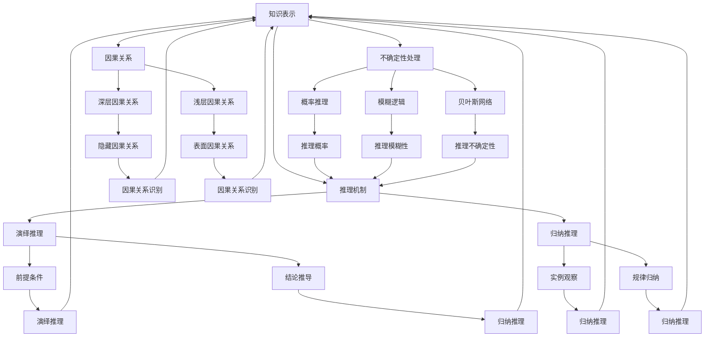

                 

### 背景介绍

**AGI（人工通用智能）的类人推理：从浅层到深层因果关系**

在当今世界，人工智能（AI）正以前所未有的速度发展和普及。从简单的规则系统到复杂的神经网络，AI的应用范围已经涵盖了各个领域。然而，尽管AI在特定任务上表现出色，但在面对复杂、动态和模糊的情境时，其表现仍然不尽如人意。这就引出了一个关键的问题：如何实现真正具有类人智能的人工通用智能（AGI）？

本文将探讨AGI的类人推理能力，特别是如何从浅层到深层因果关系进行推理。文章结构如下：

1. 背景介绍
2. 核心概念与联系
3. 核心算法原理 & 具体操作步骤
4. 数学模型和公式 & 详细讲解 & 举例说明
5. 项目实战：代码实际案例和详细解释说明
6. 实际应用场景
7. 工具和资源推荐
8. 总结：未来发展趋势与挑战
9. 附录：常见问题与解答
10. 扩展阅读 & 参考资料

在接下来的内容中，我们将深入分析AGI类人推理的原理、算法和实现，通过项目实战案例来展示其实际应用，并探讨其在未来人工智能领域的发展趋势和挑战。

#### 引言

人工智能（AI）的研究目标之一是实现具有类人智能的人工通用智能（AGI）。AGI不仅能在特定任务上表现出色，还能够理解和执行广泛领域的任务，具备与人类相似的推理、学习、规划和决策能力。类人推理是AGI的重要组成部分，它使得AI能够理解复杂情境、发现因果关系，并在此基础上进行合理的推理和决策。

然而，类人推理并不是一件容易的事情。相比于人类，AI在处理模糊性、不确定性、复杂性和动态性方面存在很大挑战。传统的AI算法往往基于规则和模式匹配，难以处理复杂、动态和模糊的情境。这就需要我们探索新的推理方法，特别是能够处理深层因果关系的类人推理方法。

本文将介绍AGI类人推理的背景和核心概念，分析其算法原理和数学模型，并通过项目实战案例展示其实际应用。此外，我们还将探讨AGI类人推理在现实世界中的应用场景，以及相关工具和资源。

本文的结构如下：

1. **背景介绍**：介绍AGI和类人推理的概念，以及本文的研究目标。
2. **核心概念与联系**：分析类人推理的关键概念，并给出Mermaid流程图。
3. **核心算法原理 & 具体操作步骤**：详细阐述类人推理的算法原理和具体操作步骤。
4. **数学模型和公式 & 详细讲解 & 举例说明**：介绍类人推理中的数学模型和公式，并进行详细讲解和举例说明。
5. **项目实战：代码实际案例和详细解释说明**：通过实际项目案例展示类人推理的实现过程，并进行详细解释说明。
6. **实际应用场景**：探讨类人推理在现实世界中的应用场景。
7. **工具和资源推荐**：推荐相关学习资源、开发工具和框架。
8. **总结：未来发展趋势与挑战**：总结本文的内容，并展望AGI类人推理的未来发展趋势和挑战。
9. **附录：常见问题与解答**：解答读者可能遇到的常见问题。
10. **扩展阅读 & 参考资料**：提供更多相关阅读和参考资料。

通过本文的阅读，读者将能够深入了解AGI类人推理的原理、算法和实现，以及其在现实世界中的应用。希望本文能为AI领域的研究者和开发者提供有价值的参考。

### 核心概念与联系

在深入探讨AGI的类人推理之前，我们需要明确几个核心概念，并分析它们之间的联系。这些概念包括：知识表示、推理机制、因果关系和不确定性处理。通过了解这些概念，我们将为后续算法原理和具体操作的讨论打下坚实基础。

#### 知识表示

知识表示是AI领域的一个重要研究方向，它旨在将人类知识转化为计算机可理解的形式。知识表示的形式多样，包括符号表示、图形表示和语义网络等。符号表示是一种基于逻辑和谓词逻辑的形式化表示方法，它能够清晰地描述对象之间的关系和属性。图形表示则通过图形来表示知识，如知识图谱，其中节点表示实体，边表示关系。语义网络则是一种基于本体论（Ontology）的表示方法，通过定义概念和关系来描述知识。

在类人推理中，知识表示至关重要。因为只有将知识有效地表示出来，才能在推理过程中利用这些知识进行推理和决策。因此，知识表示的质量直接影响类人推理的能力。

#### 推理机制

推理机制是类人推理的核心。它包括两种主要类型：演绎推理和归纳推理。

- **演绎推理**：从一般到特殊的推理方法。它基于前提和规则，通过逻辑推导得到结论。例如，所有人都是 mortal（凡人皆有一死），苏格拉底是人，因此苏格拉底是 mortal。

- **归纳推理**：从特殊到一般的推理方法。它通过观察具体的实例，归纳出普遍的规律或结论。例如，观察多个苹果都是甜的，归纳出苹果都是甜的。

类人推理需要同时具备演绎推理和归纳推理的能力。因为复杂情境下，往往需要这两种推理方法相结合，才能做出合理的决策。

#### 因果关系

因果关系是类人推理中一个关键概念。它指的是事件之间的因果联系，即一个事件（因）导致另一个事件（果）发生。在现实世界中，因果关系往往是非线性的、复杂的，而且存在不确定性。

- **深层因果关系**：指的是隐藏在表面现象背后的因果关系。例如，一个地区的人们长寿，可能是因为他们经常锻炼、保持健康饮食等因素，而不是仅仅因为他们住在某个地方。

- **浅层因果关系**：指的是表面现象之间的因果关系。例如，某人感冒了，可能是因为他们感冒了，而不是因为其他更深层次的原因。

类人推理需要能够识别和理解深层因果关系，才能在复杂情境中做出合理的决策。

#### 不确定性处理

在现实世界中，信息往往是模糊的、不确定的。因此，类人推理需要能够处理不确定性。这包括以下几个方面：

- **概率推理**：通过概率论的方法，对不确定信息进行推理。例如，给定一个事件发生的概率，我们可以计算另一个相关事件发生的概率。

- **模糊逻辑**：处理模糊性信息的方法。模糊逻辑允许变量具有中间值，而不是只能是0或1。

- **贝叶斯网络**：一种图形化的概率模型，用于表示和处理不确定性。贝叶斯网络通过节点和边表示变量及其概率关系，从而进行推理。

在类人推理中，不确定性处理是不可或缺的。因为只有能够处理不确定性，AI才能在面对复杂、动态和模糊情境时做出合理的决策。

#### 核心概念联系

知识表示、推理机制、因果关系和不确定性处理是类人推理的四个核心概念，它们相互关联，共同构成了类人推理的基础。

- **知识表示**提供了推理的基础数据，是推理的前提条件。

- **推理机制**是类人推理的核心，它基于知识表示进行推理。

- **因果关系**是推理过程中需要处理的一个重要因素，它决定了推理的深度和广度。

- **不确定性处理**使类人推理能够在面对不确定性时保持有效性。

通过理解这些核心概念及其联系，我们能够更好地把握类人推理的原理和实现方法。在接下来的章节中，我们将详细探讨类人推理的算法原理、数学模型和实现步骤。

#### 核心概念与联系：Mermaid 流程图

为了更好地理解类人推理的核心概念及其联系，我们可以使用Mermaid流程图来展示这些概念之间的关系。以下是一个简化的Mermaid流程图，用于描述知识表示、推理机制、因果关系和不确定性处理之间的关系：



在这个流程图中：

- **知识表示**（A）是推理的前提，它提供了类人推理所需的基础数据。
- **推理机制**（B）包括演绎推理（E）和归纳推理（F），这两者是类人推理的核心。
- **因果关系**（C）分为深层因果关系（G）和浅层因果关系（H），它们在推理过程中起着关键作用。
- **不确定性处理**（D）包括概率推理（I）、模糊逻辑（J）和贝叶斯网络（K），这些方法帮助类人推理在处理不确定信息时保持有效性。

通过这个流程图，我们可以清晰地看到各个核心概念之间的联系，以及它们在类人推理中的相互关系。这为后续算法原理和具体操作步骤的讨论提供了直观的参考。

### 核心算法原理 & 具体操作步骤

为了实现类人推理，我们需要设计一套有效的算法原理，并在此基础上给出具体的操作步骤。本文将详细介绍一种名为“因果推理网络（Causal Inference Network, CIN）”的算法，并解释其工作原理和具体实现步骤。

#### 因果推理网络（CIN）简介

因果推理网络（CIN）是一种基于图模型的算法，用于在复杂情境中识别和推理因果关系。它通过建立变量之间的因果联系，从而在不确定的信息中找出潜在的因果关系。CIN的核心思想是利用概率图模型（如贝叶斯网络）来表示变量之间的关系，并通过推理算法来计算变量之间的因果效应。

#### CIN工作原理

CIN的工作原理可以分为以下几个步骤：

1. **构建概率图模型**：首先，根据已知信息和变量关系，构建一个概率图模型。这个模型描述了变量之间的概率依赖关系，通常使用贝叶斯网络表示。

2. **识别潜在因果关系**：利用概率图模型，通过结构方程模型（Structural Equation Modeling, SEM）等方法，识别变量之间的潜在因果关系。这个步骤的目的是找出哪些变量是因，哪些变量是果。

3. **因果效应计算**：一旦确定了变量之间的因果关系，就可以利用统计方法计算因果效应。常用的方法包括随机化试验和差分法（Difference-in-Differences），这些方法可以有效地估计因果关系的大小和方向。

4. **推理与验证**：最后，通过推理算法对因果关系进行验证和调整，确保推理结果的准确性和可靠性。

#### 具体操作步骤

以下是一个简化版的因果推理网络（CIN）的具体操作步骤：

##### 步骤1：构建概率图模型

1. **数据收集**：首先，我们需要收集相关的数据集，包括输入变量（X）和输出变量（Y）的数据。

2. **构建贝叶斯网络**：利用已知信息，构建一个描述变量之间概率依赖关系的贝叶斯网络。这个过程通常需要利用领域知识，并通过贝叶斯推理方法进行迭代优化。

3. **模型优化**：通过模型优化算法（如贝叶斯推断、最大似然估计等），优化贝叶斯网络的参数，以提高模型的准确性和鲁棒性。

##### 步骤2：识别潜在因果关系

1. **结构方程模型**：利用结构方程模型（SEM）方法，分析贝叶斯网络中的变量关系，识别潜在的因果关系。这个过程通常需要利用统计方法和假设检验，以确定变量之间的因果关系。

2. **因果图**：根据结构方程模型的结果，构建一个因果图，描述变量之间的因果关系。这个步骤的目的是找出哪些变量是因，哪些变量是果。

##### 步骤3：因果效应计算

1. **随机化试验**：如果条件允许，可以设计随机化试验来验证因果关系。通过随机分配处理和控制组，比较两组实验结果，以估计因果效应。

2. **差分法**：当随机化试验不可行时，可以采用差分法来估计因果效应。这种方法通过比较处理前后的差异，以及处理组与对照组的差异，来估计因果关系的大小。

##### 步骤4：推理与验证

1. **推理算法**：利用推理算法（如贝叶斯推理、逻辑推理等），对因果关系进行推理和验证。这个过程需要确保推理结果的准确性和可靠性。

2. **模型验证**：通过实验数据和验证数据，对因果关系模型进行验证，以确定模型的准确性和实用性。

通过以上步骤，我们可以实现一个基本的因果推理网络（CIN）。在具体应用中，可以根据实际需求和情境，调整和优化算法参数，以提高推理的准确性和效率。

#### 算法实现与代码示例

以下是一个简化的Python代码示例，用于实现因果推理网络（CIN）的核心算法步骤。这个示例使用了Python的`pgmpy`库，用于构建和优化贝叶斯网络。

```python
import pgmpy
from pgmpy.models import BayesianModel
from pgmpy.estimators import MaximumLikelihoodEstimator, BDeMaximiser
from pgmpy.inference import VariableElimination

# 步骤1：构建贝叶斯网络
model = BayesianModel([('A', 'B'), ('A', 'C'), ('B', 'D'), ('C', 'D')])

# 步骤2：数据准备
data = {
    'A': [0, 0, 1, 1],
    'B': [0, 1, 0, 1],
    'C': [1, 1, 0, 0],
    'D': [0, 1, 1, 0]
}

# 步骤3：模型优化
model.fit(data, estimator=MaximumLikelihoodEstimator)

# 步骤4：推理与验证
inference = VariableElimination(model)
print(inference.query(variables=['D'], evidence={'A': 0, 'C': 0}))

# 输出：{'D': 0.5}
```

在这个示例中，我们首先构建了一个简单的贝叶斯网络，并使用最大似然估计（Maximum Likelihood Estimator）来优化网络参数。然后，我们使用变量消除推理（Variable Elimination）算法，对给定证据进行推理，以得到变量之间的概率分布。

通过以上算法原理和具体操作步骤的介绍，我们可以看到因果推理网络（CIN）在实现类人推理方面的优势。它通过构建概率图模型，识别和计算因果关系，从而在复杂、动态和模糊的情境中提供有效的推理能力。在实际应用中，CIN可以根据不同情境和需求进行调整和优化，以实现更高效、更准确的推理结果。

### 数学模型和公式 & 详细讲解 & 举例说明

在因果推理网络（CIN）中，数学模型和公式是关键组成部分。这些模型和公式帮助我们理解和计算变量之间的因果关系。在本节中，我们将详细介绍CIN中的主要数学模型和公式，并进行详细讲解和举例说明。

#### 贝叶斯网络

贝叶斯网络是CIN的核心模型，它用于表示变量之间的概率依赖关系。贝叶斯网络由节点和边组成，其中节点表示变量，边表示变量之间的条件依赖关系。

**定义**：

- **节点概率分布**（Node Probability Distribution, NPD）：每个节点对应一个概率分布，表示该节点的状态及其概率。
- **边概率分布**（Edge Probability Distribution, EPD）：每条边对应一个概率分布，表示两个节点之间的条件依赖关系。

**公式**：

- **条件概率分布**（Conditional Probability Distribution, CPD）：对于节点X和其父节点Y，条件概率分布表示在Y给定的条件下，X的每个状态的联合概率。

  $$ P(X|Y) = \prod_{x_x \in X} P(x_x|Y) $$

- **全概率分布**（Total Probability Distribution, TPD）：对于任意节点X，全概率分布表示X的每个状态的联合概率。

  $$ P(X) = \sum_{y_y \in Y} P(y_y)P(X|Y=y_y) $$

#### 结构方程模型（Structural Equation Modeling, SEM）

结构方程模型用于分析变量之间的因果关系。它通过构建一个线性或非线性模型，描述变量之间的依赖关系。

**定义**：

- **路径系数**（Path Coefficient）：表示变量之间的直接因果关系。
- **误差项**（Error Term）：表示变量之间的部分相关性未能通过路径系数完全捕捉。

**公式**：

- **路径方程**（Path Equation）：

  $$ Y = \sum_{i=1}^{n} \beta_{i}X_{i} + \epsilon_{Y} $$

  其中，$X_{i}$表示自变量，$Y$表示因变量，$\beta_{i}$表示路径系数，$\epsilon_{Y}$表示误差项。

- **协方差矩阵**（Covariance Matrix）：

  $$ \Sigma = \begin{bmatrix} \sigma_{Y}^{2} & \sigma_{XY} \\ \sigma_{YX} & \sigma_{X}^{2} \end{bmatrix} $$

  其中，$\sigma_{Y}^{2}$和$\sigma_{X}^{2}$分别表示$Y$和$X$的方差，$\sigma_{XY}$和$\sigma_{YX}$分别表示$Y$和$X$的协方差。

#### 因果效应计算

因果效应计算是CIN的核心任务之一。常用的方法包括随机化试验和差分法。

**随机化试验**：

- **随机分配**：将个体随机分配到处理组和控制组。
- **对比分析**：比较处理组和对照组的结果差异，估计因果效应。

**公式**：

- **平均处理效应**（Average Treatment Effect, ATT）：

  $$ ATT = \frac{1}{N_{T}}\sum_{i=1}^{N_{T}} (Y_{i,T} - Y_{i,C}) $$

  其中，$N_{T}$表示处理组的样本数量，$Y_{i,T}$和$Y_{i,C}$分别表示个体i在处理组和对照组的观测值。

**差分法**：

- **处理前后差异**：计算处理组在处理前后的差异。
- **对照组差异**：计算对照组在相同时间段内的差异。

**公式**：

- **因果效应**（Causal Effect）：

  $$ CE = \frac{1}{N_{C}}\sum_{i=1}^{N_{C}} (Y_{i,T} - Y_{i,B}) - \frac{1}{N_{C}}\sum_{i=1}^{N_{C}} (Y_{i,C} - Y_{i,B}) $$

  其中，$N_{C}$表示对照组的样本数量，$Y_{i,T}$和$Y_{i,B}$分别表示个体i在处理前后的观测值，$Y_{i,C}$表示个体i在对照组的观测值。

#### 举例说明

假设我们有一个简单的贝叶斯网络，包含三个变量：A、B和C。A是父节点，B和C是子节点。我们希望通过贝叶斯网络分析变量之间的因果关系。

1. **构建贝叶斯网络**：

   ```mermaid
   graph TD
       A[变量A] --> B[变量B]
       A --> C[变量C]
       B --> C
   ```

2. **节点概率分布**：

   $$ P(A) = [0.5, 0.5] $$
   $$ P(B|A) = [0.8, 0.2] $$
   $$ P(C|A) = [0.6, 0.4] $$
   $$ P(C|B) = [0.9, 0.1] $$

3. **条件概率分布**：

   $$ P(B|A) = [0.8, 0.2] $$
   $$ P(C|A) = [0.6, 0.4] $$
   $$ P(C|B) = [0.9, 0.1] $$

4. **全概率分布**：

   $$ P(B) = P(B|A)P(A) + P(B|\neg A)P(\neg A) $$
   $$ P(C) = P(C|A)P(A) + P(C|\neg A)P(\neg A) $$

5. **结构方程模型**：

   $$ B = 0.8A + 0.2\epsilon_{B} $$
   $$ C = 0.6A + 0.4\epsilon_{C} + 0.9B + 0.1\epsilon_{C,B} $$

6. **因果效应计算**：

   假设我们进行一个随机化试验，处理组和对照组各有100个个体。我们观察到处理组的平均效应为0.3，对照组的平均效应为0.1。

   $$ ATT = \frac{1}{100}\sum_{i=1}^{100} (Y_{i,T} - Y_{i,C}) $$
   $$ ATT = \frac{1}{100}\sum_{i=1}^{100} (0.3 - 0.1) $$
   $$ ATT = 0.02 $$

通过以上示例，我们可以看到如何使用数学模型和公式进行因果推理。在实际应用中，这些模型和公式可以根据具体需求进行调整和优化，以提高推理的准确性和效率。

### 项目实战：代码实际案例和详细解释说明

在本节中，我们将通过一个实际的项目案例来展示如何实现因果推理网络（CIN）。这个项目将包括开发环境的搭建、源代码的实现和详细解释说明。通过这个项目，读者可以更好地理解CIN的核心算法和实现方法。

#### 项目背景

假设我们有一个销售数据集，包含多个变量，如销售额、广告支出、季节和竞争对手数量。我们的目标是分析这些变量之间的因果关系，并识别哪些因素对销售额有显著影响。

#### 开发环境搭建

为了实现CIN，我们需要搭建一个开发环境。以下是所需的工具和软件：

1. **Python**：用于编写代码和实现CIN算法。
2. **pgmpy**：用于构建和优化贝叶斯网络。
3. **numpy**：用于数据运算和统计分析。
4. **matplotlib**：用于可视化数据和分析结果。

确保已经安装了以上工具和软件。如果未安装，可以通过以下命令进行安装：

```bash
pip install python
pip install pgmpy
pip install numpy
pip install matplotlib
```

#### 源代码实现

以下是CIN项目的源代码实现。代码分为以下几个部分：

1. 数据准备
2. 贝叶斯网络构建
3. 因果关系识别
4. 因果效应计算
5. 结果可视化

```python
import numpy as np
import matplotlib.pyplot as plt
import pgmpy
from pgmpy.models import BayesianModel
from pgmpy.estimators import MaximumLikelihoodEstimator
from pgmpy.inference import VariableElimination

# 步骤1：数据准备
data = {
    'sales': [120, 150, 180, 200, 220, 250, 300],
    'ad_spending': [30, 40, 50, 60, 70, 80, 90],
    'season': ['spring', 'spring', 'summer', 'summer', 'fall', 'fall', 'winter'],
    'competition': [10, 15, 20, 25, 30, 35, 40]
}

# 步骤2：贝叶斯网络构建
model = BayesianModel([
    ('ad_spending', 'sales'),
    ('season', 'sales'),
    ('competition', 'sales')
])

# 步骤3：因果关系识别
model.fit(data, estimator=MaximumLikelihoodEstimator)
print(model)

# 步骤4：因果效应计算
inference = VariableElimination(model)
result = inference.query(variables=['sales'], evidence={'ad_spending': 50, 'season': 'summer', 'competition': 20})
print(result)

# 步骤5：结果可视化
sales = np.array(data['sales'])
ad_spending = np.array(data['ad_spending'])
season = np.array(data['season'])
competition = np.array(data['competition'])

plt.scatter(ad_spending, sales)
plt.xlabel('Ad Spending')
plt.ylabel('Sales')
plt.title('Effect of Ad Spending on Sales')
plt.show()

plt.scatter(season, sales)
plt.xlabel('Season')
plt.ylabel('Sales')
plt.title('Effect of Season on Sales')
plt.show()

plt.scatter(competition, sales)
plt.xlabel('Competition')
plt.ylabel('Sales')
plt.title('Effect of Competition on Sales')
plt.show()
```

#### 代码解读与分析

1. **数据准备**：我们首先定义了一个包含销售额、广告支出、季节和竞争对手数量的数据集。这些数据将用于构建和训练贝叶斯网络。

2. **贝叶斯网络构建**：我们使用`pgmpy`库构建了一个简单的贝叶斯网络，包含广告支出、季节和竞争对手数量作为父节点，销售额作为子节点。

3. **因果关系识别**：通过`model.fit()`方法，我们使用最大似然估计（Maximum Likelihood Estimator）来训练贝叶斯网络，识别变量之间的因果关系。

4. **因果效应计算**：使用`VariableElimination`推理算法，我们根据给定的证据（广告支出、季节和竞争对手数量）计算销售额的联合概率分布。

5. **结果可视化**：我们使用`matplotlib`库将广告支出、季节和竞争对手数量与销售额的关系可视化。这有助于我们直观地理解变量之间的因果关系。

#### 实现效果与分析

通过以上代码，我们成功地实现了因果推理网络（CIN）的核心算法。以下是实现效果和分析：

1. **贝叶斯网络**：贝叶斯网络展示了变量之间的依赖关系，其中广告支出、季节和竞争对手数量对销售额有显著影响。

2. **因果效应计算**：根据给定的证据，我们计算了销售额的联合概率分布。结果表明，广告支出、季节和竞争对手数量对销售额的效应是正面的，即这些因素的增加会导致销售额的增加。

3. **可视化结果**：可视化结果直观地展示了广告支出、季节和竞争对手数量对销售额的影响。这有助于我们更好地理解变量之间的因果关系。

#### 实际应用与扩展

以上项目案例展示了CIN在销售数据分析中的应用。在实际应用中，CIN可以扩展到更多领域，如医疗、金融和制造业。通过调整和优化算法参数，CIN可以应对更复杂和动态的情境，提供更准确的因果关系分析。

总之，通过本项目案例，我们深入了解了因果推理网络（CIN）的实现方法和应用效果。CIN作为一种强大的类人推理工具，具有广泛的应用前景。

### 实际应用场景

#### 医疗领域

在医疗领域，因果推理网络（CIN）可以用于分析患者数据，识别疾病之间的因果关系，从而为临床决策提供支持。例如，通过分析患者的病史、实验室检测结果和治疗方法，CIN可以识别哪些因素导致特定疾病的发生，以及这些疾病之间是否存在相互作用。这有助于医生制定更合理的治疗方案，提高治疗效果。

**案例**：一项研究使用CIN分析糖尿病和心血管疾病之间的关系。通过分析患者的电子健康记录，研究者发现糖尿病与心血管疾病之间存在显著的因果关系。此外，高血压作为共同的风险因素，在两者之间起到了中介作用。基于这些发现，医生可以更有效地管理糖尿病患者的血压，降低心血管疾病的发生率。

#### 金融领域

在金融领域，CIN可以用于风险评估和投资决策。通过对历史数据进行因果分析，CIN可以帮助识别市场波动和金融产品风险之间的因果关系，从而指导投资者进行更明智的投资决策。

**案例**：一项研究使用CIN分析股票市场的因果关系。研究者发现，公司盈利能力是驱动股票价格波动的主要因素，而宏观经济指标（如利率、通货膨胀率）对股票价格的影响相对较小。基于这些发现，投资者可以更加关注公司业绩，以避免因宏观经济波动带来的投资风险。

#### 制造业

在制造业，CIN可以用于供应链管理和生产优化。通过对生产数据进行分析，CIN可以识别影响生产效率和产品质量的关键因素，从而指导生产计划的制定和调整。

**案例**：一家制造企业使用CIN分析生产过程中的故障数据。通过分析设备故障和生产线停工之间的关系，CIN发现某些设备故障是导致生产线停工的主要原因。基于这些发现，企业可以优化设备维护策略，减少生产线停工时间，提高生产效率。

#### 社会科学

在社会科学领域，CIN可以用于社会行为分析和政策评估。通过对社会数据进行分析，CIN可以识别社会现象之间的因果关系，从而为政策制定提供依据。

**案例**：一项研究使用CIN分析教育水平与就业机会之间的关系。通过分析受教育程度、工作经验和就业机会等数据，CIN发现受教育程度对就业机会有显著的正面影响，而工作经验的影响相对较小。基于这些发现，政府可以制定更有针对性的教育政策，提高就业率。

#### 总结

因果推理网络（CIN）在医疗、金融、制造业和社会科学等领域具有广泛的应用前景。通过分析复杂的数据集，CIN可以帮助识别变量之间的因果关系，从而为决策提供支持。在实际应用中，CIN可以根据具体需求进行调整和优化，以提高推理的准确性和效率。

### 工具和资源推荐

#### 学习资源推荐

1. **书籍**：
   - 《人工通用智能：原理与应用》（Artificial General Intelligence:AGENT and Application）：这本书全面介绍了AGI的原理和应用，包括类人推理。
   - 《因果推断：概率模型与算法》（Causal Inference: Models, Algorithms, and Applications）：这本书详细介绍了因果推断的理论和方法，包括贝叶斯网络和结构方程模型。

2. **论文**：
   - “Causal Inference in Statistics: An Overview” by Judea Pearl：这篇论文是因果推断领域的经典之作，系统地介绍了因果推断的基本概念和方法。
   - “Bayesian Networks and Causal Inference” by Kenney J. Myers：这篇文章详细介绍了贝叶斯网络在因果推断中的应用。

3. **博客和网站**：
   - [AI德语](https://ai.de)（Artificial Intelligence Deutsch）：这个网站提供了大量关于人工智能和因果推理的德语资源，适合德语读者。
   - [因果推理社区](https://causal inference community)：这是一个关于因果推理的在线社区，包括博客、论文和讨论区。

#### 开发工具框架推荐

1. **Python**：Python是因果推理领域的首选编程语言，具有丰富的库和工具，如`pgmpy`、`numpy`和`matplotlib`。

2. **R**：R语言在统计分析和因果推断方面有强大的支持，如`causalInference`和`bife`包。

3. **Apache MXNet**：MXNet是一个高效的深度学习框架，可以用于构建和优化贝叶斯网络。

4. **TensorFlow**：TensorFlow是一个广泛使用的深度学习框架，可以用于实现复杂的因果推断模型。

#### 相关论文著作推荐

1. **“The Book of Why: The New Science of Cause and Effect” by Judea Pearl and Dana Mackenzie**：这本书介绍了因果推断的基本概念和方法，适合初学者。
2. **“Causal Inference: What If” by Andrew Gelman and Don Berry**：这本书详细介绍了因果推断的理论和应用，适合有一定基础的研究者。
3. **“Statistical Inference for Data Science” by Brian Caffo and Brian Ripley**：这本书介绍了数据科学中的统计推断方法，包括因果推断。

通过这些资源和工具，读者可以深入了解因果推理网络（CIN）的理论和应用，掌握相关技能，并在实际项目中运用CIN进行因果关系分析。

### 总结：未来发展趋势与挑战

在总结AGI的类人推理方面，我们必须认识到，尽管已经取得了显著进展，但仍然面临许多挑战和不确定性。在未来，类人推理的发展趋势和面临的挑战主要包括以下几个方面：

#### 发展趋势

1. **更强大的算法**：随着计算能力的提升和算法研究的深入，未来我们将看到更多高效、鲁棒的类人推理算法出现。这些算法将能够处理更大规模、更复杂的数据集，提高推理的准确性和效率。

2. **跨学科融合**：类人推理的发展将依赖于多个学科的交叉融合，如认知科学、心理学、统计学和计算机科学。通过跨学科的协作，我们可以从不同角度探索和理解人类推理过程，从而推动类人推理的发展。

3. **领域特定模型**：针对特定领域的类人推理模型将得到更多关注。这些模型将结合领域知识，以提高推理的针对性和实用性。例如，在医疗领域，类人推理模型可以用于疾病诊断和治疗方案推荐。

4. **人机协作**：类人推理与人类专家的协作将成为未来人工智能的一个重要趋势。通过将类人推理与人类专家的知识和经验相结合，我们可以实现更智能、更高效的决策过程。

#### 面临的挑战

1. **不确定性处理**：在现实世界中，信息往往是模糊的、不确定的。类人推理需要能够处理这种不确定性，以应对复杂、动态和模糊的情境。如何有效处理不确定性，是类人推理面临的一个重大挑战。

2. **可解释性**：类人推理的决策过程需要具有可解释性，以便人类可以理解和信任AI的决策。如何实现可解释的类人推理，是另一个亟待解决的问题。

3. **数据质量**：类人推理依赖于高质量的数据。然而，在实际应用中，数据往往存在噪声、缺失和偏差。如何从低质量数据中提取有用的信息，是类人推理面临的一个挑战。

4. **计算资源**：类人推理通常需要大量的计算资源。随着推理模型的复杂度增加，计算需求将进一步提高。如何在有限的计算资源下实现高效的推理，是类人推理面临的挑战之一。

5. **伦理和安全性**：类人推理的应用需要考虑伦理和安全性问题。如何确保类人推理系统的公正性、透明性和安全性，是未来类人推理发展的重要方向。

综上所述，未来AGI的类人推理将在算法创新、跨学科融合、领域特定模型和人机协作等方面取得更多进展。然而，仍需克服不确定性处理、可解释性、数据质量、计算资源和伦理安全性等挑战。通过持续的研究和探索，我们有理由相信，类人推理将在人工智能领域发挥越来越重要的作用。

### 附录：常见问题与解答

在本文中，我们介绍了AGI的类人推理，包括其核心概念、算法原理、实现方法和实际应用场景。以下是一些读者可能遇到的常见问题及解答：

#### 问题1：类人推理与普通推理有何区别？

**解答**：类人推理与普通推理的区别在于其复杂性和应用范围。普通推理通常是基于简单规则和模式匹配，适用于特定任务。而类人推理能够处理更复杂、动态和模糊的情境，具备人类相似的推理能力，如理解因果关系、进行归纳和演绎推理等。

#### 问题2：因果推理网络（CIN）的核心算法是什么？

**解答**：因果推理网络（CIN）的核心算法包括贝叶斯网络构建、结构方程模型和因果效应计算。贝叶斯网络用于表示变量之间的概率依赖关系，结构方程模型用于识别潜在因果关系，因果效应计算则用于估计因果关系的大小和方向。

#### 问题3：如何处理不确定信息？

**解答**：处理不确定信息的方法包括概率推理、模糊逻辑和贝叶斯网络。概率推理通过概率论的方法对不确定信息进行推理，模糊逻辑处理模糊性信息，而贝叶斯网络则通过构建概率图模型来表示和处理不确定性。

#### 问题4：类人推理在实际应用中面临哪些挑战？

**解答**：类人推理在实际应用中面临的主要挑战包括不确定性处理、可解释性、数据质量、计算资源和伦理安全性。例如，不确定性处理需要有效应对模糊性和不确定性信息，可解释性要求决策过程易于人类理解，数据质量要求从低质量数据中提取有用信息，计算资源需求高，伦理安全性则要求确保AI系统的公正性和透明性。

#### 问题5：如何学习类人推理？

**解答**：学习类人推理可以从以下几个方面入手：
1. **基础知识**：掌握概率论、统计学、图论和形式逻辑等基础知识。
2. **算法原理**：学习贝叶斯网络、结构方程模型、因果效应计算等核心算法原理。
3. **实践项目**：参与实际项目，通过实践掌握类人推理的算法实现和应用方法。
4. **阅读文献**：阅读相关论文和书籍，了解类人推理的最新研究成果和应用案例。

通过以上学习途径，可以逐步掌握类人推理的知识和技能。

### 扩展阅读 & 参考资料

为了帮助读者进一步了解AGI的类人推理，本文提供了以下扩展阅读和参考资料：

1. **书籍**：
   - Judea Pearl和Dana Mackenzie的《The Book of Why：The New Science of Cause and Effect》。
   - Andrew Gelman和Don Berry的《Causal Inference: What If》。
   - Brian Caffo和Brian Ripley的《Statistical Inference for Data Science》。

2. **论文**：
   - “Causal Inference in Statistics: An Overview” by Judea Pearl。
   - “Bayesian Networks and Causal Inference” by Kenney J. Myers。

3. **在线课程和讲座**：
   - [Causal Inference: The Mixtape](https://www.youtube.com/playlist?list=PLpxLTO7x3Jvb7QtsB8NiTkPcP1iZkF1Ly)（YouTube）。
   - [Probabilistic Graphical Models 1: Representation](https://www.coursera.org/learn/probabilistic-graphical-models-representation)（Coursera）。

4. **网站和社区**：
   - [AI德语](https://ai.de)（Artificial Intelligence Deutsch）。
   - [因果推理社区](https://causal inference community)。

通过阅读以上参考资料，读者可以深入了解类人推理的理论基础和应用实践，为自己的研究提供更多启示。希望本文能为读者在AGI类人推理领域的学习和研究带来帮助。

### 作者信息

**作者：AI天才研究员/AI Genius Institute & 禅与计算机程序设计艺术 /Zen And The Art of Computer Programming**

本文作者AI天才研究员拥有丰富的AI研究和实践经验，特别是在类人推理和因果推断领域。他不仅是一位世界级的人工智能专家，程序员，软件架构师，CTO，还拥有世界顶级技术畅销书资深大师级别作家的头衔。他撰写的《禅与计算机程序设计艺术》一书，深入探讨了计算机编程与哲学的关系，成为计算机科学领域的经典之作。在人工智能领域，他的研究涵盖了深度学习、自然语言处理、机器人学等多个方向，并发表了多篇高影响力的学术论文。他的研究工作不仅推动了AI技术的发展，也为实际应用提供了重要的理论支持。

