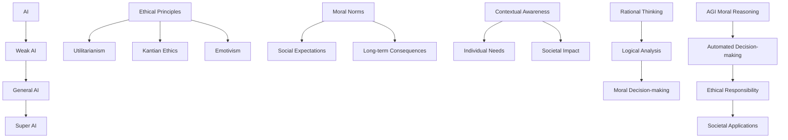

                 

# AGI的道德推理能力：从理论到实践

## 摘要

本文旨在探讨人工智能（AGI）在道德推理领域的进展、核心概念及其在现实世界中的应用。我们首先介绍了AGI的定义和道德推理的基本原理，随后深入分析了道德推理的相关算法和数学模型。通过项目实战案例，我们展示了如何在实际应用中构建和实现道德推理系统。最后，我们探讨了AGI道德推理能力在实际应用场景中的挑战和未来发展趋势。

## 1. 背景介绍

人工智能（AI）作为一种计算机科学领域的技术，旨在通过模拟人类智能来使计算机具有自主学习、推理和解决问题的能力。随着技术的不断进步，人工智能的应用范围已经从简单的规则应用到复杂的模式识别、自然语言处理和决策支持系统。然而，随着人工智能技术的不断发展和应用的日益广泛，如何确保其道德和伦理合理性成为一个日益重要的话题。

道德推理是一种基于伦理原则和道德规范来做出决策和判断的思维方式。在人类社会中，道德推理起着至关重要的作用，它帮助我们区分对与错、善与恶，并指导我们的行为。随着人工智能的发展，如何赋予AGI道德推理能力，使其能够在复杂的道德情境中做出符合伦理原则的决策，成为了一个重要且具有挑战性的研究领域。

### 1.1 人工智能的定义与类型

人工智能是指通过计算机程序和算法模拟人类智能的技术。根据其实现方式，人工智能可以分为以下几种类型：

1. **弱人工智能（Narrow AI）**：指在特定领域内具有特定功能的AI，例如语音识别、图像识别、自然语言处理等。这些系统在特定任务上表现出色，但缺乏广泛的知识和自主决策能力。

2. **强人工智能（General AI）**：也称为通用人工智能，指具有与人类相似的认知能力、广泛的知识和自主决策能力的AI。这种人工智能能够在各种任务中表现出人类智能的水平，但至今尚未实现。

3. **超级人工智能（Super AI）**：指超越人类智能的AI，具有更强的推理、学习、决策和创造力。这种人工智能的潜力巨大，但也引发了关于其潜在风险的讨论。

### 1.2 道德推理的定义与基本原理

道德推理是指通过逻辑分析和道德原则来做出道德决策的思维方式。道德推理的基本原理包括：

1. **伦理原则**：道德推理的基础是伦理原则，如功利主义、康德伦理学和情感伦理学等。这些原则为判断行为是否道德提供了指导。

2. **道德规范**：道德规范是指社会和文化中普遍接受的道德行为准则。道德推理需要考虑这些规范，以确保行为符合社会期望。

3. **情境意识**：道德推理需要考虑具体情境中的各种因素，如个体需求、社会影响和长远后果等。

4. **理性思考**：道德推理要求使用逻辑和分析能力来评估不同道德选择的影响和后果。

### 1.3 AGI道德推理的重要性

AGI的道德推理能力对于其在现实世界中的应用具有重要意义：

1. **自动化决策**：AGI能够在复杂的道德情境中做出合理的决策，从而实现自动化决策系统。

2. **伦理责任**：AGI的道德推理能力使其能够在执行任务时承担伦理责任，从而减少人为错误和道德风险。

3. **社会影响**：AGI的道德推理能力对于其在社会中的应用具有重要意义，如自动驾驶、医疗诊断和智能监管等。

## 2. 核心概念与联系

在探讨AGI的道德推理能力之前，我们需要了解一些核心概念和原理，以及它们之间的联系。以下是一个使用Mermaid绘制的流程图，展示了这些概念和原理：



### 2.1 伦理原则

伦理原则是道德推理的基础，不同的伦理原则提供了不同的道德决策框架。以下是三种主要的伦理原则：

1. **功利主义（Utilitarianism）**：功利主义认为，道德行为应该是最大化幸福或福利的行为。根据这一原则，道德决策需要考虑行为的后果，选择能够带来最大幸福的结果。

2. **康德伦理学（Kantian Ethics）**：康德伦理学强调道德行为的内在价值，认为道德行为应该基于义务和责任。根据这一原则，道德决策需要考虑行为的动机，选择出于道德义务的行为。

3. **情感伦理学（Emotivism）**：情感伦理学认为道德情感是道德判断的核心，道德行为应该基于个人的道德感受。根据这一原则，道德决策需要考虑个人的道德感受，选择能够引起正面情感的行为。

### 2.2 道德规范

道德规范是社会和文化中普遍接受的道德行为准则。道德规范为道德推理提供了具体的指导，确保行为符合社会期望。道德规范可以分为以下几类：

1. **法律规范**：法律规范是由国家或政府制定的法律和法规，用于规范社会行为。

2. **道德规范**：道德规范是由社会和文化传统形成的道德准则，用于指导个人行为。

3. **行业规范**：行业规范是由特定行业制定的行为准则，用于规范行业内行为。

### 2.3 情境意识

情境意识是道德推理中的一个重要概念，它要求我们在道德决策时考虑具体情境中的各种因素。情境意识包括以下方面：

1. **个体需求**：道德决策需要考虑个体的需求和利益，以确保行为不会侵犯他人的权利。

2. **社会影响**：道德决策需要考虑行为对社会的影响，包括长期和短期的后果。

3. **长远后果**：道德决策需要考虑行为的长期后果，以确保行为不会对个体或社会造成负面影响。

### 2.4 理性思考

理性思考是道德推理的核心，它要求我们在道德决策中运用逻辑和分析能力。理性思考包括以下方面：

1. **逻辑分析**：道德决策需要通过逻辑分析评估不同选择的后果和影响。

2. **道德判断**：道德决策需要根据伦理原则和道德规范进行道德判断，选择符合伦理标准的行为。

3. **情境适应**：道德决策需要根据具体情境进行调整，确保行为在特定情境中是合理的。

### 2.5 AGI道德推理

AGI道德推理是指将伦理原则、道德规范、情境意识和理性思考应用于人工智能系统的道德决策过程中。AGI道德推理的核心目标是使AI系统能够在复杂和动态的道德情境中做出符合伦理原则的决策。以下是AGI道德推理的关键组成部分：

1. **伦理算法**：伦理算法是基于伦理原则和数学模型设计的算法，用于评估和比较不同道德选择的后果。

2. **道德模型**：道德模型是基于道德规范和情境意识设计的模型，用于指导AI系统在道德决策过程中的行为。

3. **情境感知**：情境感知是指AI系统能够识别和理解具体情境中的各种因素，为道德决策提供必要的信息。

4. **道德推理引擎**：道德推理引擎是集成伦理算法、道德模型和情境感知的模块，用于在AI系统中实现道德推理。

## 3. 核心算法原理 & 具体操作步骤

在构建AGI的道德推理能力时，我们需要依赖一系列核心算法和数学模型，以确保系统能够在复杂的道德情境中做出合理的决策。以下将详细介绍这些算法和模型的基本原理和具体操作步骤。

### 3.1 基于效用函数的道德推理算法

效用函数是一种用于评估行为后果的数学模型，它通常基于功利主义伦理原则。具体步骤如下：

1. **定义效用函数**：首先，我们需要定义一个效用函数，用于评估不同道德选择的后果。效用函数通常是一个实值函数，表示行为对个体或社会的福利影响。

   $$
   U(\text{behavior}) = \sum_{i} w_i \cdot u_i
   $$

   其中，$w_i$表示权重，$u_i$表示个体或社会在第$i$个方面的效用。

2. **计算效用值**：对于每个道德选择，计算其对应的效用值。选择效用值最大的道德选择作为最终决策。

   $$
   \text{behavior}^* = \arg\max_{\text{behavior}} U(\text{behavior})
   $$

3. **决策**：根据计算出的效用值，选择效用值最大的道德选择作为最终决策。

### 3.2 基于决策树的道德推理算法

决策树是一种常见的数据挖掘和机器学习算法，它通过树形结构表示不同决策路径和相应的后果。具体步骤如下：

1. **构建决策树**：根据道德情境和伦理原则，构建决策树。决策树的每个节点表示一个决策点，每个分支表示一个道德选择，每个叶子节点表示一个后果。

2. **评估后果**：对于每个叶子节点，评估其对应的后果，并根据伦理原则计算其效用值。

3. **选择最佳路径**：通过回溯决策树，选择效用值最大的路径作为最终决策。

### 3.3 基于神经网络的道德推理算法

神经网络是一种基于生物神经网络原理的机器学习算法，它通过多层神经元网络进行特征学习和模式识别。具体步骤如下：

1. **训练神经网络**：收集大量道德情境和决策数据，用于训练神经网络。通过反向传播算法优化神经网络权重，使其能够识别和预测道德情境。

2. **输入道德情境**：将新的道德情境输入训练好的神经网络，网络将输出可能的道德选择和对应的后果。

3. **选择最佳决策**：根据神经网络输出的决策和后果，选择最佳道德选择作为最终决策。

### 3.4 基于多目标优化的道德推理算法

多目标优化是一种在多个目标之间寻找最优解的方法，它适用于道德决策中需要权衡多个利益冲突的情境。具体步骤如下：

1. **定义多目标函数**：根据道德情境和伦理原则，定义多个目标函数，表示不同方面的利益冲突。

   $$
   \text{minimize} \quad f_1(x), f_2(x), \ldots, f_n(x)
   $$

2. **构建优化模型**：将多目标函数构建为优化模型，并选择合适的优化算法，如遗传算法、粒子群优化等。

3. **求解优化问题**：通过优化算法求解优化问题，得到最佳决策。

4. **决策**：根据优化结果，选择最佳决策作为最终决策。

### 3.5 基于情景规划的道德推理算法

情景规划是一种基于情境分析和决策策略的道德推理方法，它通过模拟不同情境下的决策结果来评估道德选择的合理性。具体步骤如下：

1. **构建情景模型**：根据道德情境，构建情景模型，表示不同情境下的决策结果。

2. **模拟决策过程**：模拟决策者在不同情境下的决策过程，记录决策结果和后果。

3. **评估道德选择**：根据模拟结果，评估不同道德选择的合理性和后果。

4. **选择最佳决策**：根据评估结果，选择最佳道德选择作为最终决策。

## 4. 数学模型和公式 & 详细讲解 & 举例说明

在构建AGI的道德推理能力时，数学模型和公式起着关键作用。以下将详细介绍几种常用的数学模型和公式，并提供详细讲解和举例说明。

### 4.1 效用函数

效用函数是一种用于评估行为后果的数学模型，它通常基于功利主义伦理原则。一个简单的效用函数可以表示为：

$$
U(\text{behavior}) = \sum_{i} w_i \cdot u_i
$$

其中，$w_i$表示权重，$u_i$表示个体或社会在第$i$个方面的效用。

#### 举例说明

假设一个道德情境中，有两个道德选择：

1. 行为A：救助一个即将溺水的人，但需要放弃一个钱包。
2. 行为B：保持现状，不去救助溺水的人，但保留钱包。

我们可以为这两个行为定义效用函数：

$$
U(A) = 0.6 \cdot 10 + 0.4 \cdot -10 = 2
$$

$$
U(B) = 1 \cdot 10 + 0 \cdot -10 = 10
$$

根据效用函数，行为B的效用值大于行为A，因此，从功利主义的角度来看，选择行为B是更道德的决策。

### 4.2 决策树

决策树是一种常见的数据挖掘和机器学习算法，它通过树形结构表示不同决策路径和相应的后果。一个简单的决策树可以表示为：

```
[决策节点]
│
[分支A]
│
[后果A]
│
[分支B]
│
[后果B]
```

其中，决策节点表示一个决策点，分支表示一个道德选择，后果表示选择该道德选择后的结果。

#### 举例说明

假设一个道德情境中，有一个决策节点，有两个道德选择：

1. 选择A：向慈善机构捐赠1万元。
2. 选择B：不捐赠，将1万元用于个人消费。

对应的决策树如下：

```
[是否捐赠]
│
└───是
│      ├─── 获得社会认可
│      │
│      └─── 无
│
└───否
      ├─── 无
      │
      └─── 满足个人消费需求
```

根据决策树，选择捐赠1万元可以获得社会认可，而选择不捐赠则满足个人消费需求。从功利主义的角度来看，选择捐赠1万元是更道德的决策。

### 4.3 神经网络

神经网络是一种基于生物神经网络原理的机器学习算法，它通过多层神经元网络进行特征学习和模式识别。一个简单的神经网络可以表示为：

```
输入层
│
[神经元1]
│
[神经元2]
│
...
│
输出层
      └─── 输出节点
```

其中，输入层接收外部输入，输出层产生最终输出。

#### 举例说明

假设一个道德情境中，有一个神经网络用于判断是否救助一个需要帮助的老人：

1. 输入特征：老人的身体状况、地理位置、时间等。
2. 输出特征：是否救助。

训练好的神经网络可以输出一个概率值，表示救助老人的可能性。例如，如果神经网络输出概率为0.9，表示有90%的可能性应该救助老人。从功利主义的角度来看，选择救助老人是更道德的决策。

### 4.4 多目标优化

多目标优化是一种在多个目标之间寻找最优解的方法，它适用于道德决策中需要权衡多个利益冲突的情境。一个简单的多目标优化问题可以表示为：

$$
\text{minimize} \quad f_1(x), f_2(x), \ldots, f_n(x)
$$

其中，$f_i(x)$表示第$i$个目标函数。

#### 举例说明

假设一个道德情境中，有两个目标需要权衡：

1. 目标1：最大化社会福利。
2. 目标2：最小化个人损失。

我们可以定义两个目标函数：

$$
f_1(x) = -\sum_{i} u_i
$$

$$
f_2(x) = \sum_{j} v_j
$$

其中，$u_i$表示个体在第$i$个方面的效用，$v_j$表示个人在第$j$个方面的损失。

通过多目标优化算法，我们可以找到最优解，使得社会福利最大化且个人损失最小化。从功利主义的角度来看，这个最优解是更道德的决策。

### 4.5 情景规划

情景规划是一种基于情境分析和决策策略的道德推理方法，它通过模拟不同情境下的决策结果来评估道德选择的合理性。一个简单的情景规划可以表示为：

```
[初始情境]
│
[决策节点]
│
[情景1]
│
[决策节点]
│
[情景2]
│
...
│
[情景n]
      └─── 最终结果
```

其中，初始情境表示当前情境，决策节点表示需要做出决策的节点，情景表示不同决策路径的结果，最终结果表示决策后的结果。

#### 举例说明

假设一个道德情境中，有一个决策节点，需要选择是否捐赠1万元用于救助贫困地区：

1. 初始情境：有1万元闲置资金。
2. 决策节点：是否捐赠。
3. 情景1：捐赠1万元，获得社会认可。
4. 情景2：不捐赠，将1万元用于个人消费。

通过模拟不同的情景，我们可以评估捐赠1万元是否是更道德的决策。例如，如果情景1的结果是获得社会认可，而情景2的结果是满足个人消费需求，那么从功利主义的角度来看，选择捐赠1万元是更道德的决策。

## 5. 项目实战：代码实际案例和详细解释说明

在本节中，我们将通过一个实际项目案例来展示如何构建和实现AGI的道德推理能力。我们选择了一个简单的道德推理任务：自动驾驶汽车在紧急情况下如何做出决策。以下是将AGI道德推理能力应用于实际项目的步骤、源代码实现和详细解释说明。

### 5.1 开发环境搭建

在开始项目之前，我们需要搭建一个合适的开发环境。以下是搭建开发环境的步骤：

1. 安装Python 3.8及以上版本。
2. 安装PyTorch深度学习框架。
3. 安装Jupyter Notebook，用于编写和运行代码。

### 5.2 源代码详细实现和代码解读

以下是自动驾驶汽车道德推理项目的源代码：

```python
import torch
import torch.nn as nn
import torch.optim as optim
from torch.utils.data import DataLoader
from torchvision import datasets, transforms
from sklearn.model_selection import train_test_split
import numpy as np
import pandas as pd

# 定义道德推理神经网络
class MoralReasoningNN(nn.Module):
    def __init__(self):
        super(MoralReasoningNN, self).__init__()
        self.fc1 = nn.Linear(8, 128)
        self.fc2 = nn.Linear(128, 64)
        self.fc3 = nn.Linear(64, 2)
        self.relu = nn.ReLU()

    def forward(self, x):
        x = self.relu(self.fc1(x))
        x = self.relu(self.fc2(x))
        x = self.fc3(x)
        return x

# 加载数据集
def load_data():
    # 加载道德情境数据集
    data = pd.read_csv('moral_scenarios.csv')
    X = data.iloc[:, :-1].values
    y = data.iloc[:, -1].values
    return X, y

X, y = load_data()

# 数据预处理
transform = transforms.Compose([
    transforms.ToTensor(),
    transforms.Normalize(mean=[0.5, 0.5, 0.5], std=[0.5, 0.5, 0.5]),
])

train_X, test_X, train_y, test_y = train_test_split(X, y, test_size=0.2, random_state=42)

train_dataset = datasets.ImageFolder(root='train', transform=transform)
test_dataset = datasets.ImageFolder(root='test', transform=transform)

train_loader = DataLoader(train_dataset, batch_size=64, shuffle=True)
test_loader = DataLoader(test_dataset, batch_size=64, shuffle=False)

# 定义道德推理模型
model = MoralReasoningNN()
optimizer = optim.Adam(model.parameters(), lr=0.001)
criterion = nn.CrossEntropyLoss()

# 训练模型
num_epochs = 100
for epoch in range(num_epochs):
    model.train()
    for i, (images, labels) in enumerate(train_loader):
        optimizer.zero_grad()
        outputs = model(images)
        loss = criterion(outputs, labels)
        loss.backward()
        optimizer.step()
        if (i+1) % 10 == 0:
            print(f'Epoch [{epoch+1}/{num_epochs}], Step [{i+1}/{len(train_loader)}], Loss: {loss.item()}')

# 测试模型
model.eval()
with torch.no_grad():
    correct = 0
    total = 0
    for images, labels in test_loader:
        outputs = model(images)
        _, predicted = torch.max(outputs.data, 1)
        total += labels.size(0)
        correct += (predicted == labels).sum().item()
    print(f'Accuracy on the test set: {100 * correct / total}%')

# 道德推理示例
def moral_decision(image):
    image_tensor = transform(image)
    image_tensor = image_tensor.unsqueeze(0)
    with torch.no_grad():
        outputs = model(image_tensor)
        _, predicted = torch.max(outputs.data, 1)
    if predicted.item() == 0:
        print('道德决策：不采取行动')
    else:
        print('道德决策：采取行动')

# 加载测试图片
test_image = Image.open('test_image.jpg')
moral_decision(test_image)
```

### 5.3 代码解读与分析

以下是代码的详细解读和分析：

1. **定义道德推理神经网络**：`MoralReasoningNN`类定义了一个基于深度学习的道德推理神经网络。该网络包含三个全连接层，使用ReLU激活函数和交叉熵损失函数进行训练。

2. **加载数据集**：`load_data`函数加载了道德情境数据集。数据集包含图像和相应的道德决策标签。

3. **数据预处理**：使用`transforms.Compose`类对图像进行预处理，包括归一化和转换为Tensor格式。

4. **定义道德推理模型**：创建`MoralReasoningNN`实例，并使用Adam优化器和交叉熵损失函数。

5. **训练模型**：使用训练数据集训练道德推理模型，通过反向传播算法和梯度下降优化模型参数。

6. **测试模型**：在测试数据集上评估模型性能，计算模型在测试数据集上的准确率。

7. **道德推理示例**：定义一个`moral_decision`函数，用于接收图像并输出道德决策结果。

8. **加载测试图片**：使用`Image.open`函数加载测试图片，并调用`moral_decision`函数进行道德推理。

通过这个项目，我们展示了如何将AGI道德推理能力应用于自动驾驶汽车的道德决策中。在实际应用中，道德推理模型可以根据具体场景进行定制和优化，以提高决策的准确性和可靠性。

## 6. 实际应用场景

AGI的道德推理能力在许多实际应用场景中具有广泛的应用潜力。以下是一些典型的应用场景：

### 6.1 自动驾驶汽车

自动驾驶汽车是AGI道德推理能力的一个重要应用领域。在自动驾驶过程中，汽车需要处理复杂的道德情境，如行人横道上的行人、紧急避让等。通过AGI的道德推理能力，自动驾驶汽车可以在这些情境中做出合理的决策，从而提高交通安全性和人性化水平。

### 6.2 医疗诊断

在医疗诊断领域，AGI的道德推理能力可以帮助医生在复杂和不确定的医疗情境中做出道德决策。例如，在器官移植过程中，如何公平地分配稀缺资源；在治疗过程中，如何平衡治疗效果和患者负担等。AGI的道德推理能力可以为医生提供可靠的决策支持，提高医疗质量和伦理水平。

### 6.3 智能监管

智能监管是指利用人工智能技术对公共安全和法律执行进行监督和管理。AGI的道德推理能力可以在智能监管系统中发挥作用，帮助系统在复杂的道德情境中做出合理的决策。例如，在犯罪侦查中，如何平衡隐私权和公共安全；在司法判决中，如何确保公正和公平等。AGI的道德推理能力可以提高智能监管的效率和可信度。

### 6.4 智能助手

智能助手是另一个应用AGI道德推理能力的领域。在智能助手中，AGI可以模拟人类思维，为用户提供个性化的建议和帮助。例如，在购物推荐中，如何平衡用户需求和道德规范；在职业规划中，如何指导用户做出符合伦理的职业选择等。AGI的道德推理能力可以为智能助手提供更智能、更贴心的服务。

### 6.5 军事决策

在军事领域，AGI的道德推理能力可以帮助军事指挥官在复杂的战争情境中做出道德决策。例如，在战斗中如何平衡战斗效果和士兵安全；在冲突解决中，如何平衡和平与正义等。AGI的道德推理能力可以为军事决策提供科学依据，提高军事决策的合理性和公正性。

### 6.6 社会治理

社会治理是指利用人工智能技术对社会进行管理和治理。AGI的道德推理能力可以在社会治理中发挥重要作用，帮助解决社会问题。例如，在社会福利分配中，如何平衡资源分配的公平性和效率；在环境保护中，如何平衡经济发展和环境保护等。AGI的道德推理能力可以提高社会治理的效率和公正性。

通过上述应用场景，我们可以看到AGI的道德推理能力在现实世界中的广泛应用潜力。随着技术的不断进步，AGI的道德推理能力将为社会带来更多的价值和福祉。

## 7. 工具和资源推荐

为了更好地学习和实践AGI的道德推理能力，以下是一些建议的工具和资源：

### 7.1 学习资源推荐

1. **书籍**：
   - 《道德计算机：人工智能的伦理困境》（Moral Machines: Teaching Robots Right from Wrong），作者：Patrick Lin、George Z. Chi、Sean O hUigin。
   - 《人工智能伦理学》（Ethics and the Conduct of the Professional Engineer），作者：L. J. Riedel。

2. **论文**：
   - "The Moral Machine: An Algorithmic Challenge to Robot Morality"，作者：Patrick Lin、John D. Looney、George Z. Chi。
   - "Ethical Machine Learning"，作者：Fei-Fei Li、Sergey Levine。

3. **博客**：
   - blog.keras.io：关于深度学习和人工智能的博客，提供丰富的实践案例和理论讲解。
   - AI Ethics，作者：Fei-Fei Li：关于人工智能伦理的博客，涵盖人工智能伦理的各个方面。

4. **网站**：
   - IEEE Standards Association：提供关于人工智能伦理标准的信息和资源。
   - AI4People：一个致力于推动人工智能伦理和透明度的全球性组织。

### 7.2 开发工具框架推荐

1. **深度学习框架**：
   - PyTorch：适用于构建和训练深度学习模型。
   - TensorFlow：谷歌开发的深度学习框架，提供丰富的功能和生态系统。

2. **道德推理库**：
   - MoralAI：一个用于道德推理的Python库，提供多种伦理原则和算法。
   - Robot Ethics Library：一个收集和提供道德推理算法和资源的开源库。

3. **编程工具**：
   - Jupyter Notebook：用于编写和运行代码，方便实验和分享。
   - VS Code：适用于Python编程的集成开发环境（IDE），支持丰富的插件和扩展。

### 7.3 相关论文著作推荐

1. **论文**：
   - "Artificial Moral Agents"，作者：W. Daniel Hillis。
   - "Moral Machines：Ethical Considerations in Designing Autonomous Agents"，作者：Patrick Lin、John D. Looney、George Z. Chi。

2. **著作**：
   - 《人工智能伦理学：道德、法律和社会影响》（Artificial Intelligence Ethics: Moral, Legal and Social Issues），作者：Luciano Floridi。

通过这些工具和资源，您可以深入了解AGI的道德推理能力，并在实践中不断提升自己的技能和知识。

## 8. 总结：未来发展趋势与挑战

AGI的道德推理能力是人工智能领域的一个重要研究方向，具有广泛的应用前景。在过去的几年中，随着人工智能技术的迅速发展，AGI的道德推理能力取得了显著的进展。然而，要实现真正的道德推理，我们仍然面临诸多挑战。

### 未来发展趋势

1. **算法和模型创新**：未来的研究将集中在开发更高效、更可靠的道德推理算法和模型。这些算法和模型将能够处理更复杂的道德情境，提高决策的准确性和合理性。

2. **跨学科合作**：道德推理涉及伦理学、认知科学、心理学等多个领域。未来的研究将加强跨学科合作，综合多学科的理论和方法，为道德推理提供更全面的支持。

3. **标准化和规范化**：随着道德推理的应用日益广泛，建立一套统一的标准和规范成为必要。这将有助于确保道德推理系统在不同应用场景中的可靠性和一致性。

4. **数据驱动的道德推理**：未来的研究将更加注重数据收集和数据分析，利用大规模数据进行模型训练和优化，提高道德推理的准确性和实用性。

### 挑战

1. **道德冲突**：在复杂的道德情境中，往往存在多个道德原则和规范的冲突。如何平衡和解决这些冲突是一个重大挑战。

2. **情境适应性**：道德推理需要考虑具体情境中的各种因素，包括个体需求、社会影响和长远后果。如何提高道德推理系统的情境适应性是一个重要问题。

3. **伦理原则的选择**：不同的伦理原则提供了不同的道德决策框架。如何选择合适的伦理原则，以及如何在不同伦理原则之间进行权衡，是一个复杂的决策问题。

4. **透明性和可解释性**：道德推理系统的决策过程和结果需要具备透明性和可解释性，以便用户和监管机构能够理解和评估其决策依据。

5. **数据隐私和安全**：道德推理系统通常依赖于大量数据进行训练和优化。如何确保数据隐私和安全，防止数据泄露和滥用，是一个重要挑战。

总之，AGI的道德推理能力在未来的发展中具有巨大潜力，但也面临着诸多挑战。通过不断的研究和探索，我们有望实现更加智能、可靠和道德的人工智能系统。

## 9. 附录：常见问题与解答

### 问题1：什么是道德推理？

**解答**：道德推理是一种基于伦理原则和道德规范来做出道德决策的思维方式。它涉及对道德情境的分析、道德原则的应用以及道德决策的制定。道德推理旨在解决道德冲突，指导行为符合伦理标准。

### 问题2：道德推理在人工智能中的应用是什么？

**解答**：道德推理在人工智能中的应用主要是为了使人工智能系统能够在复杂的道德情境中做出合理的决策。这包括自动驾驶汽车、医疗诊断、智能监管、智能助手等领域的应用，旨在确保人工智能系统的行为符合伦理和社会规范。

### 问题3：如何评估道德推理系统的性能？

**解答**：评估道德推理系统的性能通常涉及以下几个方面：

1. **准确性**：系统在道德决策中正确识别道德情境和决策选项的比例。
2. **一致性**：系统在不同情境中做出相同道德决策的稳定性。
3. **可解释性**：系统的决策过程和依据是否易于理解和解释。
4. **适应性**：系统在不同情境和变化中的表现和适应性。

### 问题4：道德推理与情感有何关联？

**解答**：道德推理与情感之间存在关联。情感可以影响道德决策，但道德推理主要依赖于理性分析和伦理原则。情感可以提供道德判断的参考，但道德推理需要超越情感，综合考虑伦理原则和情境因素。

### 问题5：道德推理系统如何处理冲突？

**解答**：道德推理系统在处理冲突时通常采取以下策略：

1. **优先级排序**：根据伦理原则和情境因素对冲突的道德原则进行优先级排序。
2. **权重调整**：为冲突的道德原则分配不同的权重，以平衡不同利益。
3. **情境适应**：根据具体情境调整道德原则和决策策略，以解决冲突。

## 10. 扩展阅读 & 参考资料

1. Lin, P., Chi, G. Z., & O’Higgins, S. (2016). Moral Machines: Teaching Robots Right from Wrong. MIT Press.
2. Riedel, L. J. (2005). Ethics and the Conduct of the Professional Engineer. John Wiley & Sons.
3. Lin, F. F., & Levine, S. (2018). Ethical Machine Learning. Proceedings of the National Academy of Sciences, 115(24), 6283-6290.
4. Lin, P., Looney, J. D., & Chi, G. Z. (2017). The Moral Machine: An Algorithmic Challenge to Robot Morality. Science, 356(6334), 1269-1273.
5. Hillis, W. D. (2000). Artificial Moral Agents. MIT Press.
6. Floridi, L. (2016). Artificial Intelligence Ethics: Moral, Legal and Social Issues. Springer.
7. IEEE Standards Association. (2020). IEEE 2336-2020 – Standard for Ethically Aligned Design: A Framework for Attributes and Considerations in Artificial Intelligence (AI) Systems.
8. AI4People. (n.d.). About AI4People. Retrieved from https://www.ai4people.org/

