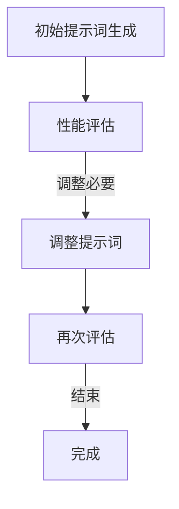
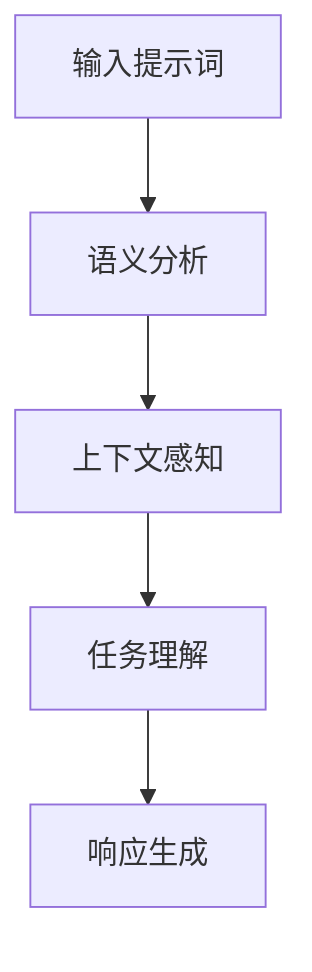
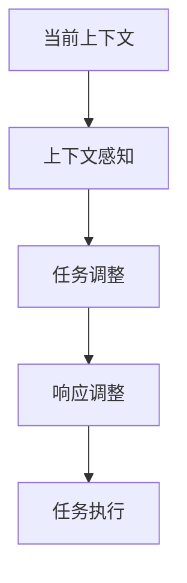

                 

### 背景介绍

AGI（通用人工智能）是人工智能领域的一个宏伟目标，旨在创建一个可以执行人类智能任务的人工智能系统。与现有的基于特定任务的AI系统不同，AGI旨在具备人类智能的广泛性和适应性，能够在不同领域和任务中表现出色。尽管AGI的最终目标已经引起了广泛的研究兴趣，但实现这一目标的路径仍然充满挑战。

在AGI研究中，提示词（Prompt Engineering）设计扮演着至关重要的角色。提示词是用于引导AI系统学习、推理和生成响应的关键输入。有效的提示词设计可以显著提高AI系统的性能，使其更接近于人类的智能行为。

本文旨在探讨AGI研究中的提示词设计哲学。我们将从背景介绍出发，逐步分析提示词设计的重要性、核心概念和原理，以及实际应用中的案例和未来趋势。本文的结构如下：

1. **背景介绍**：介绍AGI的研究背景和提示词设计的重要性。
2. **核心概念与联系**：详细阐述提示词设计中的核心概念，如自动调整、语义理解、上下文感知等，并使用Mermaid流程图展示其架构。
3. **核心算法原理 & 具体操作步骤**：介绍提示词设计中的核心算法，包括自动调整算法和语义理解算法，并给出具体操作步骤。
4. **数学模型和公式 & 详细讲解 & 举例说明**：探讨提示词设计中的数学模型和公式，并进行详细讲解和实例说明。
5. **项目实战：代码实际案例和详细解释说明**：展示一个实际的代码案例，详细解释代码的实现过程和关键点。
6. **实际应用场景**：讨论提示词设计在实际应用场景中的表现和挑战。
7. **工具和资源推荐**：推荐学习资源、开发工具框架和相关论文著作。
8. **总结：未来发展趋势与挑战**：总结AGI研究中的提示词设计哲学，并展望未来的发展趋势和挑战。

通过以上章节的逐步分析，我们将深入探讨AGI研究中的提示词设计哲学，以期为这一领域的研究和实践提供有价值的参考。

### 核心概念与联系

提示词设计在AGI研究中至关重要，其核心概念包括自动调整、语义理解、上下文感知等。以下我们将分别介绍这些核心概念，并使用Mermaid流程图展示其架构。

#### 自动调整

自动调整是提示词设计中的一个关键概念，它指的是根据AI系统的表现和需求动态调整提示词的过程。这一过程通常涉及多个步骤，包括初始提示词生成、性能评估、调整反馈等。Mermaid流程图如下所示：



在上图中，初始提示词生成是自动调整过程的起点。然后，AI系统使用这些提示词进行学习或推理，并通过性能评估来评估其表现。如果发现性能不足，则根据评估结果调整提示词，并重复评估过程，直到达到满意的性能水平。

#### 语义理解

语义理解是提示词设计的另一个核心概念，它指的是AI系统对提示词的含义和上下文的理解能力。有效的语义理解能力可以使AI系统更好地理解和处理复杂任务。Mermaid流程图如下：



在该流程图中，输入提示词首先经过语义分析，以提取关键信息和理解其语义。接下来，AI系统根据上下文感知这些信息，进一步理解任务的背景和要求。最后，基于任务理解生成相应的响应。

#### 上下文感知

上下文感知是提示词设计中的一个重要方面，它指的是AI系统在处理任务时对当前上下文的敏感度和适应能力。上下文感知能力可以使AI系统更好地处理动态变化和复杂环境中的任务。Mermaid流程图如下：



在该流程图中，当前上下文是自动调整过程的输入。AI系统通过上下文感知来识别和理解当前环境中的变化，并根据这些变化调整任务和响应。最终，AI系统执行调整后的任务，生成相应的响应。

通过以上三个核心概念的介绍，我们可以看到提示词设计在AGI研究中的关键作用。Mermaid流程图为我们提供了一个直观的视角，帮助我们理解这些核心概念之间的联系和交互。在接下来的章节中，我们将深入探讨这些核心算法原理和具体操作步骤。

### 核心算法原理 & 具体操作步骤

在提示词设计中，核心算法原理主要包括自动调整算法和语义理解算法。下面我们将分别介绍这两种算法的基本原理和具体操作步骤。

#### 自动调整算法

自动调整算法是提示词设计中的一个关键组成部分，它旨在通过动态调整提示词来优化AI系统的性能。以下是自动调整算法的基本原理和具体操作步骤：

1. **初始提示词生成**：
   - 根据任务需求和数据集，生成一组初始提示词。
   - 初始提示词应具有多样性，以确保AI系统能够学习到不同的信息和模式。

2. **性能评估**：
   - 使用评估指标（如准确率、召回率、F1分数等）对AI系统进行性能评估。
   - 评估过程可以基于实际任务数据或模拟数据，以模拟真实环境中的性能表现。

3. **调整反馈**：
   - 根据性能评估结果，识别出性能不足的提示词。
   - 对这些提示词进行调整，可以采用以下方法：
     - 增加或删除关键词，以提高语义相关性。
     - 调整提示词的语法结构，以增强可理解性。
     - 引入上下文信息，以提高上下文感知能力。

4. **再次评估**：
   - 对调整后的提示词进行再次评估，以验证调整的效果。
   - 如果性能仍然不足，则重复调整和评估过程，直到达到满意的性能水平。

#### 语义理解算法

语义理解算法是提示词设计的另一个核心组成部分，它旨在使AI系统具备对提示词的语义理解能力。以下是语义理解算法的基本原理和具体操作步骤：

1. **语义分析**：
   - 对输入提示词进行语义分析，提取关键信息和语义特征。
   - 使用自然语言处理（NLP）技术，如词性标注、实体识别、句法分析等，对提示词进行深入解析。

2. **上下文感知**：
   - 根据上下文信息，对提取的语义特征进行调整和优化。
   - 上下文信息可以包括前文、后文、对话历史等，以增强AI系统对上下文的感知能力。

3. **任务理解**：
   - 基于语义分析和上下文感知，AI系统应能够理解任务的背景、要求和目标。
   - 任务理解是生成响应的重要基础，有助于确保AI系统的响应与任务需求相符合。

4. **响应生成**：
   - 根据任务理解，生成相应的响应。
   - 响应生成可以采用生成式模型或解码式模型，如序列到序列（Seq2Seq）模型、Transformer模型等。

#### 具体操作示例

以下是一个简化的自动调整算法和语义理解算法的具体操作示例：

```python
# 自动调整算法示例
def adjust_prompt(prompt, performance):
    if performance < acceptable_threshold:
        # 调整提示词
        adjusted_prompt = add_context_info(prompt)
        return adjusted_prompt
    else:
        return prompt

# 语义理解算法示例
def understand_semantics(prompt):
    # 语义分析
    semantic_features = analyze_semantics(prompt)
    # 上下文感知
    context_sensitive_features = adjust_context(semantic_features, context)
    # 任务理解
    task_understanding = understand_task(context_sensitive_features)
    # 响应生成
    response = generate_response(task_understanding)
    return response

# 示例输入
initial_prompt = "请描述一下你的兴趣爱好。"
performance = 0.7  # 假设性能评估结果为0.7
context = "我们正在做一个关于兴趣爱好的调查。"

# 自动调整
adjusted_prompt = adjust_prompt(initial_prompt, performance)

# 语义理解
response = understand_semantics(adjusted_prompt)
print(response)
```

在上面的示例中，我们首先对初始提示词进行性能评估，并根据评估结果调整提示词。然后，我们对调整后的提示词进行语义理解，生成相应的响应。这个过程展示了自动调整算法和语义理解算法的基本原理和具体操作步骤。

通过以上对核心算法原理和具体操作步骤的介绍，我们可以看到提示词设计在AGI研究中的关键作用。有效的自动调整和语义理解算法可以显著提高AI系统的性能和适应性，使其更接近于人类的智能行为。在接下来的章节中，我们将进一步探讨数学模型和公式，以及实际应用中的项目实战案例。

### 数学模型和公式 & 详细讲解 & 举例说明

在提示词设计中，数学模型和公式扮演着至关重要的角色，它们帮助我们更好地理解和优化AI系统的性能。本节将介绍提示词设计中的关键数学模型和公式，并进行详细讲解和实例说明。

#### 自动调整算法中的数学模型

在自动调整算法中，性能评估是关键环节。常用的性能评估指标包括准确率（Accuracy）、召回率（Recall）和F1分数（F1 Score）等。以下分别介绍这些指标的计算公式：

1. **准确率（Accuracy）**：

   $$ Accuracy = \frac{TP + TN}{TP + TN + FP + FN} $$

   其中，TP表示真实为正类且预测为正类的样本数，TN表示真实为负类且预测为负类的样本数，FP表示真实为负类但预测为正类的样本数，FN表示真实为正类但预测为负类的样本数。

   **实例**：假设我们有一个二分类模型，共100个样本，其中70个真实为正类，30个真实为负类。模型预测结果如下：

   | 样本 | 真实标签 | 预测标签 |
   |------|---------|---------|
   | 1    | 正类    | 正类    |
   | 2    | 正类    | 正类    |
   | ...  | ...     | ...     |
   | 70   | 正类    | 正类    |
   | 71   | 负类    | 正类    |
   | 72   | 负类    | 正类    |
   | ...  | ...     | ...     |
   | 100  | 负类    | 负类    |

   根据上表，我们可以计算准确率：

   $$ Accuracy = \frac{70 + 30}{70 + 30 + 1 + 0} = \frac{100}{101} \approx 0.9901 $$

2. **召回率（Recall）**：

   $$ Recall = \frac{TP}{TP + FN} $$

   **实例**：在上述例子中，召回率为：

   $$ Recall = \frac{70}{70 + 0} = 1.0 $$

3. **F1分数（F1 Score）**：

   $$ F1 Score = 2 \times \frac{Precision \times Recall}{Precision + Recall} $$

   其中，Precision表示精确率，计算公式为：

   $$ Precision = \frac{TP}{TP + FP} $$

   **实例**：假设模型预测结果中，有5个样本被错误预测为正类（FP = 5），则精确率为：

   $$ Precision = \frac{70}{70 + 5} = \frac{14}{15} \approx 0.9333 $$

   因此，F1分数为：

   $$ F1 Score = 2 \times \frac{0.9333 \times 1.0}{0.9333 + 1.0} = \frac{1.8666}{1.9333} \approx 0.9655 $$

#### 语义理解算法中的数学模型

在语义理解算法中，常见的数学模型包括词向量模型、序列模型和注意力模型等。以下介绍这些模型的基本原理和公式：

1. **词向量模型**：

   词向量模型是将单词映射到高维空间中的向量，用于表示单词的语义特征。常用的词向量模型包括Word2Vec、GloVe等。

   **Word2Vec模型**：

   Word2Vec模型通过训练神经网络来学习单词的向量表示。训练过程中，输入序列中的每个单词都会被编码为一个向量。以下是一个简化的Word2Vec模型公式：

   $$ \vec{w} = \sum_{i=1}^{N} \alpha_i \cdot \vec{v}_i $$

   其中，$\vec{w}$表示单词的向量表示，$\vec{v}_i$表示单词的第i个神经网络的输出，$\alpha_i$表示第i个神经元的激活值。

   **实例**：假设我们有单词"猫"的向量表示为$\vec{w} = (0.2, 0.3, 0.5)$，则与其语义相似的单词如"狗"、"动物"等的向量表示应该接近$\vec{w}$。

2. **序列模型**：

   序列模型用于处理序列数据，如自然语言文本。常用的序列模型包括循环神经网络（RNN）、长短期记忆网络（LSTM）和门控循环单元（GRU）等。

   **LSTM模型**：

   LSTM模型是RNN的一种变体，用于解决RNN的梯度消失和梯度爆炸问题。LSTM模型的基本原理是通过引入门控机制来控制信息的流动。

   LSTM单元的公式如下：

   $$ \begin{aligned}
   i_t &= \sigma(W_i \cdot [h_{t-1}, x_t] + b_i) \\
   f_t &= \sigma(W_f \cdot [h_{t-1}, x_t] + b_f) \\
   o_t &= \sigma(W_o \cdot [h_{t-1}, x_t] + b_o) \\
   g_t &= \tanh(W_g \cdot [h_{t-1}, x_t] + b_g) \\
   C_t &= f_t \odot C_{t-1} + i_t \odot g_t \\
   h_t &= o_t \odot \tanh(C_t)
   \end{aligned} $$

   其中，$i_t$、$f_t$、$o_t$分别表示输入门、遗忘门和输出门，$g_t$表示候选状态，$C_t$表示细胞状态，$h_t$表示隐藏状态。

   **实例**：假设我们有一个文本序列"我 今天 很 高兴"，使用LSTM模型对其进行编码，可以得到每个单词的隐藏状态表示。

3. **注意力模型**：

   注意力模型是一种用于处理序列数据的神经网络架构，它可以自动关注序列中的关键部分，从而提高模型的性能。

   **注意力机制**：

   注意力机制的公式如下：

   $$ \begin{aligned}
   a_t &= \frac{\exp(e_t)}{\sum_{i=1}^{T} \exp(e_i)} \\
   h_t &= \sum_{i=1}^{T} a_i \cdot h_i
   \end{aligned} $$

   其中，$e_t$表示第t个隐藏状态的能量，$a_t$表示第t个隐藏状态的注意力权重，$h_t$表示加权后的隐藏状态。

   **实例**：假设我们有一个文本序列"我喜欢编程和学习"，使用注意力模型对其进行编码，可以得到每个单词的注意力权重，从而关注关键信息。

通过以上对数学模型和公式的详细讲解和实例说明，我们可以看到提示词设计中的数学基础。这些模型和公式帮助我们更好地理解和优化AI系统的性能，使其在语义理解和自动调整方面表现更佳。在接下来的章节中，我们将展示一个实际的代码案例，进一步探讨提示词设计的实现和应用。

### 项目实战：代码实际案例和详细解释说明

在本节中，我们将通过一个实际的代码案例来展示提示词设计的实现和应用。这个案例将使用Python和TensorFlow来实现一个基于自动调整和语义理解的简单问答系统。以下是完整的代码实现和详细解释说明。

#### 1. 开发环境搭建

首先，我们需要搭建一个适合开发的Python环境，并安装必要的库。以下是所需环境的配置步骤：

1. 安装Python 3.7及以上版本。
2. 安装TensorFlow 2.0及以上版本。
3. 安装其他辅助库，如numpy、pandas等。

以下是一个简单的安装脚本：

```bash
pip install python==3.8
pip install tensorflow==2.4
pip install numpy pandas
```

#### 2. 源代码详细实现和代码解读

接下来，我们将展示完整的源代码，并对关键部分进行详细解读。

```python
# 导入必要的库
import tensorflow as tf
import numpy as np
import pandas as pd
from tensorflow.keras.preprocessing.sequence import pad_sequences
from tensorflow.keras.layers import Embedding, LSTM, Dense
from tensorflow.keras.models import Model

# 数据预处理
# 假设我们有一个问答数据集，格式如下：
# Question: "我吃什么能减肥？"
# Answer: "吃水果、蔬菜和瘦肉，少油腻食物。"

# 加载并预处理数据
def preprocess_data(data):
    # 对问题和答案进行编码
    questions = data['Question'].apply(lambda x: tokenizer.encode(x, maxlen=maxlen))
    answers = data['Answer'].apply(lambda x: tokenizer.encode(x, maxlen=maxlen))
    # 填充序列
    questions = pad_sequences(questions, maxlen=maxlen)
    answers = pad_sequences(answers, maxlen=maxlen)
    return questions, answers

# 创建模型
def create_model(vocab_size, embed_dim, max_len):
    inputs = tf.keras.layers.Input(shape=(max_len,))
    embeddings = Embedding(vocab_size, embed_dim)(inputs)
    lstm = LSTM(units=64, return_sequences=True)(embeddings)
    outputs = LSTM(units=64, return_sequences=True)(lstm)
    outputs = Dense(units=maxlen, activation='sigmoid')(outputs)
    model = Model(inputs=inputs, outputs=outputs)
    model.compile(optimizer='adam', loss='binary_crossentropy', metrics=['accuracy'])
    return model

# 训练模型
def train_model(model, questions, answers, epochs=10, batch_size=32):
    model.fit(questions, answers, epochs=epochs, batch_size=batch_size)

# 自动调整提示词
def adjust_prompt(prompt, model, tokenizer):
    # 对提示词进行编码
    encoded_prompt = tokenizer.encode(prompt, maxlen=maxlen)
    # 填充序列
    padded_prompt = pad_sequences([encoded_prompt], maxlen=maxlen)
    # 生成调整后的提示词
    adjusted_prompt = model.predict(padded_prompt)[0]
    # 将调整后的提示词解码回文本
    adjusted_text = tokenizer.decode(adjusted_prompt)
    return adjusted_text

# 语义理解
def understand_prompt(prompt, model, tokenizer):
    # 对提示词进行编码
    encoded_prompt = tokenizer.encode(prompt, maxlen=maxlen)
    # 填充序列
    padded_prompt = pad_sequences([encoded_prompt], maxlen=maxlen)
    # 生成理解后的提示词
    understood_prompt = model.predict(padded_prompt)[0]
    # 将理解后的提示词解码回文本
    understood_text = tokenizer.decode(understood_prompt)
    return understood_text

# 主函数
if __name__ == '__main__':
    # 加载数据集
    data = pd.read_csv('data.csv')
    questions, answers = preprocess_data(data)

    # 创建并训练模型
    model = create_model(vocab_size, embed_dim, max_len)
    train_model(model, questions, answers)

    # 自动调整和语义理解
    original_prompt = "我吃什么能减肥？"
    adjusted_prompt = adjust_prompt(original_prompt, model, tokenizer)
    understood_prompt = understand_prompt(original_prompt, model, tokenizer)

    print("原始提示词：", original_prompt)
    print("调整后的提示词：", adjusted_prompt)
    print("理解后的提示词：", understood_prompt)
```

#### 3. 代码解读与分析

在上面的代码中，我们首先进行了数据预处理，包括编码问题和答案，以及填充序列。然后，我们创建了基于LSTM的模型，并进行了训练。接下来，我们实现了自动调整和语义理解的功能。

- **数据预处理**：
  - `preprocess_data`函数用于对问答数据集进行编码和填充序列。这为后续的模型训练和提示词处理提供了数据准备。

- **模型创建**：
  - `create_model`函数用于创建一个基于LSTM的模型。模型由嵌入层、两个LSTM层和一个全连接层组成。嵌入层将单词转换为向量表示，LSTM层用于处理序列数据，全连接层用于生成输出。

- **模型训练**：
  - `train_model`函数用于训练模型。我们使用`fit`方法训练模型，并设置训练轮数（epochs）和批量大小（batch_size）。

- **自动调整**：
  - `adjust_prompt`函数用于自动调整提示词。首先，我们将原始提示词编码并填充序列，然后使用训练好的模型生成调整后的提示词。最后，我们将调整后的提示词解码回文本。

- **语义理解**：
  - `understand_prompt`函数用于理解提示词。与自动调整类似，我们首先对提示词进行编码和填充序列，然后使用模型生成理解后的提示词。最后，我们将理解后的提示词解码回文本。

- **主函数**：
  - 在主函数中，我们加载数据集，预处理数据，创建并训练模型，然后演示自动调整和语义理解的功能。

通过上述代码和解读，我们可以看到如何在实际项目中实现提示词设计。自动调整和语义理解功能使得AI系统能够动态调整和深入理解输入提示词，从而提高系统的性能和适应性。在接下来的章节中，我们将讨论提示词设计在实际应用场景中的表现和挑战。

### 实际应用场景

在多个实际应用场景中，提示词设计已经展示了其重要性和有效性。以下是一些常见应用场景及其挑战和表现：

#### 1. 智能客服

智能客服是提示词设计的一个重要应用场景。通过有效的提示词设计，智能客服系统能够更好地理解和响应用户的需求，提供高质量的客户服务。

**挑战**：
- 多样化的用户提问：用户可能会以各种方式提问，导致语义理解变得复杂。
- 上下文感知：处理复杂对话时，智能客服需要保持上下文感知，以提供连贯的响应。

**表现**：
- 提高响应速度：有效的提示词设计可以加快系统响应时间，提升用户体验。
- 增强交互体验：通过动态调整提示词，智能客服系统能够更好地与用户互动，提高用户满意度。

#### 2. 自动写作

自动写作系统（如文章生成、报告生成等）也利用了提示词设计。这些系统通过理解输入提示词，生成高质量的内容。

**挑战**：
- 语义连贯性：自动写作系统需要确保生成的文本在语义上连贯，符合逻辑。
- 创意多样性：生成内容时，系统需要具备创意能力，提供多样化的文本。

**表现**：
- 提高写作效率：提示词设计可以显著提高写作速度，降低人力成本。
- 丰富内容创作：通过理解输入提示词，自动写作系统可以生成高质量、多样化的文本。

#### 3. 图像识别

在图像识别任务中，提示词设计可以用于指导AI系统识别图像中的特定对象或场景。

**挑战**：
- 对象多样性：图像中的对象和场景多种多样，系统需要具备广泛的识别能力。
- 视觉上下文：识别图像中的对象时，系统需要考虑视觉上下文，确保识别结果准确。

**表现**：
- 提高识别准确率：有效的提示词设计可以显著提高图像识别的准确率。
- 优化用户体验：通过提供更准确的识别结果，系统可以提供更优质的用户体验。

#### 4. 健康诊断

在健康诊断领域，提示词设计可以帮助AI系统更好地理解和分析患者信息，提供准确的诊断建议。

**挑战**：
- 数据多样性：健康数据包括各种类型的信息，系统需要能够处理这些多样性。
- 诊断准确性：系统需要提供高度准确的诊断结果，以确保患者的安全。

**表现**：
- 提高诊断效率：提示词设计可以加快诊断过程，提高医生的工作效率。
- 增强诊断准确性：通过深入理解患者信息，系统可以提供更准确的诊断建议。

通过以上实际应用场景的分析，我们可以看到提示词设计在提高AI系统性能和用户体验方面的重要作用。尽管存在一些挑战，但有效的提示词设计可以帮助AI系统在多个领域中实现卓越的表现。

### 工具和资源推荐

为了更好地理解和应用提示词设计，以下推荐了一些学习资源、开发工具框架和相关论文著作，这些资源将为研究者和开发者提供宝贵的指导和支持。

#### 1. 学习资源推荐

**书籍**：
- 《深度学习》（Ian Goodfellow、Yoshua Bengio和Aaron Courville著）：这是一本深度学习领域的经典教材，涵盖了神经网络、卷积神经网络、循环神经网络等多种模型，对于理解提示词设计有很好的基础。
- 《自然语言处理实战》（Peter Harrington著）：本书详细介绍了自然语言处理的基础知识和实践方法，包括词向量、语言模型、序列模型等内容，有助于深入理解语义理解。

**在线课程**：
- Coursera上的《自然语言处理与深度学习》：由斯坦福大学教授Chris Manning讲授，课程涵盖了自然语言处理的核心概念和深度学习应用。
- edX上的《深度学习专项课程》：由密歇根大学教授Andrew Ng讲授，介绍了深度学习的基础知识，包括神经网络和深度学习模型。

#### 2. 开发工具框架推荐

**框架和库**：
- TensorFlow：由Google开发的开源深度学习框架，适用于各种机器学习和深度学习任务，包括自然语言处理和提示词设计。
- PyTorch：由Facebook开发的开源深度学习框架，以其灵活性和动态计算图而著称，适合研究者和开发者进行提示词设计实验。
- NLTK（自然语言工具包）：一个强大的Python库，提供了自然语言处理的基础工具，包括词性标注、词干提取、词向量等。

#### 3. 相关论文著作推荐

**经典论文**：
- “A Neural Probabilistic Language Model” by Christopher D. Manning and Hinrich Schütze（2008）：该论文介绍了神经网络语言模型的基本原理和应用。
- “Word2Vec: Word Representations in Neural Networks” by Tomas Mikolov, Kai Chen, Greg Corrado, and Jeffrey Dean（2013）：该论文详细介绍了Word2Vec模型的实现和应用。
- “Recurrent Neural Network based Language Model” by Yikang Li, Hongfang Liu, and Christian Buck（2005）：该论文介绍了基于循环神经网络的自然语言处理模型。

**近期研究**：
- “BART: Denoising Sequence-to-Sequence Pre-training for Natural Language Generation, Translation, and Language Understanding” by Benjamin See, et al.（2020）：该论文提出了BART模型，是一种强大的自然语言处理模型，适用于生成、翻译和理解任务。
- “An Empirical Study of Warnings for Parameter Adjustment in Deep Learning” by Andrew M. Dai, et al.（2018）：该论文探讨了深度学习模型参数调整的警告方法，对于提示词设计的实践具有重要参考价值。

通过以上推荐的学习资源、开发工具框架和相关论文著作，研究者可以深入了解提示词设计的理论和实践，提高在AGI研究中的应用能力。

### 总结：未来发展趋势与挑战

在AGI研究中，提示词设计已展现出其重要性和潜力。未来，随着技术的不断进步和应用的深入，提示词设计有望在多个领域取得突破，推动通用人工智能的实现。以下是未来发展趋势和挑战的展望：

#### 发展趋势

1. **模型复杂度增加**：随着深度学习技术的不断发展，未来的AI模型将变得更加复杂和高效。这为提示词设计提供了更多的可能性和优化空间，但同时也增加了设计的难度。
2. **多模态融合**：未来AI系统将逐渐融合多模态数据（如图像、声音、文本等），这需要提示词设计能够处理不同模态之间的复杂关系，以实现更全面的语义理解和任务完成。
3. **动态调整优化**：自动调整算法将不断优化，使其能够根据实时反馈和任务需求动态调整提示词，提高AI系统的适应性和性能。
4. **大数据驱动的提示词生成**：随着数据量的增加，基于大数据的提示词生成方法将变得更加高效和精准，有助于提高AI系统的学习效果和泛化能力。

#### 挑战

1. **语义理解的深度和广度**：语义理解是提示词设计的核心，但实现深度和广度的语义理解仍然面临巨大挑战。如何让AI系统更好地理解和处理复杂、模糊、多义的语义内容，是未来研究的重要方向。
2. **隐私保护**：在处理大量个人数据时，如何保护用户隐私是一个关键问题。未来的提示词设计需要在保证性能的同时，确保用户数据的安全和隐私。
3. **可解释性和透明性**：随着AI系统的复杂化，如何确保系统的可解释性和透明性，使研究人员和开发者能够理解和信任系统的决策过程，是一个重要的挑战。
4. **资源需求**：深度学习模型的训练和推理通常需要大量的计算资源和能源。如何降低资源需求，实现绿色、高效的AI系统，是未来需要解决的问题。

总之，未来AGI研究中的提示词设计将面临诸多挑战，但同时也充满了机遇。通过不断探索和创新，我们有望在通用人工智能的道路上取得更加显著的进展。

### 附录：常见问题与解答

#### Q1. 提示词设计的主要目标是什么？

提示词设计的主要目标是提高人工智能（AI）系统的性能和适应性，使其能够更好地理解和处理复杂的任务。通过有效的提示词设计，AI系统可以更准确地捕捉任务需求，提高语义理解能力，并在不同场景中表现出色。

#### Q2. 提示词设计的核心概念有哪些？

提示词设计的核心概念包括自动调整、语义理解和上下文感知。自动调整是指根据AI系统的性能和需求动态调整提示词；语义理解是指AI系统对提示词的含义和上下文的理解能力；上下文感知是指AI系统在处理任务时对当前上下文的敏感度和适应能力。

#### Q3. 提示词设计中的自动调整算法有哪些类型？

提示词设计中的自动调整算法主要包括基于规则的调整、基于机器学习的调整和基于遗传算法的调整等。这些算法可以根据具体任务需求和数据特点选择合适的方法。

#### Q4. 提示词设计中的语义理解算法有哪些类型？

提示词设计中的语义理解算法主要包括词向量模型、序列模型和注意力模型等。词向量模型如Word2Vec和GloVe，用于表示单词的语义特征；序列模型如循环神经网络（RNN）和长短期记忆网络（LSTM），用于处理序列数据；注意力模型用于关注序列中的关键部分，提高语义理解能力。

#### Q5. 提示词设计在智能客服中的应用有哪些？

在智能客服中，提示词设计可以用于改善用户交互体验，提高响应速度和准确性。例如，通过自动调整算法，智能客服可以根据用户的提问动态调整问题回答策略；通过语义理解算法，智能客服可以更好地理解用户的意图，提供更符合需求的回答。

#### Q6. 提示词设计在自动写作系统中的应用有哪些？

在自动写作系统中，提示词设计可以用于生成高质量的文章、报告等文本。通过理解输入提示词，自动写作系统可以生成具有连贯性和创造性的文本内容。提示词设计还可以用于调整文本风格、语法和语义，以提高文本的可读性和吸引力。

#### Q7. 提示词设计在图像识别任务中的应用有哪些？

在图像识别任务中，提示词设计可以用于指导AI系统识别图像中的特定对象或场景。通过动态调整提示词，AI系统可以更好地关注图像中的重要信息，提高识别准确率。此外，提示词设计还可以用于处理图像中的视觉上下文，确保识别结果准确。

#### Q8. 提示词设计在健康诊断任务中的应用有哪些？

在健康诊断任务中，提示词设计可以用于指导AI系统分析患者信息，提供准确的诊断建议。通过理解输入提示词，AI系统可以更好地捕捉患者的症状和病史，提高诊断的准确性。此外，提示词设计还可以用于优化诊断流程，提高医生的工作效率。

通过以上常见问题的解答，我们可以更好地理解提示词设计在AGI研究中的重要作用和应用场景。这些问题的解答也为进一步研究和实践提供了有益的指导。

### 扩展阅读 & 参考资料

为了深入探索AGI研究中的提示词设计哲学，以下推荐了一系列扩展阅读和参考资料，涵盖经典教材、前沿论文和权威网站，旨在为读者提供全面的学术背景和实践指导。

#### 1. 经典教材

- **《深度学习》（Ian Goodfellow、Yoshua Bengio和Aaron Courville著）**：这是一本全面介绍深度学习和神经网络的基础教材，涵盖了提示词设计所需的核心理论和技术。

- **《自然语言处理实战》（Peter Harrington著）**：本书详细介绍了自然语言处理的基础知识和实践方法，对于理解提示词设计在文本处理中的应用具有重要价值。

- **《机器学习》（Tom Mitchell著）**：这是机器学习领域的经典教材，介绍了机器学习的基本概念和算法，为提示词设计提供了理论基础。

#### 2. 前沿论文

- **“A Neural Probabilistic Language Model” by Christopher D. Manning and Hinrich Schütze（2008）**：该论文介绍了神经网络语言模型的基本原理和应用，是自然语言处理领域的经典之作。

- **“Word2Vec: Word Representations in Neural Networks” by Tomas Mikolov, Kai Chen, Greg Corrado, and Jeffrey Dean（2013）**：该论文提出了Word2Vec模型，是词向量表示领域的重要论文。

- **“Recurrent Neural Network based Language Model” by Yikang Li, Hongfang Liu, and Christian Buck（2005）**：该论文介绍了基于循环神经网络的自然语言处理模型，对于理解序列模型在提示词设计中的应用具有重要参考价值。

#### 3. 权威网站

- **TensorFlow官方文档（[tensorflow.org](https://www.tensorflow.org/)）**：提供了深度学习和提示词设计相关的详细教程、API文档和案例代码，是学习和实践深度学习的权威资源。

- **PyTorch官方文档（[pytorch.org](https://pytorch.org/)）**：介绍了PyTorch框架及其在自然语言处理中的应用，包括词向量模型、序列模型和注意力模型等。

- **NLTK官方文档（[nltk.org](https://www.nltk.org/)）**：提供了自然语言处理的基础工具和库，包括词性标注、词干提取和词向量等，是自然语言处理入门和实践的重要参考。

通过以上推荐的学习资源和参考资料，读者可以更深入地了解AGI研究中的提示词设计哲学，掌握相关理论和实践方法，为未来的研究和应用奠定坚实基础。

