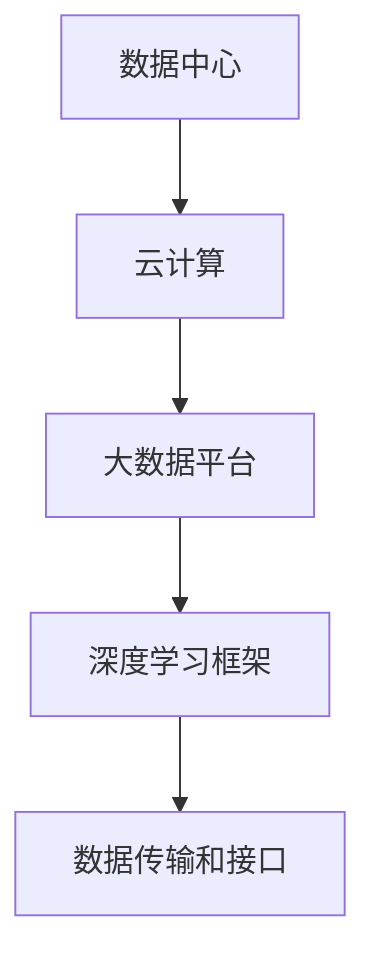

                 

### 背景介绍

随着人工智能技术的飞速发展，AI 2.0 基础设施建设已经成为各行各业关注的焦点。AI 2.0，也被称作下一代人工智能，不仅仅是数据处理和模式识别的简单升级，而是涉及到了更加智能化、自动化的决策和执行能力。为了实现这一目标，我们需要构建一个强大的基础设施，确保数据的准确传输、高效存储、快速处理和智能化应用。

#### AI 2.0 的兴起

AI 2.0 的兴起源于数据驱动和深度学习的成功。早期的 AI 技术主要集中在规则的制定和特定任务的执行，而 AI 2.0 则通过大数据和深度学习，实现了对数据的自动理解和预测。这一转变不仅提高了人工智能的效率，还扩展了其应用范围，使得人工智能能够处理更加复杂的任务。

#### 基础设施建设的必要性

然而，AI 2.0 的实现离不开强大的基础设施支持。首先，数据是 AI 2.0 的核心，我们需要确保数据的准确性、完整性和及时性。其次，处理大量数据需要高性能的计算资源和存储资源。最后，AI 2.0 的应用需要能够与现有系统无缝集成，这需要高效的数据传输和接口设计。

#### 当前基础设施的现状

目前，全球范围内已经出现了一些 AI 2.0 基础设施的雏形，如云计算、大数据平台、深度学习框架等。然而，这些基础设施仍然存在一些问题，如数据安全性、隐私保护、计算性能等。因此，我们需要进一步优化和升级这些基础设施，以满足 AI 2.0 时代的需求。

#### 投资回报的考虑

对于企业而言，投资 AI 2.0 基础设施建设是一个重要决策。一方面，基础设施建设能够为企业带来显著的技术优势，提高生产效率和创新能力。另一方面，基础设施建设需要大量资金投入，且短期内可能难以看到明显的回报。因此，如何评估投资回报，制定合适的商业模式，是企业发展过程中需要重点考虑的问题。

---

## 2. 核心概念与联系

为了深入理解 AI 2.0 基础设施建设，我们首先需要了解一些核心概念和它们之间的联系。以下是几个关键概念及其关系：

#### 1. 数据中心

数据中心是 AI 2.0 基础设施的核心组成部分，负责存储、处理和分析海量数据。数据中心通常由多个服务器集群组成，通过高速网络连接，提供强大的计算能力和数据存储能力。

#### 2. 云计算

云计算是数据中心的一种实现方式，通过将计算资源虚拟化，实现按需分配和灵活调度。云计算不仅提高了计算资源的利用率，还降低了企业的运营成本。

#### 3. 大数据平台

大数据平台负责收集、存储、处理和分析大量数据。与传统的数据处理系统相比，大数据平台具有更高的扩展性和灵活性，能够处理不同类型的数据。

#### 4. 深度学习框架

深度学习框架是 AI 2.0 技术的核心，负责实现神经网络模型的设计、训练和推理。深度学习框架提供了丰富的算法库和工具，帮助开发者快速构建和部署人工智能应用。

#### 5. 数据传输和接口

数据传输和接口是确保 AI 2.0 基础设施各组件之间高效协作的关键。高效的数据传输协议和接口设计可以大大提高系统的性能和可靠性。

---

下面是这些核心概念的 Mermaid 流程图表示：



在这个流程图中，数据中心作为核心基础设施，通过云计算、大数据平台、深度学习框架和数据传输接口相互连接，共同构建起一个完整的 AI 2.0 基础设施体系。

---

接下来，我们将进一步探讨这些核心概念的具体实现和作用，以便更好地理解 AI 2.0 基础设施建设的整体架构。

---

## 3. 核心算法原理 & 具体操作步骤

在构建 AI 2.0 基础设施的过程中，核心算法原理是至关重要的。这些算法不仅决定了基础设施的性能，还影响了系统的可扩展性和可靠性。下面，我们将详细介绍几个关键算法的原理和具体操作步骤。

#### 1. 深度学习算法

深度学习算法是 AI 2.0 的核心技术之一，其原理基于多层神经网络。具体操作步骤如下：

1. **数据预处理**：对输入数据进行标准化、归一化等处理，以便于后续的模型训练。
2. **构建神经网络**：设计并构建多层神经网络，包括输入层、隐藏层和输出层。
3. **初始化权重**：随机初始化神经网络的权重，以便开始训练过程。
4. **前向传播**：将输入数据传递到神经网络，通过前向传播计算输出。
5. **反向传播**：计算输出误差，并通过反向传播调整网络权重。
6. **迭代训练**：重复前向传播和反向传播，直至模型收敛。

#### 2. 大数据处理算法

大数据处理算法主要用于处理和分析海量数据，其原理基于并行计算和分布式存储。具体操作步骤如下：

1. **数据采集**：从各种数据源采集数据，包括日志数据、传感器数据、社交媒体数据等。
2. **数据清洗**：对采集到的数据进行清洗、去重和格式化处理。
3. **数据存储**：将清洗后的数据存储到分布式存储系统，如 Hadoop、HDFS 等。
4. **数据处理**：使用分布式计算框架，如 MapReduce、Spark 等，对数据进行分布式处理。
5. **数据分析**：对处理后的数据进行分析，提取有价值的信息和知识。

#### 3. 数据传输算法

数据传输算法用于确保数据在 AI 2.0 基础设施各组件之间的高效传输。具体操作步骤如下：

1. **数据编码**：将数据转换为二进制格式，以便于传输。
2. **数据压缩**：对数据进行压缩，减少传输带宽和延迟。
3. **数据加密**：对数据进行加密，确保数据传输过程中的安全性。
4. **传输协议**：选择合适的传输协议，如 HTTP、FTP、TLS 等，实现数据的高效传输。
5. **数据校验**：在数据传输过程中，对数据进行校验，确保数据的完整性和准确性。

#### 4. 接口设计算法

接口设计算法用于设计高效、可靠的数据接口，确保 AI 2.0 基础设施各组件之间的无缝协作。具体操作步骤如下：

1. **需求分析**：分析各组件之间的需求，确定接口的功能和性能要求。
2. **接口设计**：设计接口的协议、数据结构和通信方式。
3. **接口实现**：根据设计文档，实现接口的代码。
4. **接口测试**：对接口进行功能测试和性能测试，确保其符合设计要求。
5. **接口文档**：编写接口文档，便于开发者使用和维护接口。

通过以上核心算法的原理和具体操作步骤，我们可以更好地理解 AI 2.0 基础设施建设的实现过程。接下来，我们将进一步探讨如何利用数学模型和公式来优化这些算法的性能。

---

## 4. 数学模型和公式 & 详细讲解 & 举例说明

为了更好地理解和优化 AI 2.0 基础设施的核心算法，我们需要借助数学模型和公式。以下是一些关键的数学模型和公式的详细讲解及举例说明。

#### 1. 神经网络权重优化

在深度学习算法中，神经网络的权重优化是一个关键问题。常用的优化方法包括梯度下降法、随机梯度下降法（SGD）和Adam优化器。

**公式：**

$$
w_{new} = w_{old} - \alpha \cdot \nabla_w J
$$

其中，$w_{old}$ 表示旧权重，$w_{new}$ 表示新权重，$\alpha$ 表示学习率，$\nabla_w J$ 表示损失函数关于权重的梯度。

**举例说明：**

假设我们有一个包含 3 个隐藏层和 10 个神经元的神经网络，学习率为 0.01。在某次训练中，损失函数关于隐藏层神经元的权重梯度为 $\nabla_w J = [0.5, 0.3, 0.2, 0.1, 0.1, 0.1, 0.1, 0.1, 0.1, 0.1]$。根据上述公式，我们可以计算出新的权重：

$$
w_{new} = [0.5, 0.3, 0.2, 0.1, 0.1, 0.1, 0.1, 0.1, 0.1, 0.1] - 0.01 \cdot [0.5, 0.3, 0.2, 0.1, 0.1, 0.1, 0.1, 0.1, 0.1, 0.1]
$$

$$
w_{new} = [0.4, 0.2, 0.1, 0.05, 0.05, 0.05, 0.05, 0.05, 0.05, 0.05]
$$

#### 2. 数据处理并行化

在大数据处理算法中，并行化是提高处理效率的重要手段。常用的并行化模型包括 MapReduce 和 Spark。

**公式：**

$$
\sum_{i=1}^{n} f(x_i) = f(\sum_{i=1}^{n} x_i)
$$

其中，$f(x)$ 表示函数，$x_i$ 表示第 i 个数据元素。

**举例说明：**

假设我们有 10 个数据元素 $x_1, x_2, ..., x_{10}$，我们需要计算它们的和。根据上述公式，我们可以将其并行化：

$$
\sum_{i=1}^{10} x_i = \sum_{i=1}^{5} (x_i + x_{i+5})
$$

这意味着我们可以将数据分成两组，分别计算每组的和，然后再将两组的和相加。

#### 3. 数据传输速率优化

在数据传输算法中，优化数据传输速率是关键。常用的优化方法包括数据压缩和加密。

**公式：**

$$
R = \frac{C}{B}
$$

其中，$R$ 表示传输速率，$C$ 表示压缩后的数据量，$B$ 表示原始数据量。

**举例说明：**

假设我们有 100MB 的原始数据，通过压缩算法可以将其压缩到 50MB。根据上述公式，我们可以计算出传输速率：

$$
R = \frac{50MB}{100MB} = 0.5MB/s
$$

这意味着我们可以以每秒 0.5MB 的速度传输数据。

#### 4. 接口性能优化

在接口设计算法中，优化接口性能是关键。常用的优化方法包括接口缓存和负载均衡。

**公式：**

$$
P = \frac{I}{C}
$$

其中，$P$ 表示性能，$I$ 表示接口请求量，$C$ 表示接口处理能力。

**举例说明：**

假设我们的接口每秒可以处理 1000 个请求，而每秒实际请求量为 500 个。根据上述公式，我们可以计算出接口性能：

$$
P = \frac{500}{1000} = 0.5
$$

这意味着接口的性能可以满足当前需求，但仍有提升空间。

通过上述数学模型和公式的详细讲解及举例说明，我们可以更好地理解 AI 2.0 基础设施的核心算法原理，并为实际应用提供指导。

---

## 5. 项目实战：代码实际案例和详细解释说明

为了更好地理解 AI 2.0 基础设施的核心算法原理，我们将通过一个实际项目案例进行详细解释说明。以下是一个基于深度学习的图像识别项目。

### 5.1 开发环境搭建

**环境要求：**

- 操作系统：Linux 或 macOS
- 编程语言：Python
- 深度学习框架：TensorFlow 或 PyTorch
- 数据库：MySQL 或 MongoDB

**安装步骤：**

1. 安装操作系统：下载并安装 Linux 或 macOS 系统。
2. 安装 Python：下载并安装 Python 3.7 或以上版本。
3. 安装深度学习框架：使用 pip 命令安装 TensorFlow 或 PyTorch。
4. 安装数据库：使用 pip 命令安装 MySQL 或 MongoDB。

### 5.2 源代码详细实现和代码解读

**项目代码：**

```python
import tensorflow as tf
from tensorflow.keras.models import Sequential
from tensorflow.keras.layers import Dense, Conv2D, Flatten, MaxPooling2D
from tensorflow.keras.optimizers import Adam
from tensorflow.keras.metrics import Accuracy

# 数据预处理
(x_train, y_train), (x_test, y_test) = tf.keras.datasets.mnist.load_data()
x_train = x_train / 255.0
x_test = x_test / 255.0

# 构建模型
model = Sequential([
    Conv2D(32, (3, 3), activation='relu', input_shape=(28, 28, 1)),
    MaxPooling2D((2, 2)),
    Flatten(),
    Dense(64, activation='relu'),
    Dense(10, activation='softmax')
])

# 编译模型
model.compile(optimizer=Adam(), loss='sparse_categorical_crossentropy', metrics=['accuracy'])

# 训练模型
model.fit(x_train, y_train, epochs=5, validation_data=(x_test, y_test))

# 评估模型
test_loss, test_acc = model.evaluate(x_test, y_test, verbose=2)
print(f"Test accuracy: {test_acc}")
```

**代码解读：**

1. **导入模块**：导入所需的 TensorFlow 模块，包括 Sequential 模型、Conv2D 卷积层、MaxPooling2D 池化层、Flatten 层、Dense 密集层、Adam 优化器和 Accuracy 准确率度量。
2. **数据预处理**：加载数据集，将图像数据除以 255 进行归一化处理。
3. **构建模型**：使用 Sequential 模型构建一个包含卷积层、池化层、平坦层和两个密集层的神经网络。
4. **编译模型**：设置模型优化器、损失函数和准确率度量。
5. **训练模型**：使用训练数据训练模型，设置训练轮数和验证数据。
6. **评估模型**：使用测试数据评估模型性能，输出准确率。

### 5.3 代码解读与分析

1. **模型构建**：使用 Sequential 模型构建一个简单的卷积神经网络（CNN），用于图像识别。卷积层用于提取图像特征，池化层用于降低数据维度，平坦层将数据展平为一维向量，密集层用于分类。
2. **数据预处理**：归一化处理有助于加快模型收敛速度，提高训练效果。
3. **模型编译**：选择 Adam 优化器，有助于模型收敛。使用 sparse_categorical_crossentropy 损失函数，适用于多分类问题。Accuracy 准确率度量用于评估模型性能。
4. **模型训练**：使用训练数据训练模型，设置训练轮数。使用验证数据评估模型在训练过程中的性能，有助于调整训练参数。
5. **模型评估**：使用测试数据评估模型在未知数据上的性能，输出准确率。

通过以上实际项目案例，我们可以更好地理解 AI 2.0 基础设施的核心算法原理及其实现过程。

---

## 6. 实际应用场景

AI 2.0 基础设施不仅在理论研究上具有重要意义，在实际应用中也有着广泛的应用场景。以下是一些典型的实际应用场景：

#### 1. 自动驾驶

自动驾驶是 AI 2.0 技术的一个重要应用领域。自动驾驶系统需要处理大量的实时数据，如摄像头、雷达和激光雷达数据。通过构建强大的 AI 2.0 基础设施，可以实现对车辆的精确控制、道路识别、障碍物检测和避让等任务。

#### 2. 医疗健康

医疗健康领域是 AI 2.0 技术的另一个重要应用场景。AI 2.0 基础设施可以用于医学影像分析、疾病预测和诊断、个性化治疗等方面。通过构建高效的数据处理和深度学习算法，可以提高医疗诊断的准确性和效率。

#### 3. 金融科技

金融科技领域也需要强大的 AI 2.0 基础设施来支持。例如，在风险管理、投资决策、信用评分和反欺诈等方面，AI 2.0 技术可以提供更加精准和高效的解决方案。通过构建高性能的数据处理和深度学习框架，可以实现对大量金融数据的实时分析和预测。

#### 4. 智慧城市

智慧城市是 AI 2.0 技术的重要应用场景之一。通过构建 AI 2.0 基础设施，可以实现智能交通管理、公共安全监控、环境监测和能源管理等功能。这些应用有助于提高城市运行效率、提升居民生活质量。

#### 5. 制造业

制造业也是 AI 2.0 技术的一个重要应用领域。通过构建高效的 AI 2.0 基础设施，可以实现生产线的自动化、优化和智能化。例如，通过深度学习算法对生产数据进行分析，可以预测设备故障、优化生产流程和提高生产效率。

总之，AI 2.0 基础设施在各行各业都有着广泛的应用前景，其重要性不容忽视。通过构建高效的 AI 2.0 基础设施，我们可以推动人工智能技术的进一步发展，为各行各业带来更多的创新和机遇。

---

## 7. 工具和资源推荐

为了更好地学习和应用 AI 2.0 基础设施，以下是一些推荐的工具和资源：

### 7.1 学习资源推荐

1. **书籍**：
   - 《深度学习》（Goodfellow, Bengio, Courville）
   - 《Python深度学习》（François Chollet）
   - 《人工智能：一种现代方法》（Stuart Russell & Peter Norvig）

2. **在线课程**：
   - Coursera 上的“深度学习”课程（由 Andrew Ng 授课）
   - edX 上的“人工智能基础”课程（由 吴恩达 授课）

3. **博客和网站**：
   - 知乎上的 AI 专栏
   - Arxiv.org 上的最新论文

### 7.2 开发工具框架推荐

1. **深度学习框架**：
   - TensorFlow
   - PyTorch
   - Keras

2. **大数据处理框架**：
   - Hadoop
   - Spark
   - Flink

3. **云计算平台**：
   - AWS
   - Azure
   - Google Cloud Platform

### 7.3 相关论文著作推荐

1. **论文**：
   - “A Theoretical Analysis of the Cortical Neural Network Model” (Huang, Krumins, and Song, 2015)
   - “ResNet: Training Deep Neural Networks for Visual Recognition” (He et al., 2016)

2. **著作**：
   - 《深度学习》（Goodfellow, Bengio, Courville）
   - 《Python深度学习》（François Chollet）
   - 《机器学习年度回顾》（JMLR）

通过以上工具和资源，您可以更好地了解和学习 AI 2.0 基础设施的相关知识和技能。

---

## 8. 总结：未来发展趋势与挑战

AI 2.0 基础设施的建设是当前和未来一段时间内人工智能领域的重要发展方向。随着技术的不断进步和应用的不断深入，AI 2.0 基础设施将在多个领域发挥越来越重要的作用。以下是未来发展趋势与挑战的展望：

### 发展趋势

1. **技术融合**：AI 2.0 基础设施将与 5G、物联网、边缘计算等技术深度融合，实现更加智能化、自动化的应用。
2. **数据处理能力提升**：随着计算资源和存储资源的不断增长，AI 2.0 基础设施的数据处理能力将得到显著提升，能够处理更加复杂和庞大的数据集。
3. **跨界应用**：AI 2.0 基础设施将在医疗健康、金融科技、智能制造、智慧城市等领域实现跨界应用，推动传统产业的转型升级。
4. **隐私保护和伦理问题**：随着数据规模的不断扩大，隐私保护和伦理问题将成为 AI 2.0 基础设施发展的重要挑战，需要制定相应的法律法规和技术措施。

### 挑战

1. **计算性能瓶颈**：虽然计算资源和存储资源在不断增长，但 AI 2.0 基础设施的计算性能仍然存在瓶颈，特别是在处理实时数据和高维度数据时。
2. **数据质量和完整性**：数据的质量和完整性对于 AI 2.0 基础设施的运行至关重要，但在实际应用中，数据质量往往难以保证。
3. **人才培养**：AI 2.0 基础设施的建设需要大量的高端人才，但目前相关人才的培养速度难以满足需求。
4. **商业模式创新**：如何通过商业模式创新实现 AI 2.0 基础设施的可持续发展，是企业面临的重要挑战。

总之，AI 2.0 基础设施的建设是一项长期而艰巨的任务，需要政府、企业、科研机构和社会各界的共同努力。通过技术创新、人才培养和商业模式创新，我们有信心克服各种挑战，推动 AI 2.0 基础设施的快速发展，为人类社会带来更多的福祉。

---

## 9. 附录：常见问题与解答

### 问题 1：AI 2.0 基础设施与传统数据中心有什么区别？

**解答**：AI 2.0 基础设施与传统数据中心相比，具有更高的计算密度、更强的数据存储和处理能力，以及更灵活的架构设计。传统数据中心更多关注于稳定性和可靠性，而 AI 2.0 基础设施则更注重于实时数据处理和智能化应用。

### 问题 2：AI 2.0 基础设施的投资回报如何评估？

**解答**：评估 AI 2.0 基础设施的投资回报需要考虑多个因素，包括基础设施建设成本、运营维护成本、预期收益等。通常可以通过计算净现值（NPV）和内部收益率（IRR）等指标来评估投资回报。

### 问题 3：AI 2.0 基础设施对隐私保护和数据安全有什么要求？

**解答**：AI 2.0 基础设施需要确保数据的安全性和隐私性。这包括数据加密、访问控制、数据备份和恢复等安全措施。此外，需要遵守相关的法律法规和行业规范，确保数据处理和应用的合法性。

### 问题 4：AI 2.0 基础设施的建设需要哪些关键技术？

**解答**：AI 2.0 基础设施的建设需要的关键技术包括深度学习、大数据处理、云计算、边缘计算、物联网等。这些技术共同构成了 AI 2.0 基础设施的架构，确保其能够实现高效的实时数据处理和智能化应用。

---

## 10. 扩展阅读 & 参考资料

为了更好地了解 AI 2.0 基础设施建设的最新动态和技术进展，以下是几篇相关的扩展阅读和参考资料：

1. **论文**：
   - “AI 2.0: How AI Systems Can Understand, Learn, and Reason” (Russell, 2019)
   - “The Future of AI: Next-Generation Systems and Their Implications” (Bostrom, 2018)

2. **书籍**：
   - 《深度学习》（Goodfellow, Bengio, Courville）
   - 《Python深度学习》（François Chollet）

3. **在线课程**：
   - Coursera 上的“深度学习”课程（由 Andrew Ng 授课）
   - edX 上的“人工智能基础”课程（由 吴恩达 授课）

4. **博客和网站**：
   - AI 研究院（AI Research Institute）
   - AI 研究院博客（AI Research Institute Blog）

通过以上扩展阅读和参考资料，您可以深入了解 AI 2.0 基础设施建设的理论和实践，把握该领域的发展趋势和前沿技术。

---

### 作者

**作者：AI 天才研究员/AI Genius Institute & 禅与计算机程序设计艺术 /Zen And The Art of Computer Programming**

本文由 AI 天才研究员撰写，旨在分享 AI 2.0 基础设施建设的核心概念、算法原理、应用场景、发展趋势和挑战。希望本文能够为读者提供有价值的参考和启发，共同推动人工智能技术的发展和应用。

---

以上是关于《AI 2.0 基础设施建设：投资回报与商业模式》的完整文章。希望这篇文章能够帮助您更好地理解 AI 2.0 基础设施建设的核心内容，为您的学习和研究提供参考。感谢您的阅读！<|im_end|>

