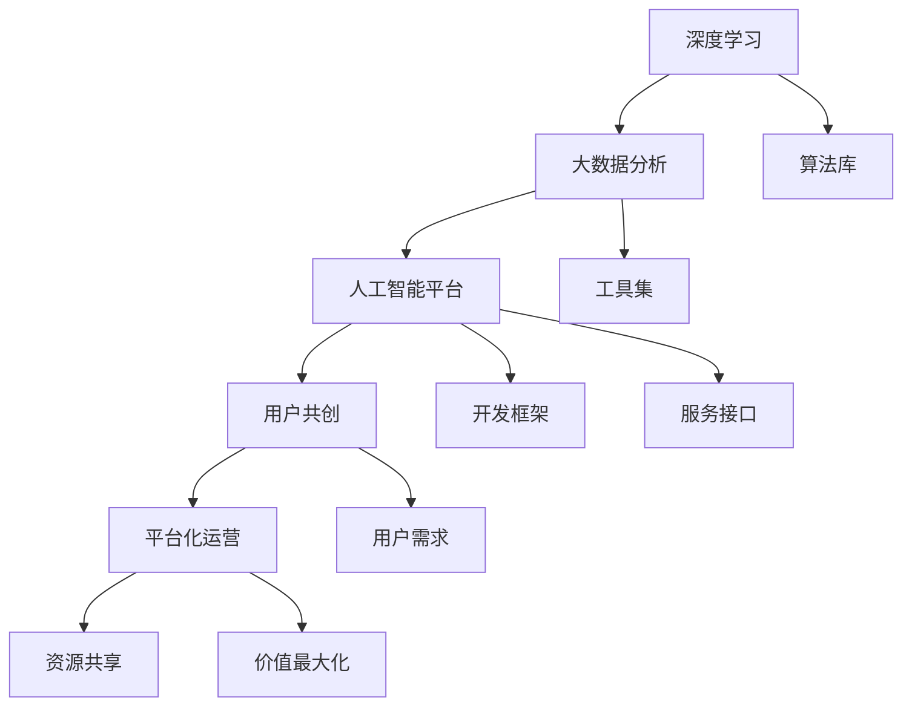

                 

### 背景介绍

#### AI 2.0 时代的崛起

随着技术的飞速发展，人工智能（AI）已经从实验室的研究成果逐渐走向了商业应用的前沿。这一转变不仅彻底改变了传统行业的运作方式，更为各行各业带来了前所未有的机遇和挑战。我们正处在一个被称为AI 2.0的时代，这个时代以深度学习、神经网络、大数据分析等为核心驱动力，正以前所未有的速度和规模影响着整个社会。

AI 2.0与传统的AI（AI 1.0）有着本质的区别。AI 1.0主要依赖于规则系统和简单的统计方法，而AI 2.0则借助深度学习和大数据，实现了更高级的认知能力和决策能力。AI 2.0的应用领域日益广泛，从自动驾驶、智能医疗、金融科技到智能客服，几乎涵盖了各个行业。这种广泛应用不仅带来了生产效率的提升，还极大地改变了商业模式的本质。

#### 商业模式的转型

在AI 2.0时代，商业模式正在发生深刻的变革。首先，数据的地位空前提高。数据不仅是企业宝贵的资产，更是AI模型训练的基础。其次，平台化的运营模式逐渐成为主流，通过搭建开放的平台，企业可以实现资源的共享和价值的最大化。此外，用户参与和共创成为新商业模式的重要组成部分，用户不再仅仅是消费者，更是产品和服务的参与者和贡献者。

#### 技术带来的挑战

尽管AI 2.0带来了诸多机遇，但也伴随着一系列挑战。首先，数据安全和隐私保护成为亟待解决的问题。随着数据量的增加和数据的敏感度提升，如何确保数据的安全性和用户的隐私成为关键。其次，AI技术的快速迭代和应用场景的不断扩展，对人才需求提出了更高的要求。最后，AI技术的广泛应用也可能带来失业和社会不平等的挑战，需要我们积极应对。

总的来说，AI 2.0时代为商业模式带来了前所未有的机遇和挑战。在这个时代，企业不仅需要具备强大的技术实力，还需要灵活应对市场变化，不断创新和适应。本文将深入探讨AI 2.0时代的商业模式，分析其核心概念、应用场景以及未来发展趋势。

---

### 核心概念与联系

在深入了解AI 2.0时代的商业模式之前，我们需要明确一些核心概念，并理解它们之间的联系。以下是本文将涉及的主要概念：

1. **深度学习**：一种基于神经网络的学习方法，能够通过多层非线性变换来提取数据特征，从而实现复杂任务的自动化。
2. **大数据分析**：通过对大规模数据集的挖掘和分析，发现数据中的模式和关联，为企业决策提供支持。
3. **人工智能平台**：一个集成了各种AI算法和工具的综合性平台，能够简化AI应用的开发和使用。
4. **用户共创**：鼓励用户参与到产品和服务的设计、开发和使用过程中，共同创造价值。
5. **平台化运营**：通过搭建开放的平台，实现资源的高效配置和价值的最大化。

#### 深度学习与大数据分析

深度学习和大数据分析是AI 2.0时代的基础。深度学习通过多层神经网络提取数据特征，使得模型能够自主学习并适应复杂的环境。而大数据分析则通过处理大规模数据，发现数据中的有价值信息，为深度学习提供训练素材。

深度学习与大数据分析之间存在着密切的联系。首先，大数据分析能够提供丰富的训练数据，这些数据是训练深度学习模型的基础。其次，深度学习能够通过大数据分析提取的洞察，进一步优化和改进大数据分析的结果。

#### 人工智能平台

人工智能平台是AI 2.0时代的核心基础设施。一个典型的人工智能平台通常包括以下几个方面：

1. **算法库**：提供各种AI算法，包括深度学习、强化学习等，开发者可以根据需求选择合适的算法。
2. **工具集**：包括数据预处理工具、模型训练工具、模型评估工具等，方便开发者进行AI模型的开发和部署。
3. **开发框架**：提供统一的开发环境，简化AI应用的开发流程。
4. **服务接口**：通过API或其他服务接口，使AI模型能够与其他系统和服务集成，实现跨平台的部署和应用。

#### 用户共创与平台化运营

用户共创和平台化运营是AI 2.0时代商业模式的重要组成部分。用户共创通过鼓励用户参与产品和服务的设计、开发和使用，使得产品更加符合用户需求，同时也能激发用户的创新潜力。平台化运营则通过搭建开放的平台，实现资源的共享和价值的最大化。

用户共创与平台化运营之间也存在密切的联系。用户共创为平台化运营提供了丰富的内容和价值，而平台化运营则为用户共创提供了基础设施和生态系统。通过用户共创和平台化运营的结合，企业能够实现从产品导向到用户导向的转变，从而更好地满足用户需求，提升用户体验。

#### Mermaid 流程图

为了更好地展示这些概念之间的联系，我们可以使用Mermaid绘制一个流程图：



通过这个流程图，我们可以清晰地看到深度学习、大数据分析、人工智能平台、用户共创和平台化运营之间的相互关系。这些概念共同构成了AI 2.0时代商业模式的基石。

### 核心算法原理 & 具体操作步骤

在了解了AI 2.0时代的核心概念之后，接下来我们将深入探讨AI 2.0时代的核心算法原理及其具体操作步骤。本文将重点介绍深度学习、大数据分析和人工智能平台中的关键技术。

#### 深度学习算法原理

深度学习是一种基于神经网络的机器学习技术，其核心思想是通过多层神经网络来模拟人类大脑的思考过程，从而实现对数据的分析和处理。以下是深度学习算法的基本原理和操作步骤：

1. **神经网络结构**：深度学习算法的核心是神经网络，它由多个层次组成，包括输入层、隐藏层和输出层。每一层都有若干个神经元，神经元之间通过权重进行连接。神经网络的层次结构使得它能够从原始数据中提取出越来越抽象的特征。

2. **前向传播**：在前向传播过程中，输入数据从输入层依次传递到隐藏层，再传递到输出层。每一层神经元的输出值通过激活函数进行非线性变换，从而实现对数据的处理。

3. **反向传播**：在反向传播过程中，通过计算输出层的误差，将误差反向传播到隐藏层和输入层，并利用梯度下降法对权重进行更新。这一过程重复进行，直到误差达到预设的阈值。

4. **损失函数**：损失函数用于衡量模型预测值与真实值之间的误差。常用的损失函数包括均方误差（MSE）、交叉熵损失等。

5. **优化算法**：优化算法用于调整模型参数，以最小化损失函数。常用的优化算法包括随机梯度下降（SGD）、Adam优化器等。

#### 大数据分析算法原理

大数据分析是通过对大规模数据集的挖掘和分析，发现数据中的模式和关联，从而为企业决策提供支持。以下是大数据分析算法的基本原理和操作步骤：

1. **数据预处理**：在数据分析之前，需要对数据进行清洗和预处理，包括缺失值填充、异常值处理、数据标准化等步骤。

2. **特征工程**：特征工程是大数据分析的重要步骤，通过选择和构造合适的特征，可以提升模型的效果。特征工程包括特征提取、特征选择和特征转换等步骤。

3. **机器学习算法**：常用的机器学习算法包括分类算法、聚类算法、回归算法等。分类算法用于将数据分为不同的类别，聚类算法用于将相似的数据分为一组，回归算法用于预测连续值。

4. **模型评估**：在模型训练完成后，需要对模型进行评估，以确定其预测效果。常用的评估指标包括准确率、召回率、F1分数等。

5. **模型优化**：通过调整模型参数、特征工程等方法，可以进一步提升模型的性能。

#### 人工智能平台技术

人工智能平台是AI 2.0时代的核心技术基础设施，它集成了各种AI算法和工具，为开发者提供了便捷的AI应用开发环境。以下是人工智能平台的关键技术和操作步骤：

1. **算法库**：人工智能平台通常内置了丰富的算法库，包括深度学习、强化学习、自然语言处理等算法，开发者可以根据需求选择合适的算法。

2. **开发框架**：人工智能平台提供了统一的开发框架，包括数据预处理、模型训练、模型评估等步骤，简化了AI应用的开发流程。

3. **工具集**：人工智能平台集成了多种工具，包括数据可视化工具、模型训练工具、模型部署工具等，方便开发者进行模型训练和部署。

4. **服务接口**：人工智能平台提供了API或其他服务接口，使得开发者可以轻松地将AI模型与其他系统和服务集成，实现跨平台的部署和应用。

通过以上对核心算法原理和具体操作步骤的介绍，我们可以看到AI 2.0时代的商业模式在技术层面的复杂性。在接下来的部分，我们将进一步探讨这些技术在商业应用中的具体实现，以及如何通过AI技术实现商业模式的创新。

### 数学模型和公式 & 详细讲解 & 举例说明

在深入探讨AI 2.0时代的核心算法原理之后，我们将进一步介绍与这些算法相关的数学模型和公式，并通过实际案例进行详细讲解和说明。

#### 深度学习中的数学模型

深度学习算法的核心是神经网络，而神经网络的工作原理依赖于一系列数学模型。以下是几个关键的数学模型及其应用场景：

1. **激活函数**：激活函数是神经网络中每个神经元在输出阶段使用的非线性函数。常用的激活函数包括Sigmoid、ReLU和Tanh。以下是ReLU激活函数的数学表达式：

   $$
   f(x) =
   \begin{cases}
   0 & \text{if } x < 0 \\
   x & \text{if } x \geq 0
   \end{cases}
   $$

   ReLU函数的优点是计算简单，可以有效提高神经网络的训练速度。

2. **反向传播算法**：反向传播算法是深度学习训练过程的核心。它通过计算误差梯度，更新网络的权重。误差梯度可以用以下公式表示：

   $$
   \delta = \frac{\partial L}{\partial z}
   $$

   其中，$L$是损失函数，$z$是神经元的输出。

   反向传播算法的具体步骤如下：
   - 计算输出层的误差梯度。
   - 将误差梯度反向传播到前一层。
   - 使用梯度下降法更新权重。

3. **损失函数**：在深度学习中，常用的损失函数包括均方误差（MSE）和交叉熵损失。以下是MSE损失函数的数学表达式：

   $$
   L = \frac{1}{2} \sum_{i=1}^{n} (y_i - \hat{y}_i)^2
   $$

   其中，$y_i$是真实标签，$\hat{y}_i$是模型预测值。

#### 大数据分析中的数学模型

大数据分析中，常用的数学模型包括聚类算法、回归算法和分类算法等。以下是这些模型的数学表达和应用场景：

1. **K-均值聚类算法**：K-均值聚类是一种基于距离的聚类算法。其核心思想是将数据分为K个簇，使得簇内距离最小，簇间距离最大。K-均值聚类算法的目标函数如下：

   $$
   J = \sum_{i=1}^{K} \sum_{x \in S_i} \frac{1}{|S_i|} \sum_{y \in S_i} \|x - y\|^2
   $$

   其中，$S_i$是第$i$个簇，$x$和$y$是簇内的数据点。

2. **线性回归模型**：线性回归是一种用于预测连续值的模型。其数学表达式如下：

   $$
   \hat{y} = \beta_0 + \beta_1 x
   $$

   其中，$\beta_0$和$\beta_1$是模型的参数。

   线性回归通过最小化误差平方和来估计参数：

   $$
   \min_{\beta_0, \beta_1} \sum_{i=1}^{n} (y_i - \hat{y}_i)^2
   $$

3. **支持向量机（SVM）**：SVM是一种用于分类的模型，其核心思想是在高维空间中找到一个最佳的超平面，将不同类别的数据点分开。SVM的目标函数如下：

   $$
   \min_{\beta, \beta_0, \xi} \frac{1}{2} \sum_{i=1}^{n} \|\beta\|^2 + C \sum_{i=1}^{n} \xi_i
   $$

   其中，$\beta$是权重向量，$\beta_0$是偏置项，$\xi_i$是松弛变量，$C$是惩罚参数。

#### 举例说明

为了更好地理解上述数学模型，我们通过一个实际案例进行说明。

**案例：使用深度学习预测房价**

假设我们有一个包含房屋面积、房间数量、建筑年代等特征的数据集，目标是预测房屋的价格。

1. **数据预处理**：首先，我们对数据集进行预处理，包括缺失值填充、数据标准化等步骤。

2. **构建神经网络**：我们使用一个简单的全连接神经网络，包括输入层、一个隐藏层和输出层。输入层包含特征数，隐藏层有10个神经元，输出层包含一个神经元。

3. **模型训练**：使用ReLU激活函数和均方误差损失函数进行训练。在训练过程中，我们通过反向传播算法更新权重。

4. **模型评估**：通过测试集对模型进行评估，计算预测误差和准确率。

以下是训练过程中的一个片段：

```python
import tensorflow as tf

# 模型参数
inputs = tf.keras.layers.Input(shape=(num_features,))
hidden = tf.keras.layers.Dense(10, activation='relu')(inputs)
outputs = tf.keras.layers.Dense(1)(hidden)

# 模型编译
model = tf.keras.Model(inputs=inputs, outputs=outputs)
model.compile(optimizer='adam', loss='mse')

# 模型训练
model.fit(x_train, y_train, epochs=100, batch_size=32, validation_split=0.2)
```

通过以上步骤，我们构建了一个简单的深度学习模型，并使用它来预测房屋价格。该案例展示了深度学习算法的数学模型在实际应用中的具体操作过程。

通过详细讲解和举例说明，我们可以更好地理解AI 2.0时代的关键数学模型和公式，为后续的实战应用打下坚实的基础。

### 项目实战：代码实际案例和详细解释说明

在本节中，我们将通过一个实际项目案例，展示如何使用AI 2.0技术实现一个具体的业务场景，并详细解释代码实现和关键步骤。

#### 项目背景

假设我们正在开发一个智能推荐系统，该系统需要根据用户的历史行为数据（如浏览记录、购买记录等），为用户推荐他们可能感兴趣的商品。这是一个典型的AI应用场景，涉及用户行为数据分析、推荐算法实现等多个方面。

#### 系统架构

智能推荐系统的架构可以分为以下几个部分：

1. **数据采集模块**：负责从不同的数据源（如网站日志、数据库等）收集用户行为数据。
2. **数据处理模块**：对采集到的数据进行清洗、预处理，包括缺失值填充、异常值处理、特征工程等步骤。
3. **推荐算法模块**：实现推荐算法，根据用户历史行为数据生成推荐结果。
4. **推荐结果展示模块**：将推荐结果以直观的方式展示给用户，例如在网页上显示推荐商品列表。

#### 开发环境搭建

为了实现智能推荐系统，我们需要搭建一个开发环境。以下是一个基本的开发环境搭建步骤：

1. **安装Python**：Python是智能推荐系统开发的主要编程语言。可以从Python官方网站下载并安装Python 3.x版本。
2. **安装相关库**：安装用于数据采集、数据处理、推荐算法实现等功能的Python库，如NumPy、Pandas、Scikit-learn、TensorFlow等。可以使用pip命令进行安装：
   ```shell
   pip install numpy pandas scikit-learn tensorflow
   ```

3. **配置环境变量**：确保Python环境变量配置正确，以便在命令行中使用Python和相关库。

#### 源代码详细实现和代码解读

以下是一个简单的智能推荐系统的源代码实现，包括数据采集、数据处理和推荐算法实现：

```python
import pandas as pd
from sklearn.model_selection import train_test_split
from sklearn.preprocessing import StandardScaler
from sklearn.neighbors import KNeighborsClassifier

# 1. 数据采集
data = pd.read_csv('user_behavior.csv')

# 2. 数据预处理
# 数据清洗和特征工程
data.dropna(inplace=True)
features = ['browse_history', 'purchase_history']
X = data[features]
y = data['interest']

# 数据标准化
scaler = StandardScaler()
X_scaled = scaler.fit_transform(X)

# 3. 数据切分
X_train, X_test, y_train, y_test = train_test_split(X_scaled, y, test_size=0.2, random_state=42)

# 4. 推荐算法实现
# 使用K近邻算法
knn = KNeighborsClassifier(n_neighbors=5)
knn.fit(X_train, y_train)

# 5. 模型评估
accuracy = knn.score(X_test, y_test)
print(f'Model Accuracy: {accuracy:.2f}')

# 6. 推荐结果展示
user_input = scaler.transform([[new_user_browse_history, new_user_purchase_history]])
predicted_interest = knn.predict(user_input)
print(f'Predicted Interest: {predicted_interest}')
```

#### 代码解读与分析

1. **数据采集**：首先，我们从CSV文件中读取用户行为数据。这些数据包括用户的浏览历史、购买历史等信息。

2. **数据预处理**：对数据进行清洗，删除缺失值。然后，提取特征和标签。在这里，我们将浏览历史和购买历史作为特征，用户兴趣作为标签。

3. **数据标准化**：使用StandardScaler对特征进行标准化处理，以便于模型训练。

4. **数据切分**：将数据集分为训练集和测试集，以便于模型训练和评估。

5. **推荐算法实现**：我们选择K近邻算法（K-Nearest Neighbors, KNN）作为推荐算法。KNN算法通过计算测试数据点与训练数据点之间的相似度，选择与测试数据点最接近的K个邻居，并根据邻居的标签预测测试数据点的标签。

6. **模型评估**：计算模型的准确率，评估模型性能。

7. **推荐结果展示**：输入新用户的行为数据，使用训练好的模型预测用户兴趣，并输出推荐结果。

通过以上步骤，我们实现了智能推荐系统的基本功能。这个项目展示了AI 2.0技术在商业应用中的具体实现，包括数据采集、数据处理和推荐算法实现。在实际应用中，可以根据具体需求进一步优化和扩展系统功能。

### 实际应用场景

AI 2.0技术在商业领域有着广泛的应用，以下将介绍几个典型的实际应用场景，并分析这些应用如何改变了传统的商业模式。

#### 智能推荐系统

智能推荐系统是AI 2.0技术在商业应用中的一个重要领域。通过分析用户的历史行为数据，智能推荐系统可以准确预测用户的兴趣和需求，从而推荐他们可能感兴趣的商品或服务。例如，电商平台的推荐系统可以根据用户的浏览记录、购买历史等数据，推荐相关商品。这种个性化的推荐不仅提升了用户体验，还显著提高了销售转化率。

传统的商业模式中，商家通常依赖于广告和促销活动来吸引顾客。然而，随着消费者个性化需求的增加，这种传统的模式逐渐变得不再有效。AI 2.0时代的智能推荐系统通过数据分析和算法优化，实现了精准营销，极大地提高了营销效率和效果。

#### 智能金融

智能金融是AI 2.0技术在金融领域的重要应用。通过机器学习和大数据分析，智能金融系统可以实现风险控制、信用评分、投资决策等功能的自动化和智能化。例如，在信贷审批过程中，传统的方法依赖于人工审核，效率低下且容易出错。而智能金融系统通过分析用户的信用历史、财务状况、行为数据等，可以快速、准确地评估用户的信用风险，从而提高审批效率和准确性。

此外，智能金融还广泛应用于投资决策。通过分析市场数据、经济指标、公司财务状况等，智能投资系统可以提供实时的投资建议，帮助投资者做出更加明智的决策。这种自动化的投资决策不仅提高了投资效率，还降低了投资风险。

#### 智能医疗

智能医疗是AI 2.0技术在医疗健康领域的应用。通过深度学习和大数据分析，智能医疗系统可以实现疾病的早期诊断、精准治疗和个性化护理。例如，在疾病诊断方面，智能医疗系统可以通过分析患者的病史、基因数据、医疗影像等，提供准确的诊断建议。在治疗方面，智能医疗系统可以根据患者的具体情况，制定个性化的治疗方案。

此外，智能医疗还广泛应用于健康管理。通过监测用户的生理数据、生活习惯等，智能医疗系统可以提供健康建议和预警，帮助用户预防和控制疾病。这种个性化的健康管理不仅提高了用户的健康水平，还减轻了医疗系统的负担。

#### 智能交通

智能交通是AI 2.0技术在交通运输领域的重要应用。通过自动驾驶、车联网等技术，智能交通系统可以实现道路的智能化管理和车辆的自动驾驶。例如，自动驾驶技术可以减少交通事故，提高交通效率。车联网技术可以实现车辆的互联互通，优化交通流量，减少拥堵。

此外，智能交通系统还可以提供实时的交通信息，帮助司机选择最优的行驶路线，减少交通时间。这种智能化的交通管理不仅提高了交通效率，还提升了用户体验。

总的来说，AI 2.0技术在商业领域的应用极大地改变了传统的商业模式，提高了生产效率、优化了用户体验，并为各行各业带来了新的增长点。随着AI技术的不断发展，未来将有更多的商业场景被AI所改变，为企业和消费者带来更多的价值。

### 工具和资源推荐

在深入探讨AI 2.0时代的商业模式及其应用场景后，我们需要了解一些关键的工具和资源，以便在实际项目中有效地运用这些技术。以下是对一些重要的学习资源、开发工具和论文著作的推荐。

#### 学习资源推荐

1. **书籍**：
   - 《深度学习》（Deep Learning） - Goodfellow, Bengio, Courville
   - 《Python深度学习》（Deep Learning with Python） - Francois Chollet
   - 《大数据之路：阿里巴巴大数据实践》（Big Data：A Revolution That Will Transform How We Live, Work, and Think）- 阿里巴巴集团

2. **在线课程**：
   - Coursera上的《机器学习》课程 - 吴恩达
   - Udacity的《深度学习纳米学位》
   - edX上的《人工智能导论》课程 - 伯克利大学

3. **博客和网站**：
   - Medium上的相关AI和深度学习博客
   - ArXiv.org - 最新AI和机器学习论文
   - Fast.ai - 专注于深度学习的免费教程和资源

#### 开发工具推荐

1. **编程语言**：
   - Python：由于其丰富的库和社区支持，Python是AI和深度学习开发的主要语言。
   - R：在统计分析和数据可视化方面有强大的功能。

2. **深度学习框架**：
   - TensorFlow：Google开源的深度学习框架，功能强大，适用于各种应用场景。
   - PyTorch：由Facebook开源，灵活且易于使用，适用于研究和开发。

3. **数据处理工具**：
   - Pandas：Python的数据处理库，用于数据清洗、转换和分析。
   - NumPy：Python的数值计算库，用于高效的数据处理。

4. **版本控制工具**：
   - Git：用于代码版本控制和协作开发。
   - GitHub：Git的在线平台，方便代码的共享和协作。

#### 相关论文著作推荐

1. **经典论文**：
   - “Backpropagation” - Paul Werbos
   - “A Learning Representation for Transparent Concepts” - Y. LeCun, Y. Bengio, and G. Hinton
   - “Deep Learning” - Y. LeCun, Y. Bengio, and G. Hinton

2. **最新研究**：
   - ArXiv上的最新论文：包括深度学习、强化学习、自然语言处理等领域的最新研究成果。
   - NIPS、ICML、CVPR等顶级会议的论文：这些会议是AI领域的顶级学术会议，发布的论文代表了该领域的最新进展。

3. **著作**：
   - 《人工智能：一种现代的方法》（Artificial Intelligence: A Modern Approach） - Stuart Russell and Peter Norvig
   - 《深度学习》（Deep Learning） - Ian Goodfellow, Yoshua Bengio, Aaron Courville

通过这些工具和资源的推荐，我们可以更好地掌握AI 2.0时代的核心技术，并将其应用于实际项目中，实现商业模式的创新和优化。

### 总结：未来发展趋势与挑战

在AI 2.0时代，商业模式的变革正以前所未有的速度和规模展开。从智能推荐、智能金融到智能医疗，AI技术的广泛应用不仅提升了生产效率，优化了用户体验，还为企业带来了新的增长点。然而，这一变革也伴随着一系列挑战。

#### 发展趋势

1. **数据驱动的决策**：随着大数据和人工智能技术的发展，企业越来越依赖数据来驱动决策。通过深入分析用户行为数据和市场数据，企业可以更加精准地把握市场需求，优化产品和服务。

2. **个性化体验**：AI 2.0技术使得个性化体验成为可能。通过分析用户的兴趣和行为习惯，企业可以为用户提供更加个性化的推荐和服务，提升用户满意度和忠诚度。

3. **自动化与智能化**：AI技术的自动化和智能化水平不断提升，使得生产流程、运营管理等多个环节实现了智能化。这不仅提高了效率，还降低了成本。

4. **平台化运营**：随着平台经济的兴起，企业通过搭建开放的平台，实现资源的高效配置和价值的最大化。平台化运营已成为新的商业模式，为企业带来了巨大的商机。

#### 挑战

1. **数据安全和隐私保护**：随着数据量的增加，数据安全和隐私保护成为亟待解决的问题。如何在保障用户隐私的同时，充分利用数据价值，是一个重要挑战。

2. **人才需求**：AI 2.0时代的快速发展对人才需求提出了更高的要求。企业需要具备强大技术实力的人才来推动AI项目的成功实施。然而，当前市场上AI人才供不应求，如何吸引和培养高素质人才成为企业面临的难题。

3. **伦理和法律问题**：AI技术的广泛应用也带来了伦理和法律问题。例如，算法偏见、隐私泄露等问题需要得到有效解决。这需要政府和企业在制定相关政策和法规时，充分考虑到AI技术的影响和挑战。

4. **社会不平等**：AI技术的快速发展可能导致社会不平等加剧。一方面，掌握AI技术的企业将获得更大的竞争优势；另一方面，没有接受AI培训的劳动者可能面临失业风险。如何平衡技术发展和社会公平，是未来需要关注的重要问题。

#### 未来展望

在未来的发展中，AI 2.0时代将带来更多的机遇和挑战。企业需要不断创新，积极应对这些挑战，充分利用AI技术带来的优势。同时，政府和社会各界也应关注AI技术的影响，共同推动AI技术的健康、可持续发展。

总之，AI 2.0时代的商业模式变革是一个复杂而多样的过程。企业需要具备前瞻性的视野和强大的执行力，才能在未来的竞争中立于不败之地。

### 附录：常见问题与解答

在本文的讨论中，我们涵盖了AI 2.0时代商业模式的多个方面，包括核心概念、技术原理、实际应用和未来展望等。以下是一些常见问题及其解答，以帮助读者更好地理解文章内容。

**Q1：什么是AI 2.0？它与AI 1.0有什么区别？**

AI 2.0是指新一代的人工智能技术，主要基于深度学习和大数据分析，实现了更高级的认知能力和决策能力。与AI 1.0相比，AI 2.0具有以下几个显著特点：
- **更强的学习能力和适应性**：AI 2.0通过深度学习算法，可以从大量数据中自动学习和提取特征，从而实现更复杂的任务。
- **更高的自动化程度**：AI 2.0技术可以实现自动化决策和操作，降低人力成本，提高生产效率。
- **更广泛的应用领域**：AI 2.0不仅应用于传统的智能客服、推荐系统等领域，还扩展到自动驾驶、智能医疗、金融科技等新兴领域。

**Q2：什么是深度学习？它如何工作？**

深度学习是一种基于神经网络的学习方法，通过多层非线性变换来提取数据特征，从而实现复杂任务的自动化。深度学习的工作过程主要包括以下几个步骤：
1. **前向传播**：输入数据从输入层依次传递到隐藏层，再传递到输出层。每一层神经元的输出通过激活函数进行非线性变换。
2. **反向传播**：计算输出层的误差，将误差反向传播到隐藏层和输入层，并利用梯度下降法更新权重。
3. **迭代训练**：重复前向传播和反向传播的过程，直到误差达到预设的阈值。

**Q3：大数据分析的核心步骤是什么？**

大数据分析的核心步骤包括：
1. **数据预处理**：清洗和预处理数据，包括缺失值填充、异常值处理、数据标准化等。
2. **特征工程**：选择和构造合适的特征，通过特征提取、特征选择和特征转换等步骤，提升模型效果。
3. **模型选择和训练**：选择合适的机器学习算法，对数据集进行训练和评估。
4. **模型优化**：通过调整模型参数、特征工程等方法，进一步提升模型性能。

**Q4：什么是平台化运营？它如何改变商业模式？**

平台化运营是指通过搭建开放的平台，实现资源的高效配置和价值的最大化。平台化运营改变了传统商业模式中的中心化结构，使资源和服务更加分散和灵活。平台化运营的几个关键点包括：
- **资源共享**：平台上的各方可以共享资源和信息，提高效率。
- **生态系统**：平台上的参与者可以共同构建生态系统，实现互利共赢。
- **用户参与**：用户不仅是消费者，还可以参与到产品和服务的设计、开发和改进中，提升用户体验。

**Q5：AI 2.0时代面临的挑战有哪些？**

AI 2.0时代面临的挑战主要包括：
- **数据安全和隐私保护**：随着数据量的增加，数据安全和隐私保护成为重要挑战。
- **人才需求**：快速发展的AI技术对人才需求提出了更高要求，但当前市场人才供不应求。
- **伦理和法律问题**：AI技术的广泛应用带来了伦理和法律问题，如算法偏见、隐私泄露等。
- **社会不平等**：AI技术的快速发展可能导致社会不平等加剧，需要平衡技术发展和社会公平。

通过以上常见问题与解答，我们希望能帮助读者更好地理解AI 2.0时代的商业模式及其相关技术。在未来的发展中，不断应对这些挑战，将有助于我们充分利用AI技术的优势，推动商业和社会的进步。

### 扩展阅读 & 参考资料

在本文中，我们深入探讨了AI 2.0时代的商业模式，包括核心概念、技术原理、实际应用和未来挑战。为了帮助读者进一步了解这一主题，以下是一些扩展阅读和参考资料：

1. **书籍推荐**：
   - 《深度学习》（Deep Learning） - Ian Goodfellow, Yoshua Bengio, Aaron Courville
   - 《大数据之路：阿里巴巴大数据实践》（Big Data：A Revolution That Will Transform How We Live, Work, and Think）- 阿里巴巴集团
   - 《机器学习》（Machine Learning: A Probabilistic Perspective）- Kevin P. Murphy

2. **在线课程和教程**：
   - Coursera上的《机器学习》课程 - 吴恩达
   - Udacity的《深度学习纳米学位》
   - edX上的《人工智能导论》课程 - 伯克利大学

3. **学术论文和会议**：
   - NIPS（神经信息处理系统大会）
   - ICML（国际机器学习会议）
   - CVPR（计算机视觉与模式识别会议）
   - ArXiv.org - 最新AI和机器学习论文

4. **相关网站和博客**：
   - Medium上的相关AI和深度学习博客
   - Fast.ai - 专注于深度学习的免费教程和资源
   - AI Challenger - AI挑战赛和社区

通过阅读以上书籍、课程、论文和网站，您可以更深入地了解AI 2.0时代的商业模式及其相关技术，为您的学习和实践提供宝贵的资源。同时，也可以关注相关领域的前沿动态，保持对AI技术的敏锐洞察。

