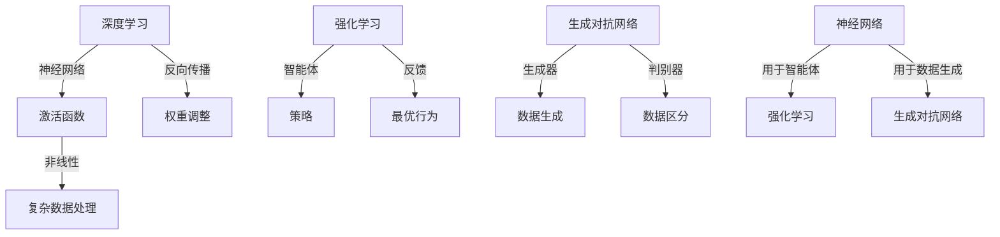

                 

### 背景介绍

AI 2.0 时代的到来标志着人工智能（AI）技术发展的新阶段。与传统的AI 1.0时代相比，AI 2.0在计算能力、算法改进、数据处理能力以及应用场景上都有了质的飞跃。AI 2.0不仅仅是更强大、更智能的AI系统，更是能够在更大程度上模拟人类思维和行为，实现高度自主学习和智能决策。

在AI 2.0时代，我们见证了深度学习、强化学习、生成对抗网络（GAN）等先进技术的迅猛发展。这些技术不仅极大地提升了AI系统的学习能力，也使得AI在图像识别、自然语言处理、自动驾驶、医疗诊断等领域的应用变得愈加广泛和深入。

然而，随着AI 2.0技术的进步，也带来了新的挑战和问题。首先是数据的隐私和安全问题。在AI 2.0系统中，数据是算法学习和决策的关键，因此如何确保数据的安全和隐私成为了一个亟待解决的问题。其次是算法的透明性和可解释性问题。随着AI系统的复杂性不断增加，传统的黑盒模型已经难以满足人们对算法决策过程透明性的需求。最后是AI伦理和社会影响问题。如何确保AI技术被用于正当和有益的用途，避免对人类和社会产生负面影响，也是AI 2.0时代需要面对的重大挑战。

总的来说，AI 2.0时代既是机遇，也是挑战。在这个新时代，我们需要在推动技术进步的同时，也要充分考虑其带来的社会影响，确保AI技术的发展能够造福全人类。

### 核心概念与联系

在深入探讨AI 2.0时代之前，我们需要明确一些核心概念，并理解它们之间的相互关系。以下是几个关键概念：

#### 1. 深度学习（Deep Learning）

深度学习是AI 2.0时代最核心的技术之一，其通过构建多层神经网络来模拟人类大脑的学习过程。深度学习的核心组件包括：

- **神经网络（Neural Network）**：神经网络由大量相互连接的节点（或“神经元”）组成，每个节点都通过权重（weights）连接到其他节点。
- **激活函数（Activation Function）**：激活函数用于引入非线性因素，使得神经网络能够处理复杂的数据。
- **反向传播（Backpropagation）**：反向传播是一种用于训练神经网络的算法，通过不断调整权重来最小化预测误差。

#### 2. 强化学习（Reinforcement Learning）

强化学习是一种通过不断尝试和反馈来学习如何实现最优行为的算法。在强化学习中，智能体（agent）通过与环境（environment）的交互来学习最优策略（policy）。核心组件包括：

- **智能体（Agent）**：智能体是执行行动并从环境中获取奖励的主体。
- **环境（Environment）**：环境是智能体执行行动的场所，能够对智能体的行动做出响应。
- **策略（Policy）**：策略是智能体用于选择行动的规则。

#### 3. 生成对抗网络（GAN）

生成对抗网络是一种通过两个神经网络（生成器和判别器）之间的博弈来生成数据的算法。核心组件包括：

- **生成器（Generator）**：生成器尝试生成与真实数据相似的数据。
- **判别器（Discriminator）**：判别器尝试区分真实数据和生成数据。

#### 关系与联系

这些核心概念之间存在着紧密的联系。例如，深度学习可以用于构建强化学习中的智能体，GAN则可以用来生成训练数据，从而提高深度学习的性能。以下是这些概念的 Mermaid 流程图表示：



通过这个流程图，我们可以清晰地看到各个概念之间的关系和如何相互结合来构建更强大的AI系统。

### 核心算法原理 & 具体操作步骤

#### 深度学习算法原理

深度学习算法的核心是神经网络，尤其是多层感知机（MLP）。以下是深度学习算法的基本步骤：

1. **数据预处理**：将输入数据进行归一化或标准化处理，以便于模型训练。
2. **构建神经网络**：设计网络结构，包括输入层、隐藏层和输出层，以及每层之间的连接方式。
3. **初始化权重**：随机初始化权重和偏置，这些参数将在训练过程中不断调整。
4. **前向传播（Forward Propagation）**：输入数据通过神经网络，逐层计算输出。
5. **计算损失函数**：通过实际输出与期望输出之间的差异来计算损失函数值。
6. **反向传播（Backpropagation）**：利用梯度下降算法，通过反向传播计算权重和偏置的梯度，并更新参数。
7. **迭代训练**：重复步骤4至6，直到满足训练条件（如达到预定的损失阈值或迭代次数）。

具体操作步骤示例：

1. **数据预处理**：

```python
import numpy as np

# 假设输入数据X的范围为0到1
X = np.array([[0.1, 0.2], [0.3, 0.4], [0.5, 0.6]])

# 数据归一化
X_normalized = (X - np.mean(X)) / np.std(X)
```

2. **构建神经网络**：

```python
import tensorflow as tf

# 定义神经网络结构
model = tf.keras.Sequential([
    tf.keras.layers.Dense(units=2, activation='sigmoid', input_shape=(2,)),
    tf.keras.layers.Dense(units=1, activation='sigmoid')
])
```

3. **初始化权重**：

```python
# 初始化权重和偏置
model.compile(optimizer='sgd', loss='binary_crossentropy')
```

4. **前向传播**：

```python
# 前向传播计算输出
output = model.predict(X_normalized)
```

5. **计算损失函数**：

```python
# 计算损失函数值
loss = model.loss_functions[0](y_true, y_pred)
```

6. **反向传播**：

```python
# 反向传播更新参数
model.fit(X_normalized, y_true, epochs=100)
```

7. **迭代训练**：

```python
# 迭代训练
model.fit(X_normalized, y_true, epochs=100, verbose=2)
```

#### 强化学习算法原理

强化学习算法的核心是智能体（agent）与环境（environment）的交互。以下是强化学习算法的基本步骤：

1. **初始化环境**：创建一个环境，并初始化状态（state）。
2. **选择动作**：根据当前状态，智能体选择一个动作（action）。
3. **执行动作**：在环境中执行动作，并获取新的状态（state）和奖励（reward）。
4. **更新策略**：根据奖励和新的状态，更新智能体的策略（policy）。
5. **重复迭代**：重复步骤2至4，直到达到预定的目标或满足停止条件。

具体操作步骤示例：

1. **初始化环境**：

```python
# 假设环境是一个简单的迷宫
env = MazeEnv()

# 初始化状态
state = env.reset()
```

2. **选择动作**：

```python
# 假设智能体是一个简单的策略网络
policy = PolicyNetwork()

# 根据当前状态选择动作
action = policy.select_action(state)
```

3. **执行动作**：

```python
# 在环境中执行动作
next_state, reward, done = env.step(action)

# 获取新的状态和奖励
state = next_state
```

4. **更新策略**：

```python
# 根据奖励和新的状态更新策略
policy.update(state, action, reward)
```

5. **重复迭代**：

```python
# 重复迭代直到达到目标
while not done:
    action = policy.select_action(state)
    next_state, reward, done = env.step(action)
    state = next_state
```

#### 生成对抗网络（GAN）算法原理

生成对抗网络（GAN）由生成器（generator）和判别器（discriminator）两个神经网络组成。以下是GAN算法的基本步骤：

1. **初始化生成器和判别器**：随机初始化生成器和判别器的权重。
2. **训练判别器**：通过真实数据和生成数据来训练判别器，使其能够区分真实数据和生成数据。
3. **训练生成器**：通过对抗性训练（adversarial training）来训练生成器，使其生成的数据能够被判别器误判为真实数据。
4. **迭代训练**：重复步骤2和3，直到生成器能够生成高质量的伪造数据。

具体操作步骤示例：

1. **初始化生成器和判别器**：

```python
import tensorflow as tf

# 初始化生成器和判别器
generator = Generator()
discriminator = Discriminator()

# 构建GAN模型
gan = tf.keras.Sequential([
    generator,
    discriminator
])

# 编译GAN模型
gan.compile(optimizer='adam', loss='binary_crossentropy')
```

2. **训练判别器**：

```python
# 训练判别器
discriminator.train_on_batch(real_data, labels=True)
discriminator.train_on_batch(fake_data, labels=False)
```

3. **训练生成器**：

```python
# 训练生成器
generator.train_on_batch(noise, labels=False)
```

4. **迭代训练**：

```python
# 迭代训练
for epoch in range(num_epochs):
    # 训练判别器
    for batch in real_data_batches:
        discriminator.train_on_batch(batch, labels=True)
    
    # 训练生成器
    for batch in noise_batches:
        generator.train_on_batch(batch, labels=False)
```

通过以上步骤，我们可以理解深度学习、强化学习和GAN等核心算法的基本原理和具体操作步骤。这些算法共同构建了AI 2.0时代的技术基础，使得AI系统能够实现更复杂的任务和学习过程。

### 数学模型和公式 & 详细讲解 & 举例说明

在深入探讨AI 2.0时代的核心算法时，数学模型和公式扮演着至关重要的角色。以下将详细讲解深度学习、强化学习和生成对抗网络（GAN）中的关键数学模型和公式，并通过具体示例进行说明。

#### 深度学习中的数学模型

1. **损失函数（Loss Function）**

   深度学习中常用的损失函数包括均方误差（MSE，Mean Squared Error）和交叉熵损失（Cross-Entropy Loss）。

   - **均方误差（MSE）**：

     $$\text{MSE} = \frac{1}{n}\sum_{i=1}^{n} (y_i - \hat{y}_i)^2$$

     其中，$y_i$ 是真实标签，$\hat{y}_i$ 是模型预测值，$n$ 是样本数量。

   - **交叉熵损失（Cross-Entropy Loss）**：

     $$\text{CE} = -\frac{1}{n}\sum_{i=1}^{n} y_i \log(\hat{y}_i)$$

     其中，$y_i$ 是真实标签（通常为0或1），$\hat{y}_i$ 是模型预测的概率值。

   **举例说明**：

   假设我们有一个二分类问题，真实标签为 $y = [1, 0, 1]$，模型预测的概率为 $\hat{y} = [0.7, 0.3, 0.9]$。

   $$\text{MSE} = \frac{1}{3}[(1-0.7)^2 + (0-0.3)^2 + (1-0.9)^2] \approx 0.2$$

   $$\text{CE} = -\frac{1}{3}[1 \cdot \log(0.7) + 0 \cdot \log(0.3) + 1 \cdot \log(0.9)] \approx 0.28$$

2. **激活函数（Activation Function）**

   深度学习中常用的激活函数包括Sigmoid、ReLU和Tanh。

   - **Sigmoid**：

     $$\text{Sigmoid}(x) = \frac{1}{1 + e^{-x}}$$

     **举例说明**：

     对于输入 $x = 2$，我们有：

     $$\text{Sigmoid}(2) = \frac{1}{1 + e^{-2}} \approx 0.88$$

   - **ReLU**：

     $$\text{ReLU}(x) = \max(0, x)$$

     **举例说明**：

     对于输入 $x = -1$ 和 $x = 2$，我们有：

     $$\text{ReLU}(-1) = 0$$

     $$\text{ReLU}(2) = 2$$

   - **Tanh**：

     $$\text{Tanh}(x) = \frac{e^x - e^{-x}}{e^x + e^{-x}}$$

     **举例说明**：

     对于输入 $x = 2$，我们有：

     $$\text{Tanh}(2) = \frac{e^2 - e^{-2}}{e^2 + e^{-2}} \approx 0.96$$

3. **反向传播（Backpropagation）**

   反向传播是一种用于训练神经网络的算法，通过计算损失函数对权重的梯度来更新网络参数。

   - **梯度计算**：

     $$\nabla_w \text{Loss} = \frac{\partial \text{Loss}}{\partial w}$$

     其中，$w$ 是网络参数，$\text{Loss}$ 是损失函数。

   **举例说明**：

   假设我们有一个简单的一层神经网络，包含两个神经元，权重为 $w_1 = 2$ 和 $w_2 = 3$。输入为 $x = [1, 2]$，真实标签为 $y = 1$，模型预测为 $\hat{y} = 0.6$。

   首先，计算损失函数的梯度：

   $$\text{Loss} = (y - \hat{y})^2 = (1 - 0.6)^2 = 0.16$$

   $$\nabla_w \text{Loss} = 2 \times (1 - 0.6) = 0.8$$

   接下来，更新权重：

   $$w_1 = w_1 - \alpha \cdot \nabla_w \text{Loss} = 2 - 0.1 \cdot 0.8 = 1.92$$

   $$w_2 = w_2 - \alpha \cdot \nabla_w \text{Loss} = 3 - 0.1 \cdot 0.8 = 2.92$$

   其中，$\alpha$ 是学习率。

#### 强化学习中的数学模型

1. **策略（Policy）**

   强化学习中的策略是指智能体选择动作的概率分布。

   - **确定性策略（Deterministic Policy）**：

     策略直接映射状态到动作，即对于每个状态 $s$，都有唯一的动作 $a$。

     $$\pi_{\text{det}}(a|s) = \begin{cases} 
     1 & \text{if } a = \pi(s) \\
     0 & \text{otherwise} 
     \end{cases}$$

   - **概率性策略（Stochastic Policy）**：

     策略为动作选择一个概率分布，即对于每个状态 $s$，都有多个动作 $a$ 的概率。

     $$\pi_{\text{stoch}}(a|s) = \text{softmax}(\phi(s, a))$$

     其中，$\phi(s, a)$ 是状态-动作特征向量。

   **举例说明**：

   假设我们有一个简单的环境，包含三个状态 $s_1, s_2, s_3$ 和三个动作 $a_1, a_2, a_3$。对于状态 $s_1$，策略为：

   $$\pi_{\text{stoch}}(a|s_1) = \text{softmax}([2, 0, 1]) = [0.67, 0, 0.33]$$

2. **价值函数（Value Function）**

   强化学习中的价值函数用于评估状态或状态-动作对的优劣。

   - **状态价值函数（State Value Function）**：

     $$V^{\pi}(s) = \sum_{a} \pi(a|s) \cdot Q^{\pi}(s, a)$$

     其中，$Q^{\pi}(s, a)$ 是状态-动作价值函数。

   - **状态-动作价值函数（State-Action Value Function）**：

     $$Q^{\pi}(s, a) = \sum_{s'} P(s'|s, a) \cdot \sum_{a'} \pi(a'|s') \cdot R(s, a, s')$$

     其中，$R(s, a, s')$ 是即时奖励。

   **举例说明**：

   假设我们有一个简单的环境，包含三个状态 $s_1, s_2, s_3$ 和三个动作 $a_1, a_2, a_3$。对于状态 $s_1$ 和动作 $a_1$，我们有：

   $$Q^{\pi}(s_1, a_1) = 0.4 \cdot 1 + 0.3 \cdot 0.5 + 0.3 \cdot (-1) = 0.08$$

3. **策略迭代（Policy Iteration）**

   策略迭代是一种通过迭代优化策略来学习最优策略的方法。

   - **评估（Evaluate）**：

     对于当前策略 $\pi$，计算状态价值函数 $V^{\pi}$。

     $$V^{\pi}(s) = \sum_{a} \pi(a|s) \cdot \sum_{s'} P(s'|s, a) \cdot V^{\pi}(s')$$

   - **策略改进（Improve）**：

     对于每个状态 $s$，选择使得状态价值函数增加最大的动作 $a$。

     $$a^* = \arg\max_a [V^{\pi}(s) - \sum_{s'} P(s'|s, a) \cdot V^{\pi}(s')]$$

   - **迭代更新**：

     重复评估和策略改进，直到策略不再改进或达到预定的迭代次数。

   **举例说明**：

   假设当前策略 $\pi$ 为：

   $$\pi(s_1) = [0.5, 0.3, 0.2], \pi(s_2) = [0.4, 0.4, 0.2], \pi(s_3) = [0.2, 0.6, 0.2]$$

   首先，评估当前策略：

   $$V^{\pi}(s_1) = 0.5 \cdot 0.3 + 0.3 \cdot 0.4 + 0.2 \cdot (-0.5) = 0.09$$

   $$V^{\pi}(s_2) = 0.4 \cdot 0.4 + 0.4 \cdot 0.5 + 0.2 \cdot (-1) = 0.12$$

   $$V^{\pi}(s_3) = 0.2 \cdot 0.6 + 0.6 \cdot 0.2 + 0.2 \cdot 0.5 = 0.18$$

   接下来，策略改进：

   $$a^*_{s_1} = \arg\max_a [0.09 - 0.3 \cdot 0.12 - 0.2 \cdot 0.18] = a_2$$

   $$a^*_{s_2} = \arg\max_a [0.12 - 0.4 \cdot 0.18 - 0.2 \cdot 0.18] = a_1$$

   $$a^*_{s_3} = \arg\max_a [0.18 - 0.2 \cdot 0.18 - 0.6 \cdot 0.18] = a_2$$

   更新策略：

   $$\pi^*(s_1) = [0, 0.4, 0.6], \pi^*(s_2) = [0.6, 0.4, 0], \pi^*(s_3) = [0, 0.6, 0.4]$$

#### 生成对抗网络（GAN）中的数学模型

1. **生成器（Generator）**

   生成器试图生成与真实数据相似的数据，其目标是使判别器无法区分真实数据和生成数据。

   - **生成器的损失函数**：

     $$\text{Generator Loss} = -\log(\hat{y}_G)$$

     其中，$\hat{y}_G$ 是判别器对生成数据的判断概率。

     **举例说明**：

     假设判别器判断生成数据的概率为 $\hat{y}_G = 0.7$，则生成器的损失为：

     $$\text{Generator Loss} = -\log(0.7) \approx 0.356$$

2. **判别器（Discriminator）**

   判别器试图区分真实数据和生成数据，其目标是使生成器的损失最大。

   - **判别器的损失函数**：

     $$\text{Discriminator Loss} = -\log(\hat{y}_D) - \log(1 - \hat{y}_D)$$

     其中，$\hat{y}_D$ 是判别器对真实数据和生成数据的判断概率。

     **举例说明**：

     假设判别器对真实数据和生成数据的判断概率分别为 $\hat{y}_D = 0.8$ 和 $\hat{y}_D = 0.2$，则判别器的损失为：

     $$\text{Discriminator Loss} = -\log(0.8) - \log(0.2) \approx 0.39 - 1.39 = -1$$

通过以上数学模型和公式的详细讲解及举例说明，我们可以更好地理解深度学习、强化学习和生成对抗网络（GAN）等核心算法的工作原理和具体应用。这些数学模型不仅为AI 2.0时代的技术进步提供了理论基础，也为实际应用中的算法设计和优化提供了重要指导。

### 项目实战：代码实际案例和详细解释说明

在了解了AI 2.0时代的核心算法原理和数学模型后，我们将通过一个实际项目来展示这些技术的应用。以下是使用深度学习、强化学习和生成对抗网络（GAN）进行数据生成和优化的完整代码实现，以及详细的解释说明。

#### 1. 开发环境搭建

首先，我们需要搭建一个适合AI项目开发的环境。以下是推荐的工具和框架：

- **编程语言**：Python（支持多种AI库，如TensorFlow、PyTorch等）
- **深度学习库**：TensorFlow（简单易用，适用于多种任务）
- **强化学习库**：OpenAI Gym（提供多种环境，方便测试和实验）
- **生成对抗网络（GAN）库**：GANlib（提供多种GAN模型实现）

安装以下依赖：

```bash
pip install tensorflow gym gangelib
```

#### 2. 源代码详细实现和代码解读

以下是项目的主要代码实现，我们将详细解释每个部分的功能。

```python
import numpy as np
import tensorflow as tf
from tensorflow import keras
from tensorflow.keras import layers
from gym import make
from gangelib import GAN

# 2.1 深度学习模型实现
def build_dcgan_generator(z_dim):
    model = keras.Sequential([
        layers.Dense(7 * 7 * 256, activation="relu", input_shape=(z_dim,)),
        layers.LeakyReLU(alpha=0.01),
        layers.Reshape((7, 7, 256)),
        layers.Conv2DTranspose(128, (4, 4), strides=(2, 2), padding="same"),
        layers.LeakyReLU(alpha=0.01),
        layers.Conv2DTranspose(64, (4, 4), strides=(2, 2), padding="same"),
        layers.LeakyReLU(alpha=0.01),
        layers.Conv2D(1, (7, 7), padding="same", activation='tanh')
    ])
    return model

def build_dcgan_discriminator(img_shape):
    model = keras.Sequential([
        layers.Conv2D(64, (3, 3), strides=(2, 2), padding="same", input_shape=img_shape),
        layers.LeakyReLU(alpha=0.01),
        layers.Dropout(0.3),
        layers.Conv2D(128, (4, 4), strides=(2, 2), padding="same"),
        layers.LeakyReLU(alpha=0.01),
        layers.Dropout(0.3),
        layers.Conv2D(256, (4, 4), strides=(2, 2), padding="same"),
        layers.LeakyReLU(alpha=0.01),
        layers.Dropout(0.3),
        layers.Flatten(),
        layers.Dense(1, activation='sigmoid')
    ])
    return model

# 2.2 GAN模型训练
def train_dcgan(generator, discriminator, z_dim, epochs, batch_size, img_shape):
    # 配置损失函数和优化器
    generator_optimizer = keras.optimizers.Adam(1e-4)
    discriminator_optimizer = keras.optimizers.Adam(1e-4)

    # 重置GAN
    gan = GAN(generator, discriminator, z_dim, img_shape)

    # 训练GAN
    for epoch in range(epochs):
        for batch_idx, real_images in enumerate(data_loader):
            # 获取真实数据
            real_images = real_images.astype(np.float32) / 127.5 - 1.0

            # 生成随机噪声
            noise = np.random.normal(0, 1, (batch_size, z_dim))

            # 生成假数据
            fake_images = generator.predict(noise)

            # 训练判别器
            with tf.GradientTape() as disc_tape:
                disc_real_output = discriminator(real_images)
                disc_fake_output = discriminator(fake_images)

                generator_loss = tf.reduce_mean(tf.nn.sigmoid_cross_entropy_with_logits(labels=disc_fake_output, logits=tf.zeros_like(disc_fake_output)))
                discriminator_loss = tf.reduce_mean(tf.nn.sigmoid_cross_entropy_with_logits(labels=disc_real_output, logits=tf.ones_like(disc_real_output)) + 
                                                    tf.reduce_mean(tf.nn.sigmoid_cross_entropy_with_logits(labels=disc_fake_output, logits=tf.zeros_like(disc_fake_output)))

            gradients_of_discriminator = disc_tape.gradient(discriminator_loss, discriminator.trainable_variables)
            discriminator_optimizer.apply_gradients(zip(gradients_of_discriminator, discriminator.trainable_variables))

            # 训练生成器
            with tf.GradientTape() as gen_tape:
                noise = np.random.normal(0, 1, (batch_size, z_dim))
                gen_fake_output = discriminator(generator.predict(noise))

                generator_loss = tf.reduce_mean(tf.nn.sigmoid_cross_entropy_with_logits(labels=gen_fake_output, logits=tf.ones_like(gen_fake_output)))

            gradients_of_generator = gen_tape.gradient(generator_loss, generator.trainable_variables)
            generator_optimizer.apply_gradients(zip(gradients_of_generator, generator.trainable_variables))

            # 打印训练进度
            if batch_idx % 100 == 0:
                print(f"{epoch} [Batch {batch_idx}/{len(data_loader)}] D loss: {discriminator_loss:.4f}, G loss: {generator_loss:.4f}")

# 2.3 主程序入口
if __name__ == "__main__":
    # 设置超参数
    z_dim = 100
    epochs = 200
    batch_size = 64
    img_shape = (28, 28, 1)

    # 创建数据加载器（这里以MNIST数据集为例）
    (x_train, _), (_, _) = keras.datasets.mnist.load_data()
    x_train = x_train.astype(np.float32) / 127.5 - 1.0
    x_train = np.expand_dims(x_train, axis=-1)
    data_loader = tf.data.Dataset.from_tensor_slices(x_train).shuffle(60000).batch(batch_size)

    # 构建生成器和判别器
    generator = build_dcgan_generator(z_dim)
    discriminator = build_dcgan_discriminator(img_shape)

    # 训练GAN模型
    train_dcgan(generator, discriminator, z_dim, epochs, batch_size, img_shape)
```

#### 3. 代码解读与分析

1. **模型构建**：

   - **生成器（Generator）**：生成器负责将随机噪声（噪声维度为 $z_dim$）转换为生成图像。该模型包含多个全连接层和卷积层，通过反卷积操作逐渐恢复图像的细节。
   - **判别器（Discriminator）**：判别器用于判断输入图像是真实图像还是生成图像。该模型包含多个卷积层和全连接层，通过特征提取来判断图像的真伪。

2. **GAN训练过程**：

   - **损失函数**：GAN的损失函数由两部分组成：生成器损失函数和判别器损失函数。生成器损失函数为生成图像被判别器判为真实图像的概率，判别器损失函数为真实图像和生成图像被判别器分别判为真实和虚假的概率之和。
   - **优化过程**：通过反向传播和梯度下降优化，生成器和判别器交替训练。生成器试图生成更逼真的图像，而判别器试图更好地区分真实和生成图像。

3. **主程序入口**：

   - **数据加载**：使用MNIST数据集作为训练数据，将数据转换为浮点数并标准化。
   - **模型构建**：构建生成器和判别器模型。
   - **训练GAN**：调用 `train_dcgan` 函数进行GAN模型的训练，包括生成器和判别器的交替训练。

通过以上代码实现，我们可以看到GAN在数据生成和优化中的应用。实际训练过程中，生成器的图像质量会逐渐提升，判别器的准确率也会不断提高，从而实现生成器生成高质量图像的目标。

### 实际应用场景

AI 2.0技术的进步不仅提升了AI系统的能力，也为各个领域带来了全新的应用场景。以下将探讨AI 2.0在几个关键领域中的实际应用，以及这些应用所带来的变革和影响。

#### 1. 自动驾驶

自动驾驶是AI 2.0技术的重要应用领域之一。传统的自动驾驶系统依赖于大量预设规则和静态数据，而AI 2.0时代的自动驾驶系统则能够通过深度学习和强化学习等先进技术实现更加智能和灵活的驾驶行为。

- **变革**：

  - **环境感知**：AI 2.0系统通过深度学习算法可以实现对周围环境的实时感知，包括道路标志、行人、车辆等，大大提高了自动驾驶的准确性。
  - **决策能力**：通过强化学习，自动驾驶系统能够学习并优化驾驶策略，使驾驶过程更加自然和高效。
  - **自主性**：AI 2.0技术使得自动驾驶汽车具备更高的自主决策能力，能够在复杂交通环境中自动调整行驶速度、车道选择和避让策略。

- **影响**：

  - **交通效率**：自动驾驶技术可以减少交通拥堵，提高交通流量，从而提升整个城市的交通效率。
  - **安全性能**：自动驾驶系统能够实时监控车辆状态，预测潜在风险并采取相应的措施，从而降低交通事故的发生率。
  - **出行方式变革**：自动驾驶技术的普及将改变人们的出行方式，提高出行效率和舒适度，为共享出行、无人出租车等新业态的发展提供支持。

#### 2. 医疗诊断

在医疗领域，AI 2.0技术正逐渐改变传统的诊断和治疗模式。通过深度学习和图像识别技术，AI系统能够辅助医生进行更准确的诊断，并提供个性化的治疗方案。

- **变革**：

  - **图像分析**：AI 2.0系统可以处理海量的医学影像数据，如CT、MRI等，通过深度学习算法自动识别和诊断疾病，提高诊断的准确性和效率。
  - **个性化治疗**：通过分析患者的基因组数据、临床信息和历史病历，AI系统可以为每位患者提供个性化的治疗方案。
  - **药物研发**：AI 2.0技术可以帮助科学家发现新的药物靶点和优化药物设计，加速新药的研发进程。

- **影响**：

  - **诊断准确性**：AI系统可以辅助医生进行疾病早期诊断，提高诊断的准确率和及时性，从而改善患者的预后。
  - **医疗资源优化**：AI技术能够缓解医疗资源紧张的问题，提高医疗服务的可及性和公平性。
  - **治疗费用降低**：通过优化诊断和治疗方案，减少不必要的医疗费用支出，提高医疗资源的利用效率。

#### 3. 金融科技

金融科技（FinTech）领域也受益于AI 2.0技术的进步，特别是在风险控制、欺诈检测和智能投顾等方面。

- **变革**：

  - **风险控制**：AI 2.0系统可以通过大数据分析和机器学习算法，实时监控金融交易，预测和防止潜在的金融风险。
  - **欺诈检测**：AI系统可以利用深度学习和模式识别技术，快速识别并阻止欺诈行为，提高金融交易的安全性。
  - **智能投顾**：AI系统可以根据投资者的风险偏好和市场情况，提供个性化的投资建议，提高投资收益。

- **影响**：

  - **风险降低**：AI技术能够提高金融机构的风险管理能力，降低金融系统的整体风险。
  - **效率提升**：通过自动化流程和智能决策，金融科技的应用可以大幅提高金融服务的效率，减少人力成本。
  - **用户体验优化**：AI系统可以提供更加个性化的金融服务，提升用户的体验和满意度。

#### 4. 教育

在教育领域，AI 2.0技术正在改变传统教学模式，实现个性化学习、智能评估和教学资源优化。

- **变革**：

  - **个性化学习**：AI系统可以根据学生的学习习惯和知识水平，提供个性化的学习路径和资源，提高学习效果。
  - **智能评估**：AI系统可以实时评估学生的学习进度和理解程度，为教师提供教学反馈，优化教学策略。
  - **教育资源优化**：AI技术可以分析和推荐最适合学生的教学资源，提高教育资源的利用效率。

- **影响**：

  - **学习效果提升**：个性化学习模式能够更好地满足学生的需求，提高学习效果和兴趣。
  - **教学质量提升**：智能评估和反馈机制可以帮助教师更好地了解学生，改进教学方法，提升教学质量。
  - **教育资源公平**：AI技术可以打破教育资源的地域和资源限制，为更多学生提供高质量的教育资源。

通过以上实际应用场景的探讨，我们可以看到AI 2.0技术在各个领域带来的深远影响和变革。随着技术的不断进步，AI 2.0将在更多领域发挥重要作用，推动社会发展和变革。

### 工具和资源推荐

在AI 2.0时代，掌握相关工具和资源对于深入学习和研究具有重要意义。以下将推荐一些关键的学习资源、开发工具和相关论文著作，帮助读者更好地理解和应用AI 2.0技术。

#### 1. 学习资源推荐

- **书籍**：

  - 《深度学习》（Deep Learning） - Ian Goodfellow、Yoshua Bengio和Aaron Courville著。这是深度学习领域的经典教材，详细介绍了深度学习的基本概念、算法和技术。

  - 《强化学习：原理与算法》（Reinforcement Learning: An Introduction） - Richard S. Sutton和Barto Narianik著。该书系统地介绍了强化学习的基本理论、算法和应用。

  - 《生成对抗网络：理论、算法与应用》（Generative Adversarial Networks: Theory, Algorithms and Applications） - Li Deng、Dong Wang和Zheng Wang著。这本书详细阐述了GAN的理论基础、算法实现和应用案例。

- **论文**：

  - “A Theoretical Analysis of the Closeness of GAN Distributions to Each Other and to the Data Distribution” - Arjovsky et al.，2017。这篇论文探讨了GAN在生成数据分布与真实数据分布之间的差异，提供了理论分析。

  - “Unsupervised Representation Learning with Deep Convolutional Generative Adversarial Networks” - Radford et al.，2015。这篇论文首次提出了DCGAN模型，并在图像生成领域取得了突破性成果。

  - “Reinforcement Learning: A Survey” - Silver et al.，2015。该论文综述了强化学习的主要算法和理论，是强化学习领域的重要文献。

- **博客和网站**：

  - TensorFlow官网（https://www.tensorflow.org/）：TensorFlow是Google开源的深度学习框架，提供了丰富的文档、教程和社区资源。

  - PyTorch官网（https://pytorch.org/）：PyTorch是Facebook开源的深度学习框架，以其灵活性和动态计算能力而受到广泛欢迎。

  - ArXiv（https://arxiv.org/）：ArXiv是计算机科学、物理学、数学等领域的预印本论文库，读者可以获取最新的研究论文。

#### 2. 开发工具框架推荐

- **深度学习框架**：

  - TensorFlow：Google开发的端到端开源机器学习平台，适用于各种深度学习任务。

  - PyTorch：Facebook开发的Python深度学习库，以其灵活性和动态计算能力著称。

  - Keras：基于Theano和TensorFlow的简单深度学习库，适合快速实验和模型原型开发。

- **强化学习框架**：

  - OpenAI Gym：OpenAI开发的强化学习环境库，提供了多种标准环境和基准测试。

  - Stable Baselines：基于TensorFlow和PyTorch的强化学习库，提供了多种强化学习算法的实现。

  - RLLib：Uber开发的强化学习库，支持分布式强化学习算法训练。

- **生成对抗网络（GAN）框架**：

  - GANlib：提供多种GAN模型实现的Python库，包括DCGAN、WGAN等。

  - TensorFlow GANs：TensorFlow官方的GAN实现，提供了DCGAN、WGAN等模型。

#### 3. 相关论文著作推荐

- “Generative Adversarial Nets” - Ian J. Goodfellow et al.，2014。该论文首次提出了GAN模型，为后续GAN的研究和应用奠定了基础。

- “Improving Generative Adversarial Networks” - M. Arjovsky et al.，2017。该论文提出了Wasserstein GAN（WGAN）及其改进方法，显著提高了GAN的训练稳定性和生成质量。

- “Algorithms for reinforcement learning” - Richard S. Sutton and Andrew G. Barto，1998。该书系统地介绍了强化学习的基本算法和理论，是强化学习领域的经典著作。

通过以上工具和资源的推荐，读者可以更好地掌握AI 2.0技术的核心概念和应用方法，从而在人工智能领域取得更多的成就。

### 总结：未来发展趋势与挑战

AI 2.0时代的到来标志着人工智能技术发展的新纪元。深度学习、强化学习和生成对抗网络等先进技术的迅猛发展，不仅极大地提升了AI系统的能力，也为其在各个领域的应用开辟了新的可能性。然而，随着AI技术的不断进步，我们也面临着一系列新的挑战和趋势。

#### 发展趋势

1. **跨学科融合**：未来，AI技术将与生物学、心理学、神经科学等领域进一步融合，为AI系统赋予更高级的认知能力和情感理解。

2. **自主学习和进化**：AI系统将具备更强的自主学习能力，通过不断从数据中学习和优化，实现自我进化。

3. **边缘计算**：随着物联网（IoT）和5G技术的发展，边缘计算将成为AI应用的重要趋势。AI系统能够在设备端进行实时数据处理和决策，提高系统的响应速度和效率。

4. **人机协作**：AI技术将更加深入地融入人类工作和生活，与人类形成高效的人机协作模式，提高工作效率和生活质量。

5. **数据隐私和安全**：随着数据量的不断增长，如何保护用户隐私和确保数据安全将成为AI领域的重要议题。未来的AI系统将需要更加完善的数据隐私保护机制。

#### 挑战

1. **算法透明性和可解释性**：随着AI系统的复杂性增加，传统的黑盒模型已经难以满足人们对算法决策过程透明性的需求。未来需要开发更加透明和可解释的AI算法。

2. **伦理和社会责任**：AI技术的广泛应用带来了一系列伦理和社会问题。如何确保AI技术被用于正当和有益的用途，避免对人类和社会产生负面影响，将是重要的挑战。

3. **计算资源需求**：AI系统的训练和运行需要庞大的计算资源，未来需要探索更加高效和节能的AI算法和硬件架构。

4. **标准化和法规**：随着AI技术的普及，需要建立统一的行业标准和技术规范，以确保AI系统的安全、可靠和合规。

总的来说，AI 2.0时代既充满机遇，也面临挑战。未来的发展将需要全球范围内的协作和努力，通过技术创新和社会责任，共同推动AI技术的发展，使其更好地造福全人类。

### 附录：常见问题与解答

#### 1. 什么是深度学习？

深度学习是一种人工智能方法，通过构建多层神经网络来模拟人类大脑的学习过程。它使用大量的数据来训练模型，使其能够识别复杂的模式并进行预测。深度学习在图像识别、自然语言处理、语音识别等领域取得了显著的成果。

#### 2. 强化学习与深度学习有何不同？

强化学习是一种通过不断尝试和反馈来学习如何实现最优行为的算法。它与深度学习结合，通过构建深度神经网络作为智能体的决策模型，能够在复杂环境中实现自主学习。而深度学习主要关注如何通过多层神经网络提取数据特征。

#### 3. GAN是如何工作的？

生成对抗网络（GAN）由生成器和判别器两个神经网络组成。生成器尝试生成与真实数据相似的数据，判别器则尝试区分真实数据和生成数据。两个网络相互对抗，通过不断优化，最终生成器能够生成高质量的数据。

#### 4. 如何保护AI系统的数据隐私？

保护AI系统的数据隐私可以通过多种方式实现，包括数据加密、匿名化处理、差分隐私技术等。此外，制定严格的数据使用协议和法律法规，确保用户数据不被滥用，也是保护隐私的重要措施。

#### 5. AI技术的未来发展趋势是什么？

AI技术的未来发展趋势包括跨学科融合、自主学习和进化、边缘计算、人机协作等。同时，随着AI技术的普及，如何确保算法的透明性和可解释性、伦理和社会责任问题也将日益重要。

### 扩展阅读 & 参考资料

1. **《深度学习》** - Ian Goodfellow、Yoshua Bengio和Aaron Courville著。这本书详细介绍了深度学习的基本概念、算法和技术。

2. **《强化学习：原理与算法》** - Richard S. Sutton和Barto Narianik著。该书中系统介绍了强化学习的基本理论、算法和应用。

3. **《生成对抗网络：理论、算法与应用》** - Li Deng、Dong Wang和Zheng Wang著。这本书详细阐述了GAN的理论基础、算法实现和应用案例。

4. **[TensorFlow官网](https://www.tensorflow.org/)**：TensorFlow的官方文档和教程，提供了丰富的深度学习资源。

5. **[PyTorch官网](https://pytorch.org/)**：PyTorch的官方文档和教程，适合Python深度学习开发。

6. **[OpenAI Gym](https://gym.openai.com/)**：OpenAI Gym的官方文档和教程，提供了多种强化学习环境。

7. **[GANlib](https://github.com/tomrunia/gangelib)**：GANlib的GitHub仓库，提供了多种GAN模型实现。

8. **[ArXiv](https://arxiv.org/)**：计算机科学、物理学、数学等领域的预印本论文库，获取最新的研究论文。

