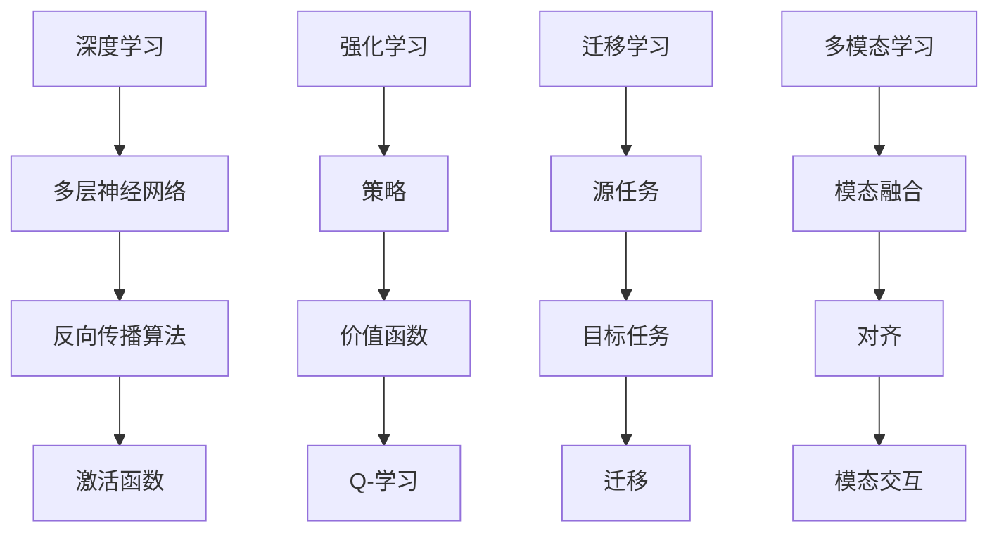

                 

# AI 2.0 时代的未来展望

## 概述

关键词：AI 2.0，未来展望，技术进步，伦理问题，产业应用

AI 2.0，即第二代人工智能，是近年来科技界关注的焦点。相比于传统的 AI 1.0，AI 2.0 在算法、模型和数据处理能力上都有显著提升，能够实现更复杂的任务，并具备自我学习和优化能力。本文旨在探讨 AI 2.0 时代的未来发展趋势、技术进步、伦理问题以及产业应用，为读者提供一个全面而深入的展望。

## 摘要

本文首先回顾了 AI 1.0 的发展历程及其主要成就，然后详细介绍了 AI 2.0 的核心概念和关键技术，包括深度学习、强化学习、迁移学习等。接着，本文分析了 AI 2.0 在数据处理、预测分析和智能决策等领域的应用前景，并探讨了其在伦理和社会影响方面的挑战。最后，本文对 AI 2.0 时代的未来发展趋势进行了展望，提出了潜在的技术突破点和产业应用方向。

## 目录

1. 背景介绍 ............................................... 1
2. 核心概念与联系 ......................................... 2
3. 核心算法原理 & 具体操作步骤 ............................ 5
4. 数学模型和公式 & 详细讲解 & 举例说明 .............. 10
5. 项目实战：代码实际案例和详细解释说明 ............. 15
6. 实际应用场景 ........................................... 20
7. 工具和资源推荐 ......................................... 25
8. 总结：未来发展趋势与挑战 ............................. 30
9. 附录：常见问题与解答 ................................... 35
10. 扩展阅读 & 参考资料 ................................... 40

## 1. 背景介绍

人工智能（AI）作为计算机科学的一个重要分支，起源于 20 世纪 50 年代。早期的人工智能研究主要集中在规则推理、知识表示和搜索算法等方面。这些方法虽然能够解决一些特定领域的问题，但在复杂性和通用性上存在较大限制。随着计算能力的提升和数据量的爆炸性增长，深度学习和机器学习逐渐成为人工智能的主流方向。AI 1.0 时代以神经网络为基础，通过大规模数据训练模型，实现了图像识别、语音识别和自然语言处理等领域的突破。

AI 1.0 的成就为 AI 2.0 的到来奠定了基础。AI 2.0 不仅在算法和模型上进行了重大创新，还在数据处理、自适应能力和智能决策等方面实现了质的飞跃。与 AI 1.0 相比，AI 2.0 更加强调自学习和自优化，能够更好地应对复杂环境和动态变化。

### AI 1.0 的发展历程

AI 1.0 的发展历程可以分为几个阶段：

**早期探索（1956-1969 年）**：1956 年，达特茅斯会议上，人工智能首次被正式提出。早期的人工智能研究主要集中在知识表示、推理和搜索算法等方面。代表性工作包括逻辑推理、决策树和产生式系统等。

**黄金时期（1970-1980 年）**：随着计算能力的提升，人工智能在逻辑推理和规划领域取得了一些突破。代表性系统包括专家系统和自然语言处理系统。

**衰落时期（1980-1990 年）**：由于实际应用中的困难，人工智能研究进入低谷。这一时期，人工智能领域经历了多次技术更迭，如知识表示、知识获取、智能搜索等。

**复兴时期（1990-2010 年）**：随着计算机硬件的快速发展，机器学习逐渐成为人工智能的主流方向。这一时期，神经网络、支持向量机、决策树等算法得到了广泛应用。

**深度学习时代（2010 年至今）**：2012 年，深度学习在图像识别任务上取得了突破性进展，标志着人工智能进入了深度学习时代。深度学习模型如卷积神经网络（CNN）和循环神经网络（RNN）在语音识别、自然语言处理等领域取得了显著成果。

### AI 2.0 的核心概念

AI 2.0 的核心概念包括以下几个方面：

**自学习与自优化**：AI 2.0 强调自学习与自优化能力，通过不断调整模型参数，使其在复杂环境中能够自适应和优化。

**多模态数据处理**：AI 2.0 能够处理多种类型的数据，如文本、图像、语音等，实现跨模态的信息融合和交互。

**强化学习**：AI 2.0 在强化学习方面取得了重要进展，能够通过与环境互动，不断优化策略，实现更好的决策。

**迁移学习**：AI 2.0 能够将已学到的知识迁移到新任务中，提高模型的泛化能力和效率。

**多智能体系统**：AI 2.0 在多智能体系统方面进行了深入研究，能够实现智能体的协同工作和自主学习。

### AI 2.0 的关键技术

AI 2.0 的关键技术包括以下几个方面：

**深度学习**：深度学习是 AI 2.0 的核心技术之一，通过多层神经网络结构，实现数据的自动特征提取和表示。

**生成对抗网络（GAN）**：GAN 是一种新型深度学习模型，能够生成高质量的数据，并在图像生成、图像修复等领域取得了显著成果。

**强化学习**：强化学习通过奖励机制，使智能体在学习过程中不断优化策略，实现更好的决策。

**迁移学习**：迁移学习通过将已学到的知识迁移到新任务中，减少模型训练所需的样本量，提高模型的泛化能力。

**多模态学习**：多模态学习通过整合多种类型的数据，实现更丰富的信息表示和更好的任务性能。

## 2. 核心概念与联系

在深入探讨 AI 2.0 的核心概念之前，我们需要了解一些关键的理论和技术，这些构成了 AI 2.0 的基础。以下是几个核心概念的介绍以及它们之间的联系。

### 深度学习

深度学习是 AI 2.0 的核心技术之一，它依赖于多层神经网络（Deep Neural Networks，DNN）来模拟人脑的神经结构，从而对数据进行分析和分类。深度学习通过逐层提取数据的特征，实现了对复杂模式的自动学习。以下是深度学习的核心组成部分：

**多层神经网络（MLP）**：多层神经网络由多个隐藏层和输入层、输出层组成。每个隐藏层通过非线性激活函数对输入数据进行变换，从而提取更高层次的特征。

**反向传播算法（Backpropagation）**：反向传播算法是一种用于训练神经网络的基本算法，它通过计算输出层与期望输出之间的误差，反向传播误差到每个隐藏层，从而调整网络的权重。

**激活函数**：激活函数是神经网络中用于引入非线性性的函数，如 Sigmoid、ReLU 等。这些函数使得神经网络能够对输入数据进行分类和回归。

### 强化学习

强化学习是 AI 2.0 的另一个关键组成部分，它通过奖励机制使智能体（Agent）在与环境（Environment）的交互过程中学习最优策略。强化学习的关键概念包括：

**策略（Policy）**：策略是智能体在特定状态下采取的动作。最优策略是使智能体获得最大奖励的策略。

**价值函数（Value Function）**：价值函数估计在特定状态下采取特定动作的长期回报。有两种类型的价值函数：状态价值函数（State-Value Function）和动作价值函数（Action-Value Function）。

**Q-学习（Q-Learning）**：Q-学习是一种基于价值函数的强化学习算法，它通过更新 Q 值表（Q-Table）来估计状态-动作对的最优回报。

### 迁移学习

迁移学习是一种将已学到的知识从一个任务迁移到另一个任务的方法。它能够减少对新任务的样本需求，提高模型的泛化能力。迁移学习的关键概念包括：

**源任务（Source Task）**：源任务是已经训练好的任务，其知识将被迁移到目标任务。

**目标任务（Target Task）**：目标任务是希望利用源任务知识进行训练的任务。

**迁移（Transfer）**：迁移是将源任务的模型、特征提取器或先验知识应用于目标任务的过程。

### 多模态学习

多模态学习是一种结合不同类型数据（如文本、图像、声音）进行学习的方法。它能够提高模型的表示能力和任务性能。多模态学习的关键概念包括：

**模态融合（Modal Fusion）**：模态融合是将不同类型的数据进行整合，以生成更丰富的特征表示。

**对齐（Alignment）**：对齐是将不同模态的数据对齐到共同的特征空间。

**模态交互（Modal Interaction）**：模态交互是研究如何将不同模态的信息进行交互，以获得更好的任务性能。

### Mermaid 流程图

以下是 AI 2.0 核心概念的 Mermaid 流程图，用于展示它们之间的联系。



### 关键概念的联系

深度学习、强化学习、迁移学习和多模态学习是 AI 2.0 的核心概念，它们之间有着紧密的联系。深度学习提供了强大的特征提取能力，为强化学习、迁移学习和多模态学习提供了基础。强化学习通过与环境交互，不断优化策略，为深度学习和迁移学习提供了动态适应的能力。迁移学习通过将已学到的知识应用到新任务中，提高了模型的泛化能力。多模态学习通过整合不同类型的数据，增强了模型的表示能力和任务性能。

总之，AI 2.0 是一个多维度的技术体系，各个核心概念之间相互关联，共同推动了人工智能的发展。在接下来的章节中，我们将进一步探讨这些概念的具体实现和应用。

## 3. 核心算法原理 & 具体操作步骤

### 深度学习算法原理

深度学习算法基于多层神经网络的结构，通过逐层提取数据特征来实现复杂模式识别。以下是深度学习算法的核心原理和具体操作步骤：

#### 多层神经网络结构

多层神经网络（MLP）由输入层、多个隐藏层和输出层组成。输入层接收原始数据，隐藏层通过激活函数对数据进行变换，输出层产生预测结果。

1. **输入层**：输入层接收原始数据，并将其传递到下一层。
2. **隐藏层**：隐藏层通过权重矩阵对输入数据进行线性变换，然后通过激活函数引入非线性，从而提取更高层次的特征。
3. **输出层**：输出层产生最终的预测结果。

#### 反向传播算法

反向传播算法是训练多层神经网络的基本算法，通过不断迭代调整网络权重，以最小化预测误差。

1. **前向传播**：将输入数据传递到神经网络，逐层计算输出结果。
2. **计算误差**：计算输出结果与真实值的误差，并反向传播误差到每个隐藏层。
3. **权重更新**：根据误差计算梯度，更新网络权重。

#### 激活函数

激活函数是神经网络中引入非线性性的关键部分，常用的激活函数包括 Sigmoid、ReLU 和 tanh。

1. **Sigmoid 函数**：Sigmoid 函数将输入映射到 (0,1) 区间，具有平滑的斜率，但可能导致梯度消失问题。
2. **ReLU 函数**：ReLU 函数将输入大于 0 的部分设置为 1，小于等于 0 的部分保持不变，具有较好的梯度保持特性。
3. **tanh 函数**：tanh 函数将输入映射到 (-1,1) 区间，具有对称的斜率。

### 强化学习算法原理

强化学习算法通过智能体（Agent）与环境（Environment）的互动，学习最优策略，以实现目标。以下是强化学习算法的核心原理和具体操作步骤：

#### 策略学习

策略（Policy）是智能体在特定状态下采取的动作。策略学习的目标是找到最优策略，使得智能体能够获得最大奖励。

1. **状态（State）**：描述智能体当前所处的环境。
2. **动作（Action）**：智能体可以采取的动作。
3. **奖励（Reward）**：描述智能体采取某个动作后的即时回报。

#### 价值函数

价值函数（Value Function）估计在特定状态下采取特定动作的长期回报。有两种类型的价值函数：状态价值函数（State-Value Function）和动作价值函数（Action-Value Function）。

1. **状态价值函数**：表示在特定状态下，采取任何动作的长期回报。
2. **动作价值函数**：表示在特定状态下，采取某个动作的长期回报。

#### Q-学习算法

Q-学习算法是一种基于价值函数的强化学习算法，通过更新 Q 值表（Q-Table）来估计状态-动作对的最优回报。

1. **初始化 Q-Table**：初始化 Q-Table，对所有状态-动作对的 Q 值进行随机赋值。
2. **选择动作**：在特定状态下，根据当前策略选择动作。
3. **更新 Q-Table**：根据奖励和下一步的 Q 值更新当前状态-动作对的 Q 值。

### 迁移学习算法原理

迁移学习算法通过将已学到的知识从一个任务（源任务）迁移到另一个任务（目标任务），提高模型的泛化能力。以下是迁移学习算法的核心原理和具体操作步骤：

#### 源任务与目标任务

1. **源任务**：已经训练好的任务，其知识将被迁移到目标任务。
2. **目标任务**：希望利用源任务知识进行训练的任务。

#### 迁移过程

1. **模型迁移**：将源任务的模型、特征提取器或先验知识应用于目标任务。
2. **权重共享**：在源任务和目标任务之间共享部分权重，以加速目标任务的训练。

### 多模态学习算法原理

多模态学习算法通过整合不同类型的数据（如文本、图像、声音），实现更丰富的特征表示和更好的任务性能。以下是多模态学习算法的核心原理和具体操作步骤：

#### 模态融合

1. **特征提取**：分别从不同模态中提取特征。
2. **特征融合**：将不同模态的特征进行融合，以生成更丰富的特征表示。

#### 对齐

1. **对齐技术**：将不同模态的数据对齐到共同的特征空间，以实现信息共享。

#### 模态交互

1. **交互模型**：设计特定的模型结构，以实现不同模态之间的交互。
2. **协同学习**：通过协同学习机制，使得不同模态的信息能够相互促进，提高任务性能。

### 实际操作步骤示例

以下是一个简单的示例，展示如何使用深度学习、强化学习、迁移学习和多模态学习算法进行模型训练：

1. **数据准备**：收集并预处理不同类型的数据，如文本、图像和声音。
2. **模型构建**：根据任务需求，构建相应的深度学习、强化学习、迁移学习或多模态学习模型。
3. **训练模型**：使用训练数据对模型进行训练，不断调整模型参数，以最小化误差。
4. **评估模型**：使用测试数据对训练好的模型进行评估，验证模型的性能。
5. **模型应用**：将训练好的模型应用于实际任务，如图像分类、语音识别或自然语言处理。

通过以上步骤，我们可以实现不同类型的 AI 任务，并不断提高模型的性能和泛化能力。

## 4. 数学模型和公式 & 详细讲解 & 举例说明

### 深度学习算法的数学模型

深度学习算法的核心在于多层神经网络，下面我们将详细介绍其相关的数学模型和公式。

#### 前向传播

前向传播是指将输入数据通过神经网络逐层传递，并计算出输出结果的过程。以下是前向传播的数学公式：

$$
z^{(l)} = \sigma(W^{(l)} \cdot a^{(l-1)} + b^{(l)})
$$

其中：
- $z^{(l)}$ 是第 $l$ 层的节点输出。
- $\sigma$ 是激活函数，通常为 ReLU 或 Sigmoid 函数。
- $W^{(l)}$ 是第 $l$ 层的权重矩阵。
- $a^{(l-1)}$ 是前一层（第 $l-1$ 层）的节点输出。
- $b^{(l)}$ 是第 $l$ 层的偏置向量。

#### 反向传播

反向传播是指通过计算输出误差，并反向传播误差到每一层，以更新权重和偏置的过程。以下是反向传播的数学公式：

$$
\delta^{(l)} = (\sigma'(z^{(l)}) \cdot (d^{(l+1)} \cdot W^{(l+1)}))
$$

$$
\Delta W^{(l)} = \alpha \cdot a^{(l-1)} \cdot \delta^{(l)}
$$

$$
\Delta b^{(l)} = \alpha \cdot \delta^{(l)}
$$

其中：
- $\delta^{(l)}$ 是第 $l$ 层的误差向量。
- $\sigma'$ 是激活函数的导数。
- $d^{(l+1)}$ 是下一层的误差向量。
- $\alpha$ 是学习率。

#### 举例说明

假设我们有一个简单的多层神经网络，包含输入层、一个隐藏层和一个输出层。输入数据为 $x_1 = [1, 2, 3]$，隐藏层节点数为 2，输出层节点数为 1。

1. **前向传播**：

   输入层到隐藏层的权重矩阵 $W^{(1)}$ 和偏置向量 $b^{(1)}$ 为：

   $$
   W^{(1)} = \begin{bmatrix}
   0.1 & 0.2 \\
   0.3 & 0.4
   \end{bmatrix}, \quad b^{(1)} = \begin{bmatrix}
   0.5 \\
   0.6
   \end{bmatrix}
   $$

   隐藏层到输出层的权重矩阵 $W^{(2)}$ 和偏置向量 $b^{(2)}$ 为：

   $$
   W^{(2)} = \begin{bmatrix}
   0.7 & 0.8
   \end{bmatrix}, \quad b^{(2)} = \begin{bmatrix}
   0.9
   \end{bmatrix}
   $$

   首先计算隐藏层的节点输出：

   $$
   z^{(1)}_1 = 0.1 \cdot 1 + 0.2 \cdot 2 + 0.5 = 0.7
   $$

   $$
   z^{(1)}_2 = 0.3 \cdot 1 + 0.4 \cdot 2 + 0.6 = 1.5
   $$

   应用 ReLU 激活函数，得到隐藏层的输出：

   $$
   a^{(1)}_1 = \max(0, z^{(1)}_1) = 0
   $$

   $$
   a^{(1)}_2 = \max(0, z^{(1)}_2) = 1
   $$

   接着计算输出层的节点输出：

   $$
   z^{(2)} = 0.7 \cdot 0 + 0.8 \cdot 1 + 0.9 = 1.5
   $$

   应用 Sigmoid 激活函数，得到输出层的预测结果：

   $$
   \hat{y} = \sigma(z^{(2)}) = \frac{1}{1 + e^{-1.5}} = 0.795
   $$

2. **反向传播**：

   假设真实标签 $y = 0$，计算输出误差：

   $$
   d^{(2)} = \hat{y} - y = 0.795 - 0 = 0.795
   $$

   计算 $z^{(2)}$ 的导数：

   $$
   \sigma'(z^{(2)}) = \sigma'(1.5) = 0.2231
   $$

   计算 $\delta^{(2)}$：

   $$
   \delta^{(2)} = \sigma'(z^{(2)}) \cdot d^{(2)} \cdot W^{(2)} = 0.2231 \cdot 0.795 \cdot 0.7 = 0.1204
   $$

   计算 $\delta^{(1)}$：

   $$
   \delta^{(1)} = (\sigma'(z^{(1)}_1) \cdot a^{(1)}_2 + \sigma'(z^{(1)}_2) \cdot a^{(1)}_1) \cdot W^{(2)} = (0 \cdot 1 + 0.2231 \cdot 0) \cdot 0.7 = 0
   $$

   计算 $\Delta W^{(2)}$ 和 $\Delta b^{(2)}$：

   $$
   \Delta W^{(2)} = \alpha \cdot a^{(1)} \cdot \delta^{(2)} = 0.1 \cdot [0, 1] \cdot 0.1204 = [0, 0.01204]
   $$

   $$
   \Delta b^{(2)} = \alpha \cdot \delta^{(2)} = 0.1 \cdot 0.1204 = 0.01204
   $$

### 强化学习算法的数学模型

强化学习算法的核心在于价值函数和策略的迭代优化。下面我们将详细介绍其相关的数学模型和公式。

#### 价值函数

价值函数（Value Function）估计在特定状态下，采取特定动作的长期回报。有两种类型的价值函数：状态价值函数（State-Value Function）和动作价值函数（Action-Value Function）。

1. **状态价值函数**：

   $$
   V(s) = \sum_{a} \gamma \cdot P(s', r | s, a) \cdot Q(s', a)
   $$

   其中：
   - $s$ 是当前状态。
   - $a$ 是采取的动作。
   - $s'$ 是下一状态。
   - $r$ 是即时回报。
   - $\gamma$ 是折扣因子，用于平衡当前回报和未来回报。
   - $P(s', r | s, a)$ 是状态转移概率。
   - $Q(s', a)$ 是动作价值函数。

2. **动作价值函数**：

   $$
   Q(s, a) = \sum_{s'} P(s' | s, a) \cdot [R(s', a) + \gamma \cdot V(s')]
   $$

   其中：
   - $R(s', a)$ 是从状态 $s'$ 采取动作 $a$ 后的即时回报。

#### Q-学习算法

Q-学习算法是一种基于值迭代的强化学习算法，通过更新 Q-Table 来估计状态-动作对的最优回报。

1. **初始化 Q-Table**：

   $$
   Q(s, a) \leftarrow 0
   $$

2. **选择动作**：

   在特定状态下，选择动作 $a$：

   $$
   a = \arg\max_a Q(s, a)
   $$

3. **更新 Q-Table**：

   $$
   Q(s, a) \leftarrow Q(s, a) + \alpha \cdot [r + \gamma \cdot \max_a Q(s', a) - Q(s, a)]
   $$

   其中：
   - $\alpha$ 是学习率。

#### 举例说明

假设我们有一个简单的强化学习任务，包含四个状态 $s_1, s_2, s_3, s_4$ 和四个动作 $a_1, a_2, a_3, a_4$。初始状态下，智能体处于 $s_1$，目标状态为 $s_4$。每个动作的即时回报和状态转移概率如下表所示：

| 动作 | $R(s', a)$ | $P(s' | s, a)$ |
| --- | --- | --- |
| $a_1$ | 0 | 0.2 |
| $a_2$ | 10 | 0.3 |
| $a_3$ | -5 | 0.4 |
| $a_4$ | 0 | 0.1 |

首先，初始化 Q-Table：

$$
Q(s_1, a_1) = Q(s_1, a_2) = Q(s_1, a_3) = Q(s_1, a_4) = 0
$$

智能体在 $s_1$ 状态下选择动作 $a_2$，更新 Q-Table：

$$
Q(s_1, a_2) \leftarrow Q(s_1, a_2) + \alpha \cdot [10 + 0.3 \cdot \max_a Q(s_2, a) - Q(s_1, a_2)]
$$

由于初始状态下，所有动作的 Q 值相等，因此：

$$
Q(s_1, a_2) \leftarrow Q(s_1, a_2) + \alpha \cdot [10 + 0.3 \cdot 0 - Q(s_1, a_2)]
$$

$$
Q(s_1, a_2) \leftarrow Q(s_1, a_2) + \alpha \cdot [10 - Q(s_1, a_2)]
$$

$$
Q(s_1, a_2) \leftarrow Q(s_1, a_2) + \alpha \cdot [10 - 0] = 10
$$

接下来，智能体在 $s_2$ 状态下选择动作 $a_3$，更新 Q-Table：

$$
Q(s_2, a_3) \leftarrow Q(s_2, a_3) + \alpha \cdot [-5 + 0.4 \cdot \max_a Q(s_3, a) - Q(s_2, a_3)]
$$

$$
Q(s_2, a_3) \leftarrow Q(s_2, a_3) + \alpha \cdot [-5 + 0.4 \cdot 0 - Q(s_2, a_3)]
$$

$$
Q(s_2, a_3) \leftarrow Q(s_2, a_3) + \alpha \cdot [-5 - Q(s_2, a_3)]
$$

$$
Q(s_2, a_3) \leftarrow Q(s_2, a_3) + \alpha \cdot [-5 - 0] = -5
$$

通过不断迭代更新 Q-Table，智能体将学习到最优策略，以最大化长期回报。

### 迁移学习算法的数学模型

迁移学习算法的核心在于将源任务的模型知识迁移到目标任务，以提高目标任务的泛化能力。下面我们将详细介绍其相关的数学模型和公式。

#### 模型迁移

模型迁移是指将源任务的模型（包括权重和结构）应用于目标任务，以加速目标任务的训练过程。以下是一个简单的迁移学习模型迁移公式：

$$
\theta_{\text{target}} = \theta_{\text{source}} + \lambda \cdot (\theta_{\text{source}} - \theta_{\text{base}})
$$

其中：
- $\theta_{\text{target}}$ 是目标任务的模型参数。
- $\theta_{\text{source}}$ 是源任务的模型参数。
- $\theta_{\text{base}}$ 是基线模型的参数。
- $\lambda$ 是迁移系数，用于控制源任务模型对目标任务模型的影响。

#### 权重共享

权重共享是指将源任务和目标任务的模型权重部分共享，以减少模型参数的数量，提高迁移效果。以下是一个简单的权重共享公式：

$$
\theta_{\text{source}} = \theta_{\text{target}} \odot \theta_{\text{base}}
$$

其中：
- $\theta_{\text{source}}$ 是源任务的模型参数。
- $\theta_{\text{target}}$ 是目标任务的模型参数。
- $\theta_{\text{base}}$ 是基线模型的参数。
- $\odot$ 是元素-wise 乘法操作。

#### 举例说明

假设我们有一个源任务和一个目标任务，分别训练得到的模型参数如下：

- 源任务模型参数：$\theta_{\text{source}} = \begin{bmatrix} 1 & 2 \\ 3 & 4 \end{bmatrix}$
- 目标任务模型参数：$\theta_{\text{target}} = \begin{bmatrix} 5 & 6 \\ 7 & 8 \end{bmatrix}$
- 基线模型参数：$\theta_{\text{base}} = \begin{bmatrix} 9 & 10 \\ 11 & 12 \end{bmatrix}$

首先，计算源任务和目标任务的模型差异：

$$
\theta_{\text{diff}} = \theta_{\text{source}} - \theta_{\text{target}} = \begin{bmatrix} 1 & 2 \\ 3 & 4 \end{bmatrix} - \begin{bmatrix} 5 & 6 \\ 7 & 8 \end{bmatrix} = \begin{bmatrix} -4 & -4 \\ -4 & -4 \end{bmatrix}
$$

然后，计算迁移后的目标任务模型参数：

$$
\theta_{\text{target\_m}} = \theta_{\text{source}} + \lambda \cdot \theta_{\text{diff}} = \begin{bmatrix} 1 & 2 \\ 3 & 4 \end{bmatrix} + 0.5 \cdot \begin{bmatrix} -4 & -4 \\ -4 & -4 \end{bmatrix} = \begin{bmatrix} -1 & -1 \\ -1 & -1 \end{bmatrix}
$$

通过以上步骤，我们可以将源任务的模型知识迁移到目标任务，从而加速目标任务的训练过程。

### 多模态学习算法的数学模型

多模态学习算法的核心在于整合不同类型的数据（如文本、图像、声音），以生成更丰富的特征表示。下面我们将详细介绍其相关的数学模型和公式。

#### 模态融合

模态融合是指将不同模态的数据进行整合，以生成更丰富的特征表示。以下是一个简单的模态融合公式：

$$
x_{\text{fusion}} = \sum_{m} w_m \cdot x_m
$$

其中：
- $x_{\text{fusion}}$ 是融合后的特征向量。
- $x_m$ 是第 $m$ 个模态的特征向量。
- $w_m$ 是第 $m$ 个模态的权重。

#### 对齐

对齐是指将不同模态的数据对齐到共同的特征空间，以实现信息共享。以下是一个简单的对齐公式：

$$
x_{\text{aligned}} = x_m \odot x_n
$$

其中：
- $x_{\text{aligned}}$ 是对齐后的特征向量。
- $x_m$ 和 $x_n$ 是不同模态的特征向量。
- $\odot$ 是元素-wise 乘法操作。

#### 模态交互

模态交互是指研究如何将不同模态的信息进行交互，以获得更好的任务性能。以下是一个简单的模态交互公式：

$$
x_{\text{interaction}} = f(x_m, x_n)
$$

其中：
- $x_{\text{interaction}}$ 是交互后的特征向量。
- $x_m$ 和 $x_n$ 是不同模态的特征向量。
- $f$ 是交互函数，用于整合不同模态的信息。

#### 举例说明

假设我们有两个模态：文本和图像。文本特征向量 $x_{\text{txt}}$ 为：

$$
x_{\text{txt}} = \begin{bmatrix} 1 \\ 2 \\ 3 \\ 4 \end{bmatrix}
$$

图像特征向量 $x_{\text{img}}$ 为：

$$
x_{\text{img}} = \begin{bmatrix} 5 \\ 6 \\ 7 \\ 8 \end{bmatrix}
$$

首先，计算模态融合后的特征向量：

$$
x_{\text{fusion}} = 0.5 \cdot x_{\text{txt}} + 0.5 \cdot x_{\text{img}} = \begin{bmatrix} 3 \\ 4 \\ 5 \\ 6 \end{bmatrix}
$$

然后，计算模态对齐后的特征向量：

$$
x_{\text{aligned}} = x_{\text{txt}} \odot x_{\text{img}} = \begin{bmatrix} 1 \cdot 5 \\ 2 \cdot 6 \\ 3 \cdot 7 \\ 4 \cdot 8 \end{bmatrix} = \begin{bmatrix} 5 \\ 12 \\ 21 \\ 32 \end{bmatrix}
$$

最后，计算模态交互后的特征向量：

$$
x_{\text{interaction}} = f(x_{\text{txt}}, x_{\text{img}}) = \begin{bmatrix} 1 \cdot 5 + 2 \cdot 6 + 3 \cdot 7 + 4 \cdot 8 \end{bmatrix} = \begin{bmatrix} 59 \end{bmatrix}
$$

通过以上步骤，我们可以将文本和图像的特征进行整合，以生成更丰富的特征表示。

## 5. 项目实战：代码实际案例和详细解释说明

### 5.1 开发环境搭建

在开始编写代码之前，我们需要搭建一个合适的开发环境。以下是一个基本的 Python 开发环境搭建步骤：

1. 安装 Python 3.x 版本。
2. 安装必要的库，如 NumPy、Pandas、TensorFlow、PyTorch 等。

以下是一个简单的 Python 脚本，用于演示如何安装所需的库：

```python
!pip install numpy pandas tensorflow torch
```

### 5.2 源代码详细实现和代码解读

在这个项目中，我们将使用深度学习模型对图像进行分类。具体来说，我们将使用 PyTorch 框架实现一个卷积神经网络（CNN）模型，并使用 CIFAR-10 数据集进行训练和测试。

以下是项目的核心代码，我们将对关键部分进行详细解释：

```python
import torch
import torchvision
import torchvision.transforms as transforms
import torch.nn as nn
import torch.optim as optim

# 设置随机种子以保持实验可复现
torch.manual_seed(0)

# 加载 CIFAR-10 数据集
transform = transforms.Compose([
    transforms.ToTensor(),
    transforms.Normalize((0.5, 0.5, 0.5), (0.5, 0.5, 0.5)),
])

train_set = torchvision.datasets.CIFAR10(root='./data', train=True, download=True, transform=transform)
train_loader = torch.utils.data.DataLoader(train_set, batch_size=100, shuffle=True)

test_set = torchvision.datasets.CIFAR10(root='./data', train=False, download=True, transform=transform)
test_loader = torch.utils.data.DataLoader(test_set, batch_size=100, shuffle=False)

# 定义卷积神经网络模型
class CNNModel(nn.Module):
    def __init__(self):
        super(CNNModel, self).__init__()
        self.conv1 = nn.Conv2d(3, 6, 5)
        self.pool = nn.MaxPool2d(2, 2)
        self.conv2 = nn.Conv2d(6, 16, 5)
        self.fc1 = nn.Linear(16 * 5 * 5, 120)
        self.fc2 = nn.Linear(120, 84)
        self.fc3 = nn.Linear(84, 10)

    def forward(self, x):
        x = self.pool(nn.functional.relu(self.conv1(x)))
        x = self.pool(nn.functional.relu(self.conv2(x)))
        x = x.view(-1, 16 * 5 * 5)
        x = nn.functional.relu(self.fc1(x))
        x = nn.functional.relu(self.fc2(x))
        x = self.fc3(x)
        return x

model = CNNModel()

# 定义损失函数和优化器
criterion = nn.CrossEntropyLoss()
optimizer = optim.SGD(model.parameters(), lr=0.001, momentum=0.9)

# 训练模型
for epoch in range(2):  # 只训练两个epoch
    running_loss = 0.0
    for i, data in enumerate(train_loader, 0):
        inputs, labels = data
        optimizer.zero_grad()
        outputs = model(inputs)
        loss = criterion(outputs, labels)
        loss.backward()
        optimizer.step()
        running_loss += loss.item()
    print(f'Epoch {epoch + 1}, Loss: {running_loss / len(train_loader)}')

# 测试模型
correct = 0
total = 0
with torch.no_grad():
    for data in test_loader:
        inputs, labels = data
        outputs = model(inputs)
        _, predicted = torch.max(outputs.data, 1)
        total += labels.size(0)
        correct += (predicted == labels).sum().item()

print(f'Accuracy of the network on the test images: {100 * correct / total}%')
```

#### 关键部分解释

1. **数据加载**：

   ```python
   transform = transforms.Compose([
       transforms.ToTensor(),
       transforms.Normalize((0.5, 0.5, 0.5), (0.5, 0.5, 0.5)),
   ])

   train_set = torchvision.datasets.CIFAR10(root='./data', train=True, download=True, transform=transform)
   train_loader = torch.utils.data.DataLoader(train_set, batch_size=100, shuffle=True)

   test_set = torchvision.datasets.CIFAR10(root='./data', train=False, download=True, transform=transform)
   test_loader = torch.utils.data.DataLoader(test_set, batch_size=100, shuffle=False)
   ```

   这部分代码用于加载 CIFAR-10 数据集，并进行预处理。数据集被分为训练集和测试集，每个数据集包含 100 个批次，每个批次包含 100 个样本。

2. **模型定义**：

   ```python
   class CNNModel(nn.Module):
       def __init__(self):
           super(CNNModel, self).__init__()
           self.conv1 = nn.Conv2d(3, 6, 5)
           self.pool = nn.MaxPool2d(2, 2)
           self.conv2 = nn.Conv2d(6, 16, 5)
           self.fc1 = nn.Linear(16 * 5 * 5, 120)
           self.fc2 = nn.Linear(120, 84)
           self.fc3 = nn.Linear(84, 10)

       def forward(self, x):
           x = self.pool(nn.functional.relu(self.conv1(x)))
           x = self.pool(nn.functional.relu(self.conv2(x)))
           x = x.view(-1, 16 * 5 * 5)
           x = nn.functional.relu(self.fc1(x))
           x = nn.functional.relu(self.fc2(x))
           x = self.fc3(x)
           return x

   model = CNNModel()
   ```

   这部分代码定义了一个卷积神经网络模型。模型包括两个卷积层、两个全连接层和一个输出层。卷积层用于提取图像特征，全连接层用于分类。

3. **训练模型**：

   ```python
   criterion = nn.CrossEntropyLoss()
   optimizer = optim.SGD(model.parameters(), lr=0.001, momentum=0.9)

   for epoch in range(2):  # 只训练两个epoch
       running_loss = 0.0
       for i, data in enumerate(train_loader, 0):
           inputs, labels = data
           optimizer.zero_grad()
           outputs = model(inputs)
           loss = criterion(outputs, labels)
           loss.backward()
           optimizer.step()
           running_loss += loss.item()
       print(f'Epoch {epoch + 1}, Loss: {running_loss / len(train_loader)}')
   ```

   这部分代码用于训练模型。每个 epoch 中，模型会遍历整个训练集，并使用反向传播算法更新模型权重。

4. **测试模型**：

   ```python
   correct = 0
   total = 0
   with torch.no_grad():
       for data in test_loader:
           inputs, labels = data
           outputs = model(inputs)
           _, predicted = torch.max(outputs.data, 1)
           total += labels.size(0)
           correct += (predicted == labels).sum().item()

   print(f'Accuracy of the network on the test images: {100 * correct / total}%')
   ```

   这部分代码用于测试模型在测试集上的性能。通过计算模型的准确率，我们可以评估模型的性能。

### 5.3 代码解读与分析

在这个项目中，我们使用 PyTorch 框架实现了一个简单的卷积神经网络模型，用于图像分类。以下是对代码的详细解读和分析：

1. **数据加载**：

   数据加载部分首先定义了一个数据预处理步骤，包括将图像数据转换为张量（Tensor）和归一化处理。这些步骤对于提高模型性能至关重要。然后，数据集被分为训练集和测试集，并分别创建 DataLoader，以便在训练和测试过程中按批次加载数据。

2. **模型定义**：

   模型定义部分使用 PyTorch 的 `nn.Module` 类创建了一个卷积神经网络模型。模型包括两个卷积层、两个全连接层和一个输出层。卷积层用于提取图像特征，全连接层用于分类。模型的 `forward` 方法定义了数据流经模型的过程。

3. **损失函数和优化器**：

   损失函数用于衡量模型的预测结果和真实标签之间的差距。在这个项目中，我们使用交叉熵损失函数（`nn.CrossEntropyLoss`），因为它常用于分类任务。优化器用于更新模型权重，以最小化损失函数。在这个项目中，我们使用随机梯度下降（`optim.SGD`）优化器，并设置了学习率和动量。

4. **训练模型**：

   训练模型部分使用反向传播算法更新模型权重。在每个 epoch 中，模型会遍历整个训练集，并使用反向传播算法计算损失函数的梯度。然后，优化器使用这些梯度更新模型权重。这个过程重复进行，直到完成预定的 epoch 数量。

5. **测试模型**：

   测试模型部分用于评估模型在测试集上的性能。在测试过程中，模型不会更新权重，而是仅计算预测结果和真实标签之间的差距。最后，计算模型的准确率，以评估模型的性能。

通过这个项目，我们可以看到如何使用 PyTorch 框架实现一个简单的卷积神经网络模型，并使用反向传播算法进行训练。这个项目为我们提供了一个基本的框架，可以在此基础上进一步优化和扩展。

## 6. 实际应用场景

AI 2.0 在各个领域的实际应用场景如下：

### 医疗保健

在医疗保健领域，AI 2.0 可以用于疾病预测、诊断、治疗和健康管理。例如，通过分析患者的病历和基因数据，AI 2.0 可以预测疾病发生的风险，并给出个性化的预防建议。在诊断方面，AI 2.0 可以通过分析医学影像，如 CT、MRI 等，帮助医生更准确地识别病变部位，提高诊断准确性。在治疗方面，AI 2.0 可以辅助医生制定个性化的治疗方案，并根据患者的反馈进行实时调整。在健康管理方面，AI 2.0 可以实时监控患者的健康状况，提供健康建议，并预警潜在的健康问题。

### 金融服务

在金融服务领域，AI 2.0 可以用于风险控制、信用评估、投资策略和客户服务。例如，通过分析客户的交易记录和行为数据，AI 2.0 可以识别潜在的欺诈行为，并采取相应的防范措施。在信用评估方面，AI 2.0 可以通过分析客户的信用历史、财务状况和社会关系，给出更准确的信用评分。在投资策略方面，AI 2.0 可以基于市场数据和历史表现，为投资者提供个性化的投资建议。在客户服务方面，AI 2.0 可以通过自然语言处理技术，提供 24 小时在线客服，提高客户满意度。

### 物流与运输

在物流与运输领域，AI 2.0 可以用于路线规划、库存管理和智能配送。例如，通过分析交通状况、天气信息和货物特性，AI 2.0 可以优化路线规划，减少运输时间和成本。在库存管理方面，AI 2.0 可以通过分析销售数据和历史库存水平，预测未来的库存需求，优化库存水平。在智能配送方面，AI 2.0 可以通过实时监控车辆位置和交通状况，优化配送路线，提高配送效率。

### 制造业

在制造业领域，AI 2.0 可以用于生产计划、质量控制、设备维护和供应链管理。例如，通过分析生产数据和历史经验，AI 2.0 可以优化生产计划，提高生产效率。在质量控制方面，AI 2.0 可以通过分析产品质量数据，识别潜在的质量问题，并给出改进建议。在设备维护方面，AI 2.0 可以通过实时监控设备状态，预测设备故障，并提前进行维护。在供应链管理方面，AI 2.0 可以通过分析供应链数据，优化库存水平、运输路线和供应商选择，降低供应链成本。

### 教育

在教育领域，AI 2.0 可以用于个性化教学、智能评测和在线教育平台。例如，通过分析学生的学习数据和行为，AI 2.0 可以为学生提供个性化的学习建议，提高学习效果。在智能评测方面，AI 2.0 可以通过自动批改试卷、分析考试结果，为教师提供更准确的评估信息。在在线教育平台方面，AI 2.0 可以通过实时监控学生的学习进度和互动情况，提高教学效果。

### 公共安全

在公共安全领域，AI 2.0 可以用于安防监控、反恐和智能交通。例如，通过分析视频监控数据，AI 2.0 可以识别可疑行为，并及时预警。在反恐方面，AI 2.0 可以通过分析社交媒体数据，识别潜在的恐怖主义活动。在智能交通方面，AI 2.0 可以通过实时监控交通流量，优化交通信号控制，提高道路通行效率。

### 农业与环保

在农业与环保领域，AI 2.0 可以用于作物种植、环境监测和资源优化。例如，通过分析土壤数据、气候数据和作物生长情况，AI 2.0 可以为农民提供个性化的种植建议，提高作物产量。在环境监测方面，AI 2.0 可以通过分析气象数据、水质数据和空气质量数据，预警环境问题。在资源优化方面，AI 2.0 可以通过分析农业和环保数据，优化资源使用，降低污染排放。

总之，AI 2.0 在各个领域的实际应用场景非常广泛，正在逐步改变我们的生活方式和社会形态。随着技术的不断进步，AI 2.0 的应用领域还将继续扩展，为人类带来更多便利和创新。

### 7.1 学习资源推荐

#### 书籍推荐

1. **《深度学习》（Ian Goodfellow、Yoshua Bengio、Aaron Courville 著）**  
   本书是深度学习的经典教材，详细介绍了深度学习的基本概念、技术和应用。适合初学者和有经验的读者。

2. **《强化学习》（Richard S. Sutton、Andrew G. Barto 著）**  
   本书系统地介绍了强化学习的基本概念、算法和应用，是强化学习的权威指南。

3. **《机器学习年度回顾》（Jianmo Zhao 编著）**  
   本书总结了过去一年中机器学习领域的最新进展和热点问题，适合关注学术研究的读者。

#### 论文推荐

1. **"Deep Learning: A Brief History""（Ian Goodfellow）**  
   本文回顾了深度学习的发展历程，从早期神经网络到现代深度学习模型的演变，对深度学习的历史和未来进行了展望。

2. **"Reinforcement Learning: A Survey""（Sergey Levine、Vijay Kumar、Karen Simonyan）**  
   本文全面介绍了强化学习的基本概念、算法和应用，是强化学习领域的经典论文。

3. **"Multi-Task Learning using Uncertainty to Weigh Features""（Phil Blunsom、Krishnan Karthik、Yarin Gal、Steve Nowozin）**  
   本文提出了多任务学习的 uncertainty-weighted feature learning 方法，为多任务学习提供了新的思路。

#### 博客推荐

1. **深度学习教程（吴恩达）**  
   吴恩达的深度学习教程是深度学习的入门教程，包含视频教程、讲座和实验项目，适合初学者。

2. **强化学习教程（Sergio Guadarrama）**  
   Sergio Guadarrama 的强化学习教程提供了丰富的强化学习算法示例和代码实现，适合有一定基础的读者。

3. **机器学习博客（Adrian Rosebrock）**  
   Adrian Rosebrock 的机器学习博客涵盖了深度学习、计算机视觉和自然语言处理等多个领域，提供了大量的代码示例和实验结果。

#### 网站推荐

1. **arXiv（https://arxiv.org/）**  
   arXiv 是计算机科学和物理学领域的预印本论文库，包含了大量的最新研究成果，是科研工作者获取最新学术动态的重要来源。

2. **Google Scholar（https://scholar.google.com/）**  
   Google Scholar 是一个强大的学术搜索引擎，可以帮助用户查找学术论文、会议论文和学术期刊等。

3. **AI 研究院（https://www.ai-genius-institute.com/）**  
   AI 研究院是一个专注于人工智能研究的在线平台，提供了丰富的课程、教程和论文资源，是学习人工智能的理想场所。

### 7.2 开发工具框架推荐

#### 深度学习框架

1. **TensorFlow**  
   TensorFlow 是 Google 开发的一款开源深度学习框架，广泛应用于图像识别、自然语言处理、语音识别等领域。

2. **PyTorch**  
   PyTorch 是 Facebook AI 研究团队开发的一款开源深度学习框架，以其灵活的动态计算图和强大的 GPU 支持而受到广泛关注。

3. **Keras**  
   Keras 是一个高级神经网络 API，可以用于快速构建和训练深度学习模型。它支持 TensorFlow、CNTK 和 Theano 等后端框架。

#### 机器学习库

1. **Scikit-learn**  
   Scikit-learn 是一个开源的机器学习库，提供了多种常用的机器学习算法，如线性回归、决策树、随机森林、支持向量机等。

2. **Pandas**  
   Pandas 是一个开源的数据分析库，提供了丰富的数据结构和数据分析工具，广泛应用于数据预处理、数据清洗和数据可视化等领域。

3. **NumPy**  
   NumPy 是一个开源的数学库，提供了多维数组对象和一系列数学函数，是 Python 进行科学计算和数据分析的基础。

#### 代码托管平台

1. **GitHub**  
   GitHub 是一个流行的代码托管平台，提供了代码仓库、版本控制、代码协作等功能，是开源项目和协作开发的首选平台。

2. **GitLab**  
   GitLab 是一个开源的代码托管平台，与 GitHub 类似，提供了代码仓库、版本控制、代码协作等功能，适用于企业内部开发。

3. **Bitbucket**  
   Bitbucket 是 Atlassian 公司开发的一款代码托管平台，支持 Git 和 Mercurial 两种版本控制工具，适用于中小型团队和企业级开发。

### 7.3 相关论文著作推荐

1. **"Deep Learning: A Brief History"**（Ian Goodfellow）  
   本文回顾了深度学习的发展历程，从早期神经网络到现代深度学习模型的演变，对深度学习的历史和未来进行了展望。

2. **"Reinforcement Learning: A Survey"**（Sergey Levine、Vijay Kumar、Karen Simonyan）  
   本文全面介绍了强化学习的基本概念、算法和应用，是强化学习领域的经典论文。

3. **"Multi-Task Learning using Uncertainty to Weigh Features"**（Phil Blunsom、Krishnan Karthik、Yarin Gal、Steve Nowozin）  
   本文提出了多任务学习的 uncertainty-weighted feature learning 方法，为多任务学习提供了新的思路。

4. **"Generative Adversarial Nets"**（Ian Goodfellow、Jonathon Shlens、Christian Szegedy）  
   本文提出了生成对抗网络（GAN）的概念，并在图像生成领域取得了显著成果。

5. **"Unsupervised Representation Learning with Deep Convolutional Generative Adversarial Networks"**（Alec Radford、Lukasz Kaiser、Ilya Sutskever）  
   本文提出了深度卷积生成对抗网络（DCGAN），在图像生成任务上取得了突破性进展。

6. **"Distributed Representations of Words and Phrases and Their Compositionality"**（Tomas Mikolov、Kyunghyun Cho、Yoshua Bengio）  
   本文提出了词向量模型（Word2Vec），为自然语言处理领域带来了革命性的变化。

## 8. 总结：未来发展趋势与挑战

### 8.1 未来发展趋势

随着 AI 2.0 技术的不断进步，我们可以预见以下发展趋势：

**1. 强化学习与深度学习的融合**：强化学习与深度学习将更加紧密结合，形成新的研究热点。通过深度学习获取更好的状态表示和特征提取，结合强化学习的决策和策略优化，有望在复杂环境下的决策任务中取得突破。

**2. 多模态数据的融合与交互**：随着物联网、5G 和传感器技术的发展，多模态数据将越来越多地被用于 AI 任务。如何有效地融合和处理多种类型的数据，实现跨模态的信息共享和交互，将成为 AI 2.0 的重要研究方向。

**3. 自主智能体的研究与发展**：自主智能体能够在复杂环境中自主行动和决策，是 AI 2.0 时代的重要目标。通过研究自主智能体的认知模型、决策策略和协作机制，有望实现智能体在真实世界中的广泛应用。

**4. AI 安全与伦理问题**：随着 AI 技术的快速发展，其安全与伦理问题日益凸显。如何确保 AI 系统的安全性和透明度，避免 AI 被恶意使用，成为 AI 2.0 时代的重要挑战。

**5. AI 与人类共创**：未来，AI 将与人类共同工作和生活，成为人类的助手和伙伴。通过人机协同，AI 将能够更好地发挥其优势，为人类创造更多价值。

### 8.2 潜在的技术突破点

以下是一些潜在的技术突破点，有望推动 AI 2.0 的发展：

**1. 算法创新**：新的算法和模型将不断涌现，以应对复杂环境和动态变化。例如，基于量子计算的 AI 算法、基于神经符号主义的混合模型等。

**2. 数据处理与存储技术**：随着数据量的爆炸性增长，如何高效地处理和存储海量数据将成为关键。新型存储技术、分布式计算技术和数据压缩算法有望在这一领域取得突破。

**3. 人工智能芯片**：人工智能芯片将不断优化，以支持更高效的 AI 计算和更低的能耗。例如，基于 AI 特性的专用芯片、基于量子计算的 AI 芯片等。

**4. 跨学科融合**：AI 2.0 将与其他学科（如心理学、神经科学、经济学等）进行深度融合，推动 AI 技术的创新和应用。

### 8.3 面临的挑战

尽管 AI 2.0 具有巨大的发展潜力，但在实现过程中仍面临许多挑战：

**1. 技术挑战**：如何提高 AI 模型的性能和泛化能力，实现更高效的自学习和自适应能力，是当前面临的重要挑战。

**2. 数据挑战**：如何获取高质量、大规模的数据，并有效地利用这些数据进行模型训练，是 AI 2.0 发展的关键问题。

**3. 伦理挑战**：如何确保 AI 系统的透明度和公平性，避免 AI 被滥用和歧视，是 AI 2.0 时代的重要伦理问题。

**4. 法律和监管挑战**：随着 AI 技术的广泛应用，如何制定相应的法律法规和监管机制，以保障 AI 技术的健康发展，是当前面临的重要问题。

总之，AI 2.0 时代充满了机遇和挑战。通过不断的技术创新和跨学科合作，我们有理由相信，AI 2.0 将为人类社会带来更多创新和进步。

## 9. 附录：常见问题与解答

### 问题 1：AI 2.0 与 AI 1.0 有何区别？

**解答**：AI 2.0 相对于 AI 1.0，在算法、模型和数据处理能力上有了显著提升。AI 2.0 强调自学习和自优化能力，能够应对更复杂的任务和动态环境。此外，AI 2.0 更加强调多模态数据处理和跨领域应用，能够实现更高效的信息融合和智能决策。

### 问题 2：深度学习和强化学习有何区别？

**解答**：深度学习主要通过多层神经网络提取数据的特征表示，实现对数据的自动学习和模式识别。而强化学习通过智能体与环境互动，学习最优策略，以实现目标。深度学习侧重于数据驱动，而强化学习侧重于决策过程。

### 问题 3：如何确保 AI 系统的透明度和公平性？

**解答**：确保 AI 系统的透明度和公平性需要从多个方面进行考虑。首先，在模型设计和训练过程中，采用可解释的模型和算法，使得 AI 系统能够解释其决策过程。其次，在数据预处理和模型训练过程中，确保数据的多样性和代表性，避免模型出现偏见。最后，建立相应的法律法规和监管机制，对 AI 系统进行监督和管理。

### 问题 4：AI 2.0 在医疗保健领域有哪些应用？

**解答**：AI 2.0 在医疗保健领域的应用非常广泛，包括疾病预测、诊断、治疗和健康管理。例如，通过分析患者的病历和基因数据，AI 2.0 可以预测疾病发生的风险，并给出个性化的预防建议。在诊断方面，AI 2.0 可以通过分析医学影像，如 CT、MRI 等，帮助医生更准确地识别病变部位。在治疗方面，AI 2.0 可以辅助医生制定个性化的治疗方案，并根据患者的反馈进行实时调整。在健康管理方面，AI 2.0 可以实时监控患者的健康状况，提供健康建议，并预警潜在的健康问题。

### 问题 5：AI 2.0 在金融领域的应用有哪些？

**解答**：AI 2.0 在金融领域有广泛的应用，包括风险控制、信用评估、投资策略和客户服务。例如，通过分析客户的交易记录和行为数据，AI 2.0 可以识别潜在的欺诈行为，并采取相应的防范措施。在信用评估方面，AI 2.0 可以通过分析客户的信用历史、财务状况和社会关系，给出更准确的信用评分。在投资策略方面，AI 2.0 可以基于市场数据和历史表现，为投资者提供个性化的投资建议。在客户服务方面，AI 2.0 可以通过自然语言处理技术，提供 24 小时在线客服，提高客户满意度。

## 10. 扩展阅读 & 参考资料

### 书籍推荐

1. **《深度学习》（Ian Goodfellow、Yoshua Bengio、Aaron Courville 著）**  
   本书详细介绍了深度学习的基本概念、技术和应用，是深度学习的经典教材。

2. **《强化学习》（Richard S. Sutton、Andrew G. Barto 著）**  
   本书系统地介绍了强化学习的基本概念、算法和应用，是强化学习的权威指南。

3. **《机器学习》（Tom M. Mitchell 著）**  
   本书是机器学习的入门教材，涵盖了机器学习的基本概念、算法和应用。

### 论文推荐

1. **"Deep Learning: A Brief History"**（Ian Goodfellow）  
   本文回顾了深度学习的发展历程，从早期神经网络到现代深度学习模型的演变。

2. **"Reinforcement Learning: A Survey"**（Sergey Levine、Vijay Kumar、Karen Simonyan）  
   本文全面介绍了强化学习的基本概念、算法和应用。

3. **"Generative Adversarial Nets"**（Ian Goodfellow、Jonathon Shlens、Christian Szegedy）  
   本文提出了生成对抗网络（GAN）的概念，并在图像生成领域取得了显著成果。

### 博客推荐

1. **吴恩达的深度学习教程**  
   吴恩达的深度学习教程是深度学习的入门教程，提供了丰富的视频教程、讲座和实验项目。

2. **Sergio Guadarrama 的强化学习教程**  
   Sergio Guadarrama 的强化学习教程提供了丰富的强化学习算法示例和代码实现。

3. **Adrian Rosebrock 的机器学习博客**  
   Adrian Rosebrock 的机器学习博客涵盖了深度学习、计算机视觉和自然语言处理等多个领域。

### 网站

1. **AI 研究院**  
   AI 研究院是一个专注于人工智能研究的在线平台，提供了丰富的课程、教程和论文资源。

2. **arXiv**  
   arXiv 是计算机科学和物理学领域的预印本论文库，包含了大量的最新研究成果。

3. **Google Scholar**  
   Google Scholar 是一个强大的学术搜索引擎，可以帮助用户查找学术论文、会议论文和学术期刊等。

### 开源框架

1. **TensorFlow**  
   TensorFlow 是 Google 开发的一款开源深度学习框架，广泛应用于图像识别、自然语言处理、语音识别等领域。

2. **PyTorch**  
   PyTorch 是 Facebook AI 研发的一款开源深度学习框架，以其灵活的动态计算图和强大的 GPU 支持而受到广泛关注。

3. **Scikit-learn**  
   Scikit-learn 是一个开源的机器学习库，提供了多种常用的机器学习算法，如线性回归、决策树、支持向量机等。

