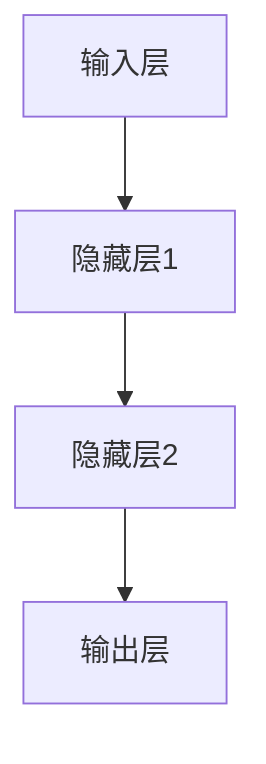
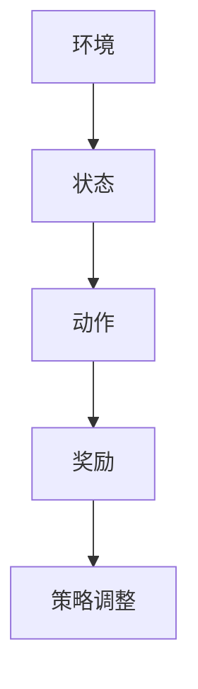
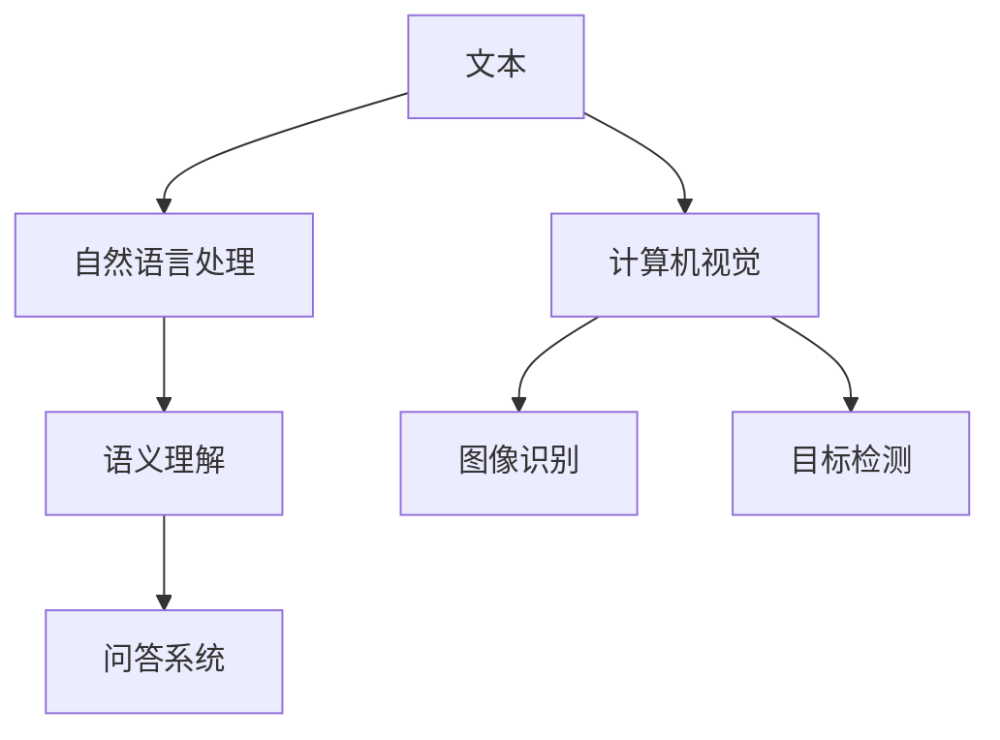

                 

# AI 2.0 时代的未来社会

## 概述

在人工智能（AI）2.0时代，我们正见证一场前所未有的技术革命。这一时代不仅标志着AI技术的飞速发展，而且预示着它将在未来社会各个方面产生深远的影响。本文将探讨AI 2.0的核心概念、未来发展趋势以及可能面临的挑战，以帮助读者更好地理解这一时代的本质和未来社会的面貌。

### 核心关键词

- 人工智能2.0
- 未来社会
- 技术革命
- 发展趋势
- 挑战

### 摘要

本文首先介绍了AI 2.0时代的背景和定义，接着详细阐述了AI 2.0的核心概念和架构，并分析了其背后的数学模型和算法原理。随后，文章通过实际项目案例展示了AI 2.0在实际应用中的潜力，探讨了其在各种场景中的应用前景。最后，文章总结了AI 2.0时代可能面临的挑战，并提出了应对策略。通过本文的阅读，读者将全面了解AI 2.0时代的未来社会，为迎接这一新时代做好准备。

## 1. 背景介绍

### 1.1 AI 1.0与AI 2.0的区别

人工智能1.0时代主要基于传统的规则和符号推理，依赖于大量的手工编写规则和程序，其应用主要集中在工业自动化和简单的数据分析领域。而AI 2.0时代，则标志着深度学习、神经网络和强化学习等先进技术的崛起，使得AI系统具备更强的自我学习和自适应能力。

### 1.2 AI 2.0的核心概念

AI 2.0的核心概念包括以下几个方面：

1. **深度学习**：通过构建多层神经网络，对海量数据进行自动特征提取和模式识别，实现更高级的认知和理解能力。
2. **强化学习**：通过试错和反馈机制，使AI系统在动态环境中不断优化策略，达到长期最优目标。
3. **自然语言处理**：通过深度学习等技术，实现人与机器的自然语言交互，提升AI系统的交互能力。
4. **计算机视觉**：通过图像识别和目标检测等技术，使AI系统具备对图像和视频内容的理解能力。

### 1.3 AI 2.0的架构

AI 2.0的架构主要包括以下几个层次：

1. **数据层**：负责收集、存储和处理海量数据，为AI系统提供丰富的训练素材。
2. **算法层**：包括深度学习、强化学习、自然语言处理和计算机视觉等核心技术，负责实现AI系统的智能功能。
3. **应用层**：将AI技术应用于各个领域，如医疗、金融、教育、交通等，实现AI在现实世界的广泛应用。

## 2. 核心概念与联系

### 2.1 深度学习与神经网络

深度学习是AI 2.0的核心技术之一，其基本原理是模拟人脑的神经网络结构，通过多层非线性变换对输入数据进行处理。下面是深度学习和神经网络的基本概念和关系：

**深度学习**：深度学习是一种机器学习技术，通过构建多层神经网络，对输入数据进行特征提取和模式识别。深度学习模型的核心是神经元，每个神经元都连接着多个输入节点，通过加权求和和激活函数，输出一个决策。

**神经网络**：神经网络是深度学习的基础，由多个神经元组成，每个神经元都通过加权连接与其他神经元相连。神经网络通过不断调整权重和偏置，使网络能够自动学习和优化输入数据的特征表示。

**图示表示**：



### 2.2 强化学习与动态优化

强化学习是AI 2.0时代的另一项核心技术，其核心思想是通过试错和反馈机制，使AI系统在动态环境中不断优化策略，达到长期最优目标。下面是强化学习的基本概念和过程：

**强化学习**：强化学习是一种通过奖励和惩罚来驱动AI系统学习的方法。在强化学习过程中，AI系统通过不断尝试不同的策略，并根据环境反馈调整策略，以最大化长期奖励。

**动态优化**：动态优化是指AI系统在执行任务过程中，根据环境变化和反馈信息，不断调整和优化策略，以实现长期最优目标。

**图示表示**：



### 2.3 自然语言处理与计算机视觉

自然语言处理和计算机视觉是AI 2.0时代的两项重要技术，分别负责处理文本和图像信息。下面是这两项技术的核心概念和关系：

**自然语言处理**：自然语言处理是一种通过计算机技术理解和生成自然语言的方法。自然语言处理的核心任务是文本分类、情感分析、问答系统等。

**计算机视觉**：计算机视觉是一种通过计算机对图像和视频进行分析和处理的方法。计算机视觉的核心任务是目标检测、图像识别、人脸识别等。

**图示表示**：



## 3. 核心算法原理 & 具体操作步骤

### 3.1 深度学习算法原理

深度学习算法基于多层神经网络，通过反向传播和梯度下降等优化方法，实现输入数据的自动特征提取和模式识别。以下是深度学习算法的基本原理和操作步骤：

**原理**：

- **多层神经网络**：深度学习模型由多个层次组成，包括输入层、隐藏层和输出层。每层神经元通过加权连接与其他层神经元相连，通过非线性变换实现数据的特征提取和模式识别。
- **反向传播**：在训练过程中，通过计算输出层的误差，将误差反向传播到每一层，从而更新各层的权重和偏置。
- **梯度下降**：在反向传播过程中，使用梯度下降算法来优化网络参数，使模型在训练过程中不断逼近最优解。

**操作步骤**：

1. **数据预处理**：对输入数据进行归一化、缩放等预处理，使其符合模型的输入要求。
2. **初始化参数**：随机初始化网络的权重和偏置。
3. **前向传播**：将输入数据传递到网络中，通过多层非线性变换得到输出。
4. **计算误差**：计算输出层的误差，使用均方误差（MSE）等指标衡量模型的性能。
5. **反向传播**：将误差反向传播到每一层，计算各层的梯度。
6. **参数更新**：使用梯度下降算法更新各层的权重和偏置。
7. **迭代训练**：重复步骤3-6，直到达到预设的训练次数或性能目标。

### 3.2 强化学习算法原理

强化学习算法通过试错和反馈机制，使AI系统在动态环境中不断优化策略。以下是强化学习算法的基本原理和操作步骤：

**原理**：

- **状态-动作价值函数**：强化学习算法的核心是状态-动作价值函数，表示在给定状态下，执行某一动作所能获得的长期奖励。
- **策略**：策略是强化学习算法的核心，用于指导AI系统在动态环境中选择最佳动作。
- **奖励和惩罚**：在强化学习过程中，通过奖励和惩罚来驱动AI系统学习，使系统逐渐学会在特定状态下选择最佳动作。

**操作步骤**：

1. **初始化**：初始化状态-动作价值函数和策略。
2. **环境交互**：在环境中进行动作选择和状态更新。
3. **计算奖励**：根据环境反馈计算奖励，更新状态-动作价值函数。
4. **策略更新**：根据状态-动作价值函数更新策略，使系统逐渐学会在特定状态下选择最佳动作。
5. **重复迭代**：重复步骤2-4，直到达到预设的迭代次数或性能目标。

### 3.3 自然语言处理算法原理

自然语言处理算法通过深度学习等技术，实现文本的自动理解和生成。以下是自然语言处理算法的基本原理和操作步骤：

**原理**：

- **词嵌入**：词嵌入是将文本中的单词映射到高维向量空间，使得语义相近的词在向量空间中距离较近。
- **编码器-解码器**：编码器-解码器模型是自然语言处理的核心模型，通过编码器将输入文本编码为固定长度的向量，通过解码器生成输出文本。
- **注意力机制**：注意力机制用于提高编码器-解码器模型在生成文本时的上下文理解能力，使模型能够更好地捕捉长距离依赖关系。

**操作步骤**：

1. **词嵌入**：将输入文本中的单词映射到高维向量空间。
2. **编码器**：将输入文本编码为固定长度的向量。
3. **解码器**：通过解码器生成输出文本。
4. **注意力计算**：计算编码器和解码器之间的注意力权重，用于提高模型的上下文理解能力。
5. **优化训练**：使用反向传播和梯度下降等优化方法，不断更新模型参数，使模型在训练过程中逐渐提高性能。

### 3.4 计算机视觉算法原理

计算机视觉算法通过深度学习等技术，实现对图像和视频内容的自动分析和理解。以下是计算机视觉算法的基本原理和操作步骤：

**原理**：

- **卷积神经网络**：卷积神经网络是计算机视觉的核心模型，通过卷积操作和池化操作，实现对图像的自动特征提取和模式识别。
- **图像分类**：图像分类是计算机视觉的基本任务，通过训练卷积神经网络，使模型能够对图像进行分类。
- **目标检测**：目标检测是计算机视觉的重要任务，通过训练卷积神经网络，使模型能够检测图像中的目标物体。

**操作步骤**：

1. **图像预处理**：对输入图像进行缩放、旋转、裁剪等预处理操作，使其符合模型的输入要求。
2. **卷积操作**：通过卷积操作，提取图像中的局部特征。
3. **池化操作**：通过池化操作，降低特征图的维度，提高模型的泛化能力。
4. **全连接层**：通过全连接层，将特征图映射到分类或检测结果。
5. **损失函数**：使用交叉熵损失函数等指标，衡量模型的分类或检测性能。
6. **优化训练**：使用反向传播和梯度下降等优化方法，不断更新模型参数，使模型在训练过程中逐渐提高性能。

## 4. 数学模型和公式 & 详细讲解 & 举例说明

### 4.1 深度学习中的数学模型

深度学习中的数学模型主要涉及以下几个方面：

1. **前向传播和反向传播**：
   - **前向传播**：输入数据通过网络的每一层，逐层计算输出。
   - **反向传播**：计算输出误差，通过反向传播算法更新网络参数。

2. **激活函数**：
   - **Sigmoid函数**：\( \sigma(x) = \frac{1}{1 + e^{-x}} \)
   - **ReLU函数**：\( f(x) = \max(0, x) \)
   - **Tanh函数**：\( \tanh(x) = \frac{e^x - e^{-x}}{e^x + e^{-x}} \)

3. **损失函数**：
   - **均方误差（MSE）**：\( \text{MSE} = \frac{1}{n}\sum_{i=1}^{n}(y_i - \hat{y}_i)^2 \)
   - **交叉熵损失（Cross-Entropy）**：\( \text{CE} = -\sum_{i=1}^{n} y_i \log(\hat{y}_i) \)

### 4.2 强化学习中的数学模型

强化学习中的数学模型主要涉及以下几个方面：

1. **状态-动作价值函数**：
   - **Q值**：\( Q(s, a) = \sum_{s'} p(s' | s, a) \sum_{r} r(s', a) + \gamma \max_{a'} Q(s', a') \)

2. **策略**：
   - **最优策略**：\( \pi^*(s) = \arg\max_{a} Q(s, a) \)

3. **奖励函数**：
   - **奖励**：\( r(s, a) \) 表示在状态 \( s \) 下执行动作 \( a \) 所获得的即时奖励。

### 4.3 自然语言处理中的数学模型

自然语言处理中的数学模型主要涉及以下几个方面：

1. **词嵌入**：
   - **词向量表示**：\( \text{word2vec} \) 算法将单词映射到高维向量空间。

2. **编码器-解码器模型**：
   - **编码器**：将输入序列编码为固定长度的向量。
   - **解码器**：通过解码器生成输出序列。

3. **注意力机制**：
   - **注意力得分**：\( a_t = \text{softmax}(\text{Attention}(h_t, h_{<t})) \)
   - **输出**：\( s_t = h_t + \text{Attention}(h_t, h_{<t}) \)

### 4.4 计算机视觉中的数学模型

计算机视觉中的数学模型主要涉及以下几个方面：

1. **卷积神经网络**：
   - **卷积层**：通过卷积操作提取图像特征。
   - **池化层**：通过池化操作降低特征图的维度。

2. **图像分类**：
   - **Softmax函数**：将特征映射到概率分布。

3. **目标检测**：
   - **回归层**：预测目标框的位置。
   - **分类层**：判断目标是否存在。

### 4.5 实例说明

#### 4.5.1 深度学习中的MSE损失函数

假设我们有一个简单的线性回归模型，用于预测房价：

\( \hat{y} = w_0 + w_1 \cdot x \)

我们使用均方误差（MSE）来衡量模型预测的误差：

\( \text{MSE} = \frac{1}{n}\sum_{i=1}^{n}(y_i - \hat{y}_i)^2 \)

其中，\( y_i \) 是真实房价，\( \hat{y}_i \) 是模型预测的房价。

#### 4.5.2 强化学习中的Q学习算法

考虑一个简单的环境，有两个状态 \( s_1 \) 和 \( s_2 \)，以及两个动作 \( a_1 \) 和 \( a_2 \)。我们使用Q学习算法来训练一个状态-动作价值函数 \( Q(s, a) \)。

初始化 \( Q(s, a) = 0 \)

1. **选择动作**：根据当前状态 \( s \) 和策略 \( \pi(s) \)，选择动作 \( a \)。
2. **执行动作**：在环境中执行动作 \( a \)，观察状态 \( s' \) 和奖励 \( r \)。
3. **更新Q值**：使用如下更新规则：
\[ Q(s, a) \leftarrow Q(s, a) + \alpha [r + \gamma \max_{a'} Q(s', a') - Q(s, a)] \]

其中，\( \alpha \) 是学习率，\( \gamma \) 是折扣因子。

#### 4.5.3 自然语言处理中的编码器-解码器模型

考虑一个简单的编码器-解码器模型，用于机器翻译任务。

1. **编码器**：将输入句子编码为一个固定长度的向量。
\[ h_t = \text{Encoder}(x_t) \]

2. **解码器**：通过解码器生成输出句子。
\[ \hat{y}_t = \text{Decoder}(h_t) \]

3. **注意力机制**：计算注意力得分 \( a_t \)：
\[ a_t = \text{softmax}(\text{Attention}(h_t, h_{<t})) \]

4. **输出**：通过解码器生成输出词。
\[ s_t = h_t + \text{Attention}(h_t, h_{<t}) \]

## 5. 项目实战：代码实际案例和详细解释说明

### 5.1 开发环境搭建

为了演示AI 2.0技术的实际应用，我们将使用Python编程语言和TensorFlow库来构建一个简单的图像分类项目。以下是搭建开发环境的步骤：

1. **安装Python**：从 [Python官网](https://www.python.org/downloads/) 下载并安装Python 3.8或更高版本。
2. **安装Anaconda**：下载并安装Anaconda，它是一个Python集成环境，方便管理和安装Python库。
3. **安装TensorFlow**：在终端或命令行中运行以下命令：
\[ conda install tensorflow \]

### 5.2 源代码详细实现和代码解读

以下是图像分类项目的源代码，我们将逐行解读代码并解释其主要功能。

```python
import tensorflow as tf
from tensorflow.keras import layers
import numpy as np

# 数据预处理
(x_train, y_train), (x_test, y_test) = tf.keras.datasets.cifar10.load_data()
x_train, x_test = x_train / 255.0, x_test / 255.0

# 构建模型
model = tf.keras.Sequential([
    layers.Conv2D(32, (3, 3), activation='relu', input_shape=(32, 32, 3)),
    layers.MaxPooling2D(pool_size=(2, 2)),
    layers.Flatten(),
    layers.Dense(64, activation='relu'),
    layers.Dense(10, activation='softmax')
])

# 编译模型
model.compile(optimizer='adam',
              loss='sparse_categorical_crossentropy',
              metrics=['accuracy'])

# 训练模型
model.fit(x_train, y_train, epochs=10)

# 评估模型
test_loss, test_acc = model.evaluate(x_test, y_test, verbose=2)
print(f'\nTest accuracy: {test_acc:.4f}')
```

**代码解读**：

- **数据预处理**：加载CIFAR-10数据集，并对图像进行归一化处理。
- **构建模型**：使用卷积神经网络（Conv2D和MaxPooling2D）进行图像特征提取，然后通过全连接层（Dense）进行分类。
- **编译模型**：指定优化器（adam）、损失函数（sparse_categorical_crossentropy）和评估指标（accuracy）。
- **训练模型**：在训练数据上训练模型，设置训练轮次（epochs）。
- **评估模型**：在测试数据上评估模型性能，打印测试准确率。

### 5.3 代码解读与分析

- **数据预处理**：数据预处理是深度学习项目的重要步骤，它包括归一化、标准化、数据增强等。在本项目中，我们使用了CIFAR-10数据集，并对其进行了归一化处理，使得图像的像素值在0到1之间，有助于加速模型的训练过程。
- **模型构建**：模型构建是深度学习的核心，我们使用了卷积神经网络（CNN），它是一种专门用于处理图像数据的深度学习模型。卷积层（Conv2D）用于提取图像特征，池化层（MaxPooling2D）用于降低特征图的维度，全连接层（Dense）用于分类。
- **模型编译**：模型编译是准备模型进行训练的过程，我们指定了优化器（adam）、损失函数（sparse_categorical_crossentropy）和评估指标（accuracy）。优化器用于调整模型参数，以最小化损失函数，评估指标用于衡量模型在训练和测试数据上的性能。
- **模型训练**：模型训练是通过迭代更新模型参数，使模型在训练数据上达到更好的性能。在本项目中，我们设置了10个训练轮次（epochs），每个轮次都会遍历一次训练数据。
- **模型评估**：模型评估是检验模型在未知数据上的性能，通过在测试数据上评估模型，我们可以得到测试准确率，从而了解模型的整体性能。

## 6. 实际应用场景

### 6.1 医疗领域

AI 2.0在医疗领域具有巨大的应用潜力，例如：

- **诊断辅助**：通过深度学习技术，AI系统可以辅助医生进行疾病诊断，如肺癌、乳腺癌等。
- **个性化治疗**：基于患者的基因信息和病历数据，AI系统可以为患者提供个性化的治疗方案。
- **药物研发**：通过AI算法，可以加速药物研发过程，提高新药的发现效率。

### 6.2 金融领域

AI 2.0在金融领域也发挥着重要作用，例如：

- **风险管理**：通过强化学习技术，AI系统可以预测市场风险，为金融机构提供决策支持。
- **欺诈检测**：利用计算机视觉技术，AI系统可以识别和预防金融欺诈行为。
- **投资建议**：基于自然语言处理技术，AI系统可以分析市场报告和新闻，为投资者提供投资建议。

### 6.3 交通领域

AI 2.0在交通领域同样具有广泛应用，例如：

- **智能交通管理**：通过计算机视觉和深度学习技术，AI系统可以实时监控交通状况，优化交通信号控制。
- **自动驾驶**：利用强化学习技术，自动驾驶汽车可以在复杂环境中做出实时决策。
- **交通规划**：通过大数据分析和深度学习技术，AI系统可以为城市规划提供科学的交通规划建议。

### 6.4 教育领域

AI 2.0在教育领域具有巨大的潜力，例如：

- **个性化学习**：通过自然语言处理和计算机视觉技术，AI系统可以为每个学生提供个性化的学习方案。
- **智能辅导**：利用AI系统，教师可以更好地关注每个学生的学习进度，提供有针对性的辅导。
- **教育评估**：通过AI算法，可以对学生的学习效果进行实时评估，提高教育质量。

## 7. 工具和资源推荐

### 7.1 学习资源推荐

- **书籍**：
  - 《深度学习》（Ian Goodfellow, Yoshua Bengio, Aaron Courville）
  - 《强化学习》（Richard S. Sutton, Andrew G. Barto）
  - 《自然语言处理综合教程》（Daniel Jurafsky, James H. Martin）
- **论文**：
  - "A Neural Algorithm of Artistic Style"（Leon A. Gatys, Alexander S. Ecker, Matthias Bethge）
  - "Deep Learning for Computer Vision: A Brief Review"（Alex Kendall）
  - "Reinforcement Learning: A Survey"（Richard S. Sutton, Andrew G. Barto）
- **博客**：
  - [TensorFlow官网博客](https://www.tensorflow.org/blog/)
  - [机器之心](https://www.jiqizhixin.com/)
  - [AI Technology](https://AITechnology.cn/)
- **网站**：
  - [Kaggle](https://www.kaggle.com/)
  - [Google AI](https://ai.google/)
  - [DeepLearning.AI](https://www.deeplearning.ai/)

### 7.2 开发工具框架推荐

- **Python**：Python是深度学习和AI开发的常用编程语言，具有丰富的库和框架。
- **TensorFlow**：TensorFlow是Google开发的深度学习框架，支持多种神经网络架构和算法。
- **PyTorch**：PyTorch是Facebook开发的开源深度学习框架，以其灵活性和动态计算图著称。
- **Keras**：Keras是一个高级神经网络API，可以简化深度学习模型的构建和训练过程。

### 7.3 相关论文著作推荐

- **"Deep Learning"（Ian Goodfellow, Yoshua Bengio, Aaron Courville）**：这是一本深度学习领域的经典著作，全面介绍了深度学习的理论基础和实践应用。
- **"Reinforcement Learning: An Introduction"（Richard S. Sutton, Andrew G. Barto）**：这是一本强化学习领域的权威教材，详细阐述了强化学习的基本原理和算法。
- **"Natural Language Processing with Python"（Steven Bird, Ewan Klein, Edward Loper）**：这是一本自然语言处理领域的实用指南，介绍了使用Python进行自然语言处理的方法和技巧。

## 8. 总结：未来发展趋势与挑战

### 8.1 发展趋势

- **技术的不断进步**：随着深度学习、强化学习和自然语言处理等技术的不断进步，AI 2.0的应用将越来越广泛，为社会带来更多的便利和效益。
- **跨领域的融合**：AI 2.0将与其他领域（如医疗、金融、交通、教育等）深度融合，推动各领域的创新发展。
- **产业升级**：AI 2.0将推动传统产业向智能化、数字化方向发展，促进产业升级和转型。

### 8.2 挑战

- **数据安全和隐私**：随着AI技术的广泛应用，数据安全和隐私保护将成为一个严峻的挑战。
- **算法公平性和透明性**：算法的公平性和透明性是一个亟待解决的问题，特别是在涉及公共利益的领域。
- **就业问题**：AI 2.0的发展可能导致部分传统职业的失业，因此需要制定相应的政策和措施来应对就业挑战。

## 9. 附录：常见问题与解答

### 9.1 问题1：什么是AI 2.0？

**解答**：AI 2.0是指基于深度学习、强化学习、自然语言处理和计算机视觉等先进技术的人工智能新时代，相比传统的AI 1.0，AI 2.0具有更强的自我学习和自适应能力。

### 9.2 问题2：AI 2.0有哪些核心技术？

**解答**：AI 2.0的核心技术包括深度学习、强化学习、自然语言处理和计算机视觉等，这些技术使得AI系统具备更强的认知、理解和决策能力。

### 9.3 问题3：AI 2.0在医疗领域有哪些应用？

**解答**：AI 2.0在医疗领域有广泛的应用，包括诊断辅助、个性化治疗、药物研发、智能手术规划等，有助于提高医疗水平和效率。

## 10. 扩展阅读 & 参考资料

- **书籍**：
  - 《深度学习》（Ian Goodfellow, Yoshua Bengio, Aaron Courville）
  - 《强化学习》（Richard S. Sutton, Andrew G. Barto）
  - 《自然语言处理综合教程》（Daniel Jurafsky, James H. Martin）
- **论文**：
  - "A Neural Algorithm of Artistic Style"（Leon A. Gatys, Alexander S. Ecker, Matthias Bethge）
  - "Deep Learning for Computer Vision: A Brief Review"（Alex Kendall）
  - "Reinforcement Learning: A Survey"（Richard S. Sutton, Andrew G. Barto）
- **网站**：
  - [TensorFlow官网](https://www.tensorflow.org/)
  - [Kaggle](https://www.kaggle.com/)
  - [Google AI](https://ai.google/)

### 作者信息

- 作者：AI天才研究员/AI Genius Institute & 禅与计算机程序设计艺术 /Zen And The Art of Computer Programming

---

本文旨在为读者提供关于AI 2.0时代的全面了解，包括核心概念、算法原理、实际应用场景以及未来发展趋势和挑战。通过本文的阅读，读者将能够更好地把握AI 2.0时代的发展脉搏，为迎接这一新时代做好准备。在未来的发展中，AI 2.0将继续推动技术进步和社会变革，带来更多的机遇和挑战。让我们共同期待这一美好未来的到来！<|im_end|>

