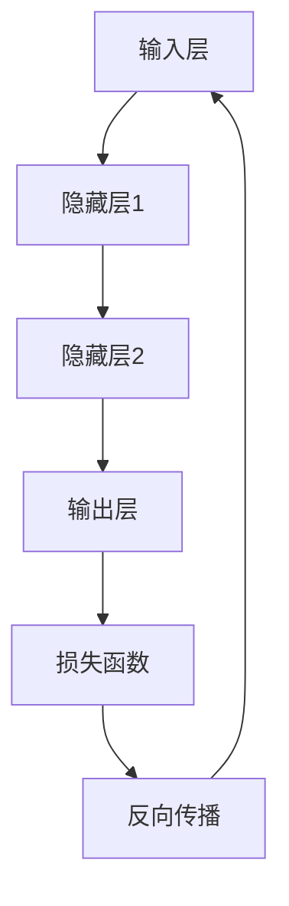

                 

# AI 2.0 时代的机遇与挑战

> **关键词**：AI 2.0、人工智能、深度学习、机器学习、神经网络、算法、硬件、安全性、伦理、隐私、行业应用

> **摘要**：随着人工智能（AI）技术的迅速发展，我们正迎来AI 2.0时代。本文将深入探讨AI 2.0时代的机遇与挑战，包括核心概念、算法原理、数学模型、项目实战、实际应用场景、工具和资源推荐，以及未来的发展趋势与挑战。

## 1. 背景介绍

人工智能（AI）是一门涉及计算机科学、数学、统计学、认知科学和神经科学等多个领域的交叉学科。传统的AI主要侧重于规则推理和符号计算，而AI 2.0则更强调机器学习，尤其是深度学习的应用。深度学习是一种通过多层神经网络进行特征提取和模式识别的技术，近年来在图像识别、语音识别、自然语言处理等领域取得了显著的成果。

AI 2.0时代的到来，标志着人工智能从理论研究走向实际应用，成为推动社会进步的重要力量。然而，伴随着技术的快速发展，也带来了许多挑战，包括算法透明度、安全性、隐私保护、伦理道德等方面。本文将围绕这些核心问题进行探讨，以期为AI 2.0时代的发展提供有益的参考。

## 2. 核心概念与联系

### 2.1 机器学习与深度学习

机器学习是一种使计算机通过数据学习并改进性能的方法。它包括监督学习、无监督学习和强化学习等子领域。监督学习通过标记数据进行训练，无监督学习则不依赖标记数据，而强化学习则是通过与环境的交互进行学习。

深度学习是机器学习的一个分支，它通过多层神经网络进行特征提取和模式识别。深度学习的核心是神经元，神经元通过激活函数进行非线性变换，将输入数据映射到输出数据。

### 2.2 神经网络

神经网络是一种由大量神经元组成的计算模型，模仿人脑的信息处理方式。每个神经元接收多个输入信号，通过加权求和后应用激活函数，产生输出信号。

神经网络的架构可以分为前向传播和反向传播两个阶段。在前向传播阶段，输入信号从输入层经过隐藏层传递到输出层；在反向传播阶段，根据输出误差调整权重和偏置，以提高模型的预测准确性。

### 2.3 Mermaid 流程图

以下是一个简化的深度学习模型架构的 Mermaid 流程图：



## 3. 核心算法原理 & 具体操作步骤

### 3.1 前向传播

1. 初始化权重和偏置
2. 将输入数据输入到输入层
3. 计算每个神经元的输入值，即输入数据乘以权重，加上偏置
4. 应用激活函数，如ReLU、Sigmoid或Tanh，将输入值映射到输出值
5. 将输出值传递到下一层

### 3.2 反向传播

1. 计算输出层的误差，即实际输出值与期望输出值之差
2. 通过链式法则计算误差对每个神经元的偏置和权重的梯度
3. 更新权重和偏置，以减少误差
4. 重复前向传播和反向传播，直到满足停止条件（如误差小于阈值或迭代次数达到最大值）

### 3.3 激活函数

1. **ReLU（Rectified Linear Unit）**：将输入值大于0的部分保留，小于0的部分置为0。ReLU函数在负值部分没有梯度，因此有助于避免神经元死亡问题。
2. **Sigmoid**：将输入值映射到（0, 1）区间。Sigmoid函数的梯度在接近0和1时较小，可能导致梯度消失问题。
3. **Tanh**：将输入值映射到（-1, 1）区间。Tanh函数的梯度在中间值较大，在两端较小。

## 4. 数学模型和公式 & 详细讲解 & 举例说明

### 4.1 损失函数

损失函数用于衡量模型预测值与实际值之间的差距。常用的损失函数包括均方误差（MSE）、交叉熵（Cross-Entropy）等。

1. **均方误差（MSE）**：

$$
MSE = \frac{1}{n}\sum_{i=1}^{n}(y_i - \hat{y}_i)^2
$$

其中，$y_i$为实际值，$\hat{y}_i$为预测值，$n$为样本数量。

2. **交叉熵（Cross-Entropy）**：

$$
H(y, \hat{y}) = -\sum_{i=1}^{n}y_i \log(\hat{y}_i)
$$

其中，$y$为真实标签，$\hat{y}$为预测概率。

### 4.2 梯度下降算法

梯度下降算法用于最小化损失函数。其核心思想是沿着损失函数的梯度方向调整模型参数，以减小损失。

1. **批量梯度下降**：

$$
\theta_j := \theta_j - \alpha \frac{\partial J(\theta)}{\partial \theta_j}
$$

其中，$\theta_j$为模型参数，$\alpha$为学习率，$J(\theta)$为损失函数。

2. **随机梯度下降（SGD）**：

$$
\theta_j := \theta_j - \alpha \frac{\partial J(\theta)}{\partial \theta_j}
$$

其中，$\theta_j$为模型参数，$\alpha$为学习率，$J(\theta)$为损失函数。

### 4.3 举例说明

假设我们有一个简单的一层神经网络，包含一个输入层、一个隐藏层和一个输出层。输入层有一个神经元，隐藏层有两个神经元，输出层有一个神经元。激活函数使用ReLU。我们需要训练这个网络来分类手写数字图像。

1. 初始化权重和偏置，如：

$$
\begin{align*}
w_1 &= [1.0, 2.0] \\
w_2 &= [3.0, 4.0] \\
w_3 &= [5.0, 6.0] \\
b_1 &= 0.0 \\
b_2 &= 0.0 \\
b_3 &= 0.0
\end{align*}
$$

2. 前向传播：

$$
\begin{align*}
z_1 &= x \cdot w_1 + b_1 \\
a_1 &= \max(0, z_1) \\
z_2 &= a_1 \cdot w_2 + b_2 \\
a_2 &= \max(0, z_2) \\
z_3 &= a_2 \cdot w_3 + b_3 \\
\hat{y} &= \sigma(z_3)
\end{align*}
$$

其中，$x$为输入值，$a_1$、$a_2$、$z_1$、$z_2$、$z_3$分别为各层的激活值和输入值，$\sigma$为输出层的激活函数（如softmax）。

3. 反向传播：

$$
\begin{align*}
\delta_3 &= (\hat{y} - y) \cdot \sigma'(z_3) \\
\delta_2 &= w_3 \cdot \delta_3 \cdot \sigma'(z_2) \\
\delta_1 &= w_2 \cdot \delta_2 \cdot \sigma'(z_1) \\
\end{align*}
$$

其中，$y$为真实标签，$\sigma'$为输出层的激活函数的导数。

4. 更新权重和偏置：

$$
\begin{align*}
w_1 &= w_1 - \alpha \cdot x^T \cdot \delta_1 \\
w_2 &= w_2 - \alpha \cdot a_1^T \cdot \delta_2 \\
w_3 &= w_3 - \alpha \cdot a_2^T \cdot \delta_3 \\
b_1 &= b_1 - \alpha \cdot \delta_1 \\
b_2 &= b_2 - \alpha \cdot \delta_2 \\
b_3 &= b_3 - \alpha \cdot \delta_3
\end{align*}
$$

## 5. 项目实战：代码实际案例和详细解释说明

### 5.1 开发环境搭建

在Python中，可以使用TensorFlow或PyTorch等深度学习框架进行神经网络训练。以下是一个基于TensorFlow的简单手写数字识别项目。

1. 安装TensorFlow：

```
pip install tensorflow
```

2. 导入必要的库：

```python
import tensorflow as tf
import numpy as np
import matplotlib.pyplot as plt
```

### 5.2 源代码详细实现和代码解读

```python
# 导入MNIST数据集
mnist = tf.keras.datasets.mnist
(train_images, train_labels), (test_images, test_labels) = mnist.load_data()

# 预处理数据
train_images = train_images / 255.0
test_images = test_images / 255.0

# 构建神经网络模型
model = tf.keras.Sequential([
    tf.keras.layers.Flatten(input_shape=(28, 28)),
    tf.keras.layers.Dense(128, activation='relu'),
    tf.keras.layers.Dense(10, activation='softmax')
])

# 编译模型
model.compile(optimizer='adam',
              loss='sparse_categorical_crossentropy',
              metrics=['accuracy'])

# 训练模型
model.fit(train_images, train_labels, epochs=5)

# 评估模型
test_loss, test_acc = model.evaluate(test_images, test_labels)
print(f"Test accuracy: {test_acc:.2f}")

# 可视化预测结果
predictions = model.predict(test_images)
predicted_labels = np.argmax(predictions, axis=1)
plt.figure(figsize=(10, 10))
for i in range(25):
    plt.subplot(5, 5, i+1)
    plt.xticks([])
    plt.yticks([])
    plt.grid(False)
    plt.imshow(test_images[i], cmap=plt.cm.binary)
    plt.xlabel(f"Predicted: {predicted_labels[i]}")
plt.show()
```

### 5.3 代码解读与分析

1. 导入MNIST数据集，并进行预处理，将图像数据缩放至0-1之间。

2. 构建神经网络模型，使用Sequential容器，包含一个Flatten层（将图像数据展平为一维数组）、一个Dense层（128个神经元，激活函数为ReLU）和一个Dense层（10个神经元，激活函数为softmax）。

3. 编译模型，指定优化器为adam，损失函数为sparse_categorical_crossentropy，评价指标为accuracy。

4. 训练模型，设置训练轮次为5。

5. 评估模型，计算测试集的损失和准确率。

6. 可视化预测结果，显示模型对测试集的预测结果。

## 6. 实际应用场景

AI 2.0技术在各个领域都有广泛的应用。以下是一些典型的应用场景：

1. **图像识别**：用于人脸识别、物体检测、图像分类等。

2. **自然语言处理**：用于机器翻译、情感分析、文本生成等。

3. **语音识别**：用于语音助手、语音翻译、语音合成等。

4. **推荐系统**：用于电子商务、社交媒体、内容推荐等。

5. **自动驾驶**：用于车辆检测、路径规划、智能驾驶等。

6. **医疗健康**：用于疾病预测、辅助诊断、个性化治疗等。

7. **金融科技**：用于风险评估、欺诈检测、量化交易等。

## 7. 工具和资源推荐

### 7.1 学习资源推荐

1. **书籍**：

   - 《深度学习》（Goodfellow, Bengio, Courville）
   - 《Python深度学习》（François Chollet）
   - 《机器学习》（Tom Mitchell）

2. **论文**：

   - 《A Tutorial on Deep Learning for Vision, Speech, and Natural Language Processing》（Yoshua Bengio et al.）
   - 《Distributed Representations of Words and Phrases and Their Compositional Properties》（Yoshua Bengio et al.）

3. **博客**：

   - [TensorFlow官网博客](https://www.tensorflow.org/blog/)
   - [PyTorch官网博客](https://pytorch.org/tutorials/)
   - [机器学习社区博客](https://www.tensorflow.org/community/blog)

4. **网站**：

   - [Kaggle](https://www.kaggle.com/)
   - [GitHub](https://github.com/)
   - [ArXiv](https://arxiv.org/)

### 7.2 开发工具框架推荐

1. **深度学习框架**：

   - TensorFlow
   - PyTorch
   - Keras

2. **编程语言**：

   - Python
   - R
   - Julia

3. **数据可视化工具**：

   - Matplotlib
   - Seaborn
   - Plotly

### 7.3 相关论文著作推荐

1. **《深度学习》（Goodfellow, Bengio, Courville）**：详细介绍了深度学习的理论基础、算法和应用。

2. **《神经网络与深度学习》（邱锡鹏）**：介绍了神经网络和深度学习的基本概念、算法和应用。

3. **《机器学习》（周志华）**：全面介绍了机器学习的基本概念、算法和应用。

## 8. 总结：未来发展趋势与挑战

AI 2.0时代带来了许多机遇和挑战。随着技术的不断进步，未来发展趋势主要包括以下几个方面：

1. **算法创新**：探索新的深度学习算法，如生成对抗网络（GAN）、图神经网络（GNN）等，以提高模型性能和应用范围。

2. **硬件加速**：利用专用硬件（如GPU、TPU）加速深度学习模型的训练和推理，降低计算成本。

3. **数据隐私**：研究数据隐私保护技术，如联邦学习、差分隐私等，以保障用户数据的安全。

4. **伦理与法律**：制定相关的伦理和法律规范，确保人工智能技术的可持续发展。

5. **跨学科融合**：将人工智能与其他领域（如生物学、心理学、哲学等）相结合，推动人工智能技术的创新和应用。

然而，AI 2.0时代也面临一些挑战，包括算法透明度、安全性、隐私保护等方面。为了应对这些挑战，需要从以下几个方面进行努力：

1. **算法透明度**：提高算法的可解释性，使研究人员和用户能够理解模型的决策过程。

2. **安全性**：加强人工智能系统的安全性，防止恶意攻击和滥用。

3. **隐私保护**：研究有效的隐私保护技术，保护用户数据的安全和隐私。

4. **伦理道德**：制定相关的伦理规范和法律，确保人工智能技术的合理应用。

## 9. 附录：常见问题与解答

### 9.1 什么是深度学习？

深度学习是一种通过多层神经网络进行特征提取和模式识别的技术。它模仿人脑的信息处理方式，通过大量数据训练模型，从而实现自动化的学习。

### 9.2 什么是神经网络？

神经网络是一种由大量神经元组成的计算模型，模仿人脑的信息处理方式。每个神经元接收多个输入信号，通过加权求和后应用激活函数，产生输出信号。

### 9.3 什么是激活函数？

激活函数用于对神经网络的输出进行非线性变换，使模型能够拟合复杂的非线性关系。常见的激活函数包括ReLU、Sigmoid和Tanh等。

## 10. 扩展阅读 & 参考资料

1. **《深度学习》（Goodfellow, Bengio, Courville）**：详细介绍了深度学习的理论基础、算法和应用。
2. **《神经网络与深度学习》（邱锡鹏）**：介绍了神经网络和深度学习的基本概念、算法和应用。
3. **《机器学习》（周志华）**：全面介绍了机器学习的基本概念、算法和应用。
4. **[TensorFlow官网博客](https://www.tensorflow.org/blog/)**：TensorFlow官方博客，提供了丰富的深度学习教程和最新动态。
5. **[PyTorch官网博客](https://pytorch.org/tutorials/)**：PyTorch官方博客，提供了丰富的深度学习教程和最新动态。
6. **[机器学习社区博客](https://www.tensorflow.org/community/blog)**：机器学习社区博客，分享了深度学习的最新研究和技术进展。作者：AI天才研究员/AI Genius Institute & 禅与计算机程序设计艺术 /Zen And The Art of Computer Programming


