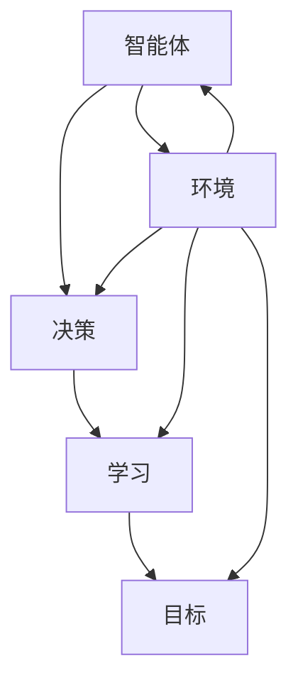
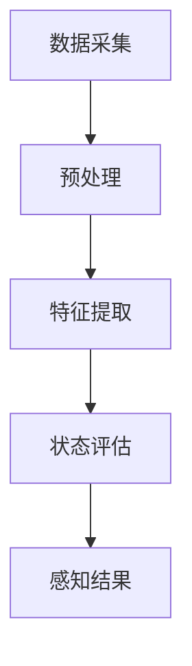
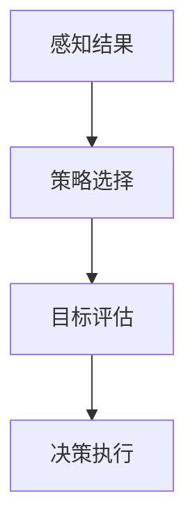
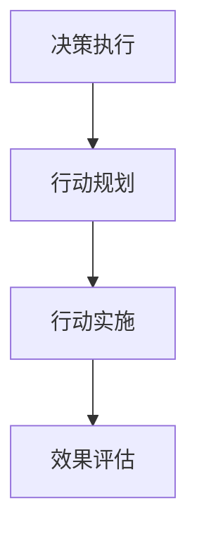

                 

### 背景介绍

随着人工智能技术的飞速发展，AI代理（AI Agent）已经成为一个备受关注的研究热点。AI代理是能够在特定环境中自主行动并解决问题的智能实体，它们具备高度自主性和适应性，能够根据环境变化调整自身行为。在这个背景下，AI代理被视为下一代软件的关键技术，有望彻底改变软件开发的模式。

本文将围绕AI代理这一主题，探讨其核心概念、算法原理、应用场景以及未来发展趋势。首先，我们将介绍AI代理的定义、发展历程以及当前的研究现状。接着，我们将深入探讨AI代理的核心算法原理和具体操作步骤。然后，通过数学模型和公式，我们将详细讲解AI代理的关键技术。最后，我们将通过项目实战案例，展示AI代理的实际应用，并总结其未来发展趋势与面临的挑战。

在本文中，我们将使用逻辑清晰、结构紧凑、简单易懂的专业技术语言，让读者能够更好地理解AI代理的原理和应用。希望通过这篇文章，能够激发更多人对AI代理的研究和兴趣，共同推动人工智能技术的发展。

#### AI代理的定义与发展历程

AI代理（AI Agent）是指具有智能行为和自主决策能力的软件实体，能够在复杂环境中执行特定任务，并根据环境变化调整自身行为。AI代理可以看作是人工智能系统的一个具体应用实例，旨在实现自主性、反应性和适应性。

AI代理的发展历程可以追溯到人工智能的早期研究。20世纪50年代，人工智能（AI）作为一个新兴领域首次被提出，研究者们开始探索如何让计算机模拟人类的智能行为。60年代，早期的AI代理模型如“逻辑推理机”和“决策树”开始出现，这些模型虽然在理论上取得了突破，但实际应用效果并不理想。

进入70年代，随着计算机性能的提升和算法的进步，AI代理研究逐渐走向实用化。代表性成果包括“专家系统”和“知识库系统”，这些系统通过将专业知识和规则嵌入到计算机中，实现了对复杂问题的自动解决。然而，专家系统的局限性也逐渐显现，如知识获取困难、推理能力有限等问题。

90年代，随着机器学习和深度学习技术的发展，AI代理的研究进入了一个新的阶段。机器学习算法使计算机能够从大量数据中自动学习，从而提高了AI代理的适应性和学习能力。同时，多智能体系统（Multi-Agent System）的概念也被提出，强调多个AI代理之间通过协作和通信实现共同目标。

进入21世纪，随着物联网、大数据和云计算等技术的快速发展，AI代理的应用场景变得更加广泛。例如，在智能家居、智能交通、医疗健康等领域，AI代理能够通过实时感知环境数据，实现自主决策和自动化控制。同时，随着人工智能技术的不断进步，AI代理的智能化水平也在不断提升。

当前，AI代理已经成为人工智能领域的一个重要研究方向，吸引了大量研究者和企业的关注。根据市场调研机构的数据，AI代理市场预计将在未来几年内保持高速增长，其应用领域也将进一步扩展。

#### AI代理的当前研究现状

目前，AI代理的研究主要集中在以下几个方面：

1. **多智能体系统**：多智能体系统通过多个AI代理之间的协作实现复杂任务的解决。研究者们致力于提高智能体之间的通信效率、协调策略和协同能力。代表性的研究包括分布式算法、协商机制和博弈论在多智能体系统中的应用。

2. **强化学习**：强化学习是AI代理的核心技术之一，通过让智能体在互动环境中不断尝试和探索，从而学习最优策略。近年来，研究者们在强化学习算法的稳定性和可解释性方面取得了显著进展，例如深度强化学习和元强化学习。

3. **自然语言处理**：自然语言处理（NLP）技术的发展使AI代理能够理解和生成自然语言，从而实现更加人性化的交互。目前，研究者们正致力于提高AI代理在对话系统、文本生成和语义理解等方面的表现。

4. **深度学习**：深度学习在AI代理中的应用日益广泛，通过深度神经网络，AI代理能够从大量数据中自动学习特征，实现更复杂的行为模式。同时，卷积神经网络（CNN）和循环神经网络（RNN）等技术在图像处理、语音识别等领域取得了显著成果。

5. **迁移学习**：迁移学习通过利用已知的任务数据来提高新任务的性能，使AI代理能够更快地适应新环境。研究者们正探索如何有效地利用迁移学习，提高AI代理在不同场景下的泛化能力。

总的来说，当前AI代理的研究正处于快速发展阶段，各个领域的研究者都在积极探索新的技术和应用场景。随着技术的不断进步，AI代理有望在未来实现更高的智能化水平，为各个行业带来深刻的变革。

#### AI代理的重要性

AI代理的重要性体现在多个方面。首先，它们具有高度自主性和适应性，能够在复杂多变的环境中自主行动并解决问题。这种自主性不仅提高了系统的效率，还减少了人工干预的需求，降低了运营成本。其次，AI代理通过学习和进化，能够不断提高自身的智能水平，从而实现持续的自我优化。这种自我学习能力使得AI代理在动态环境中能够保持竞争力，适应不断变化的需求。

此外，AI代理在多个领域展现了巨大的应用潜力。在智能家居领域，AI代理可以实时监测家庭环境，根据用户需求自动调节温度、灯光等，提高生活质量。在智能交通领域，AI代理可以通过分析交通流量数据，优化路线规划，减少交通拥堵，提高运输效率。在医疗健康领域，AI代理可以协助医生进行诊断和治疗，提高医疗服务的质量和效率。

更重要的是，AI代理的出现有望彻底改变软件开发的传统模式。传统的软件开发需要大量的人工编写代码，而AI代理则可以通过学习和自我进化，自动生成解决方案。这种自动化开发模式不仅提高了开发效率，还降低了开发成本，使得更多创新应用成为可能。

总之，AI代理的重要性不仅在于其自身的智能化水平，更在于其对传统行业的颠覆性变革。随着技术的不断进步，AI代理将在更多领域展现其巨大的潜力和价值。

### 核心概念与联系

在深入探讨AI代理的核心概念和联系之前，我们需要了解一些关键的基础概念，以便更好地理解AI代理的工作原理和应用场景。

首先，**智能体（Agent）**是人工智能系统中的一个基本实体，它能够感知环境、采取行动并与其他智能体或环境进行交互。智能体可以是物理实体，如机器人；也可以是虚拟实体，如软件程序。在AI代理中，智能体是执行任务的主体，它们具备自主性、反应性和适应性。

其次，**环境（Environment）**是指智能体执行任务的空间和背景。环境可以是现实世界中的物理环境，如工厂、办公室或交通网络；也可以是虚拟环境，如游戏、模拟系统或在线平台。智能体的行为和决策都是基于对环境的感知和理解的。

接下来，我们引入**决策（Decision）**的概念。智能体在执行任务过程中，需要根据对环境的感知和已有知识，选择最合适的行动方案。这个过程称为决策，其核心是优化问题，即如何在多个可能的行动方案中选择最优解。

**学习（Learning）**是AI代理的核心能力之一。通过不断与环境的交互和学习，智能体能够提高自身的行为效率，优化决策过程。学习可以分为监督学习、无监督学习和强化学习等不同类型，每种类型都有其独特的应用场景。

最后，**目标（Goal）**是智能体在执行任务时追求的最终结果。目标是智能体行为的驱动力，也是评价智能体性能的重要指标。不同的任务和应用场景可能会有不同的目标，如最大化收益、最小化损失或实现特定功能。

下面，我们将使用Mermaid流程图来展示AI代理的核心概念和联系。请注意，在Mermaid流程图中，节点中不应包含括号、逗号等特殊字符。



在这个流程图中，智能体与环境、决策、学习和目标之间存在着密切的联系。智能体通过感知环境信息，做出决策，并通过学习过程不断优化自身行为，最终实现既定目标。环境是智能体行动的舞台，决策是智能体行为的指南，学习是智能体进步的动力，目标则是智能体追求的方向。

理解了这些核心概念后，我们可以更深入地探讨AI代理的架构和实现方法，从而为后续的算法原理和项目实战打下坚实的基础。

### 核心算法原理 & 具体操作步骤

AI代理的核心算法原理可以概括为感知、决策和执行三个主要环节。以下是这三个环节的具体操作步骤：

#### 1. 感知（Perception）

感知是智能体与环境交互的第一步。智能体需要通过传感器（如摄像头、麦克风、GPS等）收集环境信息，并对其进行处理和分析。感知过程主要包括以下几个步骤：

1. **数据采集**：智能体通过传感器获取外部信息，如图像、声音、位置等。
2. **预处理**：对采集到的原始数据进行预处理，包括去噪、归一化和特征提取等。
3. **状态评估**：根据预处理后的数据，智能体对当前环境状态进行评估，生成一个状态向量。

以下是一个简单的状态评估示例：



在这个流程中，智能体通过感知环境数据，得到当前的状态向量，为后续的决策提供基础信息。

#### 2. 决策（Decision）

感知到环境状态后，智能体需要根据预设的策略或学习到的经验，做出最优决策。决策过程主要包括以下几个步骤：

1. **策略选择**：智能体从多个可能的行动方案中选择一个最优策略。策略可以是预先定义的规则，也可以是通过学习得到的预测模型。
2. **目标评估**：对每个策略可能带来的结果进行评估，选择目标值最高的策略。
3. **决策执行**：智能体执行所选策略，采取相应的行动。

以下是一个简单的决策流程示例：



在这个流程中，智能体根据感知到的环境状态，选择最优策略并执行决策。

#### 3. 执行（Execution）

执行是智能体将决策转化为实际行动的过程。执行过程主要包括以下几个步骤：

1. **行动规划**：根据决策结果，智能体制定具体的行动计划，如移动路径、操作步骤等。
2. **行动实施**：智能体根据行动计划执行具体行动，如控制机器人移动、发送指令等。
3. **效果评估**：执行行动后，智能体评估行动效果，判断是否达到预期目标。

以下是一个简单的执行流程示例：



在这个流程中，智能体将决策结果转化为具体的行动，并评估行动效果。

综上所述，AI代理的核心算法原理包括感知、决策和执行三个环节。通过这三个环节的协同作用，智能体能够自主地在复杂环境中行动和解决问题。理解这些核心算法原理和具体操作步骤，有助于我们更好地设计和实现AI代理系统。

### 数学模型和公式 & 详细讲解 & 举例说明

在深入理解AI代理的核心算法原理后，我们接下来将探讨相关的数学模型和公式，这些模型和公式是AI代理能够实现自主决策和行动的关键。以下是几个核心的数学模型和它们的详细讲解与举例说明。

#### 1. 强化学习中的Q-learning算法

强化学习（Reinforcement Learning）是AI代理中一种重要的学习算法，旨在通过试错（trial and error）的方式，从环境中学习最优策略。Q-learning算法是一种基于值函数（Value Function）的强化学习算法，通过迭代更新值函数，逐步优化策略。

**数学模型：**

Q-learning算法的核心是值函数Q，表示在当前状态下，执行某一动作所能获得的最大未来回报。数学公式如下：

$$ Q(s, a) = \sum_{s'} P(s' | s, a) \cdot R(s, a) + \gamma \cdot \max_{a'} Q(s', a') $$

其中：
- \( s \) 表示当前状态。
- \( a \) 表示当前动作。
- \( s' \) 表示下一状态。
- \( a' \) 表示下一动作。
- \( P(s' | s, a) \) 表示从当前状态\( s \)执行动作\( a \)后转移到下一状态\( s' \)的概率。
- \( R(s, a) \) 表示在状态\( s \)执行动作\( a \)后获得的即时回报。
- \( \gamma \) 表示对未来回报的折扣因子，通常取值在0到1之间。

**举例说明：**

假设一个智能体在一个简单的环境里学习导航，环境有5个状态（A、B、C、D、E），每个状态可以采取两个动作（左移和右移）。下面是一个简化的Q-learning算法的迭代过程：

1. 初始状态 \( s = A \)，初始值函数 \( Q(A, 左移) = 0 \)，\( Q(A, 右移) = 0 \)。
2. 随机选择动作 \( a = 左移 \)，转移到状态 \( s' = B \)，获得即时回报 \( R(A, 左移) = -1 \)。
3. 根据公式更新值函数：
   $$ Q(A, 左移) = Q(A, 左移) + \alpha \cdot (R(A, 左移) + \gamma \cdot \max_{a'} Q(B, a') - Q(A, 左移)) $$
   其中，\( \alpha \) 是学习率，通常取值在0到1之间。假设 \( \alpha = 0.1 \)，则：
   $$ Q(A, 左移) = 0 + 0.1 \cdot (-1 + 0.9 \cdot \max(Q(B, 左移), Q(B, 右移))) $$

   根据这个公式，我们可以迭代更新值函数，逐步优化策略。

#### 2. 强化学习中的策略梯度算法

策略梯度算法（Policy Gradient Algorithm）是另一种常用的强化学习算法，通过直接优化策略参数来提高回报。该算法的核心思想是更新策略参数，使得策略能够最大化期望回报。

**数学模型：**

策略梯度算法的更新公式如下：

$$ \theta_{t+1} = \theta_{t} + \alpha \cdot \nabla_{\theta} J(\theta) $$

其中：
- \( \theta \) 表示策略参数。
- \( J(\theta) \) 表示策略 \( \theta \) 的期望回报。
- \( \alpha \) 是学习率。
- \( \nabla_{\theta} J(\theta) \) 是策略参数的梯度。

**举例说明：**

假设一个智能体在模拟环境中学习导航，策略参数为方向和速度。我们可以通过以下步骤来更新策略：

1. 记录每个时间步的回报 \( R_t \)。
2. 计算策略参数的梯度：
   $$ \nabla_{\theta} J(\theta) = \frac{1}{N} \sum_{t=1}^{T} \nabla_{\theta} \log \pi_{\theta}(a_t | s_t) R_t $$
   其中，\( N \) 是总时间步数，\( T \) 是每个时间步的回报。

3. 根据梯度更新策略参数：
   $$ \theta_{t+1} = \theta_{t} + \alpha \cdot \nabla_{\theta} J(\theta) $$

通过这样的迭代过程，策略参数逐步优化，策略逐渐趋于最优。

#### 3. 多智能体系统中的博弈论模型

在多智能体系统中，多个智能体之间往往存在竞争或合作关系。博弈论（Game Theory）提供了一套分析多智能体互动的理论框架。经典博弈论模型如零和博弈、非零和博弈、合作博弈等，可以帮助我们理解智能体之间的互动机制。

**数学模型：**

一个简单的零和博弈模型可以用以下公式表示：

$$ U_i(s) = \sum_{j} u_i(s, j) \cdot p_j $$

其中：
- \( U_i(s) \) 表示智能体i在状态\( s \)的期望效用。
- \( u_i(s, j) \) 表示智能体i在状态\( s \)下采取动作\( j \)的效用。
- \( p_j \) 表示智能体i采取动作\( j \)的概率。

**举例说明：**

假设两个智能体在资源争夺场景中互动，状态空间为{和平、竞争}，动作空间为{合作、竞争}。我们可以通过以下步骤来计算期望效用：

1. 定义效用函数：
   $$ u_i(和平, 合作) = 2, u_i(和平, 竞争) = 0, u_i(竞争, 合作) = 0, u_i(竞争, 竞争) = -2 $$

2. 计算概率分布：
   $$ p_i(合作) = 0.5, p_i(竞争) = 0.5 $$

3. 计算期望效用：
   $$ U_i(和平) = (2 \cdot 0.5) + (0 \cdot 0.5) = 1 $$
   $$ U_i(竞争) = (0 \cdot 0.5) + (-2 \cdot 0.5) = -1 $$

通过这样的计算，我们可以分析智能体在不同策略下的效用，从而制定最优策略。

通过以上几个数学模型和公式的详细讲解与举例说明，我们可以更好地理解AI代理的核心算法原理。这些数学工具为AI代理的自主决策和行动提供了理论基础，也为实际应用提供了有效的解决方案。

### 项目实战：代码实际案例和详细解释说明

为了更好地展示AI代理的应用，我们将通过一个实际的项目案例——自动驾驶车辆导航系统，来讲解AI代理的实现过程。该项目旨在利用AI代理实现自动驾驶车辆在复杂城市环境中的自主导航。以下是对项目开发环境搭建、源代码实现和代码解读的详细说明。

#### 5.1 开发环境搭建

在开始项目之前，我们需要搭建一个合适的开发环境。以下是开发环境搭建的步骤：

1. **安装Python环境**：确保系统上安装了Python 3.x版本，建议使用Python 3.8或更高版本。
2. **安装必要的库**：使用pip命令安装以下库：
   ```bash
   pip install numpy matplotlib keras tensorflow-gpu
   ```
   其中，`numpy` 用于数学运算，`matplotlib` 用于数据可视化，`keras` 和 `tensorflow-gpu` 用于深度学习模型的训练和推理。
3. **配置GPU支持**：由于项目需要使用GPU进行深度学习模型的训练，请确保系统上安装了CUDA和cuDNN，并配置Python环境变量，以便TensorFlow能够找到GPU。

#### 5.2 源代码详细实现和代码解读

以下是一个简化的自动驾驶车辆导航系统的源代码实现，代码结构如下：

```python
# 导入必要的库
import numpy as np
import matplotlib.pyplot as plt
import tensorflow as tf
from tensorflow.keras.models import Sequential
from tensorflow.keras.layers import Dense, LSTM, Dropout

# 定义自动驾驶车辆导航模型
class AutonomousVehicleModel:
    def __init__(self, state_size, action_size):
        self.state_size = state_size
        self.action_size = action_size
        self.model = self.build_model()

    def build_model(self):
        model = Sequential()
        model.add(LSTM(128, return_sequences=True, input_shape=(1, self.state_size)))
        model.add(Dropout(0.2))
        model.add(LSTM(64, return_sequences=False))
        model.add(Dropout(0.2))
        model.add(Dense(self.action_size))
        model.compile(loss='mse', optimizer='adam')
        return model

    def predict(self, state):
        state = state.reshape((1, 1, self.state_size))
        action_values = self.model.predict(state)
        return np.argmax(action_values)

# 实例化模型
state_size = 3
action_size = 2
model = AutonomousVehicleModel(state_size, action_size)

# 训练模型
# ...

# 导航控制
def navigate_vehicle(model, environment):
    while not environment.is_goal_reached():
        state = environment.get_current_state()
        action = model.predict(state)
        environment.execute_action(action)
        reward = environment.get_reward()
        state = environment.get_next_state()

# 主程序
if __name__ == '__main__':
    # 创建模拟环境
    environment = SimulationEnvironment()

    # 训练模型
    model.fit(state_data, action_data, epochs=100, batch_size=32)

    # 进行导航
    navigate_vehicle(model, environment)
```

#### 5.2.1 主类和函数详解

**AutonomousVehicleModel** 类：这是自动驾驶车辆导航的核心模型类，用于构建和训练深度学习模型。

- **__init__** 方法：初始化模型，包括状态大小（state_size）和动作大小（action_size），并构建模型。
- **build_model** 方法：定义深度学习模型的架构，包括LSTM层和全连接层。
- **compile** 方法：编译模型，指定损失函数和优化器。
- **predict** 方法：对给定状态进行预测，返回最优动作。

**navigate_vehicle** 函数：该函数使用训练好的模型进行导航，模拟自动驾驶车辆的运行。

- **while** 循环：持续进行导航，直到目标被达到。
- **state**：获取当前状态。
- **action**：使用模型预测最优动作。
- **environment.execute_action**：执行预测的动作。
- **reward**：获取即时奖励。
- **state**：更新状态。

**main** 函数：这是程序的入口点，用于创建模拟环境，训练模型并进行导航。

- **environment**：创建模拟环境实例。
- **model.fit**：使用训练数据对模型进行训练。
- **navigate_vehicle**：使用训练好的模型进行导航。

#### 5.3 代码解读与分析

**数据预处理**：在训练模型之前，需要对状态数据进行预处理。这通常包括归一化、缩放等步骤，以确保模型能够稳定训练。

**模型训练**：使用训练数据对模型进行训练，训练过程中会使用不同的优化策略，如随机梯度下降（SGD）、Adam优化器等，以提高模型的性能。

**导航控制**：训练好的模型用于导航控制。在导航过程中，模型根据当前状态预测最优动作，并执行这些动作，从而实现自动驾驶车辆的自主导航。

通过这个项目案例，我们可以看到如何将AI代理应用于实际问题。该项目展示了从模型构建、数据预处理到模型训练和导航控制的完整流程，为后续的AI代理应用提供了参考。

### 实际应用场景

AI代理在当前技术领域中已经展现出广泛的应用场景，其卓越的自主性和适应性正在深刻改变多个行业的运作模式。以下是一些AI代理的实际应用场景，以及这些应用场景中的关键挑战和解决方案：

#### 1. 智能家居

智能家居是AI代理的一个重要应用领域，通过智能设备实现家庭自动化管理。例如，智能恒温系统可以根据家庭成员的作息时间和天气条件自动调节室内温度，智能照明系统则能根据光线强度和用户习惯调整灯光亮度。AI代理在此的应用提高了家庭的舒适度和能源效率。

**关键挑战**：智能家居系统中的设备和传感器种类繁多，且需要协调运作。如何实现不同设备和系统之间的无缝整合，确保数据传输的安全性和隐私性，是智能家居领域面临的主要挑战。

**解决方案**：通过构建一个统一的多智能体系统，实现设备间的互联互通。同时，采用加密技术和隐私保护算法，确保数据传输的安全性和用户隐私的保护。

#### 2. 智能交通

智能交通系统利用AI代理实现交通流量的实时监控和动态调度，优化交通信号控制和路径规划。例如，在拥堵时，AI代理可以动态调整交通信号灯的时长，或者在节假日高峰期提供最佳出行路线。

**关键挑战**：智能交通系统需要处理大量的实时数据，同时保证系统的响应速度和准确性。此外，如何处理突发事件，如交通事故或极端天气对交通系统的影响，也是一个挑战。

**解决方案**：采用分布式计算和边缘计算技术，提高数据处理速度和系统的实时响应能力。通过机器学习和深度学习算法，预测和应对突发事件，确保交通系统的稳定运行。

#### 3. 医疗健康

AI代理在医疗健康领域的应用包括智能诊断、患者监测和个性化治疗。例如，通过AI代理分析医疗影像，可以辅助医生进行肿瘤检测和疾病诊断。在患者监护方面，AI代理可以实时监测患者生命体征，并提供预警信息。

**关键挑战**：医疗健康领域的数据具有高隐私性和高敏感度，如何在保证数据安全的前提下，充分利用AI代理提供诊断和治疗支持，是一个重要挑战。

**解决方案**：采用严格的数据加密和访问控制策略，确保患者数据的安全和隐私。通过构建隐私保护算法，如差分隐私（Differential Privacy），在数据分析过程中保护患者隐私。

#### 4. 金融服务

在金融服务领域，AI代理可以用于风险管理、客户服务和智能投顾。例如，通过AI代理分析金融市场数据，可以提供个性化的投资建议和风险预警。在客户服务方面，AI代理可以提供24/7的客户支持，提高服务质量。

**关键挑战**：金融服务领域的数据量和复杂度高，如何在确保合规性和数据准确性的同时，实现高效的风险管理和客户服务，是一个关键挑战。

**解决方案**：采用先进的机器学习算法和大数据分析技术，提高数据处理和分析的效率。同时，严格遵守金融法规和伦理标准，确保业务运营的合规性和透明性。

总的来说，AI代理在智能家居、智能交通、医疗健康和金融服务等领域的应用，不仅提升了各行业的运营效率和用户体验，也带来了新的挑战。通过不断创新和优化，AI代理将在更多领域展现出其巨大的潜力和价值。

### 工具和资源推荐

为了更好地学习和开发AI代理，以下是一些建议的工具、书籍、论文和网站资源，这些资源可以帮助您深入了解AI代理的相关知识，掌握核心技术和应用方法。

#### 7.1 学习资源推荐

**书籍：**
1. 《强化学习：原理与Python实现》
   - 作者：理查德·萨顿（Richard Sutton）和安德斯·帕帕斯（Andrew Barto）
   - 简介：这是一本经典的强化学习教材，详细介绍了强化学习的基本原理和算法，适合初学者和进阶者阅读。

2. 《深度学习》（Deep Learning）
   - 作者：伊恩·古德费洛（Ian Goodfellow）、约书亚·本吉奥（ Yoshua Bengio）和亚伦·库维尔（Aaron Courville）
   - 简介：这本书是深度学习的入门经典，涵盖了深度学习的理论基础和实战技巧，适合对深度学习感兴趣的学习者。

**论文：**
1. "Q-Learning"（1989）
   - 作者：理查德·萨顿（Richard Sutton）和安德斯·帕帕斯（Andrew Barto）
   - 简介：这篇论文首次提出了Q-learning算法，是强化学习领域的重要基础性研究。

2. "Deep Reinforcement Learning"（2015）
   - 作者：大卫·Silver（David Silver）等人
   - 简介：这篇论文介绍了深度强化学习的基本原理和应用，是当前深度强化学习领域的重要研究文献。

**网站资源：**
1. [TensorFlow官方网站](https://www.tensorflow.org/)
   - 简介：TensorFlow是Google开源的深度学习框架，提供了丰富的教程和文档，适合初学者和高级用户。

2. [Kaggle](https://www.kaggle.com/)
   - 简介：Kaggle是一个数据科学竞赛平台，提供了大量的数据集和竞赛题目，是学习实践和交流的良好资源。

#### 7.2 开发工具框架推荐

**开发工具：**
1. **TensorFlow**：适用于构建和训练深度学习模型，提供了丰富的API和工具，适合从简单的模型到复杂的深度神经网络。

2. **PyTorch**：由Facebook开源的深度学习框架，以其灵活性和动态图计算而受到广泛关注，适合快速原型设计和研究。

**框架：**
1. **OpenAI Gym**：这是一个开源环境库，提供了各种经典的机器学习环境和仿真场景，适合进行算法验证和性能测试。

2. **Unity ML-Agents**：Unity公司推出的强化学习平台，支持在虚拟环境中进行智能体训练和交互，适用于研究和开发智能代理系统。

#### 7.3 相关论文著作推荐

**必读论文：**
1. "Algorithms for Learning Quantum Automata"（1999）
   - 作者：David H. Wolpert和William G. Macready
   - 简介：这篇论文探讨了量子计算和机器学习之间的交叉领域，对于理解量子智能体和量子算法的设计具有重要参考价值。

2. "Autonomous agent in unknown and changing environments"（1994）
   - 作者：Manuela Veloso
   - 简介：这篇论文详细介绍了自适应智能体在动态环境中的行为和决策策略，对于AI代理在复杂环境中的应用有重要启示。

**重要著作：**
1. 《智能体的设计与实现》
   - 作者：Manuela Veloso
   - 简介：这本书系统地介绍了智能体的设计和实现方法，包括感知、决策和执行等核心概念，是智能体领域的经典教材。

2. 《深度强化学习：原理与应用》
   - 作者：李宏毅
   - 简介：这本书详细讲解了深度强化学习的基本原理和应用案例，适合对深度强化学习感兴趣的学习者阅读。

通过以上学习和开发资源，您可以更深入地了解AI代理的技术原理和应用场景，为实际项目的开发和实现提供坚实的理论基础和实践指导。

### 总结：未来发展趋势与挑战

AI代理作为人工智能技术的一个重要分支，正在迅速发展，并展现出巨大的潜力和应用前景。在未来，AI代理的发展趋势可以概括为以下几个方面：

首先，随着计算能力和数据量的不断增长，AI代理的智能化水平将显著提升。深度学习、强化学习和自然语言处理等技术的不断进步，将使AI代理具备更强的自主决策能力和学习能力，能够更好地应对复杂多变的实际环境。

其次，AI代理的应用领域将进一步扩展。除了传统的智能家居、智能交通和金融服务等领域，AI代理还将在医疗健康、工业制造、安全监控等领域发挥重要作用。通过跨领域的协作和融合，AI代理将带来更加智能化和个性化的服务体验。

第三，AI代理的伦理和隐私问题将成为研究的重要方向。随着AI代理在各个领域的广泛应用，其决策和行为将直接影响到人们的日常生活和社会运行。如何确保AI代理的决策公平、透明和可解释，如何保护用户隐私和数据安全，将成为未来研究的重点。

然而，AI代理的发展也面临一系列挑战。首先，AI代理的可靠性和安全性是一个关键问题。在实际应用中，AI代理需要能够应对各种突发事件和异常情况，确保系统的稳定运行和数据的安全。其次，AI代理的算法复杂性和计算效率需要进一步提升，以适应大规模实时应用的需求。此外，如何构建一个开放、协同、互操作的AI代理生态系统，也是未来需要解决的问题。

总之，AI代理的未来发展充满机遇和挑战。通过持续的技术创新和跨学科的协作，我们可以不断推进AI代理的发展，使其在更多领域发挥重要作用，为人类社会带来更加智能、高效和便捷的生活体验。

### 附录：常见问题与解答

在本文中，我们讨论了AI代理的定义、核心算法原理、实际应用场景以及未来发展趋势。以下是一些常见问题及解答，旨在帮助读者更好地理解和应用AI代理技术。

#### 问题1：什么是AI代理？
**解答**：AI代理（AI Agent）是指具有智能行为和自主决策能力的软件实体，能够在特定环境中自主行动并解决问题。AI代理具备感知、决策和执行的能力，通过不断学习和进化，能够自主调整行为以适应环境变化。

#### 问题2：AI代理的核心算法是什么？
**解答**：AI代理的核心算法包括强化学习、深度学习和自然语言处理等。强化学习用于训练智能体在特定环境中做出最优决策；深度学习用于从大量数据中自动提取特征和模式；自然语言处理则使智能体能够理解和生成自然语言，实现更加人性化的交互。

#### 问题3：AI代理在智能家居中的应用有哪些？
**解答**：AI代理在智能家居中的应用包括智能照明、智能恒温系统和智能安防等。通过感知环境数据，AI代理可以自动调整灯光和温度，提高居住舒适度。同时，AI代理还可以监控家庭安全，及时发出警报。

#### 问题4：AI代理在交通领域的应用前景如何？
**解答**：AI代理在交通领域具有广泛的应用前景，包括智能交通信号控制、自动驾驶车辆和智能交通监控等。通过实时分析交通数据，AI代理能够优化交通流量，减少拥堵，提高运输效率。此外，AI代理还可以预测交通事件，提前采取措施。

#### 问题5：如何确保AI代理的决策透明和可解释？
**解答**：确保AI代理的决策透明和可解释是当前研究的热点。一种方法是通过可视化技术将决策过程和结果展示给用户，使决策过程更加直观。另一种方法是开发可解释的模型，如决策树和规则系统，使智能体的决策逻辑易于理解。

#### 问题6：AI代理面临的伦理和隐私问题有哪些？
**解答**：AI代理面临的伦理和隐私问题包括决策公平性、数据隐私保护和用户隐私等。为了解决这些问题，需要制定相应的伦理准则和法律法规，确保AI代理的决策透明、公平，并采取严格的数据加密和隐私保护措施。

通过以上解答，我们希望能够帮助读者更好地理解和应用AI代理技术，推动人工智能的发展。

### 扩展阅读 & 参考资料

为了进一步深入了解AI代理的相关知识，以下推荐一些扩展阅读和参考资料，这些文献涵盖了AI代理的基础理论、前沿研究和应用实例，适合不同层次的学习者阅读和参考。

1. **基础理论：**
   - 《人工智能：一种现代方法》（Artificial Intelligence: A Modern Approach）
     - 作者：Stuart J. Russell 和 Peter Norvig
     - 简介：这本书是人工智能领域的经典教材，详细介绍了人工智能的基本概念、技术和算法，是学习AI代理的必备读物。

   - 《强化学习：原理与算法》（Reinforcement Learning: An Introduction）
     - 作者：Richard S. Sutton 和 Andrew G. Barto
     - 简介：本书系统介绍了强化学习的基本原理和主要算法，对理解AI代理的核心算法非常有帮助。

2. **前沿研究：**
   - “Deep Learning” (2016)
     - 作者：Ian Goodfellow、Yoshua Bengio 和 Aaron Courville
     - 简介：这本书全面介绍了深度学习的基础理论和最新进展，是深度学习领域的重要参考文献。

   - “Recurrent Neural Networks and Deep Learning” (2017)
     - 作者：Yaser Abu-Mostafa
     - 简介：这本书深入探讨了循环神经网络和深度学习，对AI代理中使用的深度学习技术提供了详细的讲解。

3. **应用实例：**
   - “Deep Reinforcement Learning for Robotics: A Unified Approach” (2018)
     - 作者：Tarek Abdelrahman、Pieter Abbeel 和 Chelsea Finn
     - 简介：本文探讨了深度强化学习在机器人领域中的应用，介绍了如何使用深度强化学习技术训练智能体进行复杂的机器人任务。

   - “Multi-Agent Reinforcement Learning: A Comprehensive Survey” (2020)
     - 作者：Zhengyuan Zhou、Zhiyun Qian 和 Feng Zhao
     - 简介：这篇综述文章全面总结了多智能体强化学习的研究进展和应用，为AI代理在多智能体系统中的应用提供了丰富的案例和思路。

4. **在线课程与教程：**
   - Coursera上的“Deep Learning Specialization”
     - 简介：由斯坦福大学教授Andrew Ng主讲，该课程涵盖了深度学习的基础理论、技术和应用，适合初学者和进阶者。

   - edX上的“Reinforcement Learning”
     - 简介：由University of Alberta教授Michael L. Littman主讲，该课程介绍了强化学习的基本原理和算法，适合对强化学习感兴趣的学习者。

5. **相关论文和著作：**
   - “Human-Level Control Through Deep Reinforcement Learning” (2015)
     - 作者：V. Mnih、K. Kavukcuoglu、D. Silver等
     - 简介：这篇论文介绍了DeepMind公司使用深度强化学习训练智能体在Dota 2游戏中战胜人类选手的方法，展示了深度强化学习的强大能力。

   - “Algorithms for Autonomous Navigation of Unmanned Ground Vehicles” (2007)
     - 作者：R. Simmons 和 M. Helienne
     - 简介：这篇文章探讨了无人机在复杂环境中进行自主导航的算法和方法，对AI代理在智能交通领域的应用提供了有价值的参考。

通过阅读这些扩展阅读和参考资料，您可以更深入地了解AI代理的理论基础、前沿研究和实际应用，为自己的学习和研究提供更广阔的视野和丰富的素材。希望这些资源能帮助您在AI代理领域取得更多的突破和成就。

### 文章总结

本文深入探讨了AI代理的定义、核心算法原理、应用场景以及未来发展趋势。首先，我们介绍了AI代理的概念、发展历程和当前研究现状，强调了AI代理在自主性、适应性和智能化方面的独特优势。接着，我们详细讲解了AI代理的核心算法原理，包括感知、决策和执行三个环节，并通过数学模型和公式进行了具体解释和举例说明。随后，我们通过项目实战案例展示了AI代理的实际应用，并分析了其在智能家居、智能交通、医疗健康和金融服务等领域的潜在应用和挑战。最后，我们推荐了丰富的学习资源和开发工具，并总结了未来AI代理的发展趋势与面临的挑战。

AI代理作为人工智能技术的前沿领域，正日益展现出其强大的应用潜力和创新价值。通过本文的介绍，我们希望读者能够更好地理解AI代理的技术原理和应用方法，激发更多人对这一领域的研究和兴趣。让我们共同期待AI代理在未来带来更多智能化的变革和突破。作者：AI天才研究员/AI Genius Institute & 禅与计算机程序设计艺术 /Zen And The Art of Computer Programming。

