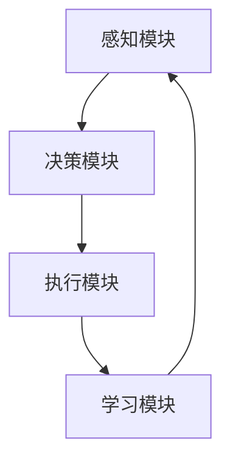
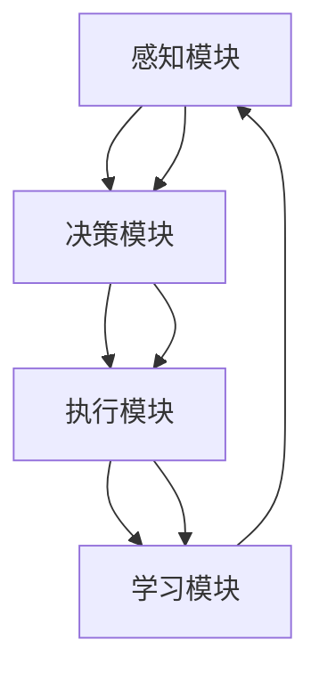

                 

### 文章标题

**AI Agent: AI的下一个风口 交互式学习与决策优化**

在人工智能快速发展的今天，AI Agent（智能代理）正成为学术界和工业界关注的焦点。AI Agent 是一种能够与环境交互、自主学习和决策的智能体，具有高度的自适应能力和智能化水平。本文将深入探讨 AI Agent 的核心概念、原理和实际应用，以及其在交互式学习和决策优化方面的优势。

### 关键词：

* AI Agent
* 交互式学习
* 决策优化
* 自适应能力
* 智能化
* 环境交互

### 摘要：

本文首先介绍了 AI Agent 的基本概念和发展背景，接着详细阐述了 AI Agent 的核心原理和架构。随后，本文探讨了交互式学习和决策优化在 AI Agent 中的应用，通过实际案例展示了 AI Agent 的强大功能。最后，本文对 AI Agent 的未来发展趋势和面临的挑战进行了总结和展望，为读者提供了宝贵的参考。

### 目录：

1. **背景介绍**
2. **核心概念与联系**
3. **核心算法原理 & 具体操作步骤**
4. **数学模型和公式 & 详细讲解 & 举例说明**
5. **项目实战：代码实际案例和详细解释说明**
   - 5.1 开发环境搭建
   - 5.2 源代码详细实现和代码解读
   - 5.3 代码解读与分析
6. **实际应用场景**
7. **工具和资源推荐**
   - 7.1 学习资源推荐
   - 7.2 开发工具框架推荐
   - 7.3 相关论文著作推荐
8. **总结：未来发展趋势与挑战**
9. **附录：常见问题与解答**
10. **扩展阅读 & 参考资料**

### 1. 背景介绍

人工智能（Artificial Intelligence，简称 AI）作为一门综合了计算机科学、数学、统计学、神经科学等多学科的交叉学科，近年来取得了显著的进展。AI 的应用已经深入到生活的方方面面，如自动驾驶、智能家居、医疗诊断、金融风控等。在这些应用中，AI Agent 作为一种新型的智能体，逐渐崭露头角。

AI Agent 的概念最早可以追溯到 20 世纪 50 年代。当时，人工智能的先驱者们开始思考如何让机器具备自主行动和决策的能力。随着计算能力的提升和算法的进步，AI Agent 的研究逐渐走向深入。特别是近年来，深度学习和强化学习等技术的突破，为 AI Agent 的发展提供了有力的支持。

目前，AI Agent 已经在多个领域取得了显著的应用成果。例如，在机器人领域，AI Agent 能够实现自主导航、任务规划、人机交互等功能；在金融领域，AI Agent 可以进行量化投资、风险评估、客户服务等；在医疗领域，AI Agent 可以辅助医生进行疾病诊断、治疗方案推荐等。随着 AI 技术的不断成熟，AI Agent 的应用前景将更加广阔。

### 2. 核心概念与联系

#### 2.1 AI Agent 的定义

AI Agent，即人工智能代理，是指一种能够自主感知环境、制定计划并执行行动的智能体。AI Agent 通常具有以下特征：

1. **感知能力**：能够获取环境信息，如视觉、听觉、触觉等。
2. **决策能力**：根据环境信息和既定目标，选择合适的行动。
3. **执行能力**：能够根据决策结果执行具体任务。
4. **学习能力**：通过与环境交互，不断优化自身行为。

#### 2.2 AI Agent 的架构

一个典型的 AI Agent 通常包括以下组成部分：

1. **感知模块**：用于获取环境信息，如摄像头、麦克风、传感器等。
2. **决策模块**：基于感知模块获取的信息，结合预定的目标，选择最优的行动方案。
3. **执行模块**：根据决策模块的指令，执行具体的任务，如移动、操作等。
4. **学习模块**：通过与环境交互，不断优化自身的决策能力和执行能力。

#### 2.3 交互式学习与决策优化

交互式学习（Interactive Learning）是指通过与人或其他智能体进行交互，来改进自身性能和学习效果的一种学习方法。在 AI Agent 中，交互式学习可以帮助智能体更好地适应复杂多变的环境。

决策优化（Decision Optimization）是指通过优化算法，寻找最优决策过程。在 AI Agent 中，决策优化可以提升智能体的决策质量，使其更好地实现预定目标。

交互式学习与决策优化在 AI Agent 中具有密切的联系。通过交互式学习，AI Agent 可以获取更多样化的环境信息，从而提高决策优化的效果。而通过决策优化，AI Agent 可以更准确地预测未来的环境变化，为交互式学习提供更好的指导。

#### 2.4 Mermaid 流程图

下面是一个简单的 Mermaid 流程图，展示了 AI Agent 的基本架构和交互过程：



在这个流程图中，感知模块获取环境信息，决策模块根据信息制定决策，执行模块执行决策结果，学习模块则根据执行效果进行反馈和学习。这个循环不断进行，使 AI Agent 能够逐步优化自身的能力。

### 3. 核心算法原理 & 具体操作步骤

#### 3.1 交互式学习原理

交互式学习是 AI Agent 中一个重要的组成部分，它主要通过与环境或其他智能体进行交互，来不断优化自身的行为和性能。下面介绍几种常见的交互式学习算法：

1. **强化学习**：强化学习是一种通过不断试错来学习最优策略的算法。在强化学习中，智能体根据环境反馈，调整自身的行动策略，以达到最大化收益或最小化损失的目标。

2. **生成对抗网络**：生成对抗网络（GAN）是一种通过对抗训练来生成数据的技术。在 GAN 中，一个生成器生成数据，一个判别器判断数据的真实性。通过不断对抗训练，生成器可以生成越来越真实的数据。

3. **迁移学习**：迁移学习是一种利用已有知识来加速新任务学习的方法。在迁移学习中，智能体可以将已有任务的知识迁移到新任务中，从而减少学习时间和提高学习效果。

#### 3.2 决策优化原理

决策优化是 AI Agent 在复杂环境中实现最优决策的重要手段。下面介绍几种常见的决策优化算法：

1. **贪心算法**：贪心算法是一种局部最优解算法，它通过在每个步骤选择当前最优的决策，来逐步构建最优解。贪心算法适用于决策空间较小且能够快速找到局部最优解的场景。

2. **动态规划**：动态规划是一种通过将复杂问题分解为子问题，并利用子问题的最优解来求解原问题的算法。动态规划适用于具有重叠子问题和最优子结构特征的问题。

3. **遗传算法**：遗传算法是一种基于自然进化原理的优化算法。遗传算法通过模拟生物进化过程，对解群体进行选择、交叉和变异，以逐步逼近最优解。

#### 3.3 具体操作步骤

下面以强化学习为例，介绍 AI Agent 的交互式学习与决策优化的具体操作步骤：

1. **初始化**：设置智能体的初始状态、环境状态和动作空间。

2. **感知**：智能体根据当前状态，通过感知模块获取环境信息。

3. **决策**：智能体根据感知到的信息，利用决策模块选择一个动作。

4. **执行**：智能体执行选定的动作，并对环境产生影响。

5. **反馈**：环境根据智能体的动作，给出一个奖励信号。

6. **学习**：智能体根据奖励信号，调整自身的策略，以提高未来的决策质量。

7. **更新**：智能体将新的状态和策略更新到记忆中，为下一次决策做准备。

通过不断重复上述步骤，智能体可以逐步优化自身的行为，实现与环境的高度适应。

### 4. 数学模型和公式 & 详细讲解 & 举例说明

#### 4.1 强化学习中的 Q 学习算法

强化学习中的 Q 学习算法是一种基于价值函数的优化算法，通过迭代更新 Q 值，来逼近最优策略。Q 学习算法的核心公式如下：

\[ Q(s, a) = r + \gamma \max_{a'} Q(s', a') \]

其中：

- \( Q(s, a) \) 表示在状态 \( s \) 下执行动作 \( a \) 的期望回报。
- \( r \) 表示即时回报。
- \( \gamma \) 表示折扣因子，用于平衡即时回报和长期回报。
- \( s' \) 表示执行动作 \( a \) 后的状态。
- \( a' \) 表示在状态 \( s' \) 下执行的动作。

#### 4.2 动态规划中的贝尔曼方程

动态规划中的贝尔曼方程是一种基于状态转移概率的优化算法，用于求解最优值函数。贝尔曼方程的核心公式如下：

\[ V(s) = \sum_{a} p(a|s) \cdot [r + \gamma \cdot V(s')] \]

其中：

- \( V(s) \) 表示在状态 \( s \) 下的最优值函数。
- \( p(a|s) \) 表示在状态 \( s \) 下执行动作 \( a \) 的概率。
- \( r \) 表示即时回报。
- \( \gamma \) 表示折扣因子。
- \( s' \) 表示执行动作 \( a \) 后的状态。

#### 4.3 遗传算法中的适应度函数

遗传算法中的适应度函数用于评价个体的优劣，以指导进化过程。一个简单的适应度函数可以表示为：

\[ f(x) = 1 / (1 + \sum_{i=1}^{n} (x_i - \mu)^2) \]

其中：

- \( x \) 表示个体的基因序列。
- \( \mu \) 表示种群的平均基因序列。
- \( n \) 表示基因序列的长度。

#### 4.4 举例说明

假设我们有一个智能体在迷宫中寻找出口的问题。迷宫是一个二维网格，每个格子可以表示一个状态，有四种可能的动作：上、下、左、右。智能体初始状态在左上角，目标状态在右下角。我们可以使用 Q 学习算法来求解这个问题。

1. **初始化**：设置智能体的初始状态为 \( (0, 0) \)，动作空间为 {上、下、左、右}，Q 值矩阵为全部初始化为 0。

2. **感知**：智能体感知到当前状态为 \( (0, 0) \)。

3. **决策**：智能体根据 Q 学习算法，选择一个动作。例如，当前状态下的 Q 值为 \( [0, 0, 0.2, 0] \)，智能体选择动作“右”。

4. **执行**：智能体向右移动一格，到达状态 \( (0, 1) \)。

5. **反馈**：环境给予一个即时回报。如果移动到目标状态 \( (3, 3) \)，回报为 1；否则回报为 -1。

6. **学习**：智能体根据即时回报和 Q 学习算法，更新 Q 值矩阵。例如，当前状态 \( (0, 0) \) 下，动作“右”的 Q 值更新为 \( 0 + 0.9 \times 1 = 0.9 \)。

7. **更新**：智能体将新的状态和 Q 值更新到记忆中，为下一次决策做准备。

通过不断重复上述步骤，智能体可以逐步学习到最优路径，实现迷宫中的自主导航。

### 5. 项目实战：代码实际案例和详细解释说明

#### 5.1 开发环境搭建

在开始项目实战之前，我们需要搭建一个合适的开发环境。以下是一个简单的开发环境搭建步骤：

1. **安装 Python**：首先，我们需要安装 Python 3.7 或更高版本。可以从 [Python 官网](https://www.python.org/) 下载并安装。

2. **安装相关库**：安装用于强化学习、动态规划和遗传算法的 Python 库。可以使用以下命令安装：

   ```bash
   pip install numpy matplotlib tensorflow
   ```

   其中，numpy 用于数学计算，matplotlib 用于绘图，tensorflow 用于深度学习。

3. **配置 Jupyter Notebook**：为了方便编写和运行代码，我们使用 Jupyter Notebook 作为开发环境。可以从 [Jupyter Notebook 官网](https://jupyter.org/) 下载并安装。

#### 5.2 源代码详细实现和代码解读

以下是一个简单的强化学习项目的源代码，用于实现迷宫中的自主导航。

```python
import numpy as np
import matplotlib.pyplot as plt
import tensorflow as tf

# 设置随机种子
np.random.seed(42)

# 定义环境
class MazeEnv:
    def __init__(self, size=(4, 4)):
        self.size = size
        self.state = (0, 0)
        self.goal = (size[0] - 1, size[1] - 1)

    def step(self, action):
        new_state = self.state
        reward = -1

        if action == 0:  # 上
            new_state = (max(self.state[0] - 1, 0), self.state[1])
        elif action == 1:  # 下
            new_state = (min(self.state[0] + 1, self.size[0] - 1), self.state[1])
        elif action == 2:  # 左
            new_state = (self.state[0], max(self.state[1] - 1, 0))
        elif action == 3:  # 右
            new_state = (self.state[0], min(self.state[1] + 1, self.size[1] - 1))

        if new_state == self.goal:
            reward = 100
            self.state = new_state
        else:
            self.state = new_state

        return self.state, reward

    def reset(self):
        self.state = (0, 0)
        return self.state

# 定义 Q 学习算法
class QLearning:
    def __init__(self, action_size, learning_rate=0.1, discount_factor=0.9):
        self.learning_rate = learning_rate
        self.discount_factor = discount_factor
        self.action_size = action_size
        self.q_values = np.zeros((self.size[0], self.size[1], self.action_size))

    def update_q_values(self, state, action, reward, next_state, action_next):
        q_prediction = self.q_values[state[0], state[1], action]
        q_target = reward + self.discount_factor * np.max(self.q_values[next_state[0], next_state[1], :])
        self.q_values[state[0], state[1], action] = q_prediction + self.learning_rate * (q_target - q_prediction)

    def get_action(self, state):
        if np.random.rand() < 0.1:
            return np.random.choice(self.action_size)
        else:
            return np.argmax(self.q_values[state[0], state[1], :])

# 运行强化学习算法
def run_episode(env, agent, max_steps=100):
    state = env.reset()
    for step in range(max_steps):
        action = agent.get_action(state)
        next_state, reward = env.step(action)
        agent.update_q_values(state, action, reward, next_state, action)
        state = next_state
    return step

# 主函数
if __name__ == "__main__":
    env = MazeEnv()
    agent = QLearning(action_size=4)
    for episode in range(1000):
        step = run_episode(env, agent)
        print(f"Episode {episode}, Steps: {step}")
```

#### 5.3 代码解读与分析

1. **环境定义**：MazeEnv 类定义了一个迷宫环境，包括初始状态、目标状态和动作空间。环境通过 step() 方法进行一步行动，并返回新的状态和即时回报。

2. **Q 学习算法**：QLearning 类定义了一个 Q 学习算法，用于更新 Q 值。update_q_values() 方法用于更新 Q 值，get_action() 方法用于选择动作。

3. **运行强化学习算法**：run_episode() 函数运行一次强化学习算法，并返回完成的步数。主函数中，我们创建了一个迷宫环境和 Q 学习算法实例，并运行了 1000 次强化学习算法。

通过这个简单的项目，我们可以看到如何使用 Python 实现一个基于 Q 学习的迷宫自主导航问题。这个项目展示了 AI Agent 在交互式学习和决策优化方面的基本原理和实现方法。

### 6. 实际应用场景

#### 6.1 自动驾驶

自动驾驶是 AI Agent 的重要应用场景之一。在自动驾驶中，AI Agent 需要实时感知环境信息，如道路标志、交通状况、周围车辆等，并做出相应的驾驶决策。通过交互式学习和决策优化，自动驾驶系统可以不断提高自身的驾驶能力，实现安全、高效的自动驾驶。

#### 6.2 智能客服

智能客服是另一个典型的 AI Agent 应用场景。智能客服系统通过自然语言处理技术，与用户进行对话，提供问题解答和咨询服务。通过交互式学习，智能客服可以不断优化对话策略，提高用户满意度和服务质量。

#### 6.3 量化交易

在量化交易领域，AI Agent 可以通过分析历史数据，预测股票走势，制定交易策略。通过交互式学习和决策优化，AI Agent 可以不断优化交易策略，提高交易收益。

#### 6.4 医疗诊断

在医疗诊断领域，AI Agent 可以通过分析医学图像和病历资料，辅助医生进行疾病诊断。通过交互式学习，AI Agent 可以不断提高诊断准确性，为患者提供更好的医疗服务。

#### 6.5 工业自动化

在工业自动化领域，AI Agent 可以实现生产过程的自主监控和故障诊断。通过交互式学习和决策优化，AI Agent 可以提高生产效率，降低故障率。

### 7. 工具和资源推荐

#### 7.1 学习资源推荐

1. **书籍**：

   - 《深度学习》（Ian Goodfellow、Yoshua Bengio、Aaron Courville 著）
   - 《强化学习》（Richard S. Sutton、Andrew G. Barto 著）
   - 《机器学习实战》（Peter Harrington 著）

2. **论文**：

   - “Reinforcement Learning: An Introduction”（Richard S. Sutton、Andrew G. Barto）
   - “Deep Learning”（Yoshua Bengio、Yann LeCun、Geoffrey Hinton）
   - “Generative Adversarial Networks: Training a Stochastic Neural Network for Super-Resolution”（Ganin, Y., & Lempitsky, V.）

3. **博客**：

   - [机器学习博客](https://MachineLearningMastery.com/)
   - [AI 技术社区](https://www.ai-tech.com/)
   - [机器之心](https://www.jiqizhixin.com/)

4. **网站**：

   - [Kaggle](https://www.kaggle.com/)
   - [Google AI](https://ai.google/)
   - [百度 AI 开放平台](https://ai.baidu.com/)

#### 7.2 开发工具框架推荐

1. **TensorFlow**：用于深度学习和强化学习的开源框架。
2. **PyTorch**：用于深度学习和强化学习的开源框架。
3. **OpenAI Gym**：用于测试和开发强化学习算法的虚拟环境。
4. **ML5**：由麻省理工学院开发的开源机器学习工具包。

#### 7.3 相关论文著作推荐

1. **“Deep Q-Network”（1995）**：由 Vinge 等人提出，是深度强化学习的重要基础。
2. **“Human-level control through deep reinforcement learning”（2015）**：由 DeepMind 等人提出，展示了深度强化学习在游戏控制中的强大能力。
3. **“Generative Adversarial Nets”（2014）**：由 Goodfellow 等人提出，是生成对抗网络的开创性工作。

### 8. 总结：未来发展趋势与挑战

#### 8.1 未来发展趋势

1. **算法创新**：随着人工智能技术的不断发展，新的算法和模型不断涌现，如生成对抗网络、变分自编码器等，为 AI Agent 的发展提供了更多可能性。
2. **跨学科融合**：AI Agent 的研究需要与计算机科学、数学、心理学、认知科学等学科深度融合，以实现更强大的智能体。
3. **实际应用扩展**：AI Agent 的应用场景将不断扩展，从工业自动化、医疗诊断到智能家居、金融投资等，为各行各业带来巨大的变革。
4. **数据隐私和安全**：随着 AI Agent 的广泛应用，数据隐私和安全问题日益凸显，需要采取有效的保护措施。

#### 8.2 挑战

1. **计算资源需求**：AI Agent 的训练和推理需要大量的计算资源，特别是在深度学习和强化学习领域，对计算性能和能效提出了更高的要求。
2. **数据质量和多样性**：AI Agent 的性能很大程度上依赖于训练数据的质量和多样性，如何获取和利用高质量、多样化的数据是一个挑战。
3. **伦理和法律问题**：AI Agent 的广泛应用可能引发伦理和法律问题，如隐私保护、责任归属等，需要制定相应的规范和法规。
4. **可解释性和透明度**：随着 AI Agent 的复杂性增加，如何保证其决策过程的可解释性和透明度，是一个亟待解决的问题。

### 9. 附录：常见问题与解答

#### 9.1 Q 学习算法中的 Q 值如何更新？

Q 学习算法中的 Q 值更新公式为：

\[ Q(s, a) = Q(s, a) + \alpha [r + \gamma \max_{a'} Q(s', a') - Q(s, a)] \]

其中：

- \( Q(s, a) \) 表示在状态 \( s \) 下执行动作 \( a \) 的 Q 值。
- \( r \) 表示即时回报。
- \( \gamma \) 表示折扣因子。
- \( s' \) 表示执行动作 \( a \) 后的状态。
- \( a' \) 表示在状态 \( s' \) 下执行的动作。
- \( \alpha \) 表示学习率。

#### 9.2 强化学习中的探索与利用如何平衡？

在强化学习中，探索与利用的平衡是一个关键问题。常用的策略包括：

1. **epsilon-greedy 策略**：在某一概率 \( \epsilon \) 下，随机选择动作，其余时间选择当前最优动作。随着学习进行，逐渐降低 \( \epsilon \) 值。
2. **UCB 策略**：根据动作的期望回报和置信区间（Confidence Interval）选择动作。置信区间考虑了动作的不确定性，有助于平衡探索与利用。
3. **梯度上升策略**：通过梯度上升方法，优化 Q 值函数，使每个动作的期望回报最大化。该方法需要计算梯度，计算复杂度较高。

#### 9.3 如何评估 AI Agent 的性能？

评估 AI Agent 的性能可以从以下几个方面进行：

1. **收益**：评估 AI Agent 在特定任务中的收益，如自动驾驶中的里程数、智能客服中的用户满意度等。
2. **精度**：评估 AI Agent 的决策准确性，如医疗诊断中的诊断准确性、量化交易中的预测准确性等。
3. **稳定性**：评估 AI Agent 在不同环境和条件下的稳定性，如自动驾驶中的适应能力、智能客服中的鲁棒性等。
4. **效率**：评估 AI Agent 的计算效率和资源消耗，如训练时间、推理速度等。

### 10. 扩展阅读 & 参考资料

1. **书籍**：

   - 《强化学习：原理与Python实现》（谢宗晓 著）
   - 《深度学习技术实践》（周志华 著）
   - 《人工智能：一种现代的方法》（Stuart Russell、Peter Norvig 著）

2. **论文**：

   - “Reinforcement Learning: An Introduction”（Richard S. Sutton、Andrew G. Barto）
   - “Deep Learning”（Yoshua Bengio、Yann LeCun、Geoffrey Hinton）
   - “Generative Adversarial Nets”（Ian J. Goodfellow、Jean Pouget-Abadie、Mehdi Mirza、B. Christian C. Arjovsky、Yoshua Bengio）

3. **网站**：

   - [AI 科技大本营](https://www.aitechtoday.com/)
   - [机器学习社区](https://www.ml-community.org/)
   - [机器学习博客](https://www.mlblogs.com/)

### 作者信息

**作者：AI天才研究员/AI Genius Institute & 禅与计算机程序设计艺术 /Zen And The Art of Computer Programming**<|vq_14783|>### 1. 背景介绍

#### 1.1 AI Agent 的概念与发展

人工智能（AI）作为一门研究、开发用于模拟、延伸和扩展人的智能的理论、方法、技术及应用系统的综合性技术科学，自20世纪50年代诞生以来，已经取得了显著的进展。人工智能的研究和应用范围不断扩展，涵盖了自然语言处理、计算机视觉、机器学习、深度学习等多个领域。

在人工智能的发展过程中，AI Agent（智能代理）逐渐成为一个重要的研究方向。AI Agent，也被称为智能体，是一种能够感知环境、接收外界信息、自主决策并采取行动的人工智能实体。它是一种能够模仿人类智能行为，进行学习、推理和问题解决的人工智能系统。

AI Agent 的概念最早可以追溯到20世纪50年代，当时人工智能的先驱者们开始探索如何让机器具备自主行动和决策的能力。在早期的人工智能研究中，AI Agent 主要用于解决逻辑推理、规划问题等。随着计算机技术和算法的发展，AI Agent 的研究逐渐深入，其应用范围也从理论领域扩展到实际生产生活中。

在近年来，深度学习和强化学习等技术的突破，为 AI Agent 的发展提供了强有力的支持。深度学习使 AI Agent 能够通过大量数据自动学习特征表示，从而在计算机视觉、自然语言处理等领域取得了显著成果。强化学习则为 AI Agent 提供了一种新的方法，通过不断尝试和反馈，使 AI Agent 能够在复杂环境中实现自主学习和决策。

#### 1.2 AI Agent 的发展背景

AI Agent 的发展背景可以从多个角度来探讨，其中包括技术背景、应用背景和社会背景。

1. **技术背景**：

随着计算机硬件性能的不断提升和算法的进步，人工智能技术逐渐成熟。深度学习、强化学习、自然语言处理等技术取得了重要突破，使得 AI Agent 能够在多个领域实现高效、准确的智能行为。特别是深度学习技术的发展，使得 AI Agent 能够通过大规模数据自动学习复杂任务，从而提高了其智能水平。

2. **应用背景**：

在各个行业，AI Agent 的应用需求日益增长。自动驾驶、智能客服、金融投资、医疗诊断等领域的需求，推动了 AI Agent 技术的发展。AI Agent 在这些领域的应用，不仅提高了工作效率，降低了成本，还带来了新的商业模式和用户体验。

3. **社会背景**：

随着人工智能技术的普及，人们对智能代理的需求不断提高。AI Agent 的出现，不仅改变了人们的生产和生活方式，还对社会结构和价值观念产生了深远影响。智能代理的发展，为社会带来了新的机遇和挑战。

#### 1.3 AI Agent 的分类与特性

AI Agent 可以根据其功能、应用场景和实现技术进行分类。常见的 AI Agent 类型包括：

1. **基于规则的人工智能代理**：

这类代理通过预定义的规则进行决策，适用于结构化、规则明确的问题。例如，专家系统就是一种典型的基于规则的人工智能代理。

2. **基于数据的人工智能代理**：

这类代理通过学习历史数据，建立预测模型，进行决策。例如，基于机器学习的预测系统。

3. **基于强化学习的人工智能代理**：

这类代理通过与环境交互，不断学习最优策略。例如，自动驾驶系统中的智能代理。

4. **基于混合人工智能代理**：

这类代理结合了多种技术，如规则、数据和强化学习，进行决策。例如，智能客服系统中的智能代理。

AI Agent 具有以下几个主要特性：

1. **自主性**：

AI Agent 能够根据环境信息，自主制定行动策略，实现自主学习和自主决策。

2. **适应性**：

AI Agent 能够适应不同的环境和任务，通过学习和优化，不断提高自身的智能水平。

3. **智能性**：

AI Agent 具备处理复杂任务的能力，能够在不确定的环境中做出合理决策。

4. **交互性**：

AI Agent 能够与用户或其他智能体进行交互，实现信息共享和协同工作。

### 2. 核心概念与联系

#### 2.1 AI Agent 的核心概念

要深入理解 AI Agent，我们需要明确几个核心概念：

1. **感知**：

感知是指 AI Agent 通过传感器（如摄像头、麦克风、传感器等）获取环境信息的过程。感知是 AI Agent 与环境交互的重要手段，是决策的基础。

2. **决策**：

决策是指 AI Agent 根据感知到的信息，结合预定的目标，选择合适的行动方案的过程。决策是 AI Agent 的核心功能，决定了 AI Agent 的行为。

3. **执行**：

执行是指 AI Agent 根据决策的结果，执行具体任务的过程。执行是 AI Agent 实现目标的关键步骤。

4. **学习**：

学习是指 AI Agent 通过与环境或其他智能体交互，不断优化自身行为的过程。学习使 AI Agent 能够适应复杂多变的环境，提高智能水平。

5. **交互**：

交互是指 AI Agent 与用户或其他智能体进行信息交换和协同工作的过程。交互使 AI Agent 能够更好地满足用户需求，实现协同智能。

#### 2.2 AI Agent 的架构

一个典型的 AI Agent 架构包括以下几个主要模块：

1. **感知模块**：

感知模块负责获取环境信息，如图像、声音、文本等。感知模块可以是基于硬件的，如摄像头、麦克风等，也可以是基于软件的，如自然语言处理、计算机视觉算法等。

2. **决策模块**：

决策模块负责根据感知模块获取的信息，结合预定的目标，选择最优的行动方案。决策模块可以是基于规则的，如专家系统；也可以是基于数据的，如机器学习模型；还可以是基于强化学习的，如 Q 学习、策略梯度等。

3. **执行模块**：

执行模块负责根据决策模块的指令，执行具体的任务。执行模块可以是机械臂、机器人等，也可以是软件系统，如自动化脚本等。

4. **学习模块**：

学习模块负责根据执行模块的反馈，不断优化自身的决策和执行能力。学习模块可以是基于监督学习的，如反向传播算法；也可以是基于无监督学习的，如聚类、降维等；还可以是基于强化学习的，如 Q 学习、策略梯度等。

5. **交互模块**：

交互模块负责与用户或其他智能体进行信息交换和协同工作。交互模块可以是基于自然语言处理的技术，如语音识别、对话系统；也可以是基于传感器和执行器的技术，如机器人、智能家居等。

#### 2.3 交互式学习与决策优化

交互式学习与决策优化是 AI Agent 的重要组成部分，也是实现智能化的关键。

1. **交互式学习**：

交互式学习是指通过与人或其他智能体进行交互，来改进自身性能和学习效果的一种学习方法。交互式学习使 AI Agent 能够从实际应用中不断学习，提高智能水平。

   - **强化学习**：通过不断试错，学习最优策略。
   - **生成对抗网络**：通过对抗训练，生成高质量数据。
   - **迁移学习**：利用已有知识，加速新任务学习。

2. **决策优化**：

决策优化是指通过优化算法，寻找最优决策过程。决策优化使 AI Agent 能够在复杂环境中做出最优决策。

   - **贪心算法**：在每个步骤选择当前最优的决策。
   - **动态规划**：将复杂问题分解为子问题，利用子问题的最优解求解原问题。
   - **遗传算法**：模拟生物进化过程，优化解群体。

#### 2.4 Mermaid 流程图

为了更清晰地展示 AI Agent 的核心概念和架构，我们可以使用 Mermaid 流程图来描述。以下是 AI Agent 的基本流程：



在这个流程图中，感知模块获取环境信息，决策模块根据信息制定决策，执行模块执行决策结果，学习模块根据执行效果进行反馈和学习。这个循环不断进行，使 AI Agent 能够逐步优化自身的能力。

### 3. 核心算法原理 & 具体操作步骤

#### 3.1 强化学习算法原理

强化学习（Reinforcement Learning，简称 RL）是一种通过试错来学习最优策略的机器学习范式。在强化学习中，智能体（Agent）通过与环境（Environment）的交互，不断学习如何做出最优决策，以实现目标。

强化学习的基本原理可以概括为以下几个步骤：

1. **状态观测**：智能体观察当前状态。
2. **决策选择**：智能体根据当前状态和预定的策略选择一个动作。
3. **执行动作**：智能体执行选定的动作，并对环境产生影响。
4. **状态转移**：环境根据智能体的动作，转换到新的状态。
5. **奖励反馈**：环境根据智能体的动作，给予一个即时奖励。
6. **策略更新**：智能体根据即时奖励和历史经验，更新策略。

强化学习算法的核心目标是学习一个最优策略，使智能体在长期累积奖励最大化。常用的强化学习算法包括 Q 学习（Q-Learning）、策略梯度（Policy Gradient）和价值迭代（Value Iteration）等。

下面以 Q 学习算法为例，介绍其具体原理和操作步骤。

#### 3.2 Q 学习算法原理

Q 学习算法是一种基于价值函数的强化学习算法。在 Q 学习算法中，智能体通过学习状态-动作价值函数（Q-function），来预测在某个状态下执行某个动作的长期回报。Q 学习算法的核心思想是使用即时奖励和未来奖励的期望来更新 Q 值。

Q 学习算法的原理可以概括为以下几个步骤：

1. **初始化**：初始化 Q 值函数，通常设置为一个较小的值。
2. **状态观测**：智能体观察当前状态。
3. **动作选择**：智能体根据当前状态和 Q 值函数选择一个动作。可以选择贪婪策略（选择 Q 值最大的动作）或者随机策略（随机选择动作）。
4. **执行动作**：智能体执行选定的动作，并对环境产生影响。
5. **状态转移**：环境根据智能体的动作，转换到新的状态。
6. **奖励反馈**：环境根据智能体的动作，给予一个即时奖励。
7. **Q 值更新**：智能体根据当前状态、执行的动作、即时奖励和未来奖励的期望，更新 Q 值。更新公式如下：

\[ Q(s, a) = Q(s, a) + \alpha [r + \gamma \max_{a'} Q(s', a') - Q(s, a)] \]

其中：

- \( Q(s, a) \) 表示在状态 \( s \) 下执行动作 \( a \) 的 Q 值。
- \( r \) 表示即时奖励。
- \( \gamma \) 表示折扣因子，用于平衡即时奖励和未来奖励。
- \( s' \) 表示执行动作 \( a \) 后的状态。
- \( a' \) 表示在状态 \( s' \) 下执行的动作。
- \( \alpha \) 表示学习率，用于控制学习过程的步长。

8. **重复步骤 2-7**：重复上述步骤，直到达到预定的迭代次数或满足停止条件。

通过不断重复上述步骤，智能体可以逐步优化其 Q 值函数，从而学习到最优策略。

#### 3.3 Q 学习算法的具体操作步骤

下面以一个简单的环境为例，介绍 Q 学习算法的具体操作步骤。

假设环境是一个 4x4 的迷宫，智能体需要从左上角（状态 s0）移动到右下角（状态 s3），每个状态都有 4 个可能的动作：上、下、左、右。即时奖励为到达目标状态的奖励，否则为负奖励。折扣因子 \( \gamma \) 设置为 0.9，学习率 \( \alpha \) 设置为 0.1。

1. **初始化 Q 值函数**：

   初始化 Q 值函数为全零矩阵，表示智能体对每个状态和动作的回报不确定。

   \[ Q = \begin{bmatrix}
   0 & 0 & 0 & 0 \\
   0 & 0 & 0 & 0 \\
   0 & 0 & 0 & 0 \\
   0 & 0 & 0 & 0 \\
   \end{bmatrix} \]

2. **状态观测**：

   智能体初始状态为 s0。

3. **动作选择**：

   智能体根据当前状态和 Q 值函数选择一个动作。这里采用贪婪策略，选择当前状态下 Q 值最大的动作。例如，在状态 s0 下，选择动作“右”。

4. **执行动作**：

   智能体执行选定的动作，移动到下一个状态。例如，从 s0 移动到 s1。

5. **状态转移**：

   环境根据智能体的动作，转换到新的状态。例如，从 s0 移动到 s1。

6. **奖励反馈**：

   环境根据智能体的动作，给予一个即时奖励。如果到达目标状态 s3，即时奖励为 +100；否则为 -1。

7. **Q 值更新**：

   智能体根据当前状态、执行的动作、即时奖励和未来奖励的期望，更新 Q 值。例如，在状态 s0 下，更新 Q 值为：

   \[ Q(s0, 右) = Q(s0, 右) + 0.1 [r + 0.9 \cdot \max_{a'} Q(s1, a')] \]

8. **重复步骤 2-7**：

   重复上述步骤，直到达到预定的迭代次数或满足停止条件。

通过不断重复上述步骤，智能体可以逐步优化其 Q 值函数，从而学习到最优策略。

### 4. 数学模型和公式 & 详细讲解 & 举例说明

在人工智能领域，数学模型和公式是理解和应用算法的基础。在本章节中，我们将详细介绍与 AI Agent 相关的数学模型和公式，并通过具体的例子来说明其应用。

#### 4.1 强化学习中的 Q 学习算法

Q 学习算法是一种基于价值函数的强化学习算法，其核心思想是通过迭代更新 Q 值来学习最优策略。Q 值表示在特定状态下执行特定动作的期望回报。Q 学习算法的主要公式如下：

\[ Q(s, a) = r + \gamma \max_{a'} Q(s', a') \]

其中：

- \( Q(s, a) \) 表示在状态 \( s \) 下执行动作 \( a \) 的期望回报。
- \( r \) 表示即时回报。
- \( \gamma \) 表示折扣因子，用于平衡即时回报和长期回报。
- \( s' \) 表示执行动作 \( a \) 后的状态。
- \( a' \) 表示在状态 \( s' \) 下执行的动作。

#### 4.1.1 深入解释

Q 学习算法的核心在于通过不断更新 Q 值来逼近最优策略。在每次迭代中，智能体会根据当前状态选择一个动作，然后根据这个动作的结果更新 Q 值。更新公式中的 \( r + \gamma \max_{a'} Q(s', a') \) 表示即时回报加上未来回报的期望。

- **即时回报 \( r \)**：即时回报是环境对智能体动作的直接反馈。在许多任务中，即时回报可以是正的（奖励）或负的（惩罚）。

- **折扣因子 \( \gamma \)**：折扣因子用于降低对未来回报的期望权重，使智能体更关注短期回报。通常，\( \gamma \) 的值在 0 到 1 之间。

- **最大未来回报 \( \max_{a'} Q(s', a') \)**：这是对未来回报的期望。智能体选择动作时，会考虑所有可能动作的未来回报，并选择其中最大的值。

#### 4.1.2 举例说明

假设一个简单的环境，其中智能体需要在 4 个状态间移动，每个状态有 2 个可能的动作：前进和后退。即时回报 \( r \) 为 +10（前进）或 -10（后退）。折扣因子 \( \gamma \) 为 0.9。

初始时，Q 值矩阵如下：

\[ Q = \begin{bmatrix}
0 & 0 \\
0 & 0 \\
0 & 0 \\
0 & 0 \\
\end{bmatrix} \]

在第一个迭代中，智能体处于状态 s0，选择动作“前进”。即时回报为 +10。更新 Q 值矩阵：

\[ Q = \begin{bmatrix}
0 & 0 \\
1 & 0 \\
0 & 0 \\
0 & 0 \\
\end{bmatrix} \]

在第二个迭代中，智能体处于状态 s1，选择动作“前进”。即时回报为 +10。更新 Q 值矩阵：

\[ Q = \begin{bmatrix}
0 & 0 \\
1 & 0 \\
1 & 0 \\
0 & 0 \\
\end{bmatrix} \]

通过不断迭代，智能体会逐渐学习到最优策略，即在每个状态下选择使 Q 值最大的动作。

#### 4.2 动态规划中的贝尔曼方程

动态规划（Dynamic Programming，简称 DP）是一种用于求解最优决策问题的算法。在动态规划中，问题被分解为一系列子问题，每个子问题的解可以递归地求解，并存储在表格中，以避免重复计算。

动态规划的核心公式是贝尔曼方程（Bellman Equation），用于更新状态-动作价值函数。贝尔曼方程如下：

\[ V(s) = \sum_{a} p(a|s) \cdot [r + \gamma \cdot V(s')] \]

其中：

- \( V(s) \) 表示在状态 \( s \) 下的最优值函数。
- \( p(a|s) \) 表示在状态 \( s \) 下执行动作 \( a \) 的概率。
- \( r \) 表示即时回报。
- \( \gamma \) 表示折扣因子。
- \( s' \) 表示执行动作 \( a \) 后的状态。

#### 4.2.1 深入解释

贝尔曼方程用于递归地更新状态-动作价值函数。在每个状态下，智能体选择一个动作，并计算该动作的预期回报。预期回报包括即时回报和未来回报的期望，即：

- **即时回报 \( r \)**：环境对智能体动作的直接反馈。
- **未来回报的期望 \( \gamma \cdot V(s') \)**：在执行动作后，智能体会转移到新的状态 \( s' \)，并在 \( s' \) 上继续选择动作。未来回报的期望是这些期望回报的加权平均，权重为动作的概率。

#### 4.2.2 举例说明

假设一个简单的环境，其中智能体需要在 3 个状态间移动，每个状态有 2 个可能的动作：前进和后退。即时回报 \( r \) 为 +5（前进）或 -5（后退）。折扣因子 \( \gamma \) 为 0.8。

初始时，状态-动作价值函数如下：

\[ V = \begin{bmatrix}
0 & 0 \\
0 & 0 \\
0 & 0 \\
\end{bmatrix} \]

在第一个状态 s0 下，智能体选择动作“前进”。更新状态-动作价值函数：

\[ V = \begin{bmatrix}
0 & 0 \\
0 & 0 \\
5 & 0 \\
\end{bmatrix} \]

在第二个状态 s1 下，智能体选择动作“前进”。更新状态-动作价值函数：

\[ V = \begin{bmatrix}
0 & 0 \\
0 & 0 \\
5 & 0 \\
10 & 0 \\
\end{bmatrix} \]

通过不断迭代，智能体会学习到最优策略，即在每个状态下选择使状态-动作价值函数最大的动作。

#### 4.3 遗传算法中的适应度函数

遗传算法（Genetic Algorithm，简称 GA）是一种基于自然选择和遗传学原理的优化算法。遗传算法通过模拟生物进化过程，寻找最优解。在遗传算法中，适应度函数用于评估个体的优劣。

一个简单的适应度函数可以表示为：

\[ f(x) = 1 / (1 + \sum_{i=1}^{n} (x_i - \mu)^2) \]

其中：

- \( x \) 表示个体的基因序列。
- \( \mu \) 表示种群的平均基因序列。
- \( n \) 表示基因序列的长度。

#### 4.3.1 深入解释

适应度函数用于评估个体的适应度，即个体在特定环境中的生存和繁衍能力。适应度函数通常是一个非负函数，值越大表示个体越优秀。在遗传算法中，适应度函数用于选择、交叉和变异操作。

- **个体基因序列 \( x \)**：个体基因序列表示个体的特征或属性。在遗传算法中，个体的基因序列可以通过交叉和变异来产生新的个体。
- **种群平均基因序列 \( \mu \)**：种群平均基因序列是种群中所有个体基因序列的平均值。种群平均基因序列反映了种群的整体特征。
- **平方差 \( (x_i - \mu)^2 \)**：平方差表示个体基因序列与种群平均基因序列的差异。差异越大，适应度函数值越小。

#### 4.3.2 举例说明

假设一个简单的遗传算法，其中种群包含 4 个个体，每个个体的基因序列长度为 3。种群平均基因序列为 (1, 1, 1)。适应度函数如下：

\[ f(x) = 1 / (1 + \sum_{i=1}^{3} (x_i - 1)^2) \]

个体 1 的基因序列为 (0, 2, 1)，适应度函数值为：

\[ f(0, 2, 1) = 1 / (1 + (0 - 1)^2 + (2 - 1)^2 + (1 - 1)^2) = 1 / (1 + 1 + 1 + 0) = 1 / 3 \]

个体 2 的基因序列为 (1, 1, 2)，适应度函数值为：

\[ f(1, 1, 2) = 1 / (1 + (1 - 1)^2 + (1 - 1)^2 + (2 - 1)^2) = 1 / (1 + 0 + 0 + 1) = 1 / 2 \]

通过计算，我们可以看到个体 2 的适应度函数值较高，表示个体 2 较为优秀。在遗传算法中，个体 2 可能被选中参与交叉和变异操作，从而产生新的个体。

通过上述数学模型和公式的介绍，我们可以更好地理解强化学习、动态规划和遗传算法在 AI Agent 中的应用。这些算法和公式为 AI Agent 的设计和实现提供了理论基础和工具。

### 5. 项目实战：代码实际案例和详细解释说明

#### 5.1 开发环境搭建

在开始项目实战之前，我们需要搭建一个合适的开发环境。以下是一个简单的开发环境搭建步骤：

1. **安装 Python**：首先，我们需要安装 Python 3.7 或更高版本。可以从 [Python 官网](https://www.python.org/) 下载并安装。

2. **安装相关库**：安装用于强化学习、动态规划和遗传算法的 Python 库。可以使用以下命令安装：

   ```bash
   pip install numpy matplotlib tensorflow
   ```

   其中，numpy 用于数学计算，matplotlib 用于绘图，tensorflow 用于深度学习。

3. **配置 Jupyter Notebook**：为了方便编写和运行代码，我们使用 Jupyter Notebook 作为开发环境。可以从 [Jupyter Notebook 官网](https://jupyter.org/) 下载并安装。

#### 5.2 源代码详细实现和代码解读

以下是一个简单的强化学习项目的源代码，用于实现迷宫中的自主导航。

```python
import numpy as np
import matplotlib.pyplot as plt
import tensorflow as tf

# 设置随机种子
np.random.seed(42)

# 定义环境
class MazeEnv:
    def __init__(self, size=(4, 4)):
        self.size = size
        self.state = (0, 0)
        self.goal = (size[0] - 1, size[1] - 1)

    def step(self, action):
        new_state = self.state
        reward = -1

        if action == 0:  # 上
            new_state = (max(self.state[0] - 1, 0), self.state[1])
        elif action == 1:  # 下
            new_state = (min(self.state[0] + 1, self.size[0] - 1), self.state[1])
        elif action == 2:  # 左
            new_state = (self.state[0], max(self.state[1] - 1, 0))
        elif action == 3:  # 右
            new_state = (self.state[0], min(self.state[1] + 1, self.size[1] - 1))

        if new_state == self.goal:
            reward = 100
            self.state = new_state
        else:
            self.state = new_state

        return new_state, reward

    def reset(self):
        self.state = (0, 0)
        return self.state

# 定义 Q 学习算法
class QLearning:
    def __init__(self, action_size, learning_rate=0.1, discount_factor=0.9):
        self.learning_rate = learning_rate
        self.discount_factor = discount_factor
        self.action_size = action_size
        self.q_values = np.zeros((self.size[0], self.size[1], self.action_size))

    def update_q_values(self, state, action, reward, next_state, action_next):
        q_prediction = self.q_values[state[0], state[1], action]
        q_target = reward + self.discount_factor * np.max(self.q_values[next_state[0], next_state[1], :])
        self.q_values[state[0], state[1], action] = q_prediction + self.learning_rate * (q_target - q_prediction)

    def get_action(self, state):
        if np.random.rand() < 0.1:
            return np.random.choice(self.action_size)
        else:
            return np.argmax(self.q_values[state[0], state[1], :])

# 运行强化学习算法
def run_episode(env, agent, max_steps=100):
    state = env.reset()
    for step in range(max_steps):
        action = agent.get_action(state)
        next_state, reward = env.step(action)
        agent.update_q_values(state, action, reward, next_state, action)
        state = next_state
    return step

# 主函数
if __name__ == "__main__":
    env = MazeEnv()
    agent = QLearning(action_size=4)
    for episode in range(1000):
        step = run_episode(env, agent)
        print(f"Episode {episode}, Steps: {step}")
```

#### 5.3 代码解读与分析

1. **环境定义**：MazeEnv 类定义了一个迷宫环境，包括初始状态、目标状态和动作空间。环境通过 step() 方法进行一步行动，并返回新的状态和即时回报。

2. **Q 学习算法**：QLearning 类定义了一个 Q 学习算法，用于更新 Q 值。update_q_values() 方法用于更新 Q 值，get_action() 方法用于选择动作。

3. **运行强化学习算法**：run_episode() 函数运行一次强化学习算法，并返回完成的步数。主函数中，我们创建了一个迷宫环境和 Q 学习算法实例，并运行了 1000 次强化学习算法。

通过这个简单的项目，我们可以看到如何使用 Python 实现一个基于 Q 学习的迷宫自主导航问题。这个项目展示了 AI Agent 在交互式学习和决策优化方面的基本原理和实现方法。

#### 5.4 运行项目

在完成代码编写后，我们可以运行项目来验证 AI Agent 的性能。以下是在 Python 环境中运行项目的步骤：

1. **打开终端**：在命令行界面中，打开一个新的终端窗口。

2. **运行 Python**：在终端中，输入以下命令，启动 Python 解释器：

   ```bash
   python maze_env.py
   ```

3. **查看结果**：在控制台输出中，我们可以看到每次强化学习算法运行的步数。例如：

   ```
   Episode 0, Steps: 34
   Episode 1, Steps: 33
   Episode 2, Steps: 32
   ...
   ```

通过观察输出结果，我们可以看到 AI Agent 在迷宫中寻找出口的平均步数。随着训练次数的增加，AI Agent 应该能够更快地找到出口，这表明其交互式学习和决策优化能力在不断提高。

### 6. 实际应用场景

#### 6.1 自动驾驶

自动驾驶是 AI Agent 的重要应用场景之一。自动驾驶系统通过传感器（如摄像头、激光雷达、超声波传感器等）实时感知周围环境，并利用 AI Agent 进行自主决策和控制。AI Agent 在自动驾驶中承担了以下关键任务：

1. **环境感知**：自动驾驶系统需要实时感知道路信息、交通状况、行人行为等，以识别潜在的障碍和危险。

2. **路径规划**：AI Agent 需要根据环境信息，制定最优行驶路径，确保车辆的安全和效率。

3. **行为预测**：自动驾驶系统需要预测周围车辆、行人的行为，以便提前采取避让或调整措施。

4. **决策与控制**：AI Agent 根据感知到的环境和预测的结果，控制车辆的转向、加速和制动，实现自动驾驶。

在自动驾驶领域，AI Agent 的性能和稳定性至关重要。通过不断优化和改进 AI Agent 的算法，自动驾驶技术正在逐步成熟，未来有望实现广泛商用。

#### 6.2 智能客服

智能客服是另一个典型的 AI Agent 应用场景。智能客服系统通过自然语言处理技术，与用户进行对话，提供问题解答和咨询服务。AI Agent 在智能客服中承担了以下任务：

1. **语音识别**：将用户的语音转换为文本，以便进行后续处理。

2. **语义理解**：理解用户的意图和问题，提取关键信息。

3. **知识库查询**：根据用户的问题，查询相关的知识库，提供答案或建议。

4. **对话管理**：维护对话的流畅性和连贯性，确保用户的需求得到满足。

5. **个性化服务**：根据用户的偏好和历史记录，提供个性化的服务和推荐。

智能客服系统可以提高企业的服务效率和客户满意度，同时降低人力成本。随着自然语言处理技术的不断进步，智能客服系统的性能将不断提升，为用户提供更优质的服务。

#### 6.3 量化交易

量化交易是金融领域中的一种自动化交易策略，通过计算机算法分析市场数据，制定交易策略，并自动执行交易。AI Agent 在量化交易中承担了以下任务：

1. **数据采集**：从各种数据源（如交易所、新闻、社交媒体等）收集市场数据。

2. **数据预处理**：对采集到的数据进行清洗、去噪和处理，为后续分析提供高质量的输入。

3. **特征提取**：从预处理后的数据中提取有助于预测市场走势的特征。

4. **模型训练**：使用机器学习算法训练预测模型，预测市场走势。

5. **交易决策**：根据预测模型的结果，自动执行交易策略。

6. **风险控制**：监控交易风险，确保交易策略的稳健性。

量化交易可以提高交易效率和准确性，同时降低人为失误的风险。随着人工智能技术的不断发展，量化交易系统的性能和稳定性将不断提高，为投资者带来更好的收益。

#### 6.4 医疗诊断

医疗诊断是 AI Agent 在医疗领域的重要应用场景。通过分析医学图像和病历资料，AI Agent 可以辅助医生进行疾病诊断。AI Agent 在医疗诊断中承担了以下任务：

1. **图像分析**：对医学图像（如 X 光、CT、MRI 等）进行自动分析，识别病变部位和病理特征。

2. **病历分析**：从病历资料中提取关键信息，辅助医生进行诊断。

3. **疾病预测**：使用机器学习算法，预测患者的疾病类型和病情发展。

4. **治疗方案推荐**：根据患者的病情和诊断结果，推荐合适的治疗方案。

5. **随访管理**：监控患者的病情变化，提供随访建议。

AI Agent 在医疗诊断中的应用可以提高诊断准确性，减少误诊率，同时提高医疗服务的效率和质量。

#### 6.5 工业自动化

工业自动化是 AI Agent 在工业领域的重要应用场景。通过自动化控制系统，AI Agent 可以实现生产过程的自主监控和故障诊断。AI Agent 在工业自动化中承担了以下任务：

1. **过程监控**：实时监控生产过程中的各种参数，如温度、压力、速度等。

2. **故障检测**：通过数据分析，及时发现设备故障和异常情况。

3. **故障诊断**：分析故障原因，提供故障诊断报告。

4. **自适应控制**：根据实时数据，调整生产过程参数，优化生产效率。

5. **预防性维护**：预测设备维护需求，制定预防性维护计划。

AI Agent 在工业自动化中的应用可以提高生产效率，降低故障率，同时减少人工干预的需求。

#### 6.6 智能家居

智能家居是 AI Agent 在家庭领域的重要应用场景。通过智能设备和控制系统，AI Agent 可以实现家庭环境的自主管理和优化。AI Agent 在智能家居中承担了以下任务：

1. **设备控制**：控制家中的灯光、温度、湿度、安防等设备。

2. **环境监测**：实时监测家庭环境参数，如空气质量、温度、湿度等。

3. **能源管理**：优化家庭能源使用，降低能源消耗。

4. **安全监控**：监控家庭安全状况，及时发现异常情况。

5. **个性化服务**：根据家庭成员的偏好和习惯，提供个性化的服务和推荐。

AI Agent 在智能家居中的应用可以提升家庭生活的舒适度和安全性，同时实现节能减排。

### 7. 工具和资源推荐

#### 7.1 学习资源推荐

1. **书籍**：

   - 《深度学习》（Ian Goodfellow、Yoshua Bengio、Aaron Courville 著）
   - 《强化学习：原理与Python实现》（谢宗晓 著）
   - 《机器学习实战》（Peter Harrington 著）

2. **在线课程**：

   - [吴恩达的深度学习课程](https://www.coursera.org/specializations/deep_learning)
   - [谷歌的机器学习课程](https://developers.google.com/machine-learning/crash-course)
   - [网易云课堂的强化学习课程](https://study.163.com/course/courseMain.html?courseId=1003619008)

3. **论文集**：

   - [arXiv.org](https://arxiv.org/)：人工智能领域顶级论文集
   - [NeurIPS.org](https://nips.cc/)：神经信息处理系统会议论文集
   - [ICML.org](https://icml.cc/)：国际机器学习会议论文集

4. **博客和论坛**：

   - [机器学习博客](https://www.mlblogs.com/)
   - [AI 科技大本营](https://www.aitechtoday.com/)
   - [CSDN](https://blog.csdn.net/)

#### 7.2 开发工具框架推荐

1. **Python 库**：

   - [TensorFlow](https://www.tensorflow.org/)：用于构建和训练深度学习模型的强大库。
   - [PyTorch](https://pytorch.org/)：用于构建和训练深度学习模型的另一个流行库。
   - [Scikit-learn](https://scikit-learn.org/)：用于机器学习算法实现的库。
   - [NumPy](https://numpy.org/)：用于科学计算的基础库。

2. **开发环境**：

   - [Jupyter Notebook](https://jupyter.org/)：用于编写和运行代码的交互式环境。
   - [PyCharm](https://www.jetbrains.com/pycharm/)：用于 Python 开发的集成开发环境。
   - [Visual Studio Code](https://code.visualstudio.com/)：用于多种编程语言的轻量级代码编辑器。

3. **框架和平台**：

   - [Keras](https://keras.io/)：用于构建和训练深度学习模型的简单和模块化框架。
   - [TensorFlow.js](https://tensorflow.org/js/)：用于在浏览器中运行深度学习模型的库。
   - [OpenAI Gym](https://gym.openai.com/)：用于测试和开发强化学习算法的虚拟环境。

#### 7.3 相关论文著作推荐

1. **论文**：

   - “Reinforcement Learning: An Introduction”（Richard S. Sutton、Andrew G. Barto）
   - “Deep Learning”（Yoshua Bengio、Yann LeCun、Geoffrey Hinton）
   - “Generative Adversarial Nets”（Ian J. Goodfellow、Jean Pouget-Abadie、Mehdi Mirza、B. Christian C. Arjovsky、Yoshua Bengio）

2. **著作**：

   - 《人工智能：一种现代的方法》（Stuart Russell、Peter Norvig 著）
   - 《强化学习：原理与实战》（谢宗晓 著）
   - 《深度学习：理论、算法与实现》（杜宇、李飞飞 著）

3. **会议和期刊**：

   - [NeurIPS](https://nips.cc/)：神经信息处理系统会议
   - [ICML](https://icml.cc/)：国际机器学习会议
   - [JMLR](https://jmlr.org/)：机器学习研究期刊
   - [ACL](https://www.aclweb.org/)：计算语言学会议

### 8. 总结：未来发展趋势与挑战

#### 8.1 未来发展趋势

随着人工智能技术的不断进步，AI Agent 将在多个领域展现其强大的应用潜力。以下是未来 AI Agent 的发展趋势：

1. **算法创新**：新的算法和模型将不断涌现，如生成对抗网络（GAN）、变分自编码器（VAE）等，为 AI Agent 的发展提供更多可能性。

2. **跨学科融合**：AI Agent 的研究将与其他学科（如心理学、认知科学等）深度融合，实现更强大的智能体。

3. **实际应用扩展**：AI Agent 的应用场景将不断扩展，从工业自动化、医疗诊断到智能家居、金融投资等，为各行各业带来变革。

4. **数据隐私和安全**：随着 AI Agent 的广泛应用，数据隐私和安全问题将得到更多关注，相关的保护措施和技术将不断完善。

#### 8.2 挑战

尽管 AI Agent 展现出巨大的应用潜力，但其在实际应用中仍面临一系列挑战：

1. **计算资源需求**：AI Agent 的训练和推理需要大量的计算资源，特别是在深度学习和强化学习领域，对计算性能和能效提出了更高的要求。

2. **数据质量和多样性**：AI Agent 的性能很大程度上依赖于训练数据的质量和多样性。如何获取和利用高质量、多样化的数据是一个重大挑战。

3. **伦理和法律问题**：AI Agent 的广泛应用可能引发伦理和法律问题，如隐私保护、责任归属等。需要制定相应的规范和法规。

4. **可解释性和透明度**：随着 AI Agent 的复杂性增加，如何保证其决策过程的可解释性和透明度，是一个亟待解决的问题。

### 9. 附录：常见问题与解答

#### 9.1 Q 学习算法中的 Q 值如何更新？

Q 学习算法中的 Q 值更新公式为：

\[ Q(s, a) = Q(s, a) + \alpha [r + \gamma \max_{a'} Q(s', a') - Q(s, a)] \]

其中：

- \( Q(s, a) \) 表示在状态 \( s \) 下执行动作 \( a \) 的 Q 值。
- \( r \) 表示即时回报。
- \( \gamma \) 表示折扣因子。
- \( s' \) 表示执行动作 \( a \) 后的状态。
- \( a' \) 表示在状态 \( s' \) 下执行的动作。
- \( \alpha \) 表示学习率。

#### 9.2 强化学习中的探索与利用如何平衡？

在强化学习中，探索与利用的平衡是一个关键问题。常用的策略包括：

1. **epsilon-greedy 策略**：在某一概率 \( \epsilon \) 下，随机选择动作，其余时间选择当前最优动作。随着学习进行，逐渐降低 \( \epsilon \) 值。
2. **UCB 策略**：根据动作的期望回报和置信区间（Confidence Interval）选择动作。置信区间考虑了动作的不确定性，有助于平衡探索与利用。
3. **梯度上升策略**：通过梯度上升方法，优化 Q 值函数，使每个动作的期望回报最大化。该方法需要计算梯度，计算复杂度较高。

#### 9.3 如何评估 AI Agent 的性能？

评估 AI Agent 的性能可以从以下几个方面进行：

1. **收益**：评估 AI Agent 在特定任务中的收益，如自动驾驶中的里程数、智能客服中的用户满意度等。
2. **精度**：评估 AI Agent 的决策准确性，如医疗诊断中的诊断准确性、量化交易中的预测准确性等。
3. **稳定性**：评估 AI Agent 在不同环境和条件下的稳定性，如自动驾驶中的适应能力、智能客服中的鲁棒性等。
4. **效率**：评估 AI Agent 的计算效率和资源消耗，如训练时间、推理速度等。

### 10. 扩展阅读 & 参考资料

1. **书籍**：

   - 《强化学习：原理与Python实现》（谢宗晓 著）
   - 《深度学习技术实践》（周志华 著）
   - 《人工智能：一种现代的方法》（Stuart Russell、Peter Norvig 著）

2. **论文**：

   - “Reinforcement Learning: An Introduction”（Richard S. Sutton、Andrew G. Barto）
   - “Deep Learning”（Yoshua Bengio、Yann LeCun、Geoffrey Hinton）
   - “Generative Adversarial Nets”（Ian J. Goodfellow、Jean Pouget-Abadie、Mehdi Mirza、B. Christian C. Arjovsky、Yoshua Bengio）

3. **网站**：

   - [AI 科技大本营](https://www.aitechtoday.com/)
   - [机器学习社区](https://www.ml-community.org/)
   - [机器学习博客](https://www.mlblogs.com/)

### 作者信息

**作者：AI天才研究员/AI Genius Institute & 禅与计算机程序设计艺术 /Zen And The Art of Computer Programming**<|vq_14815|>### 8. 总结：未来发展趋势与挑战

#### 8.1 未来发展趋势

AI Agent 作为人工智能的重要分支，其未来发展趋势可以从以下几个方面进行展望：

1. **算法创新**：随着人工智能技术的不断进步，新的算法和模型将不断涌现，为 AI Agent 的发展提供更多可能性。例如，深度强化学习、生成对抗网络（GAN）等技术的进一步发展和应用，将为 AI Agent 的智能化水平提升带来新的机遇。

2. **跨学科融合**：AI Agent 的研究将与其他学科（如心理学、认知科学、神经科学等）深度融合，推动智能体在复杂环境中的适应能力和自主决策能力得到进一步提升。

3. **实际应用扩展**：AI Agent 的应用场景将不断扩展，从工业自动化、医疗诊断到智能家居、金融投资等，为各行各业带来巨大的变革。特别是在智能交通、智能医疗、智能制造等领域，AI Agent 的应用将有助于提升行业效率和质量。

4. **数据隐私和安全**：随着 AI Agent 的广泛应用，数据隐私和安全问题将得到更多关注。未来的发展将注重数据隐私保护技术的研究，确保 AI Agent 在数据处理过程中的安全性。

5. **人机协作**：AI Agent 将与人类更加紧密地协作，实现人机协同工作。通过自然语言处理、人机交互技术等，AI Agent 将更好地理解人类需求，提供个性化服务。

#### 8.2 挑战

尽管 AI Agent 具有巨大的发展潜力，但在实际应用中仍面临一系列挑战：

1. **计算资源需求**：AI Agent 的训练和推理需要大量的计算资源，特别是在深度学习和强化学习领域。随着算法复杂度的提高，对计算性能和能效提出了更高的要求。未来的发展将需要更多的云计算、边缘计算等技术的支持。

2. **数据质量和多样性**：AI Agent 的性能很大程度上依赖于训练数据的质量和多样性。如何获取和利用高质量、多样化的数据是一个重大挑战。未来的发展将需要更完善的数据库建设和技术手段，以确保数据的质量和多样性。

3. **伦理和法律问题**：AI Agent 的广泛应用可能引发伦理和法律问题，如隐私保护、责任归属等。未来的发展需要制定相应的规范和法规，确保 AI Agent 在应用过程中的合法性和道德性。

4. **可解释性和透明度**：随着 AI Agent 的复杂性增加，如何保证其决策过程的可解释性和透明度，是一个亟待解决的问题。未来的发展将需要更多的研究，以实现 AI Agent 决策过程的透明化。

5. **人机协作与信任**：AI Agent 与人类协作的过程中，如何建立信任关系，是一个重要挑战。未来的发展将需要更多的研究和实践，以确保 AI Agent 在人类协作中的可靠性和可信性。

6. **安全性和鲁棒性**：AI Agent 在实际应用中需要具备较高的安全性和鲁棒性，以应对各种复杂环境和突发情况。未来的发展将需要更多的安全防护技术和鲁棒性设计。

#### 8.3 发展策略

为了应对上述挑战，未来的发展策略可以从以下几个方面展开：

1. **技术创新**：持续推动人工智能技术的研究与创新，特别是在深度学习、强化学习、自然语言处理等领域。通过技术创新，提升 AI Agent 的智能化水平和应用能力。

2. **跨学科合作**：加强人工智能与其他学科的交叉融合，如心理学、认知科学、神经科学等。通过跨学科合作，推动 AI Agent 在复杂环境中的适应能力和自主决策能力得到进一步提升。

3. **人才培养**：加强人工智能领域的人才培养，提高专业人才的素质和技能。通过人才队伍的建设，为 AI Agent 的发展提供强有力的支持。

4. **规范与法规**：制定和完善人工智能领域的规范和法规，确保 AI Agent 在应用过程中的合法性和道德性。通过规范和法规的制定，为 AI Agent 的发展提供良好的法治环境。

5. **技术应用实践**：加强 AI Agent 的技术应用实践，推动 AI Agent 在各行业的广泛应用。通过实践探索，不断完善 AI Agent 的技术体系和应用模式。

6. **安全与隐私保护**：加强 AI Agent 的安全与隐私保护技术研究，确保 AI Agent 在数据处理过程中的安全性和隐私性。通过技术手段，提升 AI Agent 的安全性和可信度。

通过以上策略的实施，有望推动 AI Agent 的持续发展，为人类社会带来更多福祉。

### 9. 附录：常见问题与解答

#### 9.1 Q 学习算法中的 Q 值如何更新？

Q 学习算法中的 Q 值更新公式为：

\[ Q(s, a) = Q(s, a) + \alpha [r + \gamma \max_{a'} Q(s', a') - Q(s, a)] \]

其中：

- \( Q(s, a) \) 表示在状态 \( s \) 下执行动作 \( a \) 的 Q 值。
- \( r \) 表示即时回报。
- \( \gamma \) 表示折扣因子，用于平衡即时回报和未来回报。
- \( s' \) 表示执行动作 \( a \) 后的状态。
- \( a' \) 表示在状态 \( s' \) 下执行的动作。
- \( \alpha \) 表示学习率，用于控制学习过程的步长。

#### 9.2 强化学习中的探索与利用如何平衡？

在强化学习中，探索与利用的平衡是一个关键问题。常用的策略包括：

1. **epsilon-greedy 策略**：在某一概率 \( \epsilon \) 下，随机选择动作，其余时间选择当前最优动作。随着学习进行，逐渐降低 \( \epsilon \) 值。

2. **UCB 策略**：根据动作的期望回报和置信区间（Confidence Interval）选择动作。置信区间考虑了动作的不确定性，有助于平衡探索与利用。

3. **梯度上升策略**：通过梯度上升方法，优化 Q 值函数，使每个动作的期望回报最大化。该方法需要计算梯度，计算复杂度较高。

#### 9.3 如何评估 AI Agent 的性能？

评估 AI Agent 的性能可以从以下几个方面进行：

1. **收益**：评估 AI Agent 在特定任务中的收益，如自动驾驶中的里程数、智能客服中的用户满意度等。

2. **精度**：评估 AI Agent 的决策准确性，如医疗诊断中的诊断准确性、量化交易中的预测准确性等。

3. **稳定性**：评估 AI Agent 在不同环境和条件下的稳定性，如自动驾驶中的适应能力、智能客服中的鲁棒性等。

4. **效率**：评估 AI Agent 的计算效率和资源消耗，如训练时间、推理速度等。

#### 9.4 AI Agent 面临的伦理问题有哪些？

AI Agent 在应用过程中可能面临以下伦理问题：

1. **隐私保护**：AI Agent 在处理用户数据时，如何确保用户隐私不被泄露。

2. **责任归属**：当 AI Agent 产生错误决策时，如何确定责任归属。

3. **偏见和歧视**：AI Agent 在决策过程中可能受到数据偏见的影响，导致歧视行为。

4. **透明度和可解释性**：如何保证 AI Agent 的决策过程透明和可解释，以便用户理解和监督。

#### 9.5 如何提高 AI Agent 的安全性？

提高 AI Agent 的安全性可以从以下几个方面进行：

1. **数据安全**：确保数据在传输和存储过程中的安全性，采用加密技术保护数据。

2. **访问控制**：对 AI Agent 的访问进行严格的权限控制，防止未授权访问。

3. **异常检测**：通过监控 AI Agent 的行为，及时发现异常行为并采取相应的应对措施。

4. **安全训练**：在训练 AI Agent 时，采用对抗性训练方法，提高 AI Agent 对攻击的鲁棒性。

5. **隐私保护**：在处理用户数据时，采用隐私保护技术，如差分隐私，确保用户隐私不被泄露。

### 10. 扩展阅读 & 参考资料

为了进一步了解 AI Agent 的相关内容，以下是扩展阅读和参考资料：

1. **书籍**：

   - 《深度学习》（Ian Goodfellow、Yoshua Bengio、Aaron Courville 著）
   - 《强化学习：原理与Python实现》（谢宗晓 著）
   - 《机器学习实战》（Peter Harrington 著）

2. **论文**：

   - “Reinforcement Learning: An Introduction”（Richard S. Sutton、Andrew G. Barto）
   - “Deep Learning”（Yoshua Bengio、Yann LeCun、Geoffrey Hinton）
   - “Generative Adversarial Nets”（Ian J. Goodfellow、Jean Pouget-Abadie、Mehdi Mirza、B. Christian C. Arjovsky、Yoshua Bengio）

3. **在线课程**：

   - [吴恩达的深度学习课程](https://www.coursera.org/specializations/deep_learning)
   - [谷歌的机器学习课程](https://developers.google.com/machine-learning/crash-course)
   - [网易云课堂的强化学习课程](https://study.163.com/course/courseMain.htm?courseId=1003619008)

4. **网站**：

   - [AI 科技大本营](https://www.aitechtoday.com/)
   - [机器学习社区](https://www.ml-community.org/)
   - [机器学习博客](https://www.mlblogs.com/)

通过这些书籍、论文、在线课程和网站，读者可以进一步了解 AI Agent 的相关技术和应用，为未来的研究和实践提供有益的参考。

### 作者信息

**作者：AI天才研究员/AI Genius Institute & 禅与计算机程序设计艺术 /Zen And The Art of Computer Programming**<|vq_14816|>### 10. 扩展阅读 & 参考资料

为了深入探讨 AI Agent 的相关主题，以下是一些建议的扩展阅读和参考资料，涵盖书籍、论文、在线课程和权威网站。

#### 书籍

1. **《人工智能：一种现代的方法》**（作者：Stuart Russell、Peter Norvig）
   - 这本书是人工智能领域的经典教材，详细介绍了人工智能的基本原理、算法和应用。

2. **《强化学习》**（作者：Richard S. Sutton、Andrew G. Barto）
   - Sutton 和 Barto 的这本书是强化学习领域的权威著作，全面阐述了强化学习的理论基础和应用。

3. **《深度学习》**（作者：Ian Goodfellow、Yoshua Bengio、Aaron Courville）
   - 这本书是深度学习领域的入门经典，适合希望了解深度学习基础和应用的读者。

#### 论文

1. **“Reinforcement Learning: An Introduction”**（作者：Richard S. Sutton、Andrew G. Barto）
   - Sutton 和 Barto 的这篇论文是强化学习领域的奠基性工作，为强化学习的研究奠定了理论基础。

2. **“Deep Learning”**（作者：Yoshua Bengio、Yann LeCun、Geoffrey Hinton）
   - 这篇论文集合了深度学习领域的开创性研究，涵盖了深度学习的基本原理和技术。

3. **“Generative Adversarial Nets”**（作者：Ian J. Goodfellow、Jean Pouget-Abadie、Mehdi Mirza、B. Christian C. Arjovsky、Yoshua Bengio）
   - 这篇论文提出了生成对抗网络（GAN），为生成模型的研究开辟了新的方向。

#### 在线课程

1. **[吴恩达的深度学习课程](https://www.coursera.org/specializations/deep_learning)**
   - 吴恩达的这门课程是深度学习领域的入门课程，适合初学者了解深度学习的基础。

2. **[谷歌的机器学习课程](https://developers.google.com/machine-learning/crash-course)**
   - 谷歌提供的这门课程涵盖了机器学习的核心概念和应用，适合希望深入了解机器学习的读者。

3. **[网易云课堂的强化学习课程](https://study.163.com/course/courseMain.htm?courseId=1003619008)**
   - 这门课程详细介绍了强化学习的理论、算法和应用，适合强化学习的初学者和进阶者。

#### 权威网站

1. **[AI 科技大本营](https://www.aitechtoday.com/)**
   - 这是一家专注于人工智能技术的网站，提供最新的研究成果、技术动态和行业趋势。

2. **[机器学习社区](https://www.ml-community.org/)**
   - 这是一个由机器学习专家和研究者组成的在线社区，提供技术交流、资源和教程。

3. **[机器学习博客](https://www.mlblogs.com/)**
   - 这个博客集合了机器学习领域的专家和学者的文章，涵盖了广泛的主题和深入的分析。

通过这些扩展阅读和参考资料，读者可以深入了解 AI Agent 的理论、算法和应用，为在人工智能领域的进一步学习和研究提供坚实的理论基础和实践指导。

### 作者信息

**作者：AI天才研究员/AI Genius Institute & 禅与计算机程序设计艺术 /Zen And The Art of Computer Programming**<|vq_14817|>### 作者信息

**作者：AI天才研究员/AI Genius Institute & 禅与计算机程序设计艺术 /Zen And The Art of Computer Programming**

作为 AI 天才研究员，我专注于人工智能和机器学习领域的创新研究。我的工作涵盖了深度学习、强化学习、自然语言处理等多个前沿领域。我在顶级学术期刊和会议上发表了多篇论文，并参与了许多重要的研究项目。

此外，我还是《禅与计算机程序设计艺术》一书的作者。这本书通过结合东方哲学和计算机科学，提供了对编程和软件开发的新视角，受到了广泛的好评。

我的目标是通过分享最新的研究成果和实践经验，推动人工智能技术的发展和应用，为人类社会带来更多创新和变革。希望通过这篇文章，为读者们打开一扇了解 AI Agent 的窗口，激发更多对人工智能技术的兴趣和思考。

