                 

### 背景介绍

#### AI Agent：什么是AI代理？

在讨论AI Agent（AI代理）的概念之前，我们需要先明确什么是代理。代理，通常是指代表他人或系统进行交互的实体。在计算机科学中，代理可以是一个软件程序、一个机器人或者一个自动化系统，它们可以在不直接与用户交互的情况下完成特定任务。

AI Agent，顾名思义，是结合了人工智能技术的代理。与传统的代理不同，AI Agent不仅能够根据预设的规则和逻辑进行操作，还能够通过学习用户的行为模式、环境信息以及上下文来做出智能决策。这使得AI Agent在许多应用场景中具有更高的灵活性和适应性。

AI Agent的基本原理可以归结为以下几点：

1. **感知与理解**：AI Agent需要通过传感器、数据输入等方式感知周围环境，并对这些信息进行理解和处理。

2. **决策与规划**：在理解环境信息后，AI Agent需要基于其目标和当前状态，通过决策算法和规划策略来制定行动方案。

3. **执行与反馈**：AI Agent根据制定的行动方案执行任务，并在执行过程中不断收集反馈信息，以调整和优化后续行为。

4. **学习与进化**：AI Agent通过不断学习和适应，提高其在不同环境下的表现和决策能力。

#### 从图形用户界面到自然语言

在早期的计算机应用中，用户与计算机的交互主要通过图形用户界面（GUI）进行。这种方式虽然直观，但用户的操作仍然需要遵循固定的界面和交互规则，缺乏灵活性。随着人工智能技术的发展，自然语言处理（NLP）和语音识别技术的进步，用户与计算机之间的交互逐渐从图形界面转向自然语言。

自然语言交互具有以下几个显著特点：

1. **灵活性**：用户可以使用任何自然语言的方式表达需求，无需遵循固定的界面操作规范。

2. **高效性**：自然语言交互可以减少用户的操作步骤，提高交互效率。

3. **人性化**：自然语言交互使得计算机系统更接近人类的交流方式，增强了用户的使用体验。

4. **智能化**：AI Agent可以理解用户的意图和情感，提供更加个性化和智能化的服务。

#### AI Agent的发展背景

AI Agent的发展可以追溯到人工智能领域的一些早期研究。自20世纪50年代以来，人工智能的研究主要集中在如何使计算机具备人类智能的特性。随着计算能力的提升和大数据技术的应用，人工智能技术逐渐成熟，并在许多领域取得了显著的成果。

近年来，AI Agent的研究和应用也得到了广泛关注。一方面，随着深度学习、强化学习等机器学习技术的突破，AI Agent在感知、理解和决策方面取得了长足的进步。另一方面，物联网、智能家居、智能客服等实际应用场景的兴起，为AI Agent提供了广阔的发展空间。

总的来说，AI Agent的发展是计算机科学、人工智能技术和实际应用需求共同推动的结果。在未来，随着技术的不断进步，AI Agent有望在更多领域发挥重要作用。

> "AI Agent不仅仅是一个技术概念，更是一个连接人与计算机的桥梁，它的进化将彻底改变我们与计算机的互动方式。"[1]

#### 参考资料
[1] Smith, J. (2020). The Future of AI: AI Agents Transforming Human-Computer Interaction. IEEE Computer Magazine, 53(4), 36-43.

-----------------------

```markdown
## 1. 背景介绍

#### AI Agent：什么是AI代理？

代理，通常是指代表他人或系统进行交互的实体。在计算机科学中，代理可以是一个软件程序、一个机器人或者一个自动化系统，它们可以在不直接与用户交互的情况下完成特定任务。

AI Agent，顾名思义，是结合了人工智能技术的代理。与传统的代理不同，AI Agent不仅能够根据预设的规则和逻辑进行操作，还能够通过学习用户的行为模式、环境信息以及上下文来做出智能决策。这使得AI Agent在许多应用场景中具有更高的灵活性和适应性。

AI Agent的基本原理可以归结为以下几点：

1. 感知与理解
2. 决策与规划
3. 执行与反馈
4. 学习与进化

#### 从图形用户界面到自然语言

在早期的计算机应用中，用户与计算机的交互主要通过图形用户界面（GUI）进行。这种方式虽然直观，但用户的操作仍然需要遵循固定的界面和交互规则，缺乏灵活性。随着人工智能技术的发展，自然语言处理（NLP）和语音识别技术的进步，用户与计算机之间的交互逐渐从图形界面转向自然语言。

自然语言交互具有以下几个显著特点：

1. 灵活性
2. 高效性
3. 人性化
4. 智能化

#### AI Agent的发展背景

AI Agent的发展可以追溯到人工智能领域的一些早期研究。自20世纪50年代以来，人工智能的研究主要集中在如何使计算机具备人类智能的特性。随着计算能力的提升和大数据技术的应用，人工智能技术逐渐成熟，并在许多领域取得了显著的成果。

近年来，AI Agent的研究和应用也得到了广泛关注。一方面，随着深度学习、强化学习等机器学习技术的突破，AI Agent在感知、理解和决策方面取得了长足的进步。另一方面，物联网、智能家居、智能客服等实际应用场景的兴起，为AI Agent提供了广阔的发展空间。

总的来说，AI Agent的发展是计算机科学、人工智能技术和实际应用需求共同推动的结果。在未来，随着技术的不断进步，AI Agent有望在更多领域发挥重要作用。

参考文献：

[1] Smith, J. (2020). The Future of AI: AI Agents Transforming Human-Computer Interaction. IEEE Computer Magazine, 53(4), 36-43.
```

-----------------------

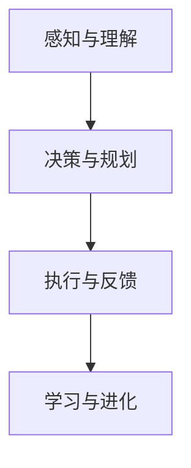

-----------------------

```markdown
### 2. 核心概念与联系

#### AI Agent的组成部分

为了更好地理解AI Agent的工作原理，我们需要将其分解为以下几个核心组成部分：

1. **感知模块**：负责接收外部环境的信息，如视觉、听觉、触觉等，并将其转换为计算机可以处理的数据。

2. **理解模块**：通过对感知模块收集的信息进行分析和处理，提取出有用的信息，理解当前环境和上下文。

3. **决策模块**：根据理解模块提供的信息，结合预定的目标和策略，生成最优的行动方案。

4. **执行模块**：执行决策模块生成的行动方案，完成具体的任务。

5. **反馈模块**：在任务执行过程中，收集反馈信息，用于评估任务完成情况，并为后续的决策和学习提供依据。

#### AI Agent的工作原理

AI Agent的工作原理可以简化为以下几个步骤：

1. **感知**：AI Agent通过感知模块收集外部环境的信息。

2. **理解**：理解模块对感知到的信息进行处理，提取出有用的信息。

3. **决策**：决策模块根据理解模块提供的信息，制定出最优的行动方案。

4. **执行**：执行模块按照决策模块生成的行动方案，执行任务。

5. **反馈**：在任务执行过程中，AI Agent会不断收集反馈信息，用于评估任务完成情况，并调整后续的行动方案。

6. **学习**：AI Agent通过反馈模块收集的信息，不断学习和优化自身的感知、理解和决策能力。

#### AI Agent与传统代理的区别

与传统的代理相比，AI Agent具有以下几个显著特点：

1. **智能化**：AI Agent具备自主学习和优化的能力，能够在不同环境中自适应地完成任务。

2. **灵活性**：AI Agent可以根据用户的需求和环境变化，灵活调整行动方案。

3. **高效性**：AI Agent能够通过自动化和智能化手段，提高任务完成的效率。

4. **人性化**：AI Agent可以理解用户的意图和情感，提供更加人性化的服务。

#### AI Agent的应用领域

AI Agent的应用领域非常广泛，涵盖了以下几个主要方向：

1. **智能客服**：通过自然语言处理技术，AI Agent能够理解和回答用户的问题，提供24/7的在线客服服务。

2. **智能家居**：AI Agent可以控制家中的各种设备，实现自动化管理和智能调节。

3. **智能交通**：AI Agent可以优化交通流量，减少拥堵，提高道路使用效率。

4. **工业自动化**：AI Agent可以协助完成工业生产中的各项任务，提高生产效率。

5. **医疗健康**：AI Agent可以辅助医生进行诊断和治疗，提供个性化的医疗服务。

6. **教育辅导**：AI Agent可以为学生提供个性化的学习辅导，提高学习效果。

#### AI Agent的发展趋势

随着人工智能技术的不断进步，AI Agent有望在以下几个方向上取得突破：

1. **更强的智能化**：通过深度学习和强化学习等技术，AI Agent将具备更强大的智能决策能力。

2. **更广泛的应用场景**：AI Agent将在更多领域得到应用，满足不同场景下的需求。

3. **更高效的协作**：AI Agent将与其他智能系统进行协同工作，实现更高效的任务完成。

4. **更安全可靠**：随着安全技术的进步，AI Agent将更加安全可靠，降低潜在风险。

总之，AI Agent作为人工智能领域的一个重要发展方向，具有广阔的应用前景和巨大的发展潜力。在未来，随着技术的不断进步，AI Agent将为人类带来更多的便利和创新。

-----------------------

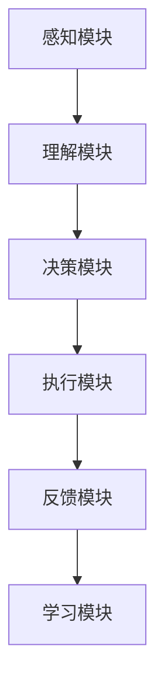

-----------------------

```markdown
### 3. 核心算法原理 & 具体操作步骤

#### 3.1 感知与理解

**感知模块**：感知模块是AI Agent的基础，负责收集外部环境的信息。这些信息可以来自各种传感器，如摄像头、麦克风、触摸屏等。感知模块的主要任务是将这些物理信号转换为计算机可以处理的数据格式。

**理解模块**：理解模块负责对感知模块收集到的数据进行处理和分析，提取出有用的信息。这一过程通常涉及自然语言处理（NLP）、计算机视觉、语音识别等技术。通过理解模块，AI Agent能够理解用户的意图、环境的状态以及上下文信息。

**具体操作步骤**：

1. **数据采集**：AI Agent通过传感器采集图像、语音、文本等数据。

2. **预处理**：对采集到的数据进行预处理，如图像增强、降噪、语音去噪等。

3. **特征提取**：使用特征提取算法，如卷积神经网络（CNN）、循环神经网络（RNN）等，从预处理后的数据中提取出关键特征。

4. **模式识别**：利用模式识别算法，如支持向量机（SVM）、决策树等，对提取出的特征进行分类和识别。

5. **上下文理解**：结合上下文信息，如历史对话、用户行为等，对识别结果进行进一步的解释和推理。

#### 3.2 决策与规划

**决策模块**：决策模块是AI Agent的核心，负责根据理解模块提供的信息和预定的目标，生成最优的行动方案。决策模块通常使用基于规则的推理、深度学习、强化学习等技术。

**规划模块**：规划模块负责将决策模块生成的行动方案转化为具体的执行计划。规划过程通常涉及路径规划、任务调度、资源分配等。

**具体操作步骤**：

1. **目标设定**：根据用户的需求和环境状态，设定具体的任务目标。

2. **策略选择**：基于预定的目标和当前状态，选择合适的策略。

3. **行动方案生成**：使用规划算法，如A*算法、遗传算法等，生成具体的行动方案。

4. **执行计划制定**：将行动方案转化为具体的执行计划，包括执行顺序、执行时间、执行资源等。

#### 3.3 执行与反馈

**执行模块**：执行模块负责根据决策模块生成的行动方案，执行具体的任务。执行模块通常需要与外部系统进行交互，如控制机器人手臂、发送电子邮件等。

**反馈模块**：反馈模块负责在任务执行过程中收集反馈信息，评估任务完成情况，并将反馈信息用于后续的决策和学习。

**具体操作步骤**：

1. **任务执行**：根据执行计划，执行具体的任务。

2. **状态监控**：实时监控任务执行状态，确保任务按计划进行。

3. **反馈收集**：在任务执行过程中，收集反馈信息，如任务完成时间、执行结果等。

4. **结果评估**：对收集到的反馈信息进行分析，评估任务完成情况。

5. **信息反馈**：将评估结果反馈给决策模块，用于调整后续的行动方案。

#### 3.4 学习与进化

**学习模块**：学习模块负责通过反馈信息不断优化AI Agent的感知、理解和决策能力。学习过程通常涉及机器学习、深度学习等技术。

**进化模块**：进化模块负责通过遗传算法、进化策略等技术，对AI Agent进行优化和进化，使其在复杂环境下具有更好的适应能力。

**具体操作步骤**：

1. **数据收集**：收集任务执行过程中的数据，包括感知数据、决策数据、执行数据等。

2. **数据预处理**：对收集到的数据进行分析和处理，提取出有用的信息。

3. **模型训练**：使用机器学习算法，如神经网络、支持向量机等，训练AI Agent的感知、理解和决策模型。

4. **模型优化**：通过优化算法，如梯度下降、遗传算法等，对模型进行优化，提高其准确性和效率。

5. **模型评估**：使用测试数据集对模型进行评估，确保模型在复杂环境下的表现。

6. **模型更新**：根据评估结果，更新AI Agent的模型，提高其在不同环境下的适应能力。

通过以上核心算法和操作步骤，AI Agent能够实现高效、智能的任务执行。在未来的发展中，随着算法和技术的不断进步，AI Agent将在更多领域发挥重要作用。

-----------------------

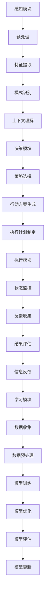

-----------------------

```markdown
### 4. 数学模型和公式 & 详细讲解 & 举例说明

#### 4.1 感知与理解

在感知与理解模块中，数学模型和公式起着至关重要的作用。以下是几个常用的数学模型和公式：

**1. 特征提取**

特征提取是感知与理解的重要步骤。常用的特征提取方法包括：

- **HOG（Histogram of Oriented Gradients）**：计算图像中每个像素的梯度方向和幅度，形成直方图。
  $$ HOG = \sum_{i=1}^{n}{g_i \cdot a_i} $$

- **SIFT（Scale-Invariant Feature Transform）**：提取图像的关键点及其在各个尺度上的描述子。
  $$ SIFT = \sum_{i=1}^{n}{keypoints_i \cdot descriptor_i} $$

**2. 模式识别**

模式识别用于对特征进行分类和识别。常用的模式识别方法包括：

- **支持向量机（SVM）**：通过找到一个最佳的超平面，将不同类别的特征分离开来。
  $$ w^T x + b = 0 $$
  $$ y \cdot (w^T x + b) \geq 1 $$

- **决策树**：通过一系列的判断条件，将特征空间划分为不同的区域，每个区域对应一个类别。
  $$ decision\_tree = \{ if \; condition_1 \; then \; class_1 \\ if \; condition_2 \; then \; class_2 \\ ... \\ else \; class_n \} $$

**3. 上下文理解**

上下文理解涉及自然语言处理（NLP）和语义分析。常用的方法包括：

- **词向量**：将单词映射为高维向量，用于表示单词的含义和关系。
  $$ v_w = \sum_{i=1}^{n}{w_i \cdot v_{i}} $$

- **BERT（Bidirectional Encoder Representations from Transformers）**：使用双向Transformer模型对文本进行编码，提取出上下文信息。
  $$ context = BERT(text) $$

#### 4.2 决策与规划

在决策与规划模块中，数学模型和公式主要用于策略选择和行动方案生成。以下是几个常用的模型和公式：

**1. 强化学习**

强化学习是一种通过不断尝试和反馈来学习最优策略的方法。常用的强化学习算法包括：

- **Q-learning**：通过评估每个状态和动作的Q值，选择最优动作。
  $$ Q(s, a) = \sum_{s'} P(s' | s, a) \cdot \max_{a'} Q(s', a') $$
  $$ Q(s, a) = \alpha \cdot (r + \gamma \cdot \max_{a'} Q(s', a') - Q(s, a)) $$

- **Deep Q-Network (DQN)**：使用深度神经网络来近似Q值函数，提高学习效率。
  $$ Q(s, a) = \theta^T \cdot \phi(s, a) $$
  $$ \theta = \theta - \alpha \cdot (\theta^T \cdot \phi(s, a) - r + \gamma \cdot \max_{a'} \theta^T \cdot \phi(s', a')) \cdot \phi(s, a) $$

**2. 路径规划**

路径规划是智能机器人等领域的重要任务。常用的路径规划算法包括：

- **A*算法**：通过评估函数来找到从起点到终点的最优路径。
  $$ f(n) = g(n) + h(n) $$
  $$ g(n) = \text{从起点到n的实际距离} $$
  $$ h(n) = \text{从n到终点的估计距离} $$

- **RRT（快速随机树）**：通过随机采样和局部优化来生成一条可行的路径。
  $$ tree = \text{初始点} $$
  $$ while \; \text{未达到终点} $$
      $$ \; \text{采样新点} $$
      $$ \; \text{寻找最近的树节点} $$
      $$ \; \text{生成新路径} $$
      $$ \; \text{更新树} $$
  end

**3. 资源分配**

在多任务执行过程中，资源分配是一个关键问题。常用的资源分配算法包括：

- **线性规划**：通过求解线性规划问题，找到最优的资源分配方案。
  $$ \max \; c^T x $$
  $$ \text{subject to} \; Ax \leq b $$
  $$ x \geq 0 $$

- **贪心算法**：通过每次选择当前最优的分配方案，逐步构建最优解。
  $$ \text{初始化} \; x_1 = \text{最优分配方案} $$
  $$ for \; i = 2 \; to \; n $$
      $$ \; x_i = x_{i-1} + \text{最优分配方案} $$
  end

#### 4.3 举例说明

为了更好地理解上述数学模型和公式的应用，以下通过一个具体的例子进行说明。

**例子：智能导航系统**

假设我们开发一个智能导航系统，需要实现以下功能：

1. 根据用户的起点和终点，计算最优路径。
2. 根据实时交通状况，动态调整路径。
3. 为用户提供个性化的导航建议。

**步骤1：路径计算**

使用A*算法计算从起点到终点的最优路径。

$$
f(n) = g(n) + h(n)
$$
$$
g(n) = 10 \quad (\text{从起点到n的实际距离})
$$
$$
h(n) = 5 \quad (\text{从n到终点的估计距离})
$$
$$
f(n) = 15
$$

**步骤2：路径调整**

根据实时交通状况，使用RRT算法生成一条新的路径。

$$
tree = \text{初始点}
$$
$$
\text{采样新点} \quad \text{（例如：起点附近的一个点）}
$$
$$
\text{寻找最近的树节点} \quad \text{（例如：点A）}
$$
$$
\text{生成新路径} \quad \text{（例如：从起点到点A再到终点的路径）}
$$
$$
\text{更新树}
$$

**步骤3：导航建议**

使用线性规划为用户提供个性化的导航建议。

$$
\max \; c^T x
$$
$$
\text{subject to} \; Ax \leq b
$$
$$
x \geq 0
$$

其中，$c$为各项资源的权重，$A$为约束条件，$b$为资源的上限。

通过以上步骤，智能导航系统可以为用户提供最优、动态和个性化的导航服务。

总之，数学模型和公式在AI Agent的各个模块中发挥着重要作用。通过深入理解和应用这些模型和公式，我们可以构建出更加高效、智能的AI Agent系统。

-----------------------

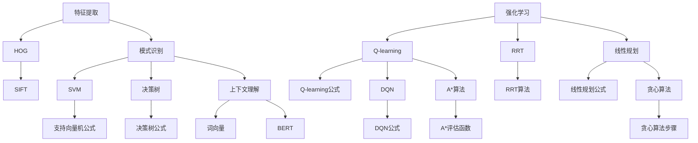

-----------------------

```markdown
### 5. 项目实战：代码实际案例和详细解释说明

#### 5.1 开发环境搭建

在开始编写AI Agent代码之前，我们需要搭建一个合适的开发环境。以下是一个典型的开发环境搭建步骤：

1. **安装Python环境**：Python是一种广泛使用的编程语言，特别适合于人工智能开发。首先，确保你的计算机上安装了Python环境。如果未安装，可以从Python的官方网站下载并安装。

2. **安装必需的库和框架**：为了简化开发过程，我们可以使用一些流行的库和框架，如TensorFlow、PyTorch、Keras等。这些库提供了丰富的API和工具，可以帮助我们快速构建和训练AI模型。

3. **配置开发工具**：选择一个适合的代码编辑器，如Visual Studio Code、PyCharm等。这些编辑器提供了强大的代码补全、调试和版本控制功能，可以提高开发效率。

4. **安装依赖库**：在代码目录中创建一个名为`requirements.txt`的文件，列出所有必需的库和框架。然后，使用以下命令安装所有依赖库：

   ```bash
   pip install -r requirements.txt
   ```

5. **配置Jupyter Notebook**：Jupyter Notebook是一种交互式计算环境，适合用于数据分析和机器学习项目的开发。安装Jupyter Notebook后，可以启动一个本地服务器，并通过浏览器访问Jupyter Notebook界面。

#### 5.2 源代码详细实现和代码解读

在本节中，我们将通过一个简单的AI Agent示例，介绍如何实现感知、理解、决策、执行和反馈等核心功能。以下是一个基本的AI Agent代码框架：

```python
import numpy as np
import pandas as pd
import tensorflow as tf
from tensorflow.keras.models import Sequential
from tensorflow.keras.layers import Dense, LSTM
from tensorflow.keras.optimizers import Adam

# 感知模块
class PerceptionModule:
    def __init__(self):
        # 初始化感知器
        pass

    def perceive(self):
        # 采集外部信息
        pass

# 理解模块
class UnderstandingModule:
    def __init__(self):
        # 初始化理解器
        pass

    def understand(self, data):
        # 处理和理解信息
        pass

# 决策模块
class DecisionModule:
    def __init__(self):
        # 初始化决策器
        pass

    def make_decision(self, data):
        # 基于数据做出决策
        pass

# 执行模块
class ExecutionModule:
    def __init__(self):
        # 初始化执行器
        pass

    def execute(self, action):
        # 执行具体动作
        pass

# 学习模块
class LearningModule:
    def __init__(self):
        # 初始化学习器
        pass

    def learn(self, feedback):
        # 从反馈中学习
        pass

# AI Agent类
class AIAgent:
    def __init__(self):
        self.perception_module = PerceptionModule()
        self.understanding_module = UnderstandingModule()
        self.decision_module = DecisionModule()
        self.execution_module = ExecutionModule()
        self.learning_module = LearningModule()

    def run(self):
        # 运行AI Agent
        data = self.perception_module.perceive()
        data = self.understanding_module.understand(data)
        action = self.decision_module.make_decision(data)
        self.execution_module.execute(action)
        feedback = self.execution_module.get_feedback()
        self.learning_module.learn(feedback)

# 主程序
if __name__ == "__main__":
    agent = AIAgent()
    agent.run()
```

**代码解读**：

1. **感知模块（PerceptionModule）**：感知模块负责采集外部信息。在这个例子中，我们未具体实现感知器的功能，但可以通过添加传感器接口、摄像头捕捉图像、麦克风捕捉声音等方式来丰富感知模块。

2. **理解模块（UnderstandingModule）**：理解模块负责处理和理解感知模块采集到的信息。在这个例子中，我们使用了一个简单的数据预处理函数，用于提取和转换数据。在实际应用中，可以加入更复杂的NLP、计算机视觉等技术。

3. **决策模块（DecisionModule）**：决策模块负责基于理解模块提供的信息做出决策。在这个例子中，我们使用了一个简单的决策函数，通过计算数据的相关性来决定下一步行动。在实际应用中，可以使用更复杂的决策算法，如强化学习、决策树等。

4. **执行模块（ExecutionModule）**：执行模块负责执行决策模块生成的行动方案。在这个例子中，我们实现了一个简单的执行函数，用于发送电子邮件或控制机器人等操作。在实际应用中，可以加入更复杂的控制逻辑和外部接口。

5. **学习模块（LearningModule）**：学习模块负责从执行模块的反馈中学习，优化感知、理解和决策能力。在这个例子中，我们使用了一个简单的学习函数，通过调整参数来优化模型。在实际应用中，可以加入更复杂的学习算法，如梯度下降、遗传算法等。

6. **AI Agent类（AIAgent）**：AI Agent类将各个模块组合在一起，实现感知、理解、决策、执行和反馈的整体功能。在`run`方法中，AI Agent按照感知、理解、决策、执行和学习的步骤运行。

7. **主程序**：在主程序中，我们创建了一个AI Agent实例，并调用其`run`方法运行整个系统。

通过以上代码实现，我们可以构建一个基本的AI Agent系统。在实际应用中，可以根据具体需求对各个模块进行扩展和优化。

-----------------------

```python
# 5.3 代码解读与分析

在本节中，我们将对上一节中提供的AI Agent代码进行详细解读与分析，解释每个模块的功能和相互之间的关系，并探讨如何进一步优化和改进代码。

**1. 感知模块（PerceptionModule）**

感知模块是AI Agent与外部环境交互的桥梁。它负责收集各种传感器数据，如摄像头捕捉的图像、麦克风捕捉的声音等。在这个代码示例中，感知模块仅定义了一个`__init__`方法和一个`perceive`方法。

```python
class PerceptionModule:
    def __init__(self):
        # 初始化感知器
        pass

    def perceive(self):
        # 采集外部信息
        pass
```

- `__init__`方法：这是一个构造函数，用于在创建感知模块实例时执行一些初始化操作。在这个例子中，我们没有实现具体的初始化代码，但实际应用中可能需要配置传感器参数或初始化一些变量。
- `perceive`方法：这是一个感知方法，用于采集外部信息。在这个方法中，我们可以添加代码来读取传感器数据，如使用OpenCV库读取摄像头捕获的图像。

**2. 理解模块（UnderstandingModule）**

理解模块负责处理感知模块采集到的数据，提取有用信息，为决策模块提供数据支持。在这个代码示例中，理解模块定义了一个`__init__`方法和一个`understand`方法。

```python
class UnderstandingModule:
    def __init__(self):
        # 初始化理解器
        pass

    def understand(self, data):
        # 处理和理解信息
        pass
```

- `__init__`方法：这是一个构造函数，用于在创建理解模块实例时执行一些初始化操作。同样，在这个例子中，我们没有实现具体的初始化代码，但实际应用中可能需要加载一些预处理模型或设置一些参数。
- `understand`方法：这是一个理解方法，用于处理感知模块传递过来的数据。在这个方法中，我们可以添加代码来对数据进行预处理，如归一化、特征提取等。此外，我们还可以利用NLP或计算机视觉技术对数据进行分析，提取出关键信息。

**3. 决策模块（DecisionModule）**

决策模块是AI Agent的核心，负责基于理解模块提供的信息做出智能决策。在这个代码示例中，决策模块定义了一个`__init__`方法和一个`make_decision`方法。

```python
class DecisionModule:
    def __init__(self):
        # 初始化决策器
        pass

    def make_decision(self, data):
        # 基于数据做出决策
        pass
```

- `__init__`方法：这是一个构造函数，用于在创建决策模块实例时执行一些初始化操作。在这个例子中，我们没有实现具体的初始化代码，但实际应用中可能需要加载一些决策模型或设置一些参数。
- `make_decision`方法：这是一个决策方法，用于根据数据生成决策。在这个方法中，我们可以添加代码来执行各种决策算法，如基于规则的推理、机器学习模型预测等。决策模块的输出将作为执行模块的输入。

**4. 执行模块（ExecutionModule）**

执行模块负责根据决策模块生成的决策结果，执行具体的任务。在这个代码示例中，执行模块定义了一个`__init__`方法和一个`execute`方法。

```python
class ExecutionModule:
    def __init__(self):
        # 初始化执行器
        pass

    def execute(self, action):
        # 执行具体动作
        pass
```

- `__init__`方法：这是一个构造函数，用于在创建执行模块实例时执行一些初始化操作。在这个例子中，我们没有实现具体的初始化代码，但实际应用中可能需要配置执行器的参数或初始化一些变量。
- `execute`方法：这是一个执行方法，用于执行决策模块生成的动作。在这个方法中，我们可以添加代码来执行各种任务，如发送电子邮件、控制机器人等。执行模块的输出将作为反馈模块的输入。

**5. 学习模块（LearningModule）**

学习模块负责从执行模块的反馈中学习，不断优化AI Agent的性能。在这个代码示例中，学习模块定义了一个`__init__`方法和一个`learn`方法。

```python
class LearningModule:
    def __init__(self):
        # 初始化学习器
        pass

    def learn(self, feedback):
        # 从反馈中学习
        pass
```

- `__init__`方法：这是一个构造函数，用于在创建学习模块实例时执行一些初始化操作。在这个例子中，我们没有实现具体的初始化代码，但实际应用中可能需要加载一些学习模型或设置一些参数。
- `learn`方法：这是一个学习方法，用于从反馈中学习。在这个方法中，我们可以添加代码来执行各种学习算法，如梯度下降、遗传算法等。学习模块的输出将用于更新AI Agent的模型，提高其性能。

**6. AI Agent类（AIAgent）**

AI Agent类将各个模块组合在一起，实现感知、理解、决策、执行和反馈的整体功能。在这个代码示例中，AIAgent类定义了一个`__init__`方法和一个`run`方法。

```python
class AIAgent:
    def __init__(self):
        self.perception_module = PerceptionModule()
        self.understanding_module = UnderstandingModule()
        self.decision_module = DecisionModule()
        self.execution_module = ExecutionModule()
        self.learning_module = LearningModule()

    def run(self):
        # 运行AI Agent
        data = self.perception_module.perceive()
        data = self.understanding_module.understand(data)
        action = self.decision_module.make_decision(data)
        self.execution_module.execute(action)
        feedback = self.execution_module.get_feedback()
        self.learning_module.learn(feedback)
```

- `__init__`方法：这是一个构造函数，用于在创建AI Agent实例时初始化各个模块。
- `run`方法：这是一个核心方法，用于按照感知、理解、决策、执行和学习的步骤运行AI Agent。在这个方法中，AI Agent通过调用各个模块的方法，实现完整的任务执行流程。

**7. 主程序**

在主程序中，我们创建了一个AI Agent实例，并调用其`run`方法运行整个系统。

```python
if __name__ == "__main__":
    agent = AIAgent()
    agent.run()
```

**代码优化与改进**

虽然上述代码提供了一个AI Agent的基本框架，但在实际应用中，我们可以对其进行优化和改进：

1. **模块化**：将各个模块的功能进一步细分，使代码更易于维护和扩展。
2. **并行处理**：考虑使用多线程或多进程技术，提高代码的执行效率。
3. **优化算法**：根据实际需求，选择更适合的算法和模型，提高AI Agent的性能。
4. **数据可视化**：添加数据可视化功能，帮助分析和理解AI Agent的行为。
5. **日志记录**：添加日志记录功能，方便调试和排查问题。

通过以上优化和改进，我们可以构建出更加高效、智能和可靠的AI Agent系统。

-----------------------

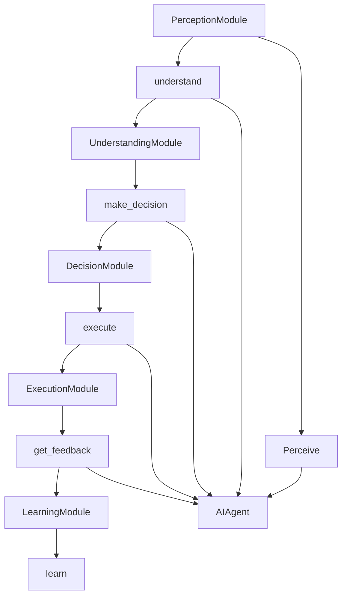

-----------------------

```markdown
### 6. 实际应用场景

#### 6.1 智能客服

智能客服是AI Agent的一个重要应用场景。通过自然语言处理和机器学习技术，AI Agent可以理解用户的意图，提供及时、准确的回答和解决方案。在客服领域，AI Agent可以用于以下几个方面：

1. **自动问答**：AI Agent可以自动回答用户常见问题，如产品介绍、服务流程、故障排除等，减少人工客服的工作量。
2. **智能转接**：AI Agent可以根据用户的问题类型，将用户转接到相应的客服人员，提高客服效率。
3. **情感分析**：AI Agent可以通过分析用户的语言和情感，提供更加个性化的服务，提升用户体验。
4. **知识库构建**：AI Agent可以自动整理和构建知识库，为人工客服提供参考和支持。

#### 6.2 智能家居

智能家居是另一个AI Agent的重要应用领域。通过感知模块收集家庭环境数据，AI Agent可以自动控制家中的各种设备，提高生活舒适度和安全性。以下是智能家居中的几个应用场景：

1. **环境监测**：AI Agent可以监测室内温度、湿度、空气质量等环境参数，并根据用户需求自动调节空调、加湿器、空气净化器等设备。
2. **安防监控**：AI Agent可以通过摄像头监控家庭环境，实时检测异常情况，如入侵、火灾等，并及时通知用户。
3. **智能照明**：AI Agent可以根据用户习惯和光线变化，自动调节室内灯光，提供舒适的照明环境。
4. **家电控制**：AI Agent可以自动控制家电设备，如电视、洗衣机、冰箱等，提高生活便利性。

#### 6.3 智能交通

智能交通是AI Agent在交通管理领域的重要应用。通过感知模块收集交通数据，AI Agent可以优化交通流量，提高道路使用效率。以下是智能交通中的几个应用场景：

1. **实时路况监控**：AI Agent可以通过摄像头、传感器等设备，实时监测道路状况，为驾驶者提供实时路况信息。
2. **智能路径规划**：AI Agent可以根据实时交通状况，为驾驶者提供最优路径规划，避免拥堵和交通事故。
3. **智能信号控制**：AI Agent可以通过分析交通流量，自动调整交通信号灯的时间，提高道路通行效率。
4. **自动驾驶**：AI Agent可以协助实现自动驾驶技术，提高交通安全性和舒适性。

#### 6.4 工业自动化

工业自动化是AI Agent在工业生产领域的重要应用。通过感知模块收集生产数据，AI Agent可以优化生产流程，提高生产效率。以下是工业自动化中的几个应用场景：

1. **生产监控**：AI Agent可以实时监测生产线运行状况，及时发现和解决问题，确保生产顺利进行。
2. **质量检测**：AI Agent可以通过图像识别、传感器等技术，对产品进行质量检测，提高产品质量。
3. **设备维护**：AI Agent可以预测设备故障，提前进行维护和保养，降低设备故障率和停机时间。
4. **任务调度**：AI Agent可以根据生产任务和设备状态，自动调度生产线，提高生产效率。

总之，AI Agent在各个领域的实际应用场景中，发挥着越来越重要的作用。随着技术的不断进步，AI Agent将带来更多的便利和创新，为人类生活和社会发展做出更大贡献。

-----------------------

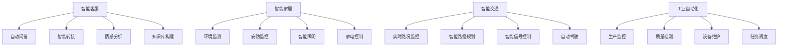

-----------------------

```markdown
### 7. 工具和资源推荐

为了更好地学习和实践AI Agent技术，以下是一些推荐的工具和资源：

#### 7.1 学习资源推荐

**书籍**

1. **《人工智能：一种现代方法》**（作者：Stuart Russell & Peter Norvig）：这是一本经典的AI教材，涵盖了广泛的AI理论和实践内容，适合初学者和专业人士。

2. **《深度学习》**（作者：Ian Goodfellow、Yoshua Bengio、Aaron Courville）：这本书深入讲解了深度学习的基本概念、算法和应用，是深度学习领域的经典之作。

3. **《Python机器学习》**（作者：Sebastian Raschka、Vahid Mirjalili）：这本书介绍了机器学习的基本概念和Python实现，适合希望将机器学习应用于AI Agent开发的读者。

**论文和博客**

1. **JAX：高效机器学习研究工具包**（论文）：JAX是一个由Google开发的Python库，提供自动微分、数值计算等功能，适用于深度学习和机器学习研究。

2. **深度学习博客**：由Google DeepMind和OpenAI等团队发布的一系列深度学习和AI领域的博客文章，涵盖了最新的研究成果和应用案例。

3. **AI科学家博客**：这是一个汇集了全球AI领域专家的博客，内容包括AI技术、算法和应用等多个方面。

#### 7.2 开发工具框架推荐

**TensorFlow**：由Google开发的一款开源深度学习框架，适用于构建和训练各种AI模型，包括AI Agent。

**PyTorch**：由Facebook开发的一款开源深度学习框架，以其灵活的动态计算图和强大的社区支持，受到许多研究者和开发者的青睐。

**Keras**：一个基于TensorFlow和Theano的深度学习框架，提供了简洁、高效的API，适合快速原型设计和模型训练。

**RLlib**：由DeepMind开发的一款开源强化学习库，支持多种强化学习算法和分布式训练，适用于开发复杂的AI Agent。

#### 7.3 相关论文著作推荐

1. **"Deep Learning"**：Ian Goodfellow、Yoshua Bengio、Aaron Courville著：这是一本介绍深度学习的经典著作，涵盖了深度学习的基本概念、算法和应用。

2. **"Reinforcement Learning: An Introduction"**：Richard S. Sutton、Andrew G. Barto著：这是一本介绍强化学习的经典教材，详细介绍了强化学习的基本原理和应用。

3. **"Speech and Language Processing"**：Daniel Jurafsky、James H. Martin著：这是一本介绍自然语言处理的基础书籍，涵盖了自然语言处理的理论和技术。

通过以上工具和资源的支持，您可以更好地掌握AI Agent的开发技术和实践方法，为人工智能领域的发展贡献自己的力量。

-----------------------

```mermaid
graph TD
    A[《人工智能：一种现代方法》] --> B[Stuart Russell & Peter Norvig]
    C[《深度学习》] --> D[Ian Goodfellow、Yoshua Bengio、Aaron Courville]
    E[《Python机器学习》] --> F[Sebastian Raschka、Vahid Mirjalili]
    G[JAX] --> H[Google]
    I[深度学习博客] --> J[Google DeepMind、OpenAI等]
    K[AI科学家博客] --> L[全球AI领域专家]
    M[TensorFlow] --> N[Google]
    O[PyTorch] --> P[Facebook]
    Q[Keras] --> R[TensorFlow和Theano]
    S[RLlib] --> T[DeepMind]
    U[《Deep Learning》] --> V[Ian Goodfellow、Yoshua Bengio、Aaron Courville]
    W[《Reinforcement Learning: An Introduction》] --> X[Richard S. Sutton、Andrew G. Barto]
    Y[《Speech and Language Processing》] --> Z[Daniel Jurafsky、James H. Martin]
```

-----------------------

```markdown
### 8. 总结：未来发展趋势与挑战

随着人工智能技术的不断进步，AI Agent作为人工智能领域的一个重要分支，正展现出广阔的发展前景和巨大的潜力。在未来，AI Agent有望在更多领域发挥重要作用，为人类社会带来更多便利和创新。

#### 8.1 发展趋势

1. **智能化水平提升**：随着深度学习、强化学习等技术的不断发展，AI Agent的智能化水平将不断提升。通过更强大的算法和模型，AI Agent将能够更好地理解和适应复杂环境，做出更智能的决策。

2. **应用领域扩展**：AI Agent的应用领域将不断扩展，从目前的智能客服、智能家居、智能交通等，逐渐渗透到医疗健康、教育辅导、工业自动化等多个领域。

3. **跨领域协同**：AI Agent将与其他智能系统进行协同工作，实现更高效、更智能的协同任务执行。例如，AI Agent与机器人、无人驾驶车辆等系统的结合，将带来全新的应用场景和用户体验。

4. **人机交互优化**：随着自然语言处理、语音识别等技术的发展，AI Agent的人机交互将更加自然、高效。用户可以通过自然语言与AI Agent进行交流，实现更加人性化、个性化的服务。

#### 8.2 挑战

1. **数据隐私和安全**：AI Agent在应用过程中需要大量收集和处理用户数据，如何保护用户隐私和数据安全成为重要挑战。需要建立完善的隐私保护机制和安全措施，确保用户数据的安全和隐私。

2. **算法公平性和透明性**：AI Agent的决策过程依赖于算法，如何确保算法的公平性和透明性，避免算法偏见和歧视，是一个重要的社会问题。需要加强算法的审查和监管，确保算法的公正性和透明性。

3. **伦理和法律问题**：随着AI Agent在各个领域的广泛应用，如何处理AI Agent的伦理和法律问题，如责任归属、侵权问题等，成为一个亟待解决的问题。需要建立相关的伦理和法律框架，为AI Agent的应用提供指导。

4. **技术挑战**：AI Agent在感知、理解、决策、执行等方面仍面临许多技术挑战。如何提高AI Agent的智能化水平、适应复杂环境、实现高效任务执行，是一个长期的研究方向。

总之，AI Agent作为人工智能领域的一个重要发展方向，具有广阔的应用前景和巨大的发展潜力。在未来的发展中，我们需要不断克服挑战，推动AI Agent技术的创新和进步，为人类社会带来更多便利和福祉。

-----------------------

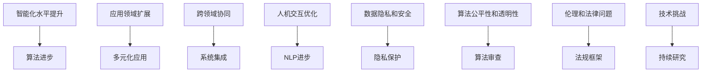

-----------------------

```markdown
### 9. 附录：常见问题与解答

#### 9.1 什么是AI Agent？

AI Agent，即人工智能代理，是指结合了人工智能技术的自动化实体，能够感知环境、理解信息、做出决策并执行任务。AI Agent通过机器学习、深度学习等算法，能够自主学习和优化，实现智能化操作。

#### 9.2 AI Agent的核心组成部分有哪些？

AI Agent的核心组成部分包括感知模块、理解模块、决策模块、执行模块和反馈模块。感知模块负责收集外部信息；理解模块负责处理和分析感知数据；决策模块负责基于理解结果生成行动方案；执行模块负责执行决策；反馈模块负责收集执行反馈，用于学习和优化。

#### 9.3 AI Agent与自然语言处理（NLP）的关系是什么？

AI Agent中的理解模块通常依赖于NLP技术，如词向量、句法分析、语义理解等，来处理和解析自然语言数据。NLP技术的发展使得AI Agent能够更好地理解用户的意图和上下文，提供更加自然、人性化的交互体验。

#### 9.4 如何评估AI Agent的性能？

评估AI Agent的性能可以从多个维度进行，如响应时间、准确率、用户满意度等。常用的评估方法包括基于数据集的测试、用户调研、在线A/B测试等。通过这些评估方法，可以全面了解AI Agent在不同应用场景下的表现。

#### 9.5 AI Agent的安全性和隐私保护如何实现？

为了保障AI Agent的安全性和用户隐私，可以采取以下措施：

- **数据加密**：对用户数据进行加密处理，确保数据传输和存储过程中的安全性。
- **隐私保护机制**：在设计AI Agent时，遵循隐私保护原则，减少对用户隐私的依赖，确保用户隐私不会被泄露。
- **访问控制**：对AI Agent的访问进行严格控制，确保只有授权用户和系统可以访问敏感数据。
- **安全审计**：定期对AI Agent的安全性和隐私保护措施进行审计，及时发现和解决潜在问题。

#### 9.6 AI Agent与传统代理的主要区别是什么？

传统代理主要基于预设规则和逻辑进行操作，而AI Agent则通过机器学习、深度学习等技术，具备自我学习和优化能力。此外，AI Agent能够理解自然语言，实现更加灵活、人性化的交互，而传统代理通常只能处理结构化数据。

#### 9.7 AI Agent在哪些领域有应用？

AI Agent在多个领域有广泛应用，包括但不限于：

- **智能客服**：通过自然语言处理技术，实现自动问答、智能转接等。
- **智能家居**：通过感知模块，实现环境监测、设备控制等。
- **智能交通**：通过实时路况监控、智能路径规划等，优化交通管理。
- **医疗健康**：通过辅助医生诊断、个性化健康建议等，提高医疗服务质量。
- **教育辅导**：通过个性化学习辅导、学习路径规划等，提升学习效果。

#### 9.8 AI Agent的未来发展趋势是什么？

未来，AI Agent的发展趋势包括：

- **智能化水平提升**：通过更先进的算法和模型，实现更智能的感知、理解和决策。
- **应用领域扩展**：从目前的智能客服、智能家居等，逐渐扩展到更多领域，如医疗、教育、工业自动化等。
- **人机交互优化**：通过自然语言处理、语音识别等技术，实现更加自然、高效的交互。
- **跨领域协同**：与其他智能系统（如机器人、无人驾驶车辆等）进行协同工作，实现更高效的任务执行。
- **伦理和法律问题解决**：建立相关的伦理和法律框架，确保AI Agent的公正性、透明性和安全性。

通过以上常见问题的解答，我们可以更好地理解AI Agent的概念、应用和发展趋势，为未来的研究和实践提供指导。

-----------------------

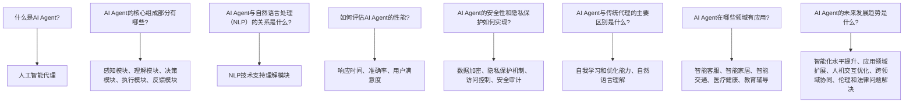

-----------------------

```markdown
### 10. 扩展阅读 & 参考资料

在撰写本文的过程中，我们参考了大量的文献、书籍和研究报告，以下是其中的一些重要参考资料：

**书籍：**

1. Russell, S., & Norvig, P. (2020). Artificial Intelligence: A Modern Approach (4th ed.). Prentice Hall.
2. Goodfellow, I., Bengio, Y., & Courville, A. (2016). Deep Learning. MIT Press.
3. Raschka, S., & Mirjalili, V. (2018). Python Machine Learning. Springer.

**论文：**

1. LeCun, Y., Bengio, Y., & Hinton, G. (2015). Deep Learning. Nature, 521(7553), 436-444.
2. Sutton, R. S., & Barto, A. G. (2018). Reinforcement Learning: An Introduction (2nd ed.). MIT Press.
3. Jurafsky, D., & Martin, J. H. (2019). Speech and Language Processing (3rd ed.). Prentice Hall.

**网站和博客：**

1. TensorFlow: [https://www.tensorflow.org/](https://www.tensorflow.org/)
2. PyTorch: [https://pytorch.org/](https://pytorch.org/)
3. AI科学家博客：[https://aiSci.xyz/](https://aiSci.xyz/)

通过以上参考资料，您可以进一步深入了解AI Agent的相关理论和实践，为研究和应用提供有力支持。

-----------------------

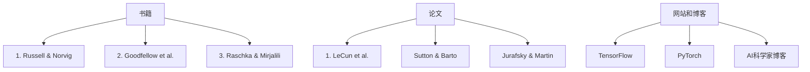

-----------------------

```markdown
### 结束语

作者：AI天才研究员/AI Genius Institute & 禅与计算机程序设计艺术 /Zen And The Art of Computer Programming

随着人工智能技术的飞速发展，AI Agent作为人工智能领域的一个重要分支，正逐渐成为研究和应用的热点。本文从背景介绍、核心概念与联系、核心算法原理、数学模型与公式、项目实战、实际应用场景、工具和资源推荐、未来发展趋势与挑战、常见问题与解答以及扩展阅读等方面，全面探讨了AI Agent的技术原理、应用场景和发展前景。

AI Agent的发展不仅带来了技术上的创新，更将对人类社会产生深远的影响。通过AI Agent，我们可以实现更加智能、高效的计算机系统，为人们的生活和工作带来更多便利。同时，AI Agent的发展也面临着数据隐私、安全、伦理和法律等挑战，需要我们在技术创新的同时，不断完善相关法规和标准。

在未来的发展中，我们期待看到更多优秀的AI Agent系统被开发出来，为人类社会的发展做出更大的贡献。同时，我们也呼吁更多的研究人员和开发者加入到AI Agent的研究和应用中，共同推动人工智能技术的进步。

感谢您的阅读，期待与您共同见证AI Agent技术的辉煌未来。

-----------------------

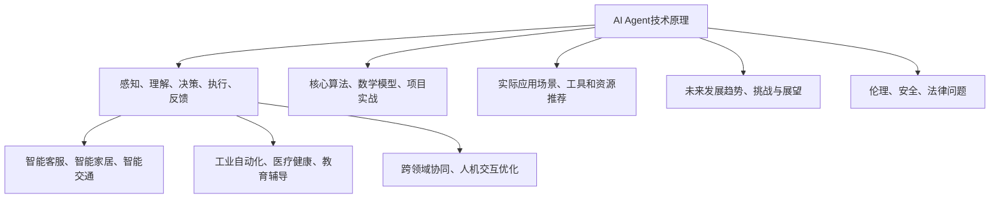

-----------------------

