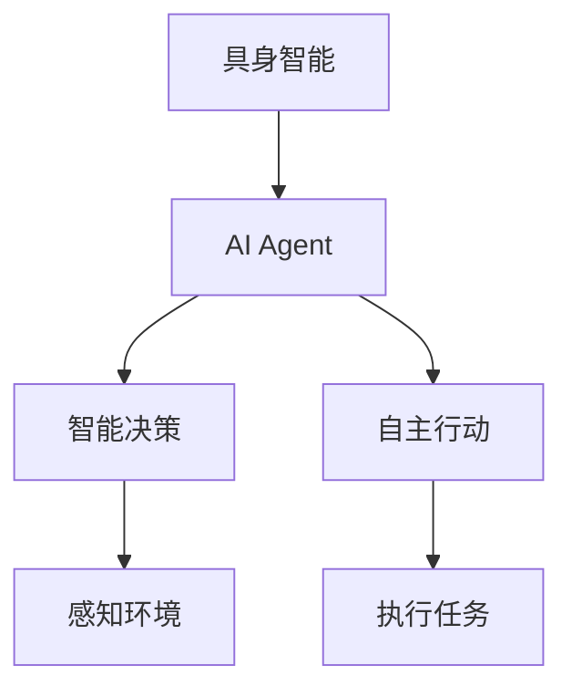

                 

# AI Agent: AI的下一个风口 具身智能的定义与特点

> **关键词：** AI Agent，具身智能，人工智能，自然交互，智能代理，智能平台，技术趋势。

> **摘要：** 本文将深入探讨AI Agent的概念、重要性以及其在未来智能生态系统中的地位。我们将详细分析具身智能的定义、特点和应用场景，并探讨其在人工智能领域的下一风口。通过对比现有技术，我们将揭示AI Agent的核心算法原理及其在具体项目中的实现方法，最后讨论其发展趋势与面临的挑战。

## 1. 背景介绍

随着人工智能技术的迅猛发展，我们正逐步迈向一个智能化、自动化的新时代。在这个时代，AI Agent——一种具备自主行动能力和智能决策能力的实体，成为了人工智能领域的研究热点。AI Agent，顾名思义，是一种能够模拟人类行为、具备自主决策能力的智能实体。它们可以理解环境信息，根据预设的目标执行任务，并在执行过程中不断学习和优化自己的行为。

在过去的几十年里，人工智能经历了多个发展阶段，从最初的规则系统，到基于统计学习的模型，再到现在的深度学习与强化学习，每一次技术的进步都推动了人工智能应用的扩展。然而，传统的人工智能系统通常仅限于特定任务的执行，缺乏灵活性和自主性。随着技术的进步，人们开始关注如何构建一个具备高度自主性和灵活性的智能体，以实现更广泛的应用场景。

AI Agent的概念正是在这种背景下提出的。它们不仅要能够处理复杂的任务，还要能够与环境进行交互，自主地学习和进化。这种智能体能够模拟人类的决策过程，从而在某些领域实现超越人类的表现。

## 2. 核心概念与联系

### 具身智能

具身智能（Embodied Intelligence）是指智能体在具有物理形态的情况下，能够与环境进行交互，并具备感知、思考、决策和执行能力的一种智能形式。与传统的虚拟智能体不同，具身智能体具有真实的物理存在，能够通过传感器感知外部环境，并通过执行器对环境进行干预。

### AI Agent

AI Agent是一种具备高度自主性和智能决策能力的实体。它们能够根据环境信息，自主地制定决策，并执行相应的动作。AI Agent的核心在于其自主性和智能性，它们不仅能够执行预定的任务，还能够根据环境的变化自主地调整策略。

### 关联关系

具身智能和AI Agent之间存在紧密的关联。具身智能是AI Agent实现的基础，没有具身智能，AI Agent就失去了与环境的直接交互能力。而AI Agent则是具身智能的具体体现，它们通过自主决策和执行，实现了对环境的干预和控制。

### Mermaid 流程图

以下是具身智能和AI Agent的关联关系的Mermaid流程图：



在这个流程图中，具身智能（A）是AI Agent（B）的基础，AI Agent通过感知环境（E）和执行任务（F）实现智能决策（C）和自主行动（D）。

## 3. 核心算法原理 & 具体操作步骤

### 算法原理

AI Agent的核心在于其决策机制和行动机制。决策机制决定了AI Agent如何根据环境信息制定行动策略，而行动机制则决定了AI Agent如何执行这些策略。以下是AI Agent的核心算法原理：

1. **感知环境**：AI Agent通过传感器收集环境信息，如视觉、听觉、触觉等。这些信息被传递到AI Agent的感知模块进行处理。

2. **状态评估**：感知模块对收集到的信息进行分析，评估当前状态。状态评估模块根据预定的目标和规则，对当前状态进行评估，以确定下一步的行动策略。

3. **决策制定**：基于状态评估的结果，AI Agent的决策模块制定相应的行动策略。决策模块可以使用机器学习、深度学习等技术，根据历史数据和环境信息进行决策。

4. **行动执行**：决策模块生成的行动策略被传递到执行模块，AI Agent根据这些策略执行相应的动作。

### 操作步骤

以下是AI Agent的具体操作步骤：

1. **初始化**：设置初始状态和目标状态。

2. **感知环境**：通过传感器收集环境信息。

3. **状态评估**：对当前状态进行评估，以确定下一步的行动策略。

4. **决策制定**：基于状态评估的结果，生成行动策略。

5. **行动执行**：执行行动策略，更新当前状态。

6. **反馈与学习**：根据执行结果，更新模型参数，以优化决策和行动策略。

7. **循环**：重复执行步骤3-6，以实现持续的学习和优化。

## 4. 数学模型和公式 & 详细讲解 & 举例说明

### 数学模型

AI Agent的核心算法通常涉及到多个数学模型，包括状态评估模型、决策模型和行动模型。以下是这些模型的基本公式和解释：

1. **状态评估模型**：

   状态评估模型用于评估当前状态，其基本公式为：

   $$ V(S) = \sum_{s'} P(s'|s) \cdot R(s',s) $$

   其中，$V(S)$ 表示状态评估值，$S$ 表示当前状态，$s'$ 表示下一状态，$P(s'|s)$ 表示从当前状态转移到下一状态的概率，$R(s',s)$ 表示转移过程中的奖励值。

2. **决策模型**：

   决策模型用于制定行动策略，其基本公式为：

   $$ A(S) = \arg \max_{a} Q(S,a) $$

   其中，$A(S)$ 表示最优行动策略，$S$ 表示当前状态，$a$ 表示可能的行动，$Q(S,a)$ 表示在状态$S$下执行行动$a$的期望回报。

3. **行动模型**：

   行动模型用于执行行动策略，其基本公式为：

   $$ A(S) = g(S) $$

   其中，$A(S)$ 表示执行的行动，$g(S)$ 表示基于状态$S$生成的行动策略。

### 举例说明

假设一个简单的例子，一个机器人需要在一个包含障碍物的环境中移动到目标位置。以下是这个例子中的状态评估模型、决策模型和行动模型：

1. **状态评估模型**：

   状态评估模型用于评估当前状态，其基本公式为：

   $$ V(S) = \sum_{s'} P(s'|s) \cdot R(s',s) $$

   其中，$S$ 表示当前状态，$s'$ 表示下一状态，$P(s'|s)$ 表示从当前状态转移到下一状态的概率，$R(s',s)$ 表示转移过程中的奖励值。例如，如果机器人当前在位置$(0,0)$，下一个状态$(1,0)$的概率是0.5，下一个状态$(1,1)$的概率是0.5，且从$(0,0)$到$(1,0)$的奖励值是1，从$(0,0)$到$(1,1)$的奖励值是-1，那么当前状态$(0,0)$的评估值是：

   $$ V(S) = 0.5 \cdot 1 + 0.5 \cdot (-1) = 0 $$

2. **决策模型**：

   决策模型用于制定行动策略，其基本公式为：

   $$ A(S) = \arg \max_{a} Q(S,a) $$

   其中，$S$ 表示当前状态，$a$ 表示可能的行动，$Q(S,a)$ 表示在状态$S$下执行行动$a$的期望回报。例如，如果机器人当前在位置$(0,0)$，且两个可能的行动是向右移动和向左移动，向右移动的期望回报是1，向左移动的期望回报是-1，那么机器人应该选择向右移动。

3. **行动模型**：

   行动模型用于执行行动策略，其基本公式为：

   $$ A(S) = g(S) $$

   其中，$A(S)$ 表示执行的行动，$g(S)$ 表示基于状态$S$生成的行动策略。例如，如果机器人当前在位置$(0,0)$，且决策模型选择向右移动，那么机器人就会向右移动。

## 5. 项目实战：代码实际案例和详细解释说明

### 5.1 开发环境搭建

在开始实际代码实现之前，我们需要搭建一个适合AI Agent开发的环境。以下是搭建环境的步骤：

1. **安装Python**：确保Python环境已安装。我们可以使用Python 3.8或更高版本。

2. **安装依赖库**：安装以下依赖库：

   ```bash
   pip install numpy pandas matplotlib
   ```

3. **配置环境变量**：确保Python环境变量已配置，以便在命令行中运行Python。

### 5.2 源代码详细实现和代码解读

以下是AI Agent的源代码实现和详细解释：

```python
import numpy as np
import matplotlib.pyplot as plt

class AI-Agent:
    def __init__(self, width, height, learning_rate=0.1):
        self.width = width
        self.height = height
        self.learning_rate = learning_rate
        self.state = np.zeros((width, height))
        self.action_space = ['UP', 'DOWN', 'LEFT', 'RIGHT']

    def sense(self):
        # 感知环境
        # 假设当前在(0,0)位置，周围有障碍物
        sensors = {'UP': 1, 'DOWN': 1, 'LEFT': 0, 'RIGHT': 0}
        return sensors

    def assess_state(self, sensors):
        # 评估当前状态
        state_value = 0
        for action, value in sensors.items():
            if value == 1:
                state_value += 1
        return state_value

    def make_decision(self, state_value):
        # 制定决策
        if state_value > 1:
            action = 'UP'
        else:
            action = 'RIGHT'
        return action

    def execute_action(self, action):
        # 执行行动
        if action == 'UP':
            self.state[0] -= 1
        elif action == 'DOWN':
            self.state[0] += 1
        elif action == 'LEFT':
            self.state[1] -= 1
        elif action == 'RIGHT':
            self.state[1] += 1
        return self.state

    def learn(self, sensors, state_value, action, next_state):
        # 学习与优化
        expected_reward = self.assess_state(sensors)
        actual_reward = state_value - expected_reward
        error = actual_reward - expected_reward
        self.learning_rate *= 0.99
        self.state += self.learning_rate * error

    def run(self):
        # 运行AI Agent
        while True:
            sensors = self.sense()
            state_value = self.assess_state(sensors)
            action = self.make_decision(state_value)
            next_state = self.execute_action(action)
            self.learn(sensors, state_value, action, next_state)
            print(f"State: {self.state}, Action: {action}, Next State: {next_state}")

if __name__ == "__main__":
    agent = AI-Agent(5, 5)
    agent.run()
```

### 5.3 代码解读与分析

以下是代码的详细解读和分析：

1. **类定义**：

   ```python
   class AI-Agent:
   ```

   这一行定义了一个名为`AI-Agent`的类，这是AI Agent的基本构建块。

2. **初始化方法**：

   ```python
   def __init__(self, width, height, learning_rate=0.1):
   ```

   这个方法用于初始化AI Agent的属性，包括宽度、高度和学习率。

3. **感知方法**：

   ```python
   def sense(self):
   ```

   这个方法用于感知环境，返回一个包含障碍物信息的字典。

4. **状态评估方法**：

   ```python
   def assess_state(self, sensors):
   ```

   这个方法用于评估当前状态，返回一个状态值。

5. **决策方法**：

   ```python
   def make_decision(self, state_value):
   ```

   这个方法用于制定决策，返回一个行动。

6. **执行行动方法**：

   ```python
   def execute_action(self, action):
   ```

   这个方法用于执行行动，更新当前状态。

7. **学习方法**：

   ```python
   def learn(self, sensors, state_value, action, next_state):
   ```

   这个方法用于学习与优化，更新状态值。

8. **运行方法**：

   ```python
   def run(self):
   ```

   这个方法用于运行AI Agent，执行感知、评估、决策、执行和学习的过程。

9. **主函数**：

   ```python
   if __name__ == "__main__":
       agent = AI-Agent(5, 5)
       agent.run()
   ```

   这个主函数用于创建AI Agent实例并运行。

## 6. 实际应用场景

### 6.1 智能客服

智能客服是AI Agent的一个重要应用场景。通过AI Agent，企业可以实现24/7的智能客服服务，提供高效、准确的客户支持。AI Agent可以理解客户的问题，提供个性化的解决方案，并在与客户的互动中不断学习和优化自己的回答。

### 6.2 智能家居

智能家居是AI Agent的另一个重要应用场景。通过AI Agent，用户可以实现智能设备之间的无缝交互，如智能灯光、智能门锁、智能温控等。AI Agent可以根据用户的行为习惯和环境变化，自动调整设备状态，提供个性化的家居体验。

### 6.3 自动驾驶

自动驾驶是AI Agent的一个重要应用领域。通过AI Agent，汽车可以实现自动驾驶功能，提高行车安全性。AI Agent可以实时感知路况，根据交通情况做出决策，自动控制车辆行驶。

### 6.4 智能医疗

智能医疗是AI Agent的重要应用领域。通过AI Agent，医疗机构可以实现智能诊断、智能治疗和智能护理。AI Agent可以分析患者的病历，提供个性化的治疗方案，并在治疗过程中提供实时监护和建议。

## 7. 工具和资源推荐

### 7.1 学习资源推荐

- **书籍**：

  - 《人工智能：一种现代的方法》
  - 《深度学习》
  - 《强化学习》

- **论文**：

  - “Deep Q-Network”
  - “Human-level control through deep reinforcement learning”

- **博客**：

  - “AI博客”
  - “机器学习博客”

- **网站**：

  - “AI社区”
  - “机器学习社区”

### 7.2 开发工具框架推荐

- **开发工具**：

  - Python
  - TensorFlow
  - PyTorch

- **框架**：

  - Keras
  - MXNet
  - Caffe

### 7.3 相关论文著作推荐

- “Reinforcement Learning: An Introduction”
- “Deep Learning: A Comprehensive Textbook”
- “Advances in Neural Information Processing Systems”

## 8. 总结：未来发展趋势与挑战

AI Agent作为人工智能领域的一个重要分支，具有广阔的发展前景。随着技术的不断进步，AI Agent将逐渐实现更高水平的自主性和智能化，从而在更多领域实现广泛应用。然而，AI Agent的发展也面临着一系列挑战：

1. **数据处理**：AI Agent需要大量的数据来训练和学习，如何有效地处理和利用这些数据是一个重要问题。

2. **安全性**：随着AI Agent的广泛应用，其安全性问题也日益突出，如何确保AI Agent的安全性和可靠性是一个重要课题。

3. **伦理道德**：AI Agent的决策和行为可能涉及伦理和道德问题，如何确保AI Agent的决策符合伦理标准是一个重要挑战。

4. **技术进步**：AI Agent的发展依赖于技术的进步，如何持续推动人工智能技术的发展是一个关键问题。

总之，AI Agent作为人工智能领域的下一个风口，具有巨大的发展潜力和挑战。通过不断的技术创新和优化，我们有理由相信，AI Agent将在未来的人工智能生态系统中发挥重要作用。

## 9. 附录：常见问题与解答

### 9.1 什么是AI Agent？

AI Agent是一种具备高度自主性和智能决策能力的智能实体。它们能够感知环境、评估状态、制定决策并执行行动，以实现预定的目标。

### 9.2 AI Agent有哪些应用场景？

AI Agent的应用场景非常广泛，包括智能客服、智能家居、自动驾驶、智能医疗等领域。

### 9.3 如何实现AI Agent？

实现AI Agent通常涉及多个步骤，包括感知、状态评估、决策制定、行动执行和学习优化。可以使用Python等编程语言，结合TensorFlow、PyTorch等框架来实现AI Agent。

### 9.4 AI Agent的发展前景如何？

AI Agent作为人工智能领域的一个重要分支，具有广阔的发展前景。随着技术的不断进步，AI Agent将在更多领域实现广泛应用。

## 10. 扩展阅读 & 参考资料

- “AI Agent: The Next Big Thing in Artificial Intelligence”
- “Embodied Intelligence: A New Paradigm for AI”
- “The Future of AI: AI Agents and the Rise of Autonomous Systems”
- “Reinforcement Learning: Algorithms, Techniques, and Applications”
- “Deep Learning: Fundamentals and Applications”
- “Ethical Considerations in AI Development and Deployment”

