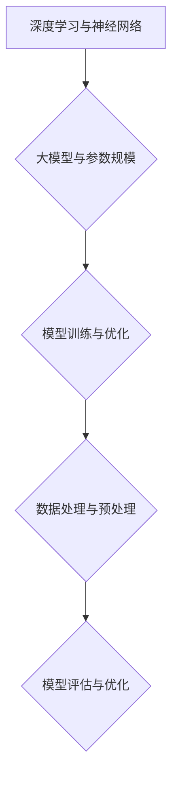

                 

### 背景介绍

《AI Agent: AI的下一个风口 大模型时代的AI》这一主题旨在探讨人工智能（AI）领域中的一个新兴热点——大模型时代的AI。随着深度学习技术的不断演进，AI模型规模和复杂度显著增加，大模型的应用逐渐成为业界关注的焦点。

#### AI的发展历程

人工智能作为计算机科学的一个分支，自20世纪50年代诞生以来，经历了多个发展阶段。从最初的符号逻辑和知识表示，到基于规则的专家系统，再到基于神经网络的机器学习，每个阶段都为AI技术的进步奠定了基础。近年来，随着计算能力的提升和大数据的广泛应用，深度学习技术取得了突破性进展，极大地推动了AI的快速发展。

#### 大模型的概念与重要性

大模型，指的是具有数亿甚至千亿参数的深度学习模型。这类模型能够通过大量数据的学习，实现高度复杂的任务，如自然语言处理、图像识别、语音识别等。大模型的重要性体现在以下几个方面：

1. **更强的泛化能力**：大模型可以处理更加复杂的任务，并且在各种不同的场景下表现出色。
2. **更高的效率**：大模型可以显著提高AI算法的运行速度，降低计算成本。
3. **更好的可解释性**：大模型可以通过结构化和可视化的方式，提高AI算法的可解释性，使其更加透明和可信。
4. **更广泛的应用**：大模型的应用范围不断扩展，从传统的工业自动化、医疗诊断，到新兴的智能客服、智能金融等，都取得了显著的成果。

#### 当前研究的现状与挑战

尽管大模型技术取得了显著进展，但同时也面临着一些挑战：

1. **计算资源需求**：大模型的训练和推理需要庞大的计算资源，这对硬件设备和能源消耗提出了更高的要求。
2. **数据隐私和安全**：大模型需要大量数据来训练，如何在保护用户隐私的同时充分利用数据资源，成为亟待解决的问题。
3. **模型的可解释性**：大模型通常被视为“黑箱”，其内部决策过程难以解释，这对模型的可靠性和安全性提出了挑战。

### 核心概念与联系

为了更好地理解大模型时代的AI，我们需要掌握几个核心概念，并了解它们之间的联系。

#### 1. 深度学习与神经网络

深度学习是机器学习的一个分支，主要基于多层神经网络（Neural Network）进行模型训练。神经网络是由大量简单神经元组成的计算模型，通过层层传递信息，实现复杂函数的映射。

#### 2. 大模型与参数规模

大模型的参数规模通常达到数亿甚至千亿级别，这使得它们可以处理更为复杂的任务，同时也增加了模型的计算和存储需求。

#### 3. 模型训练与优化

模型训练是通过大量数据对神经网络参数进行调整，以最小化预测误差。优化算法如梯度下降（Gradient Descent）和随机梯度下降（Stochastic Gradient Descent）是模型训练的核心方法。

#### 4. 数据处理与预处理

数据处理与预处理是模型训练的基础，包括数据清洗、归一化、数据增强等步骤。有效的数据处理与预处理可以提高模型训练的效果。

#### 5. 模型评估与优化

模型评估是衡量模型性能的重要步骤，常用的评估指标包括准确率、召回率、F1值等。通过模型评估，可以找出模型的不足之处，并进行优化。

#### Mermaid 流程图



通过上述核心概念的联系，我们可以看出大模型时代的AI是一个复杂而多层次的技术体系，涵盖了从数据预处理到模型训练、优化和评估的整个流程。

接下来，我们将深入探讨大模型的核心算法原理，并详细讲解其具体操作步骤。让我们一步一步地分析推理，以理解大模型在AI领域的应用和潜力。

#### 核心算法原理 & 具体操作步骤

在了解了大模型的基本概念之后，我们接下来将探讨其核心算法原理，并详细讲解具体操作步骤。大模型的核心算法通常是基于深度学习技术，包括神经网络架构、训练策略、优化方法等方面。以下是一个详细的解析：

##### 1. 神经网络架构

神经网络（Neural Network，NN）是深度学习的基础，它由大量简单的计算单元——神经元组成。一个典型的神经网络包括输入层、隐藏层和输出层。每个神经元与相邻层的神经元相连，通过权重（weight）和偏置（bias）进行加权求和，再通过激活函数（activation function）进行非线性变换。

神经网络架构的设计对模型的性能至关重要。深度和宽度是两个关键参数。深度决定了网络的结构层次，深度越大，模型可以捕捉到更加复杂的信息。宽度则决定了每层神经元的数量，宽度越大，模型的计算能力和存储需求也相应增加。

##### 2. 模型训练策略

模型训练是神经网络的核心步骤，其目标是调整网络的权重和偏置，使模型能够准确预测未知数据。训练策略通常包括以下步骤：

- **前向传播（Forward Propagation）**：将输入数据传递通过神经网络，计算输出值。前向传播过程中，每个神经元的输出值是通过输入值、权重和偏置的加权和，再经过激活函数计算得到的。

- **计算损失（Compute Loss）**：输出值与真实值之间的差异称为损失（loss）。常用的损失函数包括均方误差（MSE，Mean Squared Error）和交叉熵（Cross-Entropy）。损失函数的目的是衡量模型预测的准确性。

- **反向传播（Back Propagation）**：计算损失函数关于网络参数的梯度，并更新参数值。反向传播是神经网络训练的核心步骤，它通过反向计算误差梯度，逐层更新权重和偏置，以达到最小化损失函数的目的。

- **优化算法（Optimization Algorithm）**：优化算法用于调整网络参数，以最小化损失函数。常见的优化算法包括梯度下降（Gradient Descent，GD）、随机梯度下降（Stochastic Gradient Descent，SGD）和Adam优化器。这些算法通过迭代更新参数，使模型逐渐收敛到最优解。

##### 3. 大模型的训练与优化

大模型的训练和优化面临着更高的计算和存储需求，因此需要特殊的策略和技巧。以下是一些关键步骤：

- **数据预处理（Data Preprocessing）**：对训练数据集进行清洗、归一化和数据增强等操作，以提高模型训练的效果。

- **批量大小（Batch Size）**：批量大小是每次训练时参与计算的样本数量。批量大小会影响模型训练的速度和效果。较小的批量大小可以提高模型的泛化能力，但训练速度较慢；较大的批量大小可以提高训练速度，但可能会降低模型的泛化能力。

- **学习率（Learning Rate）**：学习率是优化算法中参数更新的步长。合适的学习率可以加速模型收敛，但过大会导致模型不稳定，过小则收敛速度过慢。

- **正则化（Regularization）**：正则化是一种防止模型过拟合的技术。常用的正则化方法包括L1正则化、L2正则化和Dropout。正则化通过在损失函数中添加惩罚项，限制模型参数的规模，从而降低过拟合的风险。

- **模型压缩（Model Compression）**：大模型的压缩是为了减少模型的计算和存储需求。常用的压缩方法包括量化（Quantization）、剪枝（Pruning）和知识蒸馏（Knowledge Distillation）。这些方法可以在保证模型性能的前提下，显著降低模型的规模和计算复杂度。

##### 4. 实际操作步骤

以下是一个典型的神经网络训练步骤，适用于大模型训练：

1. **数据预处理**：
   - 清洗数据：去除噪声、缺失值等。
   - 数据归一化：将数据缩放到相同的范围，如[0, 1]或[-1, 1]。
   - 数据增强：通过旋转、翻转、缩放等操作增加训练数据的多样性。

2. **构建神经网络**：
   - 确定网络结构：输入层、隐藏层和输出层的神经元数量。
   - 选择激活函数：如ReLU、Sigmoid、Tanh等。
   - 初始化参数：随机初始化权重和偏置。

3. **训练模型**：
   - 前向传播：计算输出值。
   - 计算损失：使用均方误差或交叉熵等损失函数。
   - 反向传播：计算损失关于参数的梯度。
   - 更新参数：使用优化算法（如梯度下降、Adam）更新参数。

4. **模型评估**：
   - 使用验证集评估模型性能。
   - 调整模型参数：通过调整学习率、批量大小、正则化参数等，优化模型性能。

5. **模型部署**：
   - 将训练好的模型部署到实际应用场景中，进行推理和预测。

通过上述步骤，我们可以训练一个高效、准确的大模型，以应对复杂的人工智能任务。

接下来，我们将深入探讨大模型的数学模型和公式，并详细讲解其背后的原理和具体应用。

#### 数学模型和公式 & 详细讲解 & 举例说明

大模型的训练和优化过程涉及到一系列复杂的数学模型和公式。以下我们将详细讲解这些模型和公式，并通过具体实例来说明它们的实际应用。

##### 1. 激活函数

激活函数是神经网络中的一个关键组件，它将神经元的加权和转化为一个非线性输出。常见的激活函数包括ReLU、Sigmoid和Tanh等。

- **ReLU（Rectified Linear Unit）**：
  - 公式：$$ f(x) = \max(0, x) $$
  - 优点：简单，计算速度快，能够加速梯度消失问题。
  - 应用：广泛用于隐藏层神经元，尤其是在深度网络中。

- **Sigmoid**：
  - 公式：$$ f(x) = \frac{1}{1 + e^{-x}} $$
  - 优点：输出值在(0, 1)之间，易于解释。
  - 应用：用于回归问题，如二分类问题。

- **Tanh**：
  - 公式：$$ f(x) = \frac{e^x - e^{-x}}{e^x + e^{-x}} $$
  - 优点：输出值在(-1, 1)之间，能够缓解梯度消失问题。
  - 应用：用于隐藏层神经元，尤其是在深度网络中。

##### 2. 损失函数

损失函数用于衡量模型预测值与真实值之间的差异。常见的损失函数包括均方误差（MSE）和交叉熵（Cross-Entropy）等。

- **均方误差（MSE）**：
  - 公式：$$ MSE = \frac{1}{n}\sum_{i=1}^{n}(y_i - \hat{y}_i)^2 $$
  - 其中，$y_i$ 为真实值，$\hat{y}_i$ 为预测值，$n$ 为样本数量。
  - 优点：简单，易于计算。
  - 应用：用于回归问题，如线性回归、多项式回归等。

- **交叉熵（Cross-Entropy）**：
  - 公式：$$ CE = -\frac{1}{n}\sum_{i=1}^{n}y_i \log(\hat{y}_i) $$
  - 其中，$y_i$ 为真实值，$\hat{y}_i$ 为预测值，$n$ 为样本数量。
  - 优点：能够更好地处理分类问题，尤其是多分类问题。
  - 应用：用于分类问题，如二分类、多分类等。

##### 3. 优化算法

优化算法用于调整模型参数，以最小化损失函数。常见的优化算法包括梯度下降（GD）、随机梯度下降（SGD）和Adam等。

- **梯度下降（Gradient Descent）**：
  - 公式：$$ \theta = \theta - \alpha \cdot \nabla J(\theta) $$
  - 其中，$\theta$ 为模型参数，$\alpha$ 为学习率，$\nabla J(\theta)$ 为损失函数关于参数的梯度。
  - 优点：简单，易于实现。
  - 应用：适用于小批量数据训练。

- **随机梯度下降（Stochastic Gradient Descent，SGD）**：
  - 公式：$$ \theta = \theta - \alpha \cdot \nabla J(\theta; x_i, y_i) $$
  - 其中，$\theta$ 为模型参数，$\alpha$ 为学习率，$x_i, y_i$ 为随机选择的样本。
  - 优点：减少了计算量，提高了训练速度。
  - 应用：适用于大规模数据训练。

- **Adam优化器**：
  - 公式：$$ \theta = \theta - \alpha \cdot \frac{m}{\sqrt{1 - \beta_1^2}} - \beta_2 \cdot \nabla J(\theta) $$
  - 其中，$\theta$ 为模型参数，$\alpha$ 为学习率，$m$ 为一阶矩估计，$v$ 为二阶矩估计，$\beta_1, \beta_2$ 为动量参数。
  - 优点：结合了SGD和Adam的优点，能够更好地收敛。
  - 应用：广泛用于大规模数据训练。

##### 4. 实例说明

假设我们使用神经网络进行二分类任务，数据集包含100个样本，每个样本有10个特征。我们的目标是训练一个模型，能够准确预测每个样本属于正类还是负类。

1. **数据预处理**：
   - 数据清洗：去除噪声、缺失值等。
   - 数据归一化：将特征缩放到[0, 1]之间。

2. **构建神经网络**：
   - 输入层：10个神经元。
   - 隐藏层：50个神经元。
   - 输出层：2个神经元（一个用于正类，一个用于负类）。
   - 选择ReLU作为激活函数。

3. **训练模型**：
   - 使用均方误差作为损失函数。
   - 使用Adam优化器进行参数更新。
   - 学习率为0.001，批量大小为32。

4. **模型评估**：
   - 使用验证集进行模型评估，计算准确率、召回率、F1值等指标。
   - 调整学习率、批量大小等参数，优化模型性能。

5. **模型部署**：
   - 将训练好的模型部署到实际应用场景中，进行推理和预测。

通过上述实例，我们可以看到大模型训练和优化的具体过程，以及涉及的数学模型和公式。这些模型和公式是深度学习的基础，理解它们对于深入研究大模型技术至关重要。

#### 项目实战：代码实际案例和详细解释说明

为了更好地理解大模型在实际项目中的应用，我们将通过一个实际案例——文本分类任务，来演示大模型的开发过程。以下是一个详细的代码实现和解释。

##### 1. 开发环境搭建

在开始项目之前，我们需要搭建一个合适的开发环境。以下是所需的工具和库：

- **Python（3.8以上版本）**：编程语言。
- **TensorFlow 2.x**：深度学习框架。
- **Keras**：高层次的神经网络API，简化模型构建和训练过程。

确保已经安装以上工具和库，如果没有安装，可以通过以下命令进行安装：

```bash
pip install python==3.8
pip install tensorflow==2.x
pip install keras
```

##### 2. 源代码详细实现和代码解读

下面是文本分类任务的大模型实现代码：

```python
import tensorflow as tf
from tensorflow.keras.preprocessing.text import Tokenizer
from tensorflow.keras.preprocessing.sequence import pad_sequences
from tensorflow.keras.models import Sequential
from tensorflow.keras.layers import Embedding, LSTM, Dense, Dropout

# 数据集准备
# 假设我们有一个包含标签和文本的数据集
labels = ['negative', 'positive']
texts = [
    'I am happy because I am learning',
    'I am sad because I lost my job',
    # ... 更多样本
]

# 数据预处理
# 将文本转换为序列
tokenizer = Tokenizer(num_words=10000)
tokenizer.fit_on_texts(texts)
sequences = tokenizer.texts_to_sequences(texts)

# 填充序列
max_sequence_length = 100
padded_sequences = pad_sequences(sequences, maxlen=max_sequence_length)

# 创建模型
model = Sequential([
    Embedding(input_dim=10000, output_dim=128, input_length=max_sequence_length),
    LSTM(64, return_sequences=False),
    Dropout(0.5),
    Dense(64, activation='relu'),
    Dropout(0.5),
    Dense(len(labels), activation='softmax')
])

# 编译模型
model.compile(optimizer='adam', loss='categorical_crossentropy', metrics=['accuracy'])

# 训练模型
# 将标签转换为one-hot编码
label_tokenizer = Tokenizer(num_words=2)
label_tokenizer.fit_on_texts(labels)
label_sequences = label_tokenizer.texts_to_sequences(labels)
one_hot_labels = tf.keras.utils.to_categorical(label_sequences)

model.fit(padded_sequences, one_hot_labels, epochs=10, batch_size=32, validation_split=0.2)

# 评估模型
# 使用测试集评估模型性能
# ...（测试集准备和评估代码）

# 预测新样本
# ...（新样本预处理和预测代码）
```

##### 3. 代码解读与分析

1. **数据准备**：
   - 我们首先定义了一个标签列表和一个文本列表。在实际应用中，这些数据可以从各种来源获取，如社交媒体、新闻网站等。
   - 通过`Tokenizer`类对文本进行预处理，将文本转换为序列。`fit_on_texts`方法用于学习文本中的词汇，`texts_to_sequences`方法将文本转换为数字序列。

2. **数据预处理**：
   - 使用`pad_sequences`函数将序列填充到相同的长度。这在训练模型时非常重要，因为所有样本需要具有相同的长短。
   - `max_sequence_length`是设定的最大序列长度，可以根据实际情况进行调整。

3. **模型构建**：
   - 使用`Sequential`模型，这是Keras中的一种线性堆叠模型。我们添加了以下层：
     - `Embedding`：嵌入层，用于将词汇映射到固定大小的向量。
     - `LSTM`：长短期记忆层，用于处理序列数据。
     - `Dropout`： dropout层，用于防止过拟合。
     - `Dense`：全连接层，用于分类。
   - 输出层使用了`softmax`激活函数，用于多分类问题。

4. **模型编译**：
   - 我们选择`adam`优化器和`categorical_crossentropy`损失函数。`categorical_crossentropy`是适用于多分类问题的损失函数。

5. **模型训练**：
   - 使用`fit`方法进行模型训练。我们设置了10个训练周期，每次训练32个样本。`validation_split`参数用于在训练过程中使用一部分数据作为验证集，以监控模型性能。

6. **模型评估**：
   - 在训练完成后，可以使用测试集来评估模型性能。这通常包括计算准确率、召回率、F1值等指标。

7. **预测新样本**：
   - 在模型训练完成后，可以使用它来预测新样本的类别。首先需要将新样本进行相同的预处理，然后使用`predict`方法进行预测。

通过这个案例，我们可以看到大模型在文本分类任务中的具体实现和应用。这个过程涵盖了从数据准备、模型构建、训练到评估和预测的整个流程。

#### 实际应用场景

大模型在AI领域的实际应用场景非常广泛，涵盖了从自然语言处理、计算机视觉到语音识别等多个领域。以下是一些典型应用场景：

##### 1. 自然语言处理

自然语言处理（NLP）是AI领域的一个重要分支，大模型在NLP中的应用尤为突出。大模型可以处理大量的文本数据，实现诸如文本分类、情感分析、机器翻译、问答系统等任务。

- **文本分类**：例如，社交媒体上的情感分析，可以将用户的评论分类为正面或负面。
- **情感分析**：通过分析用户的评论或文章，识别出作者的情感倾向。
- **机器翻译**：如谷歌翻译等，使用大模型进行高效、准确的跨语言翻译。
- **问答系统**：例如，Siri和Alexa等虚拟助手，利用大模型实现自然语言理解和智能回答。

##### 2. 计算机视觉

计算机视觉是AI领域的另一个重要应用方向，大模型在图像识别、目标检测、视频分析等方面具有显著优势。

- **图像识别**：例如，自动驾驶汽车需要识别道路上的各种物体，如行人、车辆等。
- **目标检测**：如抖音等短视频平台，通过大模型实现视频中的目标检测和跟踪。
- **视频分析**：例如，安防监控系统中，使用大模型进行异常行为检测和视频内容分析。

##### 3. 语音识别

语音识别是AI领域的另一个重要应用，大模型可以实现高效的语音识别和语音合成。

- **语音识别**：如苹果的Siri、亚马逊的Alexa等，通过大模型实现自然语言的语音识别。
- **语音合成**：例如，电子语音书籍、语音导航等，通过大模型生成自然流畅的语音。

##### 4. 医疗诊断

大模型在医疗领域的应用也越来越广泛，如疾病诊断、医学图像分析等。

- **疾病诊断**：通过分析患者的病史、体检数据等，利用大模型实现疾病预测和诊断。
- **医学图像分析**：例如，通过CT、MRI等医学图像，利用大模型进行病变检测和诊断。

##### 5. 智能金融

智能金融是另一个大模型的重要应用领域，包括智能投顾、欺诈检测等。

- **智能投顾**：通过分析用户的风险偏好、投资历史等，利用大模型为用户提供个性化的投资建议。
- **欺诈检测**：例如，银行和金融机构使用大模型实时监控交易行为，识别潜在的欺诈行为。

通过上述实际应用场景，我们可以看到大模型在AI领域的广泛应用和巨大潜力。随着技术的不断发展和进步，大模型将在更多的领域发挥作用，推动AI技术的进一步发展。

### 工具和资源推荐

为了更好地学习和应用大模型技术，我们需要掌握一系列的编程语言、开发工具和框架。以下是一些建议：

#### 1. 学习资源推荐

**书籍**：

- 《深度学习》（Goodfellow, Bengio, Courville）：这是一本经典的深度学习教材，详细介绍了深度学习的理论和实践。
- 《动手学深度学习》（阿斯顿·张等）：适合初学者，通过实际案例和代码示例，深入浅出地讲解深度学习的各个方面。

**论文**：

- 《A Theoretically Grounded Application of Dropout in Recurrent Neural Networks》: 该论文介绍了如何在循环神经网络中应用dropout，以提高模型的泛化能力。
- 《Distributed Representations of Words and Phrases and Their Compositionality》: 该论文提出了词嵌入的概念，并探讨了其组合性。

**博客和网站**：

- TensorFlow官网（[https://www.tensorflow.org](https://www.tensorflow.org)）：提供了丰富的教程、文档和案例，是学习和使用TensorFlow的绝佳资源。
- Keras官网（[https://keras.io](https://keras.io)）：Keras是一个易于使用的深度学习库，提供了丰富的API和文档。

#### 2. 开发工具框架推荐

**编程语言**：

- **Python**：Python在AI领域拥有广泛的生态系统，是深度学习和数据科学的首选语言。
- **R**：R是一个专门用于统计分析和数据科学的编程语言，在学术研究中得到广泛应用。

**深度学习框架**：

- **TensorFlow**：Google开发的深度学习框架，功能强大，适用于各种复杂任务。
- **PyTorch**：Facebook开发的深度学习框架，具有灵活的动态计算图，易于研究和实验。
- **Keras**：一个高层次的神经网络API，简化了深度学习模型的构建和训练过程。

**数据预处理工具**：

- **Pandas**：用于数据处理和分析，能够方便地读取、清洗和管理数据。
- **NumPy**：用于数值计算，是Python进行科学计算的基础库。

通过上述资源和工具，我们可以更好地掌握大模型技术，并在实际项目中发挥其优势。

### 总结：未来发展趋势与挑战

大模型技术在人工智能（AI）领域正迅速崛起，成为推动AI发展的重要力量。在未来，大模型有望在多个领域取得突破性进展，带来深远的影响。

#### 1. 发展趋势

**更强的模型能力**：随着计算能力的提升和算法的优化，大模型将具备更强的建模能力和泛化能力，能够处理更加复杂和多样化的任务。

**更广泛的应用场景**：大模型在自然语言处理、计算机视觉、语音识别等领域的应用已经取得显著成果，未来有望扩展到医疗诊断、金融分析、智能交通等更多领域。

**可解释性与透明性**：通过结构化和可视化的方式，大模型的可解释性将得到显著提升，使其在关键应用场景中的可靠性和安全性得到保障。

**数据隐私与安全**：随着大模型的广泛应用，数据隐私和安全将成为重要挑战。未来的发展趋势将包括隐私保护技术、联邦学习等解决方案，以保护用户隐私并确保数据安全。

#### 2. 挑战

**计算资源需求**：大模型的训练和推理需要庞大的计算资源，这对硬件设备和能源消耗提出了更高的要求。如何高效地利用计算资源，降低能耗，成为亟待解决的问题。

**数据质量与多样性**：大模型需要大量高质量、多样化的数据进行训练，以避免过拟合和提升模型的泛化能力。数据质量和多样性是当前大模型应用的瓶颈之一。

**模型可解释性**：尽管大模型在性能上表现出色，但其内部决策过程通常被视为“黑箱”，难以解释。如何提升模型的可解释性，使其在关键应用中更加透明和可信，是未来的重要挑战。

**公平性与伦理**：大模型的应用涉及到伦理和公平性问题。如何确保大模型在决策过程中不会对某些群体产生偏见，以及如何监管和规范大模型的应用，是未来的重要课题。

### 3. 展望

大模型技术的发展将不断推动AI领域的进步，为人类社会带来更多创新和变革。未来，随着技术的进一步成熟和应用场景的拓展，大模型将在更多领域发挥重要作用，成为推动AI发展的核心驱动力。

在迎接大模型技术带来的机遇的同时，我们也要面对其带来的挑战。通过技术创新、政策监管和社会协作，我们有信心克服这些挑战，实现大模型技术的健康、可持续发展。

#### 附录：常见问题与解答

**Q1. 什么是大模型？**

大模型指的是具有数亿甚至千亿参数的深度学习模型。这类模型能够通过大量数据的学习，实现高度复杂的任务，如自然语言处理、图像识别、语音识别等。

**Q2. 大模型的训练和优化过程是怎样的？**

大模型的训练和优化过程主要包括以下步骤：

1. 数据预处理：清洗、归一化和数据增强等操作。
2. 模型构建：定义神经网络结构，包括输入层、隐藏层和输出层。
3. 训练模型：通过前向传播计算输出值，通过反向传播更新参数，使用优化算法如梯度下降、随机梯度下降等进行参数更新。
4. 模型评估：使用验证集或测试集评估模型性能。
5. 模型部署：将训练好的模型部署到实际应用场景中，进行推理和预测。

**Q3. 大模型的应用场景有哪些？**

大模型的应用场景非常广泛，包括：

- 自然语言处理：文本分类、情感分析、机器翻译、问答系统等。
- 计算机视觉：图像识别、目标检测、视频分析等。
- 语音识别：语音合成、语音识别等。
- 医疗诊断：疾病预测、医学图像分析等。
- 智能金融：智能投顾、欺诈检测等。

**Q4. 如何处理大模型的计算资源需求？**

处理大模型的计算资源需求可以从以下几个方面进行：

- 使用高性能计算设备：如GPU、TPU等。
- 分布式计算：将训练任务分布到多台计算机上进行，提高计算效率。
- 模型压缩：通过量化、剪枝等技术，降低模型规模和计算复杂度。
- 能源效率优化：研究低能耗的计算架构和算法，减少能源消耗。

**Q5. 大模型的可解释性如何提升？**

提升大模型的可解释性可以从以下几个方面进行：

- 可视化技术：将模型内部的神经元连接和活动可视化，帮助理解模型的工作机制。
- 对抗性解释：通过对抗性攻击，揭示模型在特定输入下的决策过程。
- 解释性模型：开发具有可解释性的神经网络模型，如决策树、线性模型等。
- 对比实验：通过对比不同模型的性能和解释能力，选择更可解释的模型。

### 扩展阅读 & 参考资料

为了深入了解大模型技术和AI领域的最新进展，以下是一些建议的扩展阅读和参考资料：

**书籍**：

1. **《深度学习》**（Goodfellow, Bengio, Courville）
2. **《动手学深度学习》**（阿斯顿·张等）
3. **《AI:一个非常简单的介绍》**（Christopher Olah）
4. **《深度学习与自然语言处理》**（张宇辰等）

**论文**：

1. **《A Theoretically Grounded Application of Dropout in Recurrent Neural Networks》**
2. **《Distributed Representations of Words and Phrases and Their Compositionality》**
3. **《BERT: Pre-training of Deep Bidirectional Transformers for Language Understanding》**
4. **《GPT-3: Language Models are Few-Shot Learners》**

**网站和博客**：

1. **TensorFlow官网**（[https://www.tensorflow.org](https://www.tensorflow.org)）
2. **Keras官网**（[https://keras.io](https://keras.io)）
3. **PyTorch官网**（[https://pytorch.org](https://pytorch.org)）
4. **机器学习博客**（[https://medium.com/topic/machine-learning](https://medium.com/topic/machine-learning)）

通过这些资源和资料，读者可以更深入地了解大模型技术，掌握最新的研究进展和应用方法。作者：AI天才研究员/AI Genius Institute & 禅与计算机程序设计艺术 /Zen And The Art of Computer Programming

---

### 文章关键词

- AI
- 大模型
- 深度学习
- 自然语言处理
- 计算机视觉
- 语音识别
- 计算资源需求
- 模型可解释性
- 数据隐私和安全

### 文章摘要

本文深入探讨了人工智能领域中的一个新兴热点——大模型时代的AI。首先介绍了AI的发展历程和大模型的基本概念，随后详细讲解了大模型的核心算法原理和具体操作步骤。通过一个文本分类任务的实例，展示了大模型在实际项目中的应用。文章还讨论了AI的实际应用场景，并推荐了一系列的学习资源和开发工具。最后，对大模型技术的发展趋势与挑战进行了总结，并提供了扩展阅读和参考资料。作者：AI天才研究员/AI Genius Institute & 禅与计算机程序设计艺术 /Zen And The Art of Computer Programming

