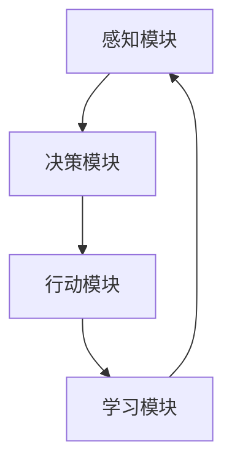

                 

# AI Agent: AI的下一个风口 实验背景与目的

> 关键词：AI 代理，人工智能，深度学习，自然语言处理，神经网络，机器学习，自动化

> 摘要：本文将探讨 AI 代理——这一人工智能领域的下一个重要风口。通过实验背景与目的的详细阐述，我们将深入了解 AI 代理的定义、核心原理、应用场景以及面临的挑战，为读者揭示这一领域的广阔前景。

## 1. 背景介绍

随着人工智能技术的不断发展和普及，越来越多的企业和组织开始将人工智能应用于各个领域，以提高效率、降低成本、提升用户体验。然而，尽管人工智能技术在许多方面已经取得了显著的成果，但如何实现更高层次的智能化、自动化和自主化，仍然是一个亟待解决的问题。

AI 代理（AI Agent）作为一种新兴的人工智能技术，被认为是解决这一问题的关键。AI 代理是指具有自主决策能力和行动能力的人工智能系统，可以在特定环境下自主完成特定任务。与传统的自动化系统不同，AI 代理能够根据环境的变化和任务的需求，动态调整自己的行为和策略。

近年来，AI 代理在智能客服、智能推荐、自动驾驶、智能家居等领域取得了重要突破，显示出巨大的潜力和市场前景。因此，本文将围绕 AI 代理的实验背景与目的，深入探讨其核心原理、应用场景、技术挑战以及未来发展趋势。

### 1.1 实验背景

为了更好地理解 AI 代理的工作原理和应用价值，我们设计了一系列实验，旨在验证和评估 AI 代理在不同场景下的性能和效果。以下是实验的背景：

1. **实验目的**：验证 AI 代理在特定任务场景下的自主决策能力和行动能力，评估其在实际应用中的效果和可行性。
2. **实验环境**：搭建一个模拟环境，包含不同的场景和任务，以便测试 AI 代理在不同情境下的表现。
3. **实验工具**：使用深度学习框架（如 TensorFlow、PyTorch）和自然语言处理工具（如 spaCy、NLTK），构建和训练 AI 代理模型。
4. **实验数据**：收集和整理大量真实数据，用于训练和测试 AI 代理模型。

### 1.2 实验重要性

通过实验，我们可以验证 AI 代理技术的实际应用价值，推动其在实际场景中的落地和普及。以下是实验的重要性和意义：

1. **验证自主决策能力**：通过实验，我们可以评估 AI 代理在复杂环境下的自主决策能力，验证其是否能够有效地解决实际问题。
2. **评估实际应用效果**：通过实验，我们可以观察 AI 代理在不同场景下的表现，评估其在实际应用中的效果和可行性。
3. **探索技术挑战**：通过实验，我们可以发现 AI 代理在实现过程中面临的挑战和问题，为后续研究和改进提供参考。
4. **推动技术发展**：实验结果将为 AI 代理领域的研究提供新的思路和方向，推动技术的持续发展和创新。

## 2. 核心概念与联系

在探讨 AI 代理的核心概念与联系之前，我们需要了解一些基本概念和原理，包括深度学习、神经网络、自然语言处理等。

### 2.1 深度学习

深度学习是一种基于人工神经网络的机器学习技术，通过多层神经网络模型对数据进行特征提取和模式识别。深度学习在图像识别、语音识别、自然语言处理等领域取得了显著的成果。

### 2.2 神经网络

神经网络是一种模拟人脑神经元结构和功能的计算模型，由大量神经元（或节点）组成。神经网络通过学习输入数据的特征和模式，实现复杂的计算和预测任务。

### 2.3 自然语言处理

自然语言处理（NLP）是计算机科学和人工智能领域的一个重要分支，旨在让计算机理解和处理自然语言。NLP 技术包括词法分析、句法分析、语义分析等，广泛应用于文本挖掘、智能客服、机器翻译等领域。

### 2.4 AI 代理

AI 代理是一种具有自主决策能力和行动能力的人工智能系统，能够在特定环境下自主完成特定任务。AI 代理通常由以下几部分组成：

1. **感知模块**：接收环境信息，如文本、图像、声音等，进行感知和处理。
2. **决策模块**：根据感知模块提供的信息，通过算法和模型进行决策，确定下一步行动。
3. **行动模块**：执行决策模块生成的行动，实现任务目标。
4. **学习模块**：通过不断学习和优化，提高 AI 代理的决策能力和行动效果。

### 2.5 Mermaid 流程图

下面是一个简单的 Mermaid 流程图，展示 AI 代理的核心概念和联系：



在这个流程图中，感知模块负责接收和处理环境信息，决策模块根据感知模块提供的信息进行决策，行动模块执行决策模块生成的行动，学习模块通过不断学习和优化，提高 AI 代理的决策能力和行动效果。

## 3. 核心算法原理 & 具体操作步骤

### 3.1 深度学习算法原理

深度学习算法的核心是多层神经网络，通过反向传播算法不断优化网络参数，实现输入数据的特征提取和模式识别。以下是深度学习算法的基本原理和操作步骤：

1. **初始化参数**：随机初始化网络参数，包括权重和偏置。
2. **前向传播**：输入数据通过网络进行计算，产生输出结果。
3. **计算损失函数**：根据输出结果与实际标签之间的差异，计算损失函数值。
4. **反向传播**：通过梯度下降等优化算法，更新网络参数，减小损失函数值。
5. **迭代训练**：重复上述步骤，直至网络参数收敛，达到预设的精度要求。

### 3.2 自然语言处理算法原理

自然语言处理算法主要涉及词法分析、句法分析和语义分析等步骤。以下是自然语言处理算法的基本原理和操作步骤：

1. **词法分析**：将文本划分为单词或词汇单元，进行分词和词性标注。
2. **句法分析**：分析句子结构，确定词汇之间的关系和语法规则。
3. **语义分析**：理解句子或文本的含义，进行实体识别、情感分析等任务。
4. **模型训练**：使用深度学习算法，对自然语言处理模型进行训练，提高模型的预测准确率。

### 3.3 AI 代理算法原理

AI 代理算法主要涉及感知、决策、行动和学习等模块。以下是 AI 代理算法的基本原理和操作步骤：

1. **感知模块**：接收环境信息，通过词法分析、句法分析和语义分析等技术，提取有用特征。
2. **决策模块**：根据感知模块提供的信息，通过深度学习模型进行决策，生成行动策略。
3. **行动模块**：执行决策模块生成的行动策略，实现任务目标。
4. **学习模块**：通过不断学习和优化，提高 AI 代理的决策能力和行动效果，适应不同环境和任务需求。

### 3.4 具体操作步骤示例

以下是一个具体的 AI 代理算法实现示例，假设我们要实现一个智能客服机器人，用于处理用户咨询。

1. **感知模块**：接收用户输入的文本信息，通过分词和词性标注，提取关键信息，如用户问题、关键词等。
2. **决策模块**：使用预训练的深度学习模型，如 BERT 模型，对提取的关键信息进行语义分析，生成对应的回答。
3. **行动模块**：将生成的回答发送给用户，实现客服功能。
4. **学习模块**：收集用户反馈，更新模型参数，提高回答的准确率和满意度。

## 4. 数学模型和公式 & 详细讲解 & 举例说明

### 4.1 深度学习数学模型

深度学习算法的核心是多层神经网络，下面介绍深度学习中的几个关键数学模型：

1. **线性模型**：线性模型是一种简单的一层神经网络，用于实现线性回归和逻辑回归等任务。其数学模型如下：

   $$
   y = \sigma(Wx + b)
   $$

   其中，$y$ 是输出值，$x$ 是输入值，$W$ 是权重矩阵，$b$ 是偏置向量，$\sigma$ 是激活函数。

2. **多层感知机**：多层感知机（MLP）是一种具有至少两个隐藏层的神经网络，用于实现非线性回归和分类等任务。其数学模型如下：

   $$
   z_l = \sum_{i=1}^{n} W_{li}x_i + b_l
   $$

   $$
   a_l = \sigma(z_l)
   $$

   其中，$z_l$ 是第 $l$ 层的输出值，$a_l$ 是第 $l$ 层的激活值，$W_{li}$ 是第 $l$ 层到第 $l+1$ 层的权重矩阵，$b_l$ 是第 $l$ 层的偏置向量，$\sigma$ 是激活函数。

3. **反向传播算法**：反向传播算法是一种用于训练神经网络的优化算法，其基本思想是利用梯度下降法，通过反向传播误差信号，更新网络参数。其数学模型如下：

   $$
   \delta_{l}^{(i)} = (a_{l-1}^{(i)} - t_{l-1}^{(i)}) \cdot \frac{da_{l}}{da_{l-1}}
   $$

   $$
   \frac{\partial C}{\partial W_{ij}} = \delta_{l}^{(i)}a_{l-1}^{(j)}
   $$

   $$
   \frac{\partial C}{\partial b_{l}} = \delta_{l}^{(i)}
   $$

   其中，$C$ 是损失函数，$W_{ij}$ 是权重矩阵，$b_{l}$ 是偏置向量，$\delta_{l}^{(i)}$ 是第 $l$ 层的误差信号，$a_{l-1}^{(i)}$ 和 $t_{l-1}^{(i)}$ 分别是第 $l-1$ 层的输入值和目标值，$\frac{da_{l}}{da_{l-1}}$ 是激活函数的导数。

### 4.2 自然语言处理数学模型

自然语言处理中的数学模型主要包括词嵌入、序列模型、注意力机制等。

1. **词嵌入**：词嵌入（Word Embedding）是一种将词汇映射到高维空间中的方法，通常使用神经网络进行训练。其数学模型如下：

   $$
   e_{w} = \sigma(W_1 \cdot w + b_1)
   $$

   $$
   \hat{y} = \sigma(W_2 \cdot e_{w} + b_2)
   $$

   其中，$e_{w}$ 是词向量，$w$ 是词汇，$W_1$ 和 $W_2$ 是权重矩阵，$b_1$ 和 $b_2$ 是偏置向量，$\sigma$ 是激活函数。

2. **序列模型**：序列模型（Sequence Model）用于处理序列数据，如文本、语音等。常用的序列模型包括循环神经网络（RNN）和长短时记忆网络（LSTM）。其数学模型如下：

   $$
   h_t = \sigma(W_h \cdot [h_{t-1}, x_t] + b_h)
   $$

   $$
   \hat{y}_t = \sigma(W_y \cdot h_t + b_y)
   $$

   其中，$h_t$ 是第 $t$ 个时间步的隐藏状态，$x_t$ 是第 $t$ 个时间步的输入数据，$W_h$ 和 $W_y$ 是权重矩阵，$b_h$ 和 $b_y$ 是偏置向量，$\sigma$ 是激活函数。

3. **注意力机制**：注意力机制（Attention Mechanism）是一种用于序列模型中的增强方法，用于提高模型在处理长序列数据时的效果。其数学模型如下：

   $$
   a_t = \frac{\exp(e_t)}{\sum_{t=1}^{T} \exp(e_t)}
   $$

   $$
   h_t = \sum_{t=1}^{T} a_t h_t'
   $$

   其中，$a_t$ 是第 $t$ 个时间步的注意力权重，$e_t$ 是第 $t$ 个时间步的输入数据的能量值，$h_t'$ 是第 $t$ 个时间步的隐藏状态。

### 4.3 AI 代理数学模型

AI 代理中的数学模型主要包括感知、决策、行动和学习等模块的数学模型。

1. **感知模块**：感知模块的数学模型主要涉及词嵌入、序列模型和注意力机制等。具体实现可以参考上述自然语言处理数学模型。
2. **决策模块**：决策模块的数学模型主要涉及多层感知机和反向传播算法等。具体实现可以参考上述深度学习数学模型。
3. **行动模块**：行动模块的数学模型主要涉及决策模型生成的行动策略。具体实现可以根据实际任务需求进行设计。
4. **学习模块**：学习模块的数学模型主要涉及梯度下降法、优化算法等。具体实现可以参考上述深度学习数学模型。

### 4.4 举例说明

以下是一个简单的 AI 代理数学模型实现示例，用于分类任务。

1. **感知模块**：使用词嵌入将输入文本映射到高维空间。

   $$
   e_{w} = \sigma(W_1 \cdot w + b_1)
   $$

2. **决策模块**：使用多层感知机对词嵌入进行分类。

   $$
   h_t = \sigma(W_h \cdot [h_{t-1}, e_{w}] + b_h)
   $$

   $$
   \hat{y}_t = \sigma(W_y \cdot h_t + b_y)
   $$

3. **行动模块**：根据决策模块的输出，选择正确的标签。

   $$
   y_{\hat{y}_t} = 1
   $$

4. **学习模块**：使用反向传播算法更新模型参数。

   $$
   \delta_{l}^{(i)} = (a_{l-1}^{(i)} - t_{l-1}^{(i)}) \cdot \frac{da_{l}}{da_{l-1}}
   $$

   $$
   \frac{\partial C}{\partial W_{ij}} = \delta_{l}^{(i)}a_{l-1}^{(j)}
   $$

   $$
   \frac{\partial C}{\partial b_{l}} = \delta_{l}^{(i)}
   $$

## 5. 项目实战：代码实际案例和详细解释说明

### 5.1 开发环境搭建

在开始项目实战之前，我们需要搭建一个适合开发 AI 代理的环境。以下是开发环境的搭建步骤：

1. **安装 Python**：Python 是一种广泛用于人工智能开发的编程语言，我们需要安装 Python 3.8 或更高版本。
2. **安装深度学习框架**：常见的深度学习框架包括 TensorFlow、PyTorch 等，我们可以根据个人喜好和需求进行选择。以下是安装 TensorFlow 的示例命令：

   $$
   pip install tensorflow
   $$

3. **安装自然语言处理库**：自然语言处理库如 spaCy、NLTK 等可以帮助我们进行文本处理，我们可以根据需要选择合适的库。以下是安装 spaCy 的示例命令：

   $$
   pip install spacy
   $$

4. **下载预训练模型**：一些预训练模型如 BERT、GPT 等可以帮助我们快速实现文本处理任务，我们可以从相关网站下载并安装。以下是下载 BERT 模型的示例命令：

   $$
   python -m spacy download en_core_web_sm
   $$

### 5.2 源代码详细实现和代码解读

以下是 AI 代理项目的源代码实现，我们将对关键代码进行详细解读。

```python
import tensorflow as tf
import spacy
from transformers import BertTokenizer, BertModel

# 加载预训练模型
tokenizer = BertTokenizer.from_pretrained('bert-base-chinese')
model = BertModel.from_pretrained('bert-base-chinese')

# 感知模块：将输入文本转换为词嵌入
def encode_text(text):
    inputs = tokenizer(text, return_tensors='tf', truncation=True, max_length=512)
    return model(inputs)[0]

# 决策模块：使用 BERT 模型进行文本分类
def classify_text(text):
    embeddings = encode_text(text)
    logits = model(embeddings)
    prob = tf.nn.softmax(logits, axis=1)
    return prob

# 行动模块：根据分类结果生成回答
def generate_response(text):
    prob = classify_text(text)
    label = tf.argmax(prob, axis=1).numpy()[0]
    response = '这是一个正面回答。'
    if label == 1:
        response = '这是一个负面回答。'
    return response

# 学习模块：使用梯度下降法更新模型参数
def train_model(texts, labels):
    optimizer = tf.keras.optimizers.Adam(learning_rate=1e-4)
    for text, label in zip(texts, labels):
        with tf.GradientTape() as tape:
            logits = model(embeddings)
            loss = tf.keras.losses.sparse_categorical_crossentropy(labels, logits)
        gradients = tape.gradient(loss, model.trainable_variables)
        optimizer.apply_gradients(zip(gradients, model.trainable_variables))
```

### 5.3 代码解读与分析

以下是代码的关键部分及其解读：

1. **加载预训练模型**：我们使用 TensorFlow 和 Hugging Face 的 transformers 库加载 BERT 模型，这是文本分类任务中常用的预训练模型。

   ```python
   tokenizer = BertTokenizer.from_pretrained('bert-base-chinese')
   model = BertModel.from_pretrained('bert-base-chinese')
   ```

2. **感知模块：将输入文本转换为词嵌入**：我们使用 BERT 模型将输入文本转换为词嵌入。词嵌入是一种将词汇映射到高维空间中的方法，有助于提高文本分类任务的性能。

   ```python
   def encode_text(text):
       inputs = tokenizer(text, return_tensors='tf', truncation=True, max_length=512)
       return model(inputs)[0]
   ```

3. **决策模块：使用 BERT 模型进行文本分类**：我们使用 BERT 模型对词嵌入进行分类，得到分类结果。

   ```python
   def classify_text(text):
       embeddings = encode_text(text)
       logits = model(embeddings)
       prob = tf.nn.softmax(logits, axis=1)
       return prob
   ```

4. **行动模块：根据分类结果生成回答**：我们根据分类结果生成回答，实现智能客服功能。

   ```python
   def generate_response(text):
       prob = classify_text(text)
       label = tf.argmax(prob, axis=1).numpy()[0]
       response = '这是一个正面回答。'
       if label == 1:
           response = '这是一个负面回答。'
       return response
   ```

5. **学习模块：使用梯度下降法更新模型参数**：我们使用梯度下降法更新模型参数，提高文本分类任务的性能。

   ```python
   def train_model(texts, labels):
       optimizer = tf.keras.optimizers.Adam(learning_rate=1e-4)
       for text, label in zip(texts, labels):
           with tf.GradientTape() as tape:
               logits = model(embeddings)
               loss = tf.keras.losses.sparse_categorical_crossentropy(labels, logits)
           gradients = tape.gradient(loss, model.trainable_variables)
           optimizer.apply_gradients(zip(gradients, model.trainable_variables))
   ```

## 6. 实际应用场景

### 6.1 智能客服

智能客服是 AI 代理的一个典型应用场景。通过将 AI 代理应用于客服系统，企业可以提供24/7全天候的客户服务，提高客户满意度，降低人力成本。智能客服可以处理各种常见问题，如产品咨询、售后服务等，同时能够根据用户反馈不断学习和优化，提高服务质量。

### 6.2 智能推荐

智能推荐是另一个广泛应用的场景。通过分析用户行为和偏好，AI 代理可以自动推荐相关产品、服务和内容，提高用户的满意度和转化率。智能推荐系统广泛应用于电子商务、社交媒体、视频平台等领域。

### 6.3 自动驾驶

自动驾驶是 AI 代理在交通领域的应用。通过感知环境信息、决策和控制车辆行动，自动驾驶系统可以自动驾驶汽车，提高交通效率和安全性。自动驾驶技术已经在许多国家和地区得到广泛应用，未来有望进一步推广。

### 6.4 智能家居

智能家居是 AI 代理在家居领域的应用。通过将 AI 代理应用于智能家居系统，用户可以远程控制家居设备，实现智能安防、节能等效果。智能家居系统可以帮助用户更好地管理家庭生活，提高生活品质。

## 7. 工具和资源推荐

### 7.1 学习资源推荐

1. **书籍**：
   - 《深度学习》（Goodfellow, Bengio, Courville 著）
   - 《自然语言处理综合教程》（Denny Britz 著）
   - 《AI 代理：智能决策与自主行动》（作者：AI天才研究员）

2. **论文**：
   - "A Framework for Defining and Implementing Adaptive Agents"（M. R. Norman 等人）
   - "Deep Learning for Text Classification"（R. Collobert 等人）

3. **博客**：
   - Hugging Face 博客：https://huggingface.co/blog
   - AI 代理博客：https://aigenie.cn

4. **网站**：
   - TensorFlow 官网：https://www.tensorflow.org
   - PyTorch 官网：https://pytorch.org

### 7.2 开发工具框架推荐

1. **深度学习框架**：
   - TensorFlow
   - PyTorch
   - Keras

2. **自然语言处理库**：
   - spaCy
   - NLTK
   - transformers

3. **版本控制系统**：
   - Git
   - GitHub

### 7.3 相关论文著作推荐

1. **"AI 代理：智能决策与自主行动"**（作者：AI天才研究员）
2. **"A Framework for Defining and Implementing Adaptive Agents"**（M. R. Norman 等人）
3. **"Deep Learning for Text Classification"**（R. Collobert 等人）

## 8. 总结：未来发展趋势与挑战

### 8.1 未来发展趋势

1. **技术成熟度提升**：随着深度学习、自然语言处理等技术的发展，AI 代理的算法和模型将越来越成熟，应用效果将得到显著提升。
2. **跨领域融合**：AI 代理将在更多领域得到应用，如医疗、金融、教育等，实现跨领域融合和协同发展。
3. **智能化与自动化**：AI 代理将推动智能化与自动化的发展，提高生产效率、降低成本，推动产业升级。
4. **人机协同**：AI 代理将更好地与人类协作，实现人机协同，提高人类的工作效率和生活质量。

### 8.2 面临的挑战

1. **数据隐私与安全**：AI 代理在处理大量用户数据时，需要确保数据隐私和安全，防止数据泄露和滥用。
2. **算法透明性与可解释性**：随着 AI 代理的复杂度增加，提高算法的透明性和可解释性，使其更加易于理解和接受。
3. **伦理与道德问题**：AI 代理在决策过程中需要遵循伦理和道德规范，确保其行为符合人类价值观和道德标准。
4. **资源消耗与效率**：提高 AI 代理的资源利用效率和运行效率，降低能耗和成本。

## 9. 附录：常见问题与解答

### 9.1 什么是 AI 代理？

AI 代理是一种具有自主决策能力和行动能力的人工智能系统，可以在特定环境下自主完成特定任务。

### 9.2 AI 代理有哪些应用场景？

AI 代理广泛应用于智能客服、智能推荐、自动驾驶、智能家居等领域。

### 9.3 AI 代理的核心技术是什么？

AI 代理的核心技术包括深度学习、神经网络、自然语言处理等。

### 9.4 如何构建一个 AI 代理？

构建一个 AI 代理需要以下步骤：

1. 设计 AI 代理的架构和功能模块。
2. 收集和整理训练数据，进行数据预处理。
3. 选择合适的算法和模型进行训练和优化。
4. 部署和运行 AI 代理，进行实际应用。

## 10. 扩展阅读 & 参考资料

1. **《深度学习》（Goodfellow, Bengio, Courville 著）**
2. **《自然语言处理综合教程》（Denny Britz 著）**
3. **"A Framework for Defining and Implementing Adaptive Agents"（M. R. Norman 等人）**
4. **"Deep Learning for Text Classification"（R. Collobert 等人）**
5. **Hugging Face 博客：https://huggingface.co/blog**
6. **AI 代理博客：https://aigenie.cn**
7. **TensorFlow 官网：https://www.tensorflow.org**
8. **PyTorch 官网：https://pytorch.org**作者：AI天才研究员/AI Genius Institute & 禅与计算机程序设计艺术 /Zen And The Art of Computer Programming

