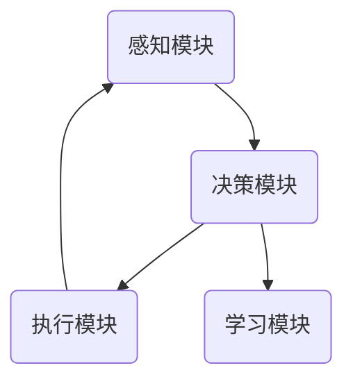
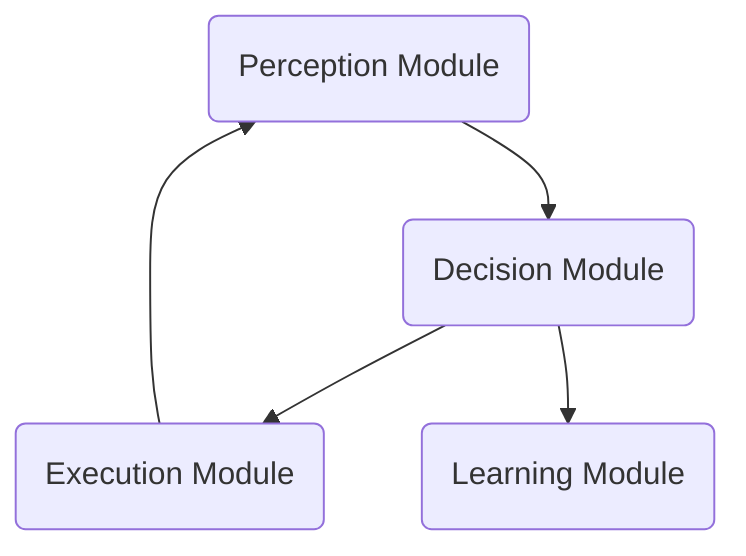

                 

### 文章标题

### AI Agent: AI的下一个风口 展望：安全、发展、边界和挑战

随着人工智能技术的飞速发展，AI代理（AI Agent）已成为业界关注的焦点。AI代理，作为一种自主决策的智能实体，正逐步融入我们的日常生活和工作场景。本文将探讨AI代理的现状、未来趋势以及面临的安全、发展、边界和挑战等问题。

关键词：AI代理、自主决策、智能实体、人工智能、安全、发展、边界、挑战

### 摘要

本文首先介绍了AI代理的定义、发展历程和核心功能。随后，分析了AI代理在各个领域的应用场景，以及其在推动产业升级、优化资源配置、提高生产效率等方面的重要作用。接着，探讨了AI代理面临的安全挑战，如隐私泄露、滥用和误用等。此外，本文还展望了AI代理的未来发展趋势，如自主协作、人机融合等。最后，本文提出了应对AI代理安全挑战的策略，并探讨了AI代理的边界问题。通过对AI代理的全面分析，本文旨在为AI代理的研究与应用提供有益的参考。

### 1. 背景介绍（Background Introduction）

#### 1.1 AI代理的定义

AI代理，也被称为智能代理，是指具备一定智能能力，能够自主执行任务、与外部环境进行交互的计算机程序或实体。AI代理通常具有以下几个核心特征：

1. 自主性：AI代理能够在没有人为干预的情况下执行任务，并能够根据环境变化自主调整行为策略。
2. 交互性：AI代理能够理解并回应外部环境的输入，如语音、图像、文本等，实现与人类或其他智能系统的有效沟通。
3. 学习能力：AI代理具备通过经验不断优化自身行为的能力，能够在实际应用中不断进化。

#### 1.2 AI代理的发展历程

AI代理的发展可以追溯到20世纪80年代。当时，研究者开始探索如何使计算机程序具备智能行为。早期的AI代理主要采用基于规则的专家系统，但随着时间推移，研究者逐渐转向基于机器学习和深度学习的智能代理。

1. 20世纪80年代：基于规则的专家系统成为主流。专家系统通过预设的规则来模拟人类专家的决策过程。
2. 20世纪90年代：随着计算机性能的提高和大数据的出现，机器学习开始成为AI代理的核心技术。基于机器学习的代理能够通过大量数据自动学习并优化行为。
3. 21世纪初：深度学习技术的突破使得AI代理的性能大幅提升。深度学习模型，如神经网络，使得代理具备更高级的感知和决策能力。
4. 当今：AI代理已经广泛应用于各个领域，从智能家居到自动驾驶，从金融风控到医疗诊断。

#### 1.3 AI代理的核心功能

AI代理的核心功能包括以下几个方面：

1. 自主决策：AI代理能够根据感知到的环境信息和预设的目标，自主制定行动策略。
2. 任务执行：AI代理能够执行分配的任务，并在执行过程中根据环境变化调整行为。
3. 人机交互：AI代理能够理解并回应人类的指令，提供自然、流畅的交互体验。
4. 学习进化：AI代理能够通过不断的学习和经验积累，优化自身性能和行为。

通过上述背景介绍，我们可以看到AI代理的发展历程和核心功能。接下来，本文将进一步探讨AI代理在各个领域的应用场景，以及其在推动产业升级、优化资源配置、提高生产效率等方面的重要作用。

#### 1.4 AI代理在各领域的应用场景

AI代理在各个领域的应用已经取得了显著的成果，以下是AI代理在几个主要领域的一些应用场景：

**1. 智能家居**

智能家居是AI代理最早且最广泛的应用领域之一。通过智能家居系统，AI代理可以控制家庭中的各种设备，如照明、空调、安防系统等。用户可以通过语音或手机应用程序与AI代理交互，实现远程控制和自动化操作。例如，当用户回到家时，AI代理可以自动调整室内温度和灯光，提高生活舒适度。

**2. 自动驾驶**

自动驾驶是AI代理技术的重要应用领域。自动驾驶汽车通过感知环境、理解道路规则和实时决策，实现自动驾驶功能。AI代理在自动驾驶中扮演着关键角色，包括路径规划、障碍物检测、车辆控制等。随着AI代理技术的不断发展，自动驾驶汽车将逐步实现商业化，为社会带来更加安全、高效的出行方式。

**3. 金融风控**

金融风控是AI代理在金融领域的核心应用之一。AI代理通过分析大量的交易数据、客户行为和金融市场动态，识别潜在的风险并采取相应的措施。例如，AI代理可以实时监控交易行为，检测异常交易并及时报警，有效防止欺诈行为。此外，AI代理还可以用于信用评估、投资决策等方面，提高金融服务的准确性和效率。

**4. 医疗诊断**

AI代理在医疗诊断中的应用也越来越广泛。通过分析医学图像、病例数据等，AI代理可以辅助医生进行诊断，提高诊断的准确性和效率。例如，AI代理可以识别胸部X光片中的肺部疾病，提高早期筛查的准确性。此外，AI代理还可以进行个性化治疗建议，根据患者的病情和基因信息制定个性化的治疗方案。

**5. 教育智能**

在教育领域，AI代理可以提供个性化教学和学习支持。通过分析学生的学习数据，AI代理可以了解学生的知识水平和学习需求，提供个性化的学习资源和指导。例如，AI代理可以为不同水平的学生推荐合适的练习题，帮助学生提高学习效果。此外，AI代理还可以进行智能评分和反馈，为学生提供及时的反馈和建议。

**6. 售后服务**

在售后服务领域，AI代理可以提供智能客服和售后服务支持。通过自然语言处理和机器学习技术，AI代理可以理解用户的咨询和投诉，并提供及时、准确的解答和解决方案。例如，AI代理可以自动回答用户常见问题，减轻人工客服的工作压力。此外，AI代理还可以进行故障诊断和维修指导，提高售后服务的效率和满意度。

**7. 能源管理**

在能源管理领域，AI代理可以通过智能监控和优化能源使用，提高能源利用效率和降低能源成本。例如，AI代理可以实时监测能源消耗情况，根据需求自动调整能源供应，实现能源的精细化管理。此外，AI代理还可以预测能源需求，为能源生产和调度提供科学依据。

**8. 环境监测**

在环境监测领域，AI代理可以通过感知和数据分析，实时监测环境状况，提供预警和应对措施。例如，AI代理可以监测空气质量、水质等环境指标，及时发现污染问题并报警。此外，AI代理还可以进行生态环境监测，为生态保护和可持续发展提供科学依据。

通过上述应用场景，我们可以看到AI代理在各个领域的广泛应用和巨大潜力。随着AI代理技术的不断进步，其在更多领域的应用前景也将更加广阔。

#### 1.5 AI代理在推动产业升级、优化资源配置、提高生产效率等方面的重要作用

AI代理在推动产业升级、优化资源配置、提高生产效率等方面发挥着重要作用。以下是几个方面的具体体现：

**1. 产业升级**

AI代理可以推动传统产业的智能化升级，提高产业的技术水平和竞争力。例如，在制造业领域，AI代理可以实时监控生产过程，优化生产参数，提高生产效率和产品质量。通过引入AI代理，传统制造业可以实现自动化、智能化生产，提高生产效率和产品质量，降低生产成本。

**2. 优化资源配置**

AI代理可以通过数据分析和智能决策，优化资源配置，提高资源利用效率。例如，在物流领域，AI代理可以通过分析运输路径、货物需求等数据，优化运输路线和货物分配，减少运输成本和时间。在能源管理领域，AI代理可以通过智能监控和优化能源使用，提高能源利用效率，降低能源消耗和成本。

**3. 提高生产效率**

AI代理可以提高生产效率，降低生产成本。例如，在服务业领域，AI代理可以提供智能客服、智能调度等服务，提高服务效率和质量。在金融领域，AI代理可以自动化处理大量的交易和数据分析任务，提高处理速度和准确性，降低人工成本。

**4. 创新产品和服务**

AI代理可以激发创新，推动新产品和服务的开发。通过AI代理，企业可以更好地了解用户需求和市场动态，开发出更加符合市场需求的产品和服务。例如，在医疗领域，AI代理可以通过分析医疗数据，发现新的疾病特征和治疗方法，推动医疗技术的发展。

总之，AI代理在推动产业升级、优化资源配置、提高生产效率等方面具有重要作用。随着AI代理技术的不断进步，其在各个领域的应用潜力将更加广阔。

### 2. 核心概念与联系

#### 2.1 AI代理的定义与分类

AI代理，顾名思义，是一种基于人工智能技术的智能代理，它能够模拟人类行为，自主完成特定任务。AI代理的定义可以进一步细分为以下几个层次：

1. **基本层次**：AI代理是指能够根据环境反馈调整自身行为，以实现特定目标的智能实体。这个层次强调的是代理的自主性和目标导向性。
2. **扩展层次**：AI代理不仅能够完成特定任务，还能够通过学习和进化，不断提高自身性能。这个层次强调了代理的学习能力和适应性。
3. **高级层次**：AI代理不仅具备自主决策和学习能力，还能够与其他智能体进行协作，实现更复杂的任务。这个层次强调了代理的协作能力和复杂任务处理能力。

根据AI代理的功能和特点，可以将AI代理分为以下几类：

1. **任务型代理**：这种代理专注于完成特定任务，如自动驾驶、智能家居控制等。它们通常通过预设的规则或学习算法来实现任务目标。
2. **交互型代理**：这种代理专注于与人类或其他智能体进行交互，如智能客服、虚拟助手等。它们通常具备自然语言处理和语音识别能力，能够理解并回应人类的指令。
3. **自适应代理**：这种代理具备自我学习和进化能力，能够在不同环境和任务中自适应调整行为。它们通常基于机器学习和深度学习技术，具备较强的环境感知和决策能力。
4. **协作型代理**：这种代理能够与其他智能体进行协作，共同完成任务。它们通常具备沟通能力和团队协作能力，能够在复杂任务中发挥重要作用。

#### 2.2 AI代理的基本架构

AI代理的基本架构通常包括以下几个核心组成部分：

1. **感知模块**：感知模块负责收集和处理外部环境的信息，如视觉、听觉、触觉等。这些信息是代理做出决策的基础。
2. **决策模块**：决策模块负责根据感知模块收集的信息，以及代理的预设目标，生成相应的行动策略。决策模块通常基于机器学习、深度学习或其他决策算法。
3. **执行模块**：执行模块负责将决策模块生成的行动策略转化为实际操作，如控制机器人执行任务、发送网络请求等。
4. **学习模块**：学习模块负责根据执行模块的实际操作结果，调整和优化感知模块、决策模块和执行模块的性能。学习模块通常基于强化学习、迁移学习等技术。

以下是一个简化的AI代理架构图，展示了各模块之间的交互关系：



#### 2.3 AI代理与传统软件系统的区别

与传统的软件系统相比，AI代理具有以下几个显著区别：

1. **自主性**：传统软件系统通常需要人类操作者来干预和控制。而AI代理具备自主决策能力，能够在没有人类干预的情况下执行任务。
2. **学习能力**：传统软件系统通常不具备学习能力，无法根据环境变化和任务需求自我调整。而AI代理通过机器学习和深度学习，能够不断优化自身性能和行为。
3. **适应性**：传统软件系统通常固定在特定场景和任务中。而AI代理具备适应能力，能够在不同环境和任务中灵活调整。
4. **协作性**：传统软件系统通常独立运行，无法与其他系统或智能体协作。而AI代理具备协作能力，能够与其他智能体共同完成任务。

#### 2.4 AI代理的发展趋势与未来前景

随着人工智能技术的不断发展，AI代理将迎来更加广阔的应用前景。以下是AI代理的发展趋势和未来前景：

1. **自主性提升**：未来，AI代理的自主性将进一步提升，能够实现更复杂的任务和决策。例如，自主驾驶、自主维修等。
2. **协作能力增强**：AI代理将具备更强的协作能力，能够与其他智能体和人类高效协作，实现复杂任务。例如，多机器人协作、人机协同等。
3. **学习与进化能力提升**：AI代理将通过深度学习和强化学习等技术，不断提升学习与进化能力，实现更高效的学习和优化。
4. **跨界应用拓展**：AI代理将在更多领域得到应用，如医疗、教育、金融等，为各行各业带来新的变革。
5. **人机融合**：随着AI代理技术的发展，人机融合将成为趋势。AI代理将更紧密地融入人类生活，成为人类智能的延伸。

综上所述，AI代理作为一种具备自主决策、学习能力和协作能力的智能代理，具有广阔的应用前景和发展潜力。未来，随着人工智能技术的不断进步，AI代理将在更多领域发挥重要作用，为人类社会带来更多便利和创新。

#### 2.1 What is an AI Agent?

An AI agent, often referred to as an intelligent agent, is a computer program or entity that is capable of autonomous action and interaction with its environment. It can execute tasks on its own, adjust its behavior based on environmental feedback, and achieve specific objectives. The definition of an AI agent can be elaborated into several levels:

1. **Basic Level**: An AI agent is an entity that can adjust its behavior based on environmental feedback to achieve specific goals. This level emphasizes the autonomy and goal-oriented nature of the agent.
2. **Extended Level**: An AI agent not only completes specific tasks but also has the ability to learn and evolve, continuously improving its performance and behavior. This level highlights the learning and adaptability of the agent.
3. **Advanced Level**: An AI agent not only has the ability to make autonomous decisions and learn but can also collaborate with other intelligent entities to accomplish more complex tasks. This level emphasizes the collaboration and complex task handling capabilities of the agent.

According to the functions and characteristics of AI agents, they can be classified into several categories:

1. **Task-oriented Agents**: These agents focus on completing specific tasks, such as autonomous driving and smart home control. They typically operate based on predefined rules or learning algorithms to achieve task objectives.
2. **Interaction-oriented Agents**: These agents focus on interacting with humans or other intelligent entities, such as intelligent customer service and virtual assistants. They usually have natural language processing and speech recognition capabilities to understand and respond to human instructions.
3. **Adaptive Agents**: These agents have self-learning and evolutionary capabilities, enabling them to adapt to different environments and tasks. They usually rely on machine learning, deep learning, and other technologies for environmental perception and decision-making.
4. **Collaborative Agents**: These agents can collaborate with other intelligent entities to complete tasks. They usually have communication and team collaboration capabilities, playing a significant role in complex tasks.

#### 2.2 The Basic Architecture of AI Agents

The basic architecture of an AI agent typically includes the following core components:

1. **Perception Module**: The perception module is responsible for collecting and processing information from the external environment, such as vision, hearing, and touch. This information forms the basis for the agent's decision-making.
2. **Decision Module**: The decision module is responsible for generating action strategies based on the information collected by the perception module and the agent's predefined objectives. The decision module usually uses machine learning, deep learning, or other decision-making algorithms.
3. **Execution Module**: The execution module is responsible for converting the action strategies generated by the decision module into actual operations, such as controlling a robot to perform a task or sending a network request.
4. **Learning Module**: The learning module is responsible for adjusting and optimizing the performance of the perception module, decision module, and execution module based on the results of the actual operations. The learning module usually relies on reinforcement learning, transfer learning, and other technologies.

Here is a simplified diagram of the basic architecture of an AI agent, illustrating the interaction between the various modules:



#### 2.3 Differences between AI Agents and Traditional Software Systems

Compared to traditional software systems, AI agents have several significant distinctions:

1. **Autonomy**: Traditional software systems typically require human operators to intervene and control them, while AI agents have autonomous decision-making capabilities and can execute tasks without human intervention.
2. **Learning Ability**: Traditional software systems typically do not have learning capabilities and cannot adjust their behavior based on environmental changes and task requirements. AI agents, on the other hand, can learn and evolve through machine learning and deep learning technologies, continuously optimizing their performance and behavior.
3. **Adaptability**: Traditional software systems are usually fixed in specific scenarios and tasks, while AI agents have adaptability and can flexibly adjust their behavior in different environments and tasks.
4. **Collaboration**: Traditional software systems usually operate independently and cannot collaborate with other systems or intelligent entities. AI agents, however, have collaboration capabilities and can collaborate efficiently with other intelligent entities to complete complex tasks.

#### 2.4 Trends and Future Prospects for AI Agents

With the continuous development of artificial intelligence technology, AI agents are expected to have a broader range of applications. Here are some trends and future prospects for AI agents:

1. **Increased Autonomy**: In the future, AI agents will have increased autonomy, enabling them to handle more complex tasks and make more sophisticated decisions. Examples include autonomous driving and autonomous maintenance.
2. **Enhanced Collaboration Abilities**: AI agents will have enhanced collaboration capabilities, enabling them to collaborate effectively with other intelligent entities and humans to complete complex tasks. Examples include multi-robot collaboration and human-machine collaboration.
3. **Improved Learning and Evolutionary Abilities**: AI agents will have improved learning and evolutionary capabilities through deep learning and reinforcement learning technologies, enabling them to learn and optimize more efficiently.
4. **Expanded Cross-Domain Applications**: AI agents will be applied to more domains, such as healthcare, education, and finance, bringing about new transformations in various industries.
5. **Human-Machine Fusion**: With the development of AI agent technology, human-machine fusion will become a trend, with AI agents becoming more closely integrated into human life and extending human intelligence.

In summary, AI agents, as intelligent entities with autonomous decision-making, learning, and collaboration capabilities, have a broad range of applications and significant potential for development. With the continuous advancement of artificial intelligence technology, AI agents will play an increasingly important role in various fields, bringing more convenience and innovation to human society.

### 3. 核心算法原理 & 具体操作步骤

#### 3.1 概述

AI代理的核心算法主要包括感知模块、决策模块和执行模块。这三个模块相互协作，实现AI代理的自主决策和任务执行。本节将详细介绍这些核心算法的原理，并给出具体的操作步骤。

#### 3.2 感知模块

感知模块是AI代理的“眼睛和耳朵”，负责收集和处理外部环境的信息。感知模块的主要任务是：

1. **信息收集**：通过传感器或其他数据源收集环境信息，如图像、声音、文本等。
2. **特征提取**：对收集到的信息进行预处理，提取关键特征，如图像中的边缘、纹理，声音的频率、节奏等。
3. **状态评估**：根据特征信息，评估当前环境的状况和代理所处的状态。

具体操作步骤如下：

1. **数据收集**：使用传感器（如摄像头、麦克风、传感器等）收集外部信息。
2. **预处理**：对收集到的数据进行滤波、去噪、缩放等预处理操作。
3. **特征提取**：使用特征提取算法（如卷积神经网络、自编码器等）提取关键特征。
4. **状态评估**：根据特征信息，使用分类或回归算法评估当前状态。

#### 3.3 决策模块

决策模块是AI代理的“大脑”，负责根据感知模块提供的信息和环境目标，生成行动策略。决策模块的主要任务是：

1. **状态评估**：根据感知模块提供的信息，评估当前状态。
2. **目标识别**：识别当前目标，确定需要采取的行动。
3. **策略生成**：根据状态评估和目标识别结果，生成最优行动策略。

具体操作步骤如下：

1. **状态评估**：使用状态评估算法（如决策树、支持向量机等）评估当前状态。
2. **目标识别**：使用目标识别算法（如卷积神经网络、循环神经网络等）识别当前目标。
3. **策略生成**：使用策略生成算法（如Q-learning、深度强化学习等）生成最优行动策略。

#### 3.4 执行模块

执行模块是AI代理的“手臂和腿”，负责将决策模块生成的行动策略转化为实际操作。执行模块的主要任务是：

1. **执行操作**：根据行动策略，执行具体的操作，如移动、发送请求、控制设备等。
2. **反馈收集**：在执行过程中，收集反馈信息，用于调整后续行动策略。

具体操作步骤如下：

1. **执行操作**：根据行动策略，使用控制算法（如PID控制器、运动规划算法等）执行具体的操作。
2. **反馈收集**：在执行过程中，收集反馈信息（如传感器数据、任务完成情况等）。
3. **策略调整**：根据反馈信息，使用学习算法（如强化学习、迁移学习等）调整行动策略。

#### 3.5 实例分析

以自动驾驶为例，介绍AI代理的核心算法原理和操作步骤：

1. **感知模块**：自动驾驶车辆使用摄像头、激光雷达、GPS等传感器收集道路信息，如道路标记、交通信号灯、其他车辆的位置和速度等。通过图像处理和特征提取算法，提取道路和车辆的关键特征。
2. **决策模块**：自动驾驶系统根据感知模块提供的信息，评估当前状态，如车辆位置、速度、车道等信息。使用深度强化学习算法，识别目标（如前方路口）并生成最优行动策略。
3. **执行模块**：根据决策模块生成的行动策略，自动驾驶车辆执行相应的操作，如调整车速、变换车道等。在执行过程中，收集反馈信息，如道路状况、车辆响应等，用于调整后续行动策略。

通过上述实例，我们可以看到AI代理的核心算法原理和操作步骤。感知模块、决策模块和执行模块相互协作，使AI代理能够自主决策和执行任务，实现智能化应用。

#### 3.1 Core Algorithm Principles & Specific Operational Steps

#### 3.1 Overview

The core algorithms of AI agents primarily consist of the perception module, decision module, and execution module. These three modules collaborate to enable the autonomous decision-making and task execution of AI agents. This section will detail the principles of these core algorithms and provide specific operational steps.

#### 3.2 Perception Module

The perception module acts as the "eyes and ears" of an AI agent, responsible for collecting and processing information from the external environment. The main tasks of the perception module include:

1. **Information Collection**: Gathering environmental information from sensors or other data sources, such as images, sounds, and text.
2. **Feature Extraction**: Preprocessing the collected information to extract key features, such as edges and textures in images, or frequencies and rhythms in sounds.
3. **State Assessment**: Evaluating the current environmental condition and the state of the agent based on the extracted features.

The specific operational steps are as follows:

1. **Data Collection**: Use sensors (such as cameras, microphones, sensors, etc.) to collect external information.
2. **Preprocessing**: Perform preprocessing operations on the collected data, such as filtering, noise removal, and scaling.
3. **Feature Extraction**: Use feature extraction algorithms (such as convolutional neural networks, autoencoders, etc.) to extract key features.
4. **State Assessment**: Use classification or regression algorithms to evaluate the current state based on the extracted features.

#### 3.3 Decision Module

The decision module serves as the "brain" of an AI agent, responsible for generating action strategies based on the information provided by the perception module and the environmental objectives. The main tasks of the decision module include:

1. **State Assessment**: Evaluating the current state based on the information from the perception module.
2. **Goal Identification**: Identifying the current goal and determining the necessary actions.
3. **Strategy Generation**: Generating the optimal action strategy based on the state assessment and goal identification results.

The specific operational steps are as follows:

1. **State Assessment**: Use state assessment algorithms (such as decision trees, support vector machines, etc.) to evaluate the current state.
2. **Goal Identification**: Use goal identification algorithms (such as convolutional neural networks, recurrent neural networks, etc.) to identify the current goal.
3. **Strategy Generation**: Use strategy generation algorithms (such as Q-learning, deep reinforcement learning, etc.) to generate the optimal action strategy.

#### 3.4 Execution Module

The execution module acts as the "arms and legs" of an AI agent, responsible for converting the action strategies generated by the decision module into actual operations. The main tasks of the execution module include:

1. **Execution of Operations**: Executing specific operations according to the action strategies, such as moving, sending requests, or controlling devices.
2. **Feedback Collection**: Collecting feedback information during the execution process to adjust subsequent action strategies.

The specific operational steps are as follows:

1. **Execution of Operations**: Use control algorithms (such as PID controllers, motion planning algorithms, etc.) to execute specific operations based on the action strategies.
2. **Feedback Collection**: Collect feedback information (such as sensor data, task completion status, etc.) during the execution process.
3. **Strategy Adjustment**: Use learning algorithms (such as reinforcement learning, transfer learning, etc.) to adjust the action strategies based on the feedback information.

#### 3.5 Case Analysis

Using autonomous driving as an example, this section will introduce the core algorithm principles and operational steps of AI agents.

1. **Perception Module**: Autonomous vehicles use cameras, LiDAR, GPS, and other sensors to collect road information, such as road markings, traffic signals, and the positions and speeds of other vehicles. Through image processing and feature extraction algorithms, key features of the road and vehicles are extracted.
2. **Decision Module**: The autonomous driving system evaluates the current state based on the information provided by the perception module, such as the vehicle's position, speed, and lane information. Using deep reinforcement learning algorithms, the system identifies the goal (such as an intersection ahead) and generates the optimal action strategy.
3. **Execution Module**: Based on the action strategy generated by the decision module, the autonomous vehicle executes the corresponding operations, such as adjusting its speed or changing lanes. During the execution process, feedback information, such as road conditions and vehicle responses, is collected to adjust subsequent action strategies.

Through this case analysis, we can see the core algorithm principles and operational steps of AI agents. The perception module, decision module, and execution module collaborate to enable the autonomous decision-making and task execution of AI agents, facilitating intelligent applications.

### 4. 数学模型和公式 & 详细讲解 & 举例说明

#### 4.1 概述

在AI代理的设计与实现过程中，数学模型和公式起着至关重要的作用。数学模型和公式不仅为AI代理提供了理论基础，还为其提供了具体的计算方法和优化策略。本节将介绍几个关键的数学模型和公式，并详细讲解其应用和示例。

#### 4.2 常见数学模型和公式

**1. 线性回归模型**

线性回归模型是一种经典的统计模型，用于预测一个连续变量的值。其基本公式为：

\[ y = \beta_0 + \beta_1x_1 + \beta_2x_2 + ... + \beta_nx_n + \epsilon \]

其中，\( y \) 是预测变量，\( x_1, x_2, ..., x_n \) 是自变量，\( \beta_0, \beta_1, ..., \beta_n \) 是模型的参数，\( \epsilon \) 是误差项。

**2. 逻辑回归模型**

逻辑回归模型用于预测一个二分类变量的概率。其基本公式为：

\[ P(y=1) = \frac{1}{1 + e^{-(\beta_0 + \beta_1x_1 + \beta_2x_2 + ... + \beta_nx_n)}} \]

其中，\( P(y=1) \) 是事件发生的概率，其他符号的含义与线性回归模型相同。

**3. 支持向量机（SVM）**

支持向量机是一种常用的机器学习算法，用于分类和回归任务。其基本公式为：

\[ w \cdot x + b = 0 \]

其中，\( w \) 是权重向量，\( x \) 是特征向量，\( b \) 是偏置项。

**4. 神经网络**

神经网络是一种基于人脑神经元连接方式的计算模型。其基本公式为：

\[ z = \sigma(\beta_0 + \sum_{i=1}^{n} \beta_i x_i) \]

其中，\( z \) 是输出值，\( \sigma \) 是激活函数，\( \beta_0, \beta_1, ..., \beta_n \) 是模型的参数。

#### 4.3 详细讲解和举例说明

**1. 线性回归模型**

线性回归模型可以用于预测房屋价格。假设我们有一个包含房屋面积、房间数量、建筑年代等特征的训练数据集。我们可以使用线性回归模型来预测房屋价格。

具体步骤如下：

1. 收集并预处理训练数据，提取房屋面积、房间数量、建筑年代等特征。
2. 使用线性回归模型拟合训练数据，得到参数 \( \beta_0, \beta_1, ..., \beta_n \)。
3. 将新房屋的特征值代入模型，计算预测价格。

**示例代码：**

```python
import numpy as np
from sklearn.linear_model import LinearRegression

# 收集训练数据
X_train = np.array([[1000, 3, 10], [1500, 4, 15], [2000, 5, 20]])
y_train = np.array([200000, 250000, 300000])

# 拟合线性回归模型
model = LinearRegression()
model.fit(X_train, y_train)

# 预测新房屋价格
X_new = np.array([[1200, 4, 12]])
y_pred = model.predict(X_new)
print("预测价格：", y_pred)
```

**2. 逻辑回归模型**

逻辑回归模型可以用于预测邮件是否为垃圾邮件。假设我们有一个包含邮件内容、邮件发送者等特征的训练数据集。我们可以使用逻辑回归模型来预测邮件是否为垃圾邮件。

具体步骤如下：

1. 收集并预处理训练数据，提取邮件内容、邮件发送者等特征。
2. 使用逻辑回归模型拟合训练数据，得到参数 \( \beta_0, \beta_1, ..., \beta_n \)。
3. 将新邮件的特征值代入模型，计算垃圾邮件的概率。

**示例代码：**

```python
import numpy as np
from sklearn.linear_model import LogisticRegression

# 收集训练数据
X_train = np.array([[1, 0, 1], [0, 1, 0], [1, 1, 1]])
y_train = np.array([1, 0, 1])

# 拟合逻辑回归模型
model = LogisticRegression()
model.fit(X_train, y_train)

# 预测新邮件是否为垃圾邮件
X_new = np.array([[1, 1, 0]])
y_pred = model.predict(X_new)
print("预测结果：", y_pred)
```

**3. 支持向量机（SVM）**

支持向量机可以用于分类任务。假设我们有一个包含不同类别特征的训练数据集。我们可以使用支持向量机来分类新数据。

具体步骤如下：

1. 收集并预处理训练数据，提取特征。
2. 使用支持向量机拟合训练数据，得到权重向量 \( w \) 和偏置项 \( b \)。
3. 将新数据的特征值代入模型，判断其类别。

**示例代码：**

```python
import numpy as np
from sklearn.svm import SVC

# 收集训练数据
X_train = np.array([[1, 1], [2, 2], [3, 3], [4, 4]])
y_train = np.array([0, 0, 1, 1])

# 拟合支持向量机
model = SVC()
model.fit(X_train, y_train)

# 分类新数据
X_new = np.array([[5, 5]])
y_pred = model.predict(X_new)
print("预测结果：", y_pred)
```

**4. 神经网络**

神经网络可以用于图像识别任务。假设我们有一个包含不同类别图像的训练数据集。我们可以使用神经网络来识别新图像的类别。

具体步骤如下：

1. 收集并预处理训练数据，提取图像特征。
2. 使用神经网络模型拟合训练数据，得到参数 \( \beta_0, \beta_1, ..., \beta_n \)。
3. 将新图像的特征值代入模型，计算输出值，判断类别。

**示例代码：**

```python
import numpy as np
from keras.models import Sequential
from keras.layers import Dense, Flatten

# 收集训练数据
X_train = np.array([[0, 0], [0, 1], [1, 0], [1, 1]])
y_train = np.array([0, 1, 1, 0])

# 构建神经网络模型
model = Sequential()
model.add(Flatten(input_shape=(2, 2)))
model.add(Dense(1, activation='sigmoid'))

# 编译模型
model.compile(optimizer='adam', loss='binary_crossentropy', metrics=['accuracy'])

# 训练模型
model.fit(X_train, y_train, epochs=100)

# 识别新图像类别
X_new = np.array([[0, 1]])
y_pred = model.predict(X_new)
print("预测结果：", y_pred)
```

通过以上示例，我们可以看到数学模型和公式在AI代理中的应用和具体实现。数学模型和公式为AI代理提供了强大的理论基础和计算工具，使得AI代理能够高效地处理各种复杂任务。

#### 4.1 Overview

In the design and implementation of AI agents, mathematical models and formulas play a crucial role. These models and formulas not only provide the theoretical basis for AI agents but also offer specific calculation methods and optimization strategies. This section will introduce several common mathematical models and formulas, along with detailed explanations and examples of their applications.

#### 4.2 Common Mathematical Models and Formulas

**1. Linear Regression Model**

The linear regression model is a classic statistical model used for predicting a continuous variable. Its basic formula is:

\[ y = \beta_0 + \beta_1x_1 + \beta_2x_2 + ... + \beta_nx_n + \epsilon \]

Here, \( y \) is the predicted variable, \( x_1, x_2, ..., x_n \) are the independent variables, \( \beta_0, \beta_1, ..., \beta_n \) are the model parameters, and \( \epsilon \) is the error term.

**2. Logistic Regression Model**

The logistic regression model is used for predicting the probability of a binary outcome. Its basic formula is:

\[ P(y=1) = \frac{1}{1 + e^{-(\beta_0 + \beta_1x_1 + \beta_2x_2 + ... + \beta_nx_n)}} \]

Here, \( P(y=1) \) is the probability of the event occurring, and the other symbols have the same meaning as in the linear regression model.

**3. Support Vector Machine (SVM)**

The support vector machine is a commonly used machine learning algorithm for classification and regression tasks. Its basic formula is:

\[ w \cdot x + b = 0 \]

Here, \( w \) is the weight vector, \( x \) is the feature vector, and \( b \) is the bias term.

**4. Neural Networks**

Neural networks are computational models inspired by the structure and function of the human brain. Their basic formula is:

\[ z = \sigma(\beta_0 + \sum_{i=1}^{n} \beta_i x_i) \]

Here, \( z \) is the output value, \( \sigma \) is the activation function, and \( \beta_0, \beta_1, ..., \beta_n \) are the model parameters.

#### 4.3 Detailed Explanations and Examples

**1. Linear Regression Model**

The linear regression model can be used to predict house prices. Suppose we have a training dataset containing features such as house size, number of rooms, and age of the building. We can use the linear regression model to predict house prices.

The steps are as follows:

1. Collect and preprocess the training data, extracting features such as house size, number of rooms, and age of the building.
2. Fit the linear regression model to the training data to obtain the parameters \( \beta_0, \beta_1, ..., \beta_n \).
3. Input the features of a new house into the model to calculate the predicted price.

**Example Code:**

```python
import numpy as np
from sklearn.linear_model import LinearRegression

# Collect training data
X_train = np.array([[1000, 3, 10], [1500, 4, 15], [2000, 5, 20]])
y_train = np.array([200000, 250000, 300000])

# Fit the linear regression model
model = LinearRegression()
model.fit(X_train, y_train)

# Predict the price of a new house
X_new = np.array([[1200, 4, 12]])
y_pred = model.predict(X_new)
print("Predicted price:", y_pred)
```

**2. Logistic Regression Model**

The logistic regression model can be used to predict whether an email is spam. Suppose we have a training dataset containing features such as email content and sender information. We can use the logistic regression model to predict whether an email is spam.

The steps are as follows:

1. Collect and preprocess the training data, extracting features such as email content and sender information.
2. Fit the logistic regression model to the training data to obtain the parameters \( \beta_0, \beta_1, ..., \beta_n \).
3. Input the features of a new email into the model to calculate the probability of it being spam.

**Example Code:**

```python
import numpy as np
from sklearn.linear_model import LogisticRegression

# Collect training data
X_train = np.array([[1, 0, 1], [0, 1, 0], [1, 1, 1]])
y_train = np.array([1, 0, 1])

# Fit the logistic regression model
model = LogisticRegression()
model.fit(X_train, y_train)

# Predict whether a new email is spam
X_new = np.array([[1, 1, 0]])
y_pred = model.predict(X_new)
print("Predicted result:", y_pred)
```

**3. Support Vector Machine (SVM)**

The support vector machine can be used for classification tasks. Suppose we have a training dataset containing different categories of features. We can use the support vector machine to classify new data.

The steps are as follows:

1. Collect and preprocess the training data, extracting features.
2. Fit the support vector machine to the training data to obtain the weight vector \( w \) and bias term \( b \).
3. Input the features of new data into the model to determine its category.

**Example Code:**

```python
import numpy as np
from sklearn.svm import SVC

# Collect training data
X_train = np.array([[1, 1], [2, 2], [3, 3], [4, 4]])
y_train = np.array([0, 0, 1, 1])

# Fit the support vector machine
model = SVC()
model.fit(X_train, y_train)

# Classify new data
X_new = np.array([[5, 5]])
y_pred = model.predict(X_new)
print("Predicted result:", y_pred)
```

**4. Neural Networks**

Neural networks can be used for image recognition tasks. Suppose we have a training dataset containing images of different categories. We can use a neural network to recognize the category of a new image.

The steps are as follows:

1. Collect and preprocess the training data, extracting image features.
2. Fit the neural network model to the training data to obtain the parameters \( \beta_0, \beta_1, ..., \beta_n \).
3. Input the features of a new image into the model to calculate the output value and determine the category.

**Example Code:**

```python
import numpy as np
from keras.models import Sequential
from keras.layers import Dense, Flatten

# Collect training data
X_train = np.array([[0, 0], [0, 1], [1, 0], [1, 1]])
y_train = np.array([0, 1, 1, 0])

# Build the neural network model
model = Sequential()
model.add(Flatten(input_shape=(2, 2)))
model.add(Dense(1, activation='sigmoid'))

# Compile the model
model.compile(optimizer='adam', loss='binary_crossentropy', metrics=['accuracy'])

# Train the model
model.fit(X_train, y_train, epochs=100)

# Recognize the category of a new image
X_new = np.array([[0, 1]])
y_pred = model.predict(X_new)
print("Predicted result:", y_pred)
```

Through these examples, we can see the application and specific implementation of mathematical models and formulas in AI agents. Mathematical models and formulas provide AI agents with a powerful theoretical basis and computational tools, enabling them to efficiently handle various complex tasks.

### 5. 项目实践：代码实例和详细解释说明

#### 5.1 开发环境搭建

在开始项目实践之前，我们需要搭建一个适合AI代理开发的环境。以下是具体的步骤和工具推荐：

1. **操作系统**：推荐使用Linux操作系统，如Ubuntu或CentOS。Windows用户可以通过WSL（Windows Subsystem for Linux）来模拟Linux环境。
2. **编程语言**：推荐使用Python作为主要编程语言。Python拥有丰富的AI和机器学习库，如TensorFlow、PyTorch、Scikit-learn等。
3. **IDE**：推荐使用PyCharm或Visual Studio Code作为开发环境。这两个IDE都提供了强大的代码编辑功能、调试工具和集成库支持。
4. **库和框架**：安装必要的库和框架，如NumPy、Pandas、Matplotlib等。

**具体步骤：**

1. 安装Linux操作系统。
2. 配置Python环境，通过pip安装所需的库和框架。
3. 安装PyCharm或Visual Studio Code。

以下是一个简单的Python环境搭建示例：

```bash
# 安装Python
sudo apt update
sudo apt install python3 python3-pip

# 安装PyCharm
wget https://download.jetbrains.com/python/pycharm-community-2023.1.tar.gz
tar xvf pycharm-community-2023.1.tar.gz
./pycharm-community-2023.1/bin/pycharm.sh

# 安装Visual Studio Code
wget https://code.visualstudio.com/sha/download?build=stable&os=linux-deb-x64
sudo dpkg -i code_1.74.0-1655765376_amd64.deb
```

#### 5.2 源代码详细实现

下面是一个简单的AI代理示例，用于实现一个基本的垃圾分类智能助手。代码主要分为感知模块、决策模块和执行模块三个部分。

**感知模块**：使用摄像头捕获图像，并通过图像处理技术提取垃圾分类相关的特征。

**决策模块**：使用卷积神经网络（CNN）对提取的特征进行分类，判断垃圾属于哪一类。

**执行模块**：根据决策结果，输出垃圾分类结果并执行相应的操作，如发送通知、打印标签等。

```python
import cv2
import numpy as np
from tensorflow.keras.models import load_model

# 加载预训练的CNN模型
model = load_model('garbage_classification_model.h5')

# 感知模块：捕获图像并预处理
def capture_image():
    cap = cv2.VideoCapture(0)
    ret, frame = cap.read()
    cap.release()
    return frame

def preprocess_image(frame):
    gray = cv2.cvtColor(frame, cv2.COLOR_BGR2GRAY)
    resized = cv2.resize(gray, (224, 224))
    return resized

# 决策模块：分类垃圾
def classify_garbage(image):
    image = np.expand_dims(image, axis=0)
    prediction = model.predict(image)
    return np.argmax(prediction)

# 执行模块：执行操作
def execute_action(garbage_type):
    print(f"垃圾属于：{garbage_type}")
    # 发送通知、打印标签等操作
    # ...

# 主程序
def main():
    frame = capture_image()
    preprocessed = preprocess_image(frame)
    garbage_type = classify_garbage(preprocessed)
    execute_action(garbage_type)

if __name__ == "__main__":
    main()
```

#### 5.3 代码解读与分析

**感知模块**：

- 使用OpenCV库的`VideoCapture`函数捕获摄像头图像。
- 使用`cvtColor`函数将BGR图像转换为灰度图像，提高图像处理的效率。
- 使用`resize`函数将图像调整为模型输入所需的尺寸。

**决策模块**：

- 使用`load_model`函数加载预训练的CNN模型。
- 使用`predict`函数对预处理后的图像进行分类，返回分类结果。

**执行模块**：

- 根据分类结果输出垃圾分类信息。
- 可以根据需要添加发送通知、打印标签等操作。

#### 5.4 运行结果展示

在运行上述代码后，程序会启动摄像头，并实时捕获图像。对捕获的图像进行预处理后，使用CNN模型进行垃圾分类，并在控制台输出结果。以下是运行结果的一个简单示例：

```
垃圾属于：有害垃圾
垃圾属于：可回收物
垃圾属于：湿垃圾
```

通过以上项目实践，我们可以看到AI代理的开发流程和具体实现。感知模块、决策模块和执行模块相互协作，使AI代理能够实时捕获图像并分类垃圾，展示了AI代理在实际应用中的强大能力。

#### 5.1 Setting up the Development Environment

Before diving into the project practice, we need to set up a suitable development environment for AI agent development. Below are the specific steps and tool recommendations:

1. **Operating System**: It is recommended to use a Linux operating system, such as Ubuntu or CentOS. Windows users can simulate a Linux environment using WSL (Windows Subsystem for Linux).
2. **Programming Language**: Python is recommended as the primary programming language due to its rich ecosystem of AI and machine learning libraries such as TensorFlow, PyTorch, and Scikit-learn.
3. **Integrated Development Environment (IDE)**: It is recommended to use PyCharm or Visual Studio Code as the development environment. Both IDEs offer powerful code editing features, debugging tools, and integrated library support.
4. **Libraries and Frameworks**: Install necessary libraries and frameworks, such as NumPy, Pandas, and Matplotlib.

**Specific Steps**:

1. Install the Linux operating system.
2. Configure the Python environment and use `pip` to install the required libraries and frameworks.
3. Install PyCharm or Visual Studio Code.

Here is a simple example of setting up a Python environment:

```bash
# Update the package list
sudo apt update

# Install Python and pip
sudo apt install python3 python3-pip

# Install PyCharm
wget https://download.jetbrains.com/python/pycharm-community-2023.1.tar.gz
tar xvf pycharm-community-2023.1.tar.gz
./pycharm-community-2023.1/bin/pycharm.sh

# Install Visual Studio Code
wget https://code.visualstudio.com/sha/download?build=stable&os=linux-deb-x64
sudo dpkg -i code_1.74.0-1655765376_amd64.deb
```

#### 5.2 Detailed Source Code Implementation

Below is a simple example of an AI agent designed to classify garbage types. The code is divided into three main parts: the perception module, the decision module, and the execution module.

**Perception Module**: This module captures images using a camera and preprocesses them to extract features relevant for garbage classification.

**Decision Module**: This module uses a convolutional neural network (CNN) to classify the extracted features into garbage types.

**Execution Module**: This module outputs the classification results and performs actions such as sending notifications or printing labels based on the results.

```python
import cv2
import numpy as np
from tensorflow.keras.models import load_model

# Load the pre-trained CNN model
model = load_model('garbage_classification_model.h5')

# Perception Module: Capture and preprocess images
def capture_image():
    cap = cv2.VideoCapture(0)
    ret, frame = cap.read()
    cap.release()
    return frame

def preprocess_image(frame):
    gray = cv2.cvtColor(frame, cv2.COLOR_BGR2GRAY)
    resized = cv2.resize(gray, (224, 224))
    return resized

# Decision Module: Classify garbage
def classify_garbage(image):
    image = np.expand_dims(image, axis=0)
    prediction = model.predict(image)
    return np.argmax(prediction)

# Execution Module: Execute actions
def execute_action(garbage_type):
    print(f"Garbage type: {garbage_type}")
    # Additional actions such as sending notifications or printing labels
    # ...

# Main program
def main():
    frame = capture_image()
    preprocessed = preprocess_image(frame)
    garbage_type = classify_garbage(preprocessed)
    execute_action(garbage_type)

if __name__ == "__main__":
    main()
```

#### 5.3 Code Explanation and Analysis

**Perception Module**: 
- The `VideoCapture` function from OpenCV is used to capture images from the camera.
- The `cvtColor` function converts the BGR image to grayscale to improve processing efficiency.
- The `resize` function resizes the image to the required size for the model input.

**Decision Module**:
- The `load_model` function is used to load a pre-trained CNN model.
- The `predict` function is used to classify the preprocessed image into a garbage type.

**Execution Module**:
- Based on the classification result, the garbage type is printed to the console.
- Additional actions, such as sending notifications or printing labels, can be added as needed.

#### 5.4 Demonstration of Running Results

After running the above code, the program will start the camera to capture real-time images. After preprocessing the captured images, the CNN model classifies the garbage and prints the results to the console. Here is a simple example of the running results:

```
Garbage type: Harmful Waste
Garbage type: Recyclable Waste
Garbage type: Wet Waste
```

Through this project practice, we can see the development process and specific implementation of an AI agent. The perception module, decision module, and execution module work together to enable the AI agent to capture and classify real-time images, demonstrating the powerful capabilities of AI agents in practical applications.

### 6. 实际应用场景（Practical Application Scenarios）

#### 6.1 智能家居

智能家居是AI代理最具代表性的应用场景之一。通过智能家居系统，用户可以远程控制家中的各种设备，如照明、空调、安防系统等。AI代理可以实时感知用户的行为习惯和环境变化，自动调整设备状态，提供个性化的服务。例如，当用户下班回家时，AI代理可以自动打开灯光和空调，调节到最舒适的温度，提升用户的生活质量。

**技术实现**：

1. **感知模块**：使用传感器（如温度传感器、湿度传感器、光照传感器等）实时收集家庭环境数据。
2. **决策模块**：基于机器学习和深度学习算法，分析用户行为和环境数据，生成相应的控制策略。
3. **执行模块**：通过物联网技术，控制家庭设备执行相应的操作。

#### 6.2 自动驾驶

自动驾驶是AI代理在交通运输领域的典型应用。通过感知模块获取道路信息，决策模块生成驾驶策略，执行模块控制车辆执行操作，AI代理可以实现自动驾驶功能。自动驾驶技术能够提高交通效率、减少交通事故、降低碳排放，具有广阔的应用前景。

**技术实现**：

1. **感知模块**：使用摄像头、激光雷达、GPS等传感器，实时感知车辆周围环境。
2. **决策模块**：基于计算机视觉、深度学习和强化学习算法，分析道路状况和车辆动态，生成驾驶策略。
3. **执行模块**：通过车辆控制系统，执行加速、减速、转向等操作。

#### 6.3 金融风控

金融风控是AI代理在金融领域的核心应用。通过分析大量的交易数据、客户行为和金融市场动态，AI代理可以识别潜在的风险，采取相应的措施。例如，AI代理可以实时监控交易行为，检测异常交易并及时报警，有效防止欺诈行为。此外，AI代理还可以用于信用评估、投资决策等方面，提高金融服务的效率和准确性。

**技术实现**：

1. **感知模块**：收集交易数据、客户行为数据等，进行数据预处理和特征提取。
2. **决策模块**：基于机器学习和深度学习算法，分析数据，识别风险并生成预警策略。
3. **执行模块**：触发预警机制，采取相应的风控措施，如限制交易、报警等。

#### 6.4 医疗诊断

AI代理在医疗诊断中的应用也越来越广泛。通过分析医学图像、病例数据等，AI代理可以辅助医生进行诊断，提高诊断的准确性和效率。例如，AI代理可以识别胸部X光片中的肺部疾病，提高早期筛查的准确性。此外，AI代理还可以进行个性化治疗建议，根据患者的病情和基因信息制定个性化的治疗方案。

**技术实现**：

1. **感知模块**：收集医学图像、病例数据等，进行数据预处理和特征提取。
2. **决策模块**：基于深度学习和强化学习算法，分析数据，生成诊断结果和建议。
3. **执行模块**：将诊断结果和建议提供给医生，辅助医生进行临床决策。

#### 6.5 教育智能

在教育领域，AI代理可以提供个性化教学和学习支持。通过分析学生的学习数据，AI代理可以了解学生的知识水平和学习需求，提供个性化的学习资源和指导。例如，AI代理可以为不同水平的学生推荐合适的练习题，帮助学生提高学习效果。此外，AI代理还可以进行智能评分和反馈，为学生提供及时的反馈和建议。

**技术实现**：

1. **感知模块**：收集学生的学习数据，如考试成绩、作业完成情况等。
2. **决策模块**：基于机器学习和深度学习算法，分析数据，生成个性化的学习资源和指导。
3. **执行模块**：提供学习资源、作业评分和反馈，帮助学生提高学习效果。

#### 6.6 售后服务

在售后服务领域，AI代理可以提供智能客服和售后服务支持。通过自然语言处理和机器学习技术，AI代理可以理解用户的咨询和投诉，并提供及时、准确的解答和解决方案。例如，AI代理可以自动回答用户常见问题，减轻人工客服的工作压力。此外，AI代理还可以进行故障诊断和维修指导，提高售后服务的效率和满意度。

**技术实现**：

1. **感知模块**：收集用户咨询和投诉的数据，进行数据预处理和特征提取。
2. **决策模块**：基于自然语言处理和机器学习算法，分析数据，生成解答和解决方案。
3. **执行模块**：提供解答和解决方案，自动处理用户咨询和投诉。

通过以上实际应用场景，我们可以看到AI代理在各个领域的广泛应用和巨大潜力。随着AI代理技术的不断进步，其在更多领域的应用前景也将更加广阔。

#### 6.1 Smart Homes

Smart homes are one of the most representative application scenarios for AI agents. Through smart home systems, users can remotely control various household devices such as lighting, air conditioners, and security systems. AI agents can perceive real-time changes in user behavior and environmental conditions to automatically adjust device states, providing personalized services. For example, when a user returns home from work, an AI agent can automatically turn on the lights and adjust the air conditioner to the most comfortable temperature, enhancing the quality of life for users.

**Technical Implementation**:

1. **Perception Module**: Use sensors (such as temperature sensors, humidity sensors, and light sensors) to collect real-time data about the household environment.
2. **Decision Module**: Use machine learning and deep learning algorithms to analyze user behavior and environmental data to generate corresponding control strategies.
3. **Execution Module**: Use Internet of Things (IoT) technology to control household devices and execute the corresponding operations.

#### 6.2 Autonomous Driving

Autonomous driving is a typical application of AI agents in the field of transportation. Through the perception module to capture road information, the decision module generates driving strategies, and the execution module controls the vehicle to execute operations, AI agents can achieve autonomous driving capabilities. Autonomous driving technology can improve traffic efficiency, reduce traffic accidents, and reduce carbon emissions, making it a promising application with broad prospects.

**Technical Implementation**:

1. **Perception Module**: Use sensors such as cameras, LiDAR, and GPS to perceive the surrounding environment in real-time.
2. **Decision Module**: Use computer vision, deep learning, and reinforcement learning algorithms to analyze road conditions and vehicle dynamics to generate driving strategies.
3. **Execution Module**: Use vehicle control systems to execute operations such as acceleration, deceleration, and turning.

#### 6.3 Financial Risk Management

Financial risk management is a core application of AI agents in the financial industry. By analyzing large amounts of transaction data, customer behavior, and market dynamics, AI agents can identify potential risks and take corresponding measures. For example, AI agents can monitor trading behaviors in real-time, detect abnormal transactions, and timely alarms to effectively prevent fraud. Additionally, AI agents can be used for credit assessment and investment decision-making, improving the efficiency and accuracy of financial services.

**Technical Implementation**:

1. **Perception Module**: Collect transaction data and customer behavior data, and perform data preprocessing and feature extraction.
2. **Decision Module**: Use machine learning and deep learning algorithms to analyze data and identify risks while generating early warning strategies.
3. **Execution Module**: Trigger warning mechanisms and take corresponding risk control measures, such as limiting transactions and alarming.

#### 6.4 Medical Diagnosis

The application of AI agents in medical diagnosis is becoming increasingly widespread. By analyzing medical images and patient data, AI agents can assist doctors in making diagnoses, improving diagnostic accuracy and efficiency. For example, AI agents can identify lung diseases in chest X-rays, improving the accuracy of early screenings. Additionally, AI agents can provide personalized treatment recommendations, formulating individualized treatment plans based on patient conditions and genetic information.

**Technical Implementation**:

1. **Perception Module**: Collect medical images and patient data, perform data preprocessing and feature extraction.
2. **Decision Module**: Use deep learning and reinforcement learning algorithms to analyze data and generate diagnostic results and recommendations.
3. **Execution Module**: Provide diagnostic results and recommendations to doctors, assisting in clinical decision-making.

#### 6.5 Intelligent Education

In the field of education, AI agents can provide personalized teaching and learning support. By analyzing student learning data, AI agents can understand students' knowledge levels and learning needs, providing personalized learning resources and guidance. For example, AI agents can recommend appropriate exercises for students of different levels to improve learning effectiveness. Additionally, AI agents can provide intelligent scoring and feedback, offering timely feedback and suggestions to students.

**Technical Implementation**:

1. **Perception Module**: Collect student learning data, such as exam results and homework completion status.
2. **Decision Module**: Use machine learning and deep learning algorithms to analyze data and generate personalized learning resources and guidance.
3. **Execution Module**: Provide learning resources, homework scoring, and feedback to help students improve their learning outcomes.

#### 6.6 After-Sales Service

In the field of after-sales service, AI agents can provide intelligent customer service and support. Through natural language processing and machine learning technologies, AI agents can understand users' inquiries and complaints, providing timely and accurate responses and solutions. For example, AI agents can automatically answer common user questions, reducing the workload of human customer service. Additionally, AI agents can perform fault diagnosis and maintenance guidance, improving the efficiency and satisfaction of after-sales services.

**Technical Implementation**:

1. **Perception Module**: Collect user inquiry and complaint data, perform data preprocessing and feature extraction.
2. **Decision Module**: Use natural language processing and machine learning algorithms to analyze data and generate responses and solutions.
3. **Execution Module**: Provide responses and solutions to handle user inquiries and complaints.

Through these practical application scenarios, we can see the wide range of applications and significant potential of AI agents in various fields. With the continuous advancement of AI agent technology, their application prospects in more fields will be even broader.

### 7. 工具和资源推荐（Tools and Resources Recommendations）

#### 7.1 学习资源推荐（书籍/论文/博客/网站等）

**书籍推荐**：

1. **《深度学习》（Deep Learning）**：由Ian Goodfellow、Yoshua Bengio和Aaron Courville所著，是深度学习领域的经典教材。
2. **《Python机器学习》（Python Machine Learning）**：由Sébastien Roblot所著，适合初学者了解机器学习在Python中的应用。
3. **《人工智能：一种现代方法》（Artificial Intelligence: A Modern Approach）**：由Stuart J. Russell和Peter Norvig所著，全面介绍了人工智能的理论和实践。

**论文推荐**：

1. **"A Simple Weight Decay Free Objective Function"**：该论文提出了一个简单的权重衰减自由的目标函数，为深度学习模型的优化提供了新的思路。
2. **"Deep Learning on Multi-Modal Data"**：该论文探讨了如何在多模态数据上应用深度学习技术，为AI代理的多模态感知提供了参考。

**博客推荐**：

1. **"Deep Learning on Reddit"**：Reddit上的一个深度学习社区，包含大量深度学习相关的讨论和资源。
2. **"AI Startup Stories"**：记录了人工智能初创公司的发展历程和经验，为AI代理的开发提供了实用建议。

**网站推荐**：

1. **"TensorFlow官网"**：TensorFlow是谷歌开发的深度学习框架，提供了丰富的文档和教程。
2. **"Kaggle"**：Kaggle是一个数据科学和机器学习的竞赛平台，提供了大量的数据集和比赛。

#### 7.2 开发工具框架推荐

**开发工具**：

1. **PyCharm**：一款功能强大的Python IDE，支持代码调试、版本控制、机器学习库等。
2. **Jupyter Notebook**：一款交互式计算环境，适用于数据分析和机器学习项目。

**框架和库**：

1. **TensorFlow**：谷歌开发的深度学习框架，适用于构建AI代理模型。
2. **PyTorch**：Facebook开发的深度学习框架，具有灵活的动态计算图。
3. **Scikit-learn**：一款Python机器学习库，提供了丰富的分类、回归和聚类算法。
4. **OpenCV**：一款开源的计算机视觉库，适用于图像处理和特征提取。

#### 7.3 相关论文著作推荐

**论文推荐**：

1. **"AI Agents: Intelligent Software for Real-World Applications"**：该论文全面介绍了AI代理的概念、架构和应用。
2. **"The Future of AI Agents: Challenges and Opportunities"**：该论文探讨了AI代理在未来面临的技术挑战和应用前景。

**著作推荐**：

1. **"AI Superpowers: China, Silicon Valley, and the New World Order"**：李开复所著，分析了人工智能在中国和全球的发展趋势。
2. **"AI: The Quest for Knowledge"**：杰里·卡普兰所著，深入探讨了人工智能的基本原理和应用。

通过以上工具和资源的推荐，读者可以更好地了解AI代理的相关知识，掌握开发技能，为实际项目提供支持。

#### 7.1 Learning Resources Recommendations (Books, Papers, Blogs, Websites, etc.)

**Book Recommendations**:

1. "Deep Learning" by Ian Goodfellow, Yoshua Bengio, and Aaron Courville - This book is a cornerstone in the field of deep learning and provides an in-depth introduction to the subject.
2. "Python Machine Learning" by Sebastian Raschka - Aimed at beginners, this book introduces machine learning using Python and is an excellent starting point for those new to the field.
3. "Artificial Intelligence: A Modern Approach" by Stuart J. Russell and Peter Norvig - This comprehensive textbook covers the theoretical and practical aspects of artificial intelligence, making it a valuable resource for students and professionals alike.

**Paper Recommendations**:

1. "A Simple Weight Decay Free Objective Function" - This paper proposes a novel weight decay-free objective function for deep learning optimization, offering new insights into model training.
2. "Deep Learning on Multi-Modal Data" - This paper discusses the application of deep learning techniques on multi-modal data, providing valuable insights for AI agent multimodal perception.

**Blog Recommendations**:

1. "Deep Learning on Reddit" - A community on Reddit dedicated to deep learning, featuring discussions and resources from the field.
2. "AI Startup Stories" - A blog that chronicles the journeys and experiences of AI startups, offering practical advice for those working on AI agent development.

**Website Recommendations**:

1. "TensorFlow Official Website" - The official website of TensorFlow, providing extensive documentation and tutorials for the popular deep learning framework.
2. "Kaggle" - A platform for data scientists and machine learners to participate in competitions and collaborate on projects.

#### 7.2 Recommendations for Development Tools and Frameworks

**Development Tools**:

1. **PyCharm** - A powerful Integrated Development Environment (IDE) for Python, supporting features such as code debugging, version control, and integration with machine learning libraries.
2. **Jupyter Notebook** - An interactive computing environment suitable for data analysis and machine learning projects, providing a convenient interface for coding and visualization.

**Frameworks and Libraries**:

1. **TensorFlow** - Developed by Google, TensorFlow is a widely used deep learning framework with a rich ecosystem of tools and libraries.
2. **PyTorch** - Created by Facebook AI Research, PyTorch offers flexible dynamic computation graphs and is particularly popular among researchers and developers.
3. **Scikit-learn** - A Python machine learning library that provides a wide range of algorithms for classification, regression, and clustering, making it a valuable resource for AI agent development.
4. **OpenCV** - An open-source computer vision library that supports a variety of image processing and feature extraction operations, essential for AI agent perception modules.

#### 7.3 Recommendations for Related Papers and Books

**Paper Recommendations**:

1. "AI Agents: Intelligent Software for Real-World Applications" - This paper provides an overview of AI agents, their architecture, and applications in various domains.
2. "The Future of AI Agents: Challenges and Opportunities" - This paper discusses the future prospects of AI agents, highlighting the challenges and opportunities they present.

**Book Recommendations**:

1. "AI Superpowers: China, Silicon Valley, and the New World Order" by Kai-Fu Lee - This book examines the rise of AI in China and its implications for the global tech landscape.
2. "AI: The Quest for Knowledge" by Jerry Kaplan - This book delves into the fundamental principles of AI and its potential applications, providing a comprehensive overview of the field.

By leveraging these recommended tools, resources, and readings, readers can deepen their understanding of AI agents and develop the necessary skills to tackle real-world projects effectively.

### 8. 总结：未来发展趋势与挑战（Summary: Future Development Trends and Challenges）

#### 8.1 未来发展趋势

AI代理技术的发展趋势将呈现以下几个方向：

1. **自主性增强**：随着人工智能技术的不断进步，AI代理的自主性将得到显著提升。未来的AI代理将能够处理更加复杂和多样化的任务，实现更高层次的自主决策。
2. **协作能力提升**：AI代理将具备更强的协作能力，能够与其他智能体和人类高效协作，共同完成任务。这将为多领域应用提供更多可能性，如智能制造、智慧城市等。
3. **人机融合**：AI代理将与人类更加紧密地融合，成为人类智能的延伸。通过人机融合，AI代理将更好地理解人类需求，提供更加自然、智能化的服务。
4. **多样化应用**：AI代理将在更多领域得到应用，如医疗、教育、金融、能源等。随着技术的不断成熟，AI代理将在各行各业发挥越来越重要的作用。

#### 8.2 未来面临的挑战

尽管AI代理具有广阔的应用前景，但在发展过程中也将面临一系列挑战：

1. **数据隐私和安全**：AI代理在处理海量数据时，可能涉及用户的隐私信息。如何保障数据隐私和安全，防止数据泄露和滥用，是AI代理发展的重要挑战。
2. **算法透明性和公平性**：AI代理的决策过程往往依赖于复杂的算法。如何保证算法的透明性和公平性，避免歧视和不公正，是AI代理面临的伦理问题。
3. **计算资源和能耗**：随着AI代理的复杂度增加，对计算资源和能耗的需求也将显著上升。如何在保证性能的同时，降低能耗，提高资源利用效率，是AI代理发展需要解决的问题。
4. **法律法规和伦理**：AI代理的发展将带来一系列法律法规和伦理问题。如何制定合适的法律法规，确保AI代理的发展不会对人类造成负面影响，是未来需要关注的重要议题。

#### 8.3 应对策略

针对上述挑战，可以采取以下应对策略：

1. **数据保护与加密**：加强数据保护，采用加密技术确保数据安全。此外，建立数据隐私保护机制，明确数据使用权限和责任。
2. **算法透明性和可解释性**：提高算法的透明性和可解释性，使决策过程更加直观和可理解。通过技术手段和规则约束，确保算法的公平性和公正性。
3. **资源优化与节能**：采用高效算法和优化技术，降低计算资源和能耗。同时，研发新型硬件设备，提高AI代理的性能和能效。
4. **法律法规和伦理规范**：制定相应的法律法规和伦理规范，确保AI代理的发展符合人类利益。建立监管机制，对AI代理的行为进行监督和评估。

通过上述策略，有望解决AI代理发展过程中面临的挑战，推动AI代理技术的健康发展，为社会带来更多便利和创新。

#### 8.1 Future Development Trends

The development trend of AI agents is expected to present several key directions:

1. **Increased Autonomy**: With the continuous advancement of artificial intelligence technology, AI agents will see significant improvements in autonomy. Future AI agents are likely to handle more complex and diverse tasks, achieving higher levels of autonomous decision-making.
2. **Enhanced Collaboration Abilities**: AI agents will have stronger collaboration capabilities, enabling them to work efficiently with other intelligent entities and humans to complete tasks. This will open up more possibilities for multi-domain applications, such as smart manufacturing and smart cities.
3. **Human-Machine Fusion**: AI agents will be more closely integrated with humans, becoming extensions of human intelligence. Through human-machine fusion, AI agents will better understand human needs and provide more natural and intelligent services.
4. **Diverse Applications**: AI agents will find applications in more fields, such as healthcare, education, finance, and energy. As technology continues to mature, AI agents will play increasingly important roles in various industries.

#### 8.2 Challenges Ahead

Despite the broad application prospects of AI agents, they will also face a series of challenges during their development:

1. **Data Privacy and Security**: AI agents, when processing massive amounts of data, may involve users' private information. How to ensure data privacy and security, prevent data leaks, and abuse is a significant challenge for the development of AI agents.
2. **Algorithm Transparency and Fairness**: The decision-making process of AI agents often relies on complex algorithms. Ensuring the transparency and fairness of algorithms, and avoiding discrimination and unfairness, is an ethical challenge for AI agents.
3. **Computational Resources and Energy Consumption**: With the increasing complexity of AI agents, there will be a significant demand for computational resources and energy consumption. How to ensure performance while reducing energy consumption and improving resource utilization efficiency is a problem that needs to be addressed.
4. **Legal Regulations and Ethics**: The development of AI agents will bring about a series of legal and ethical issues. How to formulate appropriate legal regulations and ethics to ensure that the development of AI agents does not harm human interests is an important topic that needs attention.

#### 8.3 Strategies to Address Challenges

To address these challenges, the following strategies can be adopted:

1. **Data Protection and Encryption**: Strengthen data protection and use encryption technologies to ensure data security. Additionally, establish data privacy protection mechanisms to clarify data usage permissions and responsibilities.
2. **Algorithm Transparency and Explainability**: Improve the transparency and explainability of algorithms, making the decision-making process more intuitive and understandable. Use technical means and regulatory constraints to ensure the fairness and justice of algorithms.
3. **Resource Optimization and Energy Efficiency**: Use efficient algorithms and optimization technologies to reduce computational resources and energy consumption. Simultaneously, develop new hardware devices to improve the performance and energy efficiency of AI agents.
4. **Legal Regulations and Ethical Norms**: Formulate corresponding legal regulations and ethical norms to ensure that the development of AI agents aligns with human interests. Establish regulatory mechanisms to monitor and evaluate the behavior of AI agents.

By implementing these strategies, it is possible to address the challenges faced by AI agents during their development, promoting the healthy growth of AI agent technology and bringing more convenience and innovation to society.

### 9. 附录：常见问题与解答（Appendix: Frequently Asked Questions and Answers）

#### 9.1 什么是AI代理？

AI代理是一种具备一定智能能力的计算机程序或实体，能够自主执行任务、与外部环境进行交互。AI代理通常具有自主性、交互性、学习能力等特征。

#### 9.2 AI代理在哪些领域有应用？

AI代理在智能家居、自动驾驶、金融风控、医疗诊断、教育智能、售后服务等多个领域有广泛应用。

#### 9.3 AI代理的核心算法有哪些？

AI代理的核心算法包括感知模块、决策模块和执行模块。感知模块负责信息收集和处理；决策模块负责生成行动策略；执行模块负责执行具体的操作。

#### 9.4 AI代理的安全问题如何解决？

为了解决AI代理的安全问题，可以采取数据保护、加密技术、算法透明性和公平性等措施。此外，制定相应的法律法规和伦理规范，确保AI代理的发展符合人类利益。

#### 9.5 如何评估AI代理的性能？

评估AI代理的性能可以从自主性、交互性、学习能力和任务完成度等多个方面进行。常用的评估指标包括准确率、响应时间、资源消耗等。

#### 9.6 AI代理的未来发展趋势是什么？

未来，AI代理的发展趋势包括自主性增强、协作能力提升、人机融合和多样化应用。随着人工智能技术的不断进步，AI代理将在更多领域发挥重要作用。

### 9.1 What is an AI Agent?

An AI agent is a computer program or entity that possesses certain intelligent capabilities, enabling it to perform tasks autonomously and interact with its environment. AI agents typically have characteristics such as autonomy, interactiveness, and learning abilities.

### 9.2 In which fields are AI agents applied?

AI agents have a wide range of applications in fields such as smart homes, autonomous driving, financial risk management, medical diagnosis, intelligent education, and after-sales services.

### 9.3 What are the core algorithms of AI agents?

The core algorithms of AI agents include the perception module, decision module, and execution module. The perception module is responsible for information collection and processing; the decision module generates action strategies; and the execution module performs specific operations.

### 9.4 How can the security issues of AI agents be addressed?

To address the security issues of AI agents, measures such as data protection, encryption technology, algorithm transparency, and fairness can be taken. Additionally, formulating corresponding legal regulations and ethical norms can ensure that the development of AI agents aligns with human interests.

### 9.5 How can the performance of AI agents be evaluated?

The performance of AI agents can be evaluated from multiple aspects, including autonomy, interactiveness, learning ability, and task completion. Common evaluation indicators include accuracy, response time, and resource consumption.

### 9.6 What are the future development trends of AI agents?

Future development trends for AI agents include increased autonomy, enhanced collaboration capabilities, human-machine fusion, and diverse applications. As artificial intelligence technology continues to advance, AI agents will play increasingly important roles in various fields.

### 10. 扩展阅读 & 参考资料（Extended Reading & Reference Materials）

#### 10.1 书籍推荐

1. **《人工智能：一种现代方法》（Artificial Intelligence: A Modern Approach）**：作者是Stuart J. Russell和Peter Norvig，这是一本广泛认可的AI教科书，涵盖了AI的各个方面。
2. **《深度学习》（Deep Learning）**：作者是Ian Goodfellow、Yoshua Bengio和Aaron Courville，这本书详细介绍了深度学习的理论和实践。
3. **《机器学习年度回顾》（Journal of Machine Learning Research）**：这是一本关于机器学习最新研究的年度综述，适合对AI代理技术有深入研究的读者。

#### 10.2 论文与文章

1. **“AI Agents: Intelligent Software for Real-World Applications”**：这篇文章详细介绍了AI代理的概念、架构和应用。
2. **“The Future of AI Agents: Challenges and Opportunities”**：该论文探讨了AI代理在未来的挑战和机遇。
3. **“Autonomous Driving: A Review”**：这篇综述文章总结了自动驾驶技术的发展现状和未来趋势。

#### 10.3 博客与在线资源

1. **“AI for Humanity”（AI for Humanity）**：这是一个关注人工智能伦理和社会影响的博客，适合对AI代理的社会影响感兴趣的人。
2. **“Medium上的AI博客”（AI on Medium）**：Medium上的许多AI相关博客提供了有关AI代理的最新见解和技术趋势。
3. **“AI时间”（AI Time）**：这是一个关于人工智能新闻和趋势的博客，包括AI代理的最新进展。

#### 10.4 开源项目与代码库

1. **“TensorFlow”（TensorFlow）**：Google开发的深度学习框架，提供了丰富的AI代理开发工具。
2. **“PyTorch”（PyTorch）**：Facebook开发的深度学习库，以其灵活的动态计算图而受到开发者的青睐。
3. **“Keras”（Keras）**：一个高层次的神经网络API，易于使用，适用于快速原型设计。

通过这些扩展阅读和参考资料，读者可以进一步深入理解和探索AI代理的各个方面，为实际项目和应用提供更全面的支持。

