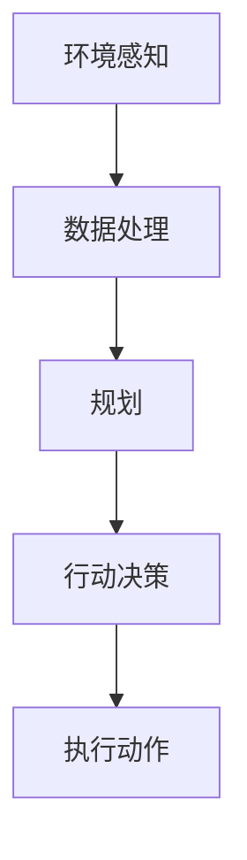
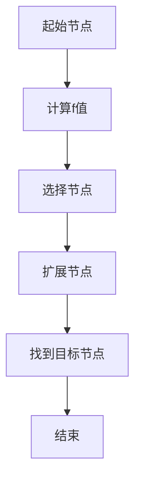
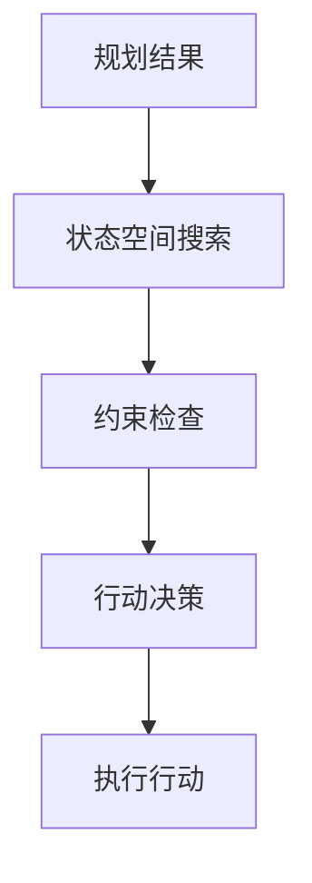

                 

# AI Agent通过行动基于环境和规划做出具体的动作

> **关键词**：AI Agent, 环境感知，规划算法，行动决策

**摘要**：本文深入探讨了人工智能代理（AI Agent）如何通过感知环境、制定规划并执行具体动作的机制。我们首先回顾了相关的背景知识，随后详细阐述了核心概念与联系，介绍了核心算法原理和具体操作步骤，并通过数学模型和公式进行了详细讲解。此外，我们提供了实际项目实战的代码实例，探讨了AI Agent的实际应用场景，并推荐了相关学习资源和开发工具框架。最后，我们对未来发展趋势与挑战进行了总结，并提供了常见问题与解答。

## 1. 背景介绍

在人工智能领域，代理（Agent）是一个核心概念。代理被定义为能够感知环境、制定计划并采取行动以实现特定目标的实体。在人类世界中，代理可以是机器人、智能系统或者甚至是一个人。在人工智能代理（AI Agent）的研究中，我们关注的是如何使代理具有自主性，能够根据环境变化做出合理的决策和行动。

### 1.1 人工智能代理的定义

人工智能代理是一个具有感知、计划、决策和行动能力的计算机程序。它能够在复杂环境中独立操作，以实现特定目标。例如，自动驾驶汽车、智能客服机器人、游戏AI等都是人工智能代理的实例。

### 1.2 人工智能代理的发展历程

人工智能代理的研究可以追溯到20世纪70年代。最初的研究集中在简单的规则系统，例如专家系统。这些系统通过预定义的规则来模拟人类的推理过程。然而，随着环境和问题的复杂性增加，规则系统逐渐暴露出其局限性。随后，基于模型预测控制和强化学习的方法开始受到关注，它们能够使代理在动态环境中学习并改进其行为。

### 1.3 人工智能代理的应用场景

人工智能代理在多个领域都有广泛的应用，包括但不限于：

- **制造业**：机器人自动化生产线，提高生产效率和降低成本。
- **交通运输**：自动驾驶汽车、无人机物流，提高交通效率和安全性。
- **医疗**：智能诊断系统和辅助治疗，提高诊断和治疗的质量。
- **金融**：智能投顾和风险管理，优化投资策略和降低风险。

## 2. 核心概念与联系

在探讨AI Agent如何通过行动基于环境和规划做出具体动作之前，我们首先需要明确几个核心概念和它们之间的关系。

### 2.1 环境感知

环境感知是AI Agent的关键能力之一。它通过传感器（如摄像头、麦克风、激光雷达等）收集环境数据，然后将这些数据转化为有用的信息。环境感知的质量直接影响到代理的决策效果。

### 2.2 规划

规划（Planning）是指代理在感知到环境信息后，根据目标制定一系列动作序列的过程。规划的目标是找到一条能够实现目标的最佳路径或行动方案。

### 2.3 行动决策

行动决策（Action Decision）是在规划阶段生成的动作序列，它是代理实际执行的动作。行动决策需要考虑当前环境状态、目标以及资源的可用性。

### 2.4 核心概念联系图

为了更好地理解这些概念之间的关系，我们可以使用Mermaid流程图来表示：



在上图中，环境感知是整个过程的起点，它产生的数据经过处理用于规划。规划生成一系列动作，这些动作通过行动决策转化为具体行动，并最终执行。

## 3. 核心算法原理 & 具体操作步骤

### 3.1 规划算法

在AI Agent中，常用的规划算法包括基于图的搜索算法和基于启发式的算法。这里我们以A*搜索算法为例进行说明。

#### 3.1.1 A*搜索算法的基本原理

A*搜索算法是一种启发式搜索算法，它旨在找到从起始状态到目标状态的最短路径。算法的核心思想是评估每个节点的优先级，选择优先级最高的节点进行扩展。

#### 3.1.2 具体操作步骤

1. **初始化**：创建一个开放列表（Open List）和一个关闭列表（Closed List）。初始时，开放列表只包含起始节点，关闭列表为空。

2. **计算评估函数**：每个节点的评估函数由两部分组成：g(n)和h(n)。其中，g(n)是从起始节点到当前节点的实际代价，h(n)是从当前节点到目标节点的估计代价。A*算法选择f(n) = g(n) + h(n)作为节点的优先级。

3. **选择下一个节点**：从开放列表中选择f值最小的节点作为当前节点。

4. **扩展节点**：将当前节点的邻居节点加入开放列表，并更新它们的评估函数。

5. **重复步骤3和4**，直到找到目标节点或开放列表为空。

#### 3.1.3 A*搜索算法流程图



### 3.2 行动决策

在规划阶段生成了动作序列后，需要通过行动决策将它们转化为具体的行动。这一过程通常涉及到状态空间搜索和约束处理。

#### 3.2.1 状态空间搜索

状态空间搜索是一种在一系列状态中寻找特定状态的方法。在AI Agent中，状态空间搜索用于确定下一步应该采取哪些行动。

#### 3.2.2 约束处理

约束处理是行动决策中的重要环节。它确保代理在执行动作时不会违反任何规则或限制。

#### 3.2.3 行动决策流程图



## 4. 数学模型和公式 & 详细讲解 & 举例说明

### 4.1 规划算法中的评估函数

在规划算法中，评估函数是一个关键组件。以A*搜索算法为例，评估函数由两部分组成：

\[ f(n) = g(n) + h(n) \]

其中，\( g(n) \) 是从起始节点到当前节点的实际代价，通常表示为路径长度。\( h(n) \) 是从当前节点到目标节点的估计代价，它可以是一个具体的函数，如曼哈顿距离、欧几里得距离等。

### 4.2 行动决策中的状态空间搜索

在行动决策中，状态空间搜索用于找到满足约束条件的最佳状态。一个常见的算法是深度优先搜索（DFS）。其基本步骤如下：

1. **初始化**：创建一个空栈，将起始状态压入栈中。

2. **搜索**：重复以下步骤，直到找到目标状态或栈为空：
   - 从栈顶弹出当前状态。
   - 对当前状态进行扩展，生成所有可能的下一状态。
   - 将下一状态加入栈中。

### 4.3 举例说明

假设我们有一个简单的导航问题，目标是从点A移动到点B，每一步的移动代价为1。使用A*搜索算法，我们可以找到从A到B的最短路径。

**示例：**

- **起始节点**：A
- **目标节点**：B
- **环境**：A-B之间有直线距离为3

使用A*搜索算法，评估函数可以设置为 \( f(n) = g(n) + h(n) \)，其中 \( g(n) \) 是路径长度，\( h(n) \) 是曼哈顿距离。

1. **初始化**：创建开放列表和关闭列表，初始时只有起始节点A。
2. **计算评估函数**：对于节点A，\( f(A) = g(A) + h(A) = 0 + 3 = 3 \)。
3. **选择节点**：选择f值最小的节点A。
4. **扩展节点**：生成节点A的邻居节点B，\( f(B) = g(B) + h(B) = 1 + 2 = 3 \)。
5. **重复步骤3和4**，直到找到目标节点B。

最终，我们找到了从A到B的最短路径，路径长度为3。

## 5. 项目实战：代码实际案例和详细解释说明

### 5.1 开发环境搭建

为了更好地理解和实践本文提到的算法，我们将使用Python编程语言。在开始之前，确保您已经安装了Python环境（版本3.8及以上）和以下库：

- NumPy
- Matplotlib
- networkx

您可以通过以下命令进行安装：

```bash
pip install numpy matplotlib networkx
```

### 5.2 源代码详细实现和代码解读

下面是一个简单的A*搜索算法的实现，用于在二维网格中找到从起始节点到目标节点的最短路径。

```python
import numpy as np
import matplotlib.pyplot as plt
import networkx as nx

def a_star_search(grid, start, goal):
    """
    A*搜索算法实现。
    
    :param grid: 二维网格，表示环境。
    :param start: 起始节点。
    :param goal: 目标节点。
    :return: 最短路径。
    """
    # 创建图
    G = nx.Graph()

    # 添加节点和边
    for i in range(grid.shape[0]):
        for j in range(grid.shape[1]):
            G.add_node((i, j))
            if i > 0:
                G.add_edge((i, j), (i - 1, j), weight=1)
            if j > 0:
                G.add_edge((i, j), (i, j - 1), weight=1)

    # 计算最短路径
    path = nx.astar_path(G, source=start, target=goal, weight='weight')

    return path

def display_path(grid, path):
    """
    显示路径。
    
    :param grid: 二维网格，表示环境。
    :param path: 路径。
    """
    # 绘制网格
    plt.imshow(grid, cmap='gray')

    # 标记路径
    for i in range(len(path) - 1):
        plt.plot([path[i][0], path[i + 1][0]], [path[i][1], path[i + 1][1]], 'r')

    # 显示图像
    plt.show()

if __name__ == '__main__':
    # 创建一个简单的网格环境
    grid = np.array([[0, 0, 0, 0, 0],
                     [0, 1, 1, 1, 0],
                     [0, 0, 0, 0, 0],
                     [0, 1, 1, 1, 0],
                     [0, 0, 0, 0, 0]])

    # 定义起始节点和目标节点
    start = (0, 0)
    goal = (4, 4)

    # 执行A*搜索算法
    path = a_star_search(grid, start, goal)

    # 显示路径
    display_path(grid, path)
```

### 5.3 代码解读与分析

上述代码实现了一个简单的A*搜索算法，用于在二维网格中找到从起始节点到目标节点的最短路径。

- **A*搜索算法**：`a_star_search` 函数实现A*搜索算法。首先创建一个图，将网格中的每个点作为节点，相邻点之间添加边。然后使用`nx.astar_path` 函数计算最短路径。
- **路径显示**：`display_path` 函数用于将计算得到的路径在网格上可视化显示。使用Matplotlib库的`imshow` 函数绘制网格，使用红色线条标记路径。

通过这个简单的示例，我们可以看到A*搜索算法在解决实际问题时是如何工作的。

## 6. 实际应用场景

AI Agent在实际应用中扮演着重要角色，以下是一些典型应用场景：

- **自动驾驶**：自动驾驶汽车使用AI Agent来感知道路环境、规划行驶路径并做出驾驶决策。
- **智能机器人**：智能机器人通过AI Agent来理解环境、制定动作计划并执行任务，如家用机器人、工业机器人等。
- **游戏AI**：游戏中的NPC（非玩家角色）使用AI Agent来感知游戏状态、制定策略并采取行动，提高游戏的真实感和挑战性。
- **智能推荐系统**：智能推荐系统使用AI Agent来分析用户行为、制定推荐策略并实时推荐商品或内容。

## 7. 工具和资源推荐

### 7.1 学习资源推荐

- **书籍**：
  - 《人工智能：一种现代的方法》（作者：Stuart J. Russell & Peter Norvig）
  - 《机器学习》（作者：周志华）
- **论文**：
  - “ Reinforcement Learning: An Introduction”（作者：Richard S. Sutton & Andrew G. Barto）
  - “ Planning and Learning in Autonomous Agents”（作者：Michael P. Wellman）
- **博客**：
  - 知乎专栏“机器学习与人工智能”
  - Medium上的“AI人工智能”
- **网站**：
  - Coursera上的“机器学习”课程
  - Udacity的“深度学习纳米学位”

### 7.2 开发工具框架推荐

- **工具**：
  - TensorFlow
  - PyTorch
  - Keras
- **框架**：
  - Unity ML-Agents
  - OpenAI Gym
  - reinforcement-learning-lib

### 7.3 相关论文著作推荐

- **论文**：
  - “Deep Reinforcement Learning”（作者：DeepMind团队）
  - “Simultaneous Human-AI Planning”（作者：Pieter Abbeel等人）
- **著作**：
  - 《深度强化学习》（作者：熊昊等）
  - 《人工智能的未来》（作者：刘慈欣）

## 8. 总结：未来发展趋势与挑战

随着人工智能技术的不断进步，AI Agent将在各个领域发挥越来越重要的作用。未来，AI Agent的发展趋势包括：

- **自主性增强**：AI Agent将具备更高的自主决策能力，能够在复杂环境中自主运行。
- **多模态感知**：AI Agent将整合多种传感器数据，实现更全面的环境感知。
- **强化学习应用**：强化学习将在AI Agent中发挥更大作用，提高其适应性和学习能力。

然而，AI Agent的发展也面临一些挑战，如：

- **安全性和隐私保护**：确保AI Agent在运行过程中的安全性和用户隐私保护。
- **复杂环境建模**：复杂环境的建模和预测仍然是一个挑战，需要进一步提高算法的准确性和效率。
- **伦理和道德**：随着AI Agent的普及，如何确保其行为符合伦理和道德标准，也是一个需要深入探讨的问题。

## 9. 附录：常见问题与解答

### 9.1 什么是AI Agent？

AI Agent是一种具有感知、计划、决策和行动能力的计算机程序，能够在复杂环境中独立操作以实现特定目标。

### 9.2 AI Agent的核心能力是什么？

AI Agent的核心能力包括环境感知、规划、决策和行动。

### 9.3 常用的规划算法有哪些？

常用的规划算法包括A*搜索算法、基于模型的预测控制和强化学习算法。

### 9.4 如何确保AI Agent的安全性？

确保AI Agent的安全性需要从多个方面进行考虑，包括算法设计、数据隐私保护、运行环境监控等。

## 10. 扩展阅读 & 参考资料

- “Introduction to AI Agents”（作者：Michael L. Littman）
- “AI: A Modern Approach”（作者：Stuart J. Russell & Peter Norvig）
- “Reinforcement Learning: An Introduction”（作者：Richard S. Sutton & Andrew G. Barto）
- “Planning and Learning in Autonomous Agents”（作者：Michael P. Wellman）
- “Deep Reinforcement Learning”（作者：DeepMind团队）
- “Simultaneous Human-AI Planning”（作者：Pieter Abbeel等人）
- “机器学习”（作者：周志华）
- “深度强化学习”（作者：熊昊等）
- “人工智能的未来”（作者：刘慈欣）

