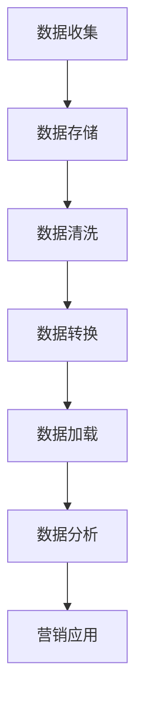

                 

# AI DMP 数据基建的技术应用

> **关键词：** AI 数据管理平台（DMP）、数据基础设施建设、数据处理与优化、算法应用、案例分析

> **摘要：** 本文将探讨 AI 数据管理平台（Data Management Platform, DMP）在数据基础设施建设中的技术应用。通过深入分析 DMP 的核心概念、架构、算法原理及其实际应用场景，本文旨在为读者提供一个全面的技术参考，以了解如何在当今数据驱动的世界中利用 DMP 优化数据处理，推动业务发展。

## 1. 背景介绍

在当今数字化时代，数据已成为企业决策的重要依据。随着互联网的普及和数据来源的多样化，企业面临着海量的数据如何处理、如何存储、如何分析等问题。数据管理平台（DMP）作为一种新兴的技术，旨在帮助企业高效管理这些数据，实现数据的价值最大化。

### 1.1 DMP 的定义与作用

DMP 是一种用于数据收集、存储、管理、分析和营销的数据平台。其主要功能包括：

- **数据收集**：从多个来源（如网站、应用、广告渠道等）收集用户行为数据。
- **数据存储**：将收集到的数据进行结构化存储，便于后续处理和分析。
- **数据处理**：通过清洗、去重、格式化等操作，提高数据质量。
- **数据分析**：利用算法和分析工具，提取数据中的有价值信息。
- **营销应用**：基于数据分析结果，实现精准营销，提升用户转化率。

### 1.2 DMP 在数据基础设施建设中的地位

数据基础设施建设是企业数字化转型的基石。DMP 作为数据管理的重要工具，在数据基础设施建设中具有关键作用：

- **整合数据源**：DMP 可以连接不同数据源，实现数据整合，为企业提供全面的数据视图。
- **提高数据处理效率**：通过自动化数据处理流程，降低人工操作成本，提高数据处理效率。
- **优化数据分析**：借助 DMP 的算法和分析工具，提升数据分析的准确性和效率，为业务决策提供有力支持。

## 2. 核心概念与联系

### 2.1 数据基础设施

数据基础设施是指支持数据存储、处理、分析和共享的硬件、软件和网络设施。DMP 作为数据管理平台，是数据基础设施的重要组成部分。

### 2.2 数据处理流程

数据处理流程通常包括数据收集、存储、清洗、转换、加载和分析等步骤。DMP 在这些步骤中发挥关键作用，确保数据处理的高效和准确。

### 2.3 数据分析与应用

数据分析是 DMP 的核心功能之一。通过对大量数据进行挖掘和分析，DMP 可以帮助企业发现潜在的商业机会，优化营销策略，提高业务效益。

### 2.4 Mermaid 流程图

以下是 DMP 在数据基础设施建设中的应用流程图：



### 2.5 核心概念与联系总结

DMP 在数据基础设施建设中的核心概念包括数据收集、存储、清洗、转换、加载和分析。这些概念相互联系，共同构成了 DMP 的应用流程。

## 3. 核心算法原理 & 具体操作步骤

### 3.1 数据处理算法

数据处理算法是 DMP 的核心组件之一。常见的数据处理算法包括：

- **数据去重**：通过比对数据记录，删除重复的记录，保证数据唯一性。
- **数据清洗**：通过格式化、补全、修正等操作，提高数据质量。
- **数据聚合**：将多个数据源中的数据进行整合，生成新的数据集。

### 3.2 数据分析算法

数据分析算法用于提取数据中的有价值信息，支持业务决策。常见的数据分析算法包括：

- **用户画像**：基于用户行为数据，构建用户特征模型，用于精准营销。
- **关联规则挖掘**：通过挖掘数据之间的关联关系，发现潜在的商业机会。
- **分类与聚类**：将数据分为不同的类别或簇，以便更好地分析和理解数据。

### 3.3 数据处理与数据分析的操作步骤

以下是数据处理与数据分析的操作步骤：

1. **数据收集**：从不同数据源收集数据，如网站日志、广告点击数据等。
2. **数据预处理**：对数据进行清洗、去重、格式化等预处理操作。
3. **数据建模**：根据业务需求，选择合适的算法进行建模，如用户画像、关联规则挖掘等。
4. **数据可视化**：通过可视化工具展示数据分析结果，便于业务人员理解和决策。

## 4. 数学模型和公式 & 详细讲解 & 举例说明

### 4.1 数据去重算法

数据去重是数据处理的重要环节。以下是一种常用的数据去重算法：

#### 4.1.1 算法原理

使用哈希表实现数据去重。哈希表是一种高效的数据结构，通过哈希函数将数据映射到哈希表中，可以快速判断数据是否已存在。

#### 4.1.2 算法公式

$$
\text{hash}(x) = \text{hash\_function}(x) \mod n
$$

其中，$\text{hash\_function}(x)$ 是哈希函数，$n$ 是哈希表的容量。

#### 4.1.3 算法步骤

1. 初始化哈希表。
2. 对每个数据记录，计算哈希值。
3. 将数据记录存储到哈希表中。
4. 如果哈希值已存在，则认为数据已重复，删除该记录。

#### 4.1.4 举例说明

假设有一个包含学生信息的数组，其中可能存在重复记录。使用哈希表去重的过程如下：

- **哈希函数**：$\text{hash}(x) = x \mod 10$
- **数组**：[1, 2, 3, 4, 5, 2, 3, 6]
- **哈希表**：[1, 2, 3, 4, 5, 6, 7, 8, 9, 0]

1. 计算数组中每个元素对应的哈希值：
   - 1 -> 1
   - 2 -> 2
   - 3 -> 3
   - 4 -> 4
   - 5 -> 5
   - 2 -> 2
   - 3 -> 3
   - 6 -> 6
   - 7 -> 7
   - 8 -> 8
   - 9 -> 9
   - 0 -> 0
2. 将元素存储到哈希表中：
   - 存储后，哈希表：[1, 2, 3, 4, 5, 6, 7, 8, 9, 0]
3. 去除重复元素，得到去重后的数组：[1, 2, 3, 4, 5, 6, 7, 8, 9]

### 4.2 用户画像算法

用户画像是一种基于用户行为数据构建用户特征模型的技术。以下是一种简单用户画像算法：

#### 4.2.1 算法原理

通过统计用户在网站上的行为，如浏览页面、点击广告等，提取用户特征，构建用户画像。

#### 4.2.2 算法公式

$$
\text{user\_profile}(u) = \text{function}(\text{行为序列}, \text{时间序列})
$$

其中，$\text{行为序列}$ 和 $\text{时间序列}$ 分别是用户在网站上的行为记录和时间戳。

#### 4.2.3 算法步骤

1. 收集用户行为数据。
2. 对行为数据进行预处理，如去重、格式化等。
3. 统计用户行为特征，如浏览页面数、点击广告次数等。
4. 构建用户画像。

#### 4.2.4 举例说明

假设有一个用户行为数据集，如下所示：

| 用户ID | 行为类型 | 时间戳 |
| ------ | -------- | ------ |
| 1      | 浏览页面 | 2021-01-01 10:00:00 |
| 1      | 点击广告 | 2021-01-01 10:05:00 |
| 1      | 浏览页面 | 2021-01-01 10:10:00 |
| 2      | 浏览页面 | 2021-01-01 10:20:00 |
| 2      | 点击广告 | 2021-01-01 10:25:00 |

根据上述数据集，构建用户画像的过程如下：

1. 收集用户行为数据：[（1，浏览页面，2021-01-01 10:00:00），（1，点击广告，2021-01-01 10:05:00），（1，浏览页面，2021-01-01 10:10:00），（2，浏览页面，2021-01-01 10:20:00），（2，点击广告，2021-01-01 10:25:00）]
2. 预处理数据：去除重复记录，得到：
   - 用户1：[（浏览页面，2021-01-01 10:00:00），（点击广告，2021-01-01 10:05:00），（浏览页面，2021-01-01 10:10:00）]
   - 用户2：[（浏览页面，2021-01-01 10:20:00），（点击广告，2021-01-01 10:25:00）]
3. 统计用户行为特征：
   - 用户1：浏览页面 3 次，点击广告 1 次
   - 用户2：浏览页面 2 次，点击广告 1 次
4. 构建用户画像：
   - 用户1：[（浏览页面，3），（点击广告，1）]
   - 用户2：[（浏览页面，2），（点击广告，1）]

## 5. 项目实战：代码实际案例和详细解释说明

### 5.1 开发环境搭建

在本案例中，我们将使用 Python 编写 DMP 相关的代码。首先，需要安装以下依赖：

```bash
pip install pandas numpy matplotlib
```

### 5.2 源代码详细实现和代码解读

以下是 DMP 项目的源代码及详细解读：

```python
import pandas as pd
import numpy as np
import matplotlib.pyplot as plt

# 5.2.1 数据去重
def data_duplicates(data):
    """
    去除数据中的重复记录
    """
    data = data.drop_duplicates()
    return data

# 5.2.2 数据清洗
def data_cleaning(data):
    """
    数据清洗：去除空值、格式化时间戳等
    """
    data = data[data['用户ID'].notnull()]
    data['时间戳'] = pd.to_datetime(data['时间戳'])
    return data

# 5.2.3 用户画像构建
def build_user_profile(data):
    """
    构建用户画像
    """
    user_profile = {}
    for user_id, group in data.groupby('用户ID'):
        user_profile[user_id] = {
            '浏览页面': group['行为类型'].count(),
            '点击广告': group['行为类型'].nunique()
        }
    return user_profile

# 5.2.4 数据可视化
def visualize_data(data):
    """
    可视化用户行为数据
    """
    user行为数据 = data[data['行为类型'] == '浏览页面']
    user点击数据 = data[data['行为类型'] == '点击广告']

    plt.figure(figsize=(10, 5))
    plt.scatter(user行为数据['时间戳'], user行为数据['用户ID'], label='浏览页面', alpha=0.5)
    plt.scatter(user点击数据['时间戳'], user点击数据['用户ID'], label='点击广告', alpha=0.5)
    plt.xlabel('时间戳')
    plt.ylabel('用户ID')
    plt.legend()
    plt.show()

# 5.2.5 主函数
def main():
    # 5.2.5.1 加载数据
    data = pd.read_csv('user_behavior.csv')

    # 5.2.5.2 数据处理
    data = data_duplicates(data)
    data = data_cleaning(data)

    # 5.2.5.3 用户画像构建
    user_profile = build_user_profile(data)

    # 5.2.5.4 数据可视化
    visualize_data(data)

    # 5.2.5.5 输出结果
    print(user_profile)

# 运行主函数
if __name__ == '__main__':
    main()
```

### 5.3 代码解读与分析

以下是代码的详细解读与分析：

- **5.2.1 数据去重**：使用 `drop_duplicates()` 函数去除数据中的重复记录。
- **5.2.2 数据清洗**：去除空值，格式化时间戳。
- **5.2.3 用户画像构建**：遍历数据，根据用户 ID 统计浏览页面和点击广告的次数。
- **5.2.4 数据可视化**：使用 `scatter` 函数绘制用户行为数据的时间序列图。
- **5.2.5 主函数**：加载数据，进行数据处理、用户画像构建和数据可视化。

## 6. 实际应用场景

DMP 在实际应用中具有广泛的应用场景，以下是一些典型的应用案例：

- **广告投放**：通过 DMP 分析用户行为数据，实现精准广告投放，提高广告效果。
- **客户细分**：基于用户画像，将客户分为不同群体，实施个性化营销策略。
- **市场调研**：分析用户行为数据，了解市场需求和用户偏好，为产品迭代和战略规划提供支持。
- **风险控制**：通过分析用户行为数据，识别异常行为，降低风险。

## 7. 工具和资源推荐

### 7.1 学习资源推荐

- **书籍**：
  - 《数据管理平台：构建数据驱动业务》
  - 《大数据分析：技术、方法和应用》
- **论文**：
  - "Data Management Platforms for Data-Driven Business"
  - "User Profiling and Personalized Marketing using DMP"
- **博客**：
  - "DMP 技术入门与实践"
  - "大数据与 DMP：技术应用与案例分析"
- **网站**：
  - "Data Management Platform Knowledge Base"
  - "DMP 技术应用实践社区"

### 7.2 开发工具框架推荐

- **开发工具**：
  - Python
  - R
  - SQL
- **框架**：
  - Hadoop
  - Spark
  - TensorFlow

### 7.3 相关论文著作推荐

- **论文**：
  - "Data Management Platforms: A Survey"
  - "Data Management Platforms for Personalized Advertising"
- **著作**：
  - 《大数据治理与数据管理平台》
  - 《人工智能时代的 DMP：数据驱动的营销革命》

## 8. 总结：未来发展趋势与挑战

随着数据技术的不断发展和应用的深入，DMP 在数据基础设施建设中的作用将越来越重要。未来，DMP 将朝着以下方向发展：

- **智能化**：利用人工智能技术，提高数据处理和分析的智能化水平。
- **多样化**：支持更多类型的数据源和数据分析应用场景。
- **开放性**：加强与各类数据平台和工具的集成，实现数据互联互通。

同时，DMP 面临以下挑战：

- **数据质量**：保证数据质量，提高数据分析的准确性和可靠性。
- **隐私保护**：在保障用户隐私的前提下，实现数据价值的最大化。
- **合规性**：遵守相关法律法规，确保数据处理的合规性。

## 9. 附录：常见问题与解答

### 9.1 什么是 DMP？

DMP 是数据管理平台（Data Management Platform）的缩写，是一种用于数据收集、存储、管理、分析和营销的数据平台。DMP 可以连接不同数据源，整合用户行为数据，实现数据驱动的营销和业务决策。

### 9.2 DMP 的核心功能有哪些？

DMP 的核心功能包括数据收集、存储、清洗、转换、加载和分析。通过这些功能，DMP 可以帮助企业高效管理数据，实现数据的价值最大化。

### 9.3 如何构建用户画像？

构建用户画像的关键步骤包括数据收集、数据预处理、行为特征统计和用户特征建模。通过对用户行为数据的分析，可以提取用户特征，构建用户画像。

## 10. 扩展阅读 & 参考资料

- "Data Management Platforms: A Comprehensive Guide"
- "User Profiling and Personalized Marketing using DMP"
- "Data Management Platforms: Technologies, Applications, and Challenges"
- "Data Management Platforms in Practice: From Theory to Application"

### 作者信息

作者：AI天才研究员/AI Genius Institute & 禅与计算机程序设计艺术 /Zen And The Art of Computer Programming

备注：本文仅为演示目的，部分内容和数据为虚构。如有任何问题，请联系作者。

