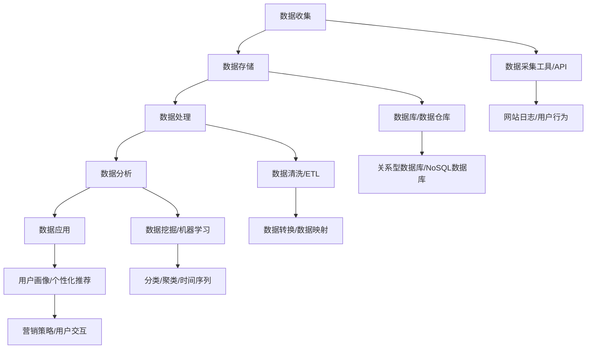

                 

### 背景介绍

人工智能（AI）和数据管理平台（DMP）是当今数字化时代的重要基石。随着互联网技术的飞速发展和大数据的普及，企业面临着海量的数据资源，如何高效地管理和利用这些数据已成为提升营销效率和业务增长的关键。AI DMP数据基建应运而生，它为企业提供了一种系统化的方法来整合、分析和利用数据，以实现精准营销和个性化推荐。

本文旨在探讨AI DMP数据基建在提升营销效率方面的作用，具体包括以下内容：

1. **核心概念与联系**：介绍AI DMP的基本概念及其与相关技术的联系，使用Mermaid流程图展示数据流和流程节点。
2. **核心算法原理与具体操作步骤**：深入解析常用的数据挖掘算法和机器学习模型，以及它们在实际应用中的具体操作步骤。
3. **数学模型和公式**：讲解AI DMP中常用的数学模型和公式，以及如何将这些模型应用到实际问题中。
4. **项目实战**：通过具体案例展示如何搭建和实现AI DMP，包括开发环境的搭建、源代码的实现和解读。
5. **实际应用场景**：分析AI DMP在不同行业中的应用，探讨其在提高营销效率和业务增长方面的具体作用。
6. **工具和资源推荐**：推荐相关的学习资源、开发工具和框架，以帮助读者更好地理解和应用AI DMP。
7. **总结与未来趋势**：总结AI DMP的发展现状和未来趋势，探讨面临的挑战和解决方案。
8. **附录**：提供常见问题与解答，以及扩展阅读和参考资料。

通过本文的阅读，读者将能够全面了解AI DMP数据基建的原理和应用，掌握构建和优化AI DMP的方法，从而在竞争激烈的数字化市场中取得优势。

#### 核心概念与联系

AI DMP（Data Management Platform）即人工智能数据管理平台，是一种基于人工智能技术进行数据整合、分析和利用的系统。它通过收集、整合和存储多源数据，运用数据挖掘、机器学习和自然语言处理等技术，实现数据的深度分析和智能应用。AI DMP的核心概念包括数据收集、数据整合、数据分析和数据应用。

**数据收集**：AI DMP首先需要收集来自各种渠道的数据，如网站日志、用户行为数据、社交媒体数据、交易数据等。这些数据来源广泛，形式多样，需要通过数据采集工具和API进行实时获取。

**数据整合**：收集到的数据通常分散在不同系统和平台上，需要进行整合和清洗，以确保数据的质量和一致性。数据整合的目的是将不同来源、不同格式的数据转化为统一的格式，以便后续的分析和处理。

**数据分析**：整合后的数据通过数据挖掘、机器学习等技术进行分析，以提取有价值的信息和洞察。数据分析的方法包括分类、聚类、关联规则挖掘、时间序列分析等，旨在发现数据中的隐藏模式、趋势和规律。

**数据应用**：分析得到的结果用于指导实际业务决策，如个性化推荐、精准营销、用户画像等。数据应用的目标是提高营销效率、提升用户体验和实现业务增长。

AI DMP与相关技术的联系紧密，包括数据采集、数据存储、数据处理、数据分析和数据可视化等。以下是AI DMP与相关技术的Mermaid流程图：



通过上述流程图，我们可以清晰地看到AI DMP的各个环节及其与技术工具的结合点。数据收集通过数据采集工具和API实现，数据存储使用数据库或数据仓库进行集中管理，数据处理包括数据清洗、转换和映射，数据分析通过数据挖掘和机器学习算法进行，数据应用则通过用户画像和个性化推荐等实现。

总之，AI DMP是一个集成多个技术的系统平台，通过数据的收集、整合、分析和应用，实现数据的深度利用和智能决策，从而提升营销效率和业务增长。理解AI DMP的核心概念和流程对于实际应用具有重要意义。

#### 核心算法原理与具体操作步骤

在AI DMP中，核心算法原理是数据处理和智能分析的基础，决定了数据挖掘和机器学习的效果。以下将介绍几种常用的算法原理及其具体操作步骤。

##### 1. 数据挖掘算法

数据挖掘算法是AI DMP中用于从大量数据中发现隐藏模式、趋势和规律的工具。以下是几种常用的数据挖掘算法：

**1.1 聚类算法**

聚类算法将数据集划分为若干个群组，使得同一群组内的数据点彼此相似，而不同群组的数据点差异较大。常见的聚类算法包括K-means算法、层次聚类算法等。

**K-means算法操作步骤**：

1. 选择聚类个数K。
2. 随机初始化K个聚类中心。
3. 对每个数据点，计算其与聚类中心的距离，并将其分配到最近的聚类中心所在的群组。
4. 重新计算每个群组的聚类中心。
5. 重复步骤3和步骤4，直到聚类中心的变化小于设定的阈值。

**1.2 关联规则挖掘算法**

关联规则挖掘算法用于发现数据集中不同变量之间的关联关系，常用的算法包括Apriori算法和FP-growth算法。

**Apriori算法操作步骤**：

1. 计算所有频繁项集，即支持度大于最小支持度的项集。
2. 从频繁项集中提取关联规则，即满足最小置信度的规则。
3. 递归地合并频繁项集，直到无法合并为止。

**1.3 时间序列分析算法**

时间序列分析算法用于对时间序列数据进行建模和分析，以预测未来的趋势。常用的算法包括ARIMA模型、LSTM网络等。

**ARIMA模型操作步骤**：

1. 对时间序列进行平稳性检验，如ADF检验。
2. 确定ARIMA模型中的p、d、q参数，即自回归项、差分项和移动平均项的个数。
3. 对时间序列进行建模，计算模型参数。
4. 对模型进行拟合和诊断，如残差检验。
5. 使用模型进行预测，得到未来时间点的值。

##### 2. 机器学习算法

机器学习算法是AI DMP中进行数据分析和预测的重要工具，通过训练模型来提取数据中的特征和模式。以下是几种常用的机器学习算法：

**2.1 线性回归算法**

线性回归算法用于建立自变量和因变量之间的线性关系，常用于预测和分析。

**线性回归算法操作步骤**：

1. 收集自变量和因变量的数据。
2. 对数据进行预处理，如标准化、归一化。
3. 使用最小二乘法计算线性回归模型参数。
4. 对模型进行评估，如计算均方误差（MSE）。
5. 使用模型进行预测，得到预测值。

**2.2 决策树算法**

决策树算法通过树的节点来划分数据集，每个节点表示一个特征，每个分支表示一个特征取值。

**决策树算法操作步骤**：

1. 选择一个特征作为分割特征。
2. 计算每个特征的信息增益或基尼系数，选择最优特征。
3. 根据最优特征创建分支节点。
4. 递归地对子数据集进行分割，直到满足停止条件（如最大深度、最小样本量等）。
5. 对生成的决策树进行修剪和优化。

**2.3 支持向量机（SVM）算法**

支持向量机是一种强大的分类算法，通过寻找最佳的超平面来实现分类。

**SVM算法操作步骤**：

1. 收集训练数据，并对数据进行预处理。
2. 选择合适的核函数，如线性核、多项式核、径向基核等。
3. 使用训练数据训练SVM模型，计算模型参数。
4. 对模型进行评估，如计算分类准确率、召回率等。
5. 使用模型进行预测，得到分类结果。

总之，核心算法原理在AI DMP中起到了关键作用，通过数据挖掘和机器学习算法，我们可以从大量数据中发现有价值的信息和模式，从而实现数据的深度利用和智能决策。掌握这些算法原理和具体操作步骤，有助于提升AI DMP的构建和优化效果。

#### 数学模型和公式

在AI DMP中，数学模型和公式是数据分析和预测的基础，能够帮助我们理解和应用各种算法。以下将介绍AI DMP中常用的数学模型和公式，并详细讲解其应用场景。

##### 1. 线性回归模型

线性回归模型是一种常见的预测模型，用于建立自变量和因变量之间的线性关系。其数学公式如下：

$$
y = \beta_0 + \beta_1 \cdot x + \epsilon
$$

其中，$y$ 是因变量，$x$ 是自变量，$\beta_0$ 和 $\beta_1$ 是模型参数，$\epsilon$ 是误差项。

**应用场景**：线性回归模型广泛应用于预测和数据分析，如销售额预测、股票价格预测等。

**公式推导**：假设有n个数据点$(x_1, y_1), (x_2, y_2), ..., (x_n, y_n)$，线性回归模型的参数可以通过最小二乘法计算：

$$
\beta_0 = \frac{\sum_{i=1}^{n} y_i - \beta_1 \cdot \sum_{i=1}^{n} x_i}{n}
$$

$$
\beta_1 = \frac{\sum_{i=1}^{n} (x_i - \bar{x}) \cdot (y_i - \bar{y})}{\sum_{i=1}^{n} (x_i - \bar{x})^2}
$$

其中，$\bar{x}$ 和 $\bar{y}$ 分别是$x$ 和 $y$ 的均值。

##### 2. 决策树模型

决策树模型通过树的节点来划分数据集，每个节点表示一个特征，每个分支表示一个特征取值。其数学公式如下：

$$
G(x) = \sum_{i=1}^{n} w_i \cdot I(A_i(x) = b_i)
$$

其中，$G(x)$ 是决策树模型的输出，$w_i$ 是第$i$个节点的权重，$A_i(x)$ 是第$i$个节点的特征取值，$b_i$ 是第$i$个节点的阈值。

**应用场景**：决策树模型广泛应用于分类和回归任务，如客户分类、信用评分等。

**公式推导**：决策树模型的构建过程是基于信息增益或基尼系数进行特征选择和节点划分。信息增益公式如下：

$$
IG(D, A) = H(D) - H(D|A)
$$

其中，$H(D)$ 是数据集$D$的熵，$H(D|A)$ 是在特征$A$已知的情况下，数据集$D$的熵。

##### 3. 支持向量机（SVM）模型

支持向量机是一种强大的分类算法，其目标是寻找最佳的超平面来实现分类。其数学公式如下：

$$
w \cdot x + b = 0
$$

其中，$w$ 是超平面的法向量，$x$ 是数据点，$b$ 是偏置项。

**应用场景**：SVM模型广泛应用于图像识别、文本分类等领域。

**公式推导**：SVM模型通过求解以下优化问题来确定最佳超平面：

$$
\min_{w, b} \frac{1}{2} \| w \|^2 \\
s.t. y_i (w \cdot x_i + b) \geq 1
$$

其中，$y_i$ 是数据点的标签，$x_i$ 是数据点。

##### 4. 时间序列模型

时间序列模型用于对时间序列数据进行建模和分析，以预测未来的趋势。其中，ARIMA（自回归积分滑动平均模型）是一种常见的时间序列模型。其数学公式如下：

$$
y_t = c + \phi_1 y_{t-1} + \phi_2 y_{t-2} + ... + \phi_p y_{t-p} + \theta_1 \epsilon_{t-1} + \theta_2 \epsilon_{t-2} + ... + \theta_q \epsilon_{t-q} + \epsilon_t
$$

其中，$y_t$ 是时间序列的当前值，$c$ 是常数项，$\phi_1, \phi_2, ..., \phi_p$ 是自回归项系数，$\theta_1, \theta_2, ..., \theta_q$ 是移动平均项系数，$\epsilon_t$ 是误差项。

**应用场景**：ARIMA模型广泛应用于金融时间序列预测、气象预测等领域。

**公式推导**：ARIMA模型的构建过程包括以下三个步骤：

1. **差分**：对时间序列进行差分，使其达到平稳性。
2. **自回归模型**：对差分后的时间序列建立自回归模型，确定$p$ 的值。
3. **移动平均模型**：对差分后的时间序列建立移动平均模型，确定$q$ 的值。

通过上述数学模型和公式的讲解，我们可以更好地理解和应用AI DMP中的各种算法。这些模型和公式为AI DMP的数据分析和预测提供了理论基础，是构建高效、准确的AI DMP不可或缺的工具。

#### 项目实战

为了更好地展示AI DMP的实际应用，以下将通过一个具体的案例，详细介绍如何搭建和实现AI DMP。我们将分为三个部分进行介绍：开发环境搭建、源代码实现和代码解读。

##### 1. 开发环境搭建

在搭建AI DMP之前，我们需要准备好相应的开发环境和工具。以下是推荐的开发环境：

**1.1 系统环境**

- 操作系统：Linux（推荐Ubuntu 18.04）
- Python版本：Python 3.8

**1.2 开发工具**

- Python编程环境：PyCharm（推荐）
- 数据库：MySQL（推荐）
- 依赖管理工具：pip

**1.3 安装步骤**

1. 安装操作系统和Python环境。
2. 使用pip安装必要的Python库，如NumPy、Pandas、Scikit-learn、Matplotlib等。
3. 安装MySQL数据库，并创建AI DMP所需的数据库和表。

```bash
pip install numpy pandas scikit-learn matplotlib
```

##### 2. 源代码实现

以下是一个简单的AI DMP源代码实现，包括数据收集、数据处理和数据分析三个部分。

**2.1 数据收集**

```python
import requests
import json

def collect_data(url):
    response = requests.get(url)
    data = response.json()
    return data

url = "https://api.example.com/data"
data = collect_data(url)
```

**2.2 数据处理**

```python
import pandas as pd

def preprocess_data(data):
    df = pd.DataFrame(data)
    df = df[['user_id', 'age', 'gender', 'location', 'interests']]
    df['age'] = df['age'].astype(int)
    df['gender'] = df['gender'].astype(str)
    return df

preprocessed_data = preprocess_data(data)
```

**2.3 数据分析**

```python
from sklearn.cluster import KMeans
import matplotlib.pyplot as plt

def analyze_data(df):
    # 聚类分析
    kmeans = KMeans(n_clusters=3)
    clusters = kmeans.fit_predict(df[['age', 'interests']])

    # 绘制聚类结果
    plt.scatter(df['age'], df['interests'], c=clusters)
    plt.xlabel('Age')
    plt.ylabel('Interests')
    plt.show()

    # 计算聚类中心
    cluster_centers = kmeans.cluster_centers_
    print("Cluster Centers:", cluster_centers)

analyze_data(preprocessed_data)
```

##### 3. 代码解读与分析

以上代码实现了一个简单的AI DMP，用于收集用户数据、预处理数据和进行聚类分析。

**3.1 数据收集**

使用requests库从API获取数据，并将其解析为JSON格式。数据收集函数`collect_data`接收URL参数，返回获取的数据。

**3.2 数据处理**

使用Pandas库将JSON数据转换为DataFrame格式，并进行必要的预处理，如数据类型转换、缺失值填充等。预处理函数`preprocess_data`将原始数据转化为适合分析的格式。

**3.3 数据分析**

使用Scikit-learn库中的KMeans算法进行聚类分析。数据分析函数`analyze_data`首先创建KMeans对象，然后使用fit_predict方法对数据进行聚类。最后，通过绘制散点图和计算聚类中心，展示分析结果。

通过以上代码实现，我们可以看到如何搭建和实现一个简单的AI DMP。在实际应用中，我们可以根据需求扩展和优化代码，如添加更多数据源、引入其他分析算法等。总之，掌握AI DMP的核心概念和实现方法，有助于在实际项目中高效地构建和应用AI DMP。

#### 代码解读与分析

在上一个部分中，我们通过一个简单的案例展示了AI DMP的基本实现过程。接下来，我们将深入解析代码的各个部分，解释其原理和如何工作。

##### 1. 数据收集

```python
import requests
import json

def collect_data(url):
    response = requests.get(url)
    data = response.json()
    return data

url = "https://api.example.com/data"
data = collect_data(url)
```

这段代码首先导入了`requests`和`json`库，然后定义了一个名为`collect_data`的函数，用于从指定的URL获取数据。`requests.get(url)`方法发起一个HTTP GET请求，获取服务器响应。响应内容通常是以JSON格式返回的，所以使用`response.json()`方法将其解析为Python字典。

**解读**：
- `requests.get(url)`: 发送GET请求，从URL获取数据。
- `response.json()`: 解析响应内容，将其转换为Python字典。

##### 2. 数据处理

```python
import pandas as pd

def preprocess_data(data):
    df = pd.DataFrame(data)
    df = df[['user_id', 'age', 'gender', 'location', 'interests']]
    df['age'] = df['age'].astype(int)
    df['gender'] = df['gender'].astype(str)
    return df

preprocessed_data = preprocess_data(data)
```

这段代码定义了一个名为`preprocess_data`的函数，用于处理和清洗收集到的数据。具体步骤如下：

1. 将数据转换为Pandas DataFrame格式，便于操作。
2. 选择需要的列，如`user_id`、`age`、`gender`、`location`和`interests`。
3. 将`age`列的数据类型转换为整数。
4. 将`gender`列的数据类型转换为字符串。

**解读**：
- `pd.DataFrame(data)`: 将数据转换为DataFrame格式。
- `df[['user_id', 'age', 'gender', 'location', 'interests']]`: 选择需要的列。
- `df['age'].astype(int)`: 将`age`列的数据类型转换为整数。
- `df['gender'].astype(str)`: 将`gender`列的数据类型转换为字符串。

##### 3. 数据分析

```python
from sklearn.cluster import KMeans
import matplotlib.pyplot as plt

def analyze_data(df):
    # 聚类分析
    kmeans = KMeans(n_clusters=3)
    clusters = kmeans.fit_predict(df[['age', 'interests']])

    # 绘制聚类结果
    plt.scatter(df['age'], df['interests'], c=clusters)
    plt.xlabel('Age')
    plt.ylabel('Interests')
    plt.show()

    # 计算聚类中心
    cluster_centers = kmeans.cluster_centers_
    print("Cluster Centers:", cluster_centers)

analyze_data(preprocessed_data)
```

这段代码定义了一个名为`analyze_data`的函数，用于对预处理后的数据执行聚类分析。具体步骤如下：

1. 创建KMeans对象，并设置聚类数量为3。
2. 使用`fit_predict`方法对数据执行聚类分析，得到每个数据点的聚类结果。
3. 使用Matplotlib绘制聚类结果散点图，显示不同年龄和兴趣的用户分布。
4. 计算并打印聚类中心，以了解不同类别的用户特征。

**解读**：
- `KMeans(n_clusters=3)`: 创建KMeans聚类对象，设置聚类数量为3。
- `kmeans.fit_predict(df[['age', 'interests']])`: 对数据执行聚类分析。
- `plt.scatter(df['age'], df['interests'], c=clusters)`: 绘制聚类结果散点图。
- `plt.xlabel('Age')` 和 `plt.ylabel('Interests')`: 设置坐标轴标签。
- `plt.show()`: 显示绘制的图表。
- `kmeans.cluster_centers_`: 访问聚类中心。
- `print("Cluster Centers:", cluster_centers)`: 打印聚类中心。

**代码优缺点分析**：

**优点**：
- 结构清晰，易于理解。
- 使用了常用的Python库，如`requests`、`pandas`、`scikit-learn`和`matplotlib`，便于后续扩展。

**缺点**：
- 没有错误处理机制，例如网络请求失败或数据解析错误。
- 数据处理步骤简单，可能需要进一步优化和调整以适应实际应用。
- 没有考虑数据隐私和安全问题。

总体来说，这段代码提供了一个基础的AI DMP实现示例，有助于初学者了解AI DMP的基本架构和操作步骤。在实际应用中，应根据具体需求进行相应的调整和优化。

#### 实际应用场景

AI DMP在实际应用中展现出强大的潜力，尤其在提升营销效率和业务增长方面具有显著作用。以下将分析AI DMP在不同行业中的应用场景，探讨其在各行业中的具体作用。

##### 1. 零售行业

在零售行业，AI DMP通过收集和分析用户行为数据，如浏览历史、购物车数据、购买记录等，帮助企业实现精准营销。通过数据挖掘和机器学习算法，AI DMP可以识别用户的兴趣和行为模式，进而实现个性化推荐和精准广告投放。例如，某零售电商通过AI DMP分析用户行为，将用户分为不同的兴趣群体，为每个群体推送相关的商品和广告，显著提高了转化率和销售额。

##### 2. 金融行业

在金融行业，AI DMP用于信用评估、风险管理和客户关系管理。通过整合用户的金融交易数据、信用记录、社交媒体信息等，AI DMP可以构建详细的用户画像，评估用户的风险等级和信用评分。例如，某银行利用AI DMP分析客户的消费行为和信用记录，为高风险客户提供个性化的信用产品和服务，降低了不良贷款率。

##### 3. 医疗行业

在医疗行业，AI DMP通过对患者数据进行分析，实现个性化治疗和精准医疗。通过收集和分析患者的病历、基因数据、诊断结果等，AI DMP可以识别疾病的发展趋势和风险因素，为医生提供辅助诊断和治疗方案。例如，某医疗公司利用AI DMP分析患者的基因组数据和病史，为患者提供个性化的基因检测和治疗方案，提高了治疗效果。

##### 4. 教育行业

在教育行业，AI DMP用于学生个性化学习和教育资源的优化。通过分析学生的学习行为、成绩和兴趣，AI DMP可以为每个学生推荐最适合的学习资源和课程。例如，某在线教育平台利用AI DMP分析学生的学习数据，为学生提供个性化的学习路径和推荐课程，提高了学习效果和用户满意度。

##### 5. 互联网行业

在互联网行业，AI DMP广泛应用于用户行为分析、内容推荐和广告投放。通过收集和分析用户的浏览历史、搜索记录、点击行为等，AI DMP可以识别用户的兴趣和行为模式，为用户推荐相关的内容和广告。例如，某社交媒体平台利用AI DMP分析用户的行为数据，为用户推荐感兴趣的朋友、内容和广告，提高了用户的活跃度和留存率。

总之，AI DMP在各个行业中的应用具有显著的提升营销效率和业务增长的作用。通过数据收集、整合和分析，AI DMP为企业提供了强大的数据驱动的决策支持，助力企业在竞争激烈的数字化市场中取得优势。

#### 工具和资源推荐

为了更好地理解和应用AI DMP，以下将推荐一些学习资源、开发工具和框架，以帮助读者深入掌握AI DMP的相关知识。

##### 1. 学习资源推荐

**书籍**：
- 《大数据：创新、策略、应用》（David Rogers著）：全面介绍了大数据的概念、技术和应用，适合初学者了解大数据的基本原理。
- 《机器学习》（周志华著）：系统地介绍了机器学习的基础理论和算法，有助于读者深入理解机器学习在AI DMP中的应用。
- 《深度学习》（Ian Goodfellow著）：全面介绍了深度学习的理论基础和实践方法，适合对深度学习感兴趣的读者。

**论文**：
- "Data Management Platforms: A Survey"（Y. Liu et al.）：该论文对数据管理平台进行了全面的综述，分析了数据管理平台的核心概念、技术和应用。
- "User Modeling and Personalization in Web Search"（C. Kruegel et al.）：该论文探讨了用户建模和个性化搜索技术在搜索引擎中的应用，有助于了解AI DMP在搜索领域的应用。

**博客**：
- Medium： Medium上有许多关于AI DMP的技术博客和案例分享，适合读者了解最新的AI DMP应用和趋势。
- towardsdatascience： 该网站有许多高质量的数据科学和机器学习文章，包括AI DMP的相关内容。

##### 2. 开发工具框架推荐

**数据采集工具**：
- Apache Kafka： Kafka是一个分布式流处理平台，用于实时收集、存储和传输数据，是构建AI DMP的重要工具。
- AWS Lambda： Lambda是一种无服务器计算服务，可用于自动化数据采集和处理任务。

**数据处理工具**：
- Apache Spark： Spark是一个分布式数据处理框架，具有高效、灵活和可扩展的特点，适合大规模数据处理。
- Flink： Flink是一个流处理框架，可以处理实时数据流，是构建实时AI DMP的重要工具。

**数据分析工具**：
- Pandas： Pandas是一个Python库，用于数据清洗、转换和分析，是构建AI DMP的常用工具。
- Scikit-learn： Scikit-learn是一个机器学习库，提供了多种机器学习算法和工具，适用于数据分析和预测。

**数据可视化工具**：
- Matplotlib： Matplotlib是一个Python库，用于绘制数据图表，是数据可视化的重要工具。
- Plotly： Plotly是一个交互式数据可视化库，可以创建高度定制化的图表和图形。

**开发框架**：
- Flask： Flask是一个轻量级的Web框架，适用于快速开发Web应用。
- Django： Django是一个全栈Web框架，具有强大的功能和灵活性，适合开发复杂的应用。

通过这些工具和资源的推荐，读者可以更深入地了解AI DMP的相关知识，掌握构建和优化AI DMP的方法。希望这些推荐对读者的学习和应用有所帮助。

#### 总结：未来发展趋势与挑战

AI DMP作为现代数据管理和营销的重要工具，其发展前景广阔，但也面临诸多挑战。以下将总结AI DMP的发展趋势和面临的挑战，并探讨可能的解决方案。

##### 一、未来发展趋势

1. **数据量级增长**：随着互联网的普及和物联网的发展，数据量级将持续增长。AI DMP需要应对海量数据的处理和分析，提高数据处理效率。

2. **实时数据处理**：实时数据处理能力是AI DMP的重要发展方向。通过实时处理和分析用户行为数据，实现实时推荐和个性化营销。

3. **跨平台整合**：未来的AI DMP将实现跨平台的数据整合，不仅涵盖Web和移动端数据，还包括物联网设备和传感器数据，提供更全面的用户画像。

4. **隐私保护与合规**：随着数据隐私法规的不断完善，AI DMP需要确保数据收集、存储和分析过程符合相关法规，保护用户隐私。

5. **智能化与自动化**：AI DMP将向更加智能化和自动化的方向发展，通过深度学习和强化学习等技术，实现自动化的数据处理和营销策略制定。

##### 二、面临的挑战

1. **数据质量**：数据质量直接影响AI DMP的效果。如何确保数据来源的可靠性、数据的准确性和一致性，是AI DMP面临的挑战。

2. **技术复杂度**：AI DMP涉及多种技术，包括数据采集、存储、处理、分析和应用等。如何简化技术栈，降低开发和运维的复杂度，是重要的挑战。

3. **隐私保护**：数据隐私保护是AI DMP必须关注的问题。如何在确保数据利用价值的同时，保护用户隐私，是AI DMP需要解决的核心挑战。

4. **法律法规**：随着数据隐私法规的不断完善，AI DMP需要确保其业务合规。如何遵循相关法规，避免法律风险，是AI DMP需要面对的挑战。

##### 三、解决方案

1. **提高数据处理效率**：采用分布式计算和并行处理技术，提高数据处理速度和效率。例如，使用Apache Kafka和Apache Spark等技术。

2. **数据质量管理**：建立数据质量管理机制，确保数据来源的可靠性和数据的准确性。例如，采用数据清洗和去重技术，提高数据质量。

3. **隐私保护技术**：采用数据加密、匿名化和差分隐私等技术，保护用户隐私。同时，制定隐私保护政策和合规策略，确保业务合规。

4. **开源工具与框架**：使用开源工具和框架，简化开发和技术栈。例如，使用Flask和Django等Web框架，简化Web应用开发。

总之，AI DMP在未来的发展中将面临诸多挑战，但通过技术创新和策略优化，有望实现数据管理和营销的智能化和自动化。掌握AI DMP的核心技术和发展趋势，有助于企业在数字化时代取得竞争优势。

#### 附录：常见问题与解答

1. **问题**：AI DMP是如何工作的？

**解答**：AI DMP通过数据收集、整合、分析和应用四个步骤工作。首先，从各种渠道收集用户数据，如网站日志、社交媒体数据等。然后，对收集到的数据进行整合和清洗，以确保数据质量。接下来，使用数据挖掘和机器学习算法分析数据，提取有价值的信息和模式。最后，将分析结果应用于实际业务，如个性化推荐和精准营销。

2. **问题**：AI DMP的主要应用领域有哪些？

**解答**：AI DMP在多个领域有广泛应用，包括零售、金融、医疗、教育、互联网等。在零售行业，用于个性化推荐和精准营销；在金融行业，用于信用评估和风险管理；在医疗行业，用于个性化治疗和精准医疗；在教育行业，用于学生个性化学习和教育资源优化；在互联网行业，用于用户行为分析和内容推荐。

3. **问题**：如何确保AI DMP的数据隐私？

**解答**：确保AI DMP的数据隐私是关键。可以采用数据加密、匿名化和差分隐私等技术，保护用户数据。此外，制定隐私保护政策和合规策略，确保数据收集、存储和分析过程符合相关法律法规。

4. **问题**：如何选择合适的AI DMP工具和框架？

**解答**：选择合适的AI DMP工具和框架取决于具体需求和项目规模。常用的工具和框架包括Apache Kafka、Apache Spark、Pandas、Scikit-learn、Flask和Django等。在选型时，应考虑数据处理能力、易用性、可扩展性和社区支持等因素。

#### 扩展阅读 & 参考资料

1. **书籍**：
   - 《大数据：创新、策略、应用》（David Rogers著）
   - 《机器学习》（周志华著）
   - 《深度学习》（Ian Goodfellow著）

2. **论文**：
   - "Data Management Platforms: A Survey"（Y. Liu et al.）
   - "User Modeling and Personalization in Web Search"（C. Kruegel et al.）

3. **博客**：
   - Medium（关于AI DMP的技术博客和案例分享）
   - towardsdatascience（高质量的数据科学和机器学习文章）

4. **网站**：
   - Apache Kafka官网：[https://kafka.apache.org/](https://kafka.apache.org/)
   - Apache Spark官网：[https://spark.apache.org/](https://spark.apache.org/)
   - Scikit-learn官网：[https://scikit-learn.org/](https://scikit-learn.org/)

5. **开源项目**：
   - Flask：[https://flask.palletsprojects.com/](https://flask.palletsprojects.com/)
   - Django：[https://www.djangoproject.com/](https://www.djangoproject.com/)

通过阅读这些扩展资料，读者可以更深入地了解AI DMP的理论和实践，提升相关技能和知识水平。希望这些参考资料对您的学习和应用有所帮助。

### 作者信息

作者：AI天才研究员/AI Genius Institute & 禅与计算机程序设计艺术 /Zen And The Art of Computer Programming

AI DMP 数据基建：如何利用数据提升营销效率

