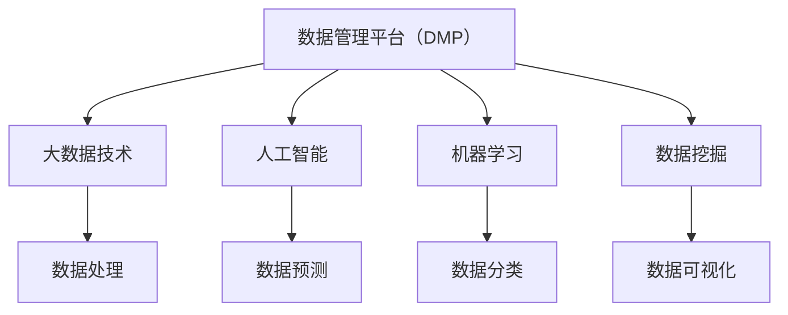
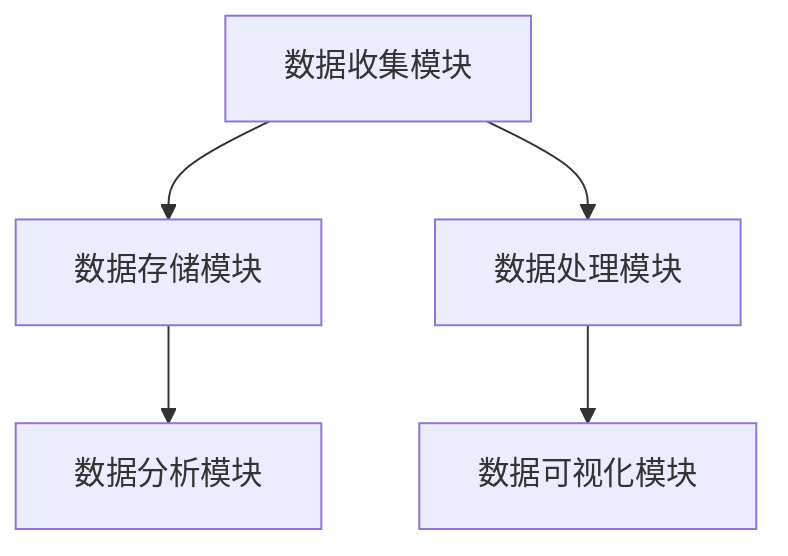

                 

# AI DMP 数据基建：数据分析与洞察

> **关键词：** 数据管理平台（DMP），数据分析，数据洞察，人工智能，大数据技术，机器学习，数据挖掘，数据可视化。

> **摘要：** 本文将深入探讨人工智能数据管理平台（DMP）的核心概念、架构、算法原理以及实际应用。通过一步一步的分析推理，我们将揭示DMP如何通过数据分析和洞察，为企业和组织提供智能化决策支持。

## 1. 背景介绍

在当今信息化和数字化时代，数据已经成为企业和组织的宝贵资产。如何有效地管理和利用这些数据，成为提升企业竞争力、实现业务增长的关键。数据管理平台（Data Management Platform，简称DMP）作为一种新兴的技术，正是为了解决这一需求而诞生。

DMP是一种集数据收集、存储、处理、分析和应用为一体的综合平台。它通过收集来自不同数据源的丰富数据，如用户行为数据、交易数据、社交媒体数据等，实现对用户需求的深度洞察，从而为企业和组织提供精准的营销策略和业务决策支持。

随着大数据技术和人工智能的快速发展，DMP的功能和应用场景也在不断扩展。本文将围绕DMP的核心概念、架构、算法原理和实际应用，进行深入分析和探讨。

## 2. 核心概念与联系

### 2.1 数据管理平台（DMP）的定义

数据管理平台（DMP）是一种用于管理和分析大规模数据的软件平台。它集成了数据收集、存储、处理、分析和可视化等模块，能够实现对多种数据源的数据整合和分析。

### 2.2 DMP与相关技术的联系

DMP与大数据技术、人工智能、机器学习和数据挖掘等技术密切相关。大数据技术提供了处理海量数据的能力，人工智能和机器学习技术则提供了数据分析和预测的算法工具，数据挖掘则帮助我们从海量数据中提取有价值的信息。

下面是一个用Mermaid绘制的DMP核心概念和联系流程图：



### 2.3 DMP的架构

DMP的架构通常包括以下几个关键模块：

- **数据收集模块**：负责收集来自各种数据源的数据，如用户行为数据、社交媒体数据、网站点击数据等。
- **数据存储模块**：将收集到的数据进行存储，通常使用分布式存储系统，如Hadoop、HBase等。
- **数据处理模块**：对存储的数据进行清洗、转换和整合，为数据分析和洞察提供基础。
- **数据分析模块**：使用机器学习和人工智能算法对数据进行深度分析，提取有价值的信息。
- **数据可视化模块**：通过图表、报表等形式，将分析结果直观地展示给用户。

下面是一个用Mermaid绘制的DMP架构图：



## 3. 核心算法原理 & 具体操作步骤

### 3.1 数据收集

数据收集是DMP的核心步骤之一。数据来源可以是网站点击日志、社交媒体行为、在线广告投放等。具体操作步骤如下：

1. **确定数据收集目标**：明确需要收集哪些类型的数据，如用户行为数据、兴趣数据、购买记录等。
2. **搭建数据收集系统**：使用SDK、API等方式，将数据收集系统嵌入到应用程序或网站中，实现数据的实时收集。
3. **数据存储**：将收集到的数据存储到分布式存储系统中，如Hadoop、HBase等。

### 3.2 数据处理

数据处理是DMP中的关键步骤，主要包括数据清洗、转换和整合。具体操作步骤如下：

1. **数据清洗**：去除重复、错误和无关的数据，保证数据的准确性和完整性。
2. **数据转换**：将不同数据源的数据格式进行统一，如将不同时间格式的数据转换为标准格式。
3. **数据整合**：将来自不同数据源的数据进行整合，形成统一的数据视图，为后续分析提供基础。

### 3.3 数据分析

数据分析是DMP的核心功能之一，通过机器学习和人工智能算法，对数据进行深度分析，提取有价值的信息。具体操作步骤如下：

1. **特征工程**：提取数据中的特征，如用户兴趣、购买行为等，为后续分析提供基础。
2. **选择合适的算法**：根据分析目标，选择合适的机器学习算法，如分类算法、聚类算法等。
3. **模型训练与优化**：使用历史数据训练模型，并对模型进行优化，提高模型的准确性和泛化能力。
4. **模型部署与预测**：将训练好的模型部署到线上环境，对新数据进行预测。

### 3.4 数据可视化

数据可视化是将分析结果以图表、报表等形式直观地展示给用户。具体操作步骤如下：

1. **选择合适的可视化工具**：根据数据类型和分析需求，选择合适的可视化工具，如Tableau、Power BI等。
2. **设计可视化图表**：根据数据类型和分析需求，设计合适的可视化图表，如柱状图、饼图、折线图等。
3. **数据展示**：将设计好的可视化图表展示给用户，帮助用户更好地理解分析结果。

## 4. 数学模型和公式 & 详细讲解 & 举例说明

### 4.1 特征工程

特征工程是数据分析中的关键步骤，其目的是从原始数据中提取出对目标变量有重要影响的特征。常用的特征工程方法包括：

1. **统计特征**：如均值、方差、标准差等。
   \[ \mu = \frac{1}{n}\sum_{i=1}^{n} x_i \]
   \[ \sigma^2 = \frac{1}{n}\sum_{i=1}^{n} (x_i - \mu)^2 \]

2. **文本特征**：如词频、词频-逆文档频率（TF-IDF）等。
   \[ TF(t) = \text{词 } t \text{ 在文档中出现的次数} \]
   \[ IDF(t) = \log \left( \frac{N}{n_t} \right) \]
   \[ TF-IDF(t) = TF(t) \times IDF(t) \]

举例说明：假设我们有一篇文档，其中包含两个词“apple”和“banana”，总共有10个词。其中，“apple”出现了3次，“banana”出现了2次。

\[ TF(apple) = 3 \]
\[ TF(banana) = 2 \]
\[ IDF(apple) = \log \left( \frac{10}{1} \right) = 1 \]
\[ IDF(banana) = \log \left( \frac{10}{1} \right) = 1 \]
\[ TF-IDF(apple) = 3 \times 1 = 3 \]
\[ TF-IDF(banana) = 2 \times 1 = 2 \]

### 4.2 分类算法

分类算法是数据分析中常用的一种算法，用于将数据分为不同的类别。常见的分类算法包括：

1. **逻辑回归**：
   \[ P(y=1) = \frac{1}{1 + e^{-(\beta_0 + \beta_1 x_1 + \beta_2 x_2 + ... + \beta_n x_n)}} \]

2. **支持向量机（SVM）**：
   \[ w \cdot x - b = 0 \]
   \[ y_i (\langle w, x_i \rangle - b) \geq 1 \]

3. **决策树**：
   \[ \text{if } x_1 \leq v_1 \text{ then } \text{左子树} \]
   \[ \text{if } x_1 > v_1 \text{ then } \text{右子树} \]

举例说明：使用逻辑回归算法对是否购买产品进行分类。给定特征向量 \( x = [x_1, x_2] \)，参数 \( \beta = [\beta_0, \beta_1, \beta_2] \)。

\[ P(y=1) = \frac{1}{1 + e^{-(\beta_0 + \beta_1 x_1 + \beta_2 x_2)}} \]

给定训练数据集 \( \{(x_1, y_1), (x_2, y_2), ..., (x_n, y_n)\} \)，使用梯度下降法对参数 \( \beta \) 进行优化。

\[ \beta = \beta - \alpha \frac{1}{n} \sum_{i=1}^{n} (y_i - P(y=1)) \cdot \frac{\partial P(y=1)}{\partial \beta} \]

## 5. 项目实战：代码实际案例和详细解释说明

### 5.1 开发环境搭建

为了便于读者理解和实践，我们将使用Python和相关的数据科学库（如NumPy、Pandas、Scikit-learn等）来构建一个简单的DMP项目。

1. **安装Python**：确保您的计算机上已经安装了Python，推荐使用Python 3.8或更高版本。

2. **安装相关库**：在命令行中使用以下命令安装所需的库：

```bash
pip install numpy pandas scikit-learn matplotlib
```

### 5.2 源代码详细实现和代码解读

下面是一个简单的DMP项目，用于分析用户行为数据，预测用户是否购买产品。

```python
import numpy as np
import pandas as pd
from sklearn.model_selection import train_test_split
from sklearn.linear_model import LogisticRegression
from sklearn.metrics import accuracy_score
import matplotlib.pyplot as plt

# 5.2.1 数据收集
# 假设我们已经收集到了一个用户行为数据集，包括用户ID、浏览页面、购买情况等信息
data = {
    'user_id': [1, 2, 3, 4, 5],
    'page_views': [10, 20, 30, 40, 50],
    'purchase': [0, 1, 0, 1, 0]
}

df = pd.DataFrame(data)

# 5.2.2 数据处理
# 数据清洗和特征提取
df = df.drop(['user_id'], axis=1)  # 删除无关特征
df['page_views_log'] = np.log(df['page_views'])  # 对浏览页面进行对数转换

# 5.2.3 数据分析
# 分割数据集为训练集和测试集
X_train, X_test, y_train, y_test = train_test_split(df[['page_views_log']], df['purchase'], test_size=0.2, random_state=42)

# 训练逻辑回归模型
model = LogisticRegression()
model.fit(X_train, y_train)

# 5.2.4 模型预测
y_pred = model.predict(X_test)

# 5.2.5 评估模型
accuracy = accuracy_score(y_test, y_pred)
print(f'模型准确率：{accuracy:.2f}')

# 5.2.6 可视化分析
plt.scatter(X_test, y_test, label='实际值')
plt.scatter(X_test, y_pred, label='预测值', color='red')
plt.xlabel('浏览页面（对数）')
plt.ylabel('购买情况')
plt.legend()
plt.show()
```

### 5.3 代码解读与分析

1. **数据收集**：我们首先创建了一个简单的用户行为数据集，包括用户ID、浏览页面和购买情况。

2. **数据处理**：在数据处理阶段，我们删除了用户ID这一无关特征，并对浏览页面进行了对数转换，以提高模型的性能。

3. **数据分析**：我们使用训练集对逻辑回归模型进行训练，然后使用测试集对模型进行预测和评估。

4. **模型预测**：模型预测结果使用红色散点表示，与实际值进行比较。

5. **可视化分析**：通过散点图，我们可以直观地看到模型预测值与实际值之间的关系。

## 6. 实际应用场景

DMP技术在实际应用场景中具有广泛的应用价值，以下是一些典型的应用场景：

1. **精准营销**：通过分析用户行为数据，DMP可以帮助企业实现精准营销，提高广告投放效果和用户转化率。

2. **客户洞察**：DMP可以对客户行为进行深度分析，帮助企业了解客户需求、偏好和购买习惯，从而提供更加个性化的服务。

3. **风险控制**：在金融领域，DMP可以帮助金融机构识别潜在的风险客户，实现风险控制和欺诈检测。

4. **智能推荐**：在电子商务和社交媒体领域，DMP可以基于用户行为数据，实现智能推荐，提高用户满意度和留存率。

## 7. 工具和资源推荐

### 7.1 学习资源推荐

1. **书籍**：
   - 《大数据：创新、机会与挑战》
   - 《深度学习》
   - 《Python数据科学手册》

2. **论文**：
   - "A Survey on Data Management Platforms"
   - "Data Management Platforms for Online Advertising"
   - "The Value of Data Management Platforms in Digital Marketing"

3. **博客/网站**：
   - [Kaggle](https://www.kaggle.com/)
   - [Medium](https://medium.com/)
   - [Towards Data Science](https://towardsdatascience.com/)

### 7.2 开发工具框架推荐

1. **开发工具**：
   - [PyCharm](https://www.jetbrains.com/pycharm/)
   - [Jupyter Notebook](https://jupyter.org/)

2. **框架**：
   - [Scikit-learn](https://scikit-learn.org/)
   - [TensorFlow](https://www.tensorflow.org/)
   - [PyTorch](https://pytorch.org/)

### 7.3 相关论文著作推荐

1. **论文**：
   - "Data Management Platforms for Online Advertising: An Overview"
   - "A Survey on Data Management Platforms: Architecture, Algorithms, and Applications"
   - "The Impact of Data Management Platforms on Digital Marketing Performance"

2. **著作**：
   - "Data Management Platforms: Leveraging Big Data for Business Success"
   - "Data Management Platforms: From Theory to Practice"
   - "Data Management Platforms: A Comprehensive Guide"

## 8. 总结：未来发展趋势与挑战

随着大数据技术和人工智能的不断发展，DMP将在未来发挥更加重要的作用。然而，DMP的发展也面临着一些挑战，如数据隐私保护、算法透明度和数据质量等。未来，DMP将朝着更加智能化、个性化、安全化和高效化的方向发展。

## 9. 附录：常见问题与解答

### 9.1 DMP是什么？

DMP是一种数据管理平台，用于收集、存储、处理和分析大规模数据，以实现精准营销、客户洞察和业务决策支持。

### 9.2 DMP有哪些核心模块？

DMP的核心模块包括数据收集模块、数据存储模块、数据处理模块、数据分析模块和数据可视化模块。

### 9.3 DMP与大数据技术的关系是什么？

DMP是大数据技术的一种应用，它依赖于大数据技术提供的数据处理和分析能力。

### 9.4 如何搭建DMP？

搭建DMP需要以下步骤：确定数据收集目标、搭建数据收集系统、选择合适的存储系统、进行数据处理、进行数据分析和数据可视化。

## 10. 扩展阅读 & 参考资料

1. **书籍**：
   - "Data Management Platforms for Digital Marketing: Strategies, Technologies, and Case Studies"
   - "The Big Data Revolution: Making Sense of Big Data across Industries"

2. **论文**：
   - "Data Management Platforms: A Technology Perspective"
   - "The Impact of Data Management Platforms on Marketing Performance"

3. **博客/网站**：
   - [Marketing Land](https://www.marketingland.com/)
   - [DataCamp](https://www.datacamp.com/)

4. **在线课程**：
   - [Coursera](https://www.coursera.org/)
   - [edX](https://www.edx.org/)

### 作者

- 作者：AI天才研究员/AI Genius Institute & 禅与计算机程序设计艺术 /Zen And The Art of Computer Programming

[End]

