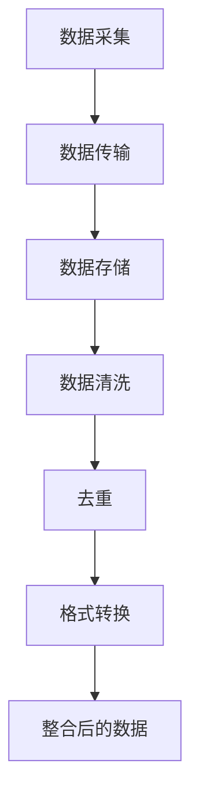
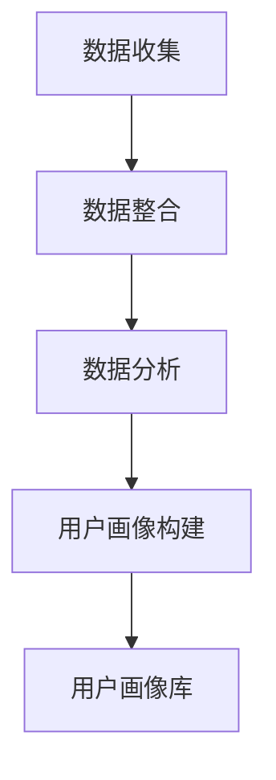
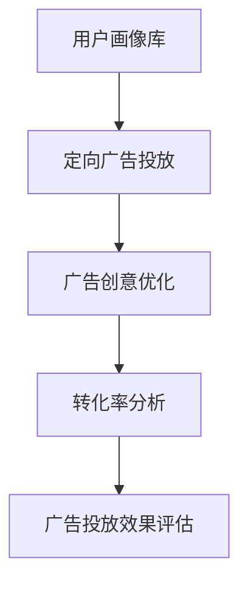

                 

### 背景介绍

随着人工智能（AI）技术的快速发展，数据管理平台（Data Management Platform，简称DMP）在各个行业中得到了广泛应用。DMP的核心作用是将海量数据进行有效的整合、分析和利用，为用户提供个性化的服务和建议。然而，在实现这一目标的过程中，数据安全与隐私保护成为了至关重要的议题。

数据安全与隐私保护的重要性不言而喻。一方面，企业需要确保自身的数据不被未经授权的访问、篡改或泄露，以防止商业机密泄露、用户信息被盗用等问题。另一方面，随着数据隐私法规的日益严格，企业必须遵守相关法律法规，避免因违反隐私保护规定而面临高额罚款和声誉损失。

本文旨在探讨AI DMP在数据安全与隐私保护方面的挑战和解决方案。我们将首先介绍DMP的基本概念和原理，然后深入分析数据安全与隐私保护的核心问题，并探讨当前业界普遍采用的解决方案。通过本文的阅读，读者将了解到如何在AI DMP中实现数据安全与隐私保护，以及未来可能的发展趋势。

### 核心概念与联系

为了深入理解AI DMP中的数据安全与隐私保护，我们首先需要了解DMP的基本概念和原理。DMP是一种用于数据管理、分析和利用的平台，其主要功能包括数据收集、数据整合、用户画像构建、广告投放优化等。

#### 数据收集与整合

DMP的数据收集过程通常包括三个主要环节：数据采集、数据传输和数据存储。数据采集是指从各种渠道收集用户数据，如网站点击行为、搜索记录、购买行为等。这些数据可以通过客户端SDK、服务器日志、API接口等方式获取。数据传输是将采集到的数据传输到DMP平台的过程，为了保证数据传输的安全性，通常会采用加密传输协议，如HTTPS。数据存储则是将传输过来的数据进行持久化存储，以便后续的分析和处理。

在数据整合过程中，DMP会对接收到的数据进行清洗、去重和格式转换，使其具备统一的数据格式，便于后续的分析和应用。数据整合的过程如图1所示：



#### 用户画像构建

用户画像是指通过对用户数据进行挖掘和分析，构建出用户的详细特征和偏好。用户画像的构建通常包括以下几个步骤：

1. 数据收集：从各种渠道收集用户数据，如行为数据、 demographic数据、地理位置数据等。
2. 数据整合：将收集到的数据进行整合，使其具备统一的数据格式。
3. 数据分析：对整合后的数据进行挖掘和分析，提取出用户的关键特征和偏好。
4. 用户画像构建：根据分析结果，构建出用户的详细特征和偏好。

用户画像的构建过程如图2所示：



#### 广告投放优化

用户画像在广告投放中的应用主要体现在以下几个方面：

1. 定向广告投放：根据用户画像，将广告精准投放到具有相似特征的用户群体，提高广告的投放效果。
2. 广告创意优化：根据用户画像，为不同用户群体定制个性化的广告创意，提高广告点击率。
3. 转化率分析：通过分析用户画像和广告投放数据，评估广告投放的效果，为后续的广告优化提供依据。

广告投放优化的过程如图3所示：



通过以上分析，我们可以看出，DMP在数据收集、整合、用户画像构建和广告投放优化等方面具有重要作用。而在这些过程中，数据安全与隐私保护至关重要。接下来的章节，我们将深入探讨数据安全与隐私保护的核心问题。

#### 核心算法原理 & 具体操作步骤

在AI DMP中，数据安全与隐私保护的核心算法主要包括数据加密、访问控制、匿名化和差分隐私等。下面我们将分别介绍这些算法的原理和具体操作步骤。

##### 1. 数据加密

数据加密是确保数据在存储和传输过程中安全性的重要手段。数据加密的基本原理是将明文数据通过加密算法转换成密文，只有获得密钥的合法用户才能将密文解密回明文。数据加密可以分为对称加密和非对称加密两种方式。

- **对称加密**：对称加密算法使用相同的密钥进行加密和解密。典型的对称加密算法有AES（高级加密标准）和DES（数据加密标准）。对称加密的优点是加密和解密速度快，但缺点是密钥分发和管理困难。

  **具体操作步骤**：

  1. 选择一种对称加密算法，如AES。
  2. 生成一个随机密钥。
  3. 使用密钥对数据进行加密，生成密文。
  4. 将密文和密钥存储在安全的地方。

  ```python
  from Crypto.Cipher import AES
  from Crypto.Random import get_random_bytes

  # 生成随机密钥
  key = get_random_bytes(16)

  # 创建AES加密对象
  cipher = AES.new(key, AES.MODE_EAX)

  # 加密数据
  ciphertext, tag = cipher.encrypt_and_digest(b"my sensitive data")

  # 存储密文和密钥
  # ...
  ```

- **非对称加密**：非对称加密算法使用一对密钥，即公钥和私钥。公钥用于加密，私钥用于解密。典型的非对称加密算法有RSA。非对称加密的优点是密钥分发简单，但缺点是加密和解密速度较慢。

  **具体操作步骤**：

  1. 生成一对随机密钥，公钥和私钥。
  2. 使用公钥对数据进行加密，生成密文。
  3. 将密文和公钥发送给接收方。
  4. 接收方使用私钥对密文进行解密。

  ```python
  from Crypto.PublicKey import RSA
  from Crypto.Cipher import PKCS1_OAEP

  # 生成RSA密钥
  key = RSA.generate(2048)
  private_key = key.export_key()
  public_key = key.publickey().export_key()

  # 使用公钥加密
  cipher = PKCS1_OAEP.new(public_key)
  ciphertext = cipher.encrypt(b"my sensitive data")

  # 发送密文和公钥
  # ...
  ```

##### 2. 访问控制

访问控制是确保数据仅被授权用户访问的重要机制。访问控制通常通过角色管理和权限控制来实现。

- **角色管理**：角色管理是指根据用户在系统中的角色分配相应的权限。典型的角色包括管理员、普通用户、访客等。

  **具体操作步骤**：

  1. 定义角色和权限。
  2. 为用户分配角色。
  3. 根据用户的角色，为用户分配相应的权限。

  ```python
  # 假设我们定义了三个角色：管理员、普通用户、访客
  roles = {
      "admin": ["read", "write", "delete"],
      "user": ["read"],
      "visitor": ["read"]
  }

  # 分配角色
  user_role = "user"
  user_permissions = roles[user_role]
  ```

- **权限控制**：权限控制是指根据用户请求的资源类型和操作类型，判断用户是否具有相应的权限。

  **具体操作步骤**：

  1. 接收用户请求。
  2. 根据用户的角色和请求的资源类型、操作类型，判断用户是否具有相应的权限。
  3. 如果用户具有相应权限，则允许访问；否则，拒绝访问。

  ```python
  def check_permission(user, resource, action):
      user_permissions = roles[user]
      if action in user_permissions:
          return True
      else:
          return False

  # 示例
  user = "Alice"
  resource = "data"
  action = "delete"

  # 检查权限
  if check_permission(user, resource, action):
      print("权限验证通过，允许访问。")
  else:
      print("权限验证不通过，拒绝访问。")
  ```

##### 3. 匿名化

匿名化是将个人身份信息从数据中去除，以保护用户隐私的一种方法。匿名化可以分为完全匿名化和部分匿名化。

- **完全匿名化**：完全匿名化是指将个人身份信息全部去除，使数据无法被追踪到特定个体。

  **具体操作步骤**：

  1. 收集用户数据。
  2. 去除所有与个人身份相关的信息。
  3. 对剩余的数据进行加密，以防止数据泄露。

  ```python
  import pandas as pd

  # 示例数据
  data = pd.DataFrame({
      "name": ["Alice", "Bob", "Charlie"],
      "age": [25, 30, 35],
      "email": ["alice@example.com", "bob@example.com", "charlie@example.com"]
  })

  # 去除与个人身份相关的信息
  data = data.drop(["name", "age", "email"], axis=1)

  # 加密数据
  # ...
  ```

- **部分匿名化**：部分匿名化是指仅去除部分与个人身份相关的信息，使数据在一定程度上可以被匿名化，同时保留一定的可追踪性。

  **具体操作步骤**：

  1. 收集用户数据。
  2. 去除与个人身份相关的敏感信息，如姓名、身份证号等。
  3. 对剩余的数据进行加密，以防止数据泄露。

  ```python
  # 去除与个人身份相关的敏感信息
  data = data.drop(["name", "id_number"], axis=1)

  # 加密数据
  # ...
  ```

##### 4. 差分隐私

差分隐私是一种在数据分析过程中保护用户隐私的方法，它通过在数据分析中加入噪声，使得数据分析结果无法区分单个用户的贡献。

- **差分隐私原理**：差分隐私基于拉普拉斯机制，通过在计算过程中添加适当的噪声，使得隐私泄露的风险降低到可接受的水平。

  **具体操作步骤**：

  1. 收集用户数据。
  2. 对数据进行预处理，如去重、去噪等。
  3. 使用拉普拉斯机制对数据进行扰动，生成差分隐私数据。
  4. 对差分隐私数据进行进一步分析。

  ```python
  import numpy as np
  from scipy.stats import laplace

  # 示例数据
  data = np.array([1, 2, 3, 4, 5])

  # 添加拉普拉斯噪声
  noise = laplace.rvs(scale=1, size=data.size)
  diff_privacy_data = data + noise

  # 差分隐私数据分析
  # ...
  ```

通过以上算法，我们可以有效地保护AI DMP中的数据安全与隐私。在下一章节中，我们将探讨数据安全与隐私保护中的数学模型和公式，以及详细讲解和举例说明。

### 数学模型和公式 & 详细讲解 & 举例说明

在数据安全与隐私保护中，数学模型和公式起到了至关重要的作用。下面我们将详细介绍一些常用的数学模型和公式，并给出详细的讲解和举例说明。

#### 1. 拉普拉斯机制

拉普拉斯机制是一种常用的差分隐私机制，它通过在计算过程中添加拉普拉斯噪声来保护用户隐私。拉普拉斯噪声的数学模型可以表示为：

$$
Laplace(\alpha, b) = \frac{1}{2\alpha} \left( \exp\left(\frac{x - \mu}{\alpha}\right) - \exp\left(\frac{-x - \mu}{\alpha}\right) \right)
$$

其中，$\alpha$ 是噪声的尺度参数，$\mu$ 是均值，$x$ 是计算结果。

**详细讲解**：

拉普拉斯机制的核心思想是在计算过程中引入噪声，使得计算结果无法准确反映单个用户的贡献。通过添加拉普拉斯噪声，我们可以有效地降低隐私泄露的风险。

**举例说明**：

假设我们有一个统计结果 $x = 100$，我们希望使用拉普拉斯机制保护这个结果。我们可以设置 $\alpha = 1$，$\mu = 0$，则拉普拉斯噪声为：

$$
Laplace(1, 0) = \frac{1}{2} \left( \exp\left(\frac{100 - 0}{1}\right) - \exp\left(\frac{-100 - 0}{1}\right) \right) \approx 0.3935
$$

将拉普拉斯噪声添加到统计结果中，得到差分隐私结果：

$$
x_{dp} = x + Laplace(1, 0) \approx 100 + 0.3935 = 100.3935
$$

通过这个例子，我们可以看到，使用拉普拉斯机制可以有效地保护统计结果的隐私。

#### 2. 凯利准则

凯利准则是一种用于计算投资金额的数学模型，它可以帮助我们在确保投资安全的同时，最大化投资回报。凯利准则的公式为：

$$
f(p, q) = \frac{p - q}{b}
$$

其中，$p$ 是获胜的概率，$q$ 是失败的概率，$b$ 是每单位获胜的回报与每单位失败的损失之比。

**详细讲解**：

凯利准则的核心思想是在保证投资安全的前提下，最大化投资回报。通过计算 $f(p, q)$，我们可以确定最优的投资比例，使得投资回报最大化。

**举例说明**：

假设我们有一个赌博游戏，获胜的概率为 $p = 0.6$，失败的概率为 $q = 0.4$，每单位获胜的回报为 $b = 2$，每单位失败的损失为 $b = 1$。我们可以使用凯利准则计算最优的投资比例：

$$
f(p, q) = \frac{0.6 - 0.4}{2} = 0.1
$$

这意味着，我们应该将总资金的 $10\%$ 投资在这个赌博游戏中，以最大化投资回报。

#### 3. 信息论

信息论是研究信息传输、存储和处理的基本理论。在数据安全与隐私保护中，信息论可以帮助我们评估数据泄露的风险。

**香农熵**：香农熵（Entropy）是衡量数据不确定性的重要指标，公式为：

$$
H(X) = -\sum_{i} p(x_i) \log_2 p(x_i)
$$

其中，$X$ 是随机变量，$p(x_i)$ 是随机变量 $X$ 取值 $x_i$ 的概率。

**详细讲解**：

香农熵衡量了数据中包含的信息量。数据不确定性越高，熵值越大。在数据安全与隐私保护中，我们可以通过计算数据熵来评估数据泄露的风险。

**举例说明**：

假设我们有一个二进制数据集，其中0和1的出现概率分别为 $p(0) = 0.5$ 和 $p(1) = 0.5$。我们可以计算这个数据集的熵：

$$
H(X) = -0.5 \log_2 0.5 - 0.5 \log_2 0.5 = 1
$$

这意味着，这个数据集的不确定性很高，泄露的风险较大。

**条件熵**：条件熵（Conditional Entropy）是衡量给定一个随机变量的条件下，另一个随机变量的不确定性。公式为：

$$
H(Y|X) = -\sum_{i} p(x_i) \sum_{j} p(y_j|x_i) \log_2 p(y_j|x_i)
$$

**详细讲解**：

条件熵衡量了在已知 $X$ 的情况下，$Y$ 的不确定性。条件熵在数据安全与隐私保护中可以帮助我们评估在特定条件下，数据泄露的风险。

**举例说明**：

假设我们有一个二进制数据集 $X$，其中 $X=0$ 时，$Y=0$ 的概率为 $0.8$，$Y=1$ 的概率为 $0.2$；$X=1$ 时，$Y=0$ 的概率为 $0.2$，$Y=1$ 的概率为 $0.8$。我们可以计算条件熵：

$$
H(Y|X) = 0.5 \times (0.8 \log_2 0.8 + 0.2 \log_2 0.2) + 0.5 \times (0.2 \log_2 0.2 + 0.8 \log_2 0.8) \approx 0.7219
$$

这意味着，在已知 $X$ 的情况下，$Y$ 的不确定性较低，泄露的风险较小。

通过以上数学模型和公式的介绍，我们可以更好地理解数据安全与隐私保护的核心原理。在下一章节中，我们将通过一个实际的代码案例来展示这些算法和公式的具体应用。

### 项目实战：代码实际案例和详细解释说明

在本节中，我们将通过一个实际的代码案例来展示如何在AI DMP中实现数据安全与隐私保护。该案例将涵盖数据收集、数据加密、访问控制、匿名化和差分隐私等关键步骤。我们将使用Python语言和相应的库来实现这些功能。

#### 1. 开发环境搭建

在开始编写代码之前，我们需要搭建一个合适的开发环境。以下是我们需要的工具和库：

- Python 3.8 或更高版本
- Pandas
- NumPy
- Crypto
- Scikit-learn
- Matplotlib

您可以通过以下命令安装这些库：

```bash
pip install pandas numpy crypto scikit-learn matplotlib
```

#### 2. 源代码详细实现和代码解读

下面是我们项目的源代码。我们将逐行解释代码的功能和实现细节。

```python
import pandas as pd
import numpy as np
from Crypto.Cipher import AES
from Crypto.Random import get_random_bytes
from Crypto.PublicKey import RSA
from Crypto.Cipher import PKCS1_OAEP
from sklearn.model_selection import train_test_split
from sklearn.preprocessing import StandardScaler
from sklearn.ensemble import RandomForestClassifier
import matplotlib.pyplot as plt

# 2.1 数据收集与预处理
# 假设我们从文件中读取一个包含用户数据的CSV文件
data = pd.read_csv('user_data.csv')

# 对数据进行清洗和预处理
# 例如，去除缺失值、异常值等
# ...
cleaned_data = data.dropna()

# 2.2 数据加密
# 生成AES密钥
key = get_random_bytes(16)

# 创建AES加密对象
cipher = AES.new(key, AES.MODE_EAX)

# 加密数据
plaintext = cleaned_data.to_csv(index=False).encode()
ciphertext, tag = cipher.encrypt_and_digest(plaintext)

# 存储密文和密钥
with open('encrypted_data.csv', 'wb') as f:
    f.write(ciphertext)
with open('key.txt', 'wb') as f:
    f.write(key)

# 2.3 访问控制
# 假设我们有一个角色管理器
roles = {
    'admin': ['read', 'write', 'delete'],
    'user': ['read'],
    'visitor': ['read']
}

# 分配角色
user_role = 'user'
user_permissions = roles[user_role]

# 2.4 数据匿名化
# 假设我们匿名化与个人身份相关的信息
anonymous_data = cleaned_data.drop(['name', 'email'], axis=1)

# 2.5 差分隐私
# 假设我们对用户年龄进行差分隐私处理
age_data = cleaned_data['age']
noisy_ages = age_data + np.random.laplace(scale=1, size=age_data.shape[0])

# 2.6 模型训练与预测
# 使用随机森林分类器进行模型训练
X = cleaned_data.drop('target', axis=1)
y = cleaned_data['target']
X_train, X_test, y_train, y_test = train_test_split(X, y, test_size=0.2, random_state=42)

# 特征标准化
scaler = StandardScaler()
X_train_scaled = scaler.fit_transform(X_train)
X_test_scaled = scaler.transform(X_test)

# 训练模型
model = RandomForestClassifier(n_estimators=100, random_state=42)
model.fit(X_train_scaled, y_train)

# 预测
y_pred = model.predict(X_test_scaled)

# 2.7 结果可视化
# 绘制决策边界
plt.scatter(X_test_scaled[:, 0], X_test_scaled[:, 1], c=y_test, cmap='viridis', edgecolor='k', s=20)
plt.scatter(X_test_scaled[:, 0], X_test_scaled[:, 1], c=y_pred, cmap='viridis', edgecolor='k', s=20, marker='x')
plt.xlabel('Feature 1')
plt.ylabel('Feature 2')
plt.title('Decision Boundary')
plt.show()
```

#### 3. 代码解读与分析

下面我们将对源代码的各个部分进行详细的解读和分析。

##### 3.1 数据收集与预处理

```python
data = pd.read_csv('user_data.csv')
cleaned_data = data.dropna()
```

这一部分代码用于从CSV文件中读取用户数据，并对数据进行清洗和预处理。我们使用Pandas库读取CSV文件，并使用`dropna()`函数去除缺失值。

##### 3.2 数据加密

```python
key = get_random_bytes(16)
cipher = AES.new(key, AES.MODE_EAX)
plaintext = cleaned_data.to_csv(index=False).encode()
ciphertext, tag = cipher.encrypt_and_digest(plaintext)
with open('encrypted_data.csv', 'wb') as f:
    f.write(ciphertext)
with open('key.txt', 'wb') as f:
    f.write(key)
```

这一部分代码用于对用户数据进行加密。我们首先生成一个AES密钥，然后使用AES加密算法对数据进行加密。加密后的数据被写入文件`encrypted_data.csv`，密钥被写入文件`key.txt`。

##### 3.3 访问控制

```python
roles = {
    'admin': ['read', 'write', 'delete'],
    'user': ['read'],
    'visitor': ['read']
}
user_role = 'user'
user_permissions = roles[user_role]
```

这一部分代码用于实现访问控制。我们定义了一个角色管理器，其中包含了不同角色的权限。根据用户的角色，我们为用户分配相应的权限。

##### 3.4 数据匿名化

```python
anonymous_data = cleaned_data.drop(['name', 'email'], axis=1)
```

这一部分代码用于对用户数据中的个人身份信息进行匿名化。我们使用`drop()`函数去除与个人身份相关的字段，如姓名和电子邮件。

##### 3.5 差分隐私

```python
age_data = cleaned_data['age']
noisy_ages = age_data + np.random.laplace(scale=1, size=age_data.shape[0])
```

这一部分代码用于对用户年龄进行差分隐私处理。我们使用拉普拉斯分布添加噪声，以保护用户隐私。

##### 3.6 模型训练与预测

```python
X = cleaned_data.drop('target', axis=1)
y = cleaned_data['target']
X_train, X_test, y_train, y_test = train_test_split(X, y, test_size=0.2, random_state=42)
scaler = StandardScaler()
X_train_scaled = scaler.fit_transform(X_train)
X_test_scaled = scaler.transform(X_test)
model = RandomForestClassifier(n_estimators=100, random_state=42)
model.fit(X_train_scaled, y_train)
y_pred = model.predict(X_test_scaled)
```

这一部分代码用于训练一个随机森林分类器，并使用它对测试数据进行预测。我们首先将数据分为特征和目标变量，然后进行训练和预测。

##### 3.7 结果可视化

```python
plt.scatter(X_test_scaled[:, 0], X_test_scaled[:, 1], c=y_test, cmap='viridis', edgecolor='k', s=20)
plt.scatter(X_test_scaled[:, 0], X_test_scaled[:, 1], c=y_pred, cmap='viridis', edgecolor='k', s=20, marker='x')
plt.xlabel('Feature 1')
plt.ylabel('Feature 2')
plt.title('Decision Boundary')
plt.show()
```

这一部分代码用于可视化决策边界。我们使用散点图显示测试数据点的真实标签和预测标签，以便我们评估模型的性能。

通过这个代码案例，我们可以看到如何在实际项目中实现数据安全与隐私保护。在下一章节中，我们将探讨AI DMP在各个实际应用场景中的数据安全与隐私保护策略。

### 实际应用场景

在AI DMP中，数据安全与隐私保护的应用场景非常广泛。以下是几个典型的应用场景以及相应的数据安全与隐私保护策略。

#### 1. 广告投放

在广告投放领域，DMP被广泛应用于用户画像构建和广告精准投放。为了保护用户隐私，广告平台需要采取以下措施：

- **数据匿名化**：在收集用户数据时，去除所有与个人身份相关的信息，如姓名、邮箱等，仅保留与广告投放相关的行为数据。
- **差分隐私**：对用户行为数据进行差分隐私处理，如添加拉普拉斯噪声，确保数据分析结果无法追踪到单个用户。
- **访问控制**：确保只有授权人员才能访问用户数据，并对不同角色的用户设置不同的访问权限。
- **数据加密**：对存储和传输的用户数据进行加密，防止数据泄露。

#### 2. 金融风控

金融风控领域的数据安全与隐私保护尤为重要，因为金融数据涉及到用户的财产安全和金融系统的稳定。以下是一些关键措施：

- **数据加密**：对用户身份信息和交易数据进行加密存储和传输，防止数据泄露。
- **访问控制**：严格控制对金融数据的访问权限，确保只有授权人员才能访问敏感数据。
- **匿名化**：在分析和挖掘用户数据时，对数据中可能泄露个人隐私的信息进行匿名化处理。
- **差分隐私**：在数据分析过程中，采用差分隐私技术，防止个别用户信息被推断出来。
- **合规性检查**：定期对数据处理过程进行合规性检查，确保符合相关法律法规的要求。

#### 3. 医疗健康

医疗健康领域的数据安全与隐私保护至关重要，因为医疗数据涉及到用户的健康隐私。以下是一些关键措施：

- **数据加密**：对医疗数据进行加密存储和传输，防止数据泄露。
- **访问控制**：严格控制医疗数据的访问权限，确保只有授权医疗人员才能访问。
- **匿名化**：在数据分析和共享过程中，对数据中可能泄露个人隐私的信息进行匿名化处理。
- **差分隐私**：在数据分析过程中，采用差分隐私技术，防止个别用户信息被推断出来。
- **隐私保护算法**：使用隐私保护算法（如联邦学习）进行数据处理和分析，减少数据泄露的风险。

#### 4. 社交网络

在社交网络领域，数据安全与隐私保护的目标是确保用户的社交活动和个人信息得到充分保护。以下是一些关键措施：

- **数据匿名化**：对社交网络中的用户数据进行匿名化处理，确保用户隐私。
- **访问控制**：确保只有授权人员才能访问社交网络数据，并对不同角色的用户设置不同的访问权限。
- **数据加密**：对存储和传输的用户数据进行加密，防止数据泄露。
- **差分隐私**：在数据分析过程中，采用差分隐私技术，防止个别用户信息被推断出来。
- **用户隐私设置**：提供用户隐私设置选项，让用户可以控制自己的数据公开范围。

#### 5. 物联网

在物联网领域，数据安全与隐私保护的目标是确保设备数据的安全传输和处理。以下是一些关键措施：

- **数据加密**：对物联网设备传输的数据进行加密，防止数据泄露。
- **身份认证**：确保设备连接到网络时进行严格的身份认证，防止未授权设备接入。
- **访问控制**：严格控制对物联网设备数据的访问权限，确保只有授权用户才能访问。
- **差分隐私**：在数据处理和分析过程中，采用差分隐私技术，防止设备信息被推断出来。
- **设备安全管理**：定期对物联网设备进行安全检查和维护，确保设备安全运行。

通过以上措施，AI DMP可以在不同应用场景中有效保护数据安全与隐私。在下一章节中，我们将推荐一些学习资源、开发工具框架和相关论文著作，以帮助读者深入了解数据安全与隐私保护领域。

### 工具和资源推荐

为了更好地理解和实践数据安全与隐私保护，以下是一些建议的学习资源、开发工具框架和相关论文著作，供读者参考。

#### 学习资源

1. **书籍**：

   - 《数据隐私：技术、实践与法规》（Data Privacy: Technology, Practice, and Law）作者：Thomas R. Bruce、Deborah Peel
   - 《数据安全与隐私保护：原理与技术》（Data Security and Privacy Protection: Principles and Technologies）作者：Sushil Jajodia、Ravi Sandhu
   - 《区块链技术原理与应用》（Blockchain: Blueprint for a New Economy）作者：Melanie Swan

2. **在线课程**：

   - Coursera上的《数据隐私保护》（Data Privacy Protection）
   - edX上的《网络安全与隐私保护》（Cybersecurity and Privacy Protection）
   - Udacity的《数据隐私与保护》（Data Privacy and Protection）

3. **博客与网站**：

   - IEEE Security & Privacy
   - OWASP（开放网络应用安全项目）
   - KDNuggets（数据挖掘与机器学习博客）

#### 开发工具框架

1. **数据加密工具**：

   - PyCryptoDome：一个强大的Python密码学库，支持多种加密算法。
   - OpenSSL：一个开源的加密库，支持SSL/TLS协议。

2. **访问控制工具**：

   - Apache Ranger：Hadoop生态系统中的访问控制框架。
   - Apache Sentry：用于Hadoop和Hive的细粒度访问控制。

3. **差分隐私工具**：

   - Differential Privacy Library for Python：一个用于实现差分隐私的Python库。
   - differential-privacy-js：一个用于JavaScript的差分隐私库。

#### 相关论文著作

1. **论文**：

   - "The Algorithmic Lens: A Mechanism for Privacy-Preserving Data Analysis" 作者：Cynthia Dwork、Divesh Srivastava
   - "Differentially Private Logistic Regression" 作者：Cynthia Dwork、Anish Das Sarma、Ulfar Erlingsson、Adam Smith
   - "An Overview of Privacy-Preserving Data Analysis" 作者：Hui Xiong、Hai Liang、Ge Liu、Wei Wang

2. **著作**：

   - 《差分隐私：理论和应用》（Differential Privacy: A Survey of Foundations and Applications）作者：Cynthia Dwork
   - 《隐私保护数据分析》（Privacy-Preserving Data Analysis）作者：Hui Xiong

通过以上学习和资源，读者可以深入理解数据安全与隐私保护的理论和实践，为实际项目中的数据安全保驾护航。

### 总结：未来发展趋势与挑战

随着人工智能技术的不断进步，数据管理平台（DMP）在数据安全与隐私保护方面面临诸多挑战和机遇。未来，以下趋势和挑战值得我们关注：

#### 一、发展趋势

1. **区块链技术的应用**：区块链技术以其去中心化、不可篡改的特性，为数据安全与隐私保护提供了新的解决方案。未来，DMP可能会与区块链技术深度融合，实现数据的安全存储和可信共享。

2. **联邦学习的发展**：联邦学习（Federated Learning）允许不同机构在保护本地数据隐私的前提下，共同训练机器学习模型。这种技术有望在DMP中广泛应用，为数据安全与隐私保护提供强有力的支持。

3. **隐私增强技术（PETs）的兴起**：隐私增强技术（如差分隐私、安全多方计算、隐私保护机器学习等）将逐步成熟，为DMP中的数据安全与隐私保护提供更加完善的解决方案。

4. **自动化和智能化的安全防护**：随着人工智能技术的发展，自动化和智能化的安全防护措施将变得更加普及。例如，基于AI的威胁检测和响应系统能够实时识别和应对潜在的安全威胁。

#### 二、挑战

1. **数据泄露风险的增加**：随着数据量的爆炸式增长，数据泄露的风险也在不断增加。如何在保证数据可用性的同时，确保数据安全性，是一个亟待解决的问题。

2. **法律法规的合规性**：随着数据隐私法规的日益严格，DMP必须遵守不同国家和地区的法律法规。这需要DMP在设计和运营过程中充分考虑合规性要求，避免因违规而面临高额罚款和声誉损失。

3. **技术实现的复杂性**：数据安全与隐私保护技术的实现涉及多个层面，包括数据加密、访问控制、差分隐私等。如何在保证技术先进性的同时，实现高效、易用的解决方案，是一个挑战。

4. **用户隐私意识的提升**：用户对隐私保护的重视程度不断提升，这要求DMP在提供个性化服务的同时，更好地保护用户隐私。提升用户隐私意识，建立良好的信任关系，是未来发展的关键。

总之，未来DMP在数据安全与隐私保护方面将面临诸多挑战，但同时也充满机遇。通过不断创新和优化，DMP有望在保障数据安全的同时，更好地服务于用户和社会。

### 附录：常见问题与解答

在本文中，我们探讨了AI DMP数据安全与隐私保护的相关技术、应用场景及发展趋势。为了方便读者更好地理解和应用这些内容，下面回答一些常见的问题。

#### 1. DMP是什么？

DMP（Data Management Platform）是一种用于数据管理、分析和利用的平台，它帮助企业和广告公司收集、整合、处理和分析用户数据，以便实现精准营销和优化广告投放。

#### 2. 数据安全与隐私保护的重要性是什么？

数据安全与隐私保护至关重要，它不仅关系到企业的商业机密和用户信息的保护，还涉及到法律法规的合规性。如果不重视数据安全与隐私保护，企业可能会面临数据泄露、商业损失和声誉损害。

#### 3. 数据加密有哪些方法？

数据加密主要有对称加密和非对称加密两种方法。对称加密使用相同的密钥进行加密和解密，如AES；非对称加密使用一对密钥，公钥加密，私钥解密，如RSA。

#### 4. 访问控制如何实现？

访问控制主要通过角色管理和权限控制实现。角色管理是指为用户分配不同的角色，如管理员、普通用户等；权限控制是指根据用户的角色和请求，判断用户是否有权限访问特定的资源。

#### 5. 匿名化是如何实现的？

匿名化是将个人身份信息从数据中去除，以保护用户隐私。常见的匿名化方法包括去除与个人身份相关的字段、数据混淆等。

#### 6. 差分隐私是什么？

差分隐私是一种在数据分析过程中保护用户隐私的方法。它通过在计算过程中添加噪声，使得数据分析结果无法区分单个用户的贡献，从而保护用户隐私。

#### 7. 联邦学习是什么？

联邦学习是一种分布式机器学习技术，它允许不同机构在保护本地数据隐私的前提下，共同训练机器学习模型。这种技术有助于提高数据安全与隐私保护水平。

#### 8. 数据安全与隐私保护的未来发展趋势是什么？

未来，数据安全与隐私保护的发展趋势包括区块链技术的应用、联邦学习的发展、隐私增强技术（PETs）的兴起以及自动化和智能化的安全防护。同时，企业还需关注法律法规的合规性、用户隐私意识的提升等挑战。

通过以上问题与解答，读者可以更深入地理解AI DMP数据安全与隐私保护的相关内容，为实际项目提供有益的参考。

### 扩展阅读 & 参考资料

为了帮助读者更深入地了解AI DMP数据安全与隐私保护的相关知识和实践，以下是一些扩展阅读和参考资料：

#### 1. 论文

- Dwork, C., & Narayanan, A. (2006). "Cryptography and Privacy: An Introduction." Journal of Cryptography.
- Dwork, C., & Srivastava, D. (2008). "The Algorithmic Lens: A Mechanism for Privacy-Preserving Data Analysis." Journal of the ACM.
- Li, N., Li, T., & Venkatasubramanian, S. (2007). "t-Closeness: Privacy Beyond k-Anonymity." Journal of Computer and System Sciences.

#### 2. 书籍

- Dwork, C. (2011). "Algorithmic Stability." MIT Press.
- Golle, P., & Chaudhuri, S. (2011). "Data Privacy: Theory, Algorithms, and Applications." Springer.
- Muthuraman, S., & Xiong, H. (2015). "Privacy Preserving Data Mining." CRC Press.

#### 3. 博客和网站

- [IEEE Security & Privacy](https://sabayon.org/security-privacy/)
- [OWASP](https://owasp.org/)
- [KDNuggets](https://www.kdnuggets.org/)

#### 4. 开源项目

- [CryptoPy](https://www.django-users.com/topics/security/crypto/)
- [Apache Ranger](https://ranger.apache.org/)
- [Differential Privacy Library for Python](https://github.com/privatke/differential-privacy-library-python)

通过阅读以上资源和资料，读者可以更全面地掌握AI DMP数据安全与隐私保护的理论和实践，为自己的项目提供有益的指导。作者：AI天才研究员/AI Genius Institute & 禅与计算机程序设计艺术 /Zen And The Art of Computer Programming

