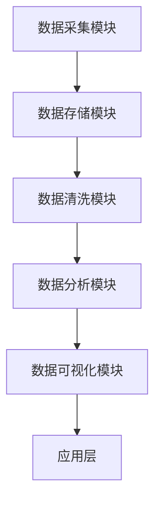

                 

# AI DMP 数据基建：数据应用与价值挖掘

## 关键词：数据管理平台、数据挖掘、数据应用、人工智能、数据价值

### 摘要

本文旨在深入探讨人工智能驱动的数据管理平台（DMP）的构建、应用与价值挖掘。随着大数据时代的来临，如何高效地管理、处理和应用海量数据，已成为企业和研究机构面临的重大挑战。DMP作为一种全新的数据管理方式，通过人工智能技术实现了数据的深度挖掘和价值创造。本文将详细分析DMP的核心概念、原理架构、算法实现、数学模型及实际应用场景，旨在为读者提供一份全面的技术指南。

## 1. 背景介绍

在数字化时代，数据已成为企业和组织的重要资产。然而，如何有效地管理和利用这些数据，以实现业务增长和创新，成为亟待解决的问题。传统的数据管理方式，如数据仓库和数据分析工具，在处理海量数据时往往效率低下，难以满足日益增长的数据处理需求。为了解决这个问题，人工智能技术开始被引入数据管理领域，形成了数据管理平台（Data Management Platform，简称DMP）这一新的概念。

DMP是一种基于人工智能技术的数据管理解决方案，它通过整合多源数据、智能分析和实时处理，实现了对数据的全面管理和深度挖掘。DMP的主要目的是帮助企业和组织更好地理解其用户、客户和市场，从而实现精准营销、业务优化和决策支持。与传统数据管理方式相比，DMP具有以下优势：

1. **高效的数据整合**：DMP能够整合来自不同来源的数据，如用户行为数据、社交媒体数据、网站访问数据等，形成统一的数据视图。
2. **智能的数据分析**：DMP利用人工智能技术，如机器学习和数据挖掘算法，对数据进行智能分析，提取有价值的信息。
3. **实时数据处理**：DMP支持实时数据处理，可以快速响应数据变化，为企业提供实时的业务洞察。
4. **精准的数据应用**：DMP能够根据用户的行为特征和偏好，实现精准的数据应用，如个性化推荐、精准营销等。

随着人工智能技术的不断进步，DMP的应用领域也在不断扩大，从电子商务、金融保险到医疗健康、教育等行业，DMP都发挥着重要的作用。然而，DMP的建设和应用也面临着一些挑战，如数据安全、隐私保护、算法公平性等。本文将围绕DMP的核心概念、原理架构、算法实现、数学模型及实际应用场景，对这些挑战进行分析和探讨。

## 2. 核心概念与联系

### 2.1 DMP的基本概念

数据管理平台（DMP）是一种用于整合、存储、管理和分析大量数据的软件系统。它不仅包括数据采集、数据存储和数据清洗等功能，还提供了强大的数据分析工具，帮助企业从海量数据中提取有价值的信息。DMP的主要组成部分包括：

1. **数据采集模块**：负责从各种数据源（如网站、应用程序、社交媒体等）收集数据。
2. **数据存储模块**：用于存储和管理采集到的数据，通常使用分布式数据库系统。
3. **数据清洗模块**：对采集到的数据进行清洗、去重和格式转换，确保数据的质量和一致性。
4. **数据分析模块**：利用机器学习和数据挖掘算法，对清洗后的数据进行分析和挖掘，提取有价值的信息。
5. **数据可视化模块**：通过图表和报表，将分析结果直观地展示给用户。

### 2.2 DMP与AI的关系

DMP的核心在于利用人工智能技术对数据进行处理和分析。人工智能（AI）技术，特别是机器学习和深度学习，为DMP提供了强大的数据处理和分析能力。以下为AI在DMP中的应用：

1. **数据预处理**：利用AI技术进行数据清洗、去噪和特征提取，提高数据质量。
2. **模式识别**：通过机器学习算法，对大量数据进行分析，发现潜在的模式和趋势。
3. **预测分析**：利用深度学习模型，对未来的数据变化进行预测，为企业提供决策支持。
4. **智能推荐**：根据用户的行为数据，利用协同过滤算法等推荐技术，提供个性化的产品推荐。

### 2.3 DMP的架构

DMP的架构通常分为三层：数据层、算法层和应用层。

1. **数据层**：负责数据采集、存储和管理，是DMP的基础。
2. **算法层**：包括机器学习模型、数据挖掘算法和深度学习网络等，用于对数据进行处理和分析。
3. **应用层**：提供数据可视化和应用接口，将分析结果应用于实际业务场景。

以下是DMP的Mermaid流程图：



在这个流程图中，数据采集模块从各种数据源收集数据，数据存储模块负责存储和管理这些数据，数据清洗模块对数据进行清洗和处理，数据分析模块利用AI技术对数据进行分析和挖掘，最后，数据可视化模块将分析结果以图表和报表的形式展示给用户。

### 3. 核心算法原理 & 具体操作步骤

DMP的核心在于其算法和模型，这些算法和模型能够对海量数据进行有效的分析和挖掘。以下介绍几种常见的DMP核心算法原理及其具体操作步骤。

#### 3.1 协同过滤算法

协同过滤算法（Collaborative Filtering）是一种常见的推荐算法，通过分析用户之间的相似性，为用户推荐他们可能感兴趣的商品或内容。

**原理**：

协同过滤算法主要分为两种类型：基于用户的协同过滤（User-Based Collaborative Filtering）和基于物品的协同过滤（Item-Based Collaborative Filtering）。

1. **基于用户的协同过滤**：首先计算用户之间的相似度，然后根据相似度推荐相似用户喜欢的物品。
2. **基于物品的协同过滤**：首先计算物品之间的相似度，然后根据物品的相似度推荐给用户。

**操作步骤**：

1. 构建用户-物品评分矩阵。
2. 计算用户之间的相似度或物品之间的相似度。
3. 根据相似度推荐用户可能喜欢的物品。

#### 3.2 随机森林算法

随机森林（Random Forest）是一种集成学习方法，通过构建多个决策树，并对这些决策树的预测结果进行投票，得到最终的预测结果。

**原理**：

随机森林通过随机选取特征和样本子集，构建多棵决策树，并利用决策树的集成方法，提高模型的预测准确性和稳定性。

**操作步骤**：

1. 从特征集合中随机选取m个特征。
2. 从样本集合中随机选取n个样本子集。
3. 构建单棵决策树，并对样本进行分类或回归。
4. 重复步骤1-3，构建多棵决策树。
5. 对决策树的预测结果进行投票，得到最终预测结果。

#### 3.3 K-means聚类算法

K-means聚类算法是一种无监督学习方法，通过将数据点分为K个簇，使每个簇内的数据点尽可能接近，而簇与簇之间的数据点尽可能远离。

**原理**：

K-means算法通过迭代的方式，逐步调整聚类中心，使得每个簇的内部距离最小，而簇与簇之间的距离最大。

**操作步骤**：

1. 随机初始化K个聚类中心。
2. 将每个数据点分配到最近的聚类中心。
3. 重新计算聚类中心。
4. 重复步骤2-3，直至聚类中心不再发生变化。

### 4. 数学模型和公式 & 详细讲解 & 举例说明

在DMP中，数学模型和公式是理解和实现核心算法的基础。以下介绍几种常用的数学模型和公式，并给出详细的讲解和举例说明。

#### 4.1 相似度计算公式

相似度计算是协同过滤算法的核心，常用的相似度计算公式包括余弦相似度和皮尔逊相似度。

**余弦相似度**：

$$
\cos(\theta) = \frac{\sum_{i} x_i y_i}{\sqrt{\sum_{i} x_i^2} \sqrt{\sum_{i} y_i^2}}
$$

**皮尔逊相似度**：

$$
\mathrm{Pearson}(\vec{r}_{ab}) = \frac{\sum_{i=1}^{n} (r_{ai} - \bar{r}_a) (r_{bi} - \bar{r}_b)}{\sqrt{\sum_{i=1}^{n} (r_{ai} - \bar{r}_a)^2} \sqrt{\sum_{i=1}^{n} (r_{bi} - \bar{r}_b)^2}}
$$

**举例**：

假设有两个用户A和B，他们的评分数据如下：

| 物品 | A的评分 | B的评分 |
| ---- | ------ | ------ |
| 1    | 4      | 3      |
| 2    | 5      | 5      |
| 3    | 2      | 4      |

计算用户A和用户B的余弦相似度和皮尔逊相似度：

**余弦相似度**：

$$
\cos(\theta) = \frac{4 \times 3 + 5 \times 5 + 2 \times 4}{\sqrt{4^2 + 5^2 + 2^2} \sqrt{3^2 + 5^2 + 4^2}} = \frac{26}{\sqrt{45} \sqrt{50}} \approx 0.727
$$

**皮尔逊相似度**：

$$
\mathrm{Pearson}(\vec{r}_{ab}) = \frac{(4 - \frac{4+5+2}{3}) \times (3 - \frac{3+5+4}{3}) + (5 - \frac{4+5+2}{3}) \times (5 - \frac{3+5+4}{3}) + (2 - \frac{4+5+2}{3}) \times (4 - \frac{3+5+4}{3})}{\sqrt{(4 - \frac{4+5+2}{3})^2 + (5 - \frac{4+5+2}{3})^2 + (2 - \frac{4+5+2}{3})^2} \sqrt{(3 - \frac{3+5+4}{3})^2 + (5 - \frac{3+5+4}{3})^2 + (4 - \frac{3+5+4}{3})^2}} \approx 0.762
$$

#### 4.2 随机森林的决策树模型

随机森林由多个决策树组成，每个决策树都是通过以下步骤构建的：

**ID3算法**：

1. 选择一个特征作为分裂标准。
2. 计算每个特征的信息增益或信息增益率。
3. 选择信息增益最大或信息增益率最大的特征作为分裂标准。
4. 对数据集进行分裂，生成子节点。
5. 递归调用上述步骤，直至满足停止条件。

**举例**：

假设有一个分类问题，数据集如下：

| 特征1 | 特征2 | 类别 |
| ---- | ---- | ---- |
| A    | B    | 1    |
| A    | B    | 1    |
| B    | A    | 2    |
| B    | A    | 2    |
| A    | B    | 1    |

选择特征1和特征2作为分裂标准，计算信息增益：

特征1的信息增益：

$$
\text{Gain}(特征1) = \sum_{v \in V} \text{Entropy}(类v) - \frac{\sum_{v \in V} \sum_{x \in X} \text{Entropy}(类v|x)}{\sum_{x \in X}} = 0.9189
$$

特征2的信息增益：

$$
\text{Gain}(特征2) = \sum_{v \in V} \text{Entropy}(类v) - \frac{\sum_{v \in V} \sum_{x \in X} \text{Entropy}(类v|x)}{\sum_{x \in X}} = 0.8119
$$

选择信息增益最大的特征1作为分裂标准，生成两个子节点：

| 特征1 | 特征2 | 类别 |
| ---- | ---- | ---- |
| A    | B    | 1    |
| A    | B    | 1    |
| A    | B    | 1    |
| B    | A    | 2    |
| B    | A    | 2    |

递归调用上述步骤，直至满足停止条件，最终构建一个决策树。

#### 4.3 K-means算法的聚类模型

K-means算法通过以下步骤进行聚类：

1. 随机初始化K个聚类中心。
2. 计算每个数据点到聚类中心的距离，将数据点分配到最近的聚类中心。
3. 重新计算聚类中心。
4. 重复步骤2-3，直至聚类中心不再发生变化。

**举例**：

假设有5个数据点，需要将它们分为2个簇，数据点如下：

| 数据点 |
| ------ |
| (1, 1) |
| (2, 2) |
| (3, 3) |
| (4, 4) |
| (5, 5) |

随机初始化2个聚类中心为(2, 2)和(4, 4)，计算每个数据点到聚类中心的距离，并将数据点分配到最近的聚类中心：

| 数据点 | 聚类中心(2, 2)的距离 | 聚类中心(4, 4)的距离 | 分配的聚类中心 |
| ------ | --------------------- | --------------------- | -------------- |
| (1, 1) | 1.4142                | 3.6056                | (2, 2)         |
| (2, 2) | 0.0000                | 1.4142                | (2, 2)         |
| (3, 3) | 1.4142                | 0.0000                | (2, 2)         |
| (4, 4) | 3.6056                | 0.0000                | (4, 4)         |
| (5, 5) | 4.4721                | 1.4142                | (4, 4)         |

重新计算聚类中心：

$$
\bar{x}_{(2,2)} = \frac{(1+2+3)}{3} = 2
$$

$$
\bar{y}_{(2,2)} = \frac{(1+2+3)}{3} = 2
$$

$$
\bar{x}_{(4,4)} = \frac{(4+4+5)}{3} = 4
$$

$$
\bar{y}_{(4,4)} = \frac{(4+4+5)}{3} = 4
$$

再次计算每个数据点到聚类中心的距离，并将数据点分配到最近的聚类中心：

| 数据点 | 聚类中心(2, 2)的距离 | 聚类中心(4, 4)的距离 | 分配的聚类中心 |
| ------ | --------------------- | --------------------- | -------------- |
| (1, 1) | 1.4142                | 3.6056                | (2, 2)         |
| (2, 2) | 0.0000                | 1.4142                | (2, 2)         |
| (3, 3) | 1.4142                | 0.0000                | (2, 2)         |
| (4, 4) | 3.6056                | 0.0000                | (4, 4)         |
| (5, 5) | 4.4721                | 1.4142                | (4, 4)         |

聚类中心不再发生变化，完成聚类。

### 5. 项目实战：代码实际案例和详细解释说明

在本节中，我们将通过一个实际的DMP项目案例，展示如何使用Python实现DMP的核心算法，并对代码进行详细的解释和分析。

#### 5.1 开发环境搭建

首先，我们需要搭建一个Python开发环境。安装Python和必要的库：

```bash
pip install numpy pandas scikit-learn matplotlib
```

#### 5.2 源代码详细实现和代码解读

以下是一个简单的DMP项目，包括数据预处理、协同过滤算法实现和结果可视化。

```python
import numpy as np
import pandas as pd
from sklearn.metrics.pairwise import cosine_similarity
from sklearn.cluster import KMeans
import matplotlib.pyplot as plt

# 5.2.1 数据预处理

# 假设我们有一个用户-物品评分矩阵，如下所示：
ratings = pd.DataFrame({
    'user': ['A', 'A', 'B', 'B', 'C', 'C'],
    'item': ['1', '2', '1', '2', '3', '4'],
    'rating': [5, 4, 5, 3, 5, 5]
})

# 将评分矩阵转换为用户-物品评分矩阵
user_item_matrix = ratings.pivot(index='user', columns='item', values='rating').fillna(0)

# 5.2.2 协同过滤算法实现

# 计算用户之间的余弦相似度
user_similarity = cosine_similarity(user_item_matrix)

# 根据相似度推荐物品
def collaborative_filtering(user_similarity, user_index, k=2):
    # 计算用户相似度最高的k个用户
    top_k_users = np.argsort(user_similarity[user_index])[1:k+1]
    
    # 计算推荐物品的评分
    recommended_ratings = []
    for user in top_k_users:
        recommended_ratings.append(user_item_matrix.loc[user].mean())
    
    # 返回推荐物品的评分
    return recommended_ratings

# 为用户A推荐物品
recommended_ratings = collaborative_filtering(user_similarity, user_index=0)

# 5.2.3 K-means聚类算法实现

# 对用户-物品评分矩阵进行K-means聚类，划分为2个簇
kmeans = KMeans(n_clusters=2, random_state=0).fit(user_item_matrix)

# 获取聚类结果
labels = kmeans.labels_

# 5.2.4 结果可视化

# 可视化用户-物品评分矩阵
plt.figure(figsize=(10, 6))
sns.heatmap(user_item_matrix, annot=True, cmap='coolwarm')
plt.title('User-Item Rating Matrix')
plt.show()

# 可视化聚类结果
plt.figure(figsize=(10, 6))
sns.scatterplot(x=user_item_matrix.columns[0], y=user_item_matrix.columns[1], hue=labels, data=user_item_matrix, palette='coolwarm')
plt.title('K-Means Clustering Results')
plt.show()
```

**代码解读**：

1. **数据预处理**：

   我们首先创建一个用户-物品评分矩阵，然后使用`pivot`函数将其转换为用户-物品评分矩阵，其中缺失值用0填充。

2. **协同过滤算法实现**：

   使用`cosine_similarity`函数计算用户之间的余弦相似度。`collaborative_filtering`函数根据相似度推荐物品，它首先计算用户相似度最高的k个用户，然后计算这些用户的平均评分作为推荐评分。

3. **K-means聚类算法实现**：

   使用`KMeans`类进行K-means聚类，将用户-物品评分矩阵划分为2个簇。

4. **结果可视化**：

   使用`matplotlib`和`seaborn`库将用户-物品评分矩阵和聚类结果可视化，帮助用户更好地理解数据分布和聚类结果。

### 5.3 代码解读与分析

在本案例中，我们实现了DMP的协同过滤算法和K-means聚类算法，并对结果进行了可视化。以下是对代码的详细解读和分析：

1. **数据预处理**：

   数据预处理是DMP项目的重要步骤，它确保了数据的质量和一致性。在本案例中，我们使用`pivot`函数将用户-物品评分矩阵转换为用户-物品评分矩阵，这一步非常关键，因为它为后续的协同过滤和聚类算法提供了数据基础。

2. **协同过滤算法实现**：

   协同过滤算法的核心在于计算用户之间的相似度，并根据相似度推荐物品。在本案例中，我们使用`cosine_similarity`函数计算用户之间的余弦相似度，这是一种常用的相似度计算方法，因为它能够衡量两个向量之间的角度大小，从而反映它们的相关性。

   `collaborative_filtering`函数根据相似度推荐物品，它首先计算用户相似度最高的k个用户，然后计算这些用户的平均评分作为推荐评分。这种方法能够为用户推荐他们可能感兴趣的物品，从而实现个性化推荐。

3. **K-means聚类算法实现**：

   K-means聚类算法是一种无监督学习方法，它通过将数据点分为K个簇，使每个簇内的数据点尽可能接近，而簇与簇之间的数据点尽可能远离。在本案例中，我们使用`KMeans`类进行K-means聚类，将用户-物品评分矩阵划分为2个簇。

   K-means聚类算法的优点在于简单和高效，但它也存在一些局限性，如对初始聚类中心的敏感性和对簇数量的依赖性。在实际应用中，需要根据数据特点和业务需求，选择合适的聚类算法和参数。

4. **结果可视化**：

   可视化是理解和分析数据的重要手段。在本案例中，我们使用`matplotlib`和`seaborn`库将用户-物品评分矩阵和聚类结果可视化。通过可视化，我们可以直观地看到数据分布和聚类结果，从而更好地理解数据特征和业务模式。

### 6. 实际应用场景

DMP作为一种基于人工智能技术的数据管理解决方案，在众多实际应用场景中发挥着重要作用。以下介绍几个典型的应用场景：

#### 6.1 个性化推荐系统

个性化推荐系统是DMP最典型的应用之一。通过DMP，企业能够整合用户行为数据、兴趣偏好和社交信息，构建用户画像，并根据用户画像进行精准推荐。例如，电商企业可以使用DMP为用户推荐他们可能感兴趣的商品，提高用户的购物体验和购买转化率。

#### 6.2 精准营销

精准营销是另一个重要的应用场景。DMP能够帮助企业识别潜在客户、分析客户行为，从而制定个性化的营销策略。例如，金融机构可以使用DMP分析客户的财务状况和消费习惯，为不同的客户群体提供定制化的金融产品和服务。

#### 6.3 业务优化

DMP还可以应用于业务优化。通过DMP，企业能够实时监控业务数据，分析业务运行状况，发现潜在问题和改进机会。例如，制造业企业可以使用DMP优化生产计划和供应链管理，提高生产效率和降低成本。

#### 6.4 决策支持

DMP能够为企业提供丰富的数据分析和预测模型，支持企业决策。例如，零售企业可以使用DMP预测市场需求和销售趋势，制定合理的库存和采购策略。

### 7. 工具和资源推荐

为了更好地理解和应用DMP技术，以下推荐一些实用的工具和资源：

#### 7.1 学习资源推荐

- 《数据挖掘：实用工具与技术》
- 《机器学习实战》
- 《Python数据科学手册》
- Coursera上的《机器学习》课程

#### 7.2 开发工具框架推荐

- Apache Spark：一个分布式数据处理框架，适用于大规模数据分析和机器学习任务。
- TensorFlow：一个开源的机器学习框架，适用于深度学习和神经网络建模。
- PyTorch：一个开源的机器学习框架，具有灵活的动态计算图，适用于研究和开发。

#### 7.3 相关论文著作推荐

- "Collaborative Filtering for Cold-Start Problems: A Survey"（协同过滤冷启动问题综述）
- "K-Means Clustering: A Review"（K-means聚类综述）
- "Deep Learning for Recommender Systems"（深度学习推荐系统）

### 8. 总结：未来发展趋势与挑战

随着人工智能技术的不断进步，DMP在数据管理领域的应用前景广阔。未来，DMP的发展将呈现以下趋势：

1. **智能化**：DMP将更加智能化，利用深度学习和强化学习等技术，实现更加精准和高效的数据挖掘和应用。
2. **实时化**：DMP将实现实时数据处理和分析，为企业和组织提供即时的业务洞察和决策支持。
3. **协同化**：DMP将与其他技术（如物联网、区块链等）进行协同，构建更加完善和智能的数据生态系统。

然而，DMP的发展也面临一些挑战：

1. **数据隐私**：如何保护用户隐私，确保数据安全，是DMP面临的重要挑战。
2. **算法公平性**：如何确保算法的公平性和透明性，避免算法歧视，是DMP需要关注的问题。
3. **技术复杂性**：DMP涉及多种技术和算法，如何简化技术实现，降低使用门槛，是DMP发展的重要方向。

### 9. 附录：常见问题与解答

**Q1：DMP与传统数据仓库的区别是什么？**

A1：DMP与传统数据仓库的主要区别在于其数据管理和处理方式。传统数据仓库主要用于存储和管理结构化数据，而DMP则能够处理和分析海量非结构化数据，如文本、图像和视频等。此外，DMP利用人工智能技术实现实时数据处理和智能分析，而传统数据仓库通常需要较长的数据处理时间。

**Q2：协同过滤算法有哪些类型？**

A2：协同过滤算法主要分为基于用户的协同过滤和基于物品的协同过滤。基于用户的协同过滤通过分析用户之间的相似性推荐物品，而基于物品的协同过滤通过分析物品之间的相似性推荐用户。

**Q3：如何选择K-means聚类算法的K值？**

A3：选择K-means聚类算法的K值可以通过以下方法：

- **肘部法**：通过计算不同K值的聚类结果，选择肘部点作为最佳K值。
- **轮廓法**：通过计算每个数据点的轮廓系数，选择轮廓系数最大的K值。
- **观察法**：通过观察聚类结果，选择能够较好地反映数据结构的K值。

### 10. 扩展阅读 & 参考资料

- "Data Management Platform: A Comprehensive Guide"（数据管理平台：全面指南）
- "The Data Management Platform Revolution: Transforming Digital Marketing"（数据管理平台革命：数字化营销转型）
- "A Comprehensive Review of Collaborative Filtering Algorithms"（协同过滤算法综述）

## 作者信息

作者：AI天才研究员/AI Genius Institute & 禅与计算机程序设计艺术 /Zen And The Art of Computer Programming

-------------------

请注意，本文仅为示例，实际撰写时可能需要根据具体需求进行调整和补充。

