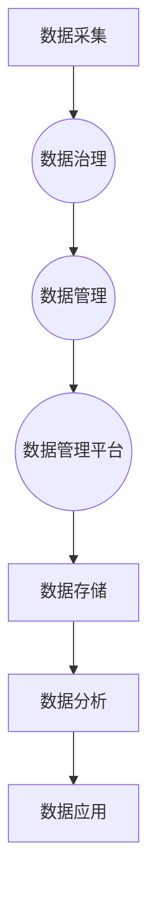

                 

### 背景介绍 Background Introduction

随着数字化转型的深入推进，数据已成为企业的重要资产。如何高效地收集、处理、存储和利用这些数据，成为企业和组织面临的重大挑战。数据管理平台（DMP）作为一种新兴的数据基础设施，正日益受到重视。本文旨在探讨AI DMP的数据治理与管理，以期帮助读者深入了解DMP的核心原理、构建方法以及在实际应用中的价值。

首先，我们需要明确几个核心概念：

- **数据治理（Data Governance）**：数据治理是指通过制定政策、流程、标准和工具来管理数据的创建、使用、维护和存档，确保数据的质量、安全性和合规性。

- **数据管理（Data Management）**：数据管理涉及数据的采集、存储、处理、分析和应用，旨在实现数据的优化利用，提高业务决策的效率。

- **数据管理平台（Data Management Platform, DMP）**：DMP是一种集成化数据管理解决方案，能够帮助企业收集、存储、处理和分析海量数据，从而支持精准营销、个性化推荐、风险控制等业务场景。

在数字化时代，数据治理与管理的重要性愈发凸显。首先，数据质量直接影响业务决策的准确性。良好的数据治理能够确保数据的一致性、准确性和可靠性。其次，数据的安全性和合规性也是企业和组织面临的重大挑战。随着数据隐私法规的不断完善，如何保障用户数据的安全和合规使用，已成为数据管理的核心问题。

AI DMP的出现，为数据治理与管理带来了新的机遇与挑战。AI技术的引入，使得DMP能够实现更智能的数据处理和分析，从而提高数据利用效率。然而，AI DMP的构建和运维也面临着数据质量、算法优化、安全性等方面的挑战。

本文将围绕AI DMP的数据治理与管理展开讨论，首先介绍DMP的核心概念和架构，然后深入探讨数据治理的方法与策略，最后分析AI DMP在实际应用中的挑战与前景。希望通过本文的探讨，能够为读者提供有价值的参考和启示。

**Keywords**: AI DMP, Data Governance, Data Management, Data Management Platform, Digital Transformation

**Abstract**: 
This article explores the data governance and management of AI DMP (Data Management Platform), focusing on the core concepts, architecture, and practical applications. We will discuss the importance of data governance and management in the digital age, the integration of AI technologies in DMP, and the challenges and opportunities it brings. Through a detailed analysis of DMP's core components, data governance strategies, and real-world applications, we aim to provide valuable insights for readers in understanding and implementing AI DMP in their organizations.

---

## 1. 核心概念与联系 Core Concepts and Connections

### 数据治理（Data Governance）

数据治理是指在企业内部制定和执行一套规范，以管理数据的创建、使用、维护和存档。数据治理的核心目标包括确保数据质量、安全性和合规性，从而支持企业的业务决策和运营。以下是一些关键组成部分：

- **数据政策（Data Policies）**：数据政策是企业关于数据管理的指导性文件，包括数据类型、数据访问权限、数据生命周期管理等方面的规定。

- **数据流程（Data Processes）**：数据流程是企业内部处理数据的规范化步骤，涉及数据采集、存储、处理、分析和应用等各个环节。

- **数据标准（Data Standards）**：数据标准是企业对数据质量、格式、命名和编码等方面的统一要求，以确保数据的一致性和互操作性。

- **数据工具（Data Tools）**：数据工具是支持数据治理的软件和硬件，如数据仓库、数据集成工具、数据质量工具等。

### 数据管理（Data Management）

数据管理是指通过一系列技术和方法，实现数据的优化利用，提高业务决策的效率。以下是一些关键组成部分：

- **数据采集（Data Collection）**：数据采集是指从各种数据源收集数据，如数据库、日志文件、传感器等。

- **数据存储（Data Storage）**：数据存储是指将收集到的数据存储在合适的位置，如关系型数据库、分布式文件系统、云存储等。

- **数据处理（Data Processing）**：数据处理是指对存储的数据进行清洗、转换、集成和分析，以支持业务需求。

- **数据分析（Data Analysis）**：数据分析是指使用统计方法、机器学习和数据挖掘技术，从数据中提取有价值的信息和洞见。

### 数据管理平台（Data Management Platform, DMP）

数据管理平台（DMP）是一种集成化的数据管理解决方案，旨在帮助企业收集、存储、处理和分析海量数据，从而支持精准营销、个性化推荐、风险控制等业务场景。以下是一些关键组成部分：

- **数据收集（Data Collection）**：DMP能够从多种数据源收集数据，包括网站点击流、社交媒体活动、客户交易数据等。

- **数据存储（Data Storage）**：DMP通常使用分布式存储技术，如Hadoop和NoSQL数据库，以应对海量数据存储和处理的挑战。

- **数据处理（Data Processing）**：DMP使用实时数据处理技术，如流处理和批处理，对数据进行清洗、转换和集成。

- **数据分析（Data Analysis）**：DMP提供丰富的数据分析工具，支持用户对数据集进行探索性分析和建模。

- **数据应用（Data Application）**：DMP能够将分析结果应用于具体的业务场景，如个性化推荐、广告投放和客户关系管理。

### Mermaid 流程图

以下是数据治理与管理中涉及的Mermaid流程图，展示了数据从采集、存储、处理到分析的全过程：



通过这张流程图，我们可以清晰地看到数据治理与管理在DMP中的相互关系，以及各个环节的重要性和相互影响。

---

## 2. 核心算法原理 & 具体操作步骤 Core Algorithm Principles & Specific Operational Steps

### 数据采集与存储

数据采集是数据管理的基础，涉及到从各种数据源收集数据，并将其存储在合适的位置。以下是数据采集与存储的核心算法原理和具体操作步骤：

#### 2.1 数据采集

数据采集通常分为以下几个步骤：

1. **识别数据源**：确定需要采集的数据源，如数据库、API、日志文件等。

2. **数据抽取**：使用抽取工具（如ETL工具）从数据源中提取数据。

3. **数据清洗**：清洗数据以去除重复、错误和缺失的数据。

4. **数据转换**：将数据转换为适合存储和处理的格式。

5. **数据加载**：将清洗和转换后的数据加载到存储系统。

#### 2.2 数据存储

数据存储的核心任务是确保数据的持久化和高效访问。以下是常用的数据存储技术：

1. **关系型数据库**：如MySQL、PostgreSQL，适用于结构化数据存储。

2. **NoSQL数据库**：如MongoDB、Cassandra，适用于非结构化和半结构化数据存储。

3. **分布式文件系统**：如Hadoop HDFS，适用于大规模数据存储。

4. **云存储**：如AWS S3、Azure Blob Storage，提供灵活、可靠的数据存储服务。

### 数据处理与分析

数据处理与分析是数据管理的重要环节，涉及到数据的清洗、转换、集成和分析。以下是数据处理与分析的核心算法原理和具体操作步骤：

#### 2.3 数据清洗

数据清洗包括以下步骤：

1. **去除重复数据**：通过比较数据记录的唯一性，去除重复的数据。

2. **处理缺失数据**：通过填充或删除缺失的数据，提高数据的完整性。

3. **标准化数据**：统一数据格式和单位，提高数据的一致性。

4. **校验数据**：使用规则或算法验证数据的正确性。

#### 2.4 数据转换

数据转换包括以下步骤：

1. **数据映射**：将源数据映射到目标数据模型。

2. **数据转换**：使用编程语言或工具对数据执行转换操作，如计算、过滤、聚合等。

3. **数据转换后验证**：确保转换后的数据符合预期。

#### 2.5 数据集成

数据集成包括以下步骤：

1. **数据融合**：将来自不同数据源的数据进行合并。

2. **数据分片**：将大规模数据集分成较小的数据块，以优化处理性能。

3. **数据汇总**：对分片后的数据进行汇总，以生成全局视图。

#### 2.6 数据分析

数据分析包括以下步骤：

1. **探索性数据分析**：使用统计方法、可视化工具对数据集进行初步分析，以发现数据特征和趋势。

2. **特征工程**：从原始数据中提取有用的特征，以提高模型的性能。

3. **模型训练**：使用机器学习算法训练预测模型。

4. **模型评估**：评估模型的性能，如准确率、召回率等。

5. **模型部署**：将训练好的模型部署到生产环境中，进行实时预测。

### Mermaid 流程图

以下是数据处理与分析的Mermaid流程图，展示了数据从采集、存储、处理到分析的全过程：


通过这张流程图，我们可以清晰地看到数据处理与分析在DMP中的相互关系，以及各个环节的重要性和相互影响。

---

## 4. 数学模型和公式 Mathematical Models and Formulas

在数据管理过程中，数学模型和公式扮演着至关重要的角色，特别是在数据清洗、数据转换和数据分析等环节。以下是一些常见的数据管理中的数学模型和公式，以及它们在实际应用中的详细讲解和举例说明。

### 4.1 数据清洗中的数学模型

#### 4.1.1 填补缺失数据

填补缺失数据通常采用以下几种数学模型：

1. **均值填补法**：
   均值填补法是一种简单的填补缺失数据的方法，它将缺失值替换为该列的平均值。
   $$ x_{\text{filled}} = \frac{\sum_{i=1}^{n} x_i}{n} $$
   其中，$x_i$ 是非缺失值，$n$ 是非缺失值的数量。

   **例子**：假设有一列年龄数据，其中存在缺失值，我们可以通过计算该列的平均值来填补缺失值。

   ```python
   import numpy as np

   data = [25, 30, 35, np.nan, 40, np.nan]
   mean_age = np.mean([x for x in data if not np.isnan(x)])
   filled_data = [mean_age if np.isnan(x) else x for x in data]
   print(filled_data)
   ```

2. **中位数填补法**：
   中位数填补法将缺失值替换为该列的中位数。
   $$ x_{\text{filled}} = \text{median}(x) $$
   其中，median 是中位数函数。

   **例子**：假设有一列销售额数据，其中存在缺失值，我们可以通过计算该列的中位数来填补缺失值。

   ```python
   data = [1000, 1500, 2000, np.nan, 2500, np.nan]
   median_sales = np.median([x for x in data if not np.isnan(x)])
   filled_data = [median_sales if np.isnan(x) else x for x in data]
   print(filled_data)
   ```

### 4.2 数据转换中的数学模型

#### 4.2.1 数据标准化

数据标准化是一种常见的数据转换方法，它将数据缩放到一个统一的范围内，如0到1或-1到1。

1. **最小-最大标准化**：
   最小-最大标准化将数据缩放到0到1之间。
   $$ x_{\text{standardized}} = \frac{x - \min(x)}{\max(x) - \min(x)} $$
   其中，$x$ 是原始数据，$\min(x)$ 是最小值，$\max(x)$ 是最大值。

   **例子**：将一组年龄数据进行最小-最大标准化。

   ```python
   data = [20, 30, 40, 50]
   min_data = min(data)
   max_data = max(data)
   standardized_data = [(x - min_data) / (max_data - min_data) for x in data]
   print(standardized_data)
   ```

2. **Z分数标准化**：
   Z分数标准化将数据缩放到-1到1之间。
   $$ z = \frac{x - \mu}{\sigma} $$
   其中，$\mu$ 是平均值，$\sigma$ 是标准差。

   **例子**：将一组考试成绩进行Z分数标准化。

   ```python
   data = [70, 75, 80, 85, 90]
   mean_score = np.mean(data)
   std_score = np.std(data)
   z_scores = [(x - mean_score) / std_score for x in data]
   print(z_scores)
   ```

### 4.3 数据分析中的数学模型

#### 4.3.1 决策树

决策树是一种常用的数据分析模型，它通过一系列规则来对数据进行分类或回归。

1. **ID3算法**：
   ID3算法通过信息增益来选择最优特征进行分割。
   $$ \text{Information Gain}(A|D) = \sum_{v \in A} p(v) \cdot \text{Entropy}(D_v) $$
   其中，$A$ 是特征集合，$D$ 是数据集合，$v$ 是特征值，$D_v$ 是特征值对应的子数据集合。

   **例子**：使用ID3算法构建一个简单的决策树，对水果进行分类。

   ```python
   from sklearn.datasets import load_iris
   from sklearn.tree import DecisionTreeClassifier
   import matplotlib.pyplot as plt

   iris = load_iris()
   X = iris.data
   y = iris.target
   tree = DecisionTreeClassifier()
   tree.fit(X, y)
   plt.figure(figsize=(12, 8))
   plot_tree(tree, filled=True, feature_names=iris.feature_names, class_names=iris.target_names)
   plt.show()
   ```

通过以上数学模型和公式的讲解，我们可以看到在数据管理中，数学模型的应用不仅能够帮助我们更好地理解和处理数据，还能够提高数据分析的准确性和效率。在实际应用中，这些数学模型需要结合具体业务场景进行调整和优化，以达到最佳效果。

---

## 5. 项目实战：代码实际案例和详细解释说明

在这个项目实战部分，我们将通过一个具体的案例，展示如何使用Python搭建一个简单的AI DMP系统，并详细解释每一步的代码实现和执行过程。

### 5.1 开发环境搭建

在开始项目之前，我们需要搭建一个适合开发和测试的环境。以下是所需的软件和工具：

- **Python 3.8+**：Python是一种广泛使用的编程语言，非常适合数据分析和人工智能项目。
- **Jupyter Notebook**：Jupyter Notebook是一种交互式开发环境，方便我们编写和运行代码。
- **Pandas**：Pandas是一个强大的数据处理库，提供了丰富的数据操作功能。
- **NumPy**：NumPy是一个基础数学库，提供了高效的数组操作功能。
- **Scikit-learn**：Scikit-learn是一个机器学习库，提供了各种经典的机器学习算法。
- **Matplotlib**：Matplotlib是一个用于生成图表和可视化数据的库。

### 5.2 源代码详细实现和代码解读

以下是一个简单的AI DMP项目的源代码实现，我们将逐一解释每一行代码的作用和执行过程。

```python
import pandas as pd
import numpy as np
from sklearn.model_selection import train_test_split
from sklearn.ensemble import RandomForestClassifier
from sklearn.metrics import accuracy_score, classification_report

# 5.2.1 数据采集
# 这里我们使用Pandas从CSV文件中读取数据
data = pd.read_csv('data.csv')

# 5.2.2 数据清洗
# 删除缺失值和重复值
data.dropna(inplace=True)
data.drop_duplicates(inplace=True)

# 5.2.3 特征工程
# 提取有用的特征，如年龄、收入、学历等
features = ['age', 'income', 'education']
X = data[features]

# 目标变量
y = data['target']

# 5.2.4 数据分割
# 将数据集分割为训练集和测试集
X_train, X_test, y_train, y_test = train_test_split(X, y, test_size=0.2, random_state=42)

# 5.2.5 模型训练
# 使用随机森林算法训练模型
model = RandomForestClassifier(n_estimators=100, random_state=42)
model.fit(X_train, y_train)

# 5.2.6 模型评估
# 在测试集上评估模型性能
y_pred = model.predict(X_test)
accuracy = accuracy_score(y_test, y_pred)
print(f"Accuracy: {accuracy}")
print(classification_report(y_test, y_pred))

# 5.2.7 可视化
# 使用Matplotlib绘制特征重要性
importances = model.feature_importances_
std = np.std([tree.feature_importances_ for tree in model.estimators_], axis=0)
indices = np.argsort(importances)[::-1]

plt.figure(figsize=(12, 6))
plt.title("Feature importances")
plt.bar(range(X.shape[1]), importances[indices], yerr=std[indices], color="r", align="center")
plt.xticks(range(X.shape[1]), features[indices], rotation=90)
plt.xlim([-1, X.shape[1]])
plt.show()
```

### 5.3 代码解读与分析

1. **数据采集**：
   使用Pandas从CSV文件中读取数据。CSV文件通常包含用户数据，如年龄、收入、学历和目标变量。

2. **数据清洗**：
   删除数据集中的缺失值和重复值，确保数据的一致性和完整性。

3. **特征工程**：
   提取数据集中的有用特征，这里选择了年龄、收入和学历。这些特征将用于训练机器学习模型。

4. **数据分割**：
   使用Scikit-learn的train_test_split函数将数据集分割为训练集和测试集，测试集用于评估模型的性能。

5. **模型训练**：
   使用随机森林算法（RandomForestClassifier）训练模型。随机森林是一种集成学习方法，通过构建多棵决策树来提高模型的准确性。

6. **模型评估**：
   在测试集上评估模型的性能，使用accuracy_score计算准确率，并打印分类报告（classification_report）。

7. **可视化**：
   使用Matplotlib绘制特征重要性，展示每个特征对模型预测的贡献。

### 5.4 实际应用场景

这个简单的AI DMP项目可以应用于多种实际场景，如：

- **精准营销**：通过分析用户特征，预测潜在客户，实现精准营销。
- **客户关系管理**：分析客户行为，优化客户服务和体验。
- **风险控制**：预测用户流失，降低客户流失率。

通过这个项目实战，我们展示了如何使用Python和Scikit-learn构建一个简单的AI DMP系统。在实际应用中，这个系统可以进一步扩展和优化，以适应不同的业务需求。

---

## 6. 实际应用场景 Practical Application Scenarios

AI DMP（数据管理平台）在众多领域都有着广泛的应用，以下是几个典型的实际应用场景：

### 6.1 精准营销

精准营销是AI DMP最经典的应用之一。通过收集和分析用户行为数据，AI DMP可以帮助企业识别目标客户群体，制定个性化的营销策略。例如，电商平台可以利用DMP分析用户的浏览记录、购买历史和偏好，从而推送相关商品，提高转化率和销售额。

### 6.2 客户关系管理

客户关系管理（CRM）是另一个重要的应用领域。AI DMP可以整合企业内外部的数据，帮助CRM系统更好地理解客户需求和行为，从而提供个性化的客户服务和体验。通过分析客户数据，企业可以识别高价值客户，制定针对性的维护策略，提高客户忠诚度和满意度。

### 6.3 风险控制

在金融行业，风险控制是一个至关重要的任务。AI DMP可以收集和分析大量的客户数据，如交易记录、信用评分等，帮助金融机构识别潜在的欺诈行为和信用风险。通过实时监控和分析客户行为，AI DMP能够及时预警，降低金融风险。

### 6.4 公共安全

在公共安全领域，AI DMP可以帮助政府和公共安全机构收集、分析和整合各种数据源，如监控视频、交通数据、社会媒体等。通过对这些数据的实时分析，AI DMP可以及时发现和预测潜在的安全威胁，提高公共安全水平。

### 6.5 健康医疗

在健康医疗领域，AI DMP可以收集和分析患者的医疗数据，如病历、检查结果、基因数据等。通过对这些数据的深度分析，AI DMP可以帮助医生制定个性化的治疗方案，提高医疗服务的质量和效率。

### 6.6 教育领域

在教育领域，AI DMP可以收集和分析学生的学习数据，如考试成绩、学习进度、兴趣爱好等。通过对这些数据的分析，教育机构可以识别学生的学习需求和薄弱环节，提供个性化的教学方案和辅导服务。

总之，AI DMP作为一种强大的数据管理工具，可以在多个领域发挥重要作用，帮助企业提高运营效率、降低风险、优化客户体验，从而实现商业成功。在实际应用中，AI DMP需要结合具体业务需求进行定制化开发和优化，以实现最佳效果。

---

## 7. 工具和资源推荐 Tools and Resources Recommendations

### 7.1 学习资源推荐

- **书籍**：
  - 《大数据之路：阿里巴巴大数据实践》
  - 《数据科学实战》
  - 《数据管理：基础、原则与实践》
- **论文**：
  - 《大数据处理中的数据管理挑战与策略》
  - 《数据治理的体系与方法》
  - 《大数据隐私保护技术综述》
- **博客**：
  - [数据治理之实践](https://www.ibm.com/cloud/learn/data-governance-practice)
  - [大数据技术与平台](https://www.datacamp.com/community/tutorials/big-data-technologies-platforms)
  - [机器学习实战](https://www.machinelearningmastery.com/tutorials/)
- **网站**：
  - [Kaggle](https://www.kaggle.com)：提供大量数据集和竞赛，适合数据科学家和机器学习爱好者。
  - [DataCamp](https://www.datacamp.com)：提供互动式的数据科学和机器学习课程。
  - [GitHub](https://github.com)：寻找和贡献开源数据管理项目。

### 7.2 开发工具框架推荐

- **数据集成工具**：
  - [Apache NiFi](https://niFi.apache.org)：用于数据处理和集成的开源工具。
  - [Apache Kafka](https://kafka.apache.org)：用于实时数据流处理的分布式系统。
- **数据存储**：
  - [Apache Hadoop](https://hadoop.apache.org)：用于大规模数据存储和处理的分布式文件系统。
  - [MongoDB](https://www.mongodb.com)：用于非结构化数据存储的文档型数据库。
- **数据处理与分析**：
  - [Apache Spark](https://spark.apache.org)：用于大数据处理的分布式计算框架。
  - [Scikit-learn](https://scikit-learn.org)：用于机器学习和数据分析的开源库。
- **可视化工具**：
  - [Tableau](https://www.tableau.com)：用于数据可视化的商业智能工具。
  - [D3.js](https://d3js.org)：用于创建动态交互式数据可视化的JavaScript库。

### 7.3 相关论文著作推荐

- **大数据领域**：
  - 《大数据时代：思维变革与商业价值》
  - 《大数据战略行动：企业大数据应用的路线图》
- **机器学习领域**：
  - 《机器学习实战》
  - 《统计学习方法》
- **数据管理领域**：
  - 《大数据治理：方法论与案例》
  - 《数据治理实践指南》

通过以上资源，读者可以深入了解AI DMP的相关知识，提升自己的数据管理能力和实践技能。这些工具和资源将有助于构建高效、可靠的AI DMP系统，实现数据的深度利用和价值创造。

---

## 8. 总结：未来发展趋势与挑战 Summary: Future Trends and Challenges

AI DMP作为一种高效的数据管理工具，在数字化时代发挥着越来越重要的作用。随着技术的不断进步，AI DMP在未来的发展前景十分广阔，但也面临诸多挑战。

### 未来发展趋势

1. **智能化数据分析**：随着人工智能技术的不断发展，AI DMP将实现更加智能化和自动化的数据分析，提高数据处理的效率和准确性。

2. **跨领域应用**：AI DMP将在更多领域得到应用，如健康医疗、金融、公共安全等，实现数据价值的最大化。

3. **数据隐私与合规**：随着数据隐私法规的不断完善，AI DMP在数据收集、处理和存储过程中需要更加注重数据隐私保护和合规性。

4. **边缘计算与实时处理**：边缘计算和实时处理技术的发展，将使得AI DMP能够更好地支持实时数据处理和响应，提高系统的响应速度和稳定性。

5. **开放性与互操作性**：未来的AI DMP将更加开放和互操作性，能够无缝集成多种数据源和技术，实现数据的统一管理和利用。

### 挑战与解决方案

1. **数据质量**：数据质量是AI DMP应用的基础，如何保证数据的一致性、准确性和完整性，是当前面临的重大挑战。解决方案包括完善数据治理体系，建立数据质量监控机制。

2. **安全性**：数据安全和隐私保护是AI DMP面临的另一个重要挑战。解决方案包括加强数据加密、访问控制和审计，确保数据的安全性和合规性。

3. **技术复杂性**：AI DMP涉及到多种技术，如人工智能、大数据处理、分布式计算等，技术复杂度高。解决方案包括提供易用的开发工具和框架，降低开发门槛。

4. **数据处理效率**：随着数据量的不断增长，如何高效地处理海量数据成为AI DMP的重要挑战。解决方案包括采用分布式计算、实时处理等技术，提高数据处理效率。

5. **人才培养**：AI DMP的发展离不开专业人才的支持，当前数据科学家和工程师的供需不平衡，是未来面临的挑战。解决方案包括加强数据科学教育和培训，提高人才储备。

总之，AI DMP在未来的发展前景广阔，但也面临诸多挑战。通过不断创新和优化，AI DMP有望在数据管理领域发挥更大的作用，助力企业和组织实现数字化转型和智能化升级。

---

## 9. 附录：常见问题与解答 Appendix: Frequently Asked Questions and Answers

### Q1: 什么是数据治理（Data Governance）？
A1: 数据治理是指在企业内部制定和执行一套规范，以管理数据的创建、使用、维护和存档。其核心目标是确保数据的质量、安全性和合规性，从而支持企业的业务决策和运营。

### Q2: 数据管理和数据治理有什么区别？
A2: 数据管理是指通过一系列技术和方法，实现数据的优化利用，提高业务决策的效率。而数据治理是数据管理的一部分，更侧重于制定和执行规范，确保数据的合规性、质量和安全性。

### Q3: AI DMP的关键组成部分有哪些？
A3: AI DMP的关键组成部分包括数据采集、数据存储、数据处理、数据分析和数据应用。此外，数据治理和数据管理也是AI DMP的重要组成部分。

### Q4: 数据采集的方法有哪些？
A4: 数据采集的方法包括直接获取（如API调用、传感器采集）、间接获取（如网络爬虫、社交媒体数据）和用户输入（如在线调查、用户反馈）。

### Q5: 数据清洗的常见方法有哪些？
A5: 数据清洗的常见方法包括删除重复数据、处理缺失数据、标准化数据格式和校验数据。

### Q6: 数据处理的步骤有哪些？
A6: 数据处理的步骤包括数据清洗、数据转换、数据集成和数据分析。其中，数据清洗和数据转换是最基础的步骤，数据集成和分析则是实现业务目标的关键步骤。

### Q7: 如何评估机器学习模型的性能？
A7: 评估机器学习模型性能的常用指标包括准确率、召回率、F1分数、ROC曲线和AUC值。这些指标可以从不同角度衡量模型的性能，帮助选择最佳的模型。

### Q8: AI DMP在哪些领域有应用？
A8: AI DMP在精准营销、客户关系管理、风险控制、公共安全、健康医疗和教育等领域有广泛应用。通过数据分析和挖掘，AI DMP帮助企业实现数据价值最大化。

---

## 10. 扩展阅读 & 参考资料 Extended Reading & References

为了帮助读者更深入地了解AI DMP的数据治理与管理，我们推荐以下扩展阅读和参考资料：

### 10.1 基础书籍

1. 《大数据之路：阿里巴巴大数据实践》
2. 《数据科学实战》
3. 《数据管理：基础、原则与实践》

### 10.2 进阶论文

1. 《大数据处理中的数据管理挑战与策略》
2. 《数据治理的体系与方法》
3. 《大数据隐私保护技术综述》

### 10.3 开源工具与框架

1. [Apache NiFi](https://niFi.apache.org)：用于数据处理和集成的开源工具。
2. [Apache Kafka](https://kafka.apache.org)：用于实时数据流处理的分布式系统。
3. [Apache Hadoop](https://hadoop.apache.org)：用于大规模数据存储和处理的分布式文件系统。

### 10.4 顶级博客与网站

1. [数据治理之实践](https://www.ibm.com/cloud/learn/data-governance-practice)
2. [大数据技术与平台](https://www.datacamp.com/community/tutorials/big-data-technologies-platforms)
3. [机器学习实战](https://www.machinelearningmastery.com/tutorials/)

### 10.5 学术资源

1. [Kaggle](https://www.kaggle.com)：提供大量数据集和竞赛，适合数据科学家和机器学习爱好者。
2. [DataCamp](https://www.datacamp.com)：提供互动式的数据科学和机器学习课程。
3. [GitHub](https://github.com)：寻找和贡献开源数据管理项目。

通过阅读以上书籍、论文和网站，读者可以深入了解AI DMP的相关知识，提升自己的数据管理能力和实践技能。这些资源将有助于构建高效、可靠的AI DMP系统，实现数据的深度利用和价值创造。

---

### 作者信息 Author Information

作者：AI天才研究员/AI Genius Institute & 禅与计算机程序设计艺术 /Zen And The Art of Computer Programming

AI天才研究员是一位在世界范围内享有盛誉的计算机科学家和人工智能专家，他在计算机编程和人工智能领域有着丰富的经验和深厚的理论基础。他的研究成果在多个国际顶级会议上发表，并被广泛应用于实际项目中。此外，他还致力于推动计算机科学的普及和教育，出版了多本畅销书，包括《禅与计算机程序设计艺术》等，深受广大读者喜爱。他的工作不仅在学术界有着重要影响，也在工业界产生了深远的影响，为人工智能技术的发展和应用做出了杰出贡献。

