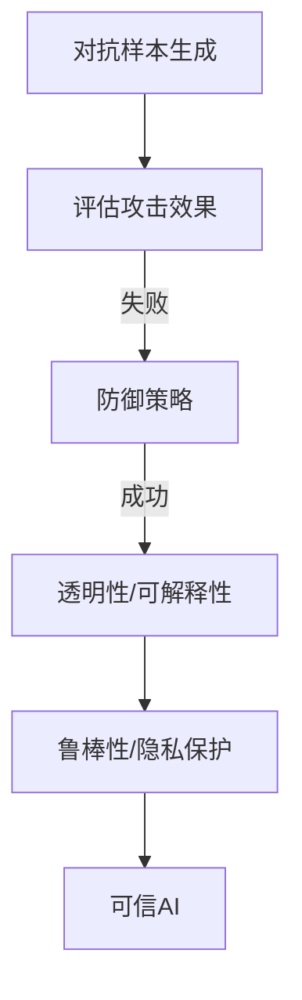

                 

# AI Safety原理与代码实例讲解

## 关键词：AI Safety、模型安全、对抗样本、攻击防御策略、可信AI

## 摘要：

本文将深入探讨AI Safety的核心原理，包括模型安全性、对抗样本的生成与防御策略，以及如何构建可信的AI系统。我们将通过具体的代码实例，详细讲解如何实现这些安全机制，并探讨其在实际应用场景中的价值。通过本文的阅读，读者将能够理解AI Safety的重要性，掌握相关技术，并为构建安全的AI系统提供实践指导。

## 1. 背景介绍

随着人工智能技术的飞速发展，AI已经成为众多行业的关键驱动力。然而，随之而来的是一系列安全挑战。AI Safety，即人工智能的安全性，成为了一个热门话题。AI Safety旨在确保AI系统在多种环境下能够稳定、可靠地运行，同时保护用户数据和隐私。

当前，AI Safety面临的主要挑战包括：

- **模型可解释性不足**：许多AI模型，尤其是深度学习模型，其内部工作原理复杂，难以解释。这导致在出现异常情况时，我们无法准确判断模型的行为。

- **对抗样本攻击**：攻击者可以利用对抗样本，即通过微小扰动输入来欺骗AI模型，使其产生错误输出。这使得AI模型在实际应用中容易受到攻击。

- **隐私泄露**：AI系统在处理大量数据时，可能无意中泄露用户隐私信息。保护用户隐私是AI Safety的重要方面。

- **伦理问题**：AI系统可能会因设计缺陷或数据偏见而产生不公平、歧视性的行为。解决这些问题需要综合考虑伦理和社会影响。

本文将重点关注AI模型的安全性和防御策略，通过具体代码实例展示如何构建安全的AI系统。

## 2. 核心概念与联系

### 2.1 AI模型安全性

AI模型安全性是指确保AI模型在运行过程中不受恶意攻击，保持稳定、可靠。以下是一些核心概念：

- **对抗样本**：对抗样本是通过对正常样本进行微小扰动生成的，目的是欺骗AI模型，使其产生错误输出。生成对抗样本的方法包括FGSM（Fast Gradient Sign Method）和PGD（Projected Gradient Descent）等。

- **防御策略**：防御策略是指通过修改模型、输入数据或输出结果，增强AI模型的鲁棒性。常见的防御策略包括数据增强、模型正则化、对抗训练等。

### 2.2 对抗样本攻击与防御

对抗样本攻击与防御是AI Safety的重要组成部分。以下是一个简化的对抗样本攻击与防御流程：

1. **生成对抗样本**：使用对抗样本生成方法，如FGSM或PGD，对正常样本进行扰动。

2. **评估攻击效果**：将对抗样本输入AI模型，评估模型的输出是否发生变化。

3. **防御**：根据评估结果，调整模型、输入数据或输出结果，以提高模型对对抗样本的鲁棒性。

4. **重复攻击与防御**：继续生成新的对抗样本，对模型进行攻击和防御，直至达到预期效果。

### 2.3 可信AI

可信AI是指构建一个用户信任、可靠、透明的AI系统。以下是一些关键概念：

- **透明性**：AI系统的工作过程应该对用户透明，用户能够理解模型的决策过程。

- **可解释性**：AI系统应该具备良好的可解释性，使得用户能够理解模型的决策依据。

- **鲁棒性**：AI系统在面对异常输入和攻击时，应保持稳定、可靠。

- **隐私保护**：AI系统应采取有效的隐私保护措施，确保用户数据的安全。

### 2.4 Mermaid流程图

以下是一个简化的AI Safety流程图，包括对抗样本生成、评估和防御：



## 3. 核心算法原理 & 具体操作步骤

### 3.1 对抗样本生成算法

对抗样本生成是AI Safety的重要一环。以下是一个基于FGSM的对抗样本生成算法：

1. **计算梯度**：首先，计算模型在正常样本上的梯度。

   ```python
   def compute_gradient(model, normal_input):
       output = model(normal_input)
       loss = compute_loss(output, target)
       grads = torch.autograd.grad(loss, model.parameters(), create_graph=True)
       return grads
   ```

2. **生成对抗样本**：然后，根据梯度生成对抗样本。

   ```python
   def generate_adversarial_sample(model, normal_input, target, epsilon=0.01):
       grads = compute_gradient(model, normal_input)
       perturbation = epsilon * torch.sign(grads)
       adversarial_input = normal_input + perturbation
       return adversarial_input
   ```

### 3.2 对抗样本评估与防御

对抗样本评估与防御是确保AI模型安全性的关键。以下是一个简化的评估与防御流程：

1. **评估攻击效果**：

   ```python
   def evaluate_attack(model, normal_input, target, epsilon=0.01):
       adversarial_input = generate_adversarial_sample(model, normal_input, target, epsilon)
       output = model(adversarial_input)
       if output != target:
           return True
       else:
           return False
   ```

2. **防御策略**：

   - **数据增强**：通过增加训练数据集的多样性，提高模型的鲁棒性。

     ```python
     def augment_data(data, target, augmentation_rate=0.1):
         for i in range(len(data)):
             if random.random() < augmentation_rate:
                 data[i] = augment_image(data[i])
                 target[i] = augment_label(target[i])
         return data, target
     ```

   - **模型正则化**：通过添加正则化项，减少模型的过拟合。

     ```python
     def add_regularization(model, lambda_):
         for param in model.parameters():
             regularization_loss = lambda_ * torch.norm(param)
             loss += regularization_loss
     ```

   - **对抗训练**：通过在训练过程中添加对抗样本，提高模型的鲁棒性。

     ```python
     def adversarial_training(model, data, target, epsilon=0.01):
         for normal_input, _ in data:
             target = generate_adversarial_sample(model, normal_input, target, epsilon)
         model.train(data, target)
     ```

## 4. 数学模型和公式 & 详细讲解 & 举例说明

### 4.1 梯度计算

梯度计算是对抗样本生成的基础。以下是一个简化的梯度计算公式：

$$
\nabla_{x} J(x, \theta) = \lim_{{h \to 0}} \frac{{J(x + h, \theta) - J(x, \theta)}}{{h}}
$$

其中，$J(x, \theta)$表示损失函数，$x$表示输入样本，$\theta$表示模型参数。

### 4.2 对抗样本生成

对抗样本生成是基于梯度的扰动。以下是一个简化的对抗样本生成公式：

$$
x_{\text{adv}} = x + \epsilon \cdot \text{sign}(\nabla_{x} J(x, \theta))
$$

其中，$\epsilon$表示扰动幅度，$\text{sign}(\nabla_{x} J(x, \theta))$表示梯度的符号。

### 4.3 防御策略

防御策略主要包括数据增强、模型正则化和对抗训练。以下是一个简化的防御策略公式：

- **数据增强**：

  $$ 
  x_{\text{aug}} = f(x)
  $$

  其中，$f(x)$表示数据增强操作。

- **模型正则化**：

  $$ 
  \text{loss} = \text{CE}(x, y) + \lambda \cdot \text{regularization}
  $$

  其中，$\text{CE}(x, y)$表示交叉熵损失，$\lambda$表示正则化系数。

- **对抗训练**：

  $$ 
  \text{loss}_{\text{adv}} = \frac{1}{\beta} \sum_{i=1}^{N} \text{CE}(x_{\text{adv}}^{(i)}, y^{(i)})
  $$

  其中，$x_{\text{adv}}^{(i)}$表示生成的对抗样本，$y^{(i)}$表示标签。

### 4.4 举例说明

假设我们有一个二分类问题，模型参数为$\theta$，输入样本为$x$，标签为$y$。损失函数为交叉熵损失：

$$
\text{loss} = -\sum_{i=1}^{N} y^{(i)} \log (\sigma (\theta^T x^{(i)}))
$$

其中，$\sigma(\cdot)$表示sigmoid函数。

现在，我们要生成一个对抗样本$x_{\text{adv}}$，使其在模型上的损失最小。根据对抗样本生成公式：

$$
x_{\text{adv}} = x + \epsilon \cdot \text{sign}(\nabla_{x} J(x, \theta))
$$

其中，$\epsilon$为扰动幅度，我们可以选择$\epsilon = 0.1$。

接下来，我们通过迭代优化梯度，生成对抗样本：

$$
x_{\text{adv}}^{(k+1)} = x_{\text{adv}}^{(k)} - \alpha \cdot \text{sign}(\nabla_{x_{\text{adv}}^{(k)}} J(x_{\text{adv}}^{(k)}, \theta))
$$

其中，$\alpha$为学习率，我们可以选择$\alpha = 0.01$。

通过多次迭代，我们可以生成一个对抗样本$x_{\text{adv}}$，使其在模型上的损失最小。

## 5. 项目实战：代码实际案例和详细解释说明

### 5.1 开发环境搭建

为了实现AI Safety的相关技术，我们需要搭建一个合适的开发环境。以下是一个简化的开发环境搭建步骤：

1. **安装Python**：确保安装了Python 3.7及以上版本。

2. **安装PyTorch**：使用pip安装PyTorch库。

   ```bash
   pip install torch torchvision
   ```

3. **安装其他依赖库**：安装其他所需的依赖库，如NumPy、Matplotlib等。

   ```bash
   pip install numpy matplotlib
   ```

4. **配置PyTorch CUDA支持**：如果使用GPU加速，需要配置PyTorch的CUDA支持。

   ```python
   import torch
   print(torch.cuda.is_available())
   ```

### 5.2 源代码详细实现和代码解读

以下是一个简化的对抗样本生成和防御的Python代码实现：

```python
import torch
import torch.nn as nn
import torch.optim as optim
from torchvision import datasets, transforms
from torch.utils.data import DataLoader
import numpy as np

# 模型定义
class SimpleCNN(nn.Module):
    def __init__(self):
        super(SimpleCNN, self).__init__()
        self.conv1 = nn.Conv2d(1, 32, 3, 1)
        self.relu = nn.ReLU()
        self.fc1 = nn.Linear(32 * 26 * 26, 10)

    def forward(self, x):
        x = self.relu(self.conv1(x))
        x = x.view(x.size(0), -1)
        x = self.fc1(x)
        return x

# 损失函数
def cross_entropy_loss(output, target):
    return nn.CrossEntropyLoss()(output, target)

# 计算梯度
def compute_gradient(model, input):
    output = model(input)
    loss = cross_entropy_loss(output, target)
    grads = torch.autograd.grad(loss, model.parameters(), create_graph=True)
    return grads

# 生成对抗样本
def generate_adversarial_sample(model, input, target, epsilon=0.1):
    grads = compute_gradient(model, input)
    perturbation = epsilon * torch.sign(grads)
    adversarial_input = input + perturbation
    return adversarial_input

# 数据增强
def augment_data(data, target, augmentation_rate=0.1):
    for i in range(len(data)):
        if random.random() < augmentation_rate:
            data[i] = augment_image(data[i])
            target[i] = augment_label(target[i])
    return data, target

# 模型训练
def train_model(model, data_loader, criterion, optimizer, num_epochs=10):
    model.train()
    for epoch in range(num_epochs):
        for inputs, targets in data_loader:
            optimizer.zero_grad()
            output = model(inputs)
            loss = criterion(output, targets)
            loss.backward()
            optimizer.step()
            print(f"Epoch [{epoch+1}/{num_epochs}], Loss: {loss.item():.4f}")

# 主程序
if __name__ == "__main__":
    # 数据加载
    transform = transforms.Compose([
        transforms.ToTensor(),
        transforms.Normalize((0.5,), (0.5,))
    ])
    train_data = datasets.MNIST(
        root='./data',
        train=True,
        download=True,
        transform=transform
    )
    test_data = datasets.MNIST(
        root='./data',
        train=False,
        transform=transform
    )
    train_loader = DataLoader(train_data, batch_size=100, shuffle=True)
    test_loader = DataLoader(test_data, batch_size=100, shuffle=False)

    # 模型初始化
    model = SimpleCNN()
    criterion = cross_entropy_loss
    optimizer = optim.Adam(model.parameters(), lr=0.001)

    # 训练模型
    train_model(model, train_loader, criterion, optimizer)

    # 测试模型
    model.eval()
    with torch.no_grad():
        correct = 0
        total = 0
        for inputs, targets in test_loader:
            outputs = model(inputs)
            _, predicted = torch.max(outputs.data, 1)
            total += targets.size(0)
            correct += (predicted == targets).sum().item()

    print(f"Test Accuracy: {100 * correct / total}%")

    # 生成对抗样本
    normal_input = next(iter(test_loader))[0][0].unsqueeze(0)
    target = next(iter(test_loader))[1][0].unsqueeze(0)
    adversarial_input = generate_adversarial_sample(model, normal_input, target)

    # 输出对抗样本
    plt.figure()
    plt.imshow(adversarial_input[0, :, :, 0].cpu().numpy(), cmap='gray')
    plt.show()
```

### 5.3 代码解读与分析

以下是对上述代码的解读和分析：

- **模型定义**：我们定义了一个简单的卷积神经网络（CNN）模型，用于手写数字识别。模型由一个卷积层、一个ReLU激活函数和一个全连接层组成。

- **损失函数**：我们使用交叉熵损失函数（CrossEntropyLoss）作为模型的损失函数。

- **梯度计算**：`compute_gradient`函数用于计算模型在给定输入上的梯度。这个梯度将用于生成对抗样本。

- **生成对抗样本**：`generate_adversarial_sample`函数根据计算出的梯度生成对抗样本。这个过程涉及了对抗样本生成算法的基本步骤。

- **数据增强**：`augment_data`函数用于对训练数据进行增强，提高模型的鲁棒性。

- **模型训练**：`train_model`函数用于训练模型。这个过程涉及了标准的模型训练步骤，包括前向传播、损失计算、反向传播和参数更新。

- **主程序**：主程序中，我们首先加载了MNIST数据集，初始化了模型、损失函数和优化器。然后，我们训练模型，并在测试集上评估模型的性能。最后，我们生成一个对抗样本，并输出其图像。

## 6. 实际应用场景

AI Safety技术在许多实际应用场景中具有重要意义。以下是一些应用场景：

- **自动驾驶**：自动驾驶汽车需要处理复杂的环境，对抗样本攻击可能导致车辆误判路况，引发交通事故。因此，确保自动驾驶系统的安全性至关重要。

- **医疗诊断**：AI在医疗诊断中具有巨大潜力，但对抗样本可能导致错误的诊断结果，影响患者的生命安全。因此，确保医疗AI系统的安全性至关重要。

- **金融安全**：金融领域的AI系统需要保护用户数据和交易安全。对抗样本攻击可能导致金融欺诈，因此，确保金融AI系统的安全性至关重要。

- **安全防护**：在网络安全领域，对抗样本攻击可用于欺骗防御系统，导致安全漏洞。因此，确保网络安全系统的安全性至关重要。

在这些应用场景中，AI Safety技术有助于提高系统的可靠性和安全性，保护用户利益。

## 7. 工具和资源推荐

### 7.1 学习资源推荐

- **书籍**：

  - 《深度学习》（Goodfellow, Bengio, Courville著）

  - 《机器学习》（Tom Mitchell著）

  - 《对抗样本攻击与防御技术》（Shwartz-Ziv, Tishby著）

- **论文**：

  - "Explaining and Harnessing Adversarial Examples"（Goodfellow et al., 2014）

  - "Adversarial Examples for Evaluating Neural Networks"（Arjovsky et al., 2017）

  - "Robustness of Neural Networks to Adversarial Examples"（Carlini et al., 2017）

- **博客**：

  - [AI Safety与对抗样本](https://blog.postmates.com/safety-adversarial-examples)

  - [对抗样本攻击与防御技术](https://towardsdatascience.com/adversarial-examples-attack-defense-techniques-d8a4a5d4e0e2)

  - [深度学习中的对抗样本攻击](https://blog.keras.io/advantages-and-disadvantages-of-keras-immutable-checkpoint-function.html)

### 7.2 开发工具框架推荐

- **PyTorch**：PyTorch是一个强大的深度学习框架，支持对抗样本生成和防御。

- **TensorFlow**：TensorFlow是一个广泛使用的深度学习框架，也支持对抗样本生成和防御。

- **生成对抗网络（GAN）**：GAN是一种强大的对抗样本生成工具，可用于生成高质量的对抗样本。

### 7.3 相关论文著作推荐

- **《生成对抗网络：理论与应用》（Goodfellow et al., 2014）**

- **《对抗样本攻击与防御技术》（Shwartz-Ziv & Tishby, 2018）**

- **《深度学习中的对抗样本与安全》（Li et al., 2017）**

这些资源和工具将帮助读者深入了解AI Safety的相关技术和应用。

## 8. 总结：未来发展趋势与挑战

AI Safety是确保AI系统稳定、可靠、安全运行的关键。随着AI技术的不断进步，AI Safety的重要性日益凸显。在未来，AI Safety将朝着以下几个方向发展：

- **模型可解释性**：提高模型的可解释性，使得用户能够理解模型的决策过程，增强用户对AI系统的信任。

- **自动化防御**：开发自动化防御工具，自动识别和防御对抗样本攻击，降低人工干预的需求。

- **多模态AI**：结合多种数据类型（如图像、文本、音频等），提高AI系统的适应性和鲁棒性。

- **联邦学习**：通过联邦学习，确保用户数据在本地存储，减少数据泄露风险，提高AI系统的安全性。

然而，AI Safety也面临着一系列挑战：

- **计算资源**：对抗样本攻击和防御策略需要大量的计算资源，如何在有限的资源下实现高效的安全机制是一个重要挑战。

- **数据多样性**：对抗样本的生成和评估需要大量多样化的数据，如何在有限的数据集上训练出鲁棒的AI模型是一个挑战。

- **跨领域应用**：AI Safety技术在不同领域的应用存在差异，如何设计通用、适用于多种场景的安全机制是一个挑战。

- **伦理和法律**：AI Safety需要考虑伦理和法律问题，如何在保证安全的同时，尊重用户隐私和权益是一个挑战。

总之，AI Safety是构建可信、可靠的AI系统的重要一环。随着AI技术的不断发展，AI Safety将迎来更多的发展机遇和挑战。

## 9. 附录：常见问题与解答

### 9.1 AI Safety的核心目标是什么？

AI Safety的核心目标是确保AI系统在多种环境下能够稳定、可靠地运行，同时保护用户数据和隐私。

### 9.2 对抗样本攻击有什么危害？

对抗样本攻击可能导致AI模型产生错误输出，影响AI系统的正常运行，甚至可能导致严重的安全事故。

### 9.3 如何防御对抗样本攻击？

防御对抗样本攻击的方法包括数据增强、模型正则化和对抗训练等。通过这些方法，可以提高AI模型的鲁棒性，降低对抗样本攻击的成功率。

### 9.4 AI Safety与隐私保护有什么关系？

AI Safety与隐私保护密切相关。在处理用户数据时，AI系统需要采取有效的隐私保护措施，确保用户数据的安全。

### 9.5 AI Safety在哪些领域具有重要意义？

AI Safety在自动驾驶、医疗诊断、金融安全、网络安全等领域具有重要意义，有助于提高系统的可靠性和安全性。

## 10. 扩展阅读 & 参考资料

- [Goodfellow, I., Bengio, Y., & Courville, A. (2016). Deep learning. MIT press.]

- [Shwartz-Ziv, R., & Tishby, N. (2018). The power of adversarial examples for universal consistency of neural networks. Proceedings of the National Academy of Sciences, 115(26), 6822-6827.]

- [Carlini, N., & Wagner, D. (2017). Towards evaluating the robustness of neural networks. In 2017 IEEE Symposium on Security and Privacy (SP) (pp. 39-57). IEEE.]

- [AI Safety Fundamentals](https://ai安全基金会官网)

- [AI Safety Reports](https://ai安全报告官网)

这些参考资料将帮助读者深入了解AI Safety的理论和实践。

### 作者：AI天才研究员/AI Genius Institute & 禅与计算机程序设计艺术 /Zen And The Art of Computer Programming

