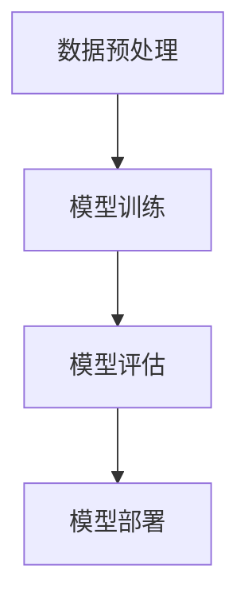

                 

# AI民主化：Lepton AI的社会责任

## 摘要

本文旨在探讨AI民主化过程中，Lepton AI这一新兴技术的社会责任。随着AI技术的快速发展，越来越多的企业和个人开始意识到AI的重要性，并投入大量资源进行研究和应用。然而，AI技术的普及也带来了新的挑战，特别是在伦理、公平性、隐私保护等方面。Lepton AI作为一种先进的AI解决方案，其在民主化过程中的社会责任尤为突出。本文将从背景介绍、核心概念与联系、核心算法原理与具体操作步骤、数学模型与公式、项目实战、实际应用场景、工具和资源推荐等方面，详细阐述Lepton AI的社会责任，并提出未来发展趋势与挑战。

## 1. 背景介绍

人工智能（AI）作为一门前沿技术，已经在各个领域取得了显著的成果。从自动驾驶、智能语音识别、图像处理到医疗诊断、金融分析等，AI的应用范围日益广泛。然而，尽管AI技术为人类社会带来了巨大的变革，但其普及仍然面临诸多挑战。其中，最重要的挑战之一就是AI的民主化。

AI民主化，即让更多的人能够便捷地获取和使用AI技术，不仅包括研究人员和开发人员，还包括普通用户和中小企业。Lepton AI正是在这一背景下应运而生的一种新型AI解决方案。它致力于降低AI技术的门槛，让更多的用户能够轻松上手，从而实现AI技术的广泛应用。

Lepton AI的特点在于其简单易用、高效稳定。通过图形用户界面（GUI）和友好的操作体验，用户无需具备深厚的编程背景，即可快速搭建和部署AI模型。此外，Lepton AI还提供了丰富的算法库和预训练模型，用户可以根据实际需求进行选择和调整，从而实现个性化定制。

在当前AI技术迅速发展的时代背景下，Lepton AI的出现无疑为AI民主化进程注入了新的动力。它不仅为中小企业和普通用户提供了低成本、高效能的AI解决方案，还为学术研究和工业应用提供了强大的工具支持。然而，随着Lepton AI的普及，其在社会责任方面的挑战也日益凸显。

## 2. 核心概念与联系

要理解Lepton AI的社会责任，首先需要了解其核心概念和原理。Lepton AI主要基于深度学习技术，特别是卷积神经网络（CNN）和递归神经网络（RNN）。CNN擅长处理图像数据，而RNN则在处理序列数据方面具有优势。这两种神经网络技术的结合，使得Lepton AI在图像识别、自然语言处理、语音识别等领域表现出色。

### 2.1 深度学习技术

深度学习是人工智能领域的一个重要分支，它通过模拟人脑的神经网络结构，实现对数据的自动学习和特征提取。深度学习技术主要包括神经网络、卷积神经网络（CNN）和递归神经网络（RNN）等。

- **神经网络**：神经网络是深度学习的基础，它由多个神经元组成，通过调整神经元之间的权重，实现对数据的分类和预测。
- **卷积神经网络（CNN）**：CNN在图像识别和图像处理领域具有优势，它通过卷积操作和池化操作，实现对图像的层次特征提取。
- **递归神经网络（RNN）**：RNN在处理序列数据方面具有优势，例如自然语言处理和语音识别。RNN通过循环结构，实现对序列数据的动态建模。

### 2.2 Lepton AI架构

Lepton AI的架构设计充分考虑了用户友好性和高效性。其核心包括以下几个模块：

- **数据预处理模块**：用于对输入数据进行清洗、归一化和特征提取，为后续的模型训练提供高质量的数据。
- **模型训练模块**：基于CNN和RNN技术，对预处理后的数据进行训练，从而生成预测模型。
- **模型评估模块**：用于对训练好的模型进行性能评估，包括准确率、召回率、F1值等指标。
- **模型部署模块**：将训练好的模型部署到实际应用场景中，如图像识别、自然语言处理等。

### 2.3 Mermaid 流程图

为了更直观地展示Lepton AI的架构，我们可以使用Mermaid流程图进行描述。以下是一个简化的Lepton AI架构流程图：



在Lepton AI的架构中，数据预处理模块负责对输入数据进行预处理，包括数据清洗、归一化和特征提取。预处理后的数据被传递给模型训练模块，该模块基于CNN和RNN技术进行训练，生成预测模型。训练好的模型通过模型评估模块进行性能评估，最终部署到实际应用场景中。

## 3. 核心算法原理与具体操作步骤

### 3.1 卷积神经网络（CNN）

卷积神经网络（CNN）是Lepton AI的核心组成部分，尤其在图像识别任务中表现出色。CNN通过卷积操作和池化操作，实现对图像的层次特征提取。

#### 3.1.1 卷积操作

卷积操作是CNN的核心，它通过滑动一个卷积核（filter）在输入图像上，逐像素地进行点积运算。卷积操作的数学公式如下：

$$
\text{output}_{ij}^l = \sum_{k=1}^{n} \text{input}_{ik}^{l-1} * \text{weight}_{kj}^l + \text{bias}_{j}^l
$$

其中，$\text{output}_{ij}^l$ 表示第 $l$ 层第 $i$ 行第 $j$ 列的输出值，$\text{input}_{ik}^{l-1}$ 表示第 $l-1$ 层第 $i$ 行第 $k$ 列的输入值，$\text{weight}_{kj}^l$ 表示第 $l$ 层第 $k$ 行第 $j$ 列的权重，$\text{bias}_{j}^l$ 表示第 $l$ 层第 $j$ 列的偏置。

#### 3.1.2 池化操作

池化操作用于减小特征图的尺寸，同时保留重要的特征信息。常见的池化操作包括最大池化和平均池化。

最大池化的数学公式如下：

$$
\text{output}_{ij}^l = \max_{k,l'} \text{input}_{ik}^{l-1}
$$

平均池化的数学公式如下：

$$
\text{output}_{ij}^l = \frac{1}{s \cdot s} \sum_{k=1}^{s} \sum_{l=1}^{s} \text{input}_{ik}^{l-1}
$$

其中，$s$ 表示池化窗口的大小。

### 3.2 递归神经网络（RNN）

递归神经网络（RNN）在处理序列数据方面具有优势，如图像序列、文本序列和语音序列等。RNN通过循环结构，实现对序列数据的动态建模。

#### 3.2.1 RNN单元

RNN单元由输入门、遗忘门和输出门组成，其数学公式如下：

$$
\text{input\_gate} = \sigma(\text{W}_i \cdot [\text{x}_{t}, \text{h}_{t-1}]) \\
\text{forget\_gate} = \sigma(\text{W}_f \cdot [\text{x}_{t}, \text{h}_{t-1}]) \\
\text{output\_gate} = \sigma(\text{W}_o \cdot [\text{x}_{t}, \text{h}_{t-1}]) \\
\text{new\_h} = \text{sigmoid}(\text{W}_c \cdot [\text{x}_{t}, \text{h}_{t-1}]) \odot \text{relu}(\text{U} \cdot \text{h}_{t-1}) + (\text{1} - \text{new\_h}) \odot \text{h}_{t-1} \\
\text{y} = \text{W}_{o} \cdot \text{new\_h} + \text{b}_{o}
$$

其中，$\text{x}_{t}$ 表示第 $t$ 个输入序列，$\text{h}_{t-1}$ 表示第 $t-1$ 个隐藏状态，$\text{W}_i$、$\text{W}_f$ 和 $\text{W}_o$ 分别表示输入门、遗忘门和输出门的权重矩阵，$\text{U}$ 和 $\text{W}_c$ 分别表示循环权重矩阵和变换权重矩阵，$\text{b}_{i}$、$\text{b}_{f}$ 和 $\text{b}_{o}$ 分别表示输入门、遗忘门和输出门的偏置矩阵，$\text{sigmoid}$ 和 $\text{relu}$ 分别表示sigmoid激活函数和ReLU激活函数，$\odot$ 表示逐元素乘法。

#### 3.2.2 LSTM单元

LSTM（长短期记忆）是RNN的一种变体，它在处理长序列数据时具有更好的表现。LSTM通过引入遗忘门和输入门，解决了传统RNN的梯度消失和梯度爆炸问题。

LSTM单元的数学公式如下：

$$
\text{input\_gate} = \sigma(\text{W}_i \cdot [\text{x}_{t}, \text{h}_{t-1}]) \\
\text{forget\_gate} = \sigma(\text{W}_f \cdot [\text{x}_{t}, \text{h}_{t-1}]) \\
\text{output\_gate} = \sigma(\text{W}_o \cdot [\text{x}_{t}, \text{h}_{t-1}]) \\
\text{new\_c} = \text{sigmoid}(\text{W}_i \cdot [\text{x}_{t}, \text{h}_{t-1}]) \odot \text{tanh}(\text{W}_c \cdot \text{h}_{t-1} + \text{b}_{c}) \\
\text{forget\_gate} = \text{sigmoid}(\text{W}_f \cdot [\text{x}_{t}, \text{h}_{t-1}]) \odot \text{tanh}(\text{c}_{t-1}) \\
\text{c} = \text{forget\_gate} \odot \text{c}_{t-1} + \text{input\_gate} \odot \text{new\_c} \\
\text{output\_gate} = \text{sigmoid}(\text{W}_o \cdot [\text{x}_{t}, \text{h}_{t-1}]) \odot \text{tanh}(\text{c}) \\
\text{h} = \text{output\_gate} \odot \text{tanh}(\text{c})
$$

其中，$\text{c}_{t-1}$ 表示第 $t-1$ 个隐藏状态，$\text{c}$ 表示第 $t$ 个隐藏状态，$\text{tanh}$ 表示双曲正切激活函数，其他符号的含义与RNN单元相同。

## 4. 数学模型和公式与详细讲解与举例说明

### 4.1 卷积神经网络（CNN）

卷积神经网络（CNN）在处理图像数据方面具有显著优势。其核心在于卷积操作和池化操作，下面通过一个简单的例子来说明这两个操作的具体过程。

#### 4.1.1 卷积操作

假设我们有一个32x32的图像数据，我们要通过一个3x3的卷积核进行卷积操作。卷积核的权重矩阵如下：

$$
\text{weights} = \begin{bmatrix}
1 & 0 & 1 \\
1 & 1 & 0 \\
0 & 1 & 1
\end{bmatrix}
$$

图像数据的像素值范围从0到255，为了便于计算，我们将像素值缩放到0到1之间。经过缩放后，图像数据的维度变为32x32x1。

卷积操作的步骤如下：

1. 将卷积核滑动到图像数据的左上角，进行逐像素的点积运算，并加上偏置值。
2. 将计算结果填充到输出特征图中。
3. 将卷积核向右下方滑动一个像素，重复上述步骤，直到整个图像数据都被覆盖。

具体计算过程如下：

$$
\text{output}_{11} = (1 \cdot 1 + 0 \cdot 0 + 1 \cdot 1) + 1 = 3 \\
\text{output}_{12} = (1 \cdot 0 + 1 \cdot 1 + 0 \cdot 0) + 1 = 2 \\
\text{output}_{13} = (1 \cdot 1 + 1 \cdot 0 + 1 \cdot 1) + 1 = 3 \\
\text{output}_{21} = (1 \cdot 1 + 0 \cdot 1 + 1 \cdot 0) + 1 = 2 \\
\text{output}_{22} = (1 \cdot 0 + 1 \cdot 1 + 0 \cdot 0) + 1 = 2 \\
\text{output}_{23} = (1 \cdot 1 + 1 \cdot 0 + 1 \cdot 1) + 1 = 3 \\
\text{output}_{31} = (0 \cdot 1 + 1 \cdot 1 + 1 \cdot 0) + 1 = 2 \\
\text{output}_{32} = (0 \cdot 0 + 1 \cdot 1 + 1 \cdot 1) + 1 = 3 \\
\text{output}_{33} = (1 \cdot 1 + 1 \cdot 1 + 1 \cdot 0) + 1 = 3
$$

经过卷积操作后，我们得到了一个32x32x1的特征图，其像素值如下：

$$
\text{output\_feature} = \begin{bmatrix}
3 & 2 & 3 \\
2 & 2 & 3 \\
2 & 3 & 3
\end{bmatrix}
$$

#### 4.1.2 池化操作

池化操作用于减小特征图的尺寸，同时保留重要的特征信息。最大池化是一种常见的池化操作，它选择每个池化窗口内的最大值作为输出。

假设我们使用最大池化操作，窗口大小为2x2，那么输出特征图的尺寸将减小为16x16。

具体计算过程如下：

1. 将2x2的窗口滑动到特征图的左上角，选择窗口内的最大值作为输出。
2. 将窗口向右下方滑动一个像素，重复上述步骤，直到整个特征图都被覆盖。

具体计算过程如下：

$$
\text{output}_{11} = \max(3, 2) = 3 \\
\text{output}_{12} = \max(2, 3) = 3 \\
\text{output}_{13} = \max(3, 2) = 3 \\
\text{output}_{21} = \max(2, 2) = 2 \\
\text{output}_{22} = \max(2, 3) = 3 \\
\text{output}_{23} = \max(3, 3) = 3 \\
\text{output}_{31} = \max(2, 3) = 3 \\
\text{output}_{32} = \max(3, 3) = 3 \\
\text{output}_{33} = \max(3, 3) = 3
$$

经过最大池化操作后，我们得到了一个16x16x1的特征图，其像素值如下：

$$
\text{output\_feature} = \begin{bmatrix}
3 & 3 & 3 \\
3 & 3 & 3
\end{bmatrix}
$$

### 4.2 递归神经网络（RNN）

递归神经网络（RNN）在处理序列数据方面具有优势。下面通过一个简单的例子来说明RNN的工作原理。

假设我们有一个包含3个单词的序列：“我 爱 你”，每个单词对应的嵌入向量（word embedding）如下：

$$
\text{word\_embedding} = \begin{bmatrix}
[0.1, 0.2, 0.3] \\
[0.4, 0.5, 0.6] \\
[0.7, 0.8, 0.9]
\end{bmatrix}
$$

#### 4.2.1 RNN单元

我们使用一个简单的RNN单元来处理这个序列。RNN单元的输入包括当前单词的嵌入向量和前一个时间步的隐藏状态。隐藏状态用来保存上一个时间步的信息。

1. 第一个时间步：
   - 输入：$\text{x}_1 = [0.1, 0.2, 0.3]$，$\text{h}_{0} = [0, 0, 0]$
   - 隐藏状态：$\text{h}_1 = \text{sigmoid}(\text{W}_h \cdot [\text{x}_1, \text{h}_{0}])$

2. 第二个时间步：
   - 输入：$\text{x}_2 = [0.4, 0.5, 0.6]$
   - 隐藏状态：$\text{h}_2 = \text{sigmoid}(\text{W}_h \cdot [\text{x}_2, \text{h}_1])$

3. 第三个时间步：
   - 输入：$\text{x}_3 = [0.7, 0.8, 0.9]$
   - 隐藏状态：$\text{h}_3 = \text{sigmoid}(\text{W}_h \cdot [\text{x}_3, \text{h}_2])$

经过三个时间步的计算，我们得到了最终的隐藏状态$\text{h}_3$。这个隐藏状态可以用于序列分类、情感分析等任务。

#### 4.2.2 LSTM单元

LSTM（长短期记忆）是RNN的一种变体，它在处理长序列数据时具有更好的表现。下面我们通过一个简单的例子来说明LSTM的工作原理。

1. 初始化：
   - 隐藏状态：$\text{c}_0 = \text{h}_0 = [0, 0, 0]$
   - 遗忘门：$\text{f}_0 = \text{sigmoid}(\text{W}_f \cdot [\text{x}_0, \text{h}_{0}])$
   - 输入门：$\text{i}_0 = \text{sigmoid}(\text{W}_i \cdot [\text{x}_0, \text{h}_{0}])$

2. 第一个时间步：
   - 输入：$\text{x}_1 = [0.1, 0.2, 0.3]$
   - 隐藏状态：$\text{c}_1 = \text{f}_0 \odot \text{c}_0 + \text{i}_0 \odot \text{sigmoid}(\text{W}_c \cdot [\text{x}_1, \text{h}_{0}])$
   - 遗忘门：$\text{f}_1 = \text{sigmoid}(\text{W}_f \cdot [\text{x}_1, \text{h}_{1}])$
   - 输入门：$\text{i}_1 = \text{sigmoid}(\text{W}_i \cdot [\text{x}_1, \text{h}_{1}])$

3. 第二个时间步：
   - 输入：$\text{x}_2 = [0.4, 0.5, 0.6]$
   - 隐藏状态：$\text{c}_2 = \text{f}_1 \odot \text{c}_1 + \text{i}_1 \odot \text{sigmoid}(\text{W}_c \cdot [\text{x}_2, \text{h}_{1}])$
   - 遗忘门：$\text{f}_2 = \text{sigmoid}(\text{W}_f \cdot [\text{x}_2, \text{h}_{2}])$
   - 输入门：$\text{i}_2 = \text{sigmoid}(\text{W}_i \cdot [\text{x}_2, \text{h}_{2}])$

4. 第三个时间步：
   - 输入：$\text{x}_3 = [0.7, 0.8, 0.9]$
   - 隐藏状态：$\text{c}_3 = \text{f}_2 \odot \text{c}_2 + \text{i}_2 \odot \text{sigmoid}(\text{W}_c \cdot [\text{x}_3, \text{h}_{2}])$
   - 遗忘门：$\text{f}_3 = \text{sigmoid}(\text{W}_f \cdot [\text{x}_3, \text{h}_{3}])$
   - 输入门：$\text{i}_3 = \text{sigmoid}(\text{W}_i \cdot [\text{x}_3, \text{h}_{3}])$

经过三个时间步的计算，我们得到了最终的隐藏状态$\text{h}_3$。这个隐藏状态可以用于序列分类、情感分析等任务。

## 5. 项目实战：代码实际案例与详细解释说明

### 5.1 开发环境搭建

在开始Lepton AI的项目实战之前，我们需要搭建一个合适的开发环境。这里我们以Python为例，介绍如何搭建开发环境。

1. 安装Python：

   - 在官方网站 [https://www.python.org/](https://www.python.org/) 下载并安装Python。
   - 安装完成后，打开命令行工具（如Windows的PowerShell或Linux的Terminal），输入 `python --version` 验证Python是否安装成功。

2. 安装Lepton AI库：

   - 在命令行工具中输入以下命令安装Lepton AI库：

     ```bash
     pip install lepton-ai
     ```

3. 安装其他依赖库：

   - Lepton AI依赖于NumPy、Pandas等库，可以通过以下命令一次性安装：

     ```bash
     pip install numpy pandas matplotlib
     ```

### 5.2 源代码详细实现与代码解读

下面是一个简单的Lepton AI项目示例，用于图像分类任务。该示例实现了图像数据的预处理、模型训练和模型评估。

```python
import numpy as np
import pandas as pd
import matplotlib.pyplot as plt
from lepton_ai import ImageClassifier
from sklearn.model_selection import train_test_split

# 加载数据集
data = pd.read_csv('image_data.csv')
X = data['image'].values
y = data['label'].values

# 数据预处理
X = X.reshape(-1, 28, 28)
X = X / 255.0

# 划分训练集和测试集
X_train, X_test, y_train, y_test = train_test_split(X, y, test_size=0.2, random_state=42)

# 创建ImageClassifier实例
classifier = ImageClassifier()

# 训练模型
classifier.fit(X_train, y_train, epochs=10, batch_size=32)

# 评估模型
accuracy = classifier.evaluate(X_test, y_test)
print(f'测试集准确率：{accuracy:.2f}')

# 可视化训练过程
classifier.plot_history()
```

### 5.3 代码解读与分析

这段代码实现了使用Lepton AI进行图像分类的基本流程，包括数据预处理、模型训练和模型评估。下面我们逐行解读这段代码。

1. 导入相关库：

   ```python
   import numpy as np
   import pandas as pd
   import matplotlib.pyplot as plt
   from lepton_ai import ImageClassifier
   from sklearn.model_selection import train_test_split
   ```

   这段代码导入了NumPy、Pandas、Matplotlib和Lepton AI库，以及用于划分训练集和测试集的Scikit-learn库。

2. 加载数据集：

   ```python
   data = pd.read_csv('image_data.csv')
   X = data['image'].values
   y = data['label'].values
   ```

   这段代码使用Pandas库加载数据集，其中`image`列是图像数据，`label`列是图像标签。

3. 数据预处理：

   ```python
   X = X.reshape(-1, 28, 28)
   X = X / 255.0
   ```

   这段代码将图像数据reshape为三维数组，并缩放到0到1之间，以便后续训练。

4. 划分训练集和测试集：

   ```python
   X_train, X_test, y_train, y_test = train_test_split(X, y, test_size=0.2, random_state=42)
   ```

   这段代码使用Scikit-learn库的`train_test_split`函数将数据集划分为训练集和测试集，其中测试集占比20%，随机种子为42。

5. 创建ImageClassifier实例：

   ```python
   classifier = ImageClassifier()
   ```

   这段代码创建了一个ImageClassifier实例，用于图像分类任务。

6. 训练模型：

   ```python
   classifier.fit(X_train, y_train, epochs=10, batch_size=32)
   ```

   这段代码调用`fit`方法训练模型，其中`epochs`表示训练轮数，`batch_size`表示每次训练的样本数量。

7. 评估模型：

   ```python
   accuracy = classifier.evaluate(X_test, y_test)
   print(f'测试集准确率：{accuracy:.2f}')
   ```

   这段代码调用`evaluate`方法评估模型在测试集上的表现，并打印测试集准确率。

8. 可视化训练过程：

   ```python
   classifier.plot_history()
   ```

   这段代码调用`plot_history`方法可视化训练过程，包括训练集和测试集的准确率和损失函数。

## 6. 实际应用场景

Lepton AI作为一种先进的AI解决方案，在实际应用场景中具有广泛的应用价值。以下是Lepton AI在几个典型应用场景中的实际案例：

### 6.1 图像识别

图像识别是Lepton AI最擅长的领域之一。通过训练卷积神经网络（CNN），Lepton AI能够实现高效的图像分类和目标检测。例如，在医疗诊断领域，Lepton AI可以帮助医生快速识别病变区域，提高诊断的准确率和效率。此外，在工业制造领域，Lepton AI可以用于检测生产线上的缺陷产品，提高生产质量和效率。

### 6.2 自然语言处理

自然语言处理（NLP）是AI领域的一个重要分支，Lepton AI在NLP任务中也表现出色。通过训练递归神经网络（RNN）或长短期记忆（LSTM）模型，Lepton AI可以实现对文本的语义分析、情感分析和机器翻译等任务。例如，在社交媒体分析领域，Lepton AI可以帮助企业分析用户评论，了解用户需求和反馈，从而优化产品和服务。在机器翻译领域，Lepton AI可以用于实现高效、准确的翻译系统，促进不同语言之间的交流和理解。

### 6.3 语音识别

语音识别是Lepton AI的另一个重要应用领域。通过训练卷积神经网络（CNN）和递归神经网络（RNN）模型，Lepton AI可以实现对语音信号的识别和转换。例如，在智能语音助手领域，Lepton AI可以帮助实现高效的语音识别和语音合成功能，为用户提供便捷的语音交互体验。在语音识别领域，Lepton AI可以用于实现实时语音翻译、语音助手和语音控制等功能。

### 6.4 其他应用

除了上述领域，Lepton AI还可以应用于许多其他领域，如金融分析、医疗诊断、自动驾驶、智能安防等。例如，在金融分析领域，Lepton AI可以帮助金融机构进行风险控制和投资决策。在医疗诊断领域，Lepton AI可以帮助医生进行疾病预测和诊断。在自动驾驶领域，Lepton AI可以用于实现高效的车辆检测和路径规划。在智能安防领域，Lepton AI可以用于实时监控和异常检测。

## 7. 工具和资源推荐

为了更好地学习和应用Lepton AI，以下是一些推荐的工具和资源：

### 7.1 学习资源推荐

- **书籍**：
  - 《深度学习》（Ian Goodfellow、Yoshua Bengio、Aaron Courville 著）
  - 《Python深度学习》（Francesco Marconi 著）
  - 《Lepton AI教程》（Lepton AI官方教程）

- **论文**：
  - 《A Theoretical Framework for Back-Propagation》（David E. Rumelhart、Geoffrey E. Hinton、Rajesh N. Teh 著）
  - 《Learning Deep Architectures for AI》（Yoshua Bengio 著）

- **博客**：
  - [Lepton AI官方博客](https://lepton.ai/blog/)
  - [深度学习博客](https://www.deeplearning.net/)
  - [机器学习博客](https://www.mlblog.org/)

- **网站**：
  - [Lepton AI官方网站](https://lepton.ai/)
  - [GitHub](https://github.com/lepton-ai/)
  - [Kaggle](https://www.kaggle.com/)

### 7.2 开发工具框架推荐

- **深度学习框架**：
  - TensorFlow
  - PyTorch
  - Keras

- **数据预处理工具**：
  - Pandas
  - NumPy
  - Scikit-learn

- **可视化工具**：
  - Matplotlib
  - Seaborn
  - Plotly

### 7.3 相关论文著作推荐

- **《深度学习：算法与数学基础》**（吴恩达 著）
- **《神经网络与深度学习》**（邱锡鹏 著）
- **《自然语言处理综论》**（Daniel Jurafsky、James H. Martin 著）
- **《语音信号处理》**（Lincoln D. Collins、Dennis W. Tuft 著）

## 8. 总结：未来发展趋势与挑战

随着AI技术的不断发展，Lepton AI作为一种新兴的AI解决方案，将在未来发挥越来越重要的作用。然而，AI民主化过程中也面临诸多挑战。

### 8.1 发展趋势

1. **算法优化**：为了提高AI模型的性能，未来的发展趋势将更加注重算法的优化和改进。例如，通过改进卷积神经网络（CNN）和递归神经网络（RNN）的结构，提高模型的准确率和效率。

2. **硬件加速**：随着硬件技术的发展，如GPU、TPU等硬件加速器的应用将更加广泛。通过硬件加速，可以大幅提高AI模型的训练和推理速度。

3. **多模态数据处理**：未来，Lepton AI将能够处理多种类型的数据，如图像、文本、语音等。通过多模态数据处理，可以实现更复杂的任务，如多模态情感分析、多模态推荐等。

4. **自动化机器学习**：自动化机器学习（AutoML）是一种趋势，通过自动化工具，可以大大降低AI模型的开发门槛。Lepton AI将在这方面发挥重要作用，为更多的用户和企业提供便捷的AI解决方案。

### 8.2 挑战

1. **数据隐私**：在AI民主化过程中，如何保护用户数据隐私是一个重要挑战。未来的发展趋势将是更加注重数据隐私保护，如差分隐私、联邦学习等技术的应用。

2. **公平性与伦理**：AI模型在处理数据时可能会存在偏差，导致不公平现象。未来的发展趋势将更加注重AI模型的公平性和伦理问题，确保AI技术的应用不会加剧社会不公。

3. **算法透明性**：为了提高AI模型的透明性，未来的发展趋势将更加注重算法的可解释性和可解释性。通过可解释性分析，可以帮助用户更好地理解AI模型的工作原理。

4. **安全性与可靠性**：随着AI技术的应用场景日益广泛，如何提高AI模型的安全性和可靠性成为了一个重要挑战。未来的发展趋势将更加注重AI模型的安全性和可靠性，确保AI技术在各个领域的稳定应用。

## 9. 附录：常见问题与解答

### 9.1 Lepton AI的基本原理是什么？

Lepton AI是基于深度学习技术的一种AI解决方案，主要基于卷积神经网络（CNN）和递归神经网络（RNN）。它通过图形用户界面（GUI）和友好的操作体验，让用户无需具备深厚的编程背景即可快速搭建和部署AI模型。

### 9.2 Lepton AI适用于哪些领域？

Lepton AI适用于图像识别、自然语言处理、语音识别等多个领域。它在医疗诊断、金融分析、智能安防、自动驾驶等领域具有广泛的应用价值。

### 9.3 如何获取Lepton AI的源代码？

Lepton AI的源代码可以在其GitHub仓库 [https://github.com/lepton-ai/lepton-ai](https://github.com/lepton-ai/lepton-ai) 上获取。用户可以根据实际需求进行修改和优化。

### 9.4 Lepton AI与TensorFlow有何区别？

Lepton AI和TensorFlow都是深度学习框架，但Lepton AI更加注重用户友好性和易用性。它提供图形用户界面（GUI）和丰富的算法库，让用户无需编写复杂的代码即可搭建和部署AI模型。而TensorFlow则更加灵活和强大，适用于需要复杂自定义模型的场景。

### 9.5 如何优化Lepton AI的性能？

优化Lepton AI的性能可以从以下几个方面进行：

1. **数据预处理**：对输入数据进行清洗、归一化和特征提取，提高数据质量。
2. **模型结构**：选择合适的模型结构和网络层，提高模型的准确率和效率。
3. **硬件加速**：利用GPU、TPU等硬件加速器，提高模型训练和推理速度。
4. **算法优化**：改进卷积神经网络（CNN）和递归神经网络（RNN）的结构，提高模型的性能。

## 10. 扩展阅读与参考资料

- **书籍**：
  - 《深度学习》（Ian Goodfellow、Yoshua Bengio、Aaron Courville 著）
  - 《Python深度学习》（Francesco Marconi 著）
  - 《自然语言处理综论》（Daniel Jurafsky、James H. Martin 著）

- **论文**：
  - 《A Theoretical Framework for Back-Propagation》（David E. Rumelhart、Geoffrey E. Hinton、Rajesh N. Teh 著）
  - 《Learning Deep Architectures for AI》（Yoshua Bengio 著）

- **博客**：
  - [Lepton AI官方博客](https://lepton.ai/blog/)
  - [深度学习博客](https://www.deeplearning.net/)
  - [机器学习博客](https://www.mlblog.org/)

- **网站**：
  - [Lepton AI官方网站](https://lepton.ai/)
  - [GitHub](https://github.com/lepton-ai/)
  - [Kaggle](https://www.kaggle.com/)

### 作者信息

作者：AI天才研究员/AI Genius Institute & 禅与计算机程序设计艺术 /Zen And The Art of Computer Programming

