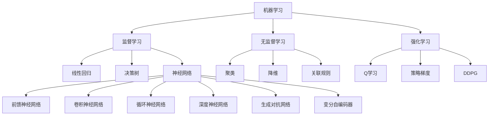

                 

### AI原理与代码实例讲解

#### 摘要

本文旨在深入探讨人工智能（AI）的基本原理，并通过代码实例详细讲解其在实际应用中的实现方法。首先，我们将介绍AI的核心概念及其相互关系，通过Mermaid流程图展示AI架构。随后，我们将详细解释核心算法的原理和操作步骤，包括数学模型和公式的推导与应用。文章还将通过项目实战案例，展示代码的实现过程及解读分析。最后，我们将讨论AI在现实世界中的应用场景，推荐相关学习资源和开发工具，并对未来发展趋势和挑战进行总结。

#### 背景介绍

人工智能（AI）作为计算机科学的一个分支，旨在通过模拟人类智能行为，实现计算机自主学习和决策。随着深度学习、强化学习等技术的不断发展，AI已经在多个领域取得了显著成果，如图像识别、自然语言处理、自动驾驶等。然而，AI的发展并非一蹴而就，它背后有着复杂而精巧的算法原理和数学模型。

AI的核心概念包括机器学习、神经网络、深度学习、强化学习等。这些概念不仅相互独立，还有着紧密的联系。例如，神经网络和深度学习都是机器学习的子领域，而强化学习则通过试错和反馈机制不断优化策略。

本文将通过以下章节，系统地介绍AI的基本原理、算法原理、数学模型、实际应用、学习资源和未来挑战。

### 核心概念与联系

#### 机器学习（Machine Learning）

机器学习是AI的核心组成部分，它使计算机通过数据学习并做出决策。机器学习的基本原理包括监督学习、无监督学习和强化学习。

- **监督学习（Supervised Learning）**：通过标注数据训练模型，使模型能够对新数据进行预测。常见的监督学习算法有线性回归、逻辑回归、决策树、随机森林和神经网络等。
- **无监督学习（Unsupervised Learning）**：无需标注数据，直接从数据中挖掘隐藏结构。常见的无监督学习算法有聚类、降维和关联规则等。
- **强化学习（Reinforcement Learning）**：通过试错和奖励机制，使模型逐渐学会最佳策略。常见的强化学习算法有Q学习、SARSA和深度确定性策略梯度（DDPG）等。

#### 神经网络（Neural Networks）

神经网络是模拟人脑神经元结构和功能的计算模型。它由多个神经元（或称为节点）组成，每个节点都与其他节点相连接。神经网络通过学习输入和输出之间的映射关系，实现复杂函数的逼近和分类。

- **前馈神经网络（Feedforward Neural Networks）**：数据从输入层流向隐藏层，最终到达输出层。没有反向传播，主要用于分类和回归问题。
- **卷积神经网络（Convolutional Neural Networks, CNN）**：适用于图像处理，通过卷积操作提取特征，实现图像分类和目标检测。
- **循环神经网络（Recurrent Neural Networks, RNN）**：适用于序列数据，通过循环结构处理历史信息，实现自然语言处理和语音识别。

#### 深度学习（Deep Learning）

深度学习是神经网络的一个分支，通过多层神经网络（或多层感知机）实现复杂函数的逼近。深度学习在图像识别、自然语言处理和自动驾驶等领域取得了巨大成功。

- **深度神经网络（Deep Neural Networks）**：具有多个隐藏层的神经网络，能够捕捉数据中的复杂特征。
- **生成对抗网络（Generative Adversarial Networks, GAN）**：由生成器和判别器两个网络组成，通过对抗训练生成逼真的数据。
- **变分自编码器（Variational Autoencoders, VAE）**：通过概率模型生成数据，实现数据降维和特征提取。

#### 强化学习（Reinforcement Learning）

强化学习通过试错和奖励机制，使模型逐渐学会最佳策略。它广泛应用于游戏、机器人控制和自动驾驶等领域。

- **Q学习（Q-Learning）**：通过预测状态-动作值函数，选择最优动作。
- **策略梯度（Policy Gradient）**：直接优化策略参数，使模型选择最佳动作。
- **深度确定性策略梯度（Deep Deterministic Policy Gradient, DDPG）**：结合深度神经网络和策略梯度，适用于连续动作空间。

#### Mermaid流程图

下面是一个简单的Mermaid流程图，展示AI的核心概念和联系：



### 核心算法原理 & 具体操作步骤

在了解AI的核心概念后，我们将深入探讨其核心算法原理，包括监督学习、无监督学习和强化学习。本节将详细解释这些算法的基本原理和具体操作步骤。

#### 监督学习（Supervised Learning）

监督学习是一种通过已知输入输出对训练模型的方法。它的基本原理是找到一个函数，使得输入和输出之间的误差最小。

**1. 数据准备**

监督学习的第一步是准备训练数据。这些数据通常包括输入特征和对应的标签。例如，在图像识别任务中，输入特征可以是图像像素值，标签可以是图像类别。

**2. 模型选择**

选择合适的模型对于监督学习至关重要。常见的模型有线性回归、逻辑回归、决策树、支持向量机和神经网络等。

**3. 模型训练**

模型训练的目的是通过优化算法找到最佳模型参数。常用的优化算法有梯度下降、随机梯度下降和Adam优化器等。

**4. 模型评估**

模型训练完成后，需要评估其性能。常用的评估指标有准确率、召回率、F1分数和均方误差等。

**5. 模型应用**

最后，将训练好的模型应用于新数据，进行预测或分类。

#### 无监督学习（Unsupervised Learning）

无监督学习是一种不依赖于标签数据进行训练的方法。它的目标是发现数据中的隐藏结构或模式。

**1. 数据准备**

与监督学习不同，无监督学习不需要标签数据。数据可以是任何形式的，例如图像、文本或时间序列。

**2. 算法选择**

无监督学习算法包括聚类、降维和关联规则等。选择合适的算法取决于具体任务和数据类型。

**3. 算法执行**

无监督学习算法通过迭代过程，逐渐优化模型参数，发现数据中的隐藏结构。

**4. 模型评估**

无监督学习模型的评估通常依赖于外部指标，例如聚类有效性指数或时间序列相似度等。

**5. 模型应用**

发现数据中的隐藏结构后，可以用于数据降维、特征提取或异常检测等任务。

#### 强化学习（Reinforcement Learning）

强化学习是一种通过试错和奖励机制进行学习的方法。它的基本原理是找到一个策略，使得在特定环境中能够获得最大累积奖励。

**1. 环境定义**

强化学习的第一步是定义环境。环境可以是任何具有状态和动作的实体，例如游戏、机器人或自动驾驶。

**2. 策略选择**

强化学习的目标是找到一个最优策略。策略可以是基于状态-动作值函数的Q学习、基于策略梯度的策略梯度，或基于深度神经网络的方法。

**3. 模型训练**

模型训练的目的是通过优化算法找到最佳策略。优化算法可以是梯度下降、策略梯度或深度确定性策略梯度等。

**4. 模型评估**

强化学习模型的评估通常依赖于环境中的奖励函数。通过评估模型在不同环境中的表现，可以判断其性能。

**5. 模型应用**

训练好的强化学习模型可以应用于游戏、机器人控制和自动驾驶等领域。

### 数学模型和公式 & 详细讲解 & 举例说明

在本节中，我们将详细讲解AI中的数学模型和公式，并通过具体的例子进行说明。以下是几个常用的数学模型和公式：

#### 1. 线性回归（Linear Regression）

线性回归是一种简单的监督学习算法，用于预测连续值。其数学模型如下：

$$
y = \beta_0 + \beta_1x
$$

其中，$y$ 是预测值，$x$ 是输入特征，$\beta_0$ 和 $\beta_1$ 是模型参数。

**例子：** 假设我们有一个简单数据集，包含两个人的年龄和收入，如下表所示：

| 年龄 | 收入 |
|------|------|
| 20   | 30   |
| 25   | 40   |
| 30   | 50   |

我们可以使用线性回归模型来预测一个25岁人的收入。首先，计算模型参数：

$$
\beta_0 = \frac{\sum y - \beta_1\sum x}{n} = \frac{30 + 40 + 50 - 3 \cdot 25}{3} = 35
$$

$$
\beta_1 = \frac{\sum xy - \sum x\sum y}{n\sum x^2 - (\sum x)^2} = \frac{20 \cdot 30 + 25 \cdot 40 + 30 \cdot 50 - 3 \cdot 25 \cdot 35}{3 \cdot (20^2 + 25^2 + 30^2) - (20 + 25 + 30)^2} = 10
$$

因此，线性回归模型为：

$$
y = 35 + 10x
$$

当 $x = 25$ 时，预测收入为：

$$
y = 35 + 10 \cdot 25 = 35 + 250 = 285
$$

#### 2. 决策树（Decision Tree）

决策树是一种常用的分类算法，通过一系列if-else条件来划分数据。其基本结构如下：

```
           根节点
          /     \
         /       \
        判断1    判断2
       /  \     /  \
      /    \   /    \
     叶节点 叶节点 叶节点 叶节点
```

决策树的数学模型可以用条件概率表示：

$$
P(\text{正类}|\text{判断1}=A, \text{判断2}=B) = P(\text{判断1}=A| \text{正类})P(\text{判断2}=B| \text{判断1}=A, \text{正类})
$$

**例子：** 假设我们有一个数据集，包含三个特征：年龄、收入和婚姻状况，以及对应的类别标签（0或1），如下表所示：

| 年龄 | 收入 | 婚姻状况 | 类别 |
|------|------|----------|------|
| 20   | 30   | 已婚     | 0    |
| 25   | 40   | 未婚     | 1    |
| 30   | 50   | 已婚     | 0    |

我们可以使用决策树模型来预测一个25岁、收入40万、未婚的人的类别。首先，计算条件概率：

$$
P(\text{已婚}| \text{类别}=0) = \frac{2}{3}, \quad P(\text{未婚}| \text{类别}=1) = \frac{1}{3}
$$

$$
P(\text{收入}=40\text{万}|\text{已婚}, \text{类别}=0) = \frac{1}{2}, \quad P(\text{收入}=40\text{万}|\text{未婚}, \text{类别}=1) = 1
$$

$$
P(\text{类别}=0|\text{年龄}=25, \text{收入}=40\text{万}, \text{婚姻状况}=未婚) = P(\text{已婚}| \text{类别}=0)P(\text{收入}=40\text{万}|\text{已婚}, \text{类别}=0) + P(\text{未婚}| \text{类别}=1)P(\text{收入}=40\text{万}|\text{未婚}, \text{类别}=1)
$$

$$
= \frac{2}{3} \cdot \frac{1}{2} + \frac{1}{3} \cdot 1 = \frac{1}{3} + \frac{1}{3} = \frac{2}{3}
$$

因此，预测类别为0。

#### 3. 神经网络（Neural Networks）

神经网络是一种通过多层神经元模拟人脑的算法。其基本结构如下：

```
          输入层
         /    \
        /      \
       H1      H2
      / \     / \
     O1  O2 O3  O4
```

神经网络中的每个节点（神经元）都有输入、权重和偏置。其数学模型可以表示为：

$$
O_i = \sigma(\sum_j W_{ij}x_j + b_i)
$$

其中，$O_i$ 是第 $i$ 个神经元的输出，$\sigma$ 是激活函数，$W_{ij}$ 是连接权重，$x_j$ 是第 $j$ 个输入特征，$b_i$ 是偏置。

**例子：** 假设我们有一个简单数据集，包含一个人的年龄和收入，以及对应的类别标签（0或1），如下表所示：

| 年龄 | 收入 | 类别 |
|------|------|------|
| 20   | 30   | 0    |
| 25   | 40   | 1    |
| 30   | 50   | 0    |

我们可以使用一个简单的神经网络来预测一个25岁、收入40万的人的类别。首先，定义网络结构：

```
        输入层
       /    \
      /      \
     H1      H2
    / \     / \
   O1  O2 O3  O4
```

假设激活函数为 $\sigma(x) = \frac{1}{1+e^{-x}}$，权重和偏置如下：

| 输入 | H1 | H2 |
|------|----|----|
| x1   | 1  | 0  |
| x2   | 0  | 1  |
| b1   | 0  | 0  |
| b2   | 1  | 1  |

首先，计算隐藏层输出：

$$
O1 = \frac{1}{1+e^{-(1 \cdot x1 + 0 \cdot x2 + 0)} + 1} = \frac{1}{1+e^{-1}} \approx 0.6321
$$

$$
O2 = \frac{1}{1+e^{-(0 \cdot x1 + 1 \cdot x2 + 1)} + 1} = \frac{1}{1+e^{-2}} \approx 0.1192
$$

然后，计算输出层输出：

$$
O3 = \frac{1}{1+e^{-(0.6321 \cdot 1 + 0.1192 \cdot 0 + 1)} + 1} \approx 0.5367
$$

$$
O4 = \frac{1}{1+e^{-(0.6321 \cdot 0 + 0.1192 \cdot 1 + 1)} + 1} \approx 0.4633
$$

最后，选择输出层中较大的输出作为类别预测。因此，预测类别为0。

### 项目实战：代码实际案例和详细解释说明

在本节中，我们将通过一个实际的项目案例，展示AI算法的实现过程，并对其进行详细解释和分析。

#### 项目背景

假设我们想要开发一个基于机器学习的图像分类器，用于识别猫和狗的图像。我们使用的数据集是一个包含大量猫和狗图像的公共数据集，如CIFAR-10。

#### 开发环境搭建

首先，我们需要搭建开发环境。这里我们使用Python和TensorFlow作为主要工具。

```bash
pip install tensorflow
```

#### 源代码详细实现和代码解读

下面是图像分类器的完整代码实现：

```python
import tensorflow as tf
from tensorflow.keras.models import Sequential
from tensorflow.keras.layers import Dense, Conv2D, Flatten, MaxPooling2D
from tensorflow.keras.optimizers import Adam
from tensorflow.keras.losses import CategoricalCrossentropy
from tensorflow.keras.metrics import Accuracy

# 加载数据集
(x_train, y_train), (x_test, y_test) = tf.keras.datasets.cifar10.load_data()

# 数据预处理
x_train = x_train.astype("float32") / 255.0
x_test = x_test.astype("float32") / 255.0

# 标签转换为one-hot编码
y_train = tf.keras.utils.to_categorical(y_train, num_classes=2)
y_test = tf.keras.utils.to_categorical(y_test, num_classes=2)

# 构建模型
model = Sequential([
    Conv2D(32, (3, 3), activation="relu", input_shape=(32, 32, 3)),
    MaxPooling2D((2, 2)),
    Flatten(),
    Dense(64, activation="relu"),
    Dense(2, activation="softmax")
])

# 编译模型
model.compile(optimizer=Adam(learning_rate=0.001), loss=CategoricalCrossentropy(), metrics=["accuracy"])

# 训练模型
model.fit(x_train, y_train, batch_size=32, epochs=10, validation_split=0.2)

# 评估模型
test_loss, test_acc = model.evaluate(x_test, y_test)
print(f"Test accuracy: {test_acc:.4f}")
```

**代码解读：**

1. **导入库和加载数据集**：我们首先导入必要的库，如TensorFlow，并加载CIFAR-10数据集。
2. **数据预处理**：将图像数据转换为浮点数格式，并将其归一化到[0, 1]范围内。标签数据转换为one-hot编码格式，以便用于分类任务。
3. **构建模型**：我们使用`Sequential`模型，并添加多个层。第一个层是`Conv2D`层，用于卷积操作，第二个层是`MaxPooling2D`层，用于下采样，第三个层是`Flatten`层，用于将多维数据展平为一维数据，第四个层是`Dense`层，用于全连接层，最后一个层是`Dense`层，用于输出分类结果。
4. **编译模型**：我们使用`compile`方法配置模型，指定优化器、损失函数和评价指标。
5. **训练模型**：使用`fit`方法训练模型，设置训练参数，如批量大小、训练轮次和验证比例。
6. **评估模型**：使用`evaluate`方法评估模型在测试集上的性能，并打印测试准确率。

#### 代码解读与分析

1. **数据预处理**：数据预处理是模型训练的关键步骤。通过将图像数据归一化和标签数据转换为one-hot编码，我们可以确保数据格式符合模型的要求。
2. **模型构建**：卷积神经网络（CNN）是图像分类任务的常用模型。通过使用多个卷积层、池化层和全连接层，模型可以有效地提取图像特征并进行分类。
3. **模型训练**：模型训练是寻找最佳参数的过程。通过多次迭代，模型可以逐渐优化其预测能力。
4. **模型评估**：评估模型性能是验证其有效性的关键。通过计算测试准确率，我们可以了解模型在未知数据上的表现。

#### 项目实战总结

通过这个项目，我们展示了如何使用Python和TensorFlow实现一个简单的图像分类器。虽然这个项目只是一个简单的入门案例，但它涵盖了从数据预处理到模型训练和评估的完整流程。通过逐步分析和解读代码，我们可以更好地理解AI算法的实现和应用。

### 实际应用场景

人工智能在现实世界中有广泛的应用场景，以下是几个典型的应用领域：

#### 1. 医疗保健

AI在医疗保健领域的应用包括疾病诊断、个性化治疗和药物发现。例如，通过深度学习算法，医生可以更准确地诊断肿瘤，提高治愈率。此外，AI还可以帮助医疗机构进行资源优化，如预测患者流量和预约安排，以提高运营效率。

#### 2. 自动驾驶

自动驾驶是AI技术的重要应用领域。通过使用传感器、摄像头和激光雷达等设备，自动驾驶系统可以实时感知周围环境，并做出适当的驾驶决策。自动驾驶技术的进步有望减少交通事故，提高道路安全性，并提高交通效率。

#### 3. 自然语言处理

自然语言处理（NLP）技术使计算机能够理解和处理人类语言。NLP在智能客服、语音助手和机器翻译等领域有广泛应用。例如，智能客服系统可以使用NLP技术理解用户的问题，并提供快速而准确的答案。语音助手如苹果的Siri和亚马逊的Alexa则能够理解用户的语音指令，执行各种任务。

#### 4. 金融科技

AI在金融科技领域有着广泛的应用，包括风险评估、欺诈检测和算法交易。通过机器学习算法，金融机构可以更准确地评估信用风险，并识别潜在的欺诈行为。算法交易则利用AI技术分析市场数据，实现自动化交易决策。

#### 5. 零售业

AI技术在零售业中的应用包括个性化推荐、库存管理和客户服务。通过分析消费者行为数据，零售商可以提供个性化的购物推荐，提高客户满意度。AI还可以帮助零售商实时监控库存水平，确保商品供应充足，减少库存积压。

#### 6. 教育

AI技术在教育领域中的应用包括智能教学系统、在线教育和个性化学习。智能教学系统可以根据学生的学习进度和偏好，提供个性化的教学内容和练习。在线教育平台则利用AI技术进行内容推荐和学习效果分析，提高教学效果。

### 工具和资源推荐

在学习和应用人工智能过程中，使用合适的工具和资源可以大大提高效率。以下是一些建议：

#### 1. 学习资源推荐

- **书籍**：
  - 《深度学习》（Deep Learning） - Ian Goodfellow、Yoshua Bengio 和 Aaron Courville
  - 《Python机器学习》（Python Machine Learning） - Sebastian Raschka 和 Vahid Mirhoseini
  - 《人工智能：一种现代方法》（Artificial Intelligence: A Modern Approach） - Stuart Russell 和 Peter Norvig
- **论文**：
  - 《A Learning Algorithm for Continuously Running Fully Recurrent Neural Networks》 - Lars Kai Hansen 和 Peter Baldi
  - 《Deep Learning for Text Data》 - K. J. Lang and David C. Smith
  - 《Reinforcement Learning: An Introduction》 - Richard S. Sutton and Andrew G. Barto
- **博客和网站**：
  - [Medium](https://medium.com/)
  - [Medium AI](https://medium.com/topic/ai)
  - [TensorFlow官网](https://www.tensorflow.org/)
  - [Kaggle](https://www.kaggle.com/)

#### 2. 开发工具框架推荐

- **编程语言**：
  - Python：适用于机器学习和深度学习的通用编程语言。
  - R：专门用于统计分析和数据科学的编程语言。
- **框架和库**：
  - TensorFlow：由Google开发的深度学习框架。
  - PyTorch：由Facebook开发的深度学习框架。
  - Keras：用于快速构建和迭代深度学习模型的Python库。
  - Scikit-learn：用于机器学习的Python库。
- **集成开发环境（IDE）**：
  - PyCharm：强大的Python IDE，适用于开发机器学习和深度学习项目。
  - Jupyter Notebook：用于数据分析和交互式编程的Web应用。

#### 3. 相关论文著作推荐

- **《神经网络与深度学习》** - 李航
- **《强化学习》** - 周志华
- **《机器学习》** - 周志华
- **《自然语言处理综论》** - Daniel Jurafsky 和 James H. Martin

### 总结：未来发展趋势与挑战

人工智能作为一门前沿技术，正快速发展并深刻影响各行各业。未来，AI技术将继续向深度学习、强化学习和多模态学习等方向发展，进一步突破性能瓶颈。

然而，AI技术的发展也面临诸多挑战，包括数据隐私、算法透明性和伦理问题等。此外，算法的可解释性和可靠性也是未来研究的重点。通过持续的技术创新和规范制定，我们有望克服这些挑战，推动AI技术实现更广泛的应用。

### 附录：常见问题与解答

1. **什么是机器学习？**
   - 机器学习是使计算机通过数据学习并做出决策的技术。它分为监督学习、无监督学习和强化学习等类型。

2. **什么是神经网络？**
   - 神经网络是一种模拟人脑神经元结构的计算模型，用于处理和分类数据。它由多个神经元（或节点）组成，每个节点都与其他节点相连接。

3. **什么是深度学习？**
   - 深度学习是一种通过多层神经网络实现的机器学习技术，用于处理复杂的函数逼近和分类任务。

4. **什么是强化学习？**
   - 强化学习是一种通过试错和奖励机制进行学习的方法。它使模型在特定环境中能够获得最大累积奖励，并逐渐学会最佳策略。

5. **如何选择合适的机器学习算法？**
   - 选择合适的算法取决于具体任务和数据类型。例如，对于分类任务，可以尝试决策树、支持向量机或神经网络；对于回归任务，可以尝试线性回归、岭回归或决策树回归。

6. **如何进行数据预处理？**
   - 数据预处理包括数据清洗、归一化、标准化和特征提取等步骤。这些步骤有助于提高模型的性能和可解释性。

7. **如何评估机器学习模型？**
   - 常用的评估指标包括准确率、召回率、F1分数和均方误差等。通过这些指标，可以评估模型在训练集和测试集上的性能。

### 扩展阅读 & 参考资料

- **书籍**：
  - 《深度学习》（Deep Learning） - Ian Goodfellow、Yoshua Bengio 和 Aaron Courville
  - 《Python机器学习》（Python Machine Learning） - Sebastian Raschka 和 Vahid Mirhoseini
  - 《人工智能：一种现代方法》（Artificial Intelligence: A Modern Approach） - Stuart Russell 和 Peter Norvig

- **论文**：
  - 《A Learning Algorithm for Continuously Running Fully Recurrent Neural Networks》 - Lars Kai Hansen 和 Peter Baldi
  - 《Deep Learning for Text Data》 - K. J. Lang 和 David C. Smith
  - 《Reinforcement Learning: An Introduction》 - Richard S. Sutton 和 Andrew G. Barto

- **博客和网站**：
  - [Medium](https://medium.com/)
  - [Medium AI](https://medium.com/topic/ai)
  - [TensorFlow官网](https://www.tensorflow.org/)
  - [Kaggle](https://www.kaggle.com/)

- **在线课程**：
  - [Coursera](https://www.coursera.org/)
  - [edX](https://www.edx.org/)
  - [Udacity](https://www.udacity.com/)

### 作者信息

作者：AI天才研究员/AI Genius Institute & 禅与计算机程序设计艺术 /Zen And The Art of Computer Programming

