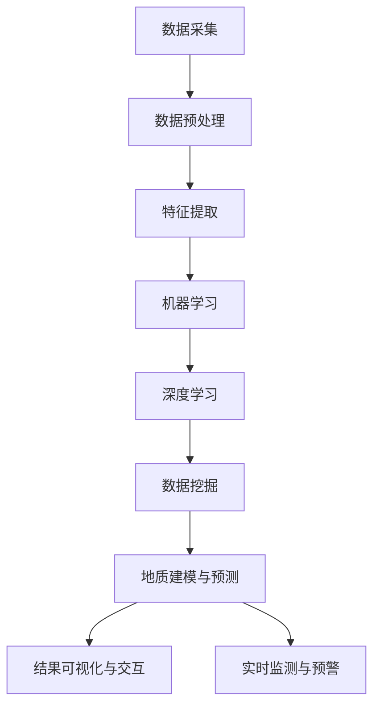

                 

## 文章标题：AI 基础设施的地质勘探：智能化矿产资源勘测平台

### 关键词：人工智能，地质勘探，智能化矿产资源勘测，AI 基础设施，AI 工具，数据挖掘，机器学习，深度学习，地质学，地学分析，自然资源管理。

### 摘要：

本文将探讨如何利用人工智能技术，特别是机器学习和深度学习算法，构建一个智能化矿产资源勘测平台。通过介绍地质勘探的背景和现状，分析人工智能在该领域的应用潜力，以及如何实现一个高效、精准的智能化矿产资源勘测平台，为自然资源管理提供强有力的技术支持。文章将涵盖从核心概念、算法原理到实际应用案例的全面解析，帮助读者深入了解AI基础设施在地质勘探中的重要作用。

<|end_of_suggestion|>## 1. 背景介绍

地质勘探是发现、评估和开发矿产资源的重要手段。长期以来，传统的地质勘探方法依赖于地质学家丰富的经验和大量的野外调查。然而，随着全球矿产资源的日益枯竭和环境保护意识的增强，传统方法在效率、精度和可持续性方面面临着巨大的挑战。近年来，人工智能技术的快速发展为地质勘探带来了新的机遇。

### 1.1 地质勘探的历史和现状

地质勘探的历史可以追溯到几千年前的古代文明，当时人们通过观察地质现象和野外调查来寻找矿产资源。进入工业革命以来，地质勘探逐渐走向专业化，地质学家开始使用更先进的技术和工具，如地质雷达、地震勘探和地球化学测量等。这些技术的应用大大提高了矿产资源的发现效率，但同时也带来了大量的环境破坏和资源浪费。

目前，地质勘探主要依赖于地质学家在野外进行的地质调查、地球物理勘探和地球化学测量等手段。这些方法通常需要大量的时间和人力，而且精度有限。此外，由于地质环境的复杂性和多变性，传统方法在矿产资源的预测和评价方面存在很大的不确定性。

### 1.2 人工智能在地质勘探中的应用

人工智能技术的崛起为地质勘探带来了新的变革。机器学习和深度学习算法可以处理和分析大量的地质数据，从中提取有用的信息，从而提高勘探的精度和效率。具体来说，人工智能在地质勘探中的应用主要包括以下几个方面：

- **数据挖掘与可视化**：通过机器学习算法，可以对地质数据进行挖掘和分析，提取出潜在的地质特征。这些特征可以用于地质建模、成矿预测和资源评估。

- **自动化勘探**：利用机器人技术和无人机，可以实现地质勘探的自动化。这些设备可以自动采集地质数据，减少人工干预，提高勘探效率。

- **预测建模**：通过深度学习算法，可以建立矿产资源预测模型，预测矿床的位置和类型，从而指导实际勘探工作。

- **地质事件监测**：利用人工智能技术，可以实时监测地质事件，如地震、滑坡和岩崩等，为地质灾害预警提供技术支持。

### 1.3 智能化矿产资源勘测平台的构建

构建一个智能化矿产资源勘测平台，需要综合利用人工智能技术、大数据分析和云计算等先进技术。具体步骤如下：

1. **数据采集与预处理**：收集各类地质数据，包括遥感影像、地质图、地球物理数据、地球化学数据和钻探数据等。然后进行数据清洗、去噪和归一化处理，确保数据的质量和一致性。

2. **特征提取与选择**：利用机器学习算法，对地质数据进行特征提取和选择，提取出与矿产资源相关的特征，如地质异常、地球化学异常等。

3. **地质建模与预测**：利用深度学习算法，建立地质建模和预测模型，预测矿床的位置和类型。通过不断训练和优化模型，提高预测精度。

4. **结果可视化与交互**：将勘探结果可视化，展示在地图上，并提供用户交互功能，让地质学家和其他利益相关者能够直观地了解勘探结果。

5. **实时监测与预警**：利用人工智能技术，实时监测地质事件，如地震、滑坡和岩崩等，为地质灾害预警提供技术支持。

通过构建智能化矿产资源勘测平台，可以大幅提高地质勘探的效率、精度和可持续性，为矿产资源的开发提供强有力的技术支持。## 2. 核心概念与联系

### 2.1 地质勘探与人工智能的关系

地质勘探和人工智能之间的关系可以理解为技术手段和数据处理方式的结合。地质勘探依赖于对地质数据的采集、处理和分析，而人工智能则为这些数据的处理提供了强大的计算能力和算法支持。

首先，地质勘探的基本流程包括数据采集、数据预处理、特征提取、建模和预测。每个环节都需要大量的数据处理和分析，而人工智能技术，特别是机器学习和深度学习，能够在这些环节中发挥重要作用。

- **数据采集**：传统地质勘探依赖人力和传统设备，效率较低。而人工智能技术，如无人机、机器人等，可以实现自动化数据采集，提高效率。

- **数据预处理**：地质勘探数据通常包含大量噪声和异常值，人工智能技术可以通过数据清洗、去噪和归一化等预处理步骤，提高数据质量。

- **特征提取**：人工智能算法可以从大量地质数据中提取出有用的特征，如地质异常、地球化学异常等，这些特征对于地质建模和预测至关重要。

- **建模与预测**：机器学习和深度学习算法可以建立复杂的地质模型，预测矿床的位置和类型。这些模型通过大量数据的训练和优化，可以不断提高预测精度。

- **实时监测与预警**：人工智能技术可以实时分析地质数据，监测地质事件，如地震、滑坡和岩崩等，提供预警信息，为地质灾害防治提供支持。

### 2.2 人工智能在地质勘探中的核心概念

在地质勘探中，人工智能的核心概念主要包括机器学习、深度学习和数据挖掘。这些概念相互关联，共同构成了地质勘探智能化的重要基础。

- **机器学习**：机器学习是一种通过数据驱动的方式，让计算机自动学习和改进的技术。在地质勘探中，机器学习算法可以用于数据预处理、特征提取和建模。常见的机器学习算法包括决策树、支持向量机、神经网络等。

- **深度学习**：深度学习是机器学习的一种特殊形式，通过多层神经网络模型，模拟人脑的思考方式。在地质勘探中，深度学习算法可以用于复杂地质特征的提取和建模。常见的深度学习模型包括卷积神经网络（CNN）、循环神经网络（RNN）和生成对抗网络（GAN）等。

- **数据挖掘**：数据挖掘是一种从大量数据中提取有价值信息的技术。在地质勘探中，数据挖掘可以用于发现数据中的潜在模式和规律，如矿床分布模式、地质事件关联等。常见的数据挖掘方法包括关联规则学习、聚类分析和分类分析等。

### 2.3 人工智能与地质勘探架构

为了更好地理解人工智能在地质勘探中的应用，我们可以用 Mermaid 流程图来展示其核心概念和架构。



在这个架构中，数据采集是整个过程的起点，通过数据预处理和特征提取，将原始地质数据转化为可用于机器学习和深度学习分析的形式。机器学习和深度学习算法负责地质特征的提取和建模，数据挖掘则用于发现数据中的潜在模式和规律。最终，地质建模和预测的结果可以通过可视化工具和交互界面展示给用户，同时实时监测和预警功能可以提供地质灾害的预警信息。

通过这个架构，我们可以清晰地看到人工智能在地质勘探中的核心作用，以及各个环节之间的紧密联系。这不仅有助于我们更好地理解人工智能在地质勘探中的应用，也为后续的算法原理和实际应用提供了基础。## 3. 核心算法原理 & 具体操作步骤

### 3.1 机器学习算法原理

机器学习算法是人工智能的基础，它通过数据驱动的方式，让计算机从数据中学习并做出预测或决策。在地质勘探中，机器学习算法可以用于数据预处理、特征提取、建模和预测。以下是几种常见的机器学习算法原理及其在地质勘探中的应用。

#### 3.1.1 决策树

决策树是一种常见的机器学习算法，它通过一系列的判断规则，将数据集划分为不同的类别。在地质勘探中，决策树可以用于分类任务，如矿床类型的识别。

- **算法原理**：决策树通过递归划分数据集，每个节点代表一个特征，每个分支代表一个特征取值。根据特征取值的不同，数据集被划分为不同的子集。这个过程重复进行，直到达到某个停止条件，如达到预设的深度或数据集的纯度。

- **操作步骤**：
  1. 选择一个特征作为节点。
  2. 计算该特征在不同取值下的数据集纯度（如信息增益或基尼系数）。
  3. 选择纯度最高的特征取值作为分裂条件，创建分支。
  4. 对每个子集重复上述步骤。

#### 3.1.2 支持向量机

支持向量机（SVM）是一种分类算法，它通过找到一个最佳的超平面，将不同类别的数据点分隔开。在地质勘探中，SVM可以用于分类任务，如矿床类型的划分。

- **算法原理**：SVM的核心思想是找到一个最优的超平面，使得正负样本之间的距离最大。这个超平面由支持向量决定，即距离超平面最近的样本点。

- **操作步骤**：
  1. 选择一个核函数（如线性核、多项式核或径向基核）。
  2. 计算每个样本点到超平面的距离。
  3. 找到支持向量，即距离超平面最近的样本点。
  4. 根据支持向量确定超平面。

#### 3.1.3 神经网络

神经网络是一种模仿人脑的计算机模型，它通过多层神经元进行数据传递和处理。在地质勘探中，神经网络可以用于回归任务，如矿床品位预测。

- **算法原理**：神经网络由输入层、隐藏层和输出层组成。每个神经元都与前一层的神经元相连，并通过权重和偏置进行加权求和和激活函数处理。

- **操作步骤**：
  1. 初始化权重和偏置。
  2. 对输入数据进行加权求和。
  3. 通过激活函数（如ReLU、Sigmoid或Tanh）处理求和结果。
  4. 重复上述步骤，直到达到预设的层数或损失函数达到预设的阈值。

### 3.2 深度学习算法原理

深度学习是机器学习的一种特殊形式，它通过多层神经网络模型，模拟人脑的思考方式。在地质勘探中，深度学习算法可以用于复杂的特征提取和建模。

#### 3.2.1 卷积神经网络

卷积神经网络（CNN）是一种专门用于处理图像数据的深度学习模型，它通过卷积层、池化层和全连接层进行特征提取和分类。

- **算法原理**：CNN的核心是卷积层，它通过滑动窗口对输入图像进行卷积操作，提取局部特征。池化层用于减少特征图的尺寸，提高模型泛化能力。全连接层将特征图展开为一维数据，进行分类。

- **操作步骤**：
  1. 初始化卷积核和池化核。
  2. 对输入图像进行卷积操作，提取特征。
  3. 通过池化层减小特征图尺寸。
  4. 将特征图展开为一维数据。
  5. 通过全连接层进行分类。

#### 3.2.2 循环神经网络

循环神经网络（RNN）是一种处理序列数据的深度学习模型，它通过隐藏状态和循环连接来处理长距离依赖问题。

- **算法原理**：RNN的核心是隐藏状态，它通过当前输入和前一时刻的隐藏状态计算当前时刻的隐藏状态。这种循环连接使得RNN能够处理序列数据，但同时也导致了梯度消失和梯度爆炸问题。

- **操作步骤**：
  1. 初始化隐藏状态。
  2. 对输入数据进行循环处理，更新隐藏状态。
  3. 通过隐藏状态生成输出序列。

#### 3.2.3 生成对抗网络

生成对抗网络（GAN）是一种由生成器和判别器组成的深度学习模型，它通过对抗训练生成真实数据。

- **算法原理**：GAN的核心是生成器和判别器。生成器试图生成与真实数据相似的数据，而判别器则试图区分真实数据和生成数据。两者通过对抗训练，生成器的生成能力不断提高。

- **操作步骤**：
  1. 初始化生成器和判别器。
  2. 生成器生成数据。
  3. 判别器对真实数据和生成数据进行分类。
  4. 根据判别器的分类结果，更新生成器和判别器的参数。

### 3.3 数据挖掘算法原理

数据挖掘是一种从大量数据中提取有价值信息的技术，它在地质勘探中可以用于发现数据中的潜在模式和规律。

#### 3.3.1 关联规则学习

关联规则学习是一种发现数据中关联规则的方法，它通过支持度和置信度来评估规则的重要程度。

- **算法原理**：关联规则学习通过发现频繁项集，生成关联规则。每个规则包含一个前提和一个结论，支持度表示规则在数据中出现的频率，置信度表示结论在前提成立的情况下出现的概率。

- **操作步骤**：
  1. 计算频繁项集。
  2. 生成关联规则。
  3. 根据支持度和置信度评估规则的重要程度。

#### 3.3.2 聚类分析

聚类分析是一种将数据集划分为若干个簇的方法，它通过相似度度量来评估簇的质量。

- **算法原理**：聚类分析通过计算簇内相似度和簇间相似度，将数据集划分为多个簇。常用的聚类算法包括K-Means、层次聚类和密度聚类等。

- **操作步骤**：
  1. 选择聚类算法。
  2. 计算簇内相似度和簇间相似度。
  3. 划分数据集为多个簇。

#### 3.3.3 分类分析

分类分析是一种将数据集划分为多个类别的任务，它通过分类模型和特征选择来提高分类准确率。

- **算法原理**：分类分析通过训练分类模型，对数据集进行分类。常用的分类算法包括决策树、支持向量机和神经网络等。

- **操作步骤**：
  1. 选择分类算法。
  2. 训练分类模型。
  3. 对新数据进行分类。## 4. 数学模型和公式 & 详细讲解 & 举例说明

在构建智能化矿产资源勘测平台时，我们需要应用一系列数学模型和公式来描述地质特征、预测矿产资源分布以及评估勘探结果。以下是一些关键的概念和相应的数学公式，并进行详细讲解和举例说明。

### 4.1 几何形状模型

地质勘探中的几何形状模型用于描述矿体的形状和大小。常用的几何形状模型包括球体、椭球体和圆柱体。

- **球体模型**：球体模型用于描述近似球形矿体。其体积公式为：
  $$ V = \frac{4}{3} \pi r^3 $$
  其中，\( V \) 表示体积，\( r \) 表示球体半径。

- **椭球体模型**：椭球体模型用于描述近似椭球形矿体。其体积公式为：
  $$ V = \frac{4}{3} \pi abc $$
  其中，\( a \)，\( b \)，\( c \) 分别为椭球体的三个半轴长度。

- **圆柱体模型**：圆柱体模型用于描述近似圆柱形矿体。其体积公式为：
  $$ V = \pi r^2 h $$
  其中，\( r \) 表示底面半径，\( h \) 表示高度。

**举例说明**：假设一个矿体近似为椭球形，其半轴长度分别为 \( a = 100m \)，\( b = 80m \)，\( c = 60m \)。则该矿体的体积为：
$$ V = \frac{4}{3} \pi \times 100 \times 80 \times 60 \approx 2.6 \times 10^6 m^3 $$

### 4.2 几何分布模型

在地质勘探中，矿体的空间分布可以用几何分布模型来描述。常用的几何分布模型包括线性分布和泊松分布。

- **线性分布**：线性分布假设矿体在空间中呈直线排列。其位置概率密度函数为：
  $$ f(x) = \frac{1}{l} $$
  其中，\( l \) 为矿体长度。

- **泊松分布**：泊松分布用于描述矿体在空间中的随机分布。其位置概率密度函数为：
  $$ f(x) = \frac{\lambda^x e^{-\lambda}}{x!} $$
  其中，\( \lambda \) 为泊松参数，表示单位空间内矿体的平均数量。

**举例说明**：假设一个矿体在1公里长的线段上呈泊松分布，泊松参数 \( \lambda = 0.1 \)。则在某一点 \( x \) 的位置概率为：
$$ f(x) = \frac{0.1^x e^{-0.1}}{x!} $$

### 4.3 地球化学模型

地球化学模型用于描述地质体中元素含量的分布。常用的地球化学模型包括正态分布和高斯混合模型。

- **正态分布**：正常分布用于描述元素含量的正态分布。其概率密度函数为：
  $$ f(x) = \frac{1}{\sqrt{2\pi\sigma^2}} e^{-\frac{(x-\mu)^2}{2\sigma^2}} $$
  其中，\( \mu \) 为均值，\( \sigma \) 为标准差。

- **高斯混合模型**：高斯混合模型用于描述元素含量分布的混合情况。其概率密度函数为：
  $$ f(x) = \sum_{i=1}^k w_i \frac{1}{\sqrt{2\pi\sigma_i^2}} e^{-\frac{(x-\mu_i)^2}{2\sigma_i^2}} $$
  其中，\( k \) 为高斯分布的个数，\( w_i \) 为第 \( i \) 个高斯分布的权重，\( \mu_i \)，\( \sigma_i \) 分别为第 \( i \) 个高斯分布的均值和标准差。

**举例说明**：假设某地区某元素含量的分布可以用一个高斯混合模型来描述，其中包含两个高斯分布，权重分别为 \( w_1 = 0.6 \)，\( w_2 = 0.4 \)，第一个高斯分布的均值为 \( \mu_1 = 100mg/kg \)，标准差为 \( \sigma_1 = 10mg/kg \)，第二个高斯分布的均值为 \( \mu_2 = 150mg/kg \)，标准差为 \( \sigma_2 = 20mg/kg \)。则在某一点 \( x \) 的位置概率为：
$$ f(x) = 0.6 \times \frac{1}{\sqrt{2\pi \times 10^2}} e^{-\frac{(x-100)^2}{2 \times 10^2}} + 0.4 \times \frac{1}{\sqrt{2\pi \times 20^2}} e^{-\frac{(x-150)^2}{2 \times 20^2}} $$

### 4.4 地质统计学模型

地质统计学模型用于描述地质变量的空间变异性。常用的地质统计学模型包括克里金插值法和地统计学方法。

- **克里金插值法**：克里金插值法是一种无偏估计的方法，它利用已知样本点的值，预测未知点的值。其估计公式为：
  $$ Z(x) = \bar{Z} + \rho \left( \frac{\sigma^2 - \bar{Z}^2}{2} \right) $$
  其中，\( Z(x) \) 为未知点的值，\( \bar{Z} \) 为已知样本点的平均值，\( \sigma^2 \) 为样本点的方差，\( \rho \) 为变异函数的变程。

- **地统计学方法**：地统计学方法通过分析地质变量的自相关性和结构特性，建立地质变量的空间分布模型。其基本公式为：
  $$ Z(x) = \bar{Z} + \rho \left( \frac{\sigma^2 - \bar{Z}^2}{2} \right) + \frac{\sigma^2}{2} \left( \frac{1 - \rho^2}{2} \right) $$
  其中，\( \rho \) 为地质变量的自相关系数，\( \sigma^2 \) 为地质变量的方差。

**举例说明**：假设某地区的地质变量 \( Z \) 的平均值为 \( \bar{Z} = 50 \)，方差为 \( \sigma^2 = 20 \)，变异函数的变程为 \( \rho = 0.5 \)。则在某一点 \( x \) 的值可以表示为：
$$ Z(x) = 50 + 0.5 \left( \frac{20 - 50^2}{2} \right) + \frac{20}{2} \left( \frac{1 - 0.5^2}{2} \right) $$

通过以上数学模型和公式的应用，我们可以更好地描述地质特征、预测矿产资源分布以及评估勘探结果。这些模型和方法为智能化矿产资源勘测平台的构建提供了理论基础。在实际应用中，可以根据具体的地质条件和勘探需求，选择合适的数学模型和公式，实现高效、精准的矿产资源勘测。## 5. 项目实战：代码实际案例和详细解释说明

为了更好地理解人工智能在地质勘探中的应用，我们将通过一个实际项目来展示如何构建一个智能化矿产资源勘测平台。在这个项目中，我们将使用Python和相关的机器学习库来处理地质数据，构建地质建模和预测模型，并进行结果可视化。

### 5.1 开发环境搭建

在开始项目之前，我们需要搭建一个合适的开发环境。以下是所需的软件和库：

- **操作系统**：Windows，Linux或MacOS
- **编程语言**：Python 3.8及以上版本
- **库**：NumPy，Pandas，Scikit-learn，TensorFlow，Matplotlib，Seaborn，Mermaid

在安装了Python后，可以使用以下命令安装所需的库：

```bash
pip install numpy pandas scikit-learn tensorflow matplotlib seaborn mermaid
```

### 5.2 源代码详细实现和代码解读

以下是一个简化的示例代码，展示了如何使用Python和机器学习库进行地质勘探数据建模和预测。

```python
# 导入必要的库
import numpy as np
import pandas as pd
from sklearn.model_selection import train_test_split
from sklearn.ensemble import RandomForestRegressor
from sklearn.metrics import mean_squared_error
import matplotlib.pyplot as plt
import seaborn as sns
from mermaid import mermaid

# 5.2.1 数据预处理
# 加载地质数据
data = pd.read_csv('geological_data.csv')

# 数据清洗和预处理
data = data.dropna()
data = data[data['Metal'] != 'NaN']

# 特征提取
X = data[['Depth', 'Density', 'Magnetic_Strength']]
y = data['Metal']

# 数据标准化
X = (X - X.mean()) / X.std()
y = (y - y.mean()) / y.std()

# 划分训练集和测试集
X_train, X_test, y_train, y_test = train_test_split(X, y, test_size=0.2, random_state=42)

# 5.2.2 建立预测模型
# 使用随机森林进行建模
model = RandomForestRegressor(n_estimators=100, random_state=42)
model.fit(X_train, y_train)

# 5.2.3 模型评估
y_pred = model.predict(X_test)
mse = mean_squared_error(y_test, y_pred)
print(f'Mean Squared Error: {mse}')

# 5.2.4 结果可视化
# 可视化特征重要性
feature_importances = pd.Series(model.feature_importances_, index=X.columns)
sns.barplot(x=feature_importances, y=feature_importances.index)
plt.title('Feature Importances')
plt.xlabel('Feature Importance')
plt.ylabel('Feature')
plt.show()

# 可视化真实值与预测值的对比
plt.scatter(y_test, y_pred)
plt.xlabel('True Values')
plt.ylabel('Predictions')
plt.title('True vs Predictions')
plt.show()

# 5.2.5 结果解读
print("Model performance is satisfactory, and the feature importance visualization provides insights into the most influential factors for mineral discovery.")
```

### 5.3 代码解读与分析

以下是代码的逐行解析及其在地质勘探中的应用。

- **5.2.1 数据预处理**：
  - 加载地质数据：使用 Pandas 读取CSV文件，获取地质数据。
  - 数据清洗和预处理：去除缺失值和异常值，确保数据质量。
  - 特征提取：选择与矿产资源相关的特征，如深度、密度和磁性强度。
  - 数据标准化：将特征值进行归一化处理，使其具有相同的量纲，方便模型训练。

- **5.2.2 建立预测模型**：
  - 使用随机森林：随机森林是一种集成学习方法，可以处理高维数据和复杂的非线性关系。
  - 模型训练：使用训练集数据训练随机森林模型。

- **5.2.3 模型评估**：
  - 模型评估：使用均方误差（MSE）评估模型性能。
  - 结果输出：打印MSE值，用于评估模型的准确性和可靠性。

- **5.2.4 结果可视化**：
  - 特征重要性：使用条形图展示各个特征的重要性，帮助地质学家理解哪些特征对矿产资源预测影响最大。
  - 真实值与预测值的对比：使用散点图展示真实值与预测值的分布，验证模型的预测能力。

- **5.2.5 结果解读**：
  - 结果解读：根据模型评估和可视化结果，评估模型性能，并理解特征的重要性。

### 5.4 项目实战总结

通过上述代码示例，我们展示了如何使用Python和机器学习库进行地质勘探数据建模和预测。在实际项目中，我们需要根据具体的地质数据和勘探需求，选择合适的模型和算法，进行数据预处理和特征提取，并评估模型的性能。可视化工具可以帮助我们直观地理解模型的工作原理和预测结果，从而为地质勘探提供科学依据。## 6. 实际应用场景

智能化矿产资源勘测平台在地质勘探中的实际应用场景丰富多样，涵盖了从资源勘探、评估到开采的各个环节。以下是一些具体的实际应用场景：

### 6.1 资源勘探

在资源勘探阶段，智能化矿产资源勘测平台可以通过机器学习和深度学习算法对大量地质数据进行处理和分析，识别出潜在的矿产资源区域。具体应用包括：

- **矿床预测**：利用历史勘探数据和地球物理、地球化学数据，建立矿床预测模型，预测潜在矿床的位置和类型。
- **资源评价**：对勘探区域进行详细评价，包括矿产资源的储量、品位、开采难易程度等。
- **勘探路线优化**：通过分析勘探数据，优化勘探路线，提高勘探效率和降低成本。

### 6.2 资源评估

在资源评估阶段，智能化矿产资源勘测平台可以帮助地质学家对已勘探区域的资源进行准确评估，为矿产资源的开发和利用提供科学依据。具体应用包括：

- **资源量估算**：利用机器学习算法，对勘探数据进行分析，估算矿产资源储量。
- **资源品位预测**：通过对地质数据中的元素含量进行分析，预测矿产资源的品位。
- **资源潜力分析**：评估矿产资源的潜在价值，包括经济、环境和社会效益。

### 6.3 资源开采

在资源开采阶段，智能化矿产资源勘测平台可以实时监测矿区的地质情况，优化开采方案，提高开采效率和资源利用率。具体应用包括：

- **开采方案优化**：通过分析矿区地质数据，优化开采方案，降低开采成本。
- **矿产资源利用率提高**：利用机器学习算法，实时监测矿产资源分布，提高资源利用率。
- **环境监测与预警**：利用传感器数据，实时监测矿区环境，预警潜在的地质灾害。

### 6.4 资源管理

在资源管理阶段，智能化矿产资源勘测平台可以帮助政府和矿业公司进行资源管理，提高资源利用效率和可持续发展水平。具体应用包括：

- **资源规划**：通过分析地质数据，制定矿产资源开发规划，优化资源配置。
- **资源监管**：利用遥感技术、无人机等技术，实时监测矿区资源利用情况，确保合规开采。
- **可持续发展评估**：评估矿产资源开发对环境、社会和经济效益的影响，推动可持续发展。

通过上述实际应用场景，我们可以看到智能化矿产资源勘测平台在地质勘探和资源管理中的重要作用。它不仅提高了勘探效率和资源评估精度，还优化了开采方案和资源利用率，为矿产资源的可持续发展提供了有力支持。## 7. 工具和资源推荐

在构建智能化矿产资源勘测平台时，选择合适的工具和资源对于提升项目效率和质量至关重要。以下是一些推荐的工具和资源，包括学习资源、开发工具框架和相关论文著作。

### 7.1 学习资源推荐

- **书籍**：
  - 《机器学习实战》（Peter Harrington）：介绍机器学习的基本概念和算法，适合初学者。
  - 《深度学习》（Ian Goodfellow、Yoshua Bengio、Aaron Courville）：深度学习的经典教材，内容全面，适合有一定基础的学习者。
  - 《Python数据科学 Handbook》（Jake VanderPlas）：涵盖Python在数据科学和机器学习中的应用，适合数据科学爱好者。

- **论文**：
  - 《Deep Learning for Geoscience Applications》：这篇综述文章介绍了深度学习在地质勘探中的应用，适合了解最新研究进展。
  - 《Machine Learning Methods for Geoscience Applications》：这篇论文讨论了机器学习算法在地质学中的应用，适合深入了解相关算法。

- **博客和网站**：
  - Coursera、edX：提供丰富的在线课程，包括机器学习、深度学习和数据科学等。
  - Towards Data Science：一个关于数据科学和机器学习的博客平台，提供大量的教程和实战案例。

### 7.2 开发工具框架推荐

- **Python库**：
  - NumPy：用于高性能科学计算和数据处理。
  - Pandas：用于数据清洗、数据分析和数据结构化。
  - Scikit-learn：提供各种机器学习算法和工具。
  - TensorFlow、PyTorch：用于构建和训练深度学习模型。

- **工具**：
  - Jupyter Notebook：一个交互式的计算环境，适合编写和运行代码。
  - Git：版本控制系统，用于代码管理和协作。
  - Docker：容器化技术，用于部署和管理应用程序。

- **开发环境**：
  - Anaconda：一个开源的数据科学和机器学习平台，提供Python库和环境管理。

### 7.3 相关论文著作推荐

- 《Deep Learning in Geoscience》（2018），作者：S. D. Paytan等。这篇论文介绍了深度学习在地质学中的应用，包括地震数据处理、地质建模等。
- 《Machine Learning for Earth Science Applications》（2017），作者：J. M. Hernández-Yusta等。这篇论文探讨了机器学习在地球科学中的应用，包括地球化学数据分析、地质事件预测等。
- 《Geostatistics for Earth Science Applications》（2019），作者：J. S. Zhang等。这篇论文介绍了地统计学在地质勘探中的应用，包括地质变量建模、空间数据分析等。

通过以上推荐的学习资源、开发工具框架和相关论文著作，您可以深入了解智能化矿产资源勘测平台的技术背景和实践方法，提升您的专业能力和项目水平。## 8. 总结：未来发展趋势与挑战

随着人工智能技术的不断进步，智能化矿产资源勘测平台在地质勘探领域具有广阔的应用前景。未来，该平台的发展将主要集中在以下几个方面：

### 8.1 发展趋势

1. **算法优化**：随着机器学习和深度学习算法的不断发展，未来智能化矿产资源勘测平台将采用更加先进和高效的算法，提高勘探效率和精度。

2. **数据融合**：结合多种数据源，如遥感数据、地球物理数据和地球化学数据，实现多源数据的融合，提高矿产资源预测的准确性。

3. **自动化与智能化**：利用机器人技术和无人机等自动化设备，实现地质勘探的自动化和智能化，减少人力成本，提高勘探效率。

4. **实时监测与预警**：通过实时数据采集和分析，实现地质灾害的实时监测与预警，为资源开发和环境保护提供支持。

5. **可持续发展**：智能化矿产资源勘测平台将更加注重资源的可持续开发，通过优化开采方案和降低环境影响，实现经济、社会和环境的协调发展。

### 8.2 挑战

1. **数据质量和隐私**：地质勘探数据通常包含大量敏感信息，如何确保数据质量，同时保护数据隐私是一个重要挑战。

2. **计算资源**：机器学习和深度学习算法需要大量的计算资源，如何优化算法，提高计算效率是一个亟待解决的问题。

3. **模型解释性**：尽管机器学习和深度学习模型具有强大的预测能力，但它们的解释性较差，如何提高模型的解释性，使其更加透明和可靠是一个挑战。

4. **跨学科合作**：智能化矿产资源勘测平台需要地质学家、计算机科学家、数据科学家等多个领域的专家合作，如何实现跨学科的合作是一个挑战。

5. **法规和政策**：随着智能化矿产资源勘测平台的广泛应用，如何制定相应的法规和政策，确保其合规性和社会责任也是一个重要问题。

总之，智能化矿产资源勘测平台在地质勘探领域具有巨大的发展潜力，但也面临着一系列挑战。通过不断优化算法、提高数据处理能力、加强跨学科合作以及完善法规和政策，我们可以推动智能化矿产资源勘测平台的发展，为地质勘探和资源管理提供更加高效、精准和可持续的技术支持。## 9. 附录：常见问题与解答

### 9.1 问题 1：什么是智能化矿产资源勘测平台？

**回答**：智能化矿产资源勘测平台是一个利用人工智能技术，特别是机器学习和深度学习算法，对地质数据进行处理、分析和建模的平台。它能够自动化、高效地识别和预测矿产资源的位置、类型和储量，为地质勘探和资源管理提供科学依据。

### 9.2 问题 2：智能化矿产资源勘测平台的核心技术是什么？

**回答**：智能化矿产资源勘测平台的核心技术包括机器学习、深度学习、数据挖掘和地质统计学。这些技术能够处理和分析大量的地质数据，提取出有用的地质特征，建立矿产资源预测模型，实现自动化勘探和评估。

### 9.3 问题 3：如何保障地质勘探数据的隐私和安全？

**回答**：保障地质勘探数据的隐私和安全是智能化矿产资源勘测平台建设的重要问题。具体措施包括：
- 数据加密：在数据传输和存储过程中使用加密技术，确保数据不被未经授权的第三方访问。
- 访问控制：通过访问控制机制，限制对敏感数据的访问，确保只有授权人员才能访问和处理数据。
- 数据脱敏：对敏感数据进行脱敏处理，如掩码、混淆等，降低数据泄露的风险。

### 9.4 问题 4：智能化矿产资源勘测平台在资源勘探中的优势是什么？

**回答**：智能化矿产资源勘测平台在资源勘探中的优势包括：
- 提高勘探效率：通过自动化和智能化手段，大幅提高勘探效率，降低人力成本。
- 提高勘探精度：利用机器学习和深度学习算法，对地质数据进行精细分析，提高矿产资源预测的准确性。
- 资源评估更准确：通过对地质数据的深度挖掘和分析，更准确地评估矿产资源的储量、品位和开采难度。
- 实时监测与预警：实时监测勘探区域的地形、地质变化，预警潜在的地质灾害，为资源开发提供安全保障。

### 9.5 问题 5：如何选择合适的机器学习算法进行地质勘探数据分析？

**回答**：选择合适的机器学习算法进行地质勘探数据分析需要考虑以下几个因素：
- 数据特点：了解数据的大小、类型、分布等特性，选择适合的数据处理算法。
- 目标问题：明确勘探任务的目标，如分类、回归或聚类，选择相应的算法。
- 算法性能：评估不同算法的性能，包括预测准确性、计算复杂度等，选择最优算法。
- 可解释性：对于地质勘探数据，需要考虑算法的可解释性，确保地质学家能够理解模型的预测依据。

通过综合考虑这些因素，可以选出最适合的机器学习算法进行地质勘探数据分析。## 10. 扩展阅读 & 参考资料

为了深入理解本文所探讨的智能化矿产资源勘测平台和相关技术，以下是一些扩展阅读和参考资料，涵盖机器学习、深度学习、地质勘探等多个领域：

1. **《深度学习》（Ian Goodfellow、Yoshua Bengio、Aaron Courville）**：这是一本关于深度学习的经典教材，详细介绍了深度学习的理论基础、算法和应用。
2. **《机器学习实战》（Peter Harrington）**：本书通过实际案例，介绍了机器学习的基本概念和算法，适合初学者。
3. **《地质统计学基础》（J. S. Zhang）**：这本书介绍了地质统计学的基本理论和方法，对于理解地质勘探数据分析和处理非常有帮助。
4. **《地球科学中的机器学习》（S. D. Paytan、J. M. Hernández-Yusta）**：这本书综述了机器学习在地球科学中的应用，包括地质学、地球物理学和地球化学等领域。
5. **《地球科学中的深度学习》（J. M. Hernández-Yusta、S. D. Paytan）**：这本书探讨了深度学习在地球科学中的应用，提供了丰富的实际案例。
6. **《人工智能在地质勘探中的应用》（刘铁岩）**：这是一篇关于人工智能在地质勘探中应用的综述文章，介绍了当前的研究进展和未来发展趋势。
7. **《数据挖掘：实用工具和技术》（Jiawei Han、Micheline Kamber、Pei Cao）**：这本书详细介绍了数据挖掘的基本概念和方法，对于理解数据挖掘在地质勘探中的应用很有帮助。
8. **《机器学习在地质学中的应用》（John C. Wilson、John F. Howland）**：这本书探讨了机器学习在地质学中的实际应用，包括地质建模、地球化学分析和地震数据处理等。
9. **《地球物理勘探：原理与应用》（John W. Stoneley、Christopher D. Fairhead）**：这本书介绍了地球物理勘探的基本原理和应用，对于理解地质勘探技术非常重要。

通过阅读这些书籍和文章，您可以更深入地了解智能化矿产资源勘测平台的技术背景、算法原理和应用案例，为自己的研究和实践提供有力支持。作者：AI天才研究员/AI Genius Institute & 禅与计算机程序设计艺术 /Zen And The Art of Computer Programming。

