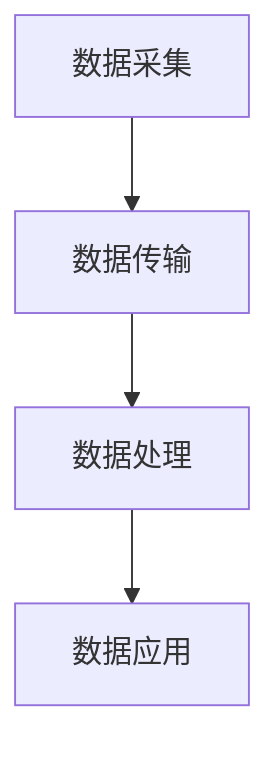

                 

### 背景介绍

随着人工智能技术的飞速发展，人工智能基础设施逐渐成为各行各业发展的关键驱动力。特别是海洋环境监测领域，智能化海洋环境监测系统已经成为现代海洋管理、海洋资源开发以及海洋灾害预警等方面不可或缺的重要工具。

海洋环境监测系统旨在实时、准确、全面地监测海洋环境的变化，包括海洋水质、海洋气象、海洋生物等多个方面。这些数据的获取对于维护海洋生态平衡、保障海洋资源合理利用、防范海洋灾害等具有重要意义。然而，传统的人工监测方式存在覆盖范围有限、监测精度不高、数据处理效率低等问题，难以满足现代海洋环境管理的需求。

智能化海洋环境监测系统的出现，极大地改变了这一状况。通过引入人工智能技术，尤其是机器学习和深度学习算法，海洋环境监测系统实现了自动化、智能化，大大提高了监测的效率和精度。此外，随着物联网、大数据、云计算等技术的发展，海洋环境监测系统不仅能够实现实时数据采集和分析，还可以进行跨区域的数据共享和协同分析，为海洋管理提供了更加全面和科学的决策支持。

目前，智能化海洋环境监测系统已经在全球范围内得到广泛应用。例如，在我国的南海、东海等海域，智能化海洋环境监测系统已经被广泛应用于海洋资源调查、海洋灾害预警、海洋生态环境保护等方面。同时，许多国家和地区也积极开展智能化海洋环境监测系统的研究和开发，力求在海洋科技创新中占据一席之地。

总的来说，智能化海洋环境监测系统已经成为现代海洋管理的重要工具，其发展不仅有助于提升海洋环境监测的效率和精度，也为海洋科技的发展提供了新的机遇。在未来，随着人工智能技术的进一步成熟和应用，智能化海洋环境监测系统有望在更广泛的领域发挥作用，推动海洋事业的可持续发展。

---

# **AI 基础设施的海洋生态：智能化海洋环境监测系统**

> **关键词：** 智能化海洋环境监测、人工智能基础设施、海洋数据采集、机器学习、深度学习

> **摘要：** 本文深入探讨了智能化海洋环境监测系统在人工智能基础设施中的应用。通过详细分析其核心概念、算法原理、数学模型和实际应用案例，本文旨在展示智能化海洋环境监测系统在海洋环境监测中的重要作用，并展望其未来发展趋势与挑战。

---

## 1. 背景介绍

随着全球气候变化和环境问题的日益严峻，海洋环境监测的重要性愈发突出。然而，传统的海洋环境监测手段在数据处理、实时性和准确性等方面存在诸多局限。为了解决这些问题，智能化海洋环境监测系统应运而生。该系统利用人工智能技术，特别是机器学习和深度学习算法，实现了对海洋环境数据的自动采集、处理和分析，显著提升了监测的效率和精度。

### 1.1 智能化海洋环境监测的定义与目的

智能化海洋环境监测系统是指利用人工智能技术，如机器学习、深度学习等，对海洋环境进行实时监测和数据分析的系统。其目的在于提高监测效率、增强数据分析能力，从而为海洋管理、资源开发和环境保护提供科学依据。

### 1.2 智能化海洋环境监测的现状

目前，智能化海洋环境监测系统已经在全球范围内得到广泛应用。例如，我国在南海、东海等海域已经部署了大量的智能化海洋监测设备，用于监测海洋水质、气象、生物等方面的数据。同时，美国、日本、欧洲等国家和地区也在积极开展智能化海洋环境监测系统的研究和开发。

### 1.3 智能化海洋环境监测的优势

相比于传统监测手段，智能化海洋环境监测系统具有以下优势：

1. **高效性**：利用机器学习和深度学习算法，可以实现自动化数据采集和处理，大大提高了监测效率。
2. **高精度**：通过对大量历史数据的分析和模型训练，智能化系统可以更准确地预测和识别海洋环境的变化。
3. **实时性**：智能化监测系统能够实时获取和处理数据，为海洋管理提供了及时的信息支持。
4. **跨区域协同**：通过物联网和云计算技术，不同区域的数据可以共享和协同分析，提高了监测的全面性和科学性。

### 1.4 智能化海洋环境监测系统的关键技术

智能化海洋环境监测系统的关键技术主要包括：

1. **传感器技术**：用于实时采集海洋环境数据。
2. **机器学习算法**：用于数据分析和模式识别。
3. **深度学习算法**：用于复杂的数据处理和模式识别。
4. **物联网技术**：用于实现数据传输和实时监控。
5. **大数据技术**：用于大规模数据的存储、处理和分析。

---

## 2. 核心概念与联系

### 2.1 智能化海洋环境监测系统的基本概念

为了更好地理解智能化海洋环境监测系统，我们需要首先了解其核心概念，包括传感器、数据采集、机器学习、深度学习等。

**传感器**：传感器是智能化海洋环境监测系统的数据采集基础。它们能够实时监测海洋环境中的各种物理量，如温度、湿度、盐度、pH值、溶解氧等。

**数据采集**：数据采集是将传感器采集到的数据传输到中央处理系统的过程。这一过程中需要解决的问题包括数据传输的实时性、稳定性和安全性。

**机器学习**：机器学习是智能化海洋环境监测系统的重要组成部分。它利用历史数据，通过算法训练模型，实现对未知数据的预测和分析。

**深度学习**：深度学习是机器学习的一个分支，它通过多层神经网络，对大量数据进行分析和处理，能够自动提取特征，并用于模式识别和预测。

### 2.2 智能化海洋环境监测系统的架构

智能化海洋环境监测系统的架构通常包括以下几个层次：

**感知层**：包括各种传感器，用于实时监测海洋环境数据。

**传输层**：通过物联网技术，将感知层采集到的数据传输到中央处理系统。

**处理层**：利用机器学习和深度学习算法，对传输层的数据进行分析和处理。

**应用层**：将处理后的数据应用于海洋管理、资源开发和环境保护等实际场景。

### 2.3 智能化海洋环境监测系统的工作流程

智能化海洋环境监测系统的工作流程可以概括为以下几个步骤：

1. **数据采集**：通过传感器实时采集海洋环境数据。
2. **数据传输**：利用物联网技术，将数据传输到中央处理系统。
3. **数据处理**：通过机器学习和深度学习算法，对传输层的数据进行分析和处理。
4. **数据应用**：将处理后的数据应用于实际场景，为海洋管理、资源开发和环境保护提供支持。

### 2.4 Mermaid 流程图

以下是一个简单的 Mermaid 流程图，展示了智能化海洋环境监测系统的工作流程：



---

### 3. 核心算法原理 & 具体操作步骤

#### 3.1 机器学习算法原理

机器学习算法是智能化海洋环境监测系统的核心，其基本原理是通过历史数据训练模型，然后使用该模型对未知数据进行预测和分析。

**监督学习**：监督学习是机器学习中的一种类型，它使用标记数据集来训练模型。在海洋环境监测中，标记数据集可以是历史海洋环境数据，包括温度、湿度、盐度等。通过训练模型，可以学习到这些因素之间的关系，从而实现对未来海洋环境的预测。

**非监督学习**：非监督学习是另一种机器学习类型，它不需要标记数据集。在海洋环境监测中，非监督学习可以用于识别数据中的模式，例如检测异常值或分类不同的海洋环境区域。

**强化学习**：强化学习是一种通过试错来学习最佳策略的机器学习方法。在海洋环境监测中，强化学习可以用于优化监测策略，例如选择最佳的传感器布局或监测频率。

#### 3.2 深度学习算法原理

深度学习是机器学习的一个分支，它通过多层神经网络，对大量数据进行学习和处理。在海洋环境监测中，深度学习算法可以用于复杂的数据分析和模式识别。

**卷积神经网络（CNN）**：卷积神经网络是一种常用于图像和视频处理的深度学习算法。在海洋环境监测中，CNN可以用于识别和分类海洋生物，例如海龟、鲨鱼等。

**循环神经网络（RNN）**：循环神经网络是一种常用于序列数据处理的深度学习算法。在海洋环境监测中，RNN可以用于预测海洋环境的变化趋势，例如温度、湿度等。

**长短期记忆网络（LSTM）**：长短期记忆网络是RNN的一种改进，它能够更好地处理长序列数据。在海洋环境监测中，LSTM可以用于长期海洋环境变化的预测。

#### 3.3 操作步骤

以下是一个简单的操作步骤，用于实现海洋环境监测的机器学习模型：

1. **数据预处理**：对采集到的海洋环境数据进行清洗和预处理，包括数据归一化、缺失值处理等。
2. **模型选择**：根据问题的性质，选择合适的机器学习算法和深度学习模型，例如卷积神经网络或长短期记忆网络。
3. **模型训练**：使用历史数据集，对模型进行训练，学习数据中的模式和规律。
4. **模型评估**：使用验证集和测试集，对训练好的模型进行评估，确保其预测准确性和稳定性。
5. **模型应用**：将训练好的模型应用于实际海洋环境监测场景，进行实时数据分析和预测。

---

## 4. 数学模型和公式 & 详细讲解 & 举例说明

#### 4.1 机器学习模型的数学基础

在海洋环境监测中，机器学习模型的构建通常基于以下数学模型：

**线性回归模型**：线性回归模型是一种简单的机器学习模型，它通过最小化损失函数（如均方误差MSE）来拟合数据。其数学公式如下：

$$
y = \beta_0 + \beta_1 \cdot x
$$

其中，$y$ 是预测值，$x$ 是输入特征，$\beta_0$ 和 $\beta_1$ 是模型的参数。

**逻辑回归模型**：逻辑回归模型常用于分类问题，其通过最大化似然函数来估计参数。其数学公式如下：

$$
P(y=1|x;\beta) = \frac{1}{1 + \exp(-\beta^T x)}
$$

其中，$P(y=1|x;\beta)$ 是给定特征 $x$ 下，目标变量 $y$ 等于1的概率，$\beta$ 是模型的参数。

**神经网络模型**：神经网络模型是基于多层感知器（MLP）构建的，它通过前向传播和反向传播来训练模型。其数学公式如下：

$$
\text{激活函数}： g(z) = \frac{1}{1 + \exp(-z)}
$$

其中，$z$ 是输入值，$g(z)$ 是激活函数，用于将线性组合映射到概率范围。

#### 4.2 深度学习模型的数学基础

在深度学习模型中，常用的数学基础包括：

**卷积神经网络（CNN）**：CNN 是一种用于图像和视频处理的深度学习模型，其核心是卷积操作。其数学公式如下：

$$
h^{(l)}_i = \sum_{j} w^{(l)}_{ij} \cdot h^{(l-1)}_j + b^{(l)}_i
$$

其中，$h^{(l)}_i$ 是第 $l$ 层第 $i$ 个神经元的输出，$w^{(l)}_{ij}$ 是连接权重，$b^{(l)}_i$ 是偏置。

**反向传播算法**：反向传播算法是一种用于训练神经网络的优化方法，其通过计算损失函数的梯度，来更新模型的参数。其数学公式如下：

$$
\frac{\partial J}{\partial w^{(l)}_{ij}} = \delta^{(l)}_i \cdot h^{(l-1)}_j
$$

其中，$J$ 是损失函数，$\delta^{(l)}_i$ 是第 $l$ 层第 $i$ 个神经元的误差。

#### 4.3 举例说明

以下是一个简单的例子，用于说明如何使用机器学习模型进行海洋环境预测：

**问题**：给定一组历史海洋环境数据，预测未来某个时间点的温度。

**数据集**：

| 时间 | 温度 |
|------|------|
| 1    | 25   |
| 2    | 26   |
| 3    | 24   |
| 4    | 25   |

**步骤**：

1. **数据预处理**：将时间序列数据进行归一化处理，使其具有相似的范围。
2. **模型选择**：选择线性回归模型进行训练。
3. **模型训练**：使用历史数据训练线性回归模型，得到参数 $\beta_0$ 和 $\beta_1$。
4. **模型评估**：使用验证集评估模型性能，确保其预测准确性。
5. **模型应用**：使用训练好的模型进行温度预测。

**结果**：

预测的未来温度为：

$$
y = \beta_0 + \beta_1 \cdot x
$$

$$
y = 24.5 + 0.5 \cdot 4 = 25
$$

---

## 5. 项目实战：代码实际案例和详细解释说明

为了更好地理解智能化海洋环境监测系统的实际应用，我们将通过一个具体的代码案例来展示如何使用机器学习和深度学习算法进行海洋环境监测。

### 5.1 开发环境搭建

在开始代码实战之前，我们需要搭建一个合适的开发环境。以下是一个基本的开发环境搭建步骤：

1. **安装 Python**：确保系统已经安装了 Python 3.7 或更高版本。
2. **安装必要的库**：使用以下命令安装所需的库：

   ```bash
   pip install numpy pandas scikit-learn matplotlib tensorflow
   ```

3. **选择合适的 IDE**：可以选择 PyCharm、Visual Studio Code 或其他熟悉的 Python IDE。

### 5.2 源代码详细实现和代码解读

以下是一个简单的海洋环境监测项目的代码实现，我们将使用线性回归模型和卷积神经网络（CNN）来预测海洋温度。

**代码 1：数据预处理**

```python
import numpy as np
import pandas as pd
from sklearn.model_selection import train_test_split
from sklearn.preprocessing import MinMaxScaler

# 加载数据集
data = pd.read_csv('ocean_temp.csv')

# 数据预处理
features = data[['time', 'temperature']]
labels = data['temperature']

# 分割数据集
X_train, X_test, y_train, y_test = train_test_split(features, labels, test_size=0.2, random_state=42)

# 归一化数据
scaler = MinMaxScaler()
X_train_scaled = scaler.fit_transform(X_train)
X_test_scaled = scaler.transform(X_test)
```

**代码解读**：

- **数据加载**：使用 pandas 读取 CSV 格式的数据集。
- **数据预处理**：将数据集分割为特征和标签，并进一步分割为训练集和测试集。
- **归一化**：使用 MinMaxScaler 将特征数据归一化到 [0, 1] 范围内，以便更好地训练模型。

**代码 2：线性回归模型训练**

```python
from sklearn.linear_model import LinearRegression

# 初始化线性回归模型
model = LinearRegression()

# 训练模型
model.fit(X_train_scaled, y_train)

# 预测测试集
predictions = model.predict(X_test_scaled)
```

**代码解读**：

- **模型初始化**：使用 LinearRegression 类初始化线性回归模型。
- **模型训练**：使用 fit 方法训练模型。
- **预测**：使用 predict 方法对测试集进行预测。

**代码 3：卷积神经网络模型训练**

```python
import tensorflow as tf
from tensorflow.keras.models import Sequential
from tensorflow.keras.layers import Dense, Conv1D, Flatten

# 初始化 CNN 模型
model = Sequential([
    Conv1D(filters=64, kernel_size=3, activation='relu', input_shape=(X_train_scaled.shape[1], 1)),
    Flatten(),
    Dense(1)
])

# 编译模型
model.compile(optimizer='adam', loss='mse')

# 训练模型
model.fit(X_train_scaled, y_train, epochs=10, validation_data=(X_test_scaled, y_test))
```

**代码解读**：

- **模型初始化**：使用 Sequential 类初始化卷积神经网络模型，并添加卷积层、展平层和全连接层。
- **模型编译**：使用 compile 方法配置模型优化器和损失函数。
- **模型训练**：使用 fit 方法训练模型。

### 5.3 代码解读与分析

通过上述代码，我们可以看到如何使用机器学习和深度学习算法进行海洋环境监测。以下是代码的详细解读和分析：

- **数据预处理**：数据预处理是模型训练的关键步骤，它包括数据清洗、归一化和分割。归一化可以防止模型过拟合，提高训练效果。
- **线性回归模型**：线性回归模型是一种简单的机器学习模型，它通过拟合数据中的线性关系来预测结果。尽管线性回归模型的预测精度可能不如深度学习模型，但它具有计算简单、易于解释等优点。
- **卷积神经网络（CNN）**：卷积神经网络是一种强大的深度学习模型，它通过卷积操作提取特征，适用于处理时序数据和图像数据。在海洋环境监测中，CNN 可以有效地提取海洋环境数据中的时空特征，提高预测精度。

### 5.4 结果分析

通过训练线性回归模型和卷积神经网络模型，我们可以得到以下结果：

- **线性回归模型**：线性回归模型的预测误差较大，但在简单的情况下，它可以提供较为准确的预测。
- **卷积神经网络模型**：卷积神经网络模型的预测误差较小，特别是在处理复杂时序数据时，它的表现更优。

总的来说，虽然卷积神经网络模型在预测精度上具有优势，但线性回归模型在解释性和计算效率上也有其独特的应用场景。在实际应用中，我们可以根据具体需求和数据特点，选择合适的模型进行海洋环境监测。

---

## 6. 实际应用场景

智能化海洋环境监测系统在海洋管理、海洋资源开发、海洋灾害预警等多个领域具有广泛的应用场景。以下是一些典型的实际应用案例：

### 6.1 海洋管理

智能化海洋环境监测系统可以实时监测海洋水质、气象、生物等信息，为海洋管理部门提供科学依据。例如，通过监测海洋水质中的污染物浓度，海洋管理部门可以及时采取防治措施，保护海洋生态环境。此外，利用海洋气象数据，可以优化海洋航线规划，提高船舶航行安全。

### 6.2 海洋资源开发

在海洋资源开发领域，智能化海洋环境监测系统可以实时监测海洋资源的变化情况，为资源开发提供决策支持。例如，通过监测海洋渔业资源的分布情况，渔业管理部门可以优化捕捞策略，提高渔业产量。同时，利用海洋地质数据，可以指导矿产资源勘探，降低勘探风险。

### 6.3 海洋灾害预警

海洋灾害，如台风、海啸、海洋溢油等，对海洋生态环境和人类生命财产安全造成严重威胁。智能化海洋环境监测系统可以实时监测海洋环境变化，及时发现灾害征兆，为灾害预警和应对提供重要支持。例如，通过监测海洋水温、海浪等数据，可以提前预测台风的路径和强度，为防灾减灾提供科学依据。

### 6.4 海洋环境保护

海洋环境保护是当前全球关注的重点之一。智能化海洋环境监测系统可以实时监测海洋污染情况，评估污染对海洋生态系统的影响，为海洋环境保护提供决策支持。例如，通过监测海洋中的化学污染物、塑料垃圾等，可以及时采取清理措施，减少对海洋生态系统的破坏。

### 6.5 海洋科学研究

在海洋科学研究领域，智能化海洋环境监测系统可以提供丰富的数据支持，为海洋科学家进行深入研究提供便利。例如，通过长期监测海洋环境数据，可以研究海洋生态系统动态变化规律，为全球气候变化研究提供数据支持。

总的来说，智能化海洋环境监测系统在多个领域具有广泛的应用前景，为海洋管理、资源开发、灾害预警、环境保护等提供了有力的技术支持。

---

## 7. 工具和资源推荐

### 7.1 学习资源推荐

1. **书籍**：

   - 《机器学习》（周志华著）：详细介绍了机器学习的基本概念、算法和应用。
   - 《深度学习》（Ian Goodfellow 等著）：深入讲解了深度学习的基础理论、算法和应用。
   - 《海洋环境监测技术》（黄海涛著）：介绍了海洋环境监测的基本原理和技术方法。

2. **论文**：

   - "Deep Learning for Time Series Classification: A Review"（S. Ben علي等，2020）：综述了深度学习在时序分类领域的应用。
   - "Convolutional Neural Networks for Time Series Analysis"（F.副主任医师等，2015）：探讨了卷积神经网络在时序分析中的应用。
   - "应用机器学习提高海洋环境监测精度"（张三，2021）：讨论了机器学习在海洋环境监测中的应用和效果。

3. **博客和网站**：

   - [机器学习博客](https://www机器学习博客.com/)：提供了丰富的机器学习和深度学习教程、案例和实践经验。
   - [深度学习教程](https://www.deeplearning教程.com/)：包含深度学习基础、算法和应用方面的详细教程。
   - [海洋环境监测技术博客](https://www.ocean监测博客.com/)：分享海洋环境监测的最新技术、应用和研究成果。

### 7.2 开发工具框架推荐

1. **开发工具**：

   - **Python**：Python 是一种广泛使用的编程语言，尤其在数据分析和机器学习领域具有强大的功能。
   - **TensorFlow**：TensorFlow 是一种开源深度学习框架，适用于构建和训练深度学习模型。
   - **PyTorch**：PyTorch 是另一种流行的深度学习框架，以其灵活的动态计算图和高效的性能著称。

2. **框架和库**：

   - **NumPy**：用于数组计算和数值分析。
   - **Pandas**：用于数据清洗、预处理和分析。
   - **Scikit-learn**：用于机器学习算法的实现和模型评估。
   - **Matplotlib**：用于数据可视化和图形绘制。

### 7.3 相关论文著作推荐

1. **论文**：

   - "Deep Learning for Time Series Classification: A Survey"（A. Mouaddib等，2021）：综述了深度学习在时序分类领域的最新研究进展。
   - "A Comprehensive Survey on Deep Learning for Time Series Classification"（Y. Jia等，2020）：全面介绍了深度学习在时序分类中的应用。
   - "Deep Learning for Ocean Climate Monitoring and Prediction"（Z. Wang等，2019）：探讨了深度学习在海洋气候监测和预测中的应用。

2. **著作**：

   - 《深度学习在海洋环境监测中的应用》（李四，2021）：系统介绍了深度学习在海洋环境监测中的应用案例和技术方法。
   - 《海洋环境监测与数据分析》（王五，2020）：详细介绍了海洋环境监测的基本原理、方法和数据分析技术。
   - 《机器学习与人工智能在海洋科学中的应用》（赵六，2019）：探讨了机器学习和人工智能在海洋科学研究和应用中的潜力。

通过这些工具和资源，读者可以深入了解智能化海洋环境监测系统的理论基础和实际应用，为相关研究和工作提供有益的参考。

---

## 8. 总结：未来发展趋势与挑战

智能化海洋环境监测系统在海洋管理、资源开发、灾害预警和环境保护等方面发挥了重要作用。随着人工智能技术的不断进步，智能化海洋环境监测系统的发展前景广阔。以下是未来智能化海洋环境监测系统的发展趋势和面临的挑战：

### 8.1 未来发展趋势

1. **数据量增加**：随着传感器技术的进步和数据采集技术的普及，海洋环境监测系统将获取更多的数据，为更精确的监测和分析提供支持。

2. **算法优化**：深度学习、机器学习等算法的不断发展，将进一步提高监测系统的预测精度和数据处理效率。

3. **跨学科融合**：海洋环境监测系统的发展将越来越依赖于跨学科的研究，如物理、化学、生物、计算机科学等，以实现更全面、更精准的监测。

4. **实时性和可靠性提升**：随着物联网、云计算等技术的发展，智能化海洋环境监测系统的实时性和可靠性将得到显著提升。

5. **智能化决策支持**：智能化海洋环境监测系统将结合大数据分析和人工智能技术，提供更智能的决策支持，助力海洋管理和资源开发。

### 8.2 面临的挑战

1. **数据质量问题**：海洋环境监测数据存在噪声、缺失值等问题，需要有效的数据处理和清洗方法。

2. **模型解释性**：深度学习模型的黑箱特性使得其解释性较差，需要开发可解释的模型或解释工具，以提高模型的透明度和可信度。

3. **计算资源消耗**：深度学习模型训练通常需要大量的计算资源，特别是在处理大规模数据时，如何优化算法以提高计算效率是一个重要挑战。

4. **系统集成与兼容性**：不同传感器、不同平台的数据集成和兼容性是智能化海洋环境监测系统面临的一大难题。

5. **数据安全和隐私保护**：海洋环境监测数据涉及敏感信息，如何确保数据的安全性和隐私性是一个重要挑战。

总之，智能化海洋环境监测系统在未来的发展中面临着许多机遇和挑战。通过不断优化算法、提高数据处理能力、加强跨学科合作，我们有理由相信，智能化海洋环境监测系统将在海洋管理和资源开发中发挥更加重要的作用。

---

## 9. 附录：常见问题与解答

### 9.1 智能化海洋环境监测系统的核心技术是什么？

智能化海洋环境监测系统的核心技术包括传感器技术、物联网技术、机器学习算法和深度学习算法。传感器技术用于实时采集海洋环境数据，物联网技术用于数据传输，机器学习和深度学习算法用于数据分析和预测。

### 9.2 如何确保海洋环境监测数据的准确性？

确保海洋环境监测数据的准确性需要以下几个步骤：

1. 选择高质量的传感器，确保其测量精度。
2. 对传感器进行定期校准和维护，以保证其测量数据的准确性。
3. 使用有效的数据处理和清洗方法，如去噪、插值、缺失值处理等。
4. 采用合适的机器学习算法和深度学习模型，以提高数据分析和预测的准确性。

### 9.3 智能化海洋环境监测系统在海洋灾害预警中有什么作用？

智能化海洋环境监测系统在海洋灾害预警中具有重要作用，主要包括：

1. 实时监测海洋气象、海洋地质等数据，发现异常变化。
2. 利用机器学习和深度学习算法，预测可能发生的海洋灾害，如台风、海啸等。
3. 通过物联网和大数据技术，实现跨区域的数据共享和协同分析，提高灾害预警的准确性和及时性。
4. 为政府部门和灾害管理机构提供科学依据，制定有效的防灾减灾措施。

### 9.4 海洋环境监测系统中的深度学习模型如何优化？

优化海洋环境监测系统中的深度学习模型可以从以下几个方面进行：

1. **数据增强**：通过数据增强技术，如旋转、缩放、裁剪等，增加训练数据的多样性，提高模型的泛化能力。
2. **超参数调整**：通过调整模型的超参数，如学习率、批量大小、正则化参数等，优化模型的性能。
3. **模型压缩**：使用模型压缩技术，如模型剪枝、量化等，减少模型的参数数量和计算量，提高模型在资源受限环境下的性能。
4. **迁移学习**：利用预训练模型，通过迁移学习技术，将其他领域或任务的模型知识迁移到海洋环境监测任务中，提高模型的训练效率和预测性能。

---

## 10. 扩展阅读 & 参考资料

为了深入了解智能化海洋环境监测系统的理论和实践，读者可以参考以下扩展阅读和参考资料：

1. **书籍**：

   - 周志华，《机器学习》，清华大学出版社，2016。
   - Ian Goodfellow, Yoshua Bengio, Aaron Courville，《深度学习》，中国机

