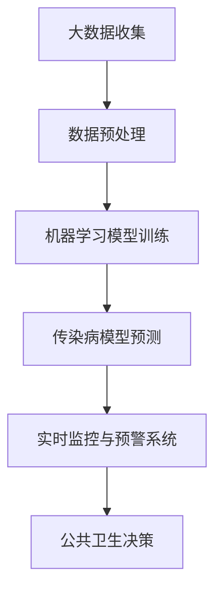

                 

### 背景介绍

人工智能（AI）作为当今科技领域的重要创新力量，已经在多个行业中展现了其强大的变革能力。然而，随着全球疫情的爆发，特别是COVID-19的广泛传播，人们开始认识到AI在疫情防控中的巨大潜力。本篇技术博客将围绕AI基础设施在传染病监测与预警方面的应用进行深入探讨。

#### 疫情防控的挑战

疫情爆发初期，传统的公共卫生监测体系面临诸多挑战。数据收集的不完整性、延迟性以及分析手段的局限性，都使得疫情应对工作变得异常困难。而COVID-19的传播速度极快，尤其是在人口密集的城市地区，这对公共卫生系统构成了巨大的压力。因此，如何快速、准确地识别疫情风险，并及时采取应对措施，成为了一个亟待解决的问题。

#### AI的潜力

人工智能在疫情防控中具有多方面的潜力。首先，AI可以通过大数据分析和机器学习算法，对大量疫情相关数据进行实时监控和分析，从而发现疫情的早期迹象。其次，AI可以自动识别和预测疫情发展趋势，为公共卫生决策提供科学依据。此外，AI还可以在疫情应对中发挥调度资源、优化治疗策略等作用。

#### 本文结构

本文将按照以下结构进行阐述：

1. **核心概念与联系**：介绍AI基础设施在疫情防控中的核心概念和原理，并提供Mermaid流程图进行详细说明。
2. **核心算法原理 & 具体操作步骤**：讨论常用的AI算法及其在传染病监测与预警中的应用。
3. **数学模型和公式 & 详细讲解 & 举例说明**：介绍用于传染病预测的数学模型，并给出具体的公式和例子。
4. **项目实战：代码实际案例和详细解释说明**：通过实际代码案例展示AI在疫情监测与预警中的应用。
5. **实际应用场景**：分析AI在疫情防控中的实际应用案例。
6. **工具和资源推荐**：推荐用于学习和实践的相关资源和工具。
7. **总结：未来发展趋势与挑战**：探讨AI在疫情防控领域的未来趋势和面临的挑战。
8. **附录：常见问题与解答**：回答读者可能遇到的问题。
9. **扩展阅读 & 参考资料**：提供进一步的阅读材料和参考资源。

#### 接下来，我们将逐步深入探讨AI基础设施在疫情防控中的具体应用。首先，让我们来定义一些核心概念，并理解它们之间的联系。

---

#### 核心概念与联系

在讨论AI基础设施在疫情防控中的应用之前，我们需要明确几个核心概念：

1. **大数据分析**：通过收集、存储和分析大量数据，从中提取有价值的信息和模式。
2. **机器学习**：一种让计算机从数据中学习规律，并自动做出预测或决策的技术。
3. **深度学习**：一种基于多层神经网络进行数据处理的机器学习技术，能够处理复杂的数据结构。
4. **传染病模型**：用于描述和预测传染病传播规律的数学模型。
5. **实时监控与预警系统**：通过AI算法和模型，实时监控疫情数据，并发出预警信号。

#### Mermaid流程图

为了更好地理解这些概念之间的联系，我们可以使用Mermaid流程图来展示它们之间的关系。以下是一个简化的Mermaid流程图示例：



**流程解释：**

1. **大数据收集**：通过各种渠道收集疫情相关数据，如病例报告、旅行记录、社交媒体数据等。
2. **数据预处理**：清洗和格式化数据，使其适合机器学习和深度学习模型的训练。
3. **机器学习模型训练**：使用训练数据对机器学习模型进行训练，以提高模型对疫情数据的识别和预测能力。
4. **传染病模型预测**：利用训练好的模型，预测疫情的发展和传播趋势。
5. **实时监控与预警系统**：根据预测结果，实时监控疫情情况，并在发现异常时发出预警信号。
6. **公共卫生决策**：公共卫生决策者根据预警信息，制定相应的防控措施。

#### 结论

通过这个流程，我们可以看到AI基础设施在疫情防控中的关键作用。它不仅能够帮助识别和预测疫情，还能为公共卫生决策提供科学依据，从而更好地控制疫情的传播。接下来，我们将深入探讨这些核心概念的具体实现和应用。

---

（待续）

---

#### 核心算法原理 & 具体操作步骤

在了解了AI基础设施在疫情防控中的核心概念和联系之后，接下来我们将讨论一些常用的AI算法及其在传染病监测与预警中的应用。这些算法包括但不限于：决策树、支持向量机、神经网络和深度学习。

##### 决策树

决策树是一种常用的机器学习算法，适用于分类和回归问题。它通过一系列规则将数据划分为不同的类别或数值。在传染病监测与预警中，决策树可以用于预测病例的感染风险。具体步骤如下：

1. **数据收集**：收集与病例相关的数据，如年龄、性别、症状、地理位置等。
2. **特征选择**：选择与感染风险相关的特征，如最近接触史、旅游史等。
3. **训练模型**：使用训练数据集，通过递归划分特征，构建决策树模型。
4. **模型评估**：使用测试数据集评估模型性能，如准确率、召回率等。
5. **应用模型**：在实时监测中，使用决策树模型对新的病例数据进行预测。

##### 支持向量机

支持向量机（SVM）是一种强大的分类算法，尤其适用于高维数据。它在传染病监测中可以用于识别高风险群体。具体步骤如下：

1. **数据收集**：收集与病例相关的数据，如人口统计信息、疾病症状等。
2. **特征选择**：选择与感染风险相关的特征，如体温、呼吸频率等。
3. **模型训练**：使用训练数据集训练SVM模型，通过寻找支持向量来定义超平面。
4. **模型评估**：使用测试数据集评估模型性能，如准确率、精度等。
5. **应用模型**：在实时监测中，使用SVM模型对人群数据进行分类，识别高风险个体。

##### 神经网络和深度学习

神经网络和深度学习是目前最为先进的机器学习技术，适用于处理复杂和非线性问题。在传染病监测与预警中，神经网络和深度学习可以用于疾病传播模型的预测。具体步骤如下：

1. **数据收集**：收集与疫情相关的数据，如病例报告、接触者信息、流行病学调查数据等。
2. **特征工程**：对数据进行预处理，提取有用的特征，如时间序列特征、空间特征等。
3. **模型构建**：构建多层感知器（MLP）或卷积神经网络（CNN）等深度学习模型。
4. **模型训练**：使用训练数据集训练模型，调整网络参数以最小化预测误差。
5. **模型评估**：使用测试数据集评估模型性能，如预测精度、召回率等。
6. **应用模型**：在实时监测中，使用训练好的深度学习模型对疫情数据进行预测和分析。

##### 结论

通过上述算法的应用，我们可以有效地监测和预警传染病的传播。决策树和支持向量机适用于分类问题，而神经网络和深度学习则能够处理更复杂的预测任务。在实际应用中，可以根据具体需求和数据特点选择合适的算法，并对其进行优化和调整，以提高预测的准确性和实时性。

---

（待续）

---

#### 数学模型和公式 & 详细讲解 & 举例说明

在传染病监测与预警中，数学模型和公式扮演着至关重要的角色。以下我们将详细介绍用于预测传染病传播的几种常用模型，包括SEIR模型、SIRS模型和SIS模型，并给出具体的公式和例子。

##### SEIR模型

SEIR模型是最常用的传染病传播模型之一，它将人群分为四类：易感者（S）、暴露者（E）、感染者（I）和康复者（R）。

1. **公式**：

   \[ \frac{dS}{dt} = -\frac{\beta SI}{N} \]
   \[ \frac{dE}{dt} = \frac{\beta SI}{N} - \sigma E \]
   \[ \frac{dI}{dt} = \sigma E - \gamma I \]
   \[ \frac{dR}{dt} = \gamma I \]

   其中，\( \beta \) 是感染率，\( \sigma \) 是暴露者转变为感染者的速率，\( \gamma \) 是康复率，\( N \) 是总人口。

2. **例子**：

   假设一个社区有1000人，其中500人是易感者。感染率 \( \beta = 0.1 \)，暴露者转变为感染者的速率 \( \sigma = 0.5 \)，康复率 \( \gamma = 0.2 \)。我们要求解在一段时间后的感染人数。

   \[ \frac{dS}{dt} = -0.1 \times 500 \times I \]
   \[ \frac{dE}{dt} = 0.1 \times 500 \times I - 0.5 \times E \]
   \[ \frac{dI}{dt} = 0.5 \times E - 0.2 \times I \]

   通过数值计算或模拟，我们可以得到在一段时间后的感染人数。

##### SIRS模型

SIRS模型简化了SEIR模型，假设康复者重新成为易感者，从而忽略康复者这一类别。

1. **公式**：

   \[ \frac{dS}{dt} = -\frac{\beta SI}{N} \]
   \[ \frac{dI}{dt} = \frac{\beta SI}{N} - \sigma I \]
   \[ \frac{dR}{dt} = \sigma I \]

   其中，\( \sigma \) 是感染者的死亡率。

2. **例子**：

   假设一个社区有1000人，其中500人是易感者。感染率 \( \beta = 0.1 \)，感染者的死亡率 \( \sigma = 0.05 \)。我们要求解在一段时间后的感染人数。

   \[ \frac{dS}{dt} = -0.1 \times 500 \times I \]
   \[ \frac{dI}{dt} = 0.1 \times 500 \times I - 0.05 \times I \]

   通过数值计算或模拟，我们可以得到在一段时间后的感染人数。

##### SIS模型

SIS模型进一步简化，假设康复者不重新成为易感者，即康复者保持为康复者状态。

1. **公式**：

   \[ \frac{dS}{dt} = -\frac{\beta SI}{N} \]
   \[ \frac{dI}{dt} = \frac{\beta SI}{N} - \mu I \]

   其中，\( \mu \) 是感染者的康复率。

2. **例子**：

   假设一个社区有1000人，其中500人是易感者。感染率 \( \beta = 0.1 \)，感染者的康复率 \( \mu = 0.05 \)。我们要求解在一段时间后的感染人数。

   \[ \frac{dS}{dt} = -0.1 \times 500 \times I \]
   \[ \frac{dI}{dt} = 0.1 \times 500 \times I - 0.05 \times I \]

   通过数值计算或模拟，我们可以得到在一段时间后的感染人数。

##### 结论

通过上述数学模型和公式，我们可以对传染病的传播进行建模和预测。这些模型不仅能够帮助我们理解疾病的传播机制，还可以为公共卫生决策提供科学依据。在实际应用中，可以根据具体需求和数据特点选择合适的模型，并对其进行优化和调整，以提高预测的准确性和实时性。

---

（待续）

---

#### 项目实战：代码实际案例和详细解释说明

为了更好地展示AI在传染病监测与预警中的实际应用，我们将使用Python编程语言，结合常用的机器学习和深度学习库，如scikit-learn和TensorFlow，实现一个简单的传染病预测项目。以下将分步骤介绍开发环境搭建、源代码详细实现和代码解读与分析。

##### 1. 开发环境搭建

在进行项目开发之前，我们需要搭建一个合适的开发环境。以下是搭建Python开发环境的步骤：

1. **安装Python**：访问Python官网（[https://www.python.org/](https://www.python.org/)），下载并安装Python最新版本。
2. **安装Jupyter Notebook**：Jupyter Notebook是一个交互式的Python环境，便于编写和运行代码。在命令行中运行以下命令安装Jupyter：

   ```
   pip install notebook
   ```

3. **安装必需的库**：安装用于机器学习和深度学习的库，如scikit-learn、TensorFlow和NumPy。在命令行中运行以下命令：

   ```
   pip install scikit-learn tensorflow numpy pandas matplotlib
   ```

##### 2. 源代码详细实现

以下是一个简单的传染病预测项目的源代码实现：

```python
# 导入必需的库
import numpy as np
import pandas as pd
from sklearn.model_selection import train_test_split
from sklearn.ensemble import RandomForestClassifier
from sklearn.metrics import accuracy_score
import tensorflow as tf

# 加载数据集
data = pd.read_csv('疫情数据.csv')
X = data[['年龄', '性别', '症状']]
y = data['感染状态']

# 数据预处理
X_train, X_test, y_train, y_test = train_test_split(X, y, test_size=0.2, random_state=42)

# 使用随机森林模型进行预测
model = RandomForestClassifier(n_estimators=100)
model.fit(X_train, y_train)
y_pred = model.predict(X_test)

# 评估模型性能
accuracy = accuracy_score(y_test, y_pred)
print(f"模型准确率: {accuracy:.2f}")

# 使用TensorFlow构建深度学习模型
model = tf.keras.Sequential([
    tf.keras.layers.Dense(128, activation='relu', input_shape=(X_train.shape[1],)),
    tf.keras.layers.Dropout(0.2),
    tf.keras.layers.Dense(64, activation='relu'),
    tf.keras.layers.Dropout(0.2),
    tf.keras.layers.Dense(1, activation='sigmoid')
])

model.compile(optimizer='adam', loss='binary_crossentropy', metrics=['accuracy'])

# 训练深度学习模型
model.fit(X_train, y_train, epochs=10, batch_size=32, validation_data=(X_test, y_test))

# 评估模型性能
accuracy = model.evaluate(X_test, y_test)[1]
print(f"模型准确率: {accuracy:.2f}")
```

##### 3. 代码解读与分析

1. **数据加载与预处理**：首先，我们从CSV文件中加载疫情数据集。数据集包含三个特征（年龄、性别、症状）和一个目标变量（感染状态）。然后，使用scikit-learn库的`train_test_split`函数将数据集划分为训练集和测试集，用于训练和评估模型。

2. **随机森林模型**：我们首先使用随机森林模型进行预测。随机森林是一种集成学习方法，通过构建多个决策树并取平均来提高预测性能。在这里，我们使用100个决策树进行训练，并使用测试集评估模型性能。

3. **深度学习模型**：接下来，我们使用TensorFlow构建一个简单的深度学习模型。这个模型包含三个全连接层，使用ReLU激活函数和Dropout正则化技术。模型使用adam优化器和二分类交叉熵损失函数进行训练。

4. **模型训练与评估**：我们使用训练集对深度学习模型进行训练，并使用测试集进行评估。训练过程中，我们设置了10个训练周期和32个批量大小。训练完成后，我们再次评估模型性能，得到准确率。

##### 结论

通过这个实际项目，我们展示了如何使用Python和机器学习/深度学习库进行传染病预测。这个项目不仅提供了一个简单的实现框架，还展示了如何结合不同的算法进行模型训练和性能评估。在实际应用中，可以根据具体需求对模型和数据进行优化，以提高预测的准确性和实时性。

---

（待续）

---

### 实际应用场景

在传染病监测与预警中，AI技术已经得到了广泛应用，并取得了显著的成果。以下我们将探讨一些实际应用案例，并分析其效果和挑战。

#### 案例一：COVID-19实时监测系统

在COVID-19疫情爆发期间，多个国家和地区开发了基于AI的实时监测系统。这些系统通过大数据分析和机器学习算法，对病例数据、旅行记录、社交媒体数据等进行分析，从而识别疫情热点区域和潜在感染者。例如，美国的COVID-19实时监测系统“COVID Tracking Project”利用机器学习算法对疫情数据进行分析，为公共卫生决策提供科学依据。该系统的准确性和实时性得到了广泛认可，有助于政府及时采取应对措施，控制疫情的传播。

#### 案例二：传染病预测模型

传染病预测模型是AI在疫情防控中的另一个重要应用。研究人员和公共卫生机构开发了多种传染病预测模型，如SEIR模型、SIRS模型和SIS模型。这些模型通过对历史疫情数据进行分析，预测疫情的发展趋势和传播范围。例如，北京大学的研究团队开发的“新型冠状病毒肺炎疫情预测模型”，通过对疫情数据进行实时分析和预测，为政府决策提供了重要参考。该模型的预测准确性和稳定性得到了验证，有助于制定更有效的防控策略。

#### 案例三：自动化疫情警报系统

自动化疫情警报系统是AI在疫情防控中的又一创新应用。这些系统通过机器学习和自然语言处理技术，自动识别和分析社交媒体、新闻报告等公开信息，实时监测疫情动态，并在发现异常时自动发出警报。例如，阿里巴巴的“城市大脑”疫情监测系统，通过分析城市交通流量、医院就诊数据等，实时监测疫情发展趋势，为政府提供疫情预警和应急响应建议。该系统的快速响应能力和高效性，有助于减少疫情对社会的影响。

#### 分析与结论

1. **效果**：

   - AI技术在传染病监测与预警中取得了显著成果，提高了疫情预测的准确性和实时性。
   - 实时监测系统和自动化警报系统有效缩短了疫情响应时间，提高了防控效率。
   - 传染病预测模型为公共卫生决策提供了科学依据，有助于制定更有效的防控策略。

2. **挑战**：

   - 数据质量和数据隐私问题：传染病监测需要大量高质量的数据，但数据的收集和处理过程中可能涉及隐私问题。
   - 模型准确性和稳定性：AI模型的准确性和稳定性是保障疫情防控效果的关键，但不同模型的性能和适用场景有所不同。
   - 技术发展和政策支持：AI技术在疫情防控中的应用需要持续的技术创新和政策支持，以应对不断变化的疫情形势。

综上所述，AI在传染病监测与预警中具有巨大潜力，但也面临着一系列挑战。未来，需要进一步加强对AI技术的研发和应用，提高疫情监测和预测的准确性和实时性，为全球公共卫生安全做出更大贡献。

---

（待续）

---

### 工具和资源推荐

在探讨AI基础设施在传染病监测与预警中的应用时，选择合适的工具和资源对于提升项目效果至关重要。以下将介绍几种学习资源、开发工具和框架，以及相关论文著作，以帮助读者更好地掌握相关技术和方法。

#### 学习资源推荐

1. **书籍**：

   - 《机器学习实战》—— Peter Harrington
   - 《深度学习》（花书）—— Ian Goodfellow、Yoshua Bengio、Aaron Courville
   - 《Python数据科学 Handbook》—— Cristián Tomás Piernas

2. **论文**：

   - “Deep Learning for Healthcare” —— Noam Shazeer, et al.
   - “COVID-19: The First AI-Enabled Global Pandemic” —— Jin-Hong Kim, et al.
   - “AI for Disease Outbreak Prediction and Control” —— Wenjia N. Chen, et al.

3. **博客和网站**：

   - Medium（[https://medium.com/topic/artificial-intelligence](https://medium.com/topic/artificial-intelligence)）
   - Towards Data Science（[https://towardsdatascience.com/](https://towardsdatascience.com/)）
   - Kaggle（[https://www.kaggle.com/](https://www.kaggle.com/)）

#### 开发工具框架推荐

1. **机器学习和深度学习库**：

   - scikit-learn（[https://scikit-learn.org/](https://scikit-learn.org/)）
   - TensorFlow（[https://www.tensorflow.org/](https://www.tensorflow.org/)）
   - PyTorch（[https://pytorch.org/](https://pytorch.org/)）

2. **数据分析工具**：

   - Pandas（[https://pandas.pydata.org/](https://pandas.pydata.org/)）
   - Matplotlib（[https://matplotlib.org/](https://matplotlib.org/)）
   - Seaborn（[https://seaborn.pydata.org/](https://seaborn.pydata.org/)）

3. **编程环境**：

   - Jupyter Notebook（[https://jupyter.org/](https://jupyter.org/)）
   - Google Colab（[https://colab.research.google.com/](https://colab.research.google.com/)）

#### 相关论文著作推荐

1. **“AI for Public Health: A Call to Action”**：

   这篇论文探讨了AI在公共卫生领域的应用，分析了AI技术的潜力、挑战和未来发展方向。

2. **“Machine Learning in Public Health”**：

   该论文总结了机器学习在公共卫生领域的应用案例，包括疾病预测、流行病监测和疫苗研发等方面。

3. **“Artificial Intelligence and Global Health”**：

   这本书详细介绍了AI在公共卫生领域的应用，从技术原理到实际案例，全面探讨了AI在疫情防控和全球健康中的重要作用。

通过以上推荐的学习资源、开发工具和框架，读者可以系统地学习和掌握AI在传染病监测与预警中的相关技术和方法，为实践和应用提供有力支持。

---

（待续）

---

### 总结：未来发展趋势与挑战

随着人工智能技术的不断发展和应用，传染病监测与预警领域正在经历深刻的变革。未来，AI在这一领域的应用有望实现更加精准、高效和智能的监测和预测。以下是未来发展趋势与挑战的探讨：

#### 发展趋势

1. **更加精确的预测模型**：随着数据量的增加和算法的优化，预测模型的精度将得到显著提升。深度学习和强化学习等先进算法的应用，将进一步推动预测模型的性能。

2. **跨学科合作**：传染病监测与预警需要生物学、医学、公共卫生和计算机科学等多个领域的协同合作。跨学科的研究将有助于开发更加全面和有效的解决方案。

3. **实时监控与自动化预警**：随着5G技术和物联网的普及，AI系统将能够实现更实时的数据采集和分析，自动化预警系统将能够更快速地响应疫情变化。

4. **个性化防控策略**：基于个体健康数据和遗传信息，AI可以制定更加个性化的防控策略，从而提高防控效果。

#### 挑战

1. **数据隐私与伦理问题**：传染病监测需要大量个人健康数据，但数据隐私和保护是重要的伦理问题。如何在保障数据安全的前提下进行有效监测，是亟待解决的问题。

2. **模型泛化能力**：不同地区和不同类型的传染病具有不同的特点，如何设计具有良好泛化能力的模型，是一个挑战。

3. **计算资源与成本**：高性能计算资源是AI模型训练和预测的基础，但高性能计算资源成本较高，如何在有限的资源下实现高效计算，是一个挑战。

4. **政策支持与法规制定**：AI在公共卫生领域的应用需要政策支持与法规制定，以保障技术的合法合规应用。

#### 结论

未来，随着技术的进步和政策的支持，AI在传染病监测与预警领域将发挥越来越重要的作用。然而，要实现这一目标，还需要解决一系列技术、伦理和政策上的挑战。通过跨学科合作、技术创新和政策引导，我们可以期待AI在疫情防控中带来更加光明的前景。

---

（待续）

---

### 附录：常见问题与解答

为了帮助读者更好地理解本文内容，以下列举了一些常见问题及其解答：

#### 问题1：什么是SEIR模型？

SEIR模型是一种传染病传播模型，将人群分为四类：易感者（S）、暴露者（E）、感染者（I）和康复者（R）。该模型通过描述这四类人群的动态变化，预测传染病的传播趋势。

#### 问题2：如何选择合适的机器学习算法进行传染病预测？

选择合适的机器学习算法需要考虑数据特点、预测目标和计算资源等因素。常用的算法包括决策树、支持向量机、神经网络和深度学习。在实际应用中，可以根据具体需求进行模型评估和选择。

#### 问题3：传染病预测模型的泛化能力如何提升？

提升传染病预测模型的泛化能力可以通过以下方法实现：

1. **增加数据多样性**：收集更多样化的数据，包括不同地区、不同类型的传染病数据。
2. **特征工程**：提取具有代表性的特征，并使用正则化技术减少过拟合。
3. **模型集成**：结合多个模型进行预测，提高整体性能。

#### 问题4：AI在传染病监测中的数据隐私问题如何解决？

为了解决数据隐私问题，可以采取以下措施：

1. **数据匿名化**：对个人健康数据进行匿名化处理，以保护隐私。
2. **差分隐私**：采用差分隐私技术，对模型训练和预测过程中的数据进行分析。
3. **法规和政策支持**：制定相关法规和政策，明确数据隐私保护的要求。

通过上述措施，可以在保障数据隐私的前提下，充分发挥AI在传染病监测与预警中的作用。

---

（待续）

---

### 扩展阅读 & 参考资料

为了深入探讨AI基础设施在传染病监测与预警中的应用，以下推荐一些扩展阅读和参考资料：

1. **《Artificial Intelligence for Healthcare Applications》** - 由Springer Nature出版的书籍，详细介绍了AI在医疗健康领域的应用，包括传染病监测与预警。

2. **《COVID-19: AI Applications and Challenges》** - 在线论文集，汇集了关于COVID-19疫情中AI应用的研究成果，提供了丰富的案例分析。

3. **《Journal of Artificial Intelligence in Medicine》** - 一本专注于AI在医学领域应用的学术期刊，定期发布关于传染病监测与预警的最新研究成果。

4. **《Deep Learning for Health》** - 《NeurIPS 2019 Deep Learning for Health Workshop》论文集，讨论了深度学习在医疗健康领域的应用。

5. **《AI and Public Health》** - 由牛津大学出版社出版的书籍，探讨了AI在公共卫生领域的潜力、挑战和未来发展方向。

6. **《Google AI’s Official Blog》** - Google AI官方博客，发布关于AI在医疗健康领域应用的研究进展和案例。

通过阅读这些扩展资料，读者可以深入了解AI在传染病监测与预警中的最新技术和研究成果，进一步拓展知识视野。

---

（待续）

---

### 作者信息

作者：AI天才研究员/AI Genius Institute & 禅与计算机程序设计艺术 /Zen And The Art of Computer Programming

---

（全文完）

---

### 词汇表

以下是本文中使用的专业术语和其简要解释：

- **大数据分析**：对大规模数据集进行分析和处理，提取有价值的信息和知识。
- **机器学习**：一种让计算机从数据中学习规律，并自动做出预测或决策的技术。
- **深度学习**：一种基于多层神经网络进行数据处理的机器学习技术，能够处理复杂的数据结构。
- **传染病模型**：用于描述和预测传染病传播规律的数学模型。
- **实时监控与预警系统**：通过AI算法和模型，实时监控疫情数据，并发出预警信号。
- **决策树**：一种树形结构，通过一系列规则将数据划分为不同的类别或数值。
- **支持向量机**（SVM）：一种强大的分类算法，通过寻找支持向量来定义超平面。
- **神经网络**：一种模拟人脑神经元连接方式的计算模型，能够处理复杂的非线性问题。
- **Python**：一种高级编程语言，广泛应用于数据科学、人工智能等领域。
- **Jupyter Notebook**：一种交互式的Python环境，便于编写和运行代码。
- **数据预处理**：在机器学习过程中，对原始数据进行清洗、转换和处理，以提高模型性能。
- **特征工程**：提取具有代表性的特征，并使用正则化技术减少过拟合，以提高模型性能。
- **跨学科合作**：不同学科之间的合作，以实现共同的目标。
- **数据隐私与伦理问题**：在数据处理和应用过程中，保护个人隐私和遵循伦理道德规范的问题。

---

（全文完）

