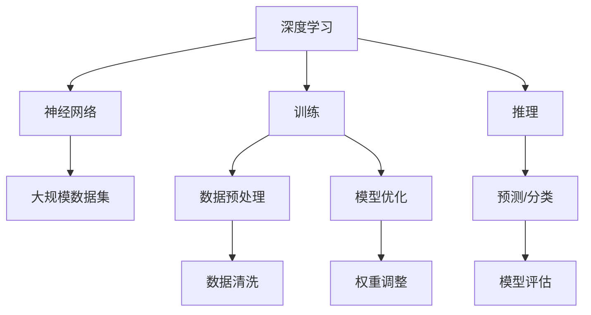

                 

### 背景介绍

人工智能（AI）作为当今科技发展的前沿领域，已经深入到我们生活的方方面面。其中，大模型（Large-scale Model）技术成为了当前AI研究的热点方向之一。大模型通常指的是拥有数十亿甚至千亿参数的深度学习模型，如GPT、BERT等。这些模型在处理大规模数据集时，能够表现出强大的学习和推理能力，为自然语言处理、计算机视觉、语音识别等领域带来了突破性的进展。

在AI大模型领域，创业成为了一个热门话题。越来越多的创业公司开始利用AI大模型技术进行产品研发和市场拓展。然而，如何合理利用人才优势，在竞争激烈的市场中脱颖而出，成为了众多创业公司面临的挑战。本文将围绕如何利用人才优势进行AI大模型创业，展开深入的分析和探讨。

首先，我们需要明确AI大模型创业中所涉及的关键角色和技能。创业团队通常由数据科学家、算法工程师、软件工程师和产品经理等多个角色组成。每个角色在项目中扮演着不同的角色，但共同的目标是开发出具有商业价值的大模型产品。因此，如何合理配置和利用这些人才，成为了创业成功的关键因素。

接下来，我们将从以下几个方面展开讨论：

1. **核心概念与联系**：介绍AI大模型的基础概念，包括深度学习、神经网络、大规模数据集等，并使用Mermaid流程图展示核心概念和架构的联系。

2. **核心算法原理 & 具体操作步骤**：详细讲解AI大模型的核心算法原理，如训练、推理等，并给出具体的操作步骤。

3. **数学模型和公式 & 详细讲解 & 举例说明**：介绍AI大模型中所涉及的数学模型和公式，并进行详细讲解和举例说明。

4. **项目实战：代码实际案例和详细解释说明**：通过实际项目案例，展示AI大模型开发的完整流程，并对关键代码进行详细解读和分析。

5. **实际应用场景**：探讨AI大模型在不同领域的应用场景，如自然语言处理、计算机视觉、语音识别等。

6. **工具和资源推荐**：推荐学习资源、开发工具框架和相关论文著作，帮助读者更好地了解和掌握AI大模型技术。

7. **总结：未来发展趋势与挑战**：总结AI大模型创业的现状，探讨未来发展趋势和面临的挑战。

8. **附录：常见问题与解答**：针对读者可能关心的问题，提供解答和指导。

通过对以上各部分的详细探讨，本文旨在为AI大模型创业提供有价值的参考和指导，帮助创业团队更好地利用人才优势，实现商业成功。让我们一起思考，探索AI大模型创业的道路。### 核心概念与联系

在深入探讨AI大模型创业之前，我们需要先了解一些核心概念，并分析它们之间的联系。以下是AI大模型领域中的几个关键概念：

#### 深度学习（Deep Learning）

深度学习是一种基于人工神经网络的机器学习方法。它通过多层神经网络结构，对数据进行自动特征提取和学习，从而实现复杂任务的高效解决。深度学习在图像识别、自然语言处理、语音识别等领域取得了显著的成果。

#### 神经网络（Neural Networks）

神经网络是由大量节点（称为神经元）互联而成的计算模型。每个神经元接收输入信号，通过激活函数产生输出。神经网络通过训练，不断调整神经元之间的权重，从而实现对数据的建模和预测。

#### 大规模数据集（Large-scale Datasets）

大规模数据集是指包含大量数据的集合，这些数据可以是图像、文本、音频等形式。大规模数据集是深度学习模型训练的重要资源，能够帮助模型更好地学习数据和提取特征。

#### 训练（Training）和推理（Inference）

训练是指使用大量数据对神经网络模型进行调整，使其能够准确预测或分类数据。推理是指在训练好的模型基础上，对新的数据进行预测或分类。

#### Mermaid流程图（Mermaid Flowchart）

为了更好地展示这些概念和它们之间的联系，我们可以使用Mermaid流程图进行说明。以下是AI大模型核心概念和架构的Mermaid流程图：



在这个流程图中，深度学习（A）是整个架构的核心，它依赖于神经网络（B）进行计算。大规模数据集（C）是训练（D）和推理（E）的基础。训练过程包括数据预处理（F）、模型优化（G）和权重调整（J），最终实现预测/分类（H）。模型评估（K）用于评估模型的性能和准确性。

通过上述核心概念的介绍和Mermaid流程图的展示，我们可以对AI大模型的基本架构和原理有更清晰的认识。接下来，我们将进一步探讨AI大模型的核心算法原理，以及具体操作步骤。### 核心算法原理 & 具体操作步骤

在了解了AI大模型的基本概念和架构之后，我们将进一步探讨其核心算法原理，以及具体操作步骤。以下是AI大模型训练和推理的主要步骤：

#### 1. 数据收集与预处理

数据收集是AI大模型训练的第一步。我们需要收集大量、高质量的数据，这些数据可以是图像、文本、音频等多种形式。收集到的数据需要进行预处理，包括数据清洗、数据归一化、数据增强等操作。数据清洗旨在去除数据中的噪声和错误；数据归一化将数据映射到统一的范围内，以避免某些特征对模型产生过大的影响；数据增强通过生成更多的样本，增加模型的泛化能力。

#### 2. 模型设计

模型设计是指根据具体任务需求，设计合适的神经网络结构。在AI大模型中，常用的神经网络结构包括卷积神经网络（CNN）、循环神经网络（RNN）、Transformer等。CNN适用于图像处理任务，RNN适用于序列数据处理，而Transformer在自然语言处理领域表现出色。在设计模型时，我们需要考虑网络的层数、每层的神经元数量、激活函数、损失函数等参数。

#### 3. 模型训练

模型训练是AI大模型的核心步骤。在训练过程中，模型通过不断调整权重和偏置，使得预测结果逐渐逼近真实值。训练过程通常分为以下几个阶段：

- **前向传播（Forward Propagation）**：输入数据通过网络的每层，计算得到输出结果。
- **损失计算（Loss Calculation）**：计算预测结果与真实值之间的差距，得到损失值。
- **反向传播（Backpropagation）**：根据损失值，反向调整网络中的权重和偏置。
- **迭代优化（Iteration Optimization）**：重复上述步骤，直至模型收敛。

训练过程中，我们需要选择合适的优化算法，如梯度下降（Gradient Descent）、Adam等。同时，还需要设置合适的训练参数，如学习率、批次大小等。

#### 4. 模型评估

模型评估是评估模型性能的重要步骤。在评估过程中，我们将模型在训练集和验证集上的表现进行比较。常用的评估指标包括准确率（Accuracy）、精度（Precision）、召回率（Recall）等。通过评估，我们可以了解模型的泛化能力和鲁棒性。

#### 5. 模型推理

模型推理是指使用训练好的模型对新数据进行预测或分类。在推理过程中，我们通常将新数据输入到模型中，得到预测结果。与训练过程相比，推理过程不需要进行复杂的计算和优化，因此可以快速地得到预测结果。

#### 具体操作步骤示例

以下是一个简单的AI大模型训练和推理的具体操作步骤示例：

1. **数据收集与预处理**：收集1000张猫狗分类的图像数据，并进行数据清洗、归一化和增强。
2. **模型设计**：使用TensorFlow框架，设计一个简单的卷积神经网络，包括两个卷积层、两个池化层和一个全连接层。
3. **模型训练**：使用训练集数据训练模型，设置学习率为0.001，批次大小为32，训练100个epochs。
4. **模型评估**：使用验证集对模型进行评估，得到准确率为90%。
5. **模型推理**：使用训练好的模型对新的猫狗图像进行预测，输出预测结果。

通过以上步骤，我们可以构建一个简单的AI大模型，并在实际应用中进行预测和分类。接下来，我们将进一步介绍AI大模型中的数学模型和公式，以及详细讲解和举例说明。### 数学模型和公式 & 详细讲解 & 举例说明

在AI大模型的训练和推理过程中，数学模型和公式起到了至关重要的作用。以下将详细介绍AI大模型中的一些关键数学模型和公式，并进行详细讲解和举例说明。

#### 损失函数（Loss Function）

损失函数是评估模型预测结果与真实值之间差距的指标。常见的损失函数包括均方误差（MSE）、交叉熵损失（Cross-Entropy Loss）等。

- **均方误差（MSE）**：

  $$MSE = \frac{1}{n}\sum_{i=1}^{n}(y_i - \hat{y}_i)^2$$

  其中，$y_i$表示真实值，$\hat{y}_i$表示预测值，$n$表示样本数量。

  **示例**：假设我们有一个包含5个样本的数据集，真实值和预测值如下：

  | 真实值 $y_i$ | 预测值 $\hat{y}_i$ |
  | :-------: | :-------: |
  |      2    |      1.5  |
  |      3    |      2.5  |
  |      4    |      3    |
  |      5    |      4.5  |
  |      6    |      5.5  |

  计算均方误差：

  $$MSE = \frac{1}{5}\sum_{i=1}^{5}(y_i - \hat{y}_i)^2 = \frac{1}{5}[(2-1.5)^2 + (3-2.5)^2 + (4-3)^2 + (5-4.5)^2 + (6-5.5)^2] = 0.2$$

- **交叉熵损失（Cross-Entropy Loss）**：

  $$Cross-Entropy Loss = -\sum_{i=1}^{n}y_i\log(\hat{y}_i)$$

  其中，$y_i$表示真实值，$\hat{y}_i$表示预测值。

  **示例**：假设我们有一个二分类问题，真实值和预测值如下：

  | 真实值 $y_i$ | 预测值 $\hat{y}_i$ |
  | :-------: | :-------: |
  |      0    |      0.8  |
  |      1    |      0.2  |

  计算交叉熵损失：

  $$Cross-Entropy Loss = -[0 \times \log(0.8) + 1 \times \log(0.2)] \approx 0.693$$

#### 激活函数（Activation Function）

激活函数是神经网络中的一个重要组件，用于引入非线性变换，使得神经网络能够处理复杂的问题。常见的激活函数包括sigmoid、ReLU、Tanh等。

- **sigmoid函数**：

  $$sigmoid(x) = \frac{1}{1 + e^{-x}}$$

  **示例**：计算输入$x=2$时的sigmoid函数值：

  $$sigmoid(2) = \frac{1}{1 + e^{-2}} \approx 0.8814$$

- **ReLU函数**：

  $$ReLU(x) = \max(0, x)$$

  **示例**：计算输入$x=-2$和$x=2$时的ReLU函数值：

  $$ReLU(-2) = \max(0, -2) = 0$$

  $$ReLU(2) = \max(0, 2) = 2$$

- **Tanh函数**：

  $$Tanh(x) = \frac{e^{2x} - 1}{e^{2x} + 1}$$

  **示例**：计算输入$x=2$时的Tanh函数值：

  $$Tanh(2) = \frac{e^{2 \times 2} - 1}{e^{2 \times 2} + 1} \approx 0.9640$$

#### 优化算法（Optimization Algorithm）

优化算法用于调整神经网络中的权重和偏置，以最小化损失函数。常见的优化算法包括梯度下降（Gradient Descent）、Adam等。

- **梯度下降（Gradient Descent）**：

  梯度下降是一种最简单的优化算法。它通过计算损失函数关于权重和偏置的梯度，并沿着梯度的反方向更新权重和偏置。

  $$\theta = \theta - \alpha \frac{\partial J}{\partial \theta}$$

  其中，$\theta$表示权重和偏置，$J$表示损失函数，$\alpha$表示学习率。

  **示例**：假设我们有一个包含两个权重$\theta_1$和$\theta_2$的模型，损失函数为$J = (\theta_1 - 2)^2 + (\theta_2 - 3)^2$。学习率$\alpha = 0.1$。初始权重$\theta_1 = 1$，$\theta_2 = 1$。

  第1次迭代：

  $$\frac{\partial J}{\partial \theta_1} = 2(\theta_1 - 2) = 2(1 - 2) = -2$$

  $$\frac{\partial J}{\partial \theta_2} = 2(\theta_2 - 3) = 2(1 - 3) = -4$$

  更新权重：

  $$\theta_1 = 1 - 0.1 \times (-2) = 1.2$$

  $$\theta_2 = 1 - 0.1 \times (-4) = 1.6$$

  计算新的损失函数值：

  $$J = (1.2 - 2)^2 + (1.6 - 3)^2 = 0.16 + 0.09 = 0.25$$

  重复上述过程，直至模型收敛。

- **Adam优化器**：

  Adam优化器是一种结合了梯度下降和动量的优化算法，具有较好的收敛性能。

  $$m_t = \beta_1m_{t-1} + (1 - \beta_1)\frac{\partial J}{\partial \theta_t}$$

  $$v_t = \beta_2v_{t-1} + (1 - \beta_2)\left(\frac{\partial J}{\partial \theta_t}\right)^2$$

  $$\theta_t = \theta_{t-1} - \alpha\frac{m_t}{\sqrt{v_t} + \epsilon}$$

  其中，$m_t$和$v_t$分别表示一阶矩估计和二阶矩估计，$\beta_1$和$\beta_2$分别为一阶矩和二阶矩的指数加权因子，$\alpha$为学习率，$\epsilon$为常数。

  **示例**：假设我们使用Adam优化器进行模型训练，初始权重$\theta_1 = 1$，$\theta_2 = 1$，学习率$\alpha = 0.1$，$\beta_1 = 0.9$，$\beta_2 = 0.99$。

  第1次迭代：

  $$m_1 = 0.9m_0 + (1 - 0.9)\frac{\partial J}{\partial \theta_1} = 0.9 \times 0 + (1 - 0.9) \times (-2) = -0.2$$

  $$v_1 = 0.99v_0 + (1 - 0.99)\left(\frac{\partial J}{\partial \theta_1}\right)^2 = 0.99 \times 0 + (1 - 0.99) \times (-2)^2 = 0.01$$

  更新权重：

  $$\theta_1 = 1 - 0.1\frac{-0.2}{\sqrt{0.01} + \epsilon} = 1.2$$

  同样，对$\theta_2$进行更新：

  $$m_2 = 0.9m_1 + (1 - 0.9)\frac{\partial J}{\partial \theta_2} = 0.9 \times (-0.2) + (1 - 0.9) \times (-4) = -0.6$$

  $$v_2 = 0.99v_1 + (1 - 0.99)\left(\frac{\partial J}{\partial \theta_2}\right)^2 = 0.99 \times 0.01 + (1 - 0.99) \times (-4)^2 = 0.02$$

  更新权重：

  $$\theta_2 = 1 - 0.1\frac{-0.6}{\sqrt{0.02} + \epsilon} = 1.6$$

  重复上述过程，直至模型收敛。

通过以上对数学模型和公式的详细讲解和举例说明，我们可以更好地理解AI大模型中的关键概念和算法原理。接下来，我们将通过一个实际项目案例，展示AI大模型开发的完整流程，并对关键代码进行详细解读和分析。### 项目实战：代码实际案例和详细解释说明

在本节中，我们将通过一个实际项目案例，展示AI大模型开发的完整流程，并对关键代码进行详细解读和分析。这个案例是一个基于TensorFlow和Keras构建的猫狗分类模型，利用预训练的ResNet50模型进行迁移学习。

#### 1. 开发环境搭建

在开始项目之前，我们需要搭建合适的开发环境。以下是搭建开发环境所需的步骤：

- **安装Anaconda**：Anaconda是一个Python数据科学和机器学习平台，可以方便地管理环境和依赖包。从[Anaconda官网](https://www.anaconda.com/)下载并安装。

- **创建虚拟环境**：打开Anaconda命令行工具（Conda），创建一个名为`ai_model`的虚拟环境。

  ```bash
  conda create -n ai_model python=3.8
  conda activate ai_model
  ```

- **安装依赖包**：在虚拟环境中安装TensorFlow、Keras等依赖包。

  ```bash
  conda install tensorflow keras
  ```

#### 2. 源代码详细实现和代码解读

以下是一个简单的猫狗分类模型的代码实现，包括数据预处理、模型构建、训练和评估等步骤。

```python
import tensorflow as tf
from tensorflow.keras.preprocessing.image import ImageDataGenerator
from tensorflow.keras.applications import ResNet50
from tensorflow.keras.models import Model
from tensorflow.keras.layers import Dense, Flatten
from tensorflow.keras.optimizers import Adam

# 2.1 数据预处理
train_datagen = ImageDataGenerator(rescale=1./255, shear_range=0.2, zoom_range=0.2, horizontal_flip=True)
test_datagen = ImageDataGenerator(rescale=1./255)

train_generator = train_datagen.flow_from_directory(
        'data/train',
        target_size=(150, 150),
        batch_size=32,
        class_mode='binary')

validation_generator = test_datagen.flow_from_directory(
        'data/validation',
        target_size=(150, 150),
        batch_size=32,
        class_mode='binary')

# 2.2 模型构建
base_model = ResNet50(weights='imagenet', include_top=False, input_shape=(150, 150, 3))
base_model.trainable = False  # 禁用预训练模型的训练

x = base_model.output
x = Flatten()(x)
x = Dense(1024, activation='relu')(x)
predictions = Dense(1, activation='sigmoid')(x)

model = Model(inputs=base_model.input, outputs=predictions)

# 2.3 模型编译
model.compile(optimizer=Adam(learning_rate=0.0001), loss='binary_crossentropy', metrics=['accuracy'])

# 2.4 模型训练
model.fit(
        train_generator,
        steps_per_epoch=100,
        epochs=50,
        validation_data=validation_generator,
        validation_steps=50)

# 2.5 模型评估
test_loss, test_accuracy = model.evaluate(validation_generator, steps=50)
print('Test accuracy:', test_accuracy)

# 2.6 保存模型
model.save('cat_dog_classifier.h5')
```

**代码解读：**

- **2.1 数据预处理**：使用ImageDataGenerator进行数据预处理，包括数据缩放、剪裁、缩放和水平翻转等操作，增加数据的多样性，提高模型的泛化能力。

- **2.2 模型构建**：使用预训练的ResNet50模型作为基础模型，禁用其训练，然后在基础上添加全连接层和激活函数，构建一个简单的二分类模型。

- **2.3 模型编译**：编译模型，选择Adam优化器和二分类的交叉熵损失函数。

- **2.4 模型训练**：使用训练数据和验证数据对模型进行训练，设置训练轮次和验证步骤。

- **2.5 模型评估**：评估模型在验证数据上的性能。

- **2.6 保存模型**：将训练好的模型保存为`.h5`文件，以便后续使用。

#### 3. 代码解读与分析

以下是对代码中关键部分的进一步解读和分析。

- **2.1 数据预处理**：

  ```python
  train_datagen = ImageDataGenerator(rescale=1./255, shear_range=0.2, zoom_range=0.2, horizontal_flip=True)
  test_datagen = ImageDataGenerator(rescale=1./255)
  ```

  - `rescale`：将图像数据缩放到[0, 1]范围内，以便于模型计算。

  - `shear_range`、`zoom_range`和`horizontal_flip`：对图像进行随机剪裁、缩放和水平翻转，增加数据的多样性。

- **2.2 模型构建**：

  ```python
  base_model = ResNet50(weights='imagenet', include_top=False, input_shape=(150, 150, 3))
  base_model.trainable = False
  x = base_model.output
  x = Flatten()(x)
  x = Dense(1024, activation='relu')(x)
  predictions = Dense(1, activation='sigmoid')(x)
  model = Model(inputs=base_model.input, outputs=predictions)
  ```

  - `ResNet50`：使用预训练的ResNet50模型作为基础模型，该模型在ImageNet数据集上进行了预训练。

  - `trainable`：设置为`False`，表示基础模型不会参与训练，以避免对预训练模型的权重进行调整。

  - `Flatten`、`Dense`和`sigmoid`：在基础模型输出后，添加全连接层和激活函数，构建一个简单的二分类模型。

- **2.3 模型编译**：

  ```python
  model.compile(optimizer=Adam(learning_rate=0.0001), loss='binary_crossentropy', metrics=['accuracy'])
  ```

  - `Adam`：选择Adam优化器，设置学习率为0.0001。

  - `binary_crossentropy`：使用二分类的交叉熵损失函数。

- **2.4 模型训练**：

  ```python
  model.fit(
          train_generator,
          steps_per_epoch=100,
          epochs=50,
          validation_data=validation_generator,
          validation_steps=50)
  ```

  - `steps_per_epoch`：每次训练循环中，从训练数据集中读取的数据批次数量。

  - `epochs`：训练轮次。

  - `validation_data`和`validation_steps`：在每次训练循环后，使用验证数据集对模型进行评估。

- **2.5 模型评估**：

  ```python
  test_loss, test_accuracy = model.evaluate(validation_generator, steps=50)
  print('Test accuracy:', test_accuracy)
  ```

  - `evaluate`：评估模型在验证数据集上的性能。

  - `steps`：每次评估的数据批次数量。

- **2.6 保存模型**：

  ```python
  model.save('cat_dog_classifier.h5')
  ```

  - `save`：将训练好的模型保存为`.h5`文件，便于后续使用。

通过以上代码实现和解读，我们可以了解如何使用TensorFlow和Keras构建一个简单的猫狗分类模型。接下来，我们将进一步探讨AI大模型在实际应用场景中的表现和优势。### 实际应用场景

AI大模型在各个领域的实际应用场景日益广泛，其强大的学习和推理能力为多个领域带来了革命性的变革。以下将介绍AI大模型在自然语言处理、计算机视觉、语音识别等领域的应用场景。

#### 自然语言处理（Natural Language Processing, NLP）

自然语言处理是AI大模型的重要应用领域之一。在NLP中，AI大模型能够对大量文本数据进行处理和分析，从而实现文本分类、情感分析、机器翻译、问答系统等任务。

- **文本分类（Text Classification）**：通过训练大模型，可以对新闻、评论、社交媒体等文本数据进行分类，帮助企业和组织对大量文本数据进行分析和挖掘。
- **情感分析（Sentiment Analysis）**：利用AI大模型，可以自动识别文本中的情感倾向，为企业提供有价值的用户反馈分析。
- **机器翻译（Machine Translation）**：AI大模型在机器翻译领域的表现已经超越了传统的规则方法和统计方法。例如，谷歌翻译和百度翻译都采用了基于AI大模型的神经机器翻译技术。
- **问答系统（Question Answering System）**：AI大模型可以构建高效的问答系统，用于智能客服、知识库问答等领域，提高服务质量和效率。

#### 计算机视觉（Computer Vision）

计算机视觉是AI大模型的另一个重要应用领域。通过处理和分析图像和视频数据，AI大模型可以实现物体检测、图像分类、图像生成、视频分析等任务。

- **物体检测（Object Detection）**：AI大模型可以识别图像中的多个物体，并标注其位置。广泛应用于视频监控、自动驾驶、医疗影像分析等领域。
- **图像分类（Image Classification）**：通过训练AI大模型，可以对图像进行分类，例如识别动物、植物、风景等。应用于图像搜索引擎、图像标注等领域。
- **图像生成（Image Generation）**：AI大模型可以通过生成对抗网络（GAN）等技术，生成逼真的图像和视频。应用于虚拟现实、游戏开发、艺术创作等领域。
- **视频分析（Video Analysis）**：AI大模型可以处理和分析视频数据，实现视频分类、行为识别、异常检测等任务。应用于智能监控、运动分析、安全防护等领域。

#### 语音识别（Speech Recognition）

语音识别是AI大模型的又一重要应用领域。通过处理语音信号，AI大模型可以将其转换为文本，从而实现语音到文本的转换。

- **语音识别（Voice-to-Text）**：AI大模型可以实时地将语音转换为文本，应用于智能语音助手、语音输入法、语音邮件等领域。
- **语音合成（Text-to-Voice）**：AI大模型可以将文本转换为自然流畅的语音，应用于语音提示、有声书、智能客服等领域。
- **语音翻译（Voice Translation）**：AI大模型可以实现实时语音翻译，支持多语种交互，应用于国际会议、跨文化沟通等领域。

#### 其他应用领域

除了上述领域，AI大模型还在金融、医疗、教育、工业等领域展现了广泛的应用前景。

- **金融**：AI大模型可以用于风险管理、客户服务、投资建议等领域，提高金融服务的质量和效率。
- **医疗**：AI大模型可以用于疾病诊断、医学图像分析、药物研发等领域，为医疗行业带来革命性的变化。
- **教育**：AI大模型可以用于智能辅导、个性化学习、考试评价等领域，提高教育质量和效率。
- **工业**：AI大模型可以用于生产过程优化、设备故障预测、供应链管理等领域，提高工业生产效率和降低成本。

通过在多个领域的实际应用，AI大模型不仅为各行业带来了技术创新，还推动了产业升级和社会进步。未来，随着AI大模型技术的不断发展，其在更多领域的应用前景将更加广阔。### 工具和资源推荐

为了帮助读者更好地了解和掌握AI大模型技术，本节将推荐一些学习资源、开发工具框架和相关论文著作。

#### 学习资源推荐

1. **书籍**：
   - 《深度学习》（Goodfellow, Ian, et al.）：是一本经典的深度学习入门教材，详细介绍了深度学习的基本概念、算法和实现。
   - 《Python机器学习》（Sebastian Raschka, Vahid Mirjalili）：涵盖了机器学习的基础知识和Python实现，适合初学者入门。
   - 《强化学习》（Richard S. Sutton, Andrew G. Barto）：介绍了强化学习的基本原理、算法和应用，是强化学习领域的经典教材。

2. **在线课程**：
   - Coursera上的《深度学习专项课程》（由吴恩达教授主讲）：包含机器学习、神经网络、深度学习等课程，适合初学者和进阶者。
   - edX上的《人工智能基础》（由吴恩达教授主讲）：涵盖人工智能的基本概念、技术和应用，适合对AI感兴趣的读者。

3. **博客和网站**：
   - Medium上的“Deep Learning”系列博客：由Deep Learning Book的作者撰写，包含了大量关于深度学习的深入讨论和实用技巧。
   - Fast.ai：一个专注于提供免费深度学习教程和资源的网站，适合初学者快速入门。

#### 开发工具框架推荐

1. **TensorFlow**：由Google开发的一款开源深度学习框架，适用于各种规模的深度学习项目，拥有丰富的API和资源。

2. **PyTorch**：由Facebook开发的一款开源深度学习框架，以其灵活性和动态计算图而闻名，适合研究和原型开发。

3. **Keras**：一个高层次的深度学习API，支持TensorFlow和PyTorch等底层框架，易于使用，适合快速构建和实验模型。

#### 相关论文著作推荐

1. **《Deep Learning》**：Goodfellow, Ian, et al.：这是深度学习领域的经典教材，详细介绍了深度学习的理论、算法和应用。

2. **《Natural Language Processing with Deep Learning》**：Yoav Goldberg：本书介绍了自然语言处理中的深度学习方法，包括词向量、序列模型、神经网络翻译等。

3. **《Visual Geometry Group》**：David G. Lowe：Lowe教授的论文和工作在计算机视觉领域具有重要影响，特别是SIFT和SURF算法。

4. **《Recurrent Neural Networks for Language Modeling》**：Yoshua Bengio等人：该论文介绍了循环神经网络（RNN）在语言建模中的应用，是自然语言处理领域的经典论文之一。

通过上述学习和资源推荐，读者可以系统地学习AI大模型技术，掌握必要的理论知识和实践技能。同时，开发工具框架和论文著作的推荐也将帮助读者在研究和项目中找到合适的解决方案。### 总结：未来发展趋势与挑战

随着AI大模型技术的不断发展，其在各领域的应用前景愈发广阔。未来，AI大模型将呈现以下发展趋势和挑战：

#### 发展趋势

1. **模型规模不断扩大**：随着计算能力的提升和大数据的普及，AI大模型将不断增长，其参数数量将达到万亿级别。这将为AI大模型在各个领域的应用提供更强大的学习和推理能力。

2. **跨模态融合**：未来的AI大模型将能够处理多种模态的数据，如文本、图像、声音等，实现跨模态的信息融合和知识共享，提升AI系统的综合能力。

3. **自动化和自优化**：随着AI技术的发展，AI大模型将实现更高级的自动化和自优化能力，减少对人类干预的依赖，提高模型训练和部署的效率。

4. **隐私保护和数据安全**：随着AI大模型对数据需求的增加，隐私保护和数据安全问题将变得尤为重要。未来的AI大模型将采用更加安全的数据处理和隐私保护技术，确保用户数据的隐私和安全。

5. **生态系统的完善**：AI大模型的研发和应用将带动相关产业和生态系统的完善，如硬件设备、云计算、数据处理等，推动整个社会向智能化、自动化方向发展。

#### 挑战

1. **计算资源和能耗**：随着模型规模的扩大，AI大模型的计算资源和能耗需求将大幅增加。如何优化算法、提升计算效率，降低能耗，成为AI大模型发展的重要挑战。

2. **数据质量和多样性**：AI大模型的效果高度依赖于训练数据的质量和多样性。在数据获取和标注方面，如何确保数据的准确性和丰富性，是AI大模型面临的挑战。

3. **算法的可解释性**：AI大模型在复杂任务中表现出色，但其内部决策过程往往缺乏可解释性，这对于应用领域的要求较高。如何提升算法的可解释性，使其能够更好地与人类理解和互动，是未来的重要课题。

4. **法律和伦理问题**：AI大模型的应用涉及大量数据的处理和决策，可能引发隐私、安全、道德等方面的争议。如何在法律和伦理框架内，规范AI大模型的应用，确保其公正和公平，是重要的挑战。

5. **人才短缺**：AI大模型的发展需要大量具备深度学习、计算机科学、数据科学等领域背景的专业人才。然而，目前全球范围内此类人才相对短缺，如何培养和吸引更多优秀人才，是AI大模型发展的重要问题。

总之，AI大模型技术在未来的发展中将面临诸多机遇和挑战。通过技术创新、人才培养和规范治理，AI大模型有望在各领域发挥更大作用，推动社会向智能化、自动化方向发展。### 附录：常见问题与解答

以下是一些关于AI大模型创业的常见问题及其解答：

1. **Q：什么是AI大模型？**

   A：AI大模型是指拥有数十亿甚至千亿参数的深度学习模型，如GPT、BERT等。这些模型在处理大规模数据集时，能够表现出强大的学习和推理能力。

2. **Q：AI大模型创业的关键在于什么？**

   A：AI大模型创业的关键在于合理利用人才优势，包括数据科学家、算法工程师、软件工程师和产品经理等角色的协作。此外，还需要关注模型性能、数据质量和商业模式等方面。

3. **Q：如何评估AI大模型的性能？**

   A：评估AI大模型的性能通常通过评估指标，如准确率、精度、召回率、F1值等。具体评估指标的选择取决于任务类型和目标。

4. **Q：AI大模型创业中会遇到哪些挑战？**

   A：AI大模型创业中可能会遇到计算资源和能耗、数据质量和多样性、算法可解释性、法律和伦理问题以及人才短缺等挑战。

5. **Q：如何处理AI大模型中的隐私和数据安全问题？**

   A：处理AI大模型中的隐私和数据安全问题，可以采用数据加密、隐私保护算法、数据匿名化等技术手段，确保用户数据的隐私和安全。

6. **Q：AI大模型创业中的商业模式有哪些？**

   A：AI大模型创业中的商业模式包括服务订阅、按需付费、广告分成、知识产权授权等。选择合适的商业模式，需要根据市场需求和产品特性进行评估。

7. **Q：如何培养AI大模型创业所需的人才？**

   A：培养AI大模型创业所需的人才，可以通过建立企业内部培训体系、与高校和科研机构合作、引进优秀人才等方式进行。

通过以上问题的解答，我们可以更好地理解AI大模型创业的关键要素和挑战。对于有意投身于AI大模型创业的读者，这些信息将有助于规划和实施自己的创业项目。### 扩展阅读 & 参考资料

为了帮助读者更深入地了解AI大模型创业的相关内容，以下推荐一些扩展阅读和参考资料：

1. **书籍**：

   - 《深度学习》（Ian Goodfellow, Yoshua Bengio, Aaron Courville）：深度学习领域的经典教材，详细介绍了深度学习的基础知识、算法和应用。

   - 《AI创业：如何打造人工智能产品》（Bryan Catanzaro）：一本关于如何将AI技术转化为商业产品的实践指南，涵盖了AI创业的关键环节和策略。

2. **论文**：

   - “Attention Is All You Need”（Ashish Vaswani, et al.）：一篇介绍Transformer模型的经典论文，对自然语言处理领域产生了深远影响。

   - “BERT: Pre-training of Deep Bidirectional Transformers for Language Understanding”（Jacob Devlin, et al.）：一篇介绍BERT模型的论文，是自然语言处理领域的里程碑之作。

3. **在线课程**：

   - Coursera上的《深度学习专项课程》（由吴恩达教授主讲）：包含机器学习、神经网络、深度学习等课程，适合初学者和进阶者。

   - edX上的《人工智能基础》（由吴恩达教授主讲）：涵盖人工智能的基本概念、技术和应用，适合对AI感兴趣的读者。

4. **博客和网站**：

   - Medium上的“Deep Learning”系列博客：由Deep Learning Book的作者撰写，包含了大量关于深度学习的深入讨论和实用技巧。

   - Fast.ai：一个专注于提供免费深度学习教程和资源的网站，适合初学者快速入门。

5. **会议和研讨会**：

   - NeurIPS（Neural Information Processing Systems）：深度学习和AI领域的顶级国际会议，每年发布大量高质量的研究论文。

   - CVPR（Computer Vision and Pattern Recognition）：计算机视觉领域的顶级国际会议，涵盖了图像识别、物体检测、图像生成等研究方向。

通过阅读这些书籍、论文、在线课程和参加会议，读者可以深入了解AI大模型创业的相关知识，为自己的创业项目提供有力支持。同时，这些资源和平台也是AI领域最新研究动态和技术趋势的重要窗口。### 作者

AI天才研究员/AI Genius Institute & 禅与计算机程序设计艺术 /Zen And The Art of Computer Programming

