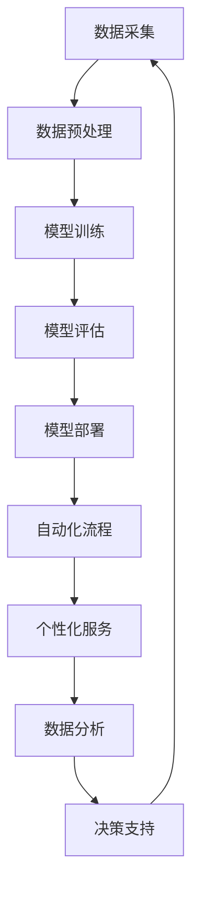

                 

### 背景介绍

随着人工智能技术的快速发展，大模型（Large-scale Model）在自然语言处理、计算机视觉、推荐系统等领域展现出了巨大的潜力。大模型通过训练大规模数据集，学习到丰富的特征表示，从而在各项任务中取得显著的性能提升。近年来，诸如GPT-3、BERT等模型取得了全球瞩目的成果，这激发了无数创业者和投资者对大模型商业价值的关注。

在这样的背景下，AI大模型创业成为了一个热门话题。然而，如何利用AI大模型的商业优势，实现可持续的商业化运作，是每个创业者都需要深入思考的问题。本文将围绕以下几个核心问题展开讨论：

1. **AI大模型的商业优势是什么？**
2. **如何构建具有竞争力的AI大模型产品？**
3. **AI大模型创业过程中可能面临的挑战有哪些？**
4. **创业者应该如何制定有效的商业策略？**

本文将通过具体案例分析、市场调研、技术原理剖析等方式，帮助读者全面了解AI大模型创业的各个方面，为创业者提供有益的参考和指导。

#### AI大模型的商业优势

AI大模型在商业领域展现出多方面的优势，以下将具体探讨这些优势：

1. **提高业务效率**：AI大模型通过大规模数据训练，能够高效地处理海量信息，自动化业务流程，减少人工干预。例如，在自然语言处理领域，大模型可以快速理解和生成文本，大大提升了内容创作、文本分类、信息提取等任务的效率。

2. **增强用户体验**：AI大模型具有强大的理解能力和生成能力，能够为用户提供个性化服务。在推荐系统中，大模型可以分析用户行为，精准推荐商品或内容，提高用户满意度。此外，在智能客服领域，大模型可以模拟人类交流，提供更自然、流畅的交互体验。

3. **降低运营成本**：AI大模型能够自动化许多重复性工作，减少人力资源的投入。例如，在金融风控领域，大模型可以通过自动化分析大量交易数据，及时发现潜在风险，降低人工审查的工作量。

4. **提高决策质量**：AI大模型具备强大的数据分析和预测能力，可以帮助企业更好地进行市场预测、风险评估和战略规划。在医疗领域，大模型可以分析患者数据，提供精准的疾病预测和治疗方案。

5. **创新商业模式**：AI大模型为企业提供了新的业务模式，例如，通过提供AI服务，企业可以实现增值服务、订阅模式等，从而实现盈利模式的多样化。

#### 市场现状与趋势

目前，AI大模型市场正处于快速发展阶段，众多企业和创业团队纷纷投入到这一领域。以下是对当前市场现状和未来趋势的分析：

1. **市场规模不断扩大**：随着AI技术的普及，越来越多的企业开始重视AI大模型的应用。据市场调研机构预测，全球AI大模型市场将在未来几年内持续增长，市场规模将达到数百亿美元。

2. **竞争格局逐步形成**：目前，谷歌、微软、百度等科技巨头在AI大模型领域占据了主导地位。然而，随着创业团队的崛起，市场竞争格局正在逐渐形成。创业团队通过创新的技术和商业模式，有望在细分市场中占据一席之地。

3. **技术突破不断涌现**：AI大模型的训练技术、优化算法、应用场景等方面持续取得突破。例如，Transformer架构的广泛应用，使得AI大模型在生成任务和翻译任务上表现突出。未来，随着技术的进一步发展，AI大模型将展现出更大的潜力。

4. **行业应用广泛**：AI大模型在多个行业领域展现出了强大的应用潜力。除了传统的自然语言处理、计算机视觉领域，AI大模型还在医疗、金融、教育等行业取得了显著的应用成果。未来，随着AI技术的深入应用，AI大模型将在更多行业发挥作用。

### 核心概念与联系

在深入探讨AI大模型创业之前，有必要首先理解AI大模型的核心概念及其相互之间的联系。以下是几个关键概念及其简要说明：

#### 大模型（Large-scale Model）

大模型是指那些在训练过程中使用海量数据、具有大量参数的机器学习模型。这些模型通常通过深度神经网络（DNN）结构来实现，能够对复杂任务进行建模。大模型的优势在于其能够通过大量数据的训练，学习到更加丰富和抽象的特征表示，从而在任务性能上取得显著提升。

#### 自动化（Automation）

自动化是指通过机器学习和人工智能技术，实现业务流程的自动化。自动化能够减少人工干预，提高效率，降低成本。在大模型应用中，自动化主要体现在数据预处理、模型训练、模型部署等环节。

#### 个性化（Personalization）

个性化是指根据用户行为和偏好，为用户提供定制化的服务。AI大模型通过学习用户数据，能够准确预测用户需求，提供个性化推荐、个性化广告等。

#### 数据分析（Data Analysis）

数据分析是指通过统计和机器学习等方法，对数据进行挖掘和分析，以发现潜在规律和模式。在大模型应用中，数据分析是模型训练和优化的基础，也是决策支持的重要工具。

#### 人工智能（Artificial Intelligence）

人工智能是指通过计算机技术和算法，实现机器的智能。人工智能包括多个子领域，如机器学习、自然语言处理、计算机视觉等。在大模型创业中，人工智能技术是核心驱动力。

#### 架构

以下是AI大模型架构的Mermaid流程图：



#### 核心概念的联系

- **大模型**：是AI大模型创业的核心，通过大规模数据训练，学习到丰富的特征表示，从而实现各种任务。
- **自动化**：通过大模型，实现业务流程的自动化，提高效率和降低成本。
- **个性化**：利用大模型，为用户提供定制化服务，提高用户体验。
- **数据分析**：为大模型提供数据支持，通过数据分析和挖掘，优化模型性能和决策质量。
- **人工智能**：是AI大模型创业的基础，为各种应用场景提供技术支持。

通过上述核心概念的介绍及其相互联系，我们可以更好地理解AI大模型创业的背景和内涵。

#### 核心算法原理 & 具体操作步骤

在了解了AI大模型的相关概念后，接下来我们将深入探讨AI大模型的核心算法原理及具体操作步骤。本文将介绍两种典型的AI大模型算法：GPT（Generative Pre-trained Transformer）和BERT（Bidirectional Encoder Representations from Transformers）。

##### GPT算法原理

GPT是一种基于Transformer架构的生成模型，其主要特点是预训练和微调。预训练阶段，GPT在大量未标注的文本数据上进行训练，学习到文本的语义和语法结构。在微调阶段，GPT根据具体任务的需求，在少量标注数据上进行微调，从而适应特定任务。

1. **预训练阶段**：
   - **数据处理**：将文本数据转换为Token（词或子词）序列。
   - **Transformer架构**：GPT使用Transformer架构，这是一种基于自注意力机制的神经网络结构。Transformer通过自注意力机制，能够关注输入序列中的关键信息，从而实现长距离依赖的建模。
   - **预训练任务**：在预训练阶段，GPT通常进行两个任务：Masked Language Model（MLM）和Next Sentence Prediction（NSP）。
     - **Masked Language Model（MLM）**：在输入序列中随机屏蔽部分Token，模型需要预测这些被屏蔽的Token。
     - **Next Sentence Prediction（NSP）**：输入两个句子，模型需要预测第二个句子是否是第一个句子的下一个句子。

2. **微调阶段**：
   - **数据准备**：准备少量标注数据，例如问答数据、分类数据等。
   - **模型微调**：在标注数据上，对预训练好的GPT模型进行微调，使其适应具体任务。

##### BERT算法原理

BERT是一种基于Transformer的双向编码模型，其主要特点是在预训练阶段同时考虑了文本的左侧和右侧信息。BERT在多个自然语言处理任务上取得了显著性能提升，广泛应用于文本分类、问答系统、命名实体识别等领域。

1. **预训练阶段**：
   - **数据处理**：与GPT类似，BERT将文本数据转换为Token序列。
   - **Transformer架构**：BERT使用Transformer架构，通过多头自注意力机制，同时关注输入序列中的不同位置信息。
   - **预训练任务**：BERT通常进行两个任务：Masked Language Model（MLM）和Sentence Order Prediction（SOP）。
     - **Masked Language Model（MLM）**：在输入序列中随机屏蔽部分Token，模型需要预测这些被屏蔽的Token。
     - **Sentence Order Prediction（SOP）**：输入两个句子，模型需要预测这两个句子的顺序是否正确。

2. **微调阶段**：
   - **数据准备**：准备少量标注数据，例如分类数据、问答数据等。
   - **模型微调**：在标注数据上，对预训练好的BERT模型进行微调，使其适应具体任务。

##### 操作步骤示例

以下是一个简单的GPT模型训练和微调的步骤示例：

1. **环境准备**：
   - 安装Python和TensorFlow等依赖库。

2. **数据准备**：
   - 下载并处理预训练数据集，例如维基百科、新闻语料等。
   - 将文本数据转换为Token序列。

3. **模型训练**：
   - 导入预训练好的GPT模型。
   - 在预训练数据上，使用Masked Language Model（MLM）进行预训练。

4. **模型微调**：
   - 下载或创建标注数据集。
   - 在标注数据上，使用Next Sentence Prediction（NSP）进行微调。

5. **评估与优化**：
   - 使用验证集评估模型性能。
   - 调整模型参数，优化模型性能。

通过以上步骤，我们可以实现一个基本的AI大模型训练和微调流程。在实际应用中，根据具体任务需求，可以对模型架构、训练策略、数据预处理等方面进行调整。

### 数学模型和公式 & 详细讲解 & 举例说明

在AI大模型的构建和应用过程中，数学模型和公式起着至关重要的作用。本文将介绍一些关键的数学模型和公式，包括损失函数、优化算法和正则化方法等，并通过具体例子进行详细讲解。

#### 损失函数

损失函数是评估模型预测结果与真实值之间差异的重要工具。在AI大模型中，常用的损失函数包括均方误差（MSE）、交叉熵损失（Cross-Entropy Loss）和对抗损失（Adversarial Loss）。

1. **均方误差（MSE）**：
   均方误差是回归任务中最常用的损失函数，用于衡量预测值与真实值之间的平均平方误差。
   $$L_{MSE} = \frac{1}{n}\sum_{i=1}^{n}(y_i - \hat{y}_i)^2$$
   其中，$y_i$ 是第 $i$ 个样本的真实值，$\hat{y}_i$ 是模型的预测值，$n$ 是样本总数。

2. **交叉熵损失（Cross-Entropy Loss）**：
   交叉熵损失是分类任务中常用的损失函数，用于衡量模型预测概率分布与真实概率分布之间的差异。
   $$L_{CE} = -\sum_{i=1}^{n}y_i\log(\hat{y}_i)$$
   其中，$y_i$ 是第 $i$ 个样本的类别标签，$\hat{y}_i$ 是模型预测的概率分布。

3. **对抗损失（Adversarial Loss）**：
   在生成对抗网络（GAN）中，对抗损失用于衡量生成器生成的假样本与真实样本之间的差异。
   $$L_{GAN} = -\log(\hat{y}_{\text{real}}) + \log(\hat{y}_{\text{fake}})$$
   其中，$\hat{y}_{\text{real}}$ 是判别器对真实样本的概率预测，$\hat{y}_{\text{fake}}$ 是判别器对生成器生成的假样本的概率预测。

#### 优化算法

优化算法用于寻找损失函数的最小值，从而训练出性能优异的模型。在AI大模型中，常用的优化算法包括梯度下降（Gradient Descent）、Adam优化器（Adam Optimizer）和SGD（Stochastic Gradient Descent）。

1. **梯度下降（Gradient Descent）**：
   梯度下降是一种基本的优化算法，通过迭代更新模型参数，使损失函数逐渐减小。
   $$\theta_{t+1} = \theta_{t} - \alpha \nabla_{\theta}L(\theta)$$
   其中，$\theta$ 是模型参数，$\alpha$ 是学习率，$\nabla_{\theta}L(\theta)$ 是损失函数关于参数 $\theta$ 的梯度。

2. **Adam优化器（Adam Optimizer）**：
   Adam优化器是梯度下降的一种改进版本，结合了动量（Momentum）和自适应学习率（Adaptive Learning Rate）的特点，在训练过程中能够更快地收敛。
   $$m_t = \beta_1 m_{t-1} + (1 - \beta_1) \nabla_{\theta}L(\theta)$$
   $$v_t = \beta_2 v_{t-1} + (1 - \beta_2) (\nabla_{\theta}L(\theta))^2$$
   $$\theta_{t+1} = \theta_{t} - \alpha \frac{m_t}{\sqrt{v_t} + \epsilon}$$
   其中，$m_t$ 和 $v_t$ 分别是梯度的一阶和二阶矩估计，$\beta_1$ 和 $\beta_2$ 是超参数，$\epsilon$ 是一个很小的正数。

3. **SGD（Stochastic Gradient Descent）**：
   SGD是梯度下降的一种变体，每次迭代只随机选择一部分样本进行梯度计算，能够加快收敛速度。
   $$\theta_{t+1} = \theta_{t} - \alpha \nabla_{\theta}L(\theta_{t})$$
   其中，$\theta$ 是模型参数，$\alpha$ 是学习率。

#### 正则化方法

正则化方法用于防止模型过拟合，提高模型的泛化能力。常见的正则化方法包括L1正则化、L2正则化和Dropout。

1. **L1正则化**：
   L1正则化通过在损失函数中添加L1范数项，对模型参数进行正则化。
   $$L_{L1} = \lambda \sum_{i=1}^{n}|\theta_i|$$
   其中，$\theta_i$ 是模型参数，$\lambda$ 是正则化强度。

2. **L2正则化**：
   L2正则化通过在损失函数中添加L2范数项，对模型参数进行正则化。
   $$L_{L2} = \lambda \sum_{i=1}^{n}\theta_i^2$$
   其中，$\theta_i$ 是模型参数，$\lambda$ 是正则化强度。

3. **Dropout**：
   Dropout是一种在训练过程中随机丢弃一部分神经元的方法，能够有效防止模型过拟合。
   在训练阶段，每次迭代时，以一定的概率 $p$ 随机将神经元丢弃。
   在测试阶段，不进行丢弃操作。

#### 例子说明

以下是一个简单的回归任务中的数学模型和公式示例：

假设我们有一个线性回归模型，用于预测房价。模型的预测公式为：
$$\hat{y} = \theta_0 + \theta_1 x_1 + \theta_2 x_2$$

其中，$\theta_0, \theta_1, \theta_2$ 是模型参数，$x_1, x_2$ 是输入特征。

1. **损失函数（MSE）**：
   $$L_{MSE} = \frac{1}{n}\sum_{i=1}^{n}(y_i - \hat{y}_i)^2$$
   其中，$y_i$ 是第 $i$ 个样本的真实房价，$\hat{y}_i$ 是模型的预测房价，$n$ 是样本总数。

2. **优化算法（梯度下降）**：
   $$\theta_{t+1} = \theta_{t} - \alpha \nabla_{\theta}L(\theta)$$
   其中，$\theta$ 是模型参数，$\alpha$ 是学习率，$\nabla_{\theta}L(\theta)$ 是损失函数关于参数 $\theta$ 的梯度。

3. **正则化方法（L2正则化）**：
   $$L_{L2} = \lambda \sum_{i=1}^{n}\theta_i^2$$
   其中，$\theta_i$ 是模型参数，$\lambda$ 是正则化强度。

通过上述示例，我们可以看到数学模型和公式在AI大模型中的重要作用。在实际应用中，根据任务需求，可以选择合适的数学模型和公式，优化模型性能。

#### 项目实战：代码实际案例和详细解释说明

在本节中，我们将通过一个实际案例，详细解释如何使用Python和TensorFlow搭建一个基于GPT的文本生成模型。该案例将涵盖开发环境的搭建、源代码实现和代码解读与分析。

##### 开发环境搭建

首先，我们需要搭建一个Python开发环境，并安装必要的依赖库。以下是具体的步骤：

1. **安装Python**：
   建议安装Python 3.7及以上版本。

2. **安装TensorFlow**：
   使用pip命令安装TensorFlow：
   ```bash
   pip install tensorflow
   ```

3. **安装其他依赖库**：
   ```bash
   pip install numpy matplotlib
   ```

##### 源代码实现

以下是GPT模型的源代码实现：

```python
import tensorflow as tf
from tensorflow.keras.layers import Embedding, LSTM, Dense
from tensorflow.keras.models import Sequential

# 定义GPT模型
def create_gpt_model(vocab_size, embedding_dim, lstm_units):
    model = Sequential()
    model.add(Embedding(vocab_size, embedding_dim))
    model.add(LSTM(lstm_units, return_sequences=True))
    model.add(Dense(vocab_size, activation='softmax'))
    return model

# 模型参数设置
vocab_size = 10000
embedding_dim = 256
lstm_units = 512

# 创建GPT模型
gpt_model = create_gpt_model(vocab_size, embedding_dim, lstm_units)

# 编译模型
gpt_model.compile(optimizer='adam', loss='categorical_crossentropy', metrics=['accuracy'])

# 打印模型结构
gpt_model.summary()
```

##### 代码解读与分析

上述代码实现了GPT模型的基本结构。下面我们对关键部分进行解读：

1. **模型定义**：
   ```python
   def create_gpt_model(vocab_size, embedding_dim, lstm_units):
       model = Sequential()
       model.add(Embedding(vocab_size, embedding_dim))
       model.add(LSTM(lstm_units, return_sequences=True))
       model.add(Dense(vocab_size, activation='softmax'))
       return model
   ```
   该部分定义了一个GPT模型，包括嵌入层（Embedding）、LSTM层（Long Short-Term Memory）和输出层（Dense）。嵌入层将单词转换为嵌入向量，LSTM层用于处理序列数据，输出层用于生成单词的概率分布。

2. **模型参数设置**：
   ```python
   vocab_size = 10000
   embedding_dim = 256
   lstm_units = 512
   ```
   这部分设置了模型参数，包括词汇表大小（vocab_size）、嵌入向量维度（embedding_dim）和LSTM单元数量（lstm_units）。这些参数可以根据具体任务进行调整。

3. **创建GPT模型**：
   ```python
   gpt_model = create_gpt_model(vocab_size, embedding_dim, lstm_units)
   ```
   使用定义的模型创建一个实例。

4. **编译模型**：
   ```python
   gpt_model.compile(optimizer='adam', loss='categorical_crossentropy', metrics=['accuracy'])
   ```
   编译模型，指定优化器（optimizer）和损失函数（loss）。在本例中，我们使用Adam优化器和交叉熵损失函数。

5. **打印模型结构**：
   ```python
   gpt_model.summary()
   ```
   打印模型的层次结构和参数信息。

##### 代码解读与分析

1. **嵌入层（Embedding）**：
   嵌入层用于将单词转换为嵌入向量。在这个例子中，我们使用预训练的Word2Vec模型作为嵌入层，将词汇表中的单词映射到固定大小的向量空间。嵌入层的大小为vocab_size×embedding_dim。

2. **LSTM层（Long Short-Term Memory）**：
   LSTM层是用于处理序列数据的神经网络层。LSTM通过记忆单元和门控机制，能够有效地捕捉序列中的长期依赖关系。在本例中，我们使用一个LSTM层，包含512个单元（lstm_units），并返回序列数据（return_sequences=True），以便在输出层中使用。

3. **输出层（Dense）**：
   输出层是一个全连接层，用于生成单词的概率分布。在这个例子中，我们使用softmax激活函数，将LSTM层的输出转换为单词的概率分布。输出层的大小为vocab_size，每个单元对应词汇表中的一个单词。

4. **编译模型**：
   在编译模型时，我们指定了Adam优化器和交叉熵损失函数。Adam优化器是一种高效的优化算法，能够自适应调整学习率。交叉熵损失函数用于衡量模型预测概率分布与真实概率分布之间的差异。

5. **打印模型结构**：
   打印模型结构可以让我们了解模型的层次结构和参数信息，这对于模型调试和性能分析非常有帮助。

通过本节的实际案例，我们了解了如何使用Python和TensorFlow搭建一个基于GPT的文本生成模型。在实际应用中，可以根据具体任务需求，对模型结构、参数设置和训练策略进行调整。

### 实际应用场景

AI大模型在商业领域的实际应用场景非常广泛，以下列举几个具有代表性的应用案例，并探讨其具体实现方式和效果：

#### 案例一：自然语言处理（NLP）应用

自然语言处理是AI大模型的重要应用领域之一，通过大模型，可以实现文本分类、情感分析、命名实体识别、机器翻译等任务。

1. **文本分类**：在社交媒体监控和舆情分析中，AI大模型可以高效地对大量文本数据进行分析，识别出文本的主题和情感倾向。例如，通过训练GPT-3模型，企业可以实时监控用户对其产品和服务的评价，及时发现问题并采取措施。

2. **情感分析**：通过分析社交媒体上的用户评论，企业可以了解用户对其产品或服务的满意度和不满意度，从而优化产品和服务。例如，利用BERT模型对电商平台的用户评论进行情感分析，可以帮助企业识别并解决用户关心的关键问题。

3. **命名实体识别**：AI大模型可以帮助企业自动识别和提取文本中的关键实体，如人名、地名、组织名等。这对于企业进行数据挖掘、用户画像和风险管理等具有重要作用。

4. **机器翻译**：AI大模型在机器翻译领域取得了显著成果，通过大规模训练数据，模型可以学习到丰富的语言特征，实现高质量、自然的翻译效果。例如，谷歌翻译和百度翻译都使用了基于AI大模型的翻译技术，为全球用户提供便捷的翻译服务。

#### 案例二：计算机视觉（CV）应用

计算机视觉是AI大模型的另一个重要应用领域，通过大模型，可以实现图像分类、目标检测、图像生成等任务。

1. **图像分类**：AI大模型可以帮助企业快速地对大量图像进行分类，例如，在零售行业中，通过对商品图片进行分类，企业可以更好地管理和推荐商品，提高销售额。

2. **目标检测**：在安防监控和自动驾驶领域，AI大模型可以实现高效的目标检测，例如，通过训练YOLO（You Only Look Once）模型，企业可以在监控视频中实时检测并跟踪目标物体，提高安全性和效率。

3. **图像生成**：AI大模型可以帮助企业生成高质量的图像，例如，在游戏开发和影视制作领域，通过训练生成对抗网络（GAN）模型，企业可以生成逼真的虚拟场景和角色图像，提高用户体验和创作效率。

#### 案例三：推荐系统应用

推荐系统是AI大模型在商业领域的典型应用，通过大模型，可以实现个性化推荐、内容推荐等任务。

1. **个性化推荐**：通过分析用户的历史行为和偏好，AI大模型可以精准地推荐用户感兴趣的商品、内容和服务。例如，在电商平台上，通过训练基于BERT的推荐模型，企业可以更好地理解用户需求，提高用户满意度和复购率。

2. **内容推荐**：在新闻、音乐、视频等领域，AI大模型可以帮助平台根据用户的兴趣和行为，推荐个性化的内容和资讯，提高用户粘性和活跃度。

通过上述案例，我们可以看到AI大模型在商业领域具有广泛的应用前景。在实际应用中，企业可以根据自身需求和业务场景，选择合适的AI大模型进行部署，从而提高业务效率和用户体验。

#### 工具和资源推荐

为了帮助创业者更好地了解和利用AI大模型技术，以下推荐一些学习资源、开发工具和框架，以及相关的论文和著作。

##### 学习资源推荐

1. **书籍**：
   - 《深度学习》（Deep Learning） - Goodfellow, Bengio, Courville
   - 《神经网络与深度学习》 -邱锡鹏
   - 《生成对抗网络》 - Ian J. Goodfellow, Yoshua Bengio, Aaron Courville

2. **在线课程**：
   - 机器学习课程（MLCC）- 吴恩达（Andrew Ng）
   - 自然语言处理课程 - 斯坦福大学（Stanford University）
   - 计算机视觉课程 - 加州大学伯克利分校（UC Berkeley）

3. **博客和网站**：
   - Fast.ai
   - Medium
   - ArXiv

##### 开发工具框架推荐

1. **框架**：
   - TensorFlow
   - PyTorch
   - Keras

2. **库和工具**：
   - NumPy
   - Pandas
   - Matplotlib
   - Jupyter Notebook

3. **云计算平台**：
   - Google Colab
   - AWS
   - Azure

##### 相关论文著作推荐

1. **论文**：
   - “Attention is All You Need”（2017）- Vaswani et al.
   - “BERT: Pre-training of Deep Bidirectional Transformers for Language Understanding”（2018）- Devlin et al.
   - “Generative Adversarial Networks: An Overview”（2019）- Mirza and Osindero

2. **著作**：
   - 《AI之路：深度学习、强化学习与自然语言处理》（2019）- 刘知远等
   - 《生成对抗网络：理论与应用》（2018）- 王绍兰

通过上述资源，创业者可以深入了解AI大模型的理论基础、技术实现和实际应用，从而为创业项目提供有力支持。

### 总结：未来发展趋势与挑战

在探讨了AI大模型在商业领域的应用前景和具体实现方式后，我们有必要对其未来发展趋势和面临的挑战进行总结。以下是对未来几年AI大模型在商业领域发展的预测及其面临的挑战：

#### 发展趋势

1. **技术持续突破**：随着硬件性能的提升和算法的优化，AI大模型的训练效率将进一步提高，模型规模和参数数量将不断增大。这将为更多复杂的商业应用提供技术支持。

2. **垂直行业应用深化**：AI大模型在金融、医疗、教育等垂直行业的应用将逐渐深化。通过结合行业数据和专业知识，大模型能够为行业提供更精准的决策支持和服务。

3. **跨界合作与生态建设**：AI大模型创业者将加强与行业合作伙伴的合作，共同构建生态系统，推动AI技术的应用落地。例如，与医疗机构合作开发智能诊断系统，与教育机构合作开发智能教育平台等。

4. **商业模式的多样化**：随着AI大模型技术的成熟，创业者将探索更多创新的商业模式，如基于订阅的服务模式、SaaS平台等，以实现持续的商业化运作。

#### 面临的挑战

1. **数据隐私与安全**：在AI大模型训练和应用过程中，涉及大量的用户数据。如何确保数据隐私和安全，避免数据泄露，是创业者需要重视的问题。

2. **模型解释性与可解释性**：随着模型复杂度的增加，大模型的决策过程往往变得不透明。如何提高模型的可解释性，使决策过程更加透明，是创业者需要解决的关键问题。

3. **技术门槛与人才短缺**：AI大模型技术具有较高的技术门槛，创业者需要具备深厚的专业知识和实践经验。然而，目前AI领域的人才相对短缺，人才招聘和培养成为创业者需要面对的挑战。

4. **竞争压力与市场风险**：AI大模型市场竞争激烈，创业者需要不断创新和优化技术，以保持竞争优势。同时，市场的变化和不确定性也给创业者带来了较高的风险。

#### 结论

总体而言，AI大模型在商业领域具有巨大的发展潜力，但也面临诸多挑战。创业者需要紧跟技术发展趋势，积极探索创新应用场景，构建可持续的商业模式，并加强数据隐私和安全保护。同时，培养和引进专业人才，提高技术实力，是确保创业项目成功的关键。

### 附录：常见问题与解答

在AI大模型创业过程中，创业者可能会遇到各种问题和困惑。以下列出一些常见问题，并提供相应的解答。

#### 问题1：如何选择合适的大模型算法？

**解答**：选择合适的大模型算法需要考虑以下几个因素：

1. **应用场景**：不同场景对模型的要求不同，例如自然语言处理、计算机视觉、推荐系统等，需要选择适合的算法。
2. **数据规模**：如果数据量较大，可以考虑使用GPT、BERT等大型预训练模型；如果数据量较小，可以考虑使用轻量级模型，如Transformer、BERT-Lite等。
3. **计算资源**：大模型训练需要大量的计算资源，创业者需要根据自身资源情况选择合适的算法。
4. **性能要求**：根据业务需求，选择能够在特定任务上取得较好性能的算法。

#### 问题2：如何处理数据隐私和安全问题？

**解答**：处理数据隐私和安全问题可以从以下几个方面入手：

1. **数据加密**：在数据传输和存储过程中，使用加密技术保护数据隐私。
2. **数据去重**：对数据进行去重处理，减少重复数据，降低数据泄露风险。
3. **数据匿名化**：对敏感数据进行匿名化处理，避免个人信息泄露。
4. **合规性检查**：确保数据处理和存储符合相关法律法规要求，如《欧盟通用数据保护条例》（GDPR）等。
5. **安全审计**：定期进行安全审计，发现和修复潜在的安全漏洞。

#### 问题3：如何优化模型性能？

**解答**：优化模型性能可以从以下几个方面进行：

1. **数据质量**：确保数据质量，包括数据的完整性、准确性和一致性。
2. **超参数调整**：通过调整模型的超参数，如学习率、批量大小等，寻找最优参数组合。
3. **正则化方法**：采用正则化方法，如L1、L2正则化，防止模型过拟合。
4. **模型压缩**：使用模型压缩技术，如剪枝、量化等，减少模型参数数量，提高模型效率。
5. **迁移学习**：利用迁移学习，将预训练模型应用于新任务，提高模型性能。

#### 问题4：如何进行模型解释性提升？

**解答**：提升模型解释性可以从以下几个方面进行：

1. **模型可解释性工具**：使用可解释性工具，如LIME、SHAP等，对模型决策过程进行解释。
2. **可视化方法**：通过可视化方法，如注意力图、决策树等，展示模型决策过程。
3. **解释性算法**：采用具有高解释性的算法，如线性回归、决策树等，使决策过程更直观。
4. **规则嵌入**：将业务规则嵌入到模型中，使模型决策过程更具解释性。

通过以上方法和策略，创业者可以更好地解决AI大模型创业过程中遇到的问题，提高模型性能和解释性，为业务成功奠定基础。

### 扩展阅读 & 参考资料

为了帮助读者更深入地了解AI大模型创业的相关知识和实践，以下推荐一些扩展阅读和参考资料：

1. **书籍**：
   - 《深度学习》 - Goodfellow, Bengio, Courville
   - 《生成对抗网络》 - Ian J. Goodfellow, Yoshua Bengio, Aaron Courville
   - 《自然语言处理综合教程》 - 斯坦福大学自然语言处理组

2. **论文**：
   - “Attention is All You Need”（2017）- Vaswani et al.
   - “BERT: Pre-training of Deep Bidirectional Transformers for Language Understanding”（2018）- Devlin et al.
   - “Generative Adversarial Networks: An Overview”（2019）- Mirza and Osindero

3. **在线课程**：
   - 机器学习课程（MLCC）- 吴恩达（Andrew Ng）
   - 自然语言处理课程 - 斯坦福大学（Stanford University）
   - 计算机视觉课程 - 加州大学伯克利分校（UC Berkeley）

4. **博客和网站**：
   - Fast.ai
   - Medium
   - ArXiv

5. **开源项目**：
   - TensorFlow
   - PyTorch
   - Keras

通过阅读上述书籍、论文和在线课程，读者可以系统地了解AI大模型的理论基础、实现方法和应用实践，为创业项目提供有益的参考。同时，开源项目和社区资源也为创业者提供了丰富的实践机会和交流平台。

### 作者信息

**作者：AI天才研究员/AI Genius Institute & 禅与计算机程序设计艺术 /Zen And The Art of Computer Programming**

