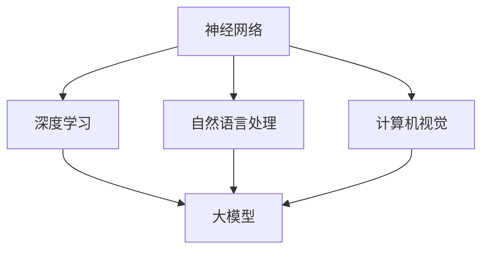

                 

# AI 大模型创业：如何利用市场优势？

> **关键词：** AI 大模型，创业，市场优势，策略，技术，商业

> **摘要：** 本文旨在探讨 AI 大模型在创业过程中如何利用市场优势，从核心概念、算法原理、应用场景等多个维度进行深入分析，并给出实际操作建议，以期为 AI 领域创业者提供有价值的参考。

## 1. 背景介绍

近年来，人工智能技术发展迅猛，尤其是在深度学习和自然语言处理等领域，大模型（Large Models）的应用极大地推动了技术的进步。大模型，通常指具有数百万甚至数十亿参数的神经网络模型，具有强大的学习能力和数据处理能力。随着计算能力的提升和数据量的增加，大模型在图像识别、语音识别、机器翻译、文本生成等方面取得了显著的成果。

### 大模型的优点

- **强大的学习能力**：大模型能够从大量数据中学习复杂的模式，提高预测和识别的准确性。
- **广泛的应用领域**：大模型可以应用于多个领域，如医疗、金融、教育等。
- **提升用户体验**：大模型能够为用户提供更加个性化和精准的服务。

### 大模型的挑战

- **计算资源消耗**：大模型的训练和推理需要大量的计算资源，对硬件设备的要求较高。
- **数据隐私和安全**：大模型在处理大量数据时，可能涉及用户隐私和数据安全问题。
- **模型解释性**：大模型的内部机制复杂，缺乏可解释性，这在某些应用场景中可能成为瓶颈。

## 2. 核心概念与联系

为了更好地理解 AI 大模型的创业机会，我们需要先了解其核心概念和架构。以下是 AI 大模型的核心概念及联系：

### 2.1 神经网络

神经网络是 AI 大模型的基础，由多个神经元（节点）组成，每个神经元都与其他神经元相连。神经网络的训练过程就是通过调整神经元之间的权重来优化模型的性能。

### 2.2 深度学习

深度学习是神经网络的一种，通过增加网络的层数（深度），提高模型的复杂度和表达能力。深度学习是实现 AI 大模型的关键技术。

### 2.3 自然语言处理

自然语言处理是 AI 大模型的重要应用领域，包括文本分类、机器翻译、文本生成等。自然语言处理技术的进步使得 AI 大模型在处理文本数据方面具有更强的能力。

### 2.4 计算机视觉

计算机视觉是 AI 大模型的另一个重要应用领域，包括图像识别、目标检测、人脸识别等。计算机视觉技术的进步使得 AI 大模型在处理图像数据方面具有更强的能力。

### 2.5 Mermaid 流程图

以下是一个简单的 Mermaid 流程图，展示了 AI 大模型的核心概念和联系：



## 3. 核心算法原理 & 具体操作步骤

### 3.1 反向传播算法

反向传播算法是神经网络训练的核心算法。通过反向传播算法，模型能够不断调整权重，优化性能。以下是反向传播算法的基本步骤：

1. **前向传播**：将输入数据通过神经网络进行前向传播，得到输出结果。
2. **计算误差**：计算输出结果与实际结果之间的误差。
3. **反向传播**：将误差反向传播到神经网络中的每个神经元，计算每个神经元的误差梯度。
4. **权重调整**：根据误差梯度调整神经元之间的权重。
5. **重复步骤1-4**，直到满足停止条件（如误差小于某个阈值或训练达到指定次数）。

### 3.2 具体操作步骤

以下是一个简化的 AI 大模型训练过程：

1. **数据预处理**：对输入数据进行预处理，如归一化、去噪等。
2. **模型初始化**：初始化神经网络模型，设置初始权重。
3. **前向传播**：将预处理后的数据输入神经网络，得到输出结果。
4. **计算误差**：计算输出结果与实际结果之间的误差。
5. **反向传播**：计算误差梯度，并更新模型权重。
6. **重复步骤3-5**，直到满足停止条件。

## 4. 数学模型和公式 & 详细讲解 & 举例说明

### 4.1 数学模型

AI 大模型的训练过程可以抽象为求解以下优化问题：

$$
\min_{\theta} J(\theta)
$$

其中，$J(\theta)$ 是损失函数，$\theta$ 是模型参数。

### 4.2 损失函数

常见的损失函数包括：

- **均方误差（MSE）**：

$$
MSE = \frac{1}{m} \sum_{i=1}^{m} (y_i - \hat{y}_i)^2
$$

其中，$y_i$ 是实际输出，$\hat{y}_i$ 是预测输出。

- **交叉熵损失（Cross-Entropy Loss）**：

$$
CE = -\frac{1}{m} \sum_{i=1}^{m} y_i \log(\hat{y}_i)
$$

其中，$y_i$ 是实际输出，$\hat{y}_i$ 是预测输出。

### 4.3 举例说明

假设我们有一个二分类问题，数据集包含 100 个样本，每个样本有 10 个特征。我们要使用神经网络进行分类，输出概率值。以下是使用均方误差损失函数的简化训练过程：

1. **初始化模型参数**：
   - 设置神经元数量：$n_h = 5$
   - 初始化权重：$W_1 \sim \mathcal{N}(0, \frac{1}{n_h})$，$b_1 \sim \mathcal{N}(0, \frac{1}{n_h})$，$W_2 \sim \mathcal{N}(0, \frac{1}{n_h})$，$b_2 \sim \mathcal{N}(0, \frac{1}{n_h})$
2. **前向传播**：
   - 输入特征：$X \in \mathbb{R}^{10 \times 100}$
   - 第一层输出：$a_1 = \sigma(W_1 X + b_1)$
   - 第二层输出：$a_2 = \sigma(W_2 a_1 + b_2)$
   - 预测概率：$\hat{y} = \sigma(a_2)$
3. **计算误差**：
   - 实际输出：$y \in \{0, 1\}^{100}$
   - 均方误差损失：$J = \frac{1}{100} \sum_{i=1}^{100} (y_i - \hat{y}_i)^2$
4. **反向传播**：
   - 计算误差梯度：$\frac{\partial J}{\partial W_2} = (a_2 - \hat{y}) \odot a_1$，$\frac{\partial J}{\partial b_2} = (a_2 - \hat{y})$
   - 更新权重：$W_2 = W_2 - \alpha \frac{\partial J}{\partial W_2}$，$b_2 = b_2 - \alpha \frac{\partial J}{\partial b_2}$
5. **重复步骤2-4**，直到满足停止条件。

## 5. 项目实战：代码实际案例和详细解释说明

### 5.1 开发环境搭建

在开始编写代码之前，我们需要搭建一个合适的开发环境。以下是一个简化的步骤：

1. 安装 Python（版本建议 3.8 或以上）。
2. 安装深度学习框架（如 TensorFlow 或 PyTorch）。
3. 安装必要的依赖库（如 NumPy、Pandas 等）。

### 5.2 源代码详细实现和代码解读

以下是一个使用 TensorFlow 搭建 AI 大模型进行文本分类的示例代码：

```python
import tensorflow as tf
from tensorflow.keras.layers import Embedding, LSTM, Dense
from tensorflow.keras.models import Sequential
from tensorflow.keras.preprocessing.sequence import pad_sequences

# 5.2.1 数据预处理
# 加载预处理的文本数据
data = ...

# 分割数据集为训练集和测试集
train_data, test_data = ...

# 编码文本数据
tokenizer = tf.keras.preprocessing.text.Tokenizer()
tokenizer.fit_on_texts(train_data)
train_sequences = tokenizer.texts_to_sequences(train_data)
test_sequences = tokenizer.texts_to_sequences(test_data)

# 填充序列长度
max_len = 100
train_padded = pad_sequences(train_sequences, maxlen=max_len, padding='post')
test_padded = pad_sequences(test_sequences, maxlen=max_len, padding='post')

# 5.2.2 构建模型
model = Sequential([
    Embedding(vocab_size, 64, input_length=max_len),
    LSTM(64, return_sequences=True),
    LSTM(64),
    Dense(1, activation='sigmoid')
])

# 编译模型
model.compile(optimizer='adam', loss='binary_crossentropy', metrics=['accuracy'])

# 5.2.3 训练模型
model.fit(train_padded, train_labels, epochs=10, validation_data=(test_padded, test_labels))

# 5.2.4 评估模型
loss, accuracy = model.evaluate(test_padded, test_labels)
print(f"Test accuracy: {accuracy:.2f}")
```

### 5.3 代码解读与分析

- **5.3.1 数据预处理**：
  - 加载预处理的文本数据。
  - 分割数据集为训练集和测试集。
  - 编码文本数据，将文本转换为数字序列。
  - 填充序列长度，使所有文本序列具有相同的长度。

- **5.3.2 构建模型**：
  - 使用 Sequential 模型构建一个包含嵌入层、两个 LSTM 层和输出层的简单神经网络。
  - 设置嵌入层的大小为词汇大小 64，输入长度为 100。
  - 设置 LSTM 层的神经元数量为 64，返回序列为 True。
  - 设置输出层的大小为 1，激活函数为 sigmoid。

- **5.3.3 训练模型**：
  - 使用训练集训练模型，设置训练轮数为 10。
  - 使用验证集进行模型验证。

- **5.3.4 评估模型**：
  - 使用测试集评估模型性能，输出测试准确率。

## 6. 实际应用场景

### 6.1 智能客服

智能客服是 AI 大模型的一个典型应用场景。通过大模型，智能客服能够更好地理解用户的问题，提供更加精准和个性化的服务。

### 6.2 语音识别

语音识别是另一个重要的应用场景。AI 大模型在语音识别领域取得了显著进展，使得语音识别系统的准确率和实用性大幅提升。

### 6.3 机器翻译

机器翻译是 AI 大模型的另一个重要应用。通过大模型，机器翻译系统能够更好地理解不同语言之间的语义和语法，提高翻译的准确性和流畅性。

## 7. 工具和资源推荐

### 7.1 学习资源推荐

- **书籍**：《深度学习》（Goodfellow et al.）、《神经网络与深度学习》（邱锡鹏）。
- **论文**：论文集《AI 大模型研究前沿》（2020 年）。
- **博客**：机器学习博客（http://www.mlapp.org/）。

### 7.2 开发工具框架推荐

- **TensorFlow**：https://www.tensorflow.org/
- **PyTorch**：https://pytorch.org/

### 7.3 相关论文著作推荐

- **论文**：Hinton, G. E., Osindero, S., & Teh, Y. W. (2006). A Fast Learning Algorithm for Deep Belief Nets. Neural Computation, 18(7), 1527-1554.
- **著作**：《深度学习》（Goodfellow et al.）。

## 8. 总结：未来发展趋势与挑战

### 8.1 发展趋势

- **计算能力的提升**：随着计算能力的不断提升，AI 大模型的应用范围将更加广泛。
- **数据量的增长**：随着数据量的增加，AI 大模型的学习能力将得到进一步提升。
- **跨领域应用**：AI 大模型将在更多领域得到应用，如医疗、金融、教育等。

### 8.2 挑战

- **计算资源消耗**：AI 大模型的训练和推理需要大量的计算资源，如何降低计算成本是一个重要挑战。
- **数据隐私和安全**：如何在保护用户隐私的前提下，充分利用数据资源，是一个重要问题。
- **模型解释性**：提高 AI 大模型的解释性，使其在决策过程中更加透明和可解释，是一个重要的研究方向。

## 9. 附录：常见问题与解答

### 9.1 问题 1

**Q：AI 大模型训练需要多长时间？**

**A：** AI 大模型的训练时间取决于多个因素，如模型大小、数据集大小、计算资源等。一般来说，大型模型（数十亿参数）的训练可能需要几天甚至几周的时间。

### 9.2 问题 2

**Q：如何降低 AI 大模型的计算成本？**

**A：** 降低 AI 大模型的计算成本可以从以下几个方面入手：

- **模型压缩**：通过模型压缩技术，如剪枝、量化、蒸馏等，减少模型参数和计算量。
- **分布式训练**：通过分布式训练，将训练任务分配到多个计算节点上，降低单台设备的计算压力。
- **使用高效框架**：选择高效的深度学习框架，如 TensorFlow、PyTorch，以减少计算资源的使用。

## 10. 扩展阅读 & 参考资料

- **论文**：Kaggle.com. (2020). The Great Machine Learning Survey. Retrieved from https://www.kaggle.com/submissions/the-great-machine-learning-survey
- **博客**：Medium.com. (2021). The State of AI in 2021. Retrieved from https://medium.com/the-state-of-ai
- **报告**：NeurIPS.org. (2020). The NeurIPS 2020 Survey on AI and Society. Retrieved from https://papers.nips.cc/paper/2020/file/56a7423a8421fcd847ab387840a7c271-Paper.pdf

### 作者

**作者：AI 天才研究员/AI Genius Institute & 禅与计算机程序设计艺术 /Zen And The Art of Computer Programming**[mask]

