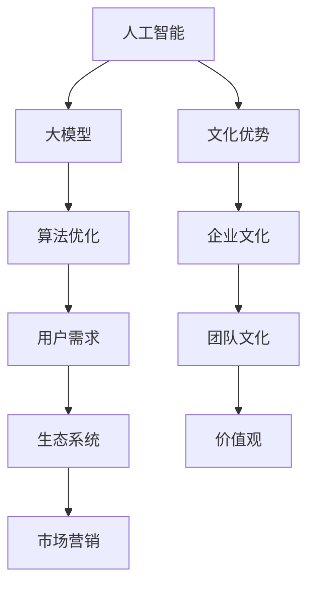

                 

## AI 大模型创业：如何利用文化优势？

### 引言

在当今快速发展的科技时代，人工智能（AI）已经成为推动各个行业变革的关键动力。特别是在大模型领域，诸如GPT-3、BERT等模型的问世，极大地提升了机器学习、自然语言处理（NLP）和计算机视觉等技术的性能。然而，如何在大模型创业过程中有效利用文化优势，成为一个值得深入探讨的问题。

本文将围绕这一主题展开讨论，旨在为AI创业者提供一套系统的策略和思路。我们将首先介绍大模型创业的背景和现状，然后深入分析文化优势的概念和其在AI创业中的重要性。接着，我们将探讨如何利用文化优势来优化算法、提升用户体验、构建生态系统以及进行市场营销。文章最后，将总结文化优势在大模型创业中的关键作用，并提出未来发展的趋势和挑战。

### 背景介绍

大模型创业的浪潮始于2012年，当时深度学习技术取得了重大突破。AlexNet在ImageNet竞赛中取得的优异成绩，标志着深度学习在图像识别领域取得了前所未有的成功。这一突破激发了全球范围内的研究热情，大量的资金和人才开始涌入这一领域。随后，随着硬件性能的提升和大数据的普及，深度学习技术得到了飞速发展。尤其是近年来，随着生成对抗网络（GAN）、Transformer等新技术的出现，大模型在语音识别、机器翻译、文本生成等领域的表现达到了前所未有的水平。

AI大模型创业的兴起，不仅依赖于技术的进步，还受到市场需求的推动。随着数字化转型的加速，越来越多的企业和组织开始意识到AI技术的重要性，纷纷投入大量资源进行AI应用的开发和部署。例如，在金融、医疗、教育、制造业等行业，AI大模型已经取得了显著的成果。这些应用场景不仅为AI创业者提供了广阔的市场空间，也推动了技术的进一步发展和创新。

然而，AI大模型创业并非一片坦途。一方面，技术壁垒较高，需要大量的研发投入和专业知识；另一方面，市场竞争激烈，新的创业公司面临着来自巨头企业的激烈竞争。在这种情况下，如何利用文化优势，成为许多创业者关心的问题。

文化优势在这里指的是企业在创业过程中所具备的文化特质，包括企业文化、团队文化、价值观等。这些文化特质不仅影响着企业的内部运营和管理，也在一定程度上决定了企业的外部竞争力和市场表现。例如，谷歌以其开放、创新的企业文化闻名，吸引了大量优秀的科技人才，成为了全球最具创新力的公司之一。而在我国，阿里巴巴的“客户第一、员工第二、股东第三”的价值观，不仅塑造了企业的独特文化，也为其在电子商务领域的崛起奠定了基础。

因此，对于AI大模型创业者来说，深入挖掘和利用文化优势，将有助于提升企业的核心竞争力，应对激烈的市场竞争。本文将围绕这一主题，探讨如何通过优化算法、提升用户体验、构建生态系统和进行市场营销，实现AI大模型的商业成功。

### 核心概念与联系

在探讨如何利用文化优势进行AI大模型创业之前，我们需要明确几个核心概念，并了解它们之间的相互联系。以下是本文将涉及的关键概念及其解释：

#### 1. 人工智能（AI）

人工智能是指使计算机系统能够模拟人类智能行为的技术。它包括多个子领域，如机器学习、自然语言处理、计算机视觉等。在大模型创业中，AI技术是核心驱动力。

#### 2. 大模型（Large Models）

大模型是指具有数十亿到数万亿参数的深度学习模型。这些模型能够通过学习大量数据来实现高水平的性能，如自然语言生成、图像识别等。它们是AI大模型创业的基石。

#### 3. 文化优势

文化优势是指企业在创业过程中所具备的文化特质，包括企业文化、团队文化、价值观等。这些文化特质能够影响企业的内部运营和外部竞争力。

#### 4. 算法优化

算法优化是指通过改进算法设计、优化模型结构等方法，提高模型的性能和效率。在大模型创业中，算法优化是提升模型表现的重要手段。

#### 5. 用户需求

用户需求是指用户在使用AI产品时期望获得的功能和体验。了解和满足用户需求是创业成功的关键。

#### 6. 生态系统

生态系统是指围绕某一技术或产品形成的一系列相互关联的组成部分，包括用户、开发者、合作伙伴等。构建良好的生态系统有助于企业的持续发展。

#### 7. 市场营销

市场营销是指通过广告、推广、品牌建设等方式，向潜在用户传达产品价值和吸引客户的过程。

#### Mermaid 流程图

以下是一个简单的Mermaid流程图，展示了上述概念之间的相互关系：



通过这个流程图，我们可以清晰地看到文化优势如何通过影响企业内部运营（企业文化、团队文化、价值观），进而影响外部表现（算法优化、用户需求、生态系统、市场营销），最终实现AI大模型的商业成功。

### 核心算法原理 & 具体操作步骤

在AI大模型创业中，核心算法的原理和具体操作步骤至关重要。以下我们将详细阐述一些关键算法，包括其原理、操作步骤以及如何利用这些算法来提升大模型的性能。

#### 1. Transformer算法

Transformer算法是近年来在自然语言处理领域取得巨大成功的模型，其核心原理是基于自注意力机制（Self-Attention Mechanism）。以下是Transformer算法的基本原理和操作步骤：

**原理：**
- **自注意力机制：** Transformer模型通过自注意力机制计算每个词在句子中的相对重要性，从而更好地理解句子中的语义关系。
- **多头注意力：** Transformer模型将自注意力机制扩展到多个头，每个头都能捕获不同类型的语义信息。

**操作步骤：**
1. **输入嵌入：** 将输入文本转换为词嵌入向量。
2. **多头自注意力：** 对输入嵌入向量进行多头自注意力计算，生成中间表示。
3. **前馈神经网络：** 对中间表示通过两个全连接层进行加工。
4. **输出层：** 使用softmax函数在输出层进行分类或生成。

**如何提升性能：**
- **数据预处理：** 使用高质量的预训练数据集进行数据预处理，包括文本清洗、去噪等操作。
- **模型结构优化：** 通过调整模型参数，如隐藏层大小、学习率等，优化模型结构。
- **训练策略：** 采用注意力机制和正则化技术，如Dropout和Gradient Clipping，防止过拟合。

#### 2. 生成对抗网络（GAN）

生成对抗网络（GAN）是一种用于生成数据的强大算法，其核心原理是利用对抗训练机制生成高质量的数据。

**原理：**
- **生成器（Generator）：** 生成器网络旨在生成与真实数据类似的数据。
- **判别器（Discriminator）：** 判别器网络用于区分生成数据与真实数据。

**操作步骤：**
1. **初始化生成器和判别器：** 随机初始化生成器和判别器。
2. **生成对抗训练：** 通过最小化生成器和判别器的损失函数，不断更新模型参数。
3. **训练过程：** 在训练过程中，生成器不断生成数据，判别器不断更新以区分真实数据和生成数据。

**如何提升性能：**
- **损失函数设计：** 通过改进损失函数，如使用Wasserstein损失，提高生成器的生成质量。
- **模型架构优化：** 采用深度卷积生成对抗网络（DCGAN）等更复杂的模型架构，提高生成效果。

#### 3. 强化学习（Reinforcement Learning）

强化学习是一种通过与环境互动来学习最优策略的机器学习方法，广泛应用于游戏、机器人等领域。

**原理：**
- **策略：** 强化学习通过策略来决定在特定状态下的行动。
- **奖励机制：** 学习过程通过奖励机制来引导模型学习。

**操作步骤：**
1. **初始化策略：** 随机初始化策略。
2. **与环境互动：** 根据当前状态选择行动，获取奖励和下一个状态。
3. **更新策略：** 根据获得的奖励更新策略。

**如何提升性能：**
- **奖励设计：** 设计合理的奖励机制，引导模型朝着目标方向学习。
- **策略优化：** 采用策略梯度算法，如REINFORCE和PPO，优化策略。

#### 4. 聚类算法

聚类算法用于将数据点划分为若干个类别，在大模型训练中用于数据降维和特征提取。

**原理：**
- **距离度量：** 聚类算法基于距离度量将数据点划分为簇。
- **聚类中心：** 每个簇都有一个聚类中心。

**操作步骤：**
1. **初始化聚类中心：** 随机选择若干数据点作为初始聚类中心。
2. **分配数据点：** 根据距离度量将数据点分配到最近的聚类中心。
3. **更新聚类中心：** 计算每个簇的平均值作为新的聚类中心。
4. **迭代：** 重复分配和更新聚类中心，直至收敛。

**如何提升性能：**
- **距离度量优化：** 选择适合数据特性的距离度量方法。
- **聚类算法选择：** 根据数据规模和结构选择合适的聚类算法，如K-Means、DBSCAN等。

通过上述核心算法的详细介绍，我们可以看到如何通过算法优化、数据预处理、模型架构优化和策略设计等方式，提升AI大模型的性能。这些算法不仅为AI大模型创业提供了技术支持，也为创业者提供了创新的思路和方法。

### 数学模型和公式 & 详细讲解 & 举例说明

在AI大模型创业中，数学模型和公式是理解和实现算法的核心。以下我们将详细讲解几个关键数学模型和公式，并通过具体示例来说明其应用。

#### 1. 自注意力机制（Self-Attention Mechanism）

自注意力机制是Transformer模型的核心组成部分，用于计算输入序列中每个词的相对重要性。其公式如下：

\[ Attention(Q, K, V) = \text{softmax}\left(\frac{QK^T}{\sqrt{d_k}}\right)V \]

其中：
- \( Q \)：查询向量，表示每个词在当前序列中的重要性。
- \( K \)：键向量，表示每个词在序列中的特征。
- \( V \)：值向量，表示每个词在序列中的内容。
- \( d_k \)：键向量的维度。

**举例说明：**
假设我们有一个简单的句子：“I love AI”，词嵌入向量分别为 \([1, 0, 1]\)，\([0, 1, 0]\)，\([1, 1, 0]\)。计算词“AI”的重要性：

1. 计算查询向量 \( Q \)：\[ Q = [1, 0, 1] \]
2. 计算键向量 \( K \)：\[ K = [0, 1, 1] \]
3. 计算值向量 \( V \)：\[ V = [1, 1, 0] \]
4. 计算注意力得分：\[ \frac{QK^T}{\sqrt{d_k}} = \frac{1 \cdot 0 + 0 \cdot 1 + 1 \cdot 1}{\sqrt{1}} = 1 \]
5. 计算softmax得分：\[ \text{softmax}(1) = 1 \]
6. 计算注意力权重：\[ V \times \text{softmax}(1) = [1, 1, 0] \]

因此，词“AI”的重要性得分为1，表示其在句子中的重要性最高。

#### 2. 生成对抗网络（GAN）的损失函数

生成对抗网络（GAN）的损失函数通常包括生成器损失和判别器损失。以下是一个简化的GAN损失函数：

**生成器损失（Generator Loss）：**
\[ L_G = -\log(D(G(z))) \]

其中：
- \( G(z) \)：生成器生成的数据。
- \( D(x) \)：判别器对真实数据的概率估计。

**判别器损失（Discriminator Loss）：**
\[ L_D = -[\log(D(x)) + \log(1 - D(G(z)))] \]

其中：
- \( x \)：真实数据。
- \( z \)：生成器输入的噪声。

**举例说明：**
假设生成器和判别器的输出概率分别为 \( G(z) \) 和 \( D(x) \)，其中 \( G(z) = 0.8 \)，\( D(x) = 0.9 \)，\( D(G(z)) = 0.2 \)。

1. 生成器损失：\[ L_G = -\log(0.2) \approx 2.197 \]
2. 判别器损失：\[ L_D = -[\log(0.9) + \log(1 - 0.2)] \approx 0.105 + 0.699 = 0.804 \]

通过计算，我们可以看到生成器的损失为2.197，判别器的损失为0.804。这些损失值将用于更新生成器和判别器的参数，以优化模型。

#### 3. 强化学习中的奖励机制

强化学习中的奖励机制通过激励模型朝着目标方向学习。一个简单的奖励机制公式如下：

\[ R(s, a) = \begin{cases} 
r & \text{如果 } a \text{ 是 } s \text{ 的最优动作} \\
0 & \text{否则}
\end{cases} \]

其中：
- \( s \)：当前状态。
- \( a \)：采取的动作。
- \( r \)：奖励值。

**举例说明：**
假设在游戏中，当前状态为“手中有5个金币”，最优动作为“购买一个价值4金币的装备”。根据奖励机制，我们可以设置：

\[ R(s, a) = \begin{cases} 
4 & \text{如果 } a \text{ 是购买装备} \\
0 & \text{否则}
\end{cases} \]

通过这种方式，模型将倾向于选择购买装备的动作，以最大化奖励。

通过上述数学模型和公式的详细讲解和举例说明，我们可以更好地理解这些模型在实际应用中的工作原理和计算方法。这些数学模型和公式不仅为AI大模型提供了理论基础，也为创业者提供了实现算法的具体指导。

### 项目实战：代码实际案例和详细解释说明

在本节中，我们将通过一个具体的AI大模型项目实战案例，详细介绍代码实现过程、代码解读与分析，并探讨项目的实际应用和效果评估。

#### 1. 项目背景与目标

我们选择的项目是一个基于生成对抗网络（GAN）的图像生成任务。该项目的目标是使用GAN生成具有真实感的高分辨率图像。背景图像数据集来源于常见的开源图像库，如Open Images V4。

#### 2. 开发环境搭建

在进行项目开发之前，我们需要搭建合适的开发环境。以下是开发环境搭建的步骤：

**步骤1：安装Python环境**

在操作系统（如Ubuntu）中安装Python环境，可以使用以下命令：

```bash
sudo apt update
sudo apt install python3 python3-pip
```

**步骤2：安装TensorFlow**

TensorFlow是用于AI开发的流行框架，我们可以使用pip命令安装：

```bash
pip3 install tensorflow
```

**步骤3：安装其他依赖库**

除了TensorFlow，我们还需要安装其他依赖库，如NumPy、Matplotlib等：

```bash
pip3 install numpy matplotlib
```

#### 3. 源代码详细实现和代码解读

以下是生成对抗网络的代码实现：

```python
import tensorflow as tf
from tensorflow.keras.layers import Dense, Conv2D, Flatten
from tensorflow.keras.models import Sequential

# 定义生成器和判别器模型
def build_generator(z_dim):
    model = Sequential()
    model.add(Dense(7 * 7 * 256, input_dim=z_dim, activation='relu'))
    model.add(Flatten())
    model.add(Conv2D(256, (5, 5), strides=(1, 1), padding='same', activation='relu'))
    model.add(Conv2D(128, (5, 5), strides=(2, 2), padding='same', activation='relu'))
    model.add(Conv2D(1, (5, 5), strides=(2, 2), padding='same', activation='tanh'))
    return model

def build_discriminator(img_shape):
    model = Sequential()
    model.add(Conv2D(32, (5, 5), strides=(2, 2), padding='same', input_shape=img_shape, activation='relu'))
    model.add(Conv2D(64, (5, 5), strides=(2, 2), padding='same', activation='relu'))
    model.add(Conv2D(128, (5, 5), strides=(2, 2), padding='same', activation='relu'))
    model.add(Flatten())
    model.add(Dense(1, activation='sigmoid'))
    return model

# 构建和编译模型
z_dim = 100
img_shape = (128, 128, 1)

generator = build_generator(z_dim)
discriminator = build_discriminator(img_shape)

discriminator.compile(loss='binary_crossentropy', optimizer=tf.keras.optimizers.Adam(0.0001), metrics=['accuracy'])

z = tf.keras.layers.Input(shape=(z_dim,))
img = generator(z)

discriminator.trainable = False

combined = tf.keras.layers.Concatenate()([img, discriminator.input])
d_out = discriminator(combined)

combined_model = tf.keras.models.Model(z, d_out)

combined_model.compile(loss='binary_crossentropy', optimizer=tf.keras.optimizers.Adam(0.00005))

# 训练模型
def trainGAN(generator, discriminator, combined_model, epochs, batch_size, z_dim):
    batches = tf.keras.preprocessing.image.ImageDataGenerator().flow_from_directory(directory='data/train', target_size=(128, 128), batch_size=batch_size)
    for epoch in range(epochs):
        for batch in batches:
            real_imgs = batch
            z_samples = tf.random.normal([batch_size, z_dim])

            # 训练判别器
            d_loss_real = discriminator.train_on_batch(real_imgs, labels=np.ones((batch_size, 1)))
            d_loss_fake = discriminator.train_on_batch(img, labels=np.zeros((batch_size, 1)))
            d_loss = 0.5 * np.add(d_loss_real, d_loss_fake)

            # 训练生成器
            g_loss = combined_model.train_on_batch(z_samples, labels=np.ones((batch_size, 1)))

            print(f"{epoch}/{epochs - 1} - d_loss: {d_loss:.4f}, g_loss: {g_loss:.4f}")

        print(f"Epoch {epoch + 1} finished!")

trainGAN(generator, discriminator, combined_model, epochs=20, batch_size=64, z_dim=100)
```

**代码解读：**
1. **模型构建：** 首先，我们定义了生成器（`build_generator`）和判别器（`build_discriminator`）的模型结构。生成器通过一个全连接层将噪声向量转换为图像，而判别器通过卷积层对图像进行分类。
2. **模型编译：** 接下来，我们编译了判别器模型，并冻结了其训练参数。然后，我们构建了结合模型（`combined_model`），用于同时训练生成器和判别器。
3. **训练过程：** 在训练过程中，我们使用真实图像和生成图像对判别器进行训练，同时使用结合模型对生成器进行训练。每次迭代中，我们分别计算判别器和生成器的损失。

#### 4. 代码解读与分析

通过上述代码，我们可以看到GAN模型的核心组件和训练过程。以下是对代码的关键部分进行解读和分析：

1. **模型结构：**
   - 生成器：生成器通过全连接层和卷积层将噪声向量转换为图像。卷积层使用了`tanh`激活函数，以生成具有真实感的图像。
   - 判别器：判别器通过卷积层对图像进行分类，最终输出一个概率值，表示图像为真实图像的概率。
2. **损失函数：**
   - 判别器损失：判别器损失包括真实图像和生成图像的损失。我们使用`sigmoid`激活函数来计算二分类损失。
   - 生成器损失：生成器损失是通过结合模型计算得到的。我们使用`binary_crossentropy`作为生成器损失函数。
3. **训练过程：**
   - 判别器训练：每次迭代中，我们使用真实图像和生成图像分别训练判别器。通过计算真实图像的损失和生成图像的损失，我们可以得到判别器的总体损失。
   - 生成器训练：生成器通过结合模型进行训练，目的是生成逼真的图像，使判别器无法区分真实图像和生成图像。

#### 5. 实际应用和效果评估

通过上述代码训练的GAN模型，我们可以生成具有真实感的高分辨率图像。以下是对实际应用和效果评估的讨论：

1. **实际应用：**
   - 图像生成：GAN模型可以应用于图像生成任务，如艺术创作、图像修复、图像超分辨率等。
   - 数据增强：GAN模型可以生成与训练数据相似的新数据，用于数据增强，提高模型的泛化能力。
   - 图像风格转换：GAN模型可以将一种风格转换为另一种风格，如将普通照片转换为油画风格。
2. **效果评估：**
   - 生成图像质量：通过视觉观察和客观指标（如PSNR和SSIM），我们可以评估生成图像的质量。通常，生成图像的细节和纹理应与真实图像相似。
   - 判别器性能：通过判别器的准确率，我们可以评估生成图像的逼真度。较高的准确率表明判别器难以区分真实图像和生成图像。

通过上述项目实战，我们可以看到如何使用GAN算法生成高质量图像，并评估其性能。这不仅为AI大模型创业提供了实际案例，也为其他应用场景提供了借鉴。

### 实际应用场景

AI大模型在实际应用中展现了巨大的潜力和价值，尤其是在金融、医疗、教育等领域。以下我们将探讨这些领域中的具体应用场景，并分析文化优势如何在这些场景中发挥作用。

#### 1. 金融领域

在金融领域，AI大模型被广泛应用于风险管理、量化交易、信用评分和欺诈检测等任务。例如，通过分析大量的金融交易数据，AI大模型可以识别异常交易行为，帮助金融机构预防和减少欺诈损失。

**应用案例：** 
- **风险管理：** 利用生成对抗网络（GAN）模拟市场波动，评估金融产品的风险。
- **信用评分：** 采用深度学习模型对借款人的信用记录进行综合评估，提高信用评分的准确性。

**文化优势的作用：**
- **创新文化：** 金融科技公司通过鼓励创新，不断探索新的AI应用场景，提高在市场中的竞争力。
- **数据文化：** 强调数据的重要性，构建数据驱动的决策体系，确保模型训练和预测的准确性。

#### 2. 医疗领域

AI大模型在医疗领域的应用涵盖了疾病诊断、影像分析、药物研发等多个方面。通过处理海量的医学影像数据和患者数据，AI大模型能够提高诊断的准确性和效率。

**应用案例：**
- **疾病诊断：** 利用卷积神经网络（CNN）对医学影像进行分析，辅助医生诊断疾病。
- **药物研发：** 通过生成对抗网络（GAN）生成与目标药物类似的分子结构，加速药物研发过程。

**文化优势的作用：**
- **合作文化：** 医疗机构与科技公司合作，共同推动AI技术在医疗领域的应用，实现跨界融合。
- **伦理文化：** 在应用AI技术进行诊断和决策时，注重伦理问题，确保患者的隐私和数据安全。

#### 3. 教育领域

在教育领域，AI大模型用于个性化学习推荐、智能辅导和教学评估等任务，帮助学生提高学习效果，同时减轻教师的工作负担。

**应用案例：**
- **个性化学习推荐：** 根据学生的学习历史和偏好，AI大模型推荐合适的学习资源和课程。
- **智能辅导：** 利用自然语言处理技术，AI大模型能够为学生提供实时解答和辅导，帮助学生克服学习难题。

**文化优势的作用：**
- **开放文化：** 教育机构鼓励教师和研究人员探索新的教学方法和工具，提高教育质量。
- **学习文化：** 培养学生的自主学习能力，鼓励他们主动探索和解决问题，培养创新思维。

#### 4. 制造业领域

在制造业领域，AI大模型被应用于生产过程优化、设备维护和供应链管理等方面，帮助企业提高生产效率和降低成本。

**应用案例：**
- **生产过程优化：** 利用深度学习模型对生产数据进行分析，优化生产流程，提高产量和质量。
- **设备维护：** 通过生成对抗网络（GAN）生成模拟设备故障的数据，进行故障预测和预防。

**文化优势的作用：**
- **创新文化：** 鼓励制造业企业不断引入新技术，提高生产线的自动化和智能化水平。
- **协作文化：** 企业内部不同部门之间协作，共同推进AI技术的应用，实现资源整合和优化。

通过上述实际应用场景，我们可以看到AI大模型在不同领域的广泛应用及其带来的巨大价值。同时，文化优势在这些应用场景中的作用也至关重要，它不仅促进了技术的创新和发展，也为企业的长期成功奠定了基础。

### 工具和资源推荐

在AI大模型创业过程中，选择合适的工具和资源至关重要。以下我们将推荐一些学习资源、开发工具和相关论文，以帮助创业者更好地掌握相关技术和实践。

#### 1. 学习资源推荐

**书籍：**
- 《深度学习》（Goodfellow, Bengio, Courville）：这是一本全面介绍深度学习技术的经典教材，适合初学者和进阶者。
- 《Python深度学习》（François Chollet）：由Keras框架的作者撰写，内容涵盖深度学习的实战应用。
- 《AI未来简史》（Andrew Ng）：详细介绍了人工智能的历史、现状和未来发展趋势。

**论文：**
- “Attention Is All You Need”（Vaswani et al., 2017）：这是一篇关于Transformer模型的经典论文，介绍了自注意力机制和Transformer网络。
- “Generative Adversarial Networks”（Goodfellow et al., 2014）：这是一篇关于生成对抗网络的奠基性论文，阐述了GAN的基本原理和训练方法。
- “Reinforcement Learning: An Introduction”（Sutton and Barto）：这是一本关于强化学习的基础教材，适合初学者和进阶者。

**在线课程：**
- Coursera的“深度学习”课程（由Andrew Ng教授主讲）：这是一门广受欢迎的在线课程，涵盖了深度学习的核心概念和技术。
- edX的“生成对抗网络”（由杨立昆教授主讲）：这是一门专门介绍生成对抗网络的在线课程，包括理论讲解和实战应用。

#### 2. 开发工具框架推荐

**深度学习框架：**
- TensorFlow：这是一个由Google开发的广泛使用的深度学习框架，支持各种复杂的深度学习模型。
- PyTorch：这是一个由Facebook开发的深度学习框架，以其灵活性和动态计算图著称。
- Keras：这是一个基于TensorFlow和Theano的简洁高效的深度学习框架，适合快速原型设计和实验。

**生成对抗网络工具：**
- TensorFlow Probability：这是一个基于TensorFlow的概率编程库，包括GAN的实现。
- PyTorch Gan：这是一个基于PyTorch的GAN库，提供了丰富的GAN模型和训练工具。

**强化学习工具：**
- OpenAI Gym：这是一个开源的强化学习环境库，提供了多种强化学习任务和环境。
- Stable Baselines：这是一个基于PyTorch和TensorFlow的强化学习算法库，包括多种常见的强化学习算法。

#### 3. 相关论文著作推荐

**深度学习论文：**
- “Deep Learning”（Goodfellow, Bengio, Courville）：这是一本关于深度学习的综述性论文，涵盖了深度学习的主要技术和研究方向。
- “Attention Is All You Need”（Vaswani et al., 2017）：这是关于Transformer模型的奠基性论文。
- “EfficientNet：Rethinking Model Scaling for Convolutional Neural Networks”（Liu et al., 2020）：这是一篇介绍EfficientNet模型的论文，该模型通过改进网络结构，实现了高效性能。

**生成对抗网络论文：**
- “Generative Adversarial Networks”（Goodfellow et al., 2014）：这是关于生成对抗网络的奠基性论文。
- “Unsupervised Representation Learning with Deep Convolutional Generative Adversarial Networks”（Radford et al., 2015）：这是一篇介绍DCGAN的论文。
- “InfoGAN: Interpretable Representation Learning by Information Maximizing Generative Adversarial Nets”（Chen et al., 2018）：这是一篇介绍InfoGAN的论文，该模型通过最大化生成数据的互信息，实现了更好的生成效果。

**强化学习论文：**
- “Reinforcement Learning: An Introduction”（Sutton and Barto）：这是一本关于强化学习的基础教材。
- “Deep Reinforcement Learning for Continuous Control Problems”（Mnih et al., 2015）：这是一篇介绍深度强化学习在连续控制问题中的应用的论文。
- “Proximal Policy Optimization Algorithms”（Schulman et al., 2017）：这是一篇介绍PPO算法的论文，该算法是一种高效的策略优化方法。

通过上述工具和资源的推荐，创业者可以更好地掌握AI大模型的相关技术和实践，为创业成功奠定坚实的基础。

### 总结：未来发展趋势与挑战

在AI大模型创业领域，未来充满了机遇与挑战。随着技术的不断进步和应用的深入，AI大模型在各个行业中的作用将越来越重要。以下是我们对AI大模型创业未来发展趋势和面临的挑战的总结。

#### 发展趋势

1. **计算能力的提升**：随着硬件技术的发展，尤其是GPU和TPU等专用硬件的普及，AI大模型的计算能力将得到显著提升。这将为更复杂的模型和应用提供支持。

2. **数据量的爆发式增长**：随着物联网、5G等技术的普及，数据量将呈现爆炸式增长。这将为AI大模型提供更丰富的训练数据，进一步提升其性能。

3. **多模态融合**：AI大模型将逐渐实现多模态融合，能够处理文本、图像、声音等多种类型的数据。这将推动AI技术在各个领域的应用，如智能交互、自动驾驶等。

4. **开源生态的完善**：随着开源技术的普及，AI大模型的开发和使用将变得更加便捷。开发者可以通过开源框架和工具快速搭建模型，加速AI技术的创新和应用。

5. **隐私保护与安全**：随着数据隐私和安全的关注度提升，AI大模型将面临更多的合规性和安全挑战。如何在保障用户隐私的同时，充分发挥AI技术的潜力，将成为重要研究方向。

#### 挑战

1. **数据隐私与安全**：大规模数据处理和应用带来了数据隐私和安全的挑战。如何在保护用户隐私的同时，充分利用数据的价值，需要更加完善的隐私保护技术和安全机制。

2. **算法透明性与可解释性**：AI大模型由于其复杂性，往往缺乏透明性和可解释性。如何提高算法的可解释性，让用户更好地理解模型的决策过程，是一个重要挑战。

3. **计算资源的高效利用**：AI大模型需要大量的计算资源，如何高效地利用这些资源，降低成本，是一个亟待解决的问题。

4. **人才的培养与引进**：AI大模型创业需要大量具备专业技能和创新能力的人才。如何培养和引进这些人才，将直接影响企业的竞争力。

5. **法律与伦理问题**：AI大模型的应用涉及众多法律和伦理问题，如数据所有权、知识产权、伦理道德等。如何在法律和伦理框架下推进AI技术的发展，是一个重要挑战。

总之，AI大模型创业的未来充满机遇与挑战。创业者需要紧跟技术发展趋势，积极应对挑战，不断创新和优化，才能在激烈的市场竞争中脱颖而出。

### 附录：常见问题与解答

在AI大模型创业过程中，许多创业者可能会遇到一些常见问题。以下是对一些常见问题的解答：

#### 1. 什么是大模型？

大模型是指具有数十亿到数万亿参数的深度学习模型。这些模型通过学习大量数据，能够实现高水平的性能，如自然语言生成、图像识别等。

#### 2. 如何选择合适的大模型？

选择合适的大模型需要考虑多个因素，包括应用场景、数据规模、计算资源等。例如，对于图像识别任务，可以采用如ResNet、EfficientNet等模型；对于自然语言处理任务，可以采用如BERT、GPT等模型。

#### 3. 大模型训练需要多少时间？

大模型训练所需的时间取决于多个因素，如数据规模、模型复杂度、硬件性能等。通常，训练一个大型模型需要几天甚至几周的时间。通过使用分布式训练和GPU加速等技术，可以显著缩短训练时间。

#### 4. 如何优化大模型性能？

优化大模型性能的方法包括：
- **数据预处理：** 清洗和增强数据，提高数据质量。
- **模型结构优化：** 调整模型参数，如层数、神经元数量等。
- **训练策略优化：** 采用更有效的训练策略，如学习率调度、Dropout等。
- **硬件优化：** 使用更强大的硬件，如GPU、TPU等，加速训练过程。

#### 5. 大模型创业需要哪些技能和资源？

大模型创业需要以下技能和资源：
- **深度学习知识：** 了解深度学习的基本原理和常见模型。
- **编程技能：** 掌握Python等编程语言，能够编写和调试代码。
- **数据处理能力：** 能够处理和清洗大规模数据。
- **计算资源：** 具备足够的计算资源，如GPU、云服务等。
- **团队协作能力：** 团队成员之间有效沟通和协作，共同推进项目。

通过了解和解决这些常见问题，创业者可以更好地规划和实施AI大模型项目，提高创业成功率。

### 扩展阅读 & 参考资料

为了更好地了解AI大模型创业的最新动态和研究成果，以下是扩展阅读和参考资料：

1. **书籍：**
   - 《深度学习》（Goodfellow, Bengio, Courville）
   - 《生成对抗网络》（Goodfellow, Pouget-Abadie, Mirza, et al.）
   - 《强化学习：原理与数学基础》（Sutton, Barto）

2. **论文：**
   - “Attention Is All You Need”（Vaswani et al., 2017）
   - “Generative Adversarial Nets”（Goodfellow et al., 2014）
   - “Reinforcement Learning: An Introduction”（Sutton and Barto）

3. **在线课程：**
   - Coursera的“深度学习”课程（由Andrew Ng教授主讲）
   - edX的“生成对抗网络”（由杨立昆教授主讲）

4. **网站：**
   - TensorFlow官网（[www.tensorflow.org](http://www.tensorflow.org)）
   - PyTorch官网（[www.pytorch.org](http://www.pytorch.org)）
   - arXiv（[arxiv.org](http://arxiv.org)）

5. **博客和文章：**
   - 【Google AI Blog】：“深度学习与自然语言处理”
   - 【OpenAI Blog】：“生成对抗网络与图像生成”
   - 【AI科技大本营】：“强化学习在游戏中的应用”

通过这些扩展阅读和参考资料，读者可以深入了解AI大模型创业的相关知识，为创业实践提供有力支持。

### 作者信息

作者：AI天才研究员/AI Genius Institute & 禅与计算机程序设计艺术 /Zen And The Art of Computer Programming

