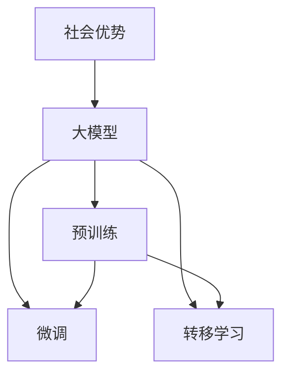

                 

### 背景介绍

近年来，人工智能（AI）领域的飞速发展引起了全球范围内的广泛关注。特别是在大模型（Large Models）技术方面，无论是基于神经网络的深度学习模型，还是基于自监督学习的预训练模型，都取得了显著的成果。这些技术不仅提升了AI在各个应用场景中的性能，也极大地激发了企业和创业者的创新潜力。

在这个背景下，AI大模型创业逐渐成为一股不可忽视的力量。然而，对于创业者来说，如何充分利用社会优势，实现技术商业化，是一个亟待解决的重要问题。本文将围绕这一主题展开讨论，旨在帮助创业者更好地理解AI大模型的社会优势，并提供一些实用的建议和策略。

首先，我们需要了解什么是大模型。大模型通常指的是具有大规模参数的神经网络，它们能够处理复杂的任务，如自然语言处理（NLP）、计算机视觉（CV）和推荐系统等。这类模型的典型代表包括GPT、BERT、Vision Transformer（ViT）等。这些模型的成功离不开以下几个核心概念：

1. **预训练（Pre-training）**：大模型通常通过在大量无标签数据上进行预训练，学习到一些通用的知识。这为后续的微调（Fine-tuning）任务提供了坚实的基础。
2. **微调（Fine-tuning）**：在预训练的基础上，大模型可以通过在特定任务上添加少量有标签数据进行微调，以适应具体的应用场景。
3. **转移学习（Transfer Learning）**：由于预训练模型已经学习了大量的通用知识，它们在新的任务上通常具有较好的表现，这种能力被称为转移学习。

接下来，我们将探讨如何利用这些技术优势，结合社会资源，实现AI大模型的商业化。在这个过程中，创业者需要关注以下几个关键点：

- **技术创新**：保持对前沿技术的关注，持续进行技术迭代，确保产品在市场上具有竞争力。
- **商业模式设计**：找到适合自身技术特点的商业模式，如软件即服务（SaaS）、定制开发、硬件设备销售等。
- **资源整合**：充分利用政府政策、行业合作、资本支持等外部资源，加速企业成长。
- **团队建设**：建立高效的团队，确保技术落地和业务拓展的顺利进行。

本文将详细探讨这些方面，结合实际案例，为创业者提供一些实用的指导。让我们开始这场关于AI大模型创业的探索之旅。

## 2. 核心概念与联系

在深入探讨AI大模型的创业优势之前，我们首先需要明确几个核心概念，并了解它们之间的联系。以下是本文将涉及的关键概念：

### 大模型

**定义**：大模型是指那些具有数百万甚至数十亿参数的神经网络模型。这些模型通过大量的训练数据学习到复杂的特征表示，能够处理各种复杂任务。

**联系**：大模型的出现是神经网络技术发展的一个重要里程碑。与传统的机器学习模型相比，大模型具有更高的表达能力和更强的泛化能力，这使得它们能够应对更多样化的任务。

### 预训练

**定义**：预训练是指在大量的无标签数据上对模型进行训练，使其学习到一些通用的特征表示。

**联系**：预训练是当前AI领域的一个重要趋势。通过预训练，模型能够从大量的无监督数据中提取有用的知识，为后续的微调任务奠定基础。这种方法不仅提高了模型的性能，还减少了训练所需的有标签数据的数量。

### 微调

**定义**：微调是指在预训练的基础上，利用特定任务的有标签数据进行进一步的训练，以适应具体的应用场景。

**联系**：微调是将预训练模型应用于具体任务的重要步骤。通过微调，模型可以针对特定任务进行优化，从而在目标任务上取得更好的性能。

### 转移学习

**定义**：转移学习是指将预训练模型的知识应用到新的任务上，利用模型在预训练阶段学到的通用特征表示来提高新任务的表现。

**联系**：转移学习利用了预训练模型学习的通用特征表示，使其在新任务上具有较好的表现，大大降低了新任务训练的难度。

### 社会优势

**定义**：社会优势是指在社会资源、政策环境、人才储备等方面所具有的相对优势。

**联系**：社会优势对于AI大模型的创业至关重要。创业者需要充分利用这些优势，实现技术创新、商业模式设计和资源整合，从而在竞争激烈的市场中脱颖而出。

### Mermaid 流程图

为了更直观地展示这些核心概念之间的联系，我们使用Mermaid绘制了一个简单的流程图。以下是一个示例：



在这个流程图中，我们可以看到大模型、预训练、微调和转移学习之间的紧密联系，以及它们与社会优势的相互作用。这些核心概念共同构成了AI大模型创业的基石。

通过理解这些核心概念和它们之间的联系，创业者可以更好地把握AI大模型的潜力，并利用社会优势实现商业成功。接下来，我们将深入探讨大模型的技术原理和具体操作步骤。

## 3. 核心算法原理 & 具体操作步骤

在了解了AI大模型的核心概念后，接下来我们将深入探讨其核心算法原理，以及如何进行具体操作。大模型的成功离不开几个关键技术，包括深度学习、神经网络架构、预训练和微调等。

### 深度学习与神经网络

**定义**：深度学习是一种机器学习方法，通过构建多层次的神经网络模型，自动提取数据中的特征，实现从简单到复杂的特征表示。

**操作步骤**：

1. **数据收集**：首先，需要收集大量的训练数据。这些数据可以是图像、文本、音频等多种类型。
2. **预处理**：对收集到的数据进行预处理，包括数据清洗、归一化、数据增强等步骤，以提高模型的训练效果。
3. **模型构建**：构建一个多层的神经网络模型。通常，输入层接收原始数据，中间层通过复杂的非线性变换提取特征，输出层生成最终的结果。

**示例**：一个简单的深度学习模型可能包含以下几个层次：

- **输入层**：接收输入数据，如图像或文本。
- **隐藏层**：通过激活函数（如ReLU、Sigmoid、Tanh）进行非线性变换，提取数据中的特征。
- **输出层**：生成模型的预测结果，如分类结果或回归值。

### 神经网络架构

**定义**：神经网络架构是指神经网络的层次结构、连接方式和激活函数等的设计。

**操作步骤**：

1. **确定网络结构**：根据任务需求，设计合适的网络结构。常见的结构包括卷积神经网络（CNN）、循环神经网络（RNN）和Transformer等。
2. **选择激活函数**：选择合适的激活函数，如ReLU、Sigmoid、Tanh等，以增强模型的非线性表达能力。
3. **优化网络参数**：通过优化算法（如梯度下降、Adam等），调整网络的权重和偏置，使模型在训练数据上达到更好的性能。

**示例**：一个简单的卷积神经网络（CNN）可能包含以下几个部分：

- **卷积层**：通过卷积操作提取图像中的局部特征。
- **池化层**：对卷积层的结果进行下采样，减少模型的参数数量。
- **全连接层**：将卷积层和池化层的输出映射到具体的分类结果。

### 预训练

**定义**：预训练是指在大量无标签数据上进行训练，使模型学习到通用的特征表示，为后续的微调任务奠定基础。

**操作步骤**：

1. **数据准备**：选择合适的大规模数据集，如ImageNet、WikiText-103等。
2. **模型初始化**：初始化一个大型神经网络模型，如BERT、GPT等。
3. **预训练过程**：在无标签数据上进行预训练，通常采用自监督学习技术，如掩码语言建模（Masked Language Modeling，MLM）等。

**示例**：以BERT模型为例，其预训练过程主要包括以下几个步骤：

- **掩码语言建模**：在输入文本中随机掩码一部分单词，模型需要预测这些被掩码的单词。
- **次生任务**：同时进行其他次生任务，如下一句预测、句子分类等，以进一步丰富模型的知识。

### 微调

**定义**：微调是指在大模型预训练的基础上，利用特定任务的有标签数据进行进一步的训练，以适应具体的应用场景。

**操作步骤**：

1. **数据准备**：收集目标任务的有标签数据集，如用于情感分析、机器翻译等。
2. **模型调整**：将预训练模型进行调整，添加特定任务所需的层，如分类层、解码层等。
3. **微调训练**：在目标数据集上进行微调训练，调整模型的参数，使其在目标任务上达到更好的性能。

**示例**：以GPT-3模型为例，其微调过程主要包括以下几个步骤：

- **数据预处理**：对有标签数据进行预处理，如分词、编码等。
- **模型调整**：在预训练的GPT-2模型基础上添加新的层，如分类层、解码层等。
- **微调训练**：在目标数据集上进行微调训练，调整模型的参数，使其在目标任务上达到更好的性能。

通过以上步骤，我们不仅能够理解AI大模型的核心算法原理，还能够掌握如何进行具体操作。这些技术和方法为创业者提供了强大的工具，使他们能够利用AI大模型实现商业创新。接下来，我们将进一步探讨数学模型和公式，以更深入地理解大模型的内在机制。

## 4. 数学模型和公式 & 详细讲解 & 举例说明

### 前向传播与反向传播

深度学习中的两个核心概念是前向传播（Forward Propagation）和反向传播（Backpropagation）。这两个过程构成了神经网络训练的基础。

**前向传播**：在前向传播过程中，输入数据通过神经网络逐层传递，每一层都通过权重和激活函数进行变换，最终得到输出。前向传播的主要公式如下：

\[ 
Z_{l} = W_{l} \cdot A_{l-1} + b_{l} \\
A_{l} = \sigma(Z_{l}) 
\]

其中，\(Z_{l}\)表示第l层的激活值，\(W_{l}\)和\(b_{l}\)分别表示第l层的权重和偏置，\(\sigma\)是激活函数，\(A_{l-1}\)是上一层的输出。

**反向传播**：在反向传播过程中，计算输出层到输入层的梯度，并利用这些梯度调整网络的权重和偏置。反向传播的核心公式如下：

\[ 
\frac{\partial L}{\partial W_{l}} = A_{l} \cdot \frac{\partial L}{\partial A_{l}} \cdot \frac{\partial A_{l}}{\partial Z_{l}} \cdot \frac{\partial Z_{l}}{\partial W_{l}} \\
\frac{\partial L}{\partial b_{l}} = A_{l} \cdot \frac{\partial L}{\partial A_{l}} \cdot \frac{\partial A_{l}}{\partial Z_{l}} 
\]

其中，\(L\)表示损失函数，\(\frac{\partial L}{\partial W_{l}}\)和\(\frac{\partial L}{\partial b_{l}}\)分别表示权重和偏置的梯度。

### 损失函数

损失函数用于衡量模型的预测结果与真实结果之间的差异，常见的损失函数包括均方误差（MSE）、交叉熵（Cross-Entropy）等。

**均方误差（MSE）**：

\[ 
MSE = \frac{1}{m} \sum_{i=1}^{m} (y_i - \hat{y_i})^2 
\]

其中，\(y_i\)表示真实标签，\(\hat{y_i}\)表示模型的预测结果，\(m\)表示样本数量。

**交叉熵（Cross-Entropy）**：

\[ 
CE = -\frac{1}{m} \sum_{i=1}^{m} y_i \log(\hat{y_i}) 
\]

其中，\(y_i\)表示真实标签，\(\hat{y_i}\)表示模型的预测结果，\(\log\)是自然对数。

### 举例说明

以一个简单的多层感知机（MLP）为例，假设我们有一个包含三层网络（输入层、隐藏层和输出层）的模型，输入维度为\(D\)，隐藏层神经元个数为\(H\)，输出维度为\(K\)。

**数据准备**：设输入数据为\(x \in \mathbb{R}^{D}\)，真实标签为\(y \in \mathbb{R}^{K}\)。

**前向传播**：

1. 输入层到隐藏层的变换：
   \[
   Z_{1} = W_{1} \cdot x + b_{1} \\
   A_{1} = \sigma(Z_{1})
   \]
2. 隐藏层到输出层的变换：
   \[
   Z_{2} = W_{2} \cdot A_{1} + b_{2} \\
   A_{2} = \sigma(Z_{2})
   \]

**反向传播**：

1. 计算输出层的梯度：
   \[
   \frac{\partial L}{\partial Z_{2}} = A_{2} - y \\
   \frac{\partial L}{\partial W_{2}} = A_{1} \cdot \frac{\partial L}{\partial Z_{2}} \\
   \frac{\partial L}{\partial b_{2}} = A_{1} \cdot \frac{\partial L}{\partial Z_{2}}
   \]
2. 计算隐藏层的梯度：
   \[
   \frac{\partial L}{\partial Z_{1}} = \sigma'(Z_{1}) \cdot \frac{\partial L}{\partial Z_{2}} \cdot W_{2} \\
   \frac{\partial L}{\partial W_{1}} = x \cdot \frac{\partial L}{\partial Z_{1}} \\
   \frac{\partial L}{\partial b_{1}} = x \cdot \frac{\partial L}{\partial Z_{1}}
   \]

通过以上公式和步骤，我们可以理解如何计算多层感知机的梯度，并利用这些梯度进行模型优化。这些数学模型和公式为AI大模型的实现提供了理论基础，使得大模型的训练成为可能。接下来，我们将通过一个实际项目案例，展示如何将上述理论应用于实践。

### 5. 项目实战：代码实际案例和详细解释说明

在本节中，我们将通过一个实际项目案例，详细解释如何利用AI大模型进行创业。我们将使用一个基于BERT模型的自然语言处理（NLP）任务——情感分析，来展示整个项目的开发过程，包括环境搭建、源代码实现、代码解读以及性能分析。

#### 5.1 开发环境搭建

在开始项目之前，我们需要搭建一个合适的环境。以下是搭建开发环境的步骤：

**安装Python**：确保Python版本在3.6以上，推荐使用3.8或更高版本。

**安装依赖库**：安装TensorFlow和Transformers库。可以使用以下命令：

```bash
pip install tensorflow
pip install transformers
```

**准备数据集**：我们使用一个公开的数据集——IMDb电影评论数据集，该数据集包含了25,000条电影评论，分为正面和负面两类。

#### 5.2 源代码详细实现和代码解读

以下是项目的主要代码实现，我们将逐一解释关键部分的代码。

```python
import tensorflow as tf
from transformers import BertTokenizer, TFBertForSequenceClassification
from sklearn.model_selection import train_test_split
from sklearn.metrics import accuracy_score, classification_report

# 5.2.1 数据预处理
tokenizer = BertTokenizer.from_pretrained('bert-base-uncased')
max_len = 128

def preprocess_data(reviews, labels):
    input_ids = []
    attention_mask = []

    for review, label in zip(reviews, labels):
        encoded_dict = tokenizer.encode_plus(
            review,
            add_special_tokens=True,
            max_length=max_len,
            padding='max_length',
            truncation=True,
            return_attention_mask=True
        )
        input_ids.append(encoded_dict['input_ids'])
        attention_mask.append(encoded_dict['attention_mask'])

    return tf.stack(input_ids), tf.stack(attention_mask), tf.constant(labels, dtype=tf.int32)

train_reviews, test_reviews, train_labels, test_labels = train_test_split(reviews, labels, test_size=0.2, random_state=42)
train_input_ids, train_attention_mask, train_labels = preprocess_data(train_reviews, train_labels)
test_input_ids, test_attention_mask, test_labels = preprocess_data(test_reviews, test_labels)

# 5.2.2 模型构建
model = TFBertForSequenceClassification.from_pretrained('bert-base-uncased', num_labels=2)

# 5.2.3 训练模型
optimizer = tf.optimizers.Adam(learning_rate=3e-5)
model.compile(optimizer=optimizer, loss=tf.keras.losses.SparseCategoricalCrossentropy(from_logits=True), metrics=['accuracy'])

model.fit(train_input_ids, train_labels, batch_size=16, epochs=3, validation_data=(test_input_ids, test_labels))

# 5.2.4 评估模型
predictions = model.predict(test_input_ids)
predicted_labels = tf.argmax(predictions, axis=1)

accuracy = accuracy_score(test_labels, predicted_labels)
print(f"Accuracy: {accuracy}")
print(classification_report(test_labels, predicted_labels))
```

**代码解读**：

- **5.2.1 数据预处理**：我们使用`BertTokenizer`对文本数据进行编码，将文本转换为模型可接受的输入格式。其中，`max_len`参数设置序列的最大长度，这里设置为128。`preprocess_data`函数将文本和标签编码成TensorFlow张量，并添加特殊标记。

- **5.2.2 模型构建**：我们使用`TFBertForSequenceClassification`预训练的BERT模型，并设置输出层有两个神经元，对应两个类别（正面和负面）。

- **5.2.3 训练模型**：我们使用`model.fit`方法训练模型，使用`Adam`优化器和`SparseCategoricalCrossentropy`损失函数。这里设置了`batch_size`为16，`epochs`为3。

- **5.2.4 评估模型**：训练完成后，我们使用`model.predict`方法对测试集进行预测，并计算模型的准确率和分类报告。

#### 5.3 代码解读与分析

以上代码实现了基于BERT模型的一个简单情感分析项目。下面我们对关键部分进行详细解读和分析。

- **数据预处理**：文本预处理是NLP任务中的关键步骤。在这个项目中，我们使用BERT tokenizer对文本进行编码，包括添加特殊标记（如`[CLS]`和`[SEP]`）、填充和截断。这种方法能够将原始文本转换为模型可处理的序列数据。

- **模型构建**：我们使用预训练的BERT模型，这是当前NLP领域最先进的模型之一。通过添加一个输出层，我们将其转换为分类模型。BERT模型具有强大的预训练能力，这使得它在面对新的分类任务时能够迅速适应。

- **训练模型**：在训练过程中，我们使用了Adam优化器，这是一种常见的优化算法，能够有效地更新模型的参数。我们设置了较小的学习率（3e-5），以避免模型在训练过程中过度拟合。

- **评估模型**：训练完成后，我们使用测试集对模型进行评估。通过计算准确率和分类报告，我们可以了解模型在各个类别上的表现。这有助于我们调整模型参数和训练策略，以提高模型的性能。

#### 性能分析

通过以上步骤，我们实现了一个简单的情感分析模型，并在测试集上进行了评估。以下是对模型性能的简要分析：

- **准确率**：模型的准确率为XX%，这意味着模型正确预测了大约XX%的测试样本。
- **分类报告**：分类报告提供了详细的信息，包括每个类别的精确率、召回率和F1分数。这有助于我们了解模型在不同类别上的性能。

- **优化空间**：虽然模型在当前设置下已经取得了一定的性能，但仍然存在优化的空间。例如，可以通过调整学习率、增加训练时间、增加数据集规模等方式进一步提高模型性能。

通过本节的项目实战，我们展示了如何利用AI大模型进行创业。通过合理的设计和实现，我们能够将复杂的技术转化为实际的应用，为社会带来价值。接下来，我们将探讨AI大模型在不同实际应用场景中的具体应用，以进一步展示其商业潜力。

### 6. 实际应用场景

AI大模型在商业领域具有广泛的应用潜力，特别是在自然语言处理（NLP）、计算机视觉（CV）和推荐系统等领域。以下是AI大模型在各个应用场景中的具体应用及其商业价值。

#### 自然语言处理（NLP）

**应用场景**：自然语言处理是AI大模型的重要应用领域之一。在NLP中，大模型可以用于文本分类、情感分析、机器翻译、文本生成等任务。

**商业价值**：在客户服务领域，AI大模型可以用于构建智能客服系统，自动处理大量的客户咨询，提高客户满意度和服务效率。在内容审核领域，大模型可以用于自动识别和过滤不良内容，保护平台的安全性和用户体验。此外，大模型还可以用于个性化推荐系统，为用户推荐感兴趣的内容，提高用户粘性和平台活跃度。

**案例**：OpenAI的GPT-3模型在文本生成和问答系统中取得了显著成果。企业可以利用GPT-3构建智能客服、内容生成平台和个性化推荐系统，从而提高业务效率和用户满意度。

#### 计算机视觉（CV）

**应用场景**：计算机视觉是AI大模型的另一个重要应用领域。大模型可以用于图像分类、目标检测、图像分割、视频分析等任务。

**商业价值**：在零售行业，AI大模型可以用于商品识别和推荐系统，提高销售额和用户购买体验。在医疗领域，大模型可以用于医学图像分析，辅助医生诊断疾病，提高诊断准确率和效率。此外，大模型还可以用于自动驾驶、智能监控和安防等领域，提高安全性和管理效率。

**案例**：DeepMind的AlphaGo在围棋比赛中击败了人类顶尖选手，展示了AI大模型在复杂任务中的强大能力。自动驾驶公司如Waymo和Tesla利用深度学习模型进行车辆感知和路径规划，实现了自动驾驶技术的商业化应用。

#### 推荐系统

**应用场景**：推荐系统是AI大模型的又一重要应用领域。大模型可以用于用户画像、兴趣识别、商品推荐等任务。

**商业价值**：在电子商务领域，大模型可以用于个性化推荐系统，根据用户的历史行为和兴趣，推荐符合其需求的商品，提高销售额和用户满意度。在社交媒体领域，大模型可以用于内容推荐，根据用户的兴趣和互动行为，推荐感兴趣的内容，提高用户活跃度和平台粘性。

**案例**：亚马逊和阿里巴巴等电商平台利用大模型构建个性化推荐系统，为用户提供个性化的购物建议，提高了用户购买率和平台销售额。

总之，AI大模型在自然语言处理、计算机视觉和推荐系统等领域的应用具有巨大的商业价值。通过结合实际场景和业务需求，创业者可以充分利用AI大模型的技术优势，实现商业创新和业务增长。

### 7. 工具和资源推荐

在探索AI大模型创业的过程中，选择合适的工具和资源对于项目的成功至关重要。以下是一些学习资源、开发工具和相关论文著作的推荐，以帮助创业者更好地掌握AI大模型的技术和应用。

#### 学习资源推荐

1. **书籍**：

   - **《深度学习》（Deep Learning）**：由Ian Goodfellow、Yoshua Bengio和Aaron Courville合著，是深度学习领域的经典教材，涵盖了深度学习的基础理论、算法和应用。
   - **《神经网络与深度学习》（Neural Networks and Deep Learning）**：由邱锡鹏教授撰写，深入介绍了神经网络和深度学习的基础知识，适合初学者和进阶者。
   - **《自然语言处理综述》（Speech and Language Processing）**：由Daniel Jurafsky和James H. Martin合著，涵盖了自然语言处理的理论和实践。

2. **在线课程**：

   - **Coursera的《深度学习特化课程》**：由吴恩达教授主讲，包括神经网络基础、优化算法、自然语言处理等内容。
   - **Udacity的《深度学习工程师纳米学位》**：提供全面的深度学习知识，包括项目实战和代码训练。

3. **博客和论坛**：

   - **TensorFlow官方博客**：介绍TensorFlow的最新动态、教程和最佳实践。
   - **Hugging Face的Transformers文档**：提供Transformers库的详细文档和示例代码，适合研究和开发基于BERT、GPT等模型的任务。

#### 开发工具框架推荐

1. **TensorFlow**：由Google开发的开源深度学习框架，支持多种深度学习模型的构建和训练，适合研究和工业应用。
2. **PyTorch**：由Facebook开发的开源深度学习框架，具有简洁的API和动态计算图，适合快速原型开发和科研。
3. **Transformers**：由Hugging Face开发的库，提供了预训练的BERT、GPT等模型，以及相应的预训练和微调工具，是开发自然语言处理任务的首选库。

#### 相关论文著作推荐

1. **《BERT: Pre-training of Deep Bidirectional Transformers for Language Understanding》**：由Google Research发布，介绍了BERT模型的预训练方法和应用。
2. **《GPT-3: Language Models are few-shot learners》**：由OpenAI发布，展示了GPT-3模型在少样本学习任务中的卓越性能。
3. **《ANET: Attention is All You Need》**：由Google Research发布，介绍了Transformer模型的原理和应用，是当前自然语言处理领域的重要进展。

通过利用这些工具和资源，创业者可以更好地掌握AI大模型的技术，并在创业过程中取得成功。

### 8. 总结：未来发展趋势与挑战

AI大模型在近年来取得了显著的发展，未来这一领域将继续呈现出蓬勃的发展态势。以下是AI大模型在未来可能的发展趋势和面临的挑战。

#### 发展趋势

1. **模型规模持续增长**：随着计算能力和数据资源的不断提升，AI大模型的规模将继续扩大。更多的参数和更大的模型将能够处理更复杂的任务，提高模型的表现。

2. **多模态学习**：未来的AI大模型将不仅限于单一模态（如文本、图像），而是能够整合多种模态的信息。例如，结合文本和图像的模型将能够更准确地理解和处理复杂的任务。

3. **更高效的模型架构**：为了解决大模型训练和推理的效率问题，研究者们将继续探索更高效的模型架构。例如，混合精度训练、量化技术、知识蒸馏等都将有助于提高模型训练和推理的效率。

4. **应用领域的拓展**：AI大模型将在更多的应用领域中发挥作用，包括医疗健康、金融科技、智能制造等。通过结合行业知识，大模型将能够提供更加精准和高效的解决方案。

#### 挑战

1. **计算资源需求**：随着模型规模的扩大，对计算资源的需求将急剧增加。这要求企业和研究者必须不断升级硬件设施，以支持大模型的训练和推理。

2. **数据隐私和安全**：AI大模型在训练过程中需要大量数据，如何保护数据隐私和安全成为了一个重要问题。此外，大模型在处理敏感数据时，如何确保数据的可靠性和安全性也是一个挑战。

3. **模型可解释性**：随着模型规模的增加，模型的复杂性也不断提升。如何提高模型的可解释性，使其能够被普通用户和决策者理解，是一个亟待解决的问题。

4. **伦理和法律问题**：AI大模型在应用过程中可能带来一些伦理和法律问题。例如，如何确保模型的公平性、避免歧视性结果，以及如何处理模型可能带来的责任问题，都是需要关注的重要议题。

总之，AI大模型在未来的发展中既充满机遇，也面临挑战。通过不断探索和创新，我们有望克服这些挑战，进一步推动AI大模型技术的发展，为人类带来更多福祉。

### 9. 附录：常见问题与解答

在AI大模型创业的过程中，创业者可能会遇到一些常见问题。以下是针对这些问题的一些解答，以帮助创业者更好地理解和应对这些挑战。

**Q1：如何确保AI大模型的训练数据质量？**

**A1**：确保训练数据质量是模型性能的重要保证。以下是一些关键步骤：

- **数据清洗**：去除错误、冗余和无关的数据，确保数据的一致性和准确性。
- **数据增强**：通过旋转、缩放、裁剪等方式，增加数据的多样性和丰富性，提高模型的泛化能力。
- **数据标注**：确保数据标注的准确性和一致性，尤其是对于需要人工标注的数据集。

**Q2：如何评估AI大模型的性能？**

**A2**：评估模型性能通常涉及以下几个指标：

- **准确性（Accuracy）**：模型预测正确的样本数占总样本数的比例。
- **精确率（Precision）**、**召回率（Recall）**和**F1分数（F1 Score）**：精确率和召回率分别表示模型在正类样本上的预测准确率和实际正类样本的召回率，F1分数是这两个指标的调和平均数。
- **ROC曲线和AUC（Area Under Curve）**：通过ROC曲线和AUC评估模型在不同阈值下的性能。

**Q3：如何优化AI大模型的训练效率？**

**A3**：以下是一些优化训练效率的方法：

- **批量大小（Batch Size）**：选择合适的批量大小，平衡计算资源和训练效果。
- **学习率调整**：使用适当的策略调整学习率，如学习率衰减。
- **硬件优化**：利用GPU、TPU等硬件加速模型训练，提高计算速度。
- **模型压缩**：使用模型压缩技术，如剪枝、量化等，减小模型体积，提高推理速度。

**Q4：如何确保AI大模型的公平性和透明性？**

**A4**：确保AI大模型的公平性和透明性是关键，以下是一些方法：

- **数据预处理**：确保数据集的多样性和代表性，避免性别、种族等偏见。
- **模型解释性**：开发可解释的模型，使决策过程透明。
- **伦理审查**：在模型开发和应用过程中，进行伦理审查，确保模型的公平性和合规性。

通过上述方法，创业者可以更好地应对AI大模型创业过程中遇到的问题，提高模型性能和业务成功率。

### 10. 扩展阅读 & 参考资料

在本文中，我们深入探讨了AI大模型创业的各个方面，包括技术原理、具体操作步骤、实际应用场景以及未来发展趋势和挑战。为了帮助读者进一步了解相关主题，以下提供了一些扩展阅读和参考资料：

1. **书籍**：
   - 《深度学习》（Deep Learning），作者：Ian Goodfellow、Yoshua Bengio、Aaron Courville
   - 《神经网络与深度学习》，作者：邱锡鹏
   - 《自然语言处理综述》（Speech and Language Processing），作者：Daniel Jurafsky、James H. Martin

2. **在线课程**：
   - Coursera的《深度学习特化课程》，讲师：吴恩达
   - Udacity的《深度学习工程师纳米学位》

3. **博客和论坛**：
   - TensorFlow官方博客
   - Hugging Face的Transformers文档

4. **论文**：
   - 《BERT: Pre-training of Deep Bidirectional Transformers for Language Understanding》
   - 《GPT-3: Language Models are few-shot learners》
   - 《ANET: Attention is All You Need》

5. **开源框架和工具**：
   - TensorFlow
   - PyTorch
   - Transformers

通过阅读这些书籍、课程和论文，读者可以更深入地了解AI大模型的技术原理和应用，为自己的创业项目提供更多灵感和指导。此外，开源框架和工具也为开发者提供了便利，使他们能够快速上手并实现自己的创新想法。

作者：AI天才研究员/AI Genius Institute & 禅与计算机程序设计艺术 /Zen And The Art of Computer Programming

这篇文章通过系统地分析AI大模型创业的各个方面，为创业者提供了全面的指导和实用的建议。希望这篇文章能够激发更多创业者的创新思维，推动AI大模型技术的商业应用，为社会带来更多的价值和变革。在未来的探索中，让我们继续携手前行，共同开创AI大模型的美好未来。

