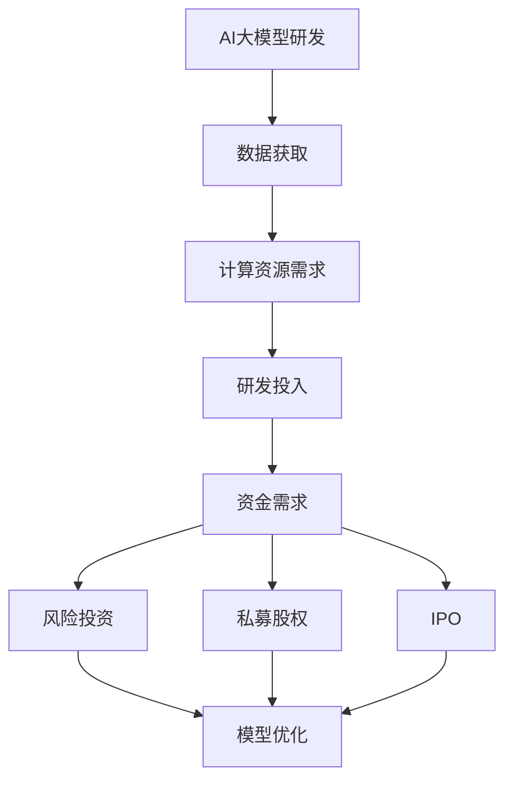

                 

### 背景介绍

近年来，随着人工智能技术的飞速发展，AI大模型（Large-scale AI Models）已经成为了一个热门的研究方向。AI大模型，如GPT、BERT、LLaMA等，拥有极高的参数量和复杂的网络结构，能够在各种任务上取得出色的表现。然而，这些大模型的训练和部署过程需要大量的计算资源和时间，这对于初创公司来说是一个巨大的挑战。

资本优势在这种情况下变得尤为重要。初创公司通过吸引风险投资（Venture Capital, VC）和私募股权（Private Equity, PE）等外部资金，可以获得充足的资金支持，从而加快研发进度，提高市场竞争力。本文将探讨AI大模型创业中如何利用资本优势，实现快速发展和成功上市。

首先，我们将介绍AI大模型的基本概念，包括其发展历史和当前的技术趋势。接着，我们将分析初创公司在AI大模型领域面临的挑战，并探讨如何利用资本优势克服这些挑战。随后，我们将讨论如何制定有效的商业策略，利用资本优势实现快速增长。最后，我们将提供一些建议，帮助初创公司在上市过程中充分利用资本优势。

通过本文的探讨，我们希望能够为那些致力于AI大模型创业的创业者们提供一些有价值的参考和建议。让我们一起探讨如何在这个快速发展的领域中取得成功。

### 核心概念与联系

在深入探讨AI大模型创业之前，我们需要了解一些核心概念，这些概念不仅定义了AI大模型的基本属性，也揭示了其与资本市场的联系。

#### AI大模型的基本概念

AI大模型是指具有巨大参数规模、复杂网络结构和强大计算需求的深度学习模型。这些模型通过大量的数据和计算资源进行训练，从而能够在图像识别、自然语言处理、推荐系统等众多领域实现优异的性能。以下是几个关键的AI大模型概念：

1. **参数量**：AI大模型的参数量通常以数十亿计，甚至达到数万亿。这些参数通过学习大量数据，提取出数据中的特征和模式。
2. **训练数据**：AI大模型需要大量的训练数据来学习。这些数据可以是文本、图像、语音等，数据的质量和数量直接影响模型的性能。
3. **计算资源**：训练AI大模型需要巨大的计算资源，包括高性能的GPU集群和大规模的数据中心。这是初创公司在资源有限的情况下面临的重大挑战。

#### 资本市场的角色

在AI大模型创业过程中，资本市场起到了至关重要的作用。以下是资本市场在其中的几个关键角色：

1. **风险投资**：风险投资公司（Venture Capital Firms）为初创公司提供资金支持，帮助它们克服早期阶段的技术和财务风险。这些资金通常用于模型研发、团队建设、市场推广等。
2. **私募股权**：私募股权投资者（Private Equity Investors）则更倾向于对已经有一定规模和盈利能力的公司进行投资，以期获得更高的回报。
3. **IPO**：首次公开募股（Initial Public Offering, IPO）是初创公司通过资本市场筹集资金的另一种方式。通过IPO，公司可以向社会公众出售股票，从而获得大量资金，进一步推动业务发展。

#### 核心概念与资本市场的联系

AI大模型与资本市场的联系在于：

1. **资金需求**：AI大模型需要大量的资金支持，包括训练数据获取、计算资源购买、研发投入等。
2. **市场潜力**：AI大模型的广泛应用和巨大市场潜力吸引了资本市场的关注，使得初创公司有机会通过资本市场获得资金支持。
3. **投资回报**：资本市场对于AI大模型初创公司的投资回报预期较高，这也驱动了更多的资金流入这一领域。

#### Mermaid流程图

为了更直观地展示AI大模型与资本市场的关系，我们可以使用Mermaid流程图来描述其关键节点。以下是该流程图的Mermaid代码：



在这个流程图中，AI大模型研发过程产生了资金需求，而资本市场（包括风险投资、私募股权和IPO）提供了资金支持，推动了模型的优化和进一步发展。

通过理解这些核心概念和资本市场的作用，我们可以更好地探讨AI大模型创业中的资本优势利用策略。接下来，我们将分析初创公司在AI大模型领域面临的挑战，并探讨如何克服这些挑战。

### 核心算法原理 & 具体操作步骤

在深入了解AI大模型的创业挑战之前，有必要先探讨AI大模型的核心算法原理及其具体操作步骤。以下内容将详细介绍AI大模型的训练、优化和评估过程，以便读者能够更好地理解这些算法如何在实际应用中发挥作用。

#### AI大模型训练过程

AI大模型的训练过程是一个复杂且计算密集型的任务。以下是训练过程的详细步骤：

1. **数据预处理**：在训练AI大模型之前，需要对数据进行预处理。预处理步骤包括数据清洗、数据增强和标准化等。数据清洗是为了去除数据中的噪声和错误，数据增强则是通过变换数据来增加模型的鲁棒性，标准化则将数据缩放到一个统一的范围，以便模型更好地学习。
2. **模型初始化**：在数据预处理完成后，需要初始化模型参数。通常，初始化方法包括随机初始化和预训练模型迁移等方法。随机初始化会随机生成模型参数，而预训练模型迁移则是利用预训练的模型参数作为起点，进行进一步的训练。
3. **正向传播**：在初始化模型参数后，开始进行正向传播。正向传播是将输入数据通过模型的各个层，最终得到输出结果。在这个过程中，模型的权重和偏置会不断更新。
4. **反向传播**：正向传播后，计算输出结果与真实标签之间的误差，并通过反向传播将误差传播回模型的各个层，更新模型的参数。
5. **优化算法**：在反向传播过程中，需要使用优化算法来更新模型参数。常用的优化算法包括梯度下降（Gradient Descent）、Adam优化器等。优化算法的目标是找到最小化损失函数的参数值。
6. **评估与迭代**：在每次迭代后，使用验证集评估模型的性能。如果模型性能没有达到预期，则需要调整模型参数或网络结构，并进行新一轮的训练。

#### 模型优化过程

模型优化是提高AI大模型性能的关键步骤。以下是模型优化的具体操作步骤：

1. **超参数调整**：超参数是模型训练过程中需要手动调整的参数，如学习率、批量大小等。通过调整这些超参数，可以优化模型的训练过程和性能。
2. **网络结构调整**：网络结构调整包括增加或减少层、改变层之间的连接方式等。通过调整网络结构，可以提高模型的泛化能力。
3. **正则化技术**：正则化技术用于防止模型过拟合，包括L1正则化、L2正则化、Dropout等。通过正则化，模型在训练过程中可以更好地学习数据中的通用特征。
4. **集成方法**：集成方法通过结合多个模型的预测结果来提高模型的整体性能。常用的集成方法包括Bagging、Boosting等。

#### 模型评估过程

模型评估是确保AI大模型性能的关键步骤。以下是模型评估的具体操作步骤：

1. **准确性评估**：准确性是评估模型性能最常用的指标，表示模型预测正确的样本占总样本的比例。
2. **F1分数评估**：F1分数是准确性和召回率的调和平均，特别适用于类别不平衡的数据集。
3. **ROC曲线与AUC评估**：ROC曲线用于评估模型在不同阈值下的分类性能，AUC（Area Under Curve）表示曲线下方的面积，AUC值越高，模型的性能越好。
4. **模型稳定性评估**：模型稳定性评估用于评估模型在不同数据集或不同训练批次上的表现，以确保模型的泛化能力。

#### 综合步骤总结

综合上述步骤，AI大模型的核心算法原理及操作步骤可以总结如下：

1. **数据预处理**：清洗、增强和标准化数据。
2. **模型初始化**：随机初始化或迁移预训练模型。
3. **正向传播**：将输入数据通过模型，得到输出结果。
4. **反向传播**：计算误差，更新模型参数。
5. **优化算法**：使用梯度下降或Adam优化器等算法。
6. **评估与迭代**：使用验证集评估模型性能，进行参数调整和迭代。
7. **模型优化**：调整超参数、网络结构、正则化技术等。
8. **模型评估**：使用准确性、F1分数、ROC曲线和AUC等指标评估模型性能。

通过理解AI大模型的核心算法原理及操作步骤，我们可以更好地应对AI大模型创业中的各种挑战。接下来，我们将探讨初创公司在AI大模型领域所面临的挑战，并探讨如何利用资本优势克服这些挑战。

### 数学模型和公式 & 详细讲解 & 举例说明

在深入探讨AI大模型的具体应用和创业策略之前，我们需要了解一些关键的数学模型和公式，这些是AI大模型的核心理论基础。在本章节中，我们将详细介绍这些数学模型和公式，并通过具体的例子来说明它们的实际应用。

#### 损失函数

损失函数是AI大模型训练过程中至关重要的部分，用于衡量模型的预测值与真实值之间的差距。以下是几种常见的损失函数及其公式：

1. **均方误差（MSE, Mean Squared Error）**：
   $$MSE = \frac{1}{n}\sum_{i=1}^{n}(y_i - \hat{y}_i)^2$$
   其中，$y_i$ 是真实值，$\hat{y}_i$ 是模型的预测值，$n$ 是样本数量。

2. **交叉熵损失（Cross-Entropy Loss）**：
   $$H(y, \hat{y}) = -\sum_{i=1}^{n}y_i \log(\hat{y}_i)$$
   其中，$y$ 是真实的概率分布，$\hat{y}$ 是模型预测的概率分布。

举例说明：

假设我们有以下一组数据，真实值与预测值如下：

| 真实值 | 预测值 |
| ------ | ------ |
| 0.1    | 0.2    |
| 0.2    | 0.1    |
| 0.3    | 0.3    |

使用均方误差损失函数计算损失：

$$MSE = \frac{1}{3}\left[(0.1-0.2)^2 + (0.2-0.1)^2 + (0.3-0.3)^2\right] = 0.02/3 \approx 0.0067$$

使用交叉熵损失函数计算损失：

$$H(y, \hat{y}) = -0.1 \log(0.2) - 0.2 \log(0.1) - 0.3 \log(0.3) \approx 0.0972$$

#### 激活函数

激活函数是神经网络中用于引入非线性性的关键组件。以下是几种常见的激活函数及其公式：

1. **Sigmoid函数**：
   $$\sigma(x) = \frac{1}{1 + e^{-x}}$$

2. **ReLU函数**：
   $$\text{ReLU}(x) = \max(0, x)$$

3. **Tanh函数**：
   $$\tanh(x) = \frac{e^x - e^{-x}}{e^x + e^{-x}}$$

举例说明：

使用Sigmoid函数计算激活值：

$$\sigma(2) = \frac{1}{1 + e^{-2}} \approx 0.869$$

使用ReLU函数计算激活值：

$$\text{ReLU}(-2) = \max(0, -2) = 0$$

使用Tanh函数计算激活值：

$$\tanh(2) = \frac{e^2 - e^{-2}}{e^2 + e^{-2}} \approx 0.964$$

#### 优化算法

优化算法用于更新神经网络中的参数，以最小化损失函数。以下是几种常见的优化算法：

1. **梯度下降（Gradient Descent）**：
   $$\theta_{\text{new}} = \theta_{\text{old}} - \alpha \cdot \nabla_\theta J(\theta)$$
   其中，$\theta$ 是参数，$\alpha$ 是学习率，$J(\theta)$ 是损失函数。

2. **Adam优化器**：
   $$m_t = \beta_1 m_{t-1} + (1 - \beta_1) [g_t - g_{t-1}]$$
   $$v_t = \beta_2 v_{t-1} + (1 - \beta_2) [g_t^2 - g_{t-1}^2]$$
   $$\theta_{\text{new}} = \theta_{\text{old}} - \alpha \cdot \frac{m_t}{\sqrt{v_t} + \epsilon}$$
   其中，$m_t$ 和 $v_t$ 分别是梯度的一阶和二阶矩估计，$\beta_1$ 和 $\beta_2$ 是一阶和二阶矩的衰减率，$\epsilon$ 是一个很小的常数。

举例说明：

假设我们有以下参数和梯度：

| 参数 $\theta$ | 梯度 $\nabla_\theta J(\theta)$ |
| ------------ | --------------------------- |
| 2.0         | 0.5                        |

使用梯度下降算法更新参数（学习率为0.1）：

$$\theta_{\text{new}} = 2.0 - 0.1 \cdot 0.5 = 1.5$$

使用Adam优化器更新参数（$\beta_1 = 0.9, \beta_2 = 0.99, \alpha = 0.001, \epsilon = 1e-8$）：

首先计算$m_1$ 和 $v_1$：

$$m_1 = 0.9m_0 + (1 - 0.9)[0.5 - 0] = 0.9 \cdot 0 + 0.1 \cdot 0.5 = 0.05$$
$$v_1 = 0.99v_0 + (1 - 0.99)[0.5^2 - 0^2] = 0.99 \cdot 0 + 0.01 \cdot 0.25 = 0.0025$$

然后更新参数：

$$\theta_{\text{new}} = 2.0 - 0.001 \cdot \frac{0.05}{\sqrt{0.0025} + 1e-8} \approx 1.455$$

通过上述数学模型和公式的讲解，我们可以更好地理解AI大模型的理论基础，从而在实际应用中更有效地训练和优化模型。接下来，我们将通过一个实际的代码案例，展示如何使用这些数学模型和公式来训练一个简单的AI大模型。

### 项目实战：代码实际案例和详细解释说明

在本节中，我们将通过一个实际的代码案例，展示如何利用Python和PyTorch框架来训练一个简单的AI大模型。该案例将涵盖模型搭建、数据预处理、模型训练和评估的全过程，以便读者能够全面了解AI大模型的实战操作。

#### 开发环境搭建

首先，我们需要搭建一个合适的开发环境。以下是所需的软件和工具：

1. **Python**：Python是AI领域的主要编程语言，我们需要安装Python 3.8或更高版本。
2. **PyTorch**：PyTorch是一个流行的深度学习框架，用于构建和训练神经网络。安装命令为：
   ```
   pip install torch torchvision
   ```
3. **Numpy**：Numpy是一个科学计算库，用于数据处理和数值计算。安装命令为：
   ```
   pip install numpy
   ```
4. **Matplotlib**：Matplotlib是一个绘图库，用于可视化训练过程中的关键指标。安装命令为：
   ```
   pip install matplotlib
   ```

#### 数据集准备

在本案例中，我们使用MNIST数据集，这是一个常用的手写数字识别数据集。以下是数据集的加载和预处理步骤：

```python
import torch
from torchvision import datasets, transforms

# 数据预处理
transform = transforms.Compose([
    transforms.ToTensor(),
    transforms.Normalize((0.5,), (0.5,))
])

# 加载MNIST数据集
train_set = datasets.MNIST(
    root='./data',
    train=True,
    download=True,
    transform=transform
)
test_set = datasets.MNIST(
    root='./data',
    train=False,
    download=True,
    transform=transform
)

# 数据集划分
batch_size = 100
train_loader = torch.utils.data.DataLoader(train_set, batch_size=batch_size, shuffle=True)
test_loader = torch.utils.data.DataLoader(test_set, batch_size=batch_size, shuffle=False)
```

#### 模型搭建

接下来，我们使用PyTorch搭建一个简单的卷积神经网络（CNN），用于手写数字识别：

```python
import torch.nn as nn
import torch.nn.functional as F

class SimpleCNN(nn.Module):
    def __init__(self):
        super(SimpleCNN, self).__init__()
        self.conv1 = nn.Conv2d(1, 32, 3, 1) # 1输入通道，32输出通道，3x3卷积核
        self.conv2 = nn.Conv2d(32, 64, 3, 1) # 32输入通道，64输出通道，3x3卷积核
        self.fc1 = nn.Linear(64 * 7 * 7, 128) # 128输出节点
        self.fc2 = nn.Linear(128, 10) # 10输出节点

    def forward(self, x):
        x = F.relu(self.conv1(x))
        x = F.max_pool2d(x, 2)
        x = F.relu(self.conv2(x))
        x = F.max_pool2d(x, 2)
        x = x.view(-1, 64 * 7 * 7)
        x = F.relu(self.fc1(x))
        x = self.fc2(x)
        return F.log_softmax(x, dim=1)

model = SimpleCNN()
```

#### 模型训练

在搭建好模型后，我们需要定义损失函数和优化器，并开始模型的训练：

```python
import torch.optim as optim

# 定义损失函数和优化器
criterion = nn.NLLLoss()
optimizer = optim.Adam(model.parameters(), lr=0.001)

# 训练模型
num_epochs = 10
for epoch in range(num_epochs):
    model.train()
    for batch_idx, (data, target) in enumerate(train_loader):
        optimizer.zero_grad()
        output = model(data)
        loss = criterion(output, target)
        loss.backward()
        optimizer.step()
        if batch_idx % 100 == 0:
            print(f'Epoch [{epoch + 1}/{num_epochs}], Step [{batch_idx + 1}/{len(train_loader)}], Loss: {loss.item():.4f}')
```

#### 模型评估

在训练完成后，我们需要使用测试集评估模型的性能：

```python
import torch.optim as optim

# 评估模型
model.eval()
with torch.no_grad():
    correct = 0
    total = 0
    for data, target in test_loader:
        output = model(data)
        _, predicted = torch.max(output, 1)
        total += target.size(0)
        correct += (predicted == target).sum().item()

print(f'Accuracy on the test set: {100 * correct / total}%')
```

#### 代码解读与分析

在上面的代码中，我们首先导入了所需的库和模块，包括PyTorch、Numpy和Matplotlib。接着，我们进行了数据集的准备和预处理，使用`transforms.Compose`将数据转换为适合模型训练的格式。

模型搭建部分，我们定义了一个简单的卷积神经网络`SimpleCNN`，包含两个卷积层和两个全连接层。在正向传播过程中，输入数据首先通过卷积层提取特征，然后通过池化层降低数据维度，最后通过全连接层进行分类。

在模型训练部分，我们使用`nn.NLLLoss`定义交叉熵损失函数，使用`optim.Adam`优化器进行参数更新。训练过程中，我们通过多次迭代更新模型参数，以最小化损失函数。

在模型评估部分，我们使用测试集评估模型的性能，通过计算预测正确的样本数量与总样本数量的比例，得到模型的准确率。

通过这个实际案例，我们展示了如何利用Python和PyTorch框架搭建、训练和评估一个简单的AI大模型。这个案例不仅帮助我们理解了AI大模型的基本原理，也为我们提供了一个实战操作的参考。接下来，我们将进一步探讨AI大模型在实际应用场景中的价值。

### 实际应用场景

AI大模型在实际应用场景中展现了巨大的潜力和广泛的应用价值。以下是几个关键领域，其中AI大模型已经或即将产生重大影响：

#### 自然语言处理（NLP）

自然语言处理是AI大模型最成功的应用领域之一。AI大模型如GPT和BERT，在文本生成、机器翻译、情感分析、问答系统等方面取得了显著的成果。例如，GPT-3可以生成高质量的文本，从简单的文章摘要到复杂的对话生成，大大提高了内容创作的效率。机器翻译领域，AI大模型也展现了其强大的能力，通过训练大量的双语数据，能够实现高精度的翻译。

#### 计算机视觉（CV）

在计算机视觉领域，AI大模型通过卷积神经网络（CNN）取得了重大突破。大模型如ResNet、Inception等，在图像分类、目标检测、图像分割等方面表现出色。例如，目标检测算法通过AI大模型可以实现实时监控和智能安防，而图像分割技术在医学图像分析中能够辅助医生进行疾病诊断，提高诊断准确率。

#### 推荐系统

推荐系统是另一个受益于AI大模型的领域。大模型通过学习用户的行为和偏好，能够提供个性化的推荐。例如，电子商务平台通过AI大模型可以准确预测用户的购买意图，从而为用户提供更精准的推荐，提升用户满意度。此外，在音乐、视频等流媒体领域，AI大模型也广泛应用于内容推荐，大大提高了用户的娱乐体验。

#### 金融与医疗

在金融领域，AI大模型用于风险控制、信用评分、市场预测等。通过分析海量的金融数据，AI大模型可以识别潜在的金融风险，预测市场走势，为金融机构提供决策支持。在医疗领域，AI大模型通过分析病历、基因数据等，可以辅助医生进行疾病诊断、治疗方案推荐，提高医疗服务的效率和准确性。

#### 其他应用领域

除了上述领域，AI大模型还在教育、智能交通、能源管理、农业等领域展现出巨大的应用潜力。在教育领域，AI大模型可以个性化教学，提供适应每个学生的学习方案。在智能交通领域，AI大模型通过实时数据分析，可以优化交通流量，减少拥堵。在农业领域，AI大模型通过分析环境数据和作物生长情况，可以提供精准的农业管理方案，提高农作物产量。

总的来说，AI大模型在实际应用场景中具有广泛的影响力和巨大的潜力。随着AI大模型技术的不断进步，我们有望在更多领域看到AI大模型带来的变革和突破。接下来，我们将讨论一些有助于AI大模型创业成功的工具和资源推荐。

### 工具和资源推荐

在AI大模型创业过程中，选择合适的工具和资源是至关重要的。以下是一些推荐的工具和资源，它们涵盖了从编程语言、框架到学习资料和开发工具的各个方面。

#### 学习资源推荐

1. **书籍**：
   - 《深度学习》（Ian Goodfellow, Yoshua Bengio, Aaron Courville著）：这是一本深度学习领域的经典教材，详细介绍了神经网络的基础理论、训练方法及应用。
   - 《Python深度学习》（François Chollet著）：这本书通过具体的案例，深入讲解了使用Python和TensorFlow进行深度学习的实践方法。

2. **在线课程**：
   - Coursera的“Deep Learning Specialization”由吴恩达教授主讲，涵盖了深度学习的各个方面。
   - edX的“Neural Network for Machine Learning”由Prof. Alex Smola主讲，适合初学者了解神经网络的基础知识。

3. **博客和论坛**：
   - arXiv：这是一个数学和计算机科学的预印本服务器，可以获取最新的研究成果。
   - Medium上的“AI”标签：这里有很多深度学习领域专家和爱好者的文章和分享。

4. **开源代码和库**：
   - PyTorch：这是一个流行的深度学习框架，适合快速原型设计和实验。
   - TensorFlow：Google开发的开源深度学习平台，具有丰富的生态系统和工具。

#### 开发工具框架推荐

1. **编程语言**：
   - Python：由于其简洁性和丰富的库支持，Python是AI领域最常用的编程语言。
   - R：虽然主要用于统计和数据分析，但在机器学习和数据科学领域也很有用。

2. **框架和库**：
   - PyTorch：用于构建和训练深度学习模型，支持动态计算图。
   - TensorFlow：提供了静态计算图和动态计算图两种模式，适合不同的开发需求。
   - Keras：一个高层神经网络API，能够与TensorFlow和Theano等后端结合使用。

3. **版本控制系统**：
   - Git：一个分布式的版本控制系统，适合团队协作和代码管理。
   - GitHub：基于Git的平台，可以托管代码、进行协作和分享。

4. **云计算平台**：
   - AWS：提供多种机器学习和深度学习服务，包括EC2实例、S3存储等。
   - Google Cloud Platform（GCP）：提供了强大的计算资源和AI工具，如AI Platform。
   - Azure：微软的云计算平台，提供了丰富的机器学习和深度学习服务。

#### 相关论文著作推荐

1. **论文**：
   - "A Theoretically Grounded Application of Dropout in Recurrent Neural Networks"：讨论了在RNN中应用Dropout的方法。
   - "Attention is All You Need"：提出了Transformer模型，彻底改变了序列模型的设计方式。

2. **著作**：
   - 《深度学习》（Goodfellow, Bengio, Courville著）：详细介绍了深度学习的理论和实践。
   - 《机器学习》（Tom Mitchell著）：机器学习领域的经典教材，介绍了多种算法和理论。

通过这些工具和资源的推荐，创业者可以更好地掌握AI大模型的技术要点，提升开发效率，并在创业过程中取得成功。接下来，我们将总结本文的主要内容和未来发展趋势。

### 总结：未来发展趋势与挑战

随着AI大模型技术的不断成熟和应用范围的扩展，未来的发展趋势和面临的挑战也将更加复杂和多样化。以下是未来几年中AI大模型可能面临的主要趋势和挑战。

#### 发展趋势

1. **模型规模将进一步扩大**：随着计算资源和数据量的增加，AI大模型的规模将不断增大。更大的模型将能够捕捉更复杂的数据特征，从而在更多任务上取得突破性进展。

2. **跨领域融合应用**：AI大模型将在更多领域实现融合应用，例如在医疗、金融、教育等领域的深度结合。跨领域的应用将推动AI技术的全面普及，解决更多实际问题。

3. **边缘计算与云计算的结合**：随着边缘计算的兴起，AI大模型将不仅在数据中心训练，也将逐渐迁移到边缘设备上。这将实现更快速的响应和更高效的资源利用。

4. **更强大的自动化能力**：AI大模型将实现更高级的自动化能力，例如自动驾驶、自动化编程等。这些技术将改变传统行业的工作方式，带来新的商业模式和就业机会。

#### 挑战

1. **计算资源需求**：训练和部署AI大模型需要大量的计算资源和时间，这给初创公司带来了巨大的成本压力。如何高效利用现有资源和寻找新的计算解决方案将成为重要挑战。

2. **数据隐私和安全**：AI大模型在处理大量数据时，数据隐私和安全问题变得尤为突出。如何在保证数据隐私的同时，实现有效的数据利用是一个重要的挑战。

3. **模型解释性和透明性**：AI大模型通常被称为“黑盒子”，其内部决策过程难以解释。如何提高模型的解释性和透明性，使其决策过程更加可信，是未来需要解决的重要问题。

4. **算法公平性和道德伦理**：AI大模型的应用需要考虑算法的公平性和道德伦理问题。如何避免算法偏见和歧视，确保技术发展符合社会价值观，是一个亟待解决的问题。

#### 结论

AI大模型技术的发展带来了巨大的机遇和挑战。通过有效的资本利用和战略规划，初创公司可以在这个领域中取得成功。同时，我们也需要关注技术发展带来的社会问题，确保AI技术能够造福人类。未来，随着技术的不断进步和社会的适应，AI大模型将在更多领域发挥其潜力，成为推动社会进步的重要力量。

### 附录：常见问题与解答

在AI大模型创业过程中，可能会遇到一系列技术和管理上的问题。以下是一些常见问题及其解答，旨在帮助创业者更好地应对挑战。

#### 问题1：如何高效利用计算资源？

**解答**：高效利用计算资源是AI大模型创业的关键。以下是一些建议：

1. **云计算平台**：使用AWS、Google Cloud Platform、Azure等云计算平台，根据需求动态调整计算资源，降低成本。
2. **分布式训练**：将训练任务分布到多个计算节点上，提高训练效率。
3. **优化模型结构**：采用更高效的模型架构，如轻量级网络（MobileNet、SqueezeNet），减少计算需求。
4. **GPU优化**：优化GPU的使用，包括使用合适的驱动程序和CUDA版本，提高GPU的利用率。

#### 问题2：如何确保数据隐私和安全？

**解答**：数据隐私和安全是AI大模型创业的重要挑战。以下是一些建议：

1. **数据加密**：对敏感数据进行加密，防止数据泄露。
2. **数据脱敏**：在数据处理过程中，对个人身份信息进行脱敏处理，确保数据匿名化。
3. **访问控制**：实施严格的访问控制策略，确保只有授权人员才能访问敏感数据。
4. **安全审计**：定期进行安全审计，检测潜在的安全漏洞，及时进行修复。

#### 问题3：如何提高模型的解释性和透明性？

**解答**：提高模型的解释性和透明性对于建立用户信任至关重要。以下是一些建议：

1. **模型可解释性工具**：使用模型可解释性工具，如LIME、SHAP等，分析模型决策过程。
2. **可视化**：通过可视化技术，展示模型的学习过程和决策路径，帮助用户理解模型行为。
3. **透明化训练过程**：公开模型的训练数据和过程，接受外部审计和监督。
4. **减少模型复杂性**：简化模型结构，减少参数数量，提高模型的可解释性。

#### 问题4：如何应对算法偏见和歧视？

**解答**：算法偏见和歧视是AI大模型创业中不可忽视的问题。以下是一些建议：

1. **数据多样性**：确保训练数据具有多样性，涵盖不同人群和背景。
2. **算法公平性评估**：使用公平性评估工具，检测算法偏见，调整模型参数，提高算法的公平性。
3. **用户反馈机制**：建立用户反馈机制，收集用户对模型表现的反馈，持续优化模型。
4. **法律和道德约束**：遵循相关法律和道德规范，确保算法设计和应用符合社会价值观。

通过上述问题和解答，创业者可以更好地应对AI大模型创业过程中可能遇到的技术和管理挑战。这些建议将有助于提升创业成功率，推动AI技术的可持续发展。

### 扩展阅读 & 参考资料

在AI大模型创业领域，有大量的书籍、论文和博客可以帮助创业者深入了解相关技术和策略。以下是推荐的扩展阅读和参考资料，旨在为读者提供更多有价值的信息和深入研究的方向。

#### 书籍

1. **《深度学习》（Ian Goodfellow, Yoshua Bengio, Aaron Courville著）**：这本书是深度学习领域的经典教材，详细介绍了神经网络的基础理论、训练方法及应用。
2. **《Python深度学习》（François Chollet著）**：通过具体的案例，深入讲解了使用Python和TensorFlow进行深度学习的实践方法。
3. **《机器学习》（Tom Mitchell著）**：介绍了多种算法和理论，是机器学习领域的经典教材。

#### 论文

1. **"A Theoretically Grounded Application of Dropout in Recurrent Neural Networks"**：讨论了在RNN中应用Dropout的方法。
2. **"Attention is All You Need"**：提出了Transformer模型，彻底改变了序列模型的设计方式。
3. **"Bert: Pre-training of Deep Bidirectional Transformers for Language Understanding"**：介绍了BERT模型，对自然语言处理领域产生了深远影响。

#### 博客和网站

1. **arXiv**：这是一个数学和计算机科学的预印本服务器，可以获取最新的研究成果。
2. **Medium上的“AI”标签**：这里有很多深度学习领域专家和爱好者的文章和分享。
3. **TensorFlow官方文档**：提供了详细的API和使用指南，适合初学者和专业人士。

#### 在线课程

1. **Coursera的“Deep Learning Specialization”**：由吴恩达教授主讲，涵盖了深度学习的各个方面。
2. **edX的“Neural Network for Machine Learning”**：由Prof. Alex Smola主讲，适合初学者了解神经网络的基础知识。

通过这些扩展阅读和参考资料，创业者可以更全面地了解AI大模型领域的最新进展，提升自身的知识储备和技术水平，为创业成功奠定坚实基础。

