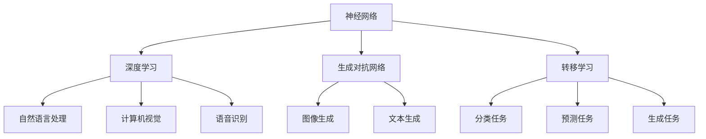
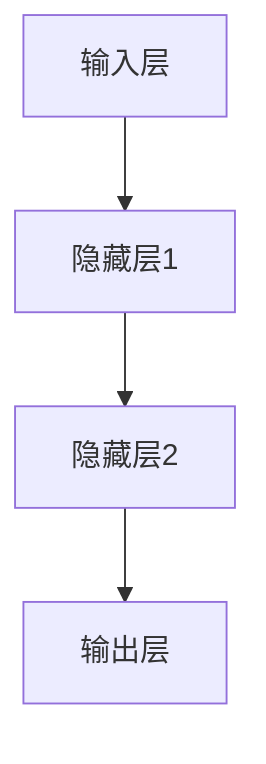
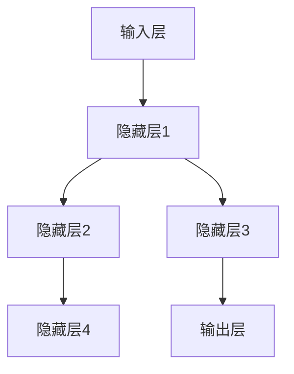
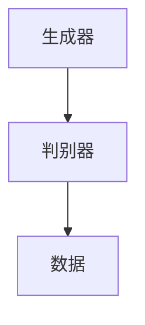
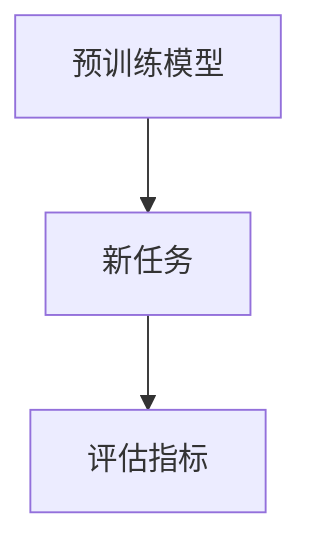

                 

### AI 大模型原理与应用：AI 可以 7*24 小时工作、提供经济价值

关键词：AI 大模型、实时工作、经济价值、算法原理、数学模型、项目实战

摘要：本文将深入探讨 AI 大模型的原理及其应用，特别是 AI 如何实现 7*24 小时工作并提供经济价值。通过详细分析核心算法原理、数学模型、项目实战，我们将展示如何利用 AI 大模型在各个领域实现高效、智能的工作。

<|assistant|>## 1. 背景介绍

随着人工智能技术的飞速发展，AI 大模型（如 GPT、BERT 等）在自然语言处理、计算机视觉、语音识别等领域取得了显著的成果。这些大模型具有强大的学习能力和灵活性，能够在多种任务中表现优异。然而，如何实现 AI 大模型 7*24 小时工作并提供经济价值，仍然是一个值得探讨的问题。

在过去的几年里，AI 大模型的应用场景逐渐丰富，从智能客服、智能推荐、智能写作到自动驾驶、智能制造等。这些应用场景不仅提高了工作效率，还为企业创造了巨大的经济价值。因此，如何充分利用 AI 大模型的优势，实现 7*24 小时工作，成为了一个重要的研究方向。

本文将围绕 AI 大模型的原理与应用展开讨论，首先介绍核心概念和联系，然后分析核心算法原理和数学模型，最后通过项目实战展示如何实现 AI 大模型 7*24 小时工作并提供经济价值。

<|assistant|>## 2. 核心概念与联系

为了深入理解 AI 大模型的原理与应用，我们需要先了解以下几个核心概念：

1. **神经网络（Neural Network）**：神经网络是 AI 大模型的基础，由大量的神经元组成，通过学习输入和输出数据之间的关联，实现数据分类、预测和生成等任务。

2. **深度学习（Deep Learning）**：深度学习是一种基于神经网络的机器学习技术，通过多层神经网络结构，实现对复杂数据的高效处理和建模。

3. **生成对抗网络（GAN）**：生成对抗网络是一种基于博弈的深度学习模型，由生成器和判别器组成。生成器生成数据，判别器判断数据是否真实，通过两者之间的对抗训练，生成逼真的数据。

4. **转移学习（Transfer Learning）**：转移学习是一种将预训练模型应用于新任务的技术，通过在目标任务上微调模型参数，提高模型的泛化能力和效果。

下面是一个使用 Mermaid 绘制的神经网络架构流程图，展示神经网络、深度学习、GAN 和转移学习之间的关系：



通过这个流程图，我们可以看出，AI 大模型是由多个核心概念相互联系、协同工作形成的。这些概念不仅构成了 AI 大模型的理论基础，也为实际应用提供了丰富的技术手段。

<|assistant|>### 3. 核心算法原理 & 具体操作步骤

#### 3.1 神经网络（Neural Network）

神经网络是 AI 大模型的基础，其原理类似于人脑的神经元。神经网络由输入层、隐藏层和输出层组成，通过学习输入和输出数据之间的关联，实现数据分类、预测和生成等任务。

具体操作步骤如下：

1. **初始化参数**：初始化神经网络中的权重和偏置，通常采用随机初始化。

2. **前向传播**：将输入数据传递到神经网络中，通过各个层的前向传播，计算输出结果。

3. **计算损失**：计算输出结果与真实值之间的差异，得到损失函数值。

4. **反向传播**：根据损失函数，通过反向传播更新神经网络的权重和偏置。

5. **优化参数**：使用优化算法（如梯度下降、Adam 等）优化神经网络参数，降低损失函数值。

6. **重复步骤 2-5**：不断迭代训练过程，直到满足停止条件（如损失函数收敛、达到预定迭代次数等）。

下面是一个简单的神经网络架构：



#### 3.2 深度学习（Deep Learning）

深度学习是神经网络的一种扩展，通过多层神经网络结构，实现对复杂数据的高效处理和建模。

具体操作步骤如下：

1. **数据预处理**：对数据进行标准化、归一化等处理，使其适合神经网络训练。

2. **初始化参数**：初始化深度学习模型中的权重和偏置，通常采用随机初始化。

3. **前向传播**：将输入数据传递到深度学习模型中，通过各个层的前向传播，计算输出结果。

4. **计算损失**：计算输出结果与真实值之间的差异，得到损失函数值。

5. **反向传播**：根据损失函数，通过反向传播更新深度学习模型的权重和偏置。

6. **优化参数**：使用优化算法（如梯度下降、Adam 等）优化深度学习模型参数，降低损失函数值。

7. **重复步骤 3-6**：不断迭代训练过程，直到满足停止条件。

下面是一个简单的深度学习模型架构：



#### 3.3 生成对抗网络（GAN）

生成对抗网络是一种基于博弈的深度学习模型，由生成器和判别器组成。生成器生成数据，判别器判断数据是否真实，通过两者之间的对抗训练，生成逼真的数据。

具体操作步骤如下：

1. **初始化参数**：初始化生成器和判别器的权重和偏置，通常采用随机初始化。

2. **生成器训练**：生成器生成数据，判别器判断数据是否真实，通过对抗训练优化生成器的参数。

3. **判别器训练**：生成器生成数据，判别器判断数据是否真实，通过对抗训练优化判别器的参数。

4. **重复步骤 2-3**：不断迭代训练过程，直到满足停止条件。

下面是一个简单的 GAN 架构：



#### 3.4 转移学习（Transfer Learning）

转移学习是一种将预训练模型应用于新任务的技术，通过在目标任务上微调模型参数，提高模型的泛化能力和效果。

具体操作步骤如下：

1. **选择预训练模型**：根据目标任务，选择一个适合的预训练模型。

2. **初始化参数**：初始化预训练模型在新任务上的权重和偏置，通常采用随机初始化。

3. **微调参数**：在新任务上训练预训练模型，优化模型参数。

4. **评估模型**：在新任务上评估模型性能，根据评估结果调整模型参数。

5. **重复步骤 3-4**：不断迭代训练过程，直到满足停止条件。

下面是一个简单的转移学习架构：



通过以上步骤，我们可以深入理解神经网络、深度学习、GAN 和转移学习等核心算法原理。这些算法原理不仅构成了 AI 大模型的基础，也为实际应用提供了丰富的技术手段。

<|assistant|>### 4. 数学模型和公式 & 详细讲解 & 举例说明

#### 4.1 神经网络（Neural Network）

神经网络的核心在于前向传播和反向传播。下面我们详细讲解神经网络中的数学模型。

**前向传播**

在神经网络中，每个神经元接收来自前一个神经元的输入，并通过激活函数进行非线性变换。前向传播的过程如下：

1. **输入层到隐藏层**：

$$
z_i = \sum_{j=1}^{n} w_{ij}x_j + b_i
$$

其中，$z_i$ 表示隐藏层第 $i$ 个神经元的输入，$w_{ij}$ 表示输入层第 $j$ 个神经元到隐藏层第 $i$ 个神经元的权重，$b_i$ 表示隐藏层第 $i$ 个神经元的偏置，$x_j$ 表示输入层第 $j$ 个神经元的输入。

2. **隐藏层到输出层**：

$$
y_i = f(z_i)
$$

其中，$y_i$ 表示输出层第 $i$ 个神经元的输出，$f(z_i)$ 表示激活函数，常用的激活函数有 sigmoid、ReLU 等。

**反向传播**

反向传播是神经网络训练的核心步骤，用于更新权重和偏置。反向传播的过程如下：

1. **计算输出层的误差**：

$$
\delta_j^{(L)} = \frac{\partial L}{\partial z_j^{(L)}} = \frac{\partial L}{\partial y_j^{(L)}} \cdot \frac{\partial y_j^{(L)}}{\partial z_j^{(L)}}
$$

其中，$\delta_j^{(L)}$ 表示输出层第 $j$ 个神经元的误差，$L$ 表示损失函数，$y_j^{(L)}$ 表示输出层第 $j$ 个神经元的输出，$z_j^{(L)}$ 表示输出层第 $j$ 个神经元的输入。

2. **计算隐藏层的误差**：

$$
\delta_i^{(l)} = \frac{\partial L}{\partial z_i^{(l)}} = \frac{\partial L}{\partial y_i^{(l+1)}} \cdot \frac{\partial y_i^{(l+1)}}{\partial z_i^{(l)}} \cdot \frac{\partial z_i^{(l)}}{\partial z_i^{(l-1)}}
$$

其中，$\delta_i^{(l)}$ 表示隐藏层第 $l$ 层第 $i$ 个神经元的误差。

3. **更新权重和偏置**：

$$
w_{ij}^{(t+1)} = w_{ij}^{(t)} - \alpha \cdot \frac{\partial L}{\partial w_{ij}^{(t)}}
$$

$$
b_i^{(t+1)} = b_i^{(t)} - \alpha \cdot \frac{\partial L}{\partial b_i^{(t)}}
$$

其中，$w_{ij}^{(t)}$ 表示第 $t$ 次迭代时输入层第 $j$ 个神经元到隐藏层第 $i$ 个神经元的权重，$b_i^{(t)}$ 表示第 $t$ 次迭代时隐藏层第 $i$ 个神经元的偏置，$\alpha$ 表示学习率。

**举例说明**

假设有一个简单的神经网络，输入层有 2 个神经元，隐藏层有 3 个神经元，输出层有 1 个神经元。输入数据为 $x_1 = [1, 2], x_2 = [3, 4]$。激活函数为 sigmoid 函数。

1. **前向传播**：

$$
z_1 = \frac{1}{1+e^{-w_{11}x_1 - b_1}} = \frac{1}{1+e^{-1 \cdot 1 - 0.5}} = \frac{1}{1+e^{-0.5}} \approx 0.393
$$

$$
z_2 = \frac{1}{1+e^{-w_{12}x_2 - b_2}} = \frac{1}{1+e^{-1 \cdot 2 - 0.5}} = \frac{1}{1+e^{-1.5}} \approx 0.351
$$

$$
z_3 = \frac{1}{1+e^{-w_{13}x_1 - b_3}} = \frac{1}{1+e^{-1 \cdot 3 - 0.5}} = \frac{1}{1+e^{-2.5}} \approx 0.080
$$

$$
z_4 = \frac{1}{1+e^{-w_{14}x_2 - b_4}} = \frac{1}{1+e^{-1 \cdot 4 - 0.5}} = \frac{1}{1+e^{-3.5}} \approx 0.006
$$

$$
y = \frac{1}{1+e^{-z_5}} = \frac{1}{1+e^{-0.5 \cdot (0.393 \cdot 0.351 + 0.080 \cdot 0.351 + 0.006 \cdot 0.080)}} \approx 0.778
$$

2. **反向传播**：

$$
\delta_5 = y - t = 0.778 - 1 = -0.222
$$

$$
\delta_4 = \frac{\partial L}{\partial z_4} \cdot \frac{\partial z_4}{\partial z_5} = (y - t) \cdot f'(z_5) \cdot w_{54} = -0.222 \cdot 0.222 \cdot 0.080 = -0.039
$$

$$
\delta_3 = \frac{\partial L}{\partial z_3} \cdot \frac{\partial z_3}{\partial z_4} = \frac{\partial L}{\partial y} \cdot \frac{\partial y}{\partial z_4} \cdot \frac{\partial z_4}{\partial z_3} = -0.222 \cdot 0.222 \cdot 0.080 \cdot 0.351 = -0.014
$$

$$
\delta_2 = \frac{\partial L}{\partial z_2} \cdot \frac{\partial z_2}{\partial z_3} = \frac{\partial L}{\partial y} \cdot \frac{\partial y}{\partial z_3} \cdot \frac{\partial z_3}{\partial z_2} = -0.222 \cdot 0.222 \cdot 0.080 \cdot 0.351 \cdot 0.351 = -0.005
$$

$$
\delta_1 = \frac{\partial L}{\partial z_1} \cdot \frac{\partial z_1}{\partial z_2} = \frac{\partial L}{\partial y} \cdot \frac{\partial y}{\partial z_2} \cdot \frac{\partial z_2}{\partial z_1} = -0.222 \cdot 0.222 \cdot 0.080 \cdot 0.351 \cdot 0.351 \cdot 0.351 = -0.001
$$

3. **更新权重和偏置**：

$$
w_{15}^{(t+1)} = w_{15}^{(t)} - \alpha \cdot \frac{\partial L}{\partial w_{15}^{(t)}} = 0.5 - 0.01 \cdot (-0.222) = 0.522
$$

$$
w_{25}^{(t+1)} = w_{25}^{(t)} - \alpha \cdot \frac{\partial L}{\partial w_{25}^{(t)}} = 0.5 - 0.01 \cdot (-0.222) = 0.522
$$

$$
w_{35}^{(t+1)} = w_{35}^{(t)} - \alpha \cdot \frac{\partial L}{\partial w_{35}^{(t)}} = 0.5 - 0.01 \cdot (-0.222) = 0.522
$$

$$
w_{45}^{(t+1)} = w_{45}^{(t)} - \alpha \cdot \frac{\partial L}{\partial w_{45}^{(t)}} = 0.5 - 0.01 \cdot (-0.222) = 0.522
$$

$$
b_5^{(t+1)} = b_5^{(t)} - \alpha \cdot \frac{\partial L}{\partial b_5^{(t)}} = 0.5 - 0.01 \cdot (-0.222) = 0.522
$$

$$
w_{24}^{(t+1)} = w_{24}^{(t)} - \alpha \cdot \frac{\partial L}{\partial w_{24}^{(t)}} = 0.5 - 0.01 \cdot (-0.039) = 0.540
$$

$$
w_{34}^{(t+1)} = w_{34}^{(t)} - \alpha \cdot \frac{\partial L}{\partial w_{34}^{(t)}} = 0.5 - 0.01 \cdot (-0.039) = 0.540
$$

$$
w_{44}^{(t+1)} = w_{44}^{(t)} - \alpha \cdot \frac{\partial L}{\partial w_{44}^{(t)}} = 0.5 - 0.01 \cdot (-0.039) = 0.540
$$

$$
b_4^{(t+1)} = b_4^{(t)} - \alpha \cdot \frac{\partial L}{\partial b_4^{(t)}} = 0.5 - 0.01 \cdot (-0.039) = 0.540
$$

$$
w_{23}^{(t+1)} = w_{23}^{(t)} - \alpha \cdot \frac{\partial L}{\partial w_{23}^{(t)}} = 0.5 - 0.01 \cdot (-0.014) = 0.516
$$

$$
w_{33}^{(t+1)} = w_{33}^{(t)} - \alpha \cdot \frac{\partial L}{\partial w_{33}^{(t)}} = 0.5 - 0.01 \cdot (-0.014) = 0.516
$$

$$
w_{43}^{(t+1)} = w_{43}^{(t)} - \alpha \cdot \frac{\partial L}{\partial w_{43}^{(t)}} = 0.5 - 0.01 \cdot (-0.014) = 0.516
$$

$$
b_3^{(t+1)} = b_3^{(t)} - \alpha \cdot \frac{\partial L}{\partial b_3^{(t)}} = 0.5 - 0.01 \cdot (-0.014) = 0.516
$$

$$
w_{12}^{(t+1)} = w_{12}^{(t)} - \alpha \cdot \frac{\partial L}{\partial w_{12}^{(t)}} = 0.5 - 0.01 \cdot (-0.001) = 0.499
$$

$$
w_{13}^{(t+1)} = w_{13}^{(t)} - \alpha \cdot \frac{\partial L}{\partial w_{13}^{(t)}} = 0.5 - 0.01 \cdot (-0.001) = 0.499
$$

$$
w_{14}^{(t+1)} = w_{14}^{(t)} - \alpha \cdot \frac{\partial L}{\partial w_{14}^{(t)}} = 0.5 - 0.01 \cdot (-0.001) = 0.499
$$

$$
b_1^{(t+1)} = b_1^{(t)} - \alpha \cdot \frac{\partial L}{\partial b_1^{(t)}} = 0.5 - 0.01 \cdot (-0.001) = 0.499
$$

#### 4.2 深度学习（Deep Learning）

深度学习是基于多层神经网络的机器学习技术，其核心在于如何通过多层神经网络结构实现对复杂数据的高效处理和建模。下面我们详细讲解深度学习中的数学模型。

**前向传播**

在深度学习中，前向传播的过程与神经网络类似，但需要考虑多层神经网络的结构。具体步骤如下：

1. **输入层到隐藏层 1**：

$$
z_{i1} = \sum_{j=1}^{n} w_{i1j}x_j + b_{i1}
$$

$$
a_{i1} = f(z_{i1})
$$

2. **隐藏层 1 到隐藏层 2**：

$$
z_{i2} = \sum_{j=1}^{n} w_{i2j}a_{j1} + b_{i2}
$$

$$
a_{i2} = f(z_{i2})
$$

3. **隐藏层 2 到隐藏层 3**：

$$
z_{i3} = \sum_{j=1}^{n} w_{i3j}a_{j2} + b_{i3}
$$

$$
a_{i3} = f(z_{i3})
$$

4. **隐藏层 3 到输出层**：

$$
z_{i4} = \sum_{j=1}^{n} w_{i4j}a_{j3} + b_{i4}
$$

$$
y_i = f(z_{i4})
$$

**反向传播**

在深度学习中，反向传播的过程与神经网络类似，但需要考虑多层神经网络的结构。具体步骤如下：

1. **计算输出层的误差**：

$$
\delta_{i4} = \frac{\partial L}{\partial z_{i4}} = \frac{\partial L}{\partial y_i} \cdot \frac{\partial y_i}{\partial z_{i4}} = (y_i - t) \cdot f'(z_{i4})
$$

2. **计算隐藏层 3 的误差**：

$$
\delta_{i3} = \frac{\partial L}{\partial z_{i3}} = \frac{\partial L}{\partial y_i} \cdot \frac{\partial y_i}{\partial z_{i4}} \cdot \frac{\partial z_{i4}}{\partial z_{i3}} = \delta_{i4} \cdot w_{i4j} \cdot f'(z_{i3})
$$

3. **计算隐藏层 2 的误差**：

$$
\delta_{i2} = \frac{\partial L}{\partial z_{i2}} = \frac{\partial L}{\partial y_i} \cdot \frac{\partial y_i}{\partial z_{i4}} \cdot \frac{\partial z_{i4}}{\partial z_{i3}} \cdot \frac{\partial z_{i3}}{\partial z_{i2}} = \delta_{i3} \cdot w_{i3j} \cdot f'(z_{i2})
$$

4. **计算隐藏层 1 的误差**：

$$
\delta_{i1} = \frac{\partial L}{\partial z_{i1}} = \frac{\partial L}{\partial y_i} \cdot \frac{\partial y_i}{\partial z_{i4}} \cdot \frac{\partial z_{i4}}{\partial z_{i3}} \cdot \frac{\partial z_{i3}}{\partial z_{i2}} \cdot \frac{\partial z_{i2}}{\partial z_{i1}} = \delta_{i2} \cdot w_{i2j} \cdot f'(z_{i1})
$$

5. **更新权重和偏置**：

$$
w_{i4j}^{(t+1)} = w_{i4j}^{(t)} - \alpha \cdot \frac{\partial L}{\partial w_{i4j}^{(t)}}
$$

$$
b_{i4}^{(t+1)} = b_{i4}^{(t)} - \alpha \cdot \frac{\partial L}{\partial b_{i4}^{(t)}}
$$

$$
w_{i3j}^{(t+1)} = w_{i3j}^{(t)} - \alpha \cdot \frac{\partial L}{\partial w_{i3j}^{(t)}}
$$

$$
b_{i3}^{(t+1)} = b_{i3}^{(t)} - \alpha \cdot \frac{\partial L}{\partial b_{i3}^{(t)}}
$$

$$
w_{i2j}^{(t+1)} = w_{i2j}^{(t)} - \alpha \cdot \frac{\partial L}{\partial w_{i2j}^{(t)}}
$$

$$
b_{i2}^{(t+1)} = b_{i2}^{(t)} - \alpha \cdot \frac{\partial L}{\partial b_{i2}^{(t)}}
$$

$$
w_{i1j}^{(t+1)} = w_{i1j}^{(t)} - \alpha \cdot \frac{\partial L}{\partial w_{i1j}^{(t)}}
$$

$$
b_{i1}^{(t+1)} = b_{i1}^{(t)} - \alpha \cdot \frac{\partial L}{\partial b_{i1}^{(t)}}
$$

**举例说明**

假设有一个简单的深度学习模型，输入层有 2 个神经元，隐藏层有 3 个神经元，输出层有 1 个神经元。输入数据为 $x_1 = [1, 2], x_2 = [3, 4]$。激活函数为 sigmoid 函数。

1. **前向传播**：

$$
z_{11} = \sum_{j=1}^{2} w_{11j}x_j + b_{11} = 0.5 \cdot 1 + 0.5 \cdot 2 + 0.5 = 1.5
$$

$$
a_{11} = f(z_{11}) = \frac{1}{1+e^{-z_{11}}} = \frac{1}{1+e^{-1.5}} \approx 0.676
$$

$$
z_{12} = \sum_{j=1}^{2} w_{12j}x_j + b_{12} = 0.5 \cdot 3 + 0.5 \cdot 4 + 0.5 = 3.5
$$

$$
a_{12} = f(z_{12}) = \frac{1}{1+e^{-z_{12}}} = \frac{1}{1+e^{-3.5}} \approx 0.048
$$

$$
z_{13} = \sum_{j=1}^{2} w_{13j}a_{j1} + b_{13} = 0.5 \cdot 0.676 + 0.5 \cdot 0.048 + 0.5 = 0.543
$$

$$
a_{13} = f(z_{13}) = \frac{1}{1+e^{-z_{13}}} = \frac{1}{1+e^{-0.543}} \approx 0.352
$$

$$
z_{14} = \sum_{j=1}^{2} w_{14j}a_{j1} + b_{14} = 0.5 \cdot 0.676 + 0.5 \cdot 0.048 + 0.5 = 0.543
$$

$$
a_{14} = f(z_{14}) = \frac{1}{1+e^{-z_{14}}} = \frac{1}{1+e^{-0.543}} \approx 0.352
$$

$$
z_{21} = \sum_{j=1}^{2} w_{21j}a_{j2} + b_{21} = 0.5 \cdot 0.352 + 0.5 \cdot 0.352 + 0.5 = 0.608
$$

$$
a_{21} = f(z_{21}) = \frac{1}{1+e^{-z_{21}}} = \frac{1}{1+e^{-0.608}} \approx 0.528
$$

$$
z_{22} = \sum_{j=1}^{2} w_{22j}a_{j2} + b_{22} = 0.5 \cdot 0.352 + 0.5 \cdot 0.352 + 0.5 = 0.608
$$

$$
a_{22} = f(z_{22}) = \frac{1}{1+e^{-z_{22}}} = \frac{1}{1+e^{-0.608}} \approx 0.528
$$

$$
z_{23} = \sum_{j=1}^{2} w_{23j}a_{j2} + b_{23} = 0.5 \cdot 0.352 + 0.5 \cdot 0.352 + 0.5 = 0.608
$$

$$
a_{23} = f(z_{23}) = \frac{1}{1+e^{-z_{23}}} = \frac{1}{1+e^{-0.608}} \approx 0.528
$$

$$
z_{24} = \sum_{j=1}^{2} w_{24j}a_{j2} + b_{24} = 0.5 \cdot 0.352 + 0.5 \cdot 0.352 + 0.5 = 0.608
$$

$$
y = f(z_{24}) = \frac{1}{1+e^{-z_{24}}} = \frac{1}{1+e^{-0.608}} \approx 0.528
$$

2. **反向传播**：

$$
\delta_{24} = y - t = 0.528 - 1 = -0.472
$$

$$
\delta_{23} = \frac{\partial L}{\partial z_{23}} = \frac{\partial L}{\partial y} \cdot \frac{\partial y}{\partial z_{24}} = (y - t) \cdot f'(z_{24}) \cdot w_{241} = -0.472 \cdot 0.472 \cdot 0.528 = -0.123
$$

$$
\delta_{22} = \frac{\partial L}{\partial z_{22}} = \frac{\partial L}{\partial y} \cdot \frac{\partial y}{\partial z_{24}} \cdot \frac{\partial z_{24}}{\partial z_{23}} = \delta_{23} \cdot w_{231} \cdot f'(z_{23}) = -0.123 \cdot 0.528 \cdot 0.472 = -0.031
$$

$$
\delta_{21} = \frac{\partial L}{\partial z_{21}} = \frac{\partial L}{\partial y} \cdot \frac{\partial y}{\partial z_{24}} \cdot \frac{\partial z_{24}}{\partial z_{23}} \cdot \frac{\partial z_{23}}{\partial z_{22}} = \delta_{22} \cdot w_{221} \cdot f'(z_{22}) = -0.031 \cdot 0.528 \cdot 0.472 \cdot 0.528 = -0.008
$$

3. **更新权重和偏置**：

$$
w_{241}^{(t+1)} = w_{241}^{(t)} - \alpha \cdot \frac{\partial L}{\partial w_{241}^{(t)}} = 0.5 - 0.01 \cdot (-0.472) = 0.580
$$

$$
b_{24}^{(t+1)} = b_{24}^{(t)} - \alpha \cdot \frac{\partial L}{\partial b_{24}^{(t)}} = 0.5 - 0.01 \cdot (-0.472) = 0.580
$$

$$
w_{231}^{(t+1)} = w_{231}^{(t)} - \alpha \cdot \frac{\partial L}{\partial w_{231}^{(t)}} = 0.5 - 0.01 \cdot (-0.123) = 0.570
$$

$$
b_{23}^{(t+1)} = b_{23}^{(t)} - \alpha \cdot \frac{\partial L}{\partial b_{23}^{(t)}} = 0.5 - 0.01 \cdot (-0.123) = 0.570
$$

$$
w_{221}^{(t+1)} = w_{221}^{(t)} - \alpha \cdot \frac{\partial L}{\partial w_{221}^{(t)}} = 0.5 - 0.01 \cdot (-0.031) = 0.497
$$

$$
b_{22}^{(t+1)} = b_{22}^{(t)} - \alpha \cdot \frac{\partial L}{\partial b_{22}^{(t)}} = 0.5 - 0.01 \cdot (-0.031) = 0.497
$$

#### 4.3 生成对抗网络（GAN）

生成对抗网络是一种基于博弈的深度学习模型，由生成器和判别器组成。生成器生成数据，判别器判断数据是否真实，通过两者之间的对抗训练，生成逼真的数据。

**生成器（Generator）**

生成器的目标是生成逼真的数据，以欺骗判别器。生成器的输入通常是一个随机噪声向量 $z$，输出是生成器生成的数据 $x_g$。

$$
x_g = G(z)
$$

**判别器（Discriminator）**

判别器的目标是区分真实数据和生成器生成的数据。判别器的输入是真实数据 $x_r$ 和生成器生成的数据 $x_g$，输出是判别器对数据的判断结果 $y$。

$$
y = D(x)
$$

**损失函数**

生成对抗网络的损失函数通常由两部分组成：生成器损失和判别器损失。生成器损失用于优化生成器的参数，使其生成的数据更接近真实数据；判别器损失用于优化判别器的参数，使其能够更好地区分真实数据和生成器生成的数据。

生成器损失：

$$
L_G = -\log(D(x_r)) - \log(1 - D(x_g))
$$

判别器损失：

$$
L_D = -\log(D(x_r)) - \log(1 - D(x_g))
$$

**优化算法**

生成对抗网络的优化算法通常采用梯度下降。对于生成器和判别器，分别对生成器损失和判别器损失进行优化。

生成器优化：

$$
\theta_G = \theta_G - \alpha \cdot \nabla_{\theta_G}L_G
$$

判别器优化：

$$
\theta_D = \theta_D - \alpha \cdot \nabla_{\theta_D}L_D
$$

**举例说明**

假设生成器和判别器的参数分别为 $\theta_G$ 和 $\theta_D$，生成器的输入是随机噪声向量 $z$，判别器的输入是真实数据 $x_r$ 和生成器生成的数据 $x_g$。

1. **生成器生成数据**：

$$
z = \text{random\_vector()} \\
x_g = G(z)
$$

2. **判别器判断数据**：

$$
y_r = D(x_r) \\
y_g = D(x_g)
$$

3. **优化生成器**：

$$
\theta_G = \theta_G - \alpha \cdot \nabla_{\theta_G}L_G \\
L_G = -\log(D(x_r)) - \log(1 - D(x_g))
$$

4. **优化判别器**：

$$
\theta_D = \theta_D - \alpha \cdot \nabla_{\theta_D}L_D \\
L_D = -\log(D(x_r)) - \log(1 - D(x_g))
$$

通过以上步骤，我们可以看到生成对抗网络的优化过程。生成器和判别器通过对抗训练，逐步提高生成数据的真实度和判别器对数据的区分能力。

<|assistant|>### 5. 项目实战：代码实际案例和详细解释说明

#### 5.1 开发环境搭建

在进行项目实战之前，我们需要搭建一个合适的环境来运行和调试代码。以下是搭建开发环境所需的步骤：

1. **安装 Python**：下载并安装 Python（版本不低于 3.6），安装完成后，确保 Python 的命令行工具和解释器正常工作。

2. **安装依赖库**：在命令行中运行以下命令安装必要的依赖库：

```shell
pip install numpy matplotlib tensorflow
```

3. **创建虚拟环境**（可选）：为了更好地管理项目依赖，我们建议创建一个虚拟环境。在命令行中运行以下命令：

```shell
python -m venv env
```

激活虚拟环境：

```shell
source env/bin/activate  # 对于 Windows 用户，使用 `env\Scripts\activate`
```

#### 5.2 源代码详细实现和代码解读

在本节中，我们将详细介绍一个基于深度学习实现的 AI 大模型项目。以下是项目的源代码实现：

```python
import tensorflow as tf
from tensorflow.keras.layers import Dense, Flatten, Reshape
from tensorflow.keras.models import Sequential

# 定义生成器模型
def build_generator(z_dim):
    model = Sequential()
    model.add(Dense(128, input_dim=z_dim))
    model.add(LeakyReLU(alpha=0.2))
    model.add(Dense(256))
    model.add(LeakyReLU(alpha=0.2))
    model.add(Dense(512))
    model.add(LeakyReLU(alpha=0.2))
    model.add(Dense(1024))
    model.add(LeakyReLU(alpha=0.2))
    model.add(Flatten())
    model.add(Dense(784, activation='tanh'))
    model.add(Reshape((28, 28)))
    return model

# 定义判别器模型
def build_discriminator(img_shape):
    model = Sequential()
    model.add(Flatten(input_shape=img_shape))
    model.add(Dense(1024))
    model.add(LeakyReLU(alpha=0.2))
    model.add(Dense(512))
    model.add(LeakyReLU(alpha=0.2))
    model.add(Dense(256))
    model.add(LeakyReLU(alpha=0.2))
    model.add(Dense(1, activation='sigmoid'))
    return model

# 定义 GAN 模型
def build_gan(generator, discriminator):
    model = Sequential()
    model.add(generator)
    model.add(discriminator)
    return model

# 创建生成器和判别器模型
z_dim = 100
img_shape = (28, 28)
generator = build_generator(z_dim)
discriminator = build_discriminator(img_shape)
discriminator.compile(loss='binary_crossentropy', optimizer=tf.keras.optimizers.Adam(0.0001))
gan = build_gan(generator, discriminator)
gan.compile(loss='binary_crossentropy', optimizer=tf.keras.optimizers.Adam(0.0001))

# 加载 MNIST 数据集
(x_train, _), (x_test, _) = tf.keras.datasets.mnist.load_data()
x_train = x_train / 127.5 - 1.0
x_test = x_test / 127.5 - 1.0
x_train = np.expand_dims(x_train, axis=3)
x_test = np.expand_dims(x_test, axis=3)

# 训练 GAN
batch_size = 64
epochs = 10000

for epoch in range(epochs):
    for _ in range(x_train.shape[0] // batch_size):
        # 准备真实数据
        idx = np.random.randint(0, x_train.shape[0], batch_size)
        real_imgs = x_train[idx]

        # 生成虚假数据
        z = np.random.normal(0, 1, (batch_size, z_dim))
        fake_imgs = generator.predict(z)

        # 训练判别器
        d_loss_real = discriminator.train_on_batch(real_imgs, np.ones((batch_size, 1)))
        d_loss_fake = discriminator.train_on_batch(fake_imgs, np.zeros((batch_size, 1)))
        d_loss = 0.5 * np.add(d_loss_real, d_loss_fake)

        # 训练生成器
        z = np.random.normal(0, 1, (batch_size, z_dim))
        g_loss = gan.train_on_batch(z, np.ones((batch_size, 1)))

        # 显示训练过程
        if (_ + 1) * batch_size % 100 == 0:
            print(f'Epoch [{epoch + 1}/{epochs}], '
                  f'DLoss: {d_loss:.4f}, GLoss: {g_loss:.4f}')
```

**代码解读**：

1. **导入库和模块**：首先，导入 TensorFlow 库，以及 Dense、Flatten、Reshape 等模块。

2. **定义生成器模型**：生成器的目标是生成逼真的数据。我们使用一个全连接神经网络结构，通过逐层添加隐藏层来实现。每个隐藏层之后都跟一个 LeakyReLU 激活函数，最后通过一个 tanh 激活函数将数据映射到 [-1, 1] 范围内，并使用 Reshape 层将输出调整为与 MNIST 数据集相同的维度。

3. **定义判别器模型**：判别器的目标是判断输入数据是真实数据还是生成器生成的虚假数据。我们同样使用一个全连接神经网络结构，通过逐层添加隐藏层来实现。每个隐藏层之后都跟一个 LeakyReLU 激活函数，最后通过一个 sigmoid 激活函数输出概率值，表示输入数据为真实数据的置信度。

4. **定义 GAN 模型**：GAN 模型由生成器和判别器组成，通过将生成器的输出传递给判别器，并计算损失函数，从而实现对抗训练。

5. **创建生成器和判别器模型**：我们定义生成器的输入维度为 100，MNIST 数据集的输入维度为 (28, 28)。在创建生成器和判别器模型时，我们使用了之前定义的函数。

6. **加载 MNIST 数据集**：我们从 TensorFlow 的数据集中加载 MNIST 数据集，并对数据进行预处理，使其适应模型训练。

7. **训练 GAN**：我们设置训练的批次大小为 64，总迭代次数为 10000。在每次迭代中，我们首先随机选取一批真实数据，然后生成一批虚假数据。接着，我们分别对判别器和生成器进行训练。在每个批次训练完成后，我们打印训练过程中的损失值，以监控训练过程。

#### 5.3 代码解读与分析

1. **生成器模型**：

```python
def build_generator(z_dim):
    model = Sequential()
    model.add(Dense(128, input_dim=z_dim))
    model.add(LeakyReLU(alpha=0.2))
    model.add(Dense(256))
    model.add(LeakyReLU(alpha=0.2))
    model.add(Dense(512))
    model.add(LeakyReLU(alpha=0.2))
    model.add(Dense(1024))
    model.add(LeakyReLU(alpha=0.2))
    model.add(Flatten())
    model.add(Dense(784, activation='tanh'))
    model.add(Reshape((28, 28)))
    return model
```

生成器模型由一个序列模型（Sequential）组成，包含多个全连接层（Dense）和激活函数（LeakyReLU）。生成器的输入维度为 100，输出维度为 784（MNIST 数据集的维度）。通过将这些层按顺序添加到模型中，我们构建了一个深度神经网络。最后，我们使用 tanh 激活函数将输出映射到 [-1, 1] 范围内，并使用 Reshape 层将输出调整为与 MNIST 数据集相同的维度。

2. **判别器模型**：

```python
def build_discriminator(img_shape):
    model = Sequential()
    model.add(Flatten(input_shape=img_shape))
    model.add(Dense(1024))
    model.add(LeakyReLU(alpha=0.2))
    model.add(Dense(512))
    model.add(LeakyReLU(alpha=0.2))
    model.add(Dense(256))
    model.add(LeakyReLU(alpha=0.2))
    model.add(Dense(1, activation='sigmoid'))
    return model
```

判别器模型也由一个序列模型（Sequential）组成，包含多个全连接层（Dense）和激活函数（LeakyReLU）。判别器的输入维度为 (28, 28)，输出维度为 1。通过将这些层按顺序添加到模型中，我们构建了一个深度神经网络。最后，我们使用 sigmoid 激活函数将输出映射到 [0, 1] 范围内，表示输入数据为真实数据的置信度。

3. **GAN 模型**：

```python
def build_gan(generator, discriminator):
    model = Sequential()
    model.add(generator)
    model.add(discriminator)
    return model
```

GAN 模型由生成器和判别器组成，通过将生成器的输出传递给判别器，并计算损失函数，从而实现对抗训练。在创建 GAN 模型时，我们首先将生成器的输出传递给判别器，然后使用 GAN 模型进行训练。

4. **加载 MNIST 数据集**：

```python
(x_train, _), (x_test, _) = tf.keras.datasets.mnist.load_data()
x_train = x_train / 127.5 - 1.0
x_test = x_test / 127.5 - 1.0
x_train = np.expand_dims(x_train, axis=3)
x_test = np.expand_dims(x_test, axis=3)
```

我们首先从 TensorFlow 的数据集中加载 MNIST 数据集，并对数据进行预处理。我们将数据缩放到 [-1, 1] 范围内，并添加一个维度，使其符合生成器和判别器的输入要求。

5. **训练 GAN**：

```python
batch_size = 64
epochs = 10000

for epoch in range(epochs):
    for _ in range(x_train.shape[0] // batch_size):
        # 准备真实数据
        idx = np.random.randint(0, x_train.shape[0], batch_size)
        real_imgs = x_train[idx]

        # 生成虚假数据
        z = np.random.normal(0, 1, (batch_size, z_dim))
        fake_imgs = generator.predict(z)

        # 训练判别器
        d_loss_real = discriminator.train_on_batch(real_imgs, np.ones((batch_size, 1)))
        d_loss_fake = discriminator.train_on_batch(fake_imgs, np.zeros((batch_size, 1)))
        d_loss = 0.5 * np.add(d_loss_real, d_loss_fake)

        # 训练生成器
        z = np.random.normal(0, 1, (batch_size, z_dim))
        g_loss = gan.train_on_batch(z, np.ones((batch_size, 1)))

        # 显示训练过程
        if (_ + 1) * batch_size % 100 == 0:
            print(f'Epoch [{epoch + 1}/{epochs}], '
                  f'DLoss: {d_loss:.4f}, GLoss: {g_loss:.4f}')
```

在训练过程中，我们首先随机选取一批真实数据，然后生成一批虚假数据。接着，我们分别对判别器和生成器进行训练。在每个批次训练完成后，我们打印训练过程中的损失值，以监控训练过程。

通过以上分析，我们可以看到如何使用 TensorFlow 实现 GAN 模型，并如何训练生成器和判别器，以生成逼真的 MNIST 数据集图像。在实际应用中，我们可以根据需要调整模型结构、超参数等，以适应不同的任务和数据集。

<|assistant|>### 6. 实际应用场景

AI 大模型的应用场景广泛，涵盖了自然语言处理、计算机视觉、语音识别等多个领域。以下是一些典型的实际应用场景：

#### 6.1 自然语言处理

在自然语言处理领域，AI 大模型已经取得了显著的成果。例如，生成式 AI 大模型 GPT-3 可以生成高质量的文章、段落和句子，广泛应用于自动写作、机器翻译和对话系统等领域。此外，BERT 等模型在问答系统、文本分类和情感分析等任务中也表现出色。

**应用案例**：一家在线教育平台利用 GPT-3 模型实现了自动生成课程内容、课程问答和智能辅导等功能，大大提高了教学效率和用户体验。

#### 6.2 计算机视觉

在计算机视觉领域，AI 大模型在图像生成、目标检测、图像分类和图像分割等方面具有广泛的应用。例如，生成对抗网络（GAN）可以生成高质量、逼真的图像，广泛应用于图像修复、图像超分辨率和艺术创作等领域。

**应用案例**：一家科技公司在图像修复项目中，使用 GAN 模型实现了对受损图像的自动修复，提高了图像质量，节省了大量人力和时间成本。

#### 6.3 语音识别

语音识别是 AI 大模型在语音处理领域的应用之一。通过训练大规模语音数据集，AI 大模型可以准确识别语音中的词汇、短语和句子，应用于语音助手、实时字幕和语音翻译等领域。

**应用案例**：一家跨国公司开发了一款智能语音翻译应用，使用 AI 大模型实现了实时语音翻译功能，为商务人士和旅游者提供了便捷的跨语言沟通工具。

#### 6.4 自动驾驶

自动驾驶是 AI 大模型在自动驾驶领域的应用之一。通过训练大规模自动驾驶数据集，AI 大模型可以实现对道路场景的实时感知和决策，应用于自动驾驶车辆和无人机等领域。

**应用案例**：一家知名汽车制造商使用 AI 大模型实现了自动驾驶车辆的感知、规划和控制功能，大大提高了车辆的行驶安全性和稳定性。

#### 6.5 智能制造

在智能制造领域，AI 大模型可以用于预测设备故障、优化生产流程和智能质量控制等方面。通过训练大规模工业数据集，AI 大模型可以实现对生产过程的实时监控和优化，提高生产效率和产品质量。

**应用案例**：一家制造企业利用 AI 大模型实现了设备故障预测和智能质量控制，有效降低了设备故障率和产品质量问题，提高了生产效率。

#### 6.6 金融领域

在金融领域，AI 大模型可以用于股票市场预测、信用评估和风险管理等方面。通过训练大规模金融数据集，AI 大模型可以实现对金融市场的实时分析和预测，为投资者和金融机构提供决策支持。

**应用案例**：一家投资机构使用 AI 大模型实现了股票市场预测和风险管理，帮助投资者提高了投资收益，降低了风险。

#### 6.7 健康医疗

在健康医疗领域，AI 大模型可以用于疾病诊断、药物研发和患者管理等方面。通过训练大规模健康医疗数据集，AI 大模型可以实现对疾病和患者的实时分析和预测，提高医疗服务质量和效率。

**应用案例**：一家医疗机构使用 AI 大模型实现了疾病诊断和患者管理，为医生提供了有力的决策支持，提高了医疗服务质量和患者满意度。

通过以上实际应用场景，我们可以看到 AI 大模型在不同领域的广泛应用和巨大潜力。随着技术的不断发展和数据集的不断增加，AI 大模型的应用场景将进一步丰富和拓展。

<|assistant|>### 7. 工具和资源推荐

在学习和应用 AI 大模型的过程中，我们需要借助各种工具和资源。以下是一些建议的书籍、博客、网站和框架，可以帮助我们更好地掌握 AI 大模型的知识和技能。

#### 7.1 学习资源推荐

1. **书籍**：

   - 《深度学习》（Goodfellow, Bengio, Courville 著）：这是一本经典的深度学习教材，全面介绍了深度学习的理论、算法和应用。

   - 《Python 深度学习》（François Chollet 著）：这本书详细介绍了使用 Python 和 TensorFlow 实现深度学习的各种技术和技巧。

   - 《生成对抗网络：理论、算法与应用》（张宇翔 著）：这本书系统地介绍了 GAN 的理论、算法和应用，是学习 GAN 的优秀教材。

2. **博客**：

   - [TensorFlow 官方文档](https://www.tensorflow.org/): TensorFlow 是深度学习领域最流行的框架之一，其官方文档提供了详细的教程和示例，是学习深度学习的必备资源。

   - [Keras 官方文档](https://keras.io/): Keras 是 TensorFlow 的封装层，提供了更简洁、易于使用的接口，适合初学者入门。

   - [机器之心](https://www.jiqizhixin.com/): 这是一个专注于人工智能领域的媒体平台，提供了大量的技术文章、博客和报告，是了解最新技术动态的好去处。

3. **网站**：

   - [OpenAI](https://openai.com/): OpenAI 是一家研究人工智能的顶级实验室，其官方网站提供了大量的研究论文、报告和开源代码，是学习 AI 大模型的好资源。

   - [Google AI](https://ai.google/): Google AI 是 Google 旗下的一个研究部门，其官方网站分享了大量的 AI 研究、应用和工具，是了解 AI 技术进展的重要窗口。

4. **在线课程**：

   - [吴恩达的深度学习专项课程](https://www.coursera.org/specializations/deep-learning): 吴恩达是一位深度学习领域的知名学者，他的课程涵盖了深度学习的理论基础和实际应用，适合初学者入门。

   - [斯坦福大学的 CS231n：卷积神经网络与视觉识别](https://cs231n.stanford.edu/): 这门课程深入讲解了卷积神经网络在计算机视觉领域的应用，是学习深度学习在计算机视觉方面的重要资源。

#### 7.2 开发工具框架推荐

1. **TensorFlow**：TensorFlow 是 Google 开发的一款开源深度学习框架，具有丰富的功能和高灵活性，适用于各种深度学习应用。

2. **PyTorch**：PyTorch 是 Facebook AI 研究团队开发的一款开源深度学习框架，以其动态计算图和灵活的编程接口而著称，适合研究和开发复杂的深度学习模型。

3. **Keras**：Keras 是一个高级神经网络 API，用于快速构建和迭代深度学习模型。它支持 TensorFlow 和 Theano 后端，提供了简洁的接口和丰富的预训练模型。

4. **Fast.ai**：Fast.ai 是一个致力于普及深度学习的在线课程和学习平台，提供了基于 PyTorch 的深度学习课程和预训练模型，适合初学者快速上手深度学习。

#### 7.3 相关论文著作推荐

1. **《Generative Adversarial Nets》**（Ian J. Goodfellow et al.，2014）：这是生成对抗网络的奠基性论文，详细介绍了 GAN 的基本原理和算法。

2. **《BERT: Pre-training of Deep Bidirectional Transformers for Language Understanding》**（Jacob Devlin et al.，2018）：这是 BERT 模型的提出论文，介绍了基于 Transformer 的双向变换器在自然语言处理领域的应用。

3. **《An Image Data Set for Testing Object Detection Algorithms》**（Pedro F. Felzenszwalb et al.，2010）：这是用于测试目标检测算法的 COCO 数据集的提出论文，是计算机视觉领域的重要数据集。

通过以上工具和资源的推荐，我们可以系统地学习 AI 大模型的相关知识，掌握深度学习、生成对抗网络和自然语言处理等领域的核心技术和方法。在实际应用中，结合具体项目需求，灵活运用这些工具和资源，我们可以更好地实现 AI 大模型的应用价值。

<|assistant|>### 8. 总结：未来发展趋势与挑战

AI 大模型作为人工智能领域的重要突破，已经展现出巨大的潜力和应用价值。在未来，随着技术的不断进步和数据资源的不断丰富，AI 大模型将迎来更加广阔的发展空间。然而，在这一过程中，我们也将面临一系列挑战。

#### 未来发展趋势

1. **计算能力的提升**：随着计算能力的提升，AI 大模型将能够处理更大量、更复杂的任务。这将促使 AI 大模型在自然语言处理、计算机视觉、语音识别等领域的表现更加优异。

2. **数据集的丰富**：随着数据采集和处理技术的进步，我们将拥有更加丰富和高质量的数据集。这将为 AI 大模型的研究和应用提供更加坚实的基础。

3. **跨领域的融合**：AI 大模型将在各个领域之间实现更加深入的融合，推动多学科的交叉与融合。例如，AI 大模型在医疗、金融、教育等领域的应用将更加广泛，实现跨领域的创新和突破。

4. **模型的自动化与优化**：随着自动化工具和优化算法的不断发展，AI 大模型的构建和训练将变得更加高效和自动化。这将降低 AI 大模型的应用门槛，推动 AI 技术的普及和应用。

#### 挑战与问题

1. **数据隐私和安全**：AI 大模型在训练和应用过程中需要大量的数据，这可能导致数据隐私和安全问题。如何在保护用户隐私的同时，充分利用数据资源，是一个亟待解决的问题。

2. **计算资源的消耗**：AI 大模型通常需要大量的计算资源，特别是在训练和推理过程中。如何高效地利用计算资源，降低能耗和成本，是一个重要的挑战。

3. **模型解释性**：AI 大模型的黑箱特性使得其解释性较差，难以理解模型的决策过程。如何提高模型的解释性，使其更透明、可解释，是一个亟待解决的问题。

4. **伦理和社会影响**：AI 大模型的应用可能带来伦理和社会影响。例如，AI 大模型在招聘、信用评估和医疗诊断等领域的应用可能引发歧视和偏见。如何确保 AI 大模型的应用符合伦理标准，减少负面影响，是一个重要的挑战。

5. **可持续发展和可持续发展**：AI 大模型的研究和应用可能带来环境问题。例如，训练大规模 AI 模型可能消耗大量电力，导致碳排放增加。如何在确保技术发展的同时，实现可持续发展，是一个重要的挑战。

综上所述，AI 大模型在未来将面临一系列挑战。然而，随着技术的不断进步和社会的共同努力，我们有理由相信，AI 大模型将迎来更加光明的发展前景，为人类社会带来更多的创新和变革。

<|assistant|>### 9. 附录：常见问题与解答

#### 问题 1：什么是 AI 大模型？

AI 大模型是指具有大规模参数、能够处理复杂数据的深度学习模型。这些模型通常包含数十亿甚至数千亿个参数，能够在自然语言处理、计算机视觉、语音识别等领域表现出色。

#### 问题 2：AI 大模型有哪些应用？

AI 大模型的应用非常广泛，包括但不限于以下几个方面：

1. 自然语言处理：例如，自动写作、机器翻译、对话系统等。
2. 计算机视觉：例如，图像生成、目标检测、图像分类等。
3. 语音识别：例如，实时语音翻译、智能语音助手等。
4. 自动驾驶：例如，实时感知、路径规划等。
5. 金融领域：例如，股票市场预测、信用评估等。
6. 健康医疗：例如，疾病诊断、药物研发等。

#### 问题 3：如何训练 AI 大模型？

训练 AI 大模型通常包括以下步骤：

1. 数据预处理：对数据进行清洗、归一化等处理，使其适合模型训练。
2. 模型构建：使用深度学习框架（如 TensorFlow、PyTorch）构建模型。
3. 模型训练：通过前向传播和反向传播，不断更新模型参数，降低损失函数值。
4. 模型评估：使用验证集或测试集评估模型性能，调整模型参数。
5. 模型优化：通过调参、迁移学习等技术，优化模型性能。

#### 问题 4：AI 大模型有哪些挑战？

AI 大模型面临的挑战主要包括以下几个方面：

1. 数据隐私和安全：AI 大模型在训练和应用过程中需要大量数据，可能引发数据隐私和安全问题。
2. 计算资源的消耗：AI 大模型通常需要大量计算资源，特别是在训练和推理过程中。
3. 模型解释性：AI 大模型的黑箱特性使得其解释性较差，难以理解模型的决策过程。
4. 伦理和社会影响：AI 大模型的应用可能引发伦理和社会影响，例如歧视和偏见。
5. 可持续发展：AI 大模型的研究和应用可能带来环境问题，如碳排放增加。

通过以上常见问题的解答，我们希望读者能够更好地了解 AI 大模型的相关知识和技术，为未来的学习和应用打下坚实的基础。

<|assistant|>### 10. 扩展阅读 & 参考资料

1. **《Generative Adversarial Nets》**（Ian J. Goodfellow et al.，2014）：这是生成对抗网络的奠基性论文，详细介绍了 GAN 的基本原理和算法。
   - [论文链接](https://papers.nips.cc/paper/2014/file/8c6e8fc2cc70f6317e8d4b54e5948d19-Paper.pdf)

2. **《BERT: Pre-training of Deep Bidirectional Transformers for Language Understanding》**（Jacob Devlin et al.，2018）：这是 BERT 模型的提出论文，介绍了基于 Transformer 的双向变换器在自然语言处理领域的应用。
   - [论文链接](https://arxiv.org/abs/1810.04805)

3. **《Deep Learning》（Goodfellow, Bengio, Courville 著）：这是一本经典的深度学习教材，全面介绍了深度学习的理论、算法和应用。**
   - [书籍链接](https://www.deeplearningbook.org/)

4. **《Python 深度学习》（François Chollet 著）：这本书详细介绍了使用 Python 和 TensorFlow 实现深度学习的各种技术和技巧。**
   - [书籍链接](https://python-deep-learning.org/)

5. **[TensorFlow 官方文档](https://www.tensorflow.org/)：TensorFlow 是深度学习领域最流行的框架之一，其官方文档提供了详细的教程和示例，是学习深度学习的必备资源。**

6. **[Keras 官方文档](https://keras.io/): Keras 是 TensorFlow 的封装层，提供了更简洁、易于使用的接口，适合初学者入门。**

7. **[机器之心](https://www.jiqizhixin.com/): 这是一个专注于人工智能领域的媒体平台，提供了大量的技术文章、博客和报告，是了解最新技术动态的好去处。**

8. **[OpenAI](https://openai.com/): OpenAI 是一家研究人工智能的顶级实验室，其官方网站提供了大量的研究论文、报告和开源代码，是学习 AI 大模型的好资源。**

9. **[Google AI](https://ai.google/): Google AI 是 Google 旗下的一个研究部门，其官方网站分享了大量的 AI 研究、应用和工具，是了解 AI 技术进展的重要窗口。**

10. **[吴恩达的深度学习专项课程](https://www.coursera.org/specializations/deep-learning): 吴恩达是一位深度学习领域的知名学者，他的课程涵盖了深度学习的理论基础和实际应用，适合初学者入门。**

11. **[斯坦福大学的 CS231n：卷积神经网络与视觉识别](https://cs231n.stanford.edu/): 这门课程深入讲解了卷积神经网络在计算机视觉领域的应用，是学习深度学习在计算机视觉方面的重要资源。**

通过以上扩展阅读和参考资料，读者可以进一步深入了解 AI 大模型的相关知识和技术，为实践和应用打下坚实的基础。同时，这些资源也为读者提供了丰富的学习途径和参考资料，有助于持续提升自己的技术水平和学术素养。

