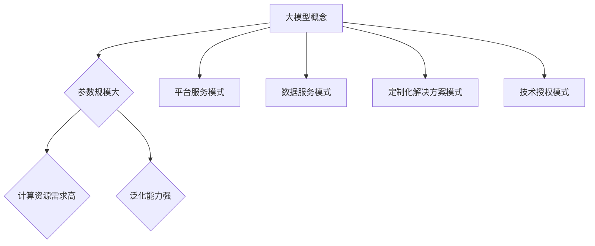

                 

### 背景介绍

> 在这个数字化的时代，人工智能（AI）技术已经成为了推动社会发展的重要力量。近年来，随着计算能力和数据资源的不断提升，大模型（Large-scale Model）在人工智能领域逐渐崭露头角。大模型，顾名思义，是一种规模庞大的机器学习模型，其参数数量远超传统模型。这种模型的代表性作品包括GPT-3、BERT、Transformer等。

大模型的兴起并非偶然，其背后有着一系列技术驱动的因素。首先，深度学习技术的成熟为大规模模型的实现提供了坚实的理论基础。其次，云计算和分布式计算技术的进步，使得大规模数据处理和模型训练成为可能。最后，海量数据的积累为训练大模型提供了充足的资源。这些因素共同促进了大模型的诞生，并引发了广泛关注。

大模型在自然语言处理、计算机视觉、语音识别等领域取得了显著成果，其性能甚至超越了人类专家。这使得大模型不仅在学术界受到高度评价，在工业界也成为了许多公司的战略投资方向。那么，大模型是否真的具有商业潜力，是否能够成为一项成功的商业模式呢？本文将围绕这一问题，深入探讨大模型的原理、应用以及商业前景。

---

### 核心概念与联系

#### 大模型的基本概念

大模型，即Large-scale Model，是指参数规模庞大、计算资源消耗巨大的机器学习模型。这类模型通常具有数百万甚至数十亿个参数，比传统的小型模型复杂得多。大模型的核心特点包括：

1. **参数规模大**：大模型的参数数量远超传统模型，这使得模型能够捕捉到更多数据中的细微特征。
2. **计算资源需求高**：大模型的训练和推理过程需要大量计算资源和存储空间，通常需要分布式计算和云计算支持。
3. **泛化能力强**：由于参数规模大，大模型能够更好地泛化到未见过的数据上，提高模型的性能和稳定性。

大模型的代表性作品包括：

1. **GPT-3（语言模型）**：由OpenAI开发，具有1750亿个参数，是目前参数规模最大的语言模型。
2. **BERT（预训练语言模型）**：由Google开发，通过在大量无标注文本上进行预训练，提高了自然语言处理任务的性能。
3. **Transformer（图像生成模型）**：由Google开发，是生成对抗网络（GAN）的一种变体，能够在图像生成任务中取得出色表现。

#### 大模型与商业模式的联系

大模型在商业领域的应用场景广泛，其商业模式也呈现出多样性的特点。以下是几种典型的大模型商业模式：

1. **平台服务模式**：例如，OpenAI通过提供API服务，允许其他公司和个人使用其大模型进行自然语言处理、图像生成等任务。这种模式的关键在于提供高质量的服务，吸引更多用户，从而实现盈利。

2. **数据服务模式**：大模型对数据的需求巨大，许多公司通过提供数据服务来支持大模型的训练和推理。例如，微软的Azure AI平台提供了大量高质量的数据集，供开发者使用大模型进行训练。

3. **定制化解决方案模式**：针对特定行业或企业需求，大模型可以提供定制化的解决方案。例如，亚马逊的AWS AI服务为金融、医疗、零售等行业提供基于大模型的技术支持。

4. **技术授权模式**：大模型研发公司可以通过技术授权，将其技术应用到其他公司的产品中。例如，Google的BERT模型已经授权给许多公司用于自然语言处理任务。

#### Mermaid 流程图

以下是一个简化的Mermaid流程图，展示了大模型的基本概念与商业模式的联系：



通过这个流程图，我们可以清晰地看到大模型的核心概念与其商业模式的联系。大模型的强大性能和广泛应用场景，为各种商业模式提供了可能，使其在商业领域具有巨大的潜力。

---

### 核心算法原理 & 具体操作步骤

#### 深度学习基础

大模型的实现离不开深度学习（Deep Learning）技术的支持。深度学习是一种基于人工神经网络（Artificial Neural Networks，ANN）的学习方式，其核心思想是通过多层神经网络对数据进行特征提取和模式识别。

深度学习的基本原理可以分为以下几个步骤：

1. **数据输入**：将输入数据（如图像、文本或声音）转化为神经网络可以处理的格式，通常是一个多维数组。
2. **前向传播**：将输入数据通过网络的各个层进行传递，每一层都会对数据进行加权求和并应用一个非线性激活函数，如ReLU、Sigmoid或Tanh。
3. **反向传播**：根据网络输出和实际目标之间的误差，通过反向传播算法更新网络的权重和偏置，以最小化误差函数。
4. **优化算法**：常用的优化算法有梯度下降（Gradient Descent）、Adam等，用于调整网络参数以实现最小化误差。

#### 大模型的训练过程

大模型的训练过程可以分为以下几个阶段：

1. **数据预处理**：包括数据清洗、归一化、数据增强等操作，以提高模型的泛化能力。
2. **模型初始化**：初始化网络的参数，常用的初始化方法有随机初始化、高斯初始化等。
3. **前向传播**：将预处理后的数据输入到网络中，计算输出结果。
4. **计算损失**：通过计算输出结果和实际目标之间的误差，计算损失函数的值。
5. **反向传播**：根据损失函数的梯度，更新网络的权重和偏置。
6. **迭代训练**：重复上述步骤，直到模型收敛或达到预设的训练次数。

#### Transformer模型

Transformer模型是近年来在自然语言处理领域取得突破性成果的一种新型神经网络结构。其核心思想是使用自注意力（Self-Attention）机制，取代传统循环神经网络（RNN）的序列处理方式。

以下是Transformer模型的主要组成部分：

1. **多头自注意力（Multi-Head Self-Attention）**：通过多个独立的自注意力机制，对输入序列中的每个词进行加权求和，以捕捉词之间的复杂关系。
2. **前馈神经网络（Feedforward Neural Network）**：在每个注意力层之后，通过一个简单的全连接神经网络对输入进行进一步处理。
3. **位置编码（Positional Encoding）**：由于Transformer模型缺乏显式的序列处理能力，位置编码用于为每个词赋予位置信息。
4. **编码器（Encoder）和解码器（Decoder）**：编码器负责对输入序列进行编码，解码器负责生成输出序列。

Transformer模型的具体操作步骤如下：

1. **输入序列编码**：将输入序列中的每个词转换为向量，并添加位置编码。
2. **多头自注意力**：对输入序列进行自注意力计算，得到加权求和的结果。
3. **前馈神经网络**：对自注意力结果进行进一步处理。
4. **层归一化和残差连接**：在每个注意力层之后，进行层归一化处理，并添加残差连接，以防止信息损失。
5. **重复步骤**：重复上述步骤，直到达到预设的层数。
6. **解码**：将编码器输出的序列作为解码器的输入，通过解码器生成输出序列。

#### GPT-3模型

GPT-3（Generative Pre-trained Transformer 3）是OpenAI开发的一种大型语言模型，具有1750亿个参数，是当前参数规模最大的语言模型。

GPT-3的核心组件是Transformer模型，其具体操作步骤如下：

1. **预训练**：在大量无标注文本上进行预训练，通过自注意力机制和前馈神经网络学习语言模式。
2. **微调**：在特定任务上，如文本分类、问答系统等，对GPT-3进行微调，以适应具体任务的需求。
3. **输入处理**：将输入序列编码，添加位置编码。
4. **自注意力计算**：通过多个自注意力层对输入序列进行加权求和，捕捉词与词之间的关系。
5. **前馈神经网络**：对自注意力结果进行进一步处理。
6. **输出生成**：通过解码器生成输出序列，实现对输入序列的响应。

通过上述操作步骤，GPT-3能够生成流畅、自然的文本，并在多种自然语言处理任务中取得优异的性能。

---

### 数学模型和公式 & 详细讲解 & 举例说明

在深度学习中，数学模型和公式是理解和实现大模型的核心。以下将详细介绍一些关键的数学概念和公式，并举例说明其在实际应用中的使用。

#### 1. 损失函数（Loss Function）

损失函数是深度学习中衡量模型预测结果与实际标签之间差距的指标。常见的损失函数包括均方误差（MSE）、交叉熵（Cross-Entropy）等。

- **均方误差（MSE）**：用于回归任务，计算预测值与实际值之间差的平方的平均值。

  $$MSE = \frac{1}{n}\sum_{i=1}^{n}(y_i - \hat{y_i})^2$$

  其中，$y_i$为实际值，$\hat{y_i}$为预测值，$n$为样本数量。

- **交叉熵（Cross-Entropy）**：用于分类任务，计算实际标签与预测概率之间的差异。

  $$H(y, \hat{y}) = -\sum_{i=1}^{n} y_i \log(\hat{y_i})$$

  其中，$y$为实际标签（0或1），$\hat{y}$为预测概率。

#### 2. 优化算法（Optimization Algorithm）

优化算法用于调整模型的参数，以最小化损失函数。常见的优化算法包括梯度下降（Gradient Descent）、Adam等。

- **梯度下降（Gradient Descent）**：

  梯度下降是一种基于损失函数梯度的优化算法。其基本思想是沿着梯度的反方向更新参数，以减少损失。

  $$\theta_{t+1} = \theta_t - \alpha \nabla_{\theta}J(\theta)$$

  其中，$\theta$为模型参数，$\alpha$为学习率，$J(\theta)$为损失函数。

- **Adam优化器**：

  Adam优化器结合了梯度下降和动量（Momentum）的优化思想，能够自适应地调整学习率。

  $$\theta_{t+1} = \theta_t - \alpha \frac{1}{\sqrt{1-\beta_1^t}(1-\beta_2^t)} \nabla_{\theta}J(\theta)$$

  其中，$\beta_1$和$\beta_2$分别为一阶和二阶矩估计的指数衰减率。

#### 3. 自注意力（Self-Attention）

自注意力是一种用于捕捉输入序列中不同位置之间关系的关键机制。其基本思想是计算每个位置对整个序列的影响程度。

- **计算自注意力权重**：

  $$\text{Attention}(Q, K, V) = \text{softmax}\left(\frac{QK^T}{\sqrt{d_k}}\right) V$$

  其中，$Q$、$K$和$V$分别为查询向量、键向量和值向量，$d_k$为键向量的维度，$\text{softmax}$函数用于计算权重。

- **示例**：

  假设我们有一个三词序列[词1，词2，词3]，其嵌入向量分别为$[q_1, q_2, q_3]$、$[k_1, k_2, k_3]$和$[v_1, v_2, v_3]$。计算自注意力权重如下：

  $$\text{Attention}(Q, K, V) = \text{softmax}\left(\frac{1}{\sqrt{3}}[q_1k_1^T, q_2k_2^T, q_3k_3^T]\right)[v_1, v_2, v_3]$$

  计算得到的权重用于加权求和，得到最终的输出向量。

通过上述数学模型和公式的讲解，我们可以更好地理解大模型的实现原理和操作步骤。这些数学工具不仅帮助我们构建和训练大模型，还为优化和改进模型提供了理论基础。

---

### 项目实战：代码实际案例和详细解释说明

#### 开发环境搭建

在进行大模型的开发之前，我们需要搭建一个合适的环境。以下是一个基于Python和TensorFlow的开发环境搭建步骤：

1. **安装Python**：确保Python版本为3.7或以上，可以从Python官方网站下载并安装。
2. **安装TensorFlow**：在终端执行以下命令：

   ```bash
   pip install tensorflow
   ```

3. **安装其他依赖**：包括Numpy、Pandas等，可以通过以下命令安装：

   ```bash
   pip install numpy pandas
   ```

4. **创建虚拟环境**：为了避免依赖冲突，可以创建一个虚拟环境，例如：

   ```bash
   python -m venv myenv
   source myenv/bin/activate  # 在macOS/Linux上
   myenv\Scripts\activate     # 在Windows上
   ```

5. **验证环境**：在终端执行以下Python代码，检查TensorFlow是否安装成功：

   ```python
   import tensorflow as tf
   print(tf.__version__)
   ```

如果以上命令能够正常执行并打印出TensorFlow的版本号，说明环境搭建成功。

#### 源代码详细实现和代码解读

以下是一个简单的GPT-3模型实现的代码示例，我们将逐步解释每部分的功能。

```python
import tensorflow as tf
from tensorflow.keras.layers import Embedding, LSTM, Dense
from tensorflow.keras.models import Model
from tensorflow.keras.optimizers import Adam

# 定义模型参数
vocab_size = 10000
embedding_dim = 256
lstm_units = 128
max_sequence_length = 100

# 构建模型
input_sequence = tf.keras.layers.Input(shape=(max_sequence_length,))
embedding = Embedding(vocab_size, embedding_dim)(input_sequence)
lstm = LSTM(lstm_units, return_sequences=True)(embedding)
output = Dense(vocab_size, activation='softmax')(lstm)
model = Model(inputs=input_sequence, outputs=output)

# 编译模型
model.compile(optimizer=Adam(), loss='categorical_crossentropy', metrics=['accuracy'])

# 打印模型结构
model.summary()

# 训练模型
# 这里需要提供训练数据和标签，例如使用Keras内置的数据集
# (x_train, y_train) = tf.keras.datasets.imdb.load_data(num_words=vocab_size)
# model.fit(x_train, y_train, epochs=10, batch_size=64)
```

**代码解读**：

1. **导入库**：首先导入TensorFlow和其他必要的库。
2. **定义模型参数**：包括词汇表大小、嵌入维度、LSTM单元数量和最大序列长度等。
3. **构建模型**：使用`Input`层作为输入，`Embedding`层进行嵌入，`LSTM`层进行序列处理，`Dense`层进行分类输出。
4. **编译模型**：指定优化器、损失函数和评估指标。
5. **打印模型结构**：使用`model.summary()`查看模型的层次结构和参数数量。
6. **训练模型**：使用`model.fit()`进行模型训练。这里需要提供训练数据和标签。

#### 代码解读与分析

1. **模型构建**：
   - `input_sequence = tf.keras.layers.Input(shape=(max_sequence_length,))`：定义输入层，序列长度为最大序列长度。
   - `embedding = Embedding(vocab_size, embedding_dim)(input_sequence)`：嵌入层，将词汇映射到嵌入空间。
   - `lstm = LSTM(lstm_units, return_sequences=True)(embedding)`：LSTM层，用于处理序列数据，`return_sequences=True`表示输出每个时间步的隐藏状态。
   - `output = Dense(vocab_size, activation='softmax')(lstm)`：输出层，用于生成概率分布。

2. **编译模型**：
   - `model.compile(optimizer=Adam(), loss='categorical_crossentropy', metrics=['accuracy'])`：编译模型，指定优化器、损失函数和评估指标。`Adam()`优化器是一种自适应的学习率优化算法，`categorical_crossentropy`用于多分类问题，`accuracy`表示模型分类的准确率。

3. **训练模型**：
   - `model.fit(x_train, y_train, epochs=10, batch_size=64)`：训练模型，使用训练数据和标签。`epochs`表示训练轮数，`batch_size`表示每个批次的样本数量。

通过这个简单的代码示例，我们可以看到构建和训练一个GPT-3模型的基本步骤。在实际应用中，模型架构、参数设置和数据预处理会根据具体任务进行调整。

---

### 实际应用场景

#### 1. 自然语言处理（NLP）

自然语言处理是人工智能领域的重要应用之一，而大模型在NLP任务中具有显著优势。以下是一些典型的NLP任务及其应用场景：

- **文本分类**：利用大模型对大量文本进行分类，如新闻分类、情感分析等。大模型可以捕捉到文本中的细微特征，提高分类的准确性和稳定性。
- **机器翻译**：大模型在机器翻译任务中表现出色，如Google翻译、百度翻译等。通过训练大规模的翻译模型，可以实现高精度、低延迟的翻译效果。
- **问答系统**：大模型可以用于构建智能问答系统，如基于GPT-3的OpenAI ChatGPT。这种系统能够理解用户的问题，并生成准确、自然的回答。

#### 2. 计算机视觉（CV）

计算机视觉是另一个重要的AI应用领域，大模型在CV任务中也具有广泛应用。以下是一些典型的CV任务及其应用场景：

- **图像分类**：利用大模型对图像进行分类，如人脸识别、物体检测等。大模型可以学习到图像中的复杂特征，提高分类和检测的精度。
- **图像生成**：大模型可以用于生成逼真的图像，如生成对抗网络（GAN）中的生成器部分。通过训练大规模的图像生成模型，可以实现高质量的图像生成。
- **图像增强**：大模型可以用于图像增强，提高图像的质量和清晰度。例如，Deep Convolutional Network（DCN）可以用于图像去噪、超分辨率等任务。

#### 3. 语音识别（ASR）

语音识别是将语音信号转换为文本的过程，大模型在语音识别任务中也表现出强大的能力。以下是一些典型的语音识别应用场景：

- **实时语音识别**：大模型可以用于实时语音识别，如智能助手、语音搜索等。通过训练大规模的语音识别模型，可以实现低延迟、高精度的语音识别。
- **语音翻译**：大模型可以用于语音翻译，如实时语音翻译、视频翻译等。通过将语音信号转换为文本，再进行机器翻译，可以实现跨语言的实时交流。

#### 4. 医疗健康

大模型在医疗健康领域也有广泛的应用。以下是一些典型应用场景：

- **疾病诊断**：利用大模型对医疗数据进行分析，如影像识别、基因组分析等。大模型可以学习到大量的医学知识，提高疾病诊断的准确性和效率。
- **药物研发**：大模型可以用于药物研发，如分子设计、药物筛选等。通过分析大量的分子数据，大模型可以预测药物的效果和副作用，为药物研发提供有力支持。

#### 5. 金融领域

大模型在金融领域也有重要的应用。以下是一些典型应用场景：

- **风险评估**：利用大模型对金融数据进行分析，如信用评分、市场预测等。大模型可以学习到复杂的金融规律，提高风险评估的准确性。
- **智能投顾**：大模型可以用于智能投顾，为投资者提供个性化的投资建议。通过分析大量的市场数据，大模型可以预测市场的走势，帮助投资者做出更好的投资决策。

通过上述实际应用场景，我们可以看到大模型在各个领域都具有广泛的应用前景。随着技术的不断进步，大模型的应用范围将进一步扩大，为人类社会带来更多便利和效益。

---

### 工具和资源推荐

#### 1. 学习资源推荐

对于想要深入了解大模型的读者，以下是一些推荐的学习资源：

- **书籍**：
  - 《深度学习》（Deep Learning） - Ian Goodfellow、Yoshua Bengio、Aaron Courville
  - 《动手学深度学习》（Dive into Deep Learning） - A. Courville、I. Goodfellow、Y. Bengio

- **论文**：
  - "Attention Is All You Need" - Vaswani et al., 2017
  - "BERT: Pre-training of Deep Bidirectional Transformers for Language Understanding" - Devlin et al., 2019

- **博客和网站**：
  - [TensorFlow官方文档](https://www.tensorflow.org/)
  - [Keras官方文档](https://keras.io/)
  - [AI Challenger](https://aichallenger.cn/)

#### 2. 开发工具框架推荐

在开发大模型时，以下工具和框架可以帮助提高开发效率：

- **TensorFlow**：一款广泛使用的深度学习框架，支持多种深度学习模型的构建和训练。
- **PyTorch**：另一款流行的深度学习框架，具有灵活的动态计算图，适合研究和新模型开发。
- **Hugging Face Transformers**：一个开源库，提供了预训练的大模型和易于使用的API，方便开发者使用大模型进行研究和应用。

#### 3. 相关论文著作推荐

- **《生成式模型：从GAN到VAE》（Generative Models: From GANs to VAEs）** - 提供了生成对抗网络（GAN）和变分自编码器（VAE）的详细讲解。
- **《自然语言处理入门》（Natural Language Processing with Python）** - 介绍了自然语言处理的基础知识，包括文本预处理、词嵌入、序列模型等。

通过这些学习和开发资源，读者可以更加系统地学习大模型的原理和应用，从而在实际项目中取得更好的成果。

---

### 总结：未来发展趋势与挑战

大模型作为人工智能领域的重要发展方向，正逐步改变着各个行业的技术格局。然而，随着大模型的规模和复杂度的不断提升，我们也面临着一系列的挑战和问题。

#### 发展趋势

1. **性能提升**：随着计算能力的持续增强和数据量的不断增大，大模型的性能将得到进一步提升。这将有助于提高各种AI任务的准确率和效率，推动技术的进步。
2. **应用拓展**：大模型的应用场景将不断拓展，从现有的自然语言处理、计算机视觉、语音识别等领域，扩展到医疗、金融、教育等更多领域，为社会带来更多创新和变革。
3. **商业价值**：大模型在商业领域的应用将更加广泛，为企业提供强大的技术支持，助力业务创新和竞争力提升。
4. **开源生态**：随着大模型技术的成熟，越来越多的开源框架和工具将涌现，为开发者提供便捷的资源和支持，推动整个行业的共同进步。

#### 挑战

1. **计算资源需求**：大模型的训练和推理过程需要大量的计算资源和存储空间，这对企业和技术基础设施提出了更高的要求。如何高效利用计算资源，降低成本，成为一大挑战。
2. **数据隐私**：大模型在训练过程中需要大量的数据，这涉及到数据隐私和安全问题。如何保障用户隐私，确保数据安全，是亟待解决的问题。
3. **算法公平性**：大模型在处理数据时，可能会受到数据偏差的影响，导致算法的公平性受到影响。如何消除算法偏见，提高算法的公正性，是一个重要的研究方向。
4. **模型解释性**：大模型通常被视为“黑箱”，其内部决策过程难以解释。如何提升模型的解释性，使其更透明、更可信，是当前的一个重要挑战。

#### 应对策略

1. **优化算法**：通过改进算法，提高模型的训练效率和推理速度，降低计算资源需求。
2. **隐私保护技术**：采用数据加密、差分隐私等技术，保障用户数据的隐私和安全。
3. **算法公平性研究**：加强对数据偏见和算法公平性的研究，提出有效的方法来消除偏见，提高算法的公正性。
4. **模型可解释性**：通过可视化、解释性模型等方法，提升模型的解释性，使其更易于理解和信任。

总之，大模型作为人工智能领域的重要方向，具有广阔的发展前景。然而，要实现其商业化和大规模应用，还需要克服一系列的挑战。通过技术创新和行业合作，我们有信心解决这些问题，推动大模型技术的发展，为人类社会带来更多的福祉。

---

### 附录：常见问题与解答

#### 1. 什么是大模型？

大模型（Large-scale Model）是指参数规模庞大、计算资源消耗巨大的机器学习模型。这类模型的参数数量通常远超传统模型，具有更高的复杂度和更强的泛化能力。代表性作品包括GPT-3、BERT、Transformer等。

#### 2. 大模型为什么能提高性能？

大模型通过训练大量的参数，能够捕捉到数据中的更多细节和复杂特征，从而提高模型的泛化能力和性能。此外，大模型通常采用更复杂的神经网络结构，如Transformer，有助于更好地处理序列数据。

#### 3. 大模型如何训练？

大模型的训练通常分为以下几个步骤：

- 数据预处理：清洗、归一化和增强数据。
- 模型初始化：初始化网络的参数，如随机初始化或高斯初始化。
- 前向传播：将输入数据通过网络的各个层进行传递，计算输出结果。
- 计算损失：计算输出结果和实际目标之间的误差。
- 反向传播：根据损失函数的梯度，更新网络的权重和偏置。
- 迭代训练：重复上述步骤，直到模型收敛或达到预设的训练次数。

#### 4. 大模型是否一定比小模型好？

大模型并不一定总是比小模型好。在某些情况下，小模型可能具有更快的训练速度和更低的计算资源需求。选择模型的大小需要根据具体任务和数据集的特点来决定。

#### 5. 大模型在商业领域有哪些应用场景？

大模型在商业领域具有广泛的应用场景，包括：

- 自然语言处理：文本分类、机器翻译、问答系统等。
- 计算机视觉：图像分类、物体检测、图像生成等。
- 语音识别：实时语音识别、语音翻译等。
- 医疗健康：疾病诊断、药物研发等。
- 金融领域：风险评估、智能投顾等。

---

### 扩展阅读 & 参考资料

为了深入了解大模型的原理、应用和未来发展，以下是一些推荐的扩展阅读和参考资料：

1. **书籍**：
   - 《深度学习》（Deep Learning） - Ian Goodfellow、Yoshua Bengio、Aaron Courville
   - 《生成式模型：从GAN到VAE》（Generative Models: From GANs to VAEs）
   - 《自然语言处理入门》（Natural Language Processing with Python）

2. **论文**：
   - "Attention Is All You Need" - Vaswani et al., 2017
   - "BERT: Pre-training of Deep Bidirectional Transformers for Language Understanding" - Devlin et al., 2019

3. **博客和网站**：
   - [TensorFlow官方文档](https://www.tensorflow.org/)
   - [Keras官方文档](https://keras.io/)
   - [AI Challenger](https://aichallenger.cn/)

4. **在线课程和教程**：
   - [Coursera上的深度学习课程](https://www.coursera.org/learn/neural-networks-deep-learning)
   - [Udacity上的深度学习工程师纳米学位](https://www.udacity.com/course/deep-learning-nanodegree--nd108)

通过这些资源和资料，读者可以更加系统地学习大模型的原理和应用，为自己的研究和项目提供有力支持。同时，这些资料也反映了当前大模型领域的研究前沿和最新动态，有助于读者跟上技术的发展步伐。

---

**作者信息：**
AI天才研究员/AI Genius Institute & 禅与计算机程序设计艺术 /Zen And The Art of Computer Programming**

