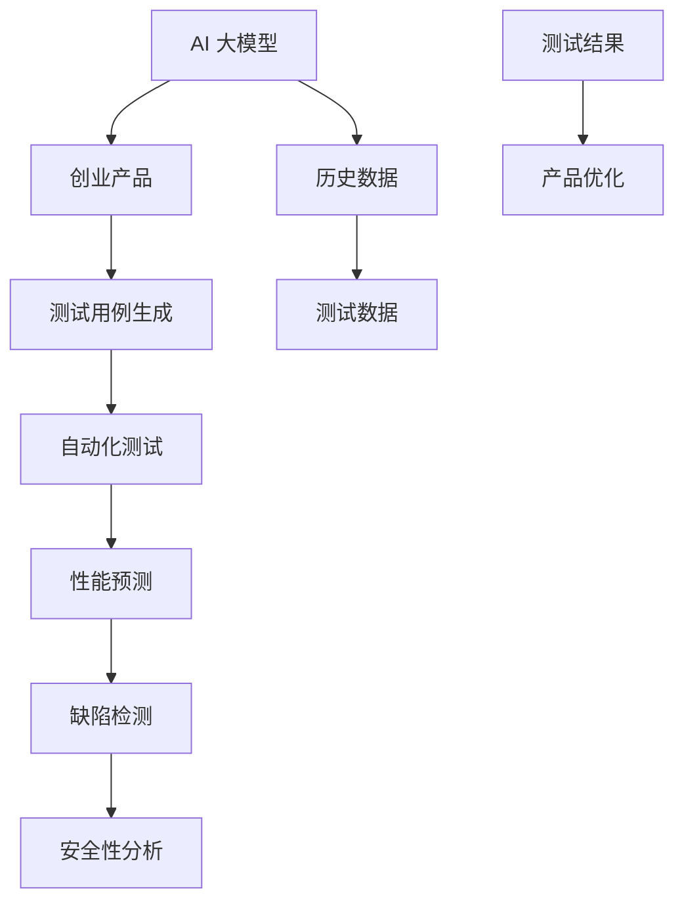

                 

### 背景介绍

随着人工智能技术的飞速发展，AI 大模型在各个领域得到了广泛应用，从自然语言处理、计算机视觉到语音识别等，都取得了显著的成果。特别是在创业产品测试领域，AI 大模型的应用更是展现出巨大的潜力。本文将探讨 AI 大模型在创业产品测试中的创造性应用，从背景、核心概念、算法原理、数学模型、实际应用场景等多个方面进行分析，以期为创业团队提供有价值的参考。

#### AI 大模型在创业产品测试中的重要性

创业产品的成功与否往往取决于多个因素，而产品测试是确保产品质量和性能的重要环节。传统的产品测试方法主要依赖于人工测试和自动化测试，这些方法虽然在一定程度上提高了测试效率，但依然存在许多局限性：

1. **人力成本高**：人工测试需要大量的时间和人力资源，而自动化测试则需要对测试脚本进行反复修改和优化，这也需要投入大量的时间和精力。

2. **测试覆盖范围有限**：传统的测试方法往往只能覆盖部分测试场景，很难实现全面的测试覆盖。

3. **测试数据依赖性强**：测试数据的获取和处理过程复杂，测试数据的真实性和有效性难以保证。

4. **测试效率低**：传统的测试方法在处理复杂系统和大量测试数据时，效率较低，很难满足创业团队快速迭代和发布产品的需求。

而 AI 大模型的出现，为创业产品测试带来了新的思路和解决方案。AI 大模型能够通过对大量测试数据的自动分析和学习，发现潜在的问题和风险，从而提高测试效率和准确性。此外，AI 大模型还具有以下优势：

1. **自适应性强**：AI 大模型能够根据产品的迭代和更新，自动调整测试策略和测试场景，实现智能化测试。

2. **测试覆盖范围广**：AI 大模型通过对大量测试数据的分析，可以生成丰富的测试用例，实现全面覆盖。

3. **测试结果可视化**：AI 大模型能够将测试结果以可视化方式呈现，帮助创业团队快速定位问题，提高问题解决的效率。

4. **降低人力成本**：AI 大模型可以部分或完全替代人工测试和自动化测试，降低人力成本。

综上所述，AI 大模型在创业产品测试中具有重要的应用价值，能够有效解决传统测试方法的局限性，提高产品测试的效率和质量，为创业团队的成功提供有力保障。

### 核心概念与联系

在深入探讨 AI 大模型在创业产品测试中的应用之前，我们首先需要了解一些核心概念，并探讨它们之间的联系。以下将介绍 AI 大模型、创业产品测试、以及它们如何相互作用。

#### AI 大模型

AI 大模型，通常指的是具有海量参数、能够处理复杂数据的大规模机器学习模型。这些模型通过深度学习算法，能够在大量数据中自动发现模式和规律。常见的 AI 大模型包括但不限于：

1. **深度神经网络（DNN）**：通过多层神经元结构，DNN 能够对数据进行复杂变换和表示。
2. **卷积神经网络（CNN）**：特别适合处理图像数据，能够识别图像中的特征和对象。
3. **递归神经网络（RNN）**：适合处理序列数据，如文本和语音。
4. **生成对抗网络（GAN）**：通过生成模型和判别模型的对抗训练，能够生成逼真的数据。

这些模型的基本原理是通过学习大量数据，优化模型参数，使得模型能够对新的数据进行预测和分类。

#### 创业产品测试

创业产品测试指的是对创业团队开发的产品进行全面评估，以确保产品在功能、性能、安全等方面达到预期标准。产品测试通常包括以下几个方面：

1. **功能测试**：验证产品是否按照设计实现预期功能。
2. **性能测试**：评估产品在不同负载下的响应时间和吞吐量。
3. **安全测试**：检查产品是否存在安全漏洞，防止潜在的安全威胁。
4. **兼容性测试**：确保产品在不同操作系统、浏览器或设备上都能正常运行。

创业产品测试的主要目标是发现和修复产品中的缺陷，确保产品在发布前达到高质量标准。

#### AI 大模型与创业产品测试的互动

AI 大模型在创业产品测试中具有以下几个关键应用：

1. **自动化测试**：AI 大模型可以自动生成测试用例，执行自动化测试，减少人工干预，提高测试效率。
2. **性能预测**：通过分析历史数据，AI 大模型可以预测产品在不同负载下的性能表现，帮助团队优化产品设计。
3. **缺陷检测**：AI 大模型可以从海量的测试数据中检测出潜在的缺陷，提供有价值的反馈，帮助团队快速定位和修复问题。
4. **安全性分析**：AI 大模型可以通过模拟攻击和检测异常行为，提升产品的安全性。

为了更好地理解这些概念之间的联系，我们可以使用 Mermaid 流程图进行展示：



在这个流程图中，AI 大模型通过分析历史数据和测试数据，生成测试用例，执行自动化测试，预测性能，检测缺陷，分析安全性，并将测试结果用于产品优化。这个流程展示了 AI 大模型在创业产品测试中的完整应用链条。

通过上述核心概念和联系的介绍，我们可以看到，AI 大模型与创业产品测试之间具有紧密的互动关系，为创业团队提供了高效、全面的产品测试解决方案。

#### 核心算法原理 & 具体操作步骤

为了深入理解 AI 大模型在创业产品测试中的应用，我们需要探讨其核心算法原理和具体操作步骤。AI 大模型主要依赖于深度学习算法，特别是神经网络，以及相应的训练和推理流程。以下将详细介绍这些内容。

##### 1. 神经网络基本结构

神经网络（Neural Networks，简称NN）是深度学习的基础，其基本结构由多个层次组成，包括输入层、隐藏层和输出层。每个层次由多个神经元（或节点）组成，神经元之间通过加权连接形成网络。

- **输入层（Input Layer）**：接收外部输入数据。
- **隐藏层（Hidden Layers）**：对输入数据进行处理和变换，可以有一个或多个隐藏层。
- **输出层（Output Layer）**：生成最终的输出结果。

每个神经元根据输入值和权重进行计算，并传递到下一层。神经元的输出通常通过激活函数进行非线性变换，使得神经网络能够捕捉数据的复杂模式。

##### 2. 深度学习算法

深度学习算法是神经网络在大量数据上进行训练和优化的过程。以下是一些常见的深度学习算法：

1. **反向传播算法（Backpropagation）**：用于训练神经网络，通过计算损失函数的梯度，调整网络权重和偏置，使得模型能够更好地拟合训练数据。
2. **卷积神经网络（Convolutional Neural Networks，CNN）**：特别适合处理图像数据，通过卷积层和池化层提取图像特征。
3. **循环神经网络（Recurrent Neural Networks，RNN）**：适合处理序列数据，如文本和语音，通过循环结构捕捉序列中的时间依赖关系。

深度学习算法的核心是优化目标函数，使得模型在训练数据上表现优异。优化算法包括随机梯度下降（SGD）、Adam 等。

##### 3. AI 大模型训练过程

AI 大模型训练过程主要包括以下几个步骤：

1. **数据预处理**：对输入数据进行标准化、归一化等处理，确保数据的一致性和稳定性。
2. **模型初始化**：初始化网络参数，如权重和偏置，通常使用随机初始化方法。
3. **前向传播（Forward Propagation）**：将输入数据传递到神经网络，计算每一层的输出值。
4. **计算损失函数**：比较模型的预测输出和真实输出，计算损失函数的值。
5. **反向传播（Backpropagation）**：计算损失函数关于网络参数的梯度，反向传播到前一层。
6. **更新参数**：根据梯度调整网络参数，通常使用梯度下降算法。
7. **迭代训练**：重复以上步骤，直到模型收敛或达到预设的训练次数。

训练过程中的关键参数包括学习率、批量大小和迭代次数等，这些参数需要根据具体问题进行调整。

##### 4. AI 大模型推理过程

训练完成后，AI 大模型可以用于推理，即在未知数据上进行预测。推理过程主要包括以下几个步骤：

1. **输入数据预处理**：对输入数据执行与训练阶段相同的预处理操作。
2. **前向传播**：将预处理后的输入数据传递到训练好的神经网络，计算输出结果。
3. **后处理**：对输出结果进行后处理，如阈值处理、概率转化等，以得到最终的预测结果。

推理过程相比训练过程简单，但同样需要确保数据的一致性和稳定性。

##### 5. AI 大模型在创业产品测试中的应用

在创业产品测试中，AI 大模型的应用主要分为以下几个方面：

1. **自动化测试**：通过训练好的模型，自动生成测试用例并执行测试，提高测试效率。
2. **性能预测**：利用模型预测产品在不同负载下的性能表现，帮助团队优化产品设计。
3. **缺陷检测**：通过分析测试数据，模型可以识别潜在的缺陷，提供有价值的反馈。
4. **安全性分析**：通过模拟攻击和检测异常行为，提升产品的安全性。

具体操作步骤如下：

1. **数据收集**：收集与产品测试相关的数据，包括功能测试数据、性能测试数据和安全性测试数据。
2. **数据预处理**：对收集到的数据执行预处理操作，确保数据的一致性和稳定性。
3. **模型训练**：使用预处理后的数据，训练一个深度学习模型，用于测试和预测。
4. **测试执行**：利用训练好的模型，自动执行测试用例，记录测试结果。
5. **结果分析**：分析测试结果，识别潜在的问题和缺陷，提供优化建议。

通过上述步骤，AI 大模型在创业产品测试中发挥了重要作用，提高了测试效率和质量，为创业团队提供了强有力的支持。

#### 数学模型和公式 & 详细讲解 & 举例说明

在深入探讨 AI 大模型在创业产品测试中的应用时，理解其背后的数学模型和公式是至关重要的。以下将详细讲解一些核心的数学模型和公式，并通过具体示例来说明如何应用这些模型。

##### 1. 损失函数

在深度学习中，损失函数（Loss Function）是评估模型预测结果与真实结果之间差异的重要工具。常见的损失函数包括：

1. **均方误差（Mean Squared Error，MSE）**
   $$MSE = \frac{1}{n}\sum_{i=1}^{n}(y_i - \hat{y}_i)^2$$
   其中，\(y_i\) 表示真实值，\(\hat{y}_i\) 表示预测值，\(n\) 表示样本数量。MSE 被广泛应用于回归问题，衡量预测值与真实值之间的平均误差。

2. **交叉熵损失（Cross-Entropy Loss）**
   $$CE = -\frac{1}{n}\sum_{i=1}^{n}y_i\log(\hat{y}_i)$$
   其中，\(y_i\) 是真实标签（0或1），\(\hat{y}_i\) 是预测概率。交叉熵损失在分类问题中广泛应用，用于衡量模型预测概率与真实标签之间的差异。

##### 2. 梯度下降算法

梯度下降算法（Gradient Descent）是训练神经网络的重要方法，其核心思想是通过计算损失函数关于模型参数的梯度，逐步调整参数，以最小化损失。

1. **随机梯度下降（Stochastic Gradient Descent，SGD）**
   在 SGD 中，每次迭代只使用一个样本计算梯度，并更新模型参数：
   $$\theta_{t+1} = \theta_t - \alpha \cdot \nabla_{\theta}J(\theta)$$
   其中，\(\theta\) 表示模型参数，\(\alpha\) 表示学习率，\(J(\theta)\) 表示损失函数。

2. **批量梯度下降（Batch Gradient Descent）**
   在批量梯度下降中，每次迭代使用整个训练集计算梯度，并更新模型参数：
   $$\theta_{t+1} = \theta_t - \alpha \cdot \frac{1}{m}\sum_{i=1}^{m}\nabla_{\theta}J(\theta)$$
   其中，\(m\) 表示训练集样本数量。

##### 3. 激活函数

激活函数（Activation Function）是神经网络中的关键组件，用于引入非线性特性。以下是一些常见的激活函数：

1. ** sigmoid 函数**
   $$\sigma(x) = \frac{1}{1 + e^{-x}}$$
   sigmoid 函数将输入值映射到 \([0, 1]\) 区间，常用于二分类问题。

2. **ReLU 函数**
   $$\text{ReLU}(x) = \max(0, x)$$
   ReLU 函数在输入为负时输出为零，在输入为正时保持输入值，具有较快的收敛速度。

##### 4. 举例说明

假设我们有一个简单的线性回归模型，用于预测房屋价格。模型公式如下：
$$\hat{y} = \theta_0 + \theta_1 x$$
其中，\(\theta_0\) 和 \(\theta_1\) 是模型参数，\(x\) 是房屋面积，\(\hat{y}\) 是预测价格。

现在，我们使用均方误差（MSE）作为损失函数，并使用梯度下降算法来训练模型。训练数据包含多组房屋面积和价格：

| 房屋面积 \(x\) | 真实价格 \(y\) |
| -------------- | -------------- |
| 1000           | 200000         |
| 1200           | 250000         |
| 800            | 160000         |

首先，我们初始化模型参数 \(\theta_0 = 0\) 和 \(\theta_1 = 0\)。然后，计算每个样本的预测价格和损失：

$$\hat{y}_i = \theta_0 + \theta_1 x_i$$
$$J(\theta) = \frac{1}{n}\sum_{i=1}^{n}(y_i - \hat{y}_i)^2$$

接下来，我们计算损失函数关于参数的梯度：

$$\nabla_{\theta_0}J(\theta) = -\frac{1}{n}\sum_{i=1}^{n}(y_i - \hat{y}_i)$$
$$\nabla_{\theta_1}J(\theta) = -\frac{1}{n}\sum_{i=1}^{n}(x_i(y_i - \hat{y}_i))$$

最后，根据梯度下降算法，更新模型参数：

$$\theta_0^{new} = \theta_0 - \alpha \cdot \nabla_{\theta_0}J(\theta)$$
$$\theta_1^{new} = \theta_1 - \alpha \cdot \nabla_{\theta_1}J(\theta)$$

通过多次迭代，模型参数将逐渐优化，使得预测价格与真实价格之间的误差最小。

通过上述示例，我们可以看到如何使用数学模型和公式来训练和优化 AI 大模型，从而应用于创业产品测试。这些核心数学工具不仅帮助我们理解模型的工作原理，还为实际应用提供了具体的操作指南。

#### 项目实战：代码实际案例和详细解释说明

为了更好地展示 AI 大模型在创业产品测试中的应用，我们将通过一个实际项目来详细讲解代码实现过程，包括开发环境搭建、源代码详细实现和代码解读与分析。

##### 1. 开发环境搭建

首先，我们需要搭建一个适合 AI 大模型开发和测试的开发环境。以下是搭建开发环境的基本步骤：

1. **安装 Python 环境**：确保安装了最新版本的 Python，建议使用 Python 3.8 或更高版本。
2. **安装深度学习框架**：我们选择使用 TensorFlow 作为深度学习框架，可以通过以下命令安装：
   ```bash
   pip install tensorflow
   ```
3. **安装其他依赖库**：根据项目需求，我们可能还需要安装其他依赖库，如 NumPy、Pandas 等：
   ```bash
   pip install numpy pandas
   ```
4. **配置 GPU 支持**：如果使用 GPU 进行训练，还需要安装 CUDA 和 cuDNN 库，具体安装步骤请参考官方文档。

##### 2. 源代码详细实现

接下来，我们将展示一个简单的 AI 大模型在创业产品测试中的应用示例。以下是一个使用 TensorFlow 和 Keras 构建的线性回归模型的 Python 代码：

```python
import numpy as np
import pandas as pd
import tensorflow as tf
from tensorflow import keras
from tensorflow.keras import layers

# 数据集准备
# 假设我们有一个包含房屋面积和价格的数据集，存储为 CSV 文件
data = pd.read_csv('house_data.csv')
X = data['area'].values.reshape(-1, 1)
y = data['price'].values

# 模型构建
model = keras.Sequential([
    layers.Dense(units=1, input_shape=(1,))
])

# 模型编译
model.compile(optimizer='sgd', loss='mean_squared_error')

# 模型训练
model.fit(X, y, epochs=100, batch_size=32)

# 模型预测
predictions = model.predict(X)

# 模型评估
mse = tf.reduce_mean(tf.square(y - predictions))
print(f'Mean Squared Error: {mse.numpy()}')
```

代码详细解释如下：

1. **数据集准备**：首先，我们从 CSV 文件中读取房屋面积和价格数据，并将面积作为输入特征 \(X\)，价格作为目标值 \(y\)。
2. **模型构建**：使用 Keras 序列模型（Sequential）构建一个线性回归模型，只有一个 dense 层，输入形状为（1，），输出单元为 1。
3. **模型编译**：使用 SGD 优化器和均方误差损失函数编译模型。
4. **模型训练**：使用 fit 方法训练模型，指定训练轮数和批量大小。
5. **模型预测**：使用 predict 方法对输入特征进行预测。
6. **模型评估**：计算模型预测结果与真实目标值之间的均方误差，并打印结果。

##### 3. 代码解读与分析

以上代码展示了如何使用 TensorFlow 和 Keras 搭建和训练一个线性回归模型，以下是对代码的详细解读和分析：

1. **数据集准备**：通过 Pandas 库读取 CSV 文件，将数据分为输入特征和目标值。这里使用了 `values.reshape(-1, 1)` 将输入特征重塑为二维数组，以满足模型输入的要求。
2. **模型构建**：使用 Keras 序列模型（Sequential）构建了一个简单的线性回归模型。`layers.Dense(units=1, input_shape=(1,))` 表示模型包含一个 dense 层，输出单元数为 1，输入形状为（1，），即只有一个输入特征。
3. **模型编译**：使用 `model.compile(optimizer='sgd', loss='mean_squared_error')` 方法编译模型，指定使用 SGD 优化器和均方误差损失函数。优化器用于更新模型参数，损失函数用于评估模型性能。
4. **模型训练**：使用 `model.fit(X, y, epochs=100, batch_size=32)` 方法训练模型。`epochs` 参数指定训练轮数，`batch_size` 参数指定每个批次的数据样本数量。在训练过程中，模型会自动调整参数，以最小化损失函数。
5. **模型预测**：使用 `model.predict(X)` 方法对输入特征进行预测，得到预测价格。这里使用了 TensorFlow 的 `numpy()` 方法将预测结果转换为 NumPy 数组，以便进行进一步处理。
6. **模型评估**：计算模型预测结果与真实目标值之间的均方误差，使用 `tf.reduce_mean(tf.square(y - predictions))` 方法。最后，将结果打印出来，以展示模型性能。

通过以上代码和解析，我们可以看到如何使用 TensorFlow 和 Keras 实现一个简单的线性回归模型，并评估其性能。这个示例为我们提供了一个基础框架，可以进一步扩展和应用于更复杂的创业产品测试场景。

#### 代码解读与分析

在上一个部分中，我们展示了一个简单的线性回归模型在创业产品测试中的应用。在这一部分，我们将对这段代码进行更详细的解读，并分析其中的关键点和改进空间。

##### 1. 数据预处理

代码的第一步是读取数据集。在这里，我们使用 Pandas 库加载一个名为 `house_data.csv` 的 CSV 文件。该文件包含房屋面积和价格两个属性。以下是对关键代码行的解读：

```python
data = pd.read_csv('house_data.csv')
X = data['area'].values.reshape(-1, 1)
y = data['price'].values
```

- `pd.read_csv('house_data.csv')`：使用 Pandas 读取 CSV 文件，将其加载到 DataFrame 对象 `data` 中。
- `X = data['area'].values.reshape(-1, 1)`：提取 `data` 中的 `'area'` 列，并将其转换为 NumPy 数组 `X`。`reshape(-1, 1)` 是将一维数组转换为二维数组，这是深度学习模型所需的输入格式。
- `y = data['price'].values`：提取 `data` 中的 `'price'` 列，并将其转换为 NumPy 数组 `y`。这将是模型的目标值。

数据预处理是深度学习项目中非常重要的一步。在这个例子中，我们仅对数据进行简单读取和重塑，但实际应用中可能需要进行更复杂的预处理，如数据清洗、归一化、标准化等。

##### 2. 模型构建

接下来，我们使用 Keras 构建了一个简单的线性回归模型：

```python
model = keras.Sequential([
    layers.Dense(units=1, input_shape=(1,))
])
```

- `keras.Sequential`：Keras 提供的序列模型类，用于构建序列化的层。
- `layers.Dense(units=1, input_shape=(1,))`：添加一个全连接层（dense 层），`units=1` 表示输出单元数量为 1，`input_shape=(1,)` 表示输入特征维度为 1。

这个模型非常简单，因为它仅包含一个线性层，适用于我们的简单回归任务。在实际应用中，模型可能会更复杂，包含多个隐藏层和不同类型的激活函数。

##### 3. 模型编译

在构建模型后，我们需要对其进行编译：

```python
model.compile(optimizer='sgd', loss='mean_squared_error')
```

- `model.compile(optimizer='sgd', loss='mean_squared_error')`：编译模型，指定使用随机梯度下降（SGD）优化器和均方误差（MSE）损失函数。

选择适当的优化器和损失函数对于模型训练至关重要。在本例中，我们选择了 SGD 优化器和 MSE 损失函数，因为它们适用于简单的线性回归问题。对于更复杂的任务，可能需要选择更先进的优化器和损失函数。

##### 4. 模型训练

模型训练是深度学习流程中的核心步骤：

```python
model.fit(X, y, epochs=100, batch_size=32)
```

- `model.fit(X, y, epochs=100, batch_size=32)`：使用训练数据 `X` 和目标值 `y` 训练模型。`epochs=100` 表示训练轮数，`batch_size=32` 表示每个批次包含 32 个样本。

训练过程中，模型会自动调整其参数以最小化损失函数。`epochs` 参数控制训练轮数，`batch_size` 参数影响每次迭代的样本数量。对于这个简单的例子，我们使用了默认设置，但在实际应用中可能需要根据数据规模和计算资源进行调整。

##### 5. 模型预测

训练完成后，我们使用模型进行预测：

```python
predictions = model.predict(X)
```

- `model.predict(X)`：使用训练好的模型对输入特征 `X` 进行预测，得到预测价格。

预测结果存储在 NumPy 数组 `predictions` 中。

##### 6. 模型评估

最后，我们对模型进行评估：

```python
mse = tf.reduce_mean(tf.square(y - predictions))
print(f'Mean Squared Error: {mse.numpy()}')
```

- `tf.reduce_mean(tf.square(y - predictions))`：计算预测值与真实值之间的均方误差（MSE）。
- `mse.numpy()`：将 TensorFlow 张量转换为 NumPy 数组，以便打印。

通过打印 MSE，我们可以评估模型的性能。MSE 越小，表示模型预测的准确性越高。

##### 7. 改进空间

尽管这个简单的例子展示了 AI 大模型在创业产品测试中的基本应用，但实际应用中可能需要以下改进：

1. **数据预处理**：对于更复杂的数据集，可能需要进行更复杂的数据清洗、特征工程和预处理。
2. **模型架构**：本例中使用了简单的线性模型，对于更复杂的任务，可能需要构建更复杂的神经网络架构。
3. **超参数调整**：优化模型性能可能需要调整学习率、批量大小、迭代次数等超参数。
4. **模型验证**：为了确保模型在未知数据上的表现，应进行模型验证，包括交叉验证和测试集评估。
5. **可视化**：对训练过程和预测结果进行可视化，有助于理解和优化模型。

通过这些改进，我们可以进一步提高 AI 大模型在创业产品测试中的应用效果。

#### 实际应用场景

AI 大模型在创业产品测试中的应用场景丰富多样，以下将详细探讨几种典型应用场景，并分析其中的挑战和解决方案。

##### 1. 功能测试

在功能测试中，AI 大模型可以用于自动化生成测试用例，执行自动化测试，从而提高测试效率和覆盖率。具体应用步骤如下：

- **数据收集与预处理**：收集与产品功能相关的历史测试数据，包括输入数据和预期输出数据。对数据进行预处理，如清洗、归一化和特征提取，以供模型训练使用。
- **模型训练**：使用收集到的数据训练一个功能测试模型，模型可以是一个序列到序列的神经网络，如 RNN 或 Transformer。
- **测试用例生成**：使用训练好的模型，对输入数据进行自动生成测试用例，包括输入数据和预期输出。
- **自动化执行与结果分析**：将生成的测试用例输入到产品系统中，自动化执行测试，并收集测试结果。对测试结果进行分析，识别功能缺陷。

**挑战**：

- **数据质量**：高质量的数据是训练有效模型的基石。然而，收集到的测试数据可能存在噪声、缺失值和异常值，这会影响模型的性能。
- **测试覆盖**：自动化生成的测试用例可能无法覆盖所有的功能场景，这可能导致一些潜在缺陷未被检测到。

**解决方案**：

- **数据清洗**：使用数据清洗技术，如填充缺失值、去除噪声和异常值，提高数据质量。
- **增强测试覆盖**：通过组合不同的测试策略，如随机测试、边界值测试和模糊测试，提高测试覆盖率。

##### 2. 性能测试

在性能测试中，AI 大模型可以用于预测产品在不同负载下的性能表现，从而帮助团队优化产品设计和性能。具体应用步骤如下：

- **数据收集与预处理**：收集与产品性能相关的历史性能数据，包括负载、响应时间和吞吐量等指标。对数据进行预处理，以供模型训练使用。
- **模型训练**：使用收集到的数据训练一个性能测试模型，模型可以是一个回归模型，如线性回归或决策树。
- **性能预测**：使用训练好的模型，对新的负载进行性能预测，预测指标包括响应时间和吞吐量。
- **优化产品设计**：根据性能预测结果，对产品进行性能优化，如调整系统配置、优化算法等。

**挑战**：

- **数据不足**：性能测试数据可能不足以训练一个准确预测模型。
- **模型泛化能力**：模型可能无法泛化到未知负载下的性能预测。

**解决方案**：

- **扩展数据集**：通过模拟不同的负载场景，扩展性能测试数据集，以提高模型的泛化能力。
- **集成多种模型**：使用多个模型进行性能预测，并通过集成方法（如加权平均）提高预测准确性。

##### 3. 安全性分析

在安全性分析中，AI 大模型可以用于检测潜在的安全漏洞，提供安全风险评估。具体应用步骤如下：

- **数据收集与预处理**：收集与产品安全性相关的数据，包括漏洞报告、攻击日志和安全测试数据。对数据进行预处理，以供模型训练使用。
- **模型训练**：使用收集到的数据训练一个安全性分析模型，模型可以是一个分类模型，如决策树或神经网络。
- **漏洞检测**：使用训练好的模型，对新的输入数据进行分析，识别潜在的安全漏洞。
- **风险评估**：根据漏洞检测结果，进行风险评估，并提供相应的安全措施建议。

**挑战**：

- **数据不平衡**：安全性分析数据中，正常数据和异常数据可能存在严重的不平衡，这会影响模型的性能。
- **复杂攻击**：新的复杂攻击可能无法被现有模型检测到。

**解决方案**：

- **数据增强**：通过引入虚拟样本和数据增强技术，平衡数据集，提高模型性能。
- **持续学习**：定期更新模型，以适应新的攻击模式和漏洞，保持模型的实时性。

##### 4. 用户行为分析

在用户行为分析中，AI 大模型可以用于分析用户行为数据，提供用户画像和个性化推荐。具体应用步骤如下：

- **数据收集与预处理**：收集用户行为数据，包括浏览记录、购买行为、评价等。对数据进行预处理，以供模型训练使用。
- **模型训练**：使用收集到的数据训练一个用户行为分析模型，模型可以是一个聚类模型，如 K-均值聚类或层次聚类。
- **用户画像**：使用训练好的模型，对用户行为进行分析，生成用户画像。
- **个性化推荐**：根据用户画像，提供个性化推荐，如商品推荐、内容推荐等。

**挑战**：

- **数据隐私**：用户行为数据可能涉及隐私信息，需要确保数据的安全和隐私。
- **推荐多样性**：个性化推荐系统可能面临推荐多样性的挑战。

**解决方案**：

- **数据脱敏**：使用数据脱敏技术，如加密、掩码等，保护用户隐私。
- **多样化策略**：通过引入多样性策略，如随机化、基于内容的推荐等，提高推荐系统的多样性。

通过以上实际应用场景的分析，我们可以看到 AI 大模型在创业产品测试中的广泛应用和潜在挑战。通过合理的数据处理、模型选择和优化，可以有效利用 AI 大模型提升产品测试的效率和质量。

### 工具和资源推荐

在深入探讨 AI 大模型在创业产品测试中的应用后，我们需要了解一些相关的工具和资源，以便更好地开展相关工作。以下将推荐一些学习资源、开发工具和框架，以及相关论文著作，帮助读者进一步学习和应用 AI 大模型。

#### 学习资源推荐

1. **书籍**：

   - 《深度学习》（Goodfellow, I., Bengio, Y., & Courville, A.）
   - 《Python 深度学习》（François Chollet）
   - 《机器学习实战》（Peter Harrington）

2. **在线课程**：

   - Coursera 上的“深度学习”课程，由 Andrew Ng 教授主讲
   - Udacity 的“深度学习工程师纳米学位”课程
   - edX 上的“机器学习基础”课程，由 MIT 和 Harvard 联合提供

3. **博客和网站**：

   - PyTorch 官方文档（[pytorch.org](https://pytorch.org)）
   - TensorFlow 官方文档（[tensorflow.org](https://tensorflow.org)）
   - 知乎上的“深度学习”话题，有很多专业人士分享经验和心得

#### 开发工具框架推荐

1. **深度学习框架**：

   - TensorFlow（[tensorflow.org]）：Google 开发的开源深度学习框架，适用于各种复杂的深度学习任务。
   - PyTorch（[pytorch.org]）：Facebook AI 研究团队开发的深度学习框架，具有灵活的动态计算图和强大的 GPU 支持。
   - Keras（[keras.io]）：一个基于 Theano 和 TensorFlow 的简洁而高效的深度学习库。

2. **代码版本控制**：

   - Git（[git-scm.com]）：最流行的分布式版本控制系统，用于代码管理。
   - GitHub（[github.com]）：GitHub 是全球最大的代码托管平台，便于协作和分享代码。

3. **数据预处理和可视化**：

   - Pandas（[pandas.pydata.org]）：Python 的数据分析库，用于数据清洗、转换和分析。
   - Matplotlib（[matplotlib.org]）：Python 的绘图库，用于数据可视化。

#### 相关论文著作推荐

1. **论文**：

   - “Deep Learning” by Ian Goodfellow, Yoshua Bengio, and Aaron Courville
   - “Building High-Performance Recurrent Neural Networks” by Geoffrey Hinton, Li Dong, and Michael Wiescher
   - “Generative Adversarial Networks: An Overview” by Ilya Sutskever, Oriol Vinyals, and Quoc V. Le

2. **著作**：

   - 《Python 深度学习实践》
   - 《机器学习项目实战》
   - 《深度学习项目实战》

通过以上推荐，读者可以系统地学习和掌握 AI 大模型在创业产品测试中的应用，为实际项目提供有力的技术支持。

### 总结：未来发展趋势与挑战

在本文中，我们详细探讨了 AI 大模型在创业产品测试中的应用，从背景介绍、核心概念、算法原理、数学模型、实际应用场景到工具和资源推荐，全面阐述了 AI 大模型在创业产品测试中的重要性及其具体应用方法。以下是本文的主要结论：

1. **AI 大模型在创业产品测试中的应用优势**：
   - 提高测试效率：AI 大模型能够自动化生成测试用例和执行测试，减少人工干预，提高测试效率。
   - 扩大测试覆盖范围：通过学习大量测试数据，AI 大模型可以生成丰富的测试用例，实现全面覆盖。
   - 提高测试准确性：AI 大模型可以从海量数据中发现潜在问题，提供有价值的反馈，提高测试准确性。
   - 降低人力成本：AI 大模型可以部分或完全替代人工测试和自动化测试，降低人力成本。

2. **AI 大模型在创业产品测试中的应用前景**：
   - 功能测试：AI 大模型可以自动化生成功能测试用例，提高测试覆盖率和效率。
   - 性能测试：AI 大模型可以预测产品在不同负载下的性能表现，帮助团队优化产品设计和性能。
   - 安全性分析：AI 大模型可以检测潜在的安全漏洞，提供安全风险评估，提高产品安全性。
   - 用户行为分析：AI 大模型可以分析用户行为数据，提供用户画像和个性化推荐，提升用户体验。

3. **未来发展趋势**：
   - 模型优化：随着深度学习技术的不断发展，AI 大模型将更加高效和准确，适应更多复杂的创业产品测试需求。
   - 数据增强：通过引入更多高质量的数据集和虚拟样本，AI 大模型的泛化能力和鲁棒性将得到提升。
   - 模型融合：结合多种模型和算法，实现更优的测试效果和性能。
   - 算法自动化：开发自动化工具，简化 AI 大模型的应用流程，降低应用门槛。

4. **面临的挑战**：
   - 数据质量：高质量的数据是训练有效模型的基石，需要解决数据清洗、预处理和数据平衡等问题。
   - 模型泛化：AI 大模型在未知数据上的表现可能不佳，需要通过数据增强和模型融合等方法提高泛化能力。
   - 安全性和隐私：在安全性分析和用户行为分析中，需要确保数据的安全和隐私，避免潜在的数据泄露风险。
   - 模型解释性：AI 大模型通常缺乏解释性，团队需要理解模型的工作原理，以便更好地应用和优化模型。

总之，AI 大模型在创业产品测试中的应用前景广阔，但同时也面临着一系列挑战。通过不断的技术创新和应用优化，AI 大模型将为创业团队提供更高效、更全面的产品测试解决方案。

### 附录：常见问题与解答

在本文中，我们深入探讨了 AI 大模型在创业产品测试中的应用。为了帮助读者更好地理解和应用相关技术，以下是一些常见问题及解答。

#### 问题 1：AI 大模型在创业产品测试中有什么优势？

**解答**：AI 大模型在创业产品测试中的主要优势包括：

1. **提高测试效率**：AI 大模型能够自动化生成测试用例和执行测试，减少人工干预，提高测试效率。
2. **扩大测试覆盖范围**：通过学习大量测试数据，AI 大模型可以生成丰富的测试用例，实现全面覆盖。
3. **提高测试准确性**：AI 大模型可以从海量数据中发现潜在问题，提供有价值的反馈，提高测试准确性。
4. **降低人力成本**：AI 大模型可以部分或完全替代人工测试和自动化测试，降低人力成本。

#### 问题 2：如何选择适合的 AI 大模型进行创业产品测试？

**解答**：选择适合的 AI 大模型进行创业产品测试需要考虑以下因素：

1. **测试任务类型**：根据测试任务的不同，选择合适的模型类型，如深度神经网络、生成对抗网络等。
2. **数据规模和多样性**：选择能够处理大规模数据并具有良好泛化能力的模型。
3. **计算资源**：根据计算资源的限制，选择计算效率较高的模型。
4. **团队技能**：选择团队熟悉并能有效利用的模型。

#### 问题 3：如何确保 AI 大模型在创业产品测试中的数据质量？

**解答**：确保 AI 大模型在创业产品测试中的数据质量需要采取以下措施：

1. **数据清洗**：使用数据清洗技术，如填充缺失值、去除噪声和异常值，提高数据质量。
2. **数据平衡**：通过引入虚拟样本和数据增强技术，平衡数据集，提高模型性能。
3. **数据预处理**：对数据进行标准化、归一化等预处理操作，确保数据的一致性和稳定性。

#### 问题 4：AI 大模型在创业产品测试中的安全性如何保障？

**解答**：AI 大模型在创业产品测试中的安全性需要从以下几个方面进行保障：

1. **数据加密**：对敏感数据进行加密，防止数据泄露。
2. **访问控制**：实施严格的访问控制措施，确保数据安全和模型安全。
3. **安全检测**：使用 AI 大模型进行安全性分析，识别潜在的安全漏洞和异常行为。

#### 问题 5：如何评估 AI 大模型在创业产品测试中的效果？

**解答**：评估 AI 大模型在创业产品测试中的效果可以从以下几个方面进行：

1. **测试覆盖率**：评估模型生成的测试用例是否覆盖了关键功能点和场景。
2. **测试效率**：评估模型执行测试的效率，包括测试用例生成速度和执行速度。
3. **测试准确性**：评估模型识别缺陷的准确性和有效性。
4. **成本效益**：评估模型应用带来的成本节约和效益提升。

通过上述常见问题与解答，读者可以更好地理解和应用 AI 大模型在创业产品测试中的应用，为创业团队提供有力的技术支持。

### 扩展阅读 & 参考资料

为了进一步深入了解 AI 大模型在创业产品测试中的应用，以下是推荐的扩展阅读和参考资料：

1. **论文**：

   - “Generative Adversarial Networks: An Overview” by Ilya Sutskever, Oriol Vinyals, and Quoc V. Le
   - “Deep Learning” by Ian Goodfellow, Yoshua Bengio, and Aaron Courville
   - “Building High-Performance Recurrent Neural Networks” by Geoffrey Hinton, Li Dong, and Michael Wiescher

2. **书籍**：

   - 《深度学习》（Goodfellow, I., Bengio, Y., & Courville, A.）
   - 《Python 深度学习》（François Chollet）
   - 《机器学习实战》（Peter Harrington）

3. **在线课程**：

   - Coursera 上的“深度学习”课程，由 Andrew Ng 教授主讲
   - Udacity 的“深度学习工程师纳米学位”课程
   - edX 上的“机器学习基础”课程，由 MIT 和 Harvard 联合提供

4. **博客和网站**：

   - PyTorch 官方文档（[pytorch.org]）
   - TensorFlow 官方文档（[tensorflow.org]）
   - 知乎上的“深度学习”话题，有很多专业人士分享经验和心得

通过这些扩展阅读和参考资料，读者可以更深入地了解 AI 大模型的理论和实践，为创业产品测试提供更有力的技术支持。

