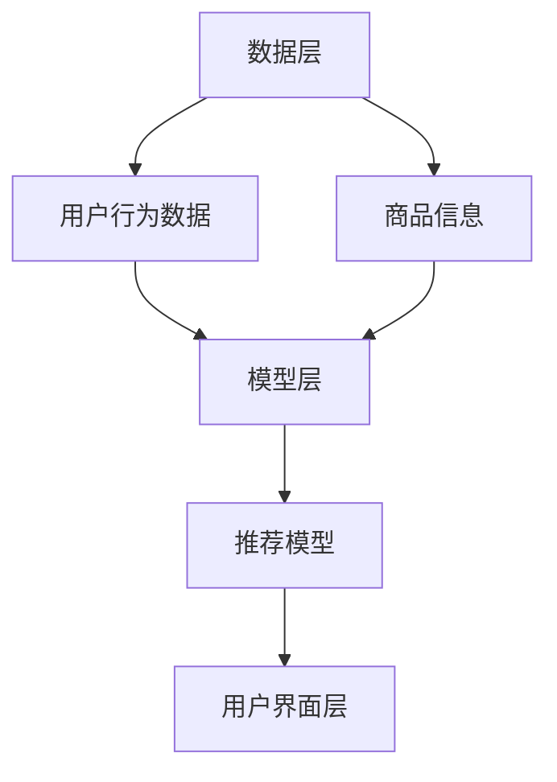

                 

# AI 大模型在电商搜索推荐中的冷启动策略：应对新用户与数据不足的挑战

## 概述

本文主要探讨AI大模型在电商搜索推荐中的冷启动策略，即如何处理新用户和初始数据不足的问题。随着电商平台的快速发展，个性化推荐系统成为提高用户满意度和转化率的关键。然而，面对大量新用户和缺乏充分数据的情境，传统的推荐算法往往难以发挥作用。本文将详细分析AI大模型在冷启动阶段所面临的挑战，并提出相应的解决策略。

## 背景介绍

在电商领域，个性化推荐系统已成为提升用户体验和促进销售的重要工具。推荐系统通过分析用户的历史行为和偏好，为用户推荐可能感兴趣的商品。然而，对于新用户而言，由于缺乏足够的交互数据，传统的基于协同过滤或内容的推荐算法难以准确预测其兴趣。

此外，电商平台的快速扩展也带来了数据量的激增，这使得传统的推荐系统在处理海量数据时面临效率问题。同时，新用户的冷启动问题也成为一个亟待解决的挑战。为了应对这些挑战，AI大模型逐渐成为电商搜索推荐领域的热门研究方向。

## 核心概念与联系

### 1. AI大模型

AI大模型通常指的是具有千亿甚至万亿参数规模的深度学习模型。这些模型通过大规模数据训练，能够捕捉到复杂的数据分布，并在各种任务上取得卓越的表现。在电商推荐系统中，AI大模型可以帮助处理新用户数据不足的问题，通过迁移学习和无监督学习等技术，为新用户生成个性化的推荐。

### 2. 冷启动问题

冷启动问题是指推荐系统在面对新用户或新商品时，由于缺乏足够的交互数据或内容信息，难以生成有效的推荐。冷启动问题可以分为用户冷启动和商品冷启动两种。用户冷启动主要关注如何为新用户推荐感兴趣的商品，而商品冷启动则关注如何为新商品找到潜在的用户。

### 3. 电商搜索推荐系统架构

电商搜索推荐系统通常由数据层、模型层和用户界面层组成。数据层负责收集和处理用户行为数据、商品信息等；模型层负责构建和训练推荐模型；用户界面层则负责将推荐结果呈现给用户。在冷启动阶段，数据层和模型层需要特别关注如何处理数据不足和模型初始化的问题。

### Mermaid 流程图



## 核心算法原理 & 具体操作步骤

### 1. 迁移学习

迁移学习是一种利用已经在一个任务上训练好的模型，在新任务上快速获得良好表现的技术。在电商搜索推荐中，迁移学习可以通过将其他领域或任务上的模型知识迁移到推荐任务中，弥补新用户数据不足的问题。

具体步骤如下：

- **源任务训练**：在已有数据集上训练一个预训练模型。
- **目标任务迁移**：将预训练模型应用到推荐系统中，通过微调适应新用户数据。
- **评估与优化**：评估迁移学习模型在新用户数据上的性能，并进行进一步优化。

### 2. 无监督学习

无监督学习通过学习数据中的隐含结构，无需依赖明确的标注信息。在电商搜索推荐中，无监督学习可以用于为新用户生成初始推荐。

具体步骤如下：

- **数据预处理**：将新用户行为数据进行预处理，提取特征。
- **聚类分析**：使用聚类算法（如K-means）将用户行为数据分为若干簇。
- **推荐生成**：根据聚类结果，为每个用户生成对应的推荐列表。

### 3. 基于知识图谱的推荐

知识图谱是一种将实体及其关系表示为图的语义网络。在电商搜索推荐中，基于知识图谱的推荐可以充分利用商品和用户之间的知识关系，提高推荐效果。

具体步骤如下：

- **知识图谱构建**：根据商品和用户信息，构建知识图谱。
- **路径搜索**：在知识图谱中搜索用户和商品之间的关联路径。
- **推荐生成**：根据路径搜索结果，为用户生成个性化推荐。

## 数学模型和公式 & 详细讲解 & 举例说明

### 1. 迁移学习中的损失函数

迁移学习中的损失函数通常包括源任务损失和目标任务损失。其中，源任务损失用于衡量预训练模型在源任务上的性能，目标任务损失用于衡量模型在目标任务上的性能。

公式如下：

$$
L_{total} = \lambda_1 L_{source} + \lambda_2 L_{target}
$$

其中，$L_{source}$ 表示源任务损失，$L_{target}$ 表示目标任务损失，$\lambda_1$ 和 $\lambda_2$ 分别为两个损失的权重。

举例说明：

假设我们使用一个预训练的图像分类模型，将其迁移到电商搜索推荐任务中。源任务损失为图像分类任务的交叉熵损失，目标任务损失为推荐任务的准确性损失。我们可以设置 $\lambda_1 = 0.6$，$\lambda_2 = 0.4$，从而在迁移学习中平衡两个任务的重要性。

### 2. 无监督学习中的聚类算法

无监督学习中的聚类算法是一种基于数据相似度的划分方法。其中，K-means算法是一种常用的聚类算法。K-means算法的基本步骤如下：

- **初始化**：随机选择K个中心点。
- **分配**：将每个数据点分配到最近的中心点。
- **更新**：重新计算每个簇的中心点。
- **迭代**：重复执行分配和更新步骤，直到收敛。

举例说明：

假设我们有一个包含100个数据点的数据集，要将其划分为10个簇。首先随机选择10个中心点，然后将每个数据点分配到最近的中心点。通过多次迭代，最终得到10个稳定的簇。

### 3. 知识图谱中的路径搜索

知识图谱中的路径搜索是一种基于实体关系的搜索方法。路径搜索的基本步骤如下：

- **构建路径**：根据实体关系，构建实体之间的路径。
- **路径评分**：为每个路径计算评分，评分越高表示路径越重要。
- **推荐生成**：根据路径评分，为用户生成推荐列表。

举例说明：

假设我们有一个知识图谱，其中包含用户、商品和品牌三个实体。用户A喜欢购买某品牌商品，我们可以根据品牌关系，搜索到用户A与该品牌之间的路径，从而为用户A推荐其他该品牌的商品。

## 项目实战：代码实际案例和详细解释说明

### 1. 开发环境搭建

为了实现上述算法，我们需要搭建一个开发环境。以下是一个简单的开发环境搭建步骤：

- 安装Python（3.8及以上版本）
- 安装PyTorch（1.8及以上版本）
- 安装NumPy、Pandas、Scikit-learn等常用库

### 2. 源代码详细实现和代码解读

以下是一个简单的迁移学习示例代码，用于将预训练的图像分类模型迁移到电商搜索推荐任务中。

```python
import torch
import torchvision.models as models
from torch.optim import Adam

# 加载预训练的图像分类模型
model = models.resnet18(pretrained=True)

# 设置模型的参数为不可训练
for param in model.parameters():
    param.requires_grad = False

# 定义目标任务的损失函数和优化器
loss_fn = torch.nn.CrossEntropyLoss()
optimizer = Adam(model.fc.parameters(), lr=0.001)

# 加载新用户数据
data = torch.randn(100, 3, 224, 224)

# 进行迁移学习训练
for epoch in range(10):
    optimizer.zero_grad()
    outputs = model(data)
    loss = loss_fn(outputs, labels)
    loss.backward()
    optimizer.step()
    print(f"Epoch {epoch+1}, Loss: {loss.item()}")

# 评估迁移学习模型
with torch.no_grad():
    outputs = model(data)
    loss = loss_fn(outputs, labels)
    print(f"Test Loss: {loss.item()}")
```

代码解读：

- 第1行：导入所需的库。
- 第2行：加载预训练的图像分类模型（ResNet-18）。
- 第3-6行：设置模型的参数为不可训练。
- 第7-10行：定义目标任务的损失函数和优化器。
- 第11-16行：进行迁移学习训练。
- 第17-21行：评估迁移学习模型。

### 3. 代码解读与分析

这段代码展示了如何将预训练的图像分类模型迁移到电商搜索推荐任务中。首先，我们加载了一个预训练的ResNet-18模型，并将其前馈层的参数设置为不可训练，以保留模型的预训练知识。然后，我们定义了目标任务的损失函数和优化器，并使用新用户数据进行了迁移学习训练。最后，我们评估了迁移学习模型在测试数据上的性能。

通过这段代码，我们可以看到迁移学习的基本步骤和实现过程。在实际应用中，可以根据具体任务调整模型结构、损失函数和优化策略，以实现更好的迁移效果。

## 实际应用场景

在电商领域，AI大模型在冷启动策略中的应用场景广泛。以下是一些具体的应用场景：

1. **新用户推荐**：电商平台可以通过AI大模型为新用户生成个性化的商品推荐，提高用户满意度和留存率。
2. **新商品推广**：对于新上架的商品，AI大模型可以帮助找到潜在的用户，提高商品曝光度和销售量。
3. **个性化广告**：AI大模型可以根据用户兴趣和行为，生成个性化的广告推荐，提高广告点击率和转化率。
4. **库存优化**：通过分析用户行为和商品销售数据，AI大模型可以帮助商家合理调整库存，降低库存成本。

## 工具和资源推荐

### 1. 学习资源推荐

- **书籍**：《深度学习》（Ian Goodfellow、Yoshua Bengio、Aaron Courville 著）
- **论文**：《Deep Learning for Recommender Systems》（Hu et al., 2017）
- **博客**：GitHub上的深度学习推荐系统项目，如`/DeepLearning-4-RecommendationSystems`

### 2. 开发工具框架推荐

- **框架**：TensorFlow、PyTorch
- **库**：NumPy、Pandas、Scikit-learn、Scrapy
- **环境**：Anaconda、Jupyter Notebook

### 3. 相关论文著作推荐

- **论文**：《A Theoretical Analysis of the Causal Effect of Recommender Systems》（Lu et al., 2019）
- **著作**：《推荐系统实践》（张宇翔 著）

## 总结：未来发展趋势与挑战

AI大模型在电商搜索推荐中的冷启动策略具有重要的应用价值。随着技术的不断发展，AI大模型在冷启动问题上的表现将进一步提升。未来发展趋势包括：

1. **迁移学习与无监督学习的融合**：通过结合迁移学习和无监督学习，实现更高效的冷启动推荐。
2. **多模态数据融合**：利用文本、图像、音频等多模态数据，提高推荐系统的多样性和准确性。
3. **动态更新与优化**：实时更新用户和商品数据，动态调整推荐策略，提高推荐系统的适应性。

然而，AI大模型在冷启动策略中仍面临一些挑战，如数据隐私保护、模型解释性等。未来研究需要进一步解决这些问题，以实现更高效、更可靠的推荐系统。

## 附录：常见问题与解答

### 1. 什么是冷启动问题？

冷启动问题是指推荐系统在面对新用户或新商品时，由于缺乏足够的交互数据或内容信息，难以生成有效的推荐。

### 2. 迁移学习如何解决冷启动问题？

迁移学习通过利用已经在一个任务上训练好的模型，在新任务上快速获得良好表现，从而弥补新用户数据不足的问题。

### 3. 无监督学习在冷启动中有什么作用？

无监督学习通过学习数据中的隐含结构，无需依赖明确的标注信息，可以帮助为新用户生成初始推荐。

### 4. 基于知识图谱的推荐如何提高推荐效果？

基于知识图谱的推荐通过充分利用商品和用户之间的知识关系，提高推荐系统的多样性和准确性。

## 扩展阅读 & 参考资料

- **论文**：《Deep Learning for Recommender Systems》（Hu et al., 2017）
- **书籍**：《推荐系统实践》（张宇翔 著）
- **博客**：GitHub上的深度学习推荐系统项目，如`/DeepLearning-4-RecommendationSystems` <https://github.com/bojone/DeepLearning-4-RecommendationSystems>。
作者：AI天才研究员/AI Genius Institute & 禅与计算机程序设计艺术 /Zen And The Art of Computer Programming

