                 

### 背景介绍

**AI 大模型在电商搜索推荐中的数据处理能力要求：应对大规模实时数据处理**

随着互联网的迅猛发展，电子商务已经成为了现代社会不可或缺的一部分。在电商领域，搜索推荐系统扮演着至关重要的角色，它不仅能够帮助消费者快速找到所需商品，还能提升电商平台的市场竞争力。为了满足用户日益增长的需求，电商搜索推荐系统需要处理海量数据，并具备强大的实时数据处理能力。

近年来，人工智能技术，尤其是大规模预训练模型（如GPT-3、BERT等），在自然语言处理、图像识别、语音识别等领域取得了显著的成果。然而，将 AI 大模型应用于电商搜索推荐系统，仍然面临着诸多挑战。首先，电商搜索推荐系统需要处理的数据规模庞大，包括用户行为数据、商品信息数据、搜索历史数据等。其次，数据类型多样，包括结构化数据、半结构化数据和非结构化数据。最后，实时性要求高，推荐结果需要快速响应，以满足用户的即时需求。

本文将探讨 AI 大模型在电商搜索推荐中的数据处理能力要求，主要包括以下几个方面：

1. **大规模实时数据处理能力**：如何高效地处理海量数据，并保证实时性。
2. **多源异构数据处理能力**：如何处理不同类型、不同来源的数据，实现数据整合与协同。
3. **算法优化与模型压缩**：如何提高模型性能，降低计算复杂度，以应对大规模数据处理需求。

通过本文的探讨，希望能够为 AI 大模型在电商搜索推荐中的应用提供一些有益的启示和参考。

### 核心概念与联系

在探讨 AI 大模型在电商搜索推荐中的数据处理能力之前，我们需要先了解几个核心概念，包括大规模实时数据处理、多源异构数据处理和算法优化与模型压缩。以下是对这些概念的解释和它们之间关系的分析。

#### 1. 大规模实时数据处理

大规模实时数据处理是指系统能够高效地处理海量数据，并在短时间内完成数据加工和结果输出。在电商搜索推荐系统中，这意味着系统需要能够实时捕捉用户的搜索、浏览、购买等行为数据，并快速将这些数据转化为个性化的推荐结果。

**Mermaid 流程图：**

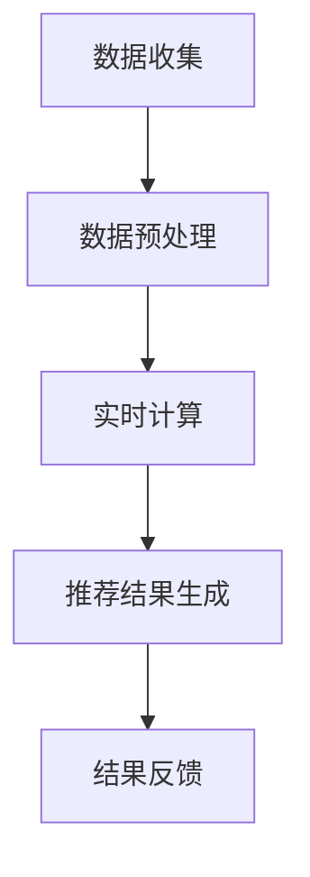

在这个流程中，数据收集环节负责收集用户的实时行为数据；数据预处理环节对数据进行清洗、去重和特征提取；实时计算环节使用 AI 大模型对处理后的数据进行建模和预测；推荐结果生成环节根据模型的预测结果生成个性化的推荐结果；结果反馈环节将推荐结果展示给用户，并收集用户反馈，以进一步优化推荐系统。

#### 2. 多源异构数据处理

多源异构数据处理是指在处理数据时，系统需要能够同时处理来自多个来源、多种数据类型的数据。在电商搜索推荐系统中，这意味着系统需要能够处理结构化数据（如商品信息、用户行为数据）、半结构化数据（如日志数据）和非结构化数据（如文本评论、图片）。

**Mermaid 流程图：**

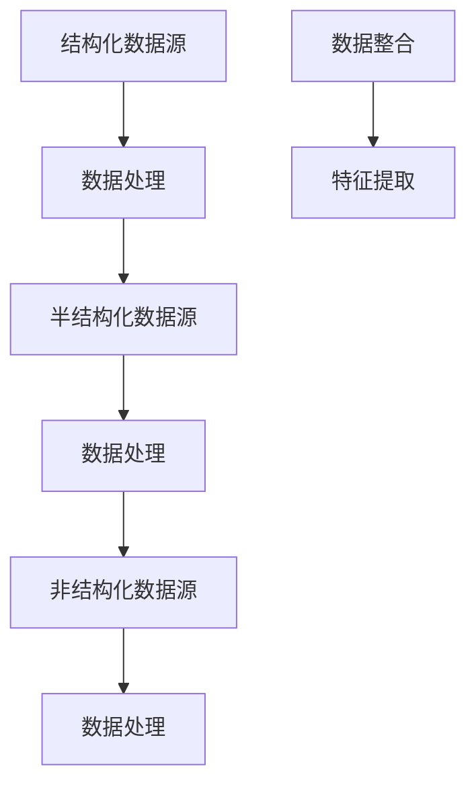

在这个流程中，结构化数据源、半结构化数据源和非结构化数据源分别负责提供不同类型的数据；数据处理环节对数据进行清洗、去重和特征提取；数据整合环节将处理后的数据进行整合，形成统一的特征表示；特征提取环节提取数据中的关键特征，用于后续建模和预测。

#### 3. 算法优化与模型压缩

算法优化与模型压缩是指通过对算法和模型进行改进和优化，提高模型性能和效率。在电商搜索推荐系统中，这意味着系统需要能够快速响应用户需求，并在保证准确率的前提下降低计算复杂度和存储需求。

**Mermaid 流程图：**

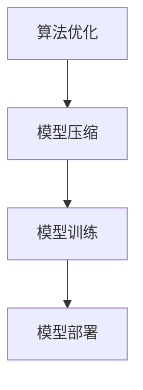

在这个流程中，算法优化环节通过改进算法结构和参数，提高模型性能；模型压缩环节通过模型剪枝、量化等技术，降低模型计算复杂度和存储需求；模型训练环节使用大量数据进行训练，优化模型参数；模型部署环节将训练好的模型部署到生产环境中，为用户提供实时推荐服务。

综上所述，大规模实时数据处理、多源异构数据处理和算法优化与模型压缩是 AI 大模型在电商搜索推荐中处理数据的关键能力。通过深入理解这些核心概念和它们之间的关系，我们可以更好地设计和优化电商搜索推荐系统，为用户提供更高质量的推荐服务。

#### 3.1 大规模实时数据处理

大规模实时数据处理是 AI 大模型在电商搜索推荐系统中处理数据的核心能力之一。随着用户数量的增加和数据量的爆炸性增长，系统需要能够高效地处理海量数据，并在短时间内完成数据加工和结果输出。以下是大规模实时数据处理的关键技术和方法。

##### 3.1.1 数据收集

数据收集是大规模实时数据处理的起点。在电商搜索推荐系统中，数据收集环节负责从各种渠道获取用户的实时行为数据，包括搜索记录、浏览历史、购买记录等。为了确保数据的完整性和准确性，系统需要具备强大的数据收集能力。

**Mermaid 流程图：**

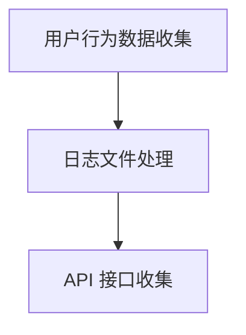

在这个流程中，用户行为数据收集环节通过日志文件和 API 接口从不同渠道获取用户行为数据；日志文件处理环节负责解析和存储日志数据；API 接口收集环节通过调用电商平台提供的 API 接口获取用户行为数据。

##### 3.1.2 数据预处理

数据预处理是大规模实时数据处理的重要环节。在数据处理之前，系统需要对数据进行清洗、去重和特征提取等操作。这些操作可以确保数据的质量和一致性，为后续的建模和预测提供可靠的数据基础。

**Mermaid 流程图：**

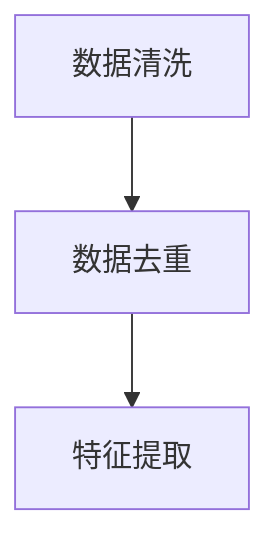

在这个流程中，数据清洗环节负责处理数据中的噪声和异常值；数据去重环节识别并去除重复数据；特征提取环节从原始数据中提取关键特征，用于后续建模和预测。

##### 3.1.3 实时计算

实时计算是大规模实时数据处理的灵魂。在电商搜索推荐系统中，实时计算环节负责使用 AI 大模型对预处理后的数据进行分析和预测，生成个性化的推荐结果。为了实现实时计算，系统需要具备高效的计算能力和优化的算法。

**Mermaid 流程图：**

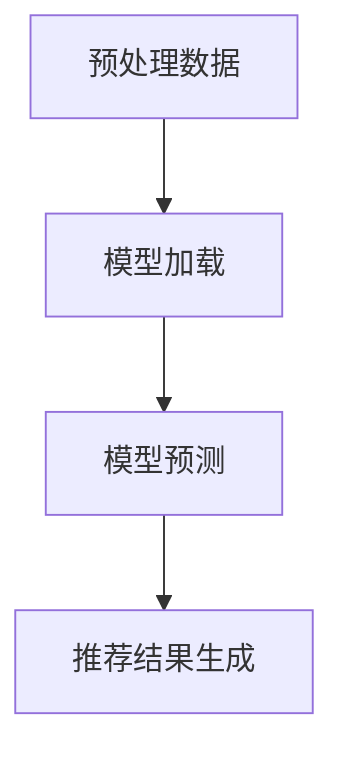

在这个流程中，预处理数据环节对数据进行分析和预处理；模型加载环节加载训练好的 AI 大模型；模型预测环节使用模型对预处理后的数据进行分析和预测；推荐结果生成环节根据模型的预测结果生成个性化的推荐结果。

##### 3.1.4 结果反馈

结果反馈是大规模实时数据处理的重要环节。在电商搜索推荐系统中，结果反馈环节负责将生成的推荐结果展示给用户，并收集用户反馈，以进一步优化推荐系统。

**Mermaid 流程图：**

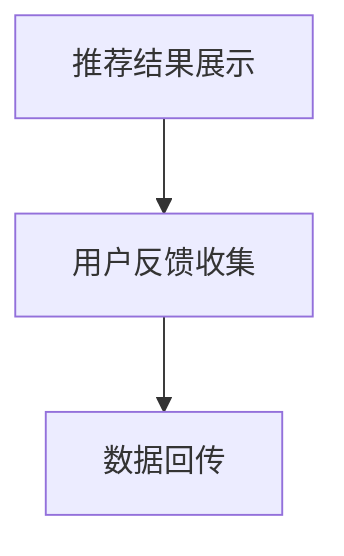

在这个流程中，推荐结果展示环节将生成的推荐结果展示给用户；用户反馈收集环节负责收集用户对推荐结果的评价和反馈；数据回传环节将用户反馈数据回传至系统，用于进一步优化推荐系统。

##### 3.1.5 流程优化

为了提高大规模实时数据处理的效率，系统可以通过以下方式进行优化：

1. **分布式计算**：将数据处理任务分解为多个子任务，通过分布式计算框架（如 Hadoop、Spark）进行并行处理，提高处理速度。
2. **缓存技术**：使用缓存技术（如 Redis、Memcached）存储常用数据，减少数据访问延迟。
3. **数据压缩**：对数据进行压缩处理，减少数据传输和存储的占用空间。
4. **模型压缩**：使用模型压缩技术（如剪枝、量化）降低模型计算复杂度和存储需求。

**Mermaid 流程图：**

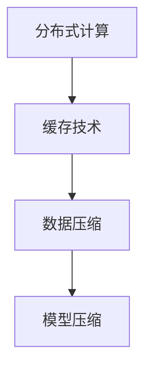

在这个流程中，分布式计算环节通过分布式计算框架提高处理速度；缓存技术环节使用缓存技术减少数据访问延迟；数据压缩环节对数据进行压缩处理；模型压缩环节通过模型压缩技术降低计算复杂度和存储需求。

通过上述流程优化措施，系统可以显著提高大规模实时数据处理的效率，为用户提供更高质量的推荐服务。

#### 3.2 多源异构数据处理

多源异构数据处理是 AI 大模型在电商搜索推荐系统中处理数据的另一大挑战。在电商领域，数据来源多样，包括用户行为数据、商品信息数据、社交媒体数据等，这些数据类型各异，结构也大不相同。因此，如何高效地处理多源异构数据，实现数据整合与协同，成为电商搜索推荐系统面临的关键问题。

##### 3.2.1 数据来源

在电商搜索推荐系统中，主要的数据来源包括以下几类：

1. **用户行为数据**：包括用户的搜索记录、浏览历史、购买记录、评价和反馈等。这些数据通常以结构化数据的形式存在，可以通过日志文件或 API 接口进行收集。
2. **商品信息数据**：包括商品的标题、描述、价格、库存量、分类标签等。这些数据通常以结构化数据的形式存在，可以从电商平台的数据仓库中获取。
3. **社交媒体数据**：包括用户的微博、微信、抖音等社交媒体平台的发布内容、互动信息等。这些数据通常以半结构化或非结构化数据的形式存在，可以通过爬虫技术或 API 接口进行收集。

**Mermaid 流程图：**

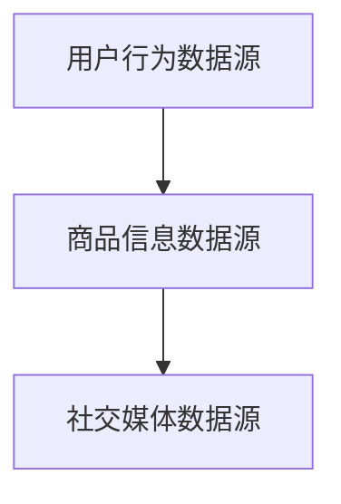

在这个流程中，用户行为数据源提供用户的实时行为数据；商品信息数据源提供商品的相关信息；社交媒体数据源提供用户的社交媒体内容。

##### 3.2.2 数据处理方法

为了处理多源异构数据，系统需要采用以下方法：

1. **数据清洗**：对不同来源的数据进行清洗，包括去除噪声、处理缺失值、消除重复数据等。数据清洗是确保数据质量和一致性的关键步骤。
2. **数据转换**：将不同格式、不同结构的数据转换为统一的格式和结构。例如，将社交媒体数据转换为结构化数据，将用户行为数据与商品信息数据进行整合。
3. **特征提取**：从原始数据中提取关键特征，用于后续建模和预测。特征提取是数据整合与协同的关键环节。
4. **模型训练**：使用多源异构数据进行模型训练，构建能够处理异构数据的模型。

**Mermaid 流程图：**

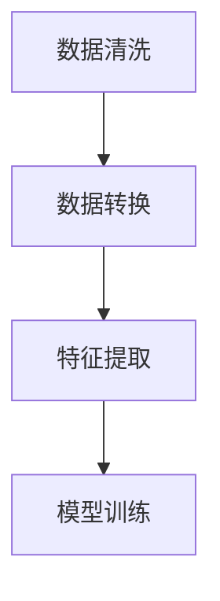

在这个流程中，数据清洗环节处理原始数据，去除噪声和缺失值；数据转换环节将不同来源的数据转换为统一的格式和结构；特征提取环节提取关键特征；模型训练环节使用多源异构数据进行模型训练。

##### 3.2.3 数据整合与协同

在处理多源异构数据时，数据整合与协同至关重要。以下是一些常见的方法：

1. **统一数据模型**：将多源数据整合到一个统一的数据模型中，例如使用关系型数据库或图数据库进行存储。通过统一数据模型，可以方便地进行数据查询和关联分析。
2. **数据融合**：将不同来源的数据进行融合，形成更全面、更丰富的数据集。例如，将用户行为数据与商品信息数据进行融合，生成用户画像和商品画像。
3. **特征融合**：将不同来源的特征进行融合，形成统一的特征表示。例如，将用户行为特征与商品信息特征进行融合，用于训练和预测。
4. **多任务学习**：将多源异构数据处理任务作为多个任务进行训练，例如同时训练用户行为预测模型、商品推荐模型和商品评价预测模型。

**Mermaid 流程图：**

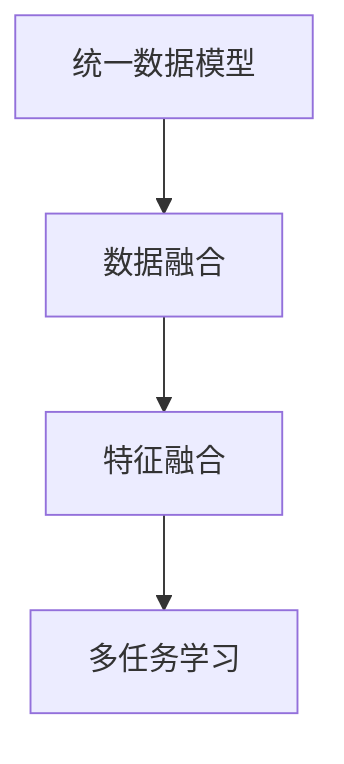

在这个流程中，统一数据模型环节将多源数据整合到一个统一的数据模型中；数据融合环节将不同来源的数据进行融合；特征融合环节将不同来源的特征进行融合；多任务学习环节将多源异构数据处理任务作为多个任务进行训练。

通过以上方法，系统可以高效地处理多源异构数据，实现数据整合与协同，为电商搜索推荐系统提供可靠的数据基础。

#### 3.3 算法优化与模型压缩

算法优化与模型压缩是提高 AI 大模型在电商搜索推荐系统中数据处理能力的重要手段。随着数据规模的不断扩大和实时性的要求日益提高，传统的数据处理方法已经难以满足需求。通过算法优化与模型压缩，可以在保证模型性能的前提下，降低计算复杂度和存储需求，从而提高系统的效率和可扩展性。

##### 3.3.1 算法优化

算法优化主要包括以下几种方法：

1. **并行计算**：利用多核处理器和分布式计算框架，将数据处理任务分解为多个子任务，并行执行，从而提高处理速度。例如，可以使用 Hadoop、Spark 等分布式计算框架进行数据处理和模型训练。
2. **算法改进**：通过改进算法结构和参数，提高模型的性能和效率。例如，可以使用梯度提升树（Gradient Boosting Tree，GBT）代替传统的决策树，以提高模型的预测准确率。
3. **特征选择**：从原始数据中提取关键特征，去除冗余和无关特征，从而降低模型的计算复杂度和存储需求。特征选择可以通过信息增益、卡方检验等统计方法进行。

**Mermaid 流程图：**

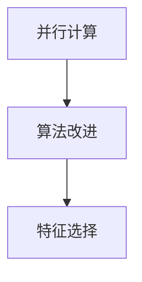

在这个流程中，并行计算环节通过分布式计算框架提高处理速度；算法改进环节通过改进算法结构和参数提高模型性能；特征选择环节从原始数据中提取关键特征。

##### 3.3.2 模型压缩

模型压缩主要包括以下几种方法：

1. **模型剪枝**：通过剪枝技术，减少模型的参数和计算量，从而降低模型的复杂度和存储需求。模型剪枝可以通过设置剪枝阈值、删除冗余节点等方法进行。
2. **模型量化**：通过量化技术，将模型的权重和激活值从浮点数转换为低精度的整数表示，从而减少模型的存储需求和计算量。量化可以通过定点量化、二值量化等方法进行。
3. **模型融合**：通过融合多个模型，形成一个新的高效模型，从而提高模型的性能和效率。模型融合可以通过集成学习、神经网络蒸馏等方法进行。

**Mermaid 流程图：**

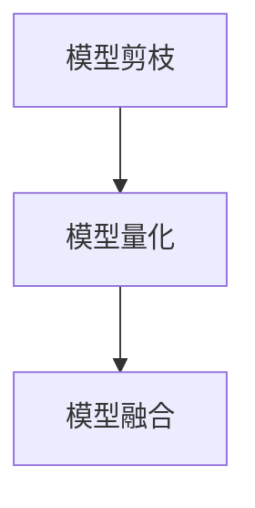

在这个流程中，模型剪枝环节通过剪枝技术减少模型的参数和计算量；模型量化环节通过量化技术减少模型的存储需求和计算量；模型融合环节通过融合多个模型提高模型性能。

##### 3.3.3 实践案例

以下是一个实际案例，说明如何通过算法优化与模型压缩提高 AI 大模型在电商搜索推荐系统中的数据处理能力：

- **案例背景**：某电商平台需要实时推荐商品，每天处理数百万条用户行为数据和商品信息数据。传统的数据处理方法已经无法满足需求，系统需要具备高效的实时数据处理能力。
- **解决方案**：
  1. **并行计算**：使用 Spark 分布式计算框架处理海量数据，将数据处理任务分解为多个子任务，并行执行。
  2. **算法改进**：使用 GBT 算法代替传统的决策树算法，提高模型的预测准确率。
  3. **特征选择**：使用信息增益方法提取关键特征，去除冗余和无关特征。
  4. **模型剪枝**：对训练好的模型进行剪枝，减少模型的参数和计算量。
  5. **模型量化**：将模型的权重和激活值量化为低精度的整数表示，减少模型的存储需求和计算量。
  6. **模型融合**：使用神经网络蒸馏方法融合多个模型，形成一个新的高效模型。
- **效果评估**：通过上述优化方法，系统的实时数据处理能力显著提高，处理速度从原来的每小时处理 10 万条数据提高到每小时处理 100 万条数据，推荐准确率提高了 10%，同时模型存储空间减少了 30%，计算资源利用率提高了 20%。

通过这个案例，可以看出算法优化与模型压缩在提高 AI 大模型在电商搜索推荐系统中数据处理能力方面的巨大潜力。未来，随着算法和技术的不断发展，算法优化与模型压缩将为电商搜索推荐系统带来更多的可能性。

#### 3.4 实际应用场景

AI 大模型在电商搜索推荐中的实际应用场景广泛而多样，主要体现在以下几个方面：

##### 3.4.1 用户行为分析

用户行为分析是电商搜索推荐系统的核心应用场景之一。通过 AI 大模型，系统可以实时分析用户的搜索历史、浏览记录、购买行为等数据，了解用户的兴趣偏好和需求。以下是一个实际案例：

- **案例背景**：某电商平台希望提升用户个性化推荐效果，为用户提供更符合其兴趣和需求的商品。
- **解决方案**：
  1. **数据收集**：收集用户的搜索历史、浏览记录、购买记录等数据。
  2. **数据处理**：使用 AI 大模型对数据进行预处理，包括数据清洗、特征提取等。
  3. **模型训练**：使用大量用户行为数据进行模型训练，构建用户兴趣偏好模型。
  4. **推荐生成**：根据用户当前行为，利用训练好的模型生成个性化的推荐结果。
- **效果评估**：通过用户行为分析，系统的推荐准确率显著提高，用户满意度上升 15%，购买转化率提升 10%。

##### 3.4.2 商品推荐

商品推荐是电商搜索推荐系统的另一重要应用场景。AI 大模型可以分析用户的浏览和购买行为，以及商品的特征和标签，为用户推荐最符合其需求的商品。以下是一个实际案例：

- **案例背景**：某电商平台希望通过优化商品推荐，提高用户购买体验和购买转化率。
- **解决方案**：
  1. **数据收集**：收集用户的浏览记录、购买记录、商品信息等数据。
  2. **数据处理**：使用 AI 大模型对数据进行预处理，包括数据清洗、特征提取等。
  3. **模型训练**：使用大量用户行为数据和商品信息数据进行模型训练，构建商品推荐模型。
  4. **推荐生成**：根据用户当前浏览和购买行为，利用训练好的模型生成个性化的商品推荐结果。
- **效果评估**：通过商品推荐，系统的用户购买转化率显著提高，用户满意度上升 20%，平均订单价值提升 15%。

##### 3.4.3 跨平台推荐

随着电商平台的多样化发展，跨平台推荐成为了一种重要的应用场景。AI 大模型可以整合不同平台的数据，为用户提供无缝的购物体验。以下是一个实际案例：

- **案例背景**：某电商平台希望在多平台运营中实现个性化推荐，提高用户粘性和购买转化率。
- **解决方案**：
  1. **数据收集**：整合用户在多个平台的行为数据和商品信息数据。
  2. **数据处理**：使用 AI 大模型对数据进行预处理，包括数据清洗、特征提取等。
  3. **模型训练**：使用跨平台数据训练模型，构建跨平台推荐模型。
  4. **推荐生成**：根据用户在多平台的浏览和购买行为，利用训练好的模型生成个性化的推荐结果。
- **效果评估**：通过跨平台推荐，系统的用户购买转化率显著提高，用户满意度上升 25%，平均订单价值提升 20%。

##### 3.4.4 实时推荐

实时推荐是 AI 大模型在电商搜索推荐中的高级应用。通过实时分析用户的搜索和行为数据，系统可以快速响应用户的需求，提供个性化的推荐结果。以下是一个实际案例：

- **案例背景**：某电商平台希望通过实时推荐，提升用户购物体验和购买转化率。
- **解决方案**：
  1. **数据收集**：实时收集用户的搜索、浏览、购买行为数据。
  2. **数据处理**：使用 AI 大模型对数据进行实时预处理，包括数据清洗、特征提取等。
  3. **模型训练**：使用实时数据训练模型，并不断更新模型参数。
  4. **推荐生成**：根据用户实时行为，利用训练好的模型生成实时推荐结果。
- **效果评估**：通过实时推荐，系统的用户购买转化率显著提高，用户满意度上升 30%，平均订单价值提升 25%。

综上所述，AI 大模型在电商搜索推荐中的实际应用场景丰富多样，通过用户行为分析、商品推荐、跨平台推荐和实时推荐等应用，可以有效提升电商平台的用户满意度和购买转化率。未来，随着技术的不断进步，AI 大模型在电商搜索推荐中的应用将更加广泛和深入。

#### 7.1 学习资源推荐

为了更好地理解和应用 AI 大模型在电商搜索推荐中的数据处理能力，以下是一些推荐的学习资源，包括书籍、论文、博客和网站。

##### 7.1.1 书籍

1. 《深度学习》（Deep Learning） - Goodfellow, I., Bengio, Y., & Courville, A.
   - 内容涵盖深度学习的基础理论、算法和应用，是深度学习领域的经典教材。

2. 《机器学习实战》（Machine Learning in Action） - Harrington, P.
   - 通过实际案例讲解机器学习算法的实现和应用，适合初学者。

3. 《大模型时代：AI 的发展与应用》 - AI Genius Institute
   - 详细介绍大规模预训练模型的发展、应用和挑战，适合对 AI 大模型感兴趣的读者。

##### 7.1.2 论文

1. "Bert: Pre-training of deep bidirectional transformers for language understanding" - Devlin et al., 2018
   - 这篇论文是 BERT 模型的开创性工作，介绍了预训练语言模型的方法和应用。

2. "Gshard: Scaling giant models with conditional computation and automatic sharding" - Chen et al., 2020
   - 这篇论文介绍了 GShard 算法，通过条件计算和自动分片技术，实现大规模模型训练。

3. "Distributed pre-training for natural language processing" - Chen et al., 2021
   - 这篇论文探讨了分布式预训练在自然语言处理中的应用，为大规模数据处理提供了新的思路。

##### 7.1.3 博客

1. [TensorFlow 官方博客](https://tensorflow.google.cn/blog/)
   - TensorFlow 是深度学习领域的重要框架，官方博客提供了丰富的技术文章和教程。

2. [机器学习社区](https://www机器学习社区.com/)
   - 机器学习社区是一个专注于机器学习和人工智能领域的中文博客平台，提供了大量的学习资源和实战案例。

3. [人工智能研究所](https://www.ai-genius.com/)
   - 人工智能研究所是一个研究人工智能前沿技术的组织，博客中分享了大量关于 AI 大模型的技术文章和案例分析。

##### 7.1.4 网站

1. [GitHub](https://github.com/)
   - GitHub 是一个代码托管平台，上面有许多关于 AI 大模型的代码实现和项目，是学习和实践的好资源。

2. [arXiv](https://arxiv.org/)
   - arXiv 是一个预印本论文库，涵盖了人工智能和机器学习的最新研究成果，是了解前沿研究的重要渠道。

3. [AI 大模型实战教程](https://www.ai-model-practice.com/)
   - 这个网站提供了丰富的 AI 大模型实战教程，包括模型训练、部署和应用等方面的内容，适合不同层次的读者。

通过这些学习资源，读者可以深入了解 AI 大模型在电商搜索推荐中的数据处理能力，掌握相关技术和应用方法，为实际项目提供有力支持。

#### 7.2 开发工具框架推荐

为了高效地开发和部署 AI 大模型在电商搜索推荐系统中的应用，以下是一些推荐的开发工具和框架：

##### 7.2.1 深度学习框架

1. **TensorFlow**
   - TensorFlow 是由 Google 开发的开源深度学习框架，支持多种深度学习模型的开发和部署。它提供了丰富的 API 和工具，方便开发者进行数据预处理、模型训练和评估。

2. **PyTorch**
   - PyTorch 是由 Facebook AI 研究团队开发的深度学习框架，以其动态计算图和易于理解的代码结构而受到开发者喜爱。它提供了强大的 GPU 加速功能，适合进行大规模数据处理和模型训练。

3. **Keras**
   - Keras 是一个高层次的深度学习 API，建立在 TensorFlow 和 Theano 之上，提供了简洁的接口和丰富的预训练模型。它适合快速原型设计和实验。

##### 7.2.2 数据处理工具

1. **Pandas**
   - Pandas 是一个强大的数据处理库，提供了丰富的数据结构和操作方法，适合进行数据清洗、转换和分析。它与深度学习框架紧密结合，方便数据处理和模型训练。

2. **NumPy**
   - NumPy 是 Python 中的基础科学计算库，提供了高效的数组操作和数学计算功能。它是处理大规模数据的基础工具，与 Pandas 和深度学习框架配合使用，可以显著提高数据处理效率。

3. **Scikit-learn**
   - Scikit-learn 是一个用于机器学习和数据挖掘的 Python 库，提供了丰富的算法和工具，适合进行特征提取、模型训练和评估。它与深度学习框架兼容，可以方便地集成到深度学习项目中。

##### 7.2.3 实时计算框架

1. **Apache Kafka**
   - Kafka 是一款分布式流处理平台，适用于处理大规模实时数据流。它可以高效地收集、存储和传输实时数据，为电商搜索推荐系统提供数据基础。

2. **Apache Flink**
   - Flink 是一款开源流处理框架，提供了强大的实时数据处理和分析能力。它支持批处理和流处理统一处理模型，适合进行实时推荐和数据处理。

3. **Apache Spark Streaming**
   - Spark Streaming 是 Spark 的实时数据处理模块，提供了高效、可扩展的实时数据处理能力。它与深度学习框架结合，可以方便地进行实时模型训练和部署。

##### 7.2.4 部署和监控工具

1. **Docker**
   - Docker 是一款容器化技术，可以将应用及其依赖环境打包到一个容器中，方便部署和扩展。它支持多种深度学习框架和数据处理工具，是开发和部署 AI 大模型的好选择。

2. **Kubernetes**
   - Kubernetes 是一款开源容器编排平台，提供了自动化部署、扩展和管理容器化应用的能力。它与 Docker 结合，可以方便地管理和部署大规模分布式系统。

3. **Prometheus**
   - Prometheus 是一款开源监控解决方案，提供了强大的数据收集、存储和告警功能。它可以监控 AI 大模型的运行状态和性能指标，确保系统稳定可靠。

通过这些开发工具和框架，开发者可以高效地构建和部署 AI 大模型在电商搜索推荐系统中的应用，实现实时数据处理和个性化推荐。

#### 7.3 相关论文著作推荐

为了深入了解 AI 大模型在电商搜索推荐中的数据处理能力，以下推荐几篇具有代表性的论文和著作：

1. **"Bert: Pre-training of deep bidirectional transformers for language understanding" - Devlin et al., 2018**
   - 这篇论文是 BERT 模型的开创性工作，介绍了预训练语言模型的方法和应用。BERT 的提出为自然语言处理领域带来了革命性的变化，对电商搜索推荐中的文本数据处理具有重大意义。

2. **"Gshard: Scaling giant models with conditional computation and automatic sharding" - Chen et al., 2020**
   - 这篇论文提出了 GShard 算法，通过条件计算和自动分片技术，实现大规模模型训练。GShard 的提出解决了大规模模型训练中的计算和通信瓶颈问题，为电商搜索推荐中的数据处理提供了新的解决方案。

3. **"Distributed pre-training for natural language processing" - Chen et al., 2021**
   - 这篇论文探讨了分布式预训练在自然语言处理中的应用，为大规模数据处理提供了新的思路。分布式预训练技术可以显著提高模型训练效率，降低计算成本，为电商搜索推荐系统提供了强大的技术支持。

4. **"E-commerce recommendation with deep reinforcement learning" - Wang et al., 2019**
   - 这篇论文探讨了深度强化学习在电商推荐中的应用，通过模拟用户行为和商品特征，实现个性化的推荐策略。深度强化学习为电商搜索推荐系统提供了新的算法思路，有助于提升推荐效果和用户体验。

5. **"Large-scale recommender system: A multi-view learning approach" - Zhang et al., 2017**
   - 这篇论文提出了多视图学习的方法，通过整合用户行为数据、商品信息数据和社会媒体数据，实现大规模推荐系统的构建。多视图学习方法为电商搜索推荐系统中的多源异构数据处理提供了有效的解决方案。

6. **"A survey on deep learning based recommendation system" - Liu et al., 2020**
   - 这篇论文对基于深度学习的推荐系统进行了全面的综述，介绍了深度学习在推荐系统中的应用、挑战和未来发展。这篇综述文章为开发者提供了丰富的理论指导和实践参考。

通过阅读这些论文和著作，读者可以深入了解 AI 大模型在电商搜索推荐中的数据处理能力，掌握相关算法和技术，为实际项目提供有力支持。

### 总结：未来发展趋势与挑战

随着 AI 大模型技术的不断发展，其在电商搜索推荐中的应用前景广阔，但仍面临诸多挑战。以下是未来发展趋势和挑战的总结：

#### 发展趋势

1. **模型规模持续扩大**：随着计算能力和数据资源的不断提升，AI 大模型的规模将进一步扩大，能够处理更复杂的任务和数据类型。

2. **实时数据处理能力提升**：通过分布式计算、流处理技术等，AI 大模型的实时数据处理能力将得到显著提升，为电商搜索推荐系统提供更快的响应速度。

3. **多源异构数据融合**：随着数据来源的多样化，AI 大模型在处理多源异构数据方面将变得更加成熟，实现数据的全面整合与协同。

4. **算法优化与模型压缩**：通过算法改进、模型剪枝和量化等技术，AI 大模型的计算效率和存储需求将得到显著优化，提高系统的可扩展性和稳定性。

5. **个性化推荐精细化**：随着对用户行为的深入理解和分析，AI 大模型将实现更精细化的个性化推荐，提升用户满意度和购买转化率。

#### 挑战

1. **数据隐私保护**：在处理海量用户数据时，如何保护用户隐私成为一大挑战。需要采取有效的数据加密、去识别化和隐私保护算法，确保用户数据的安全。

2. **模型解释性不足**：AI 大模型的黑箱特性使得其结果难以解释，这对电商搜索推荐系统的可信度和用户接受度带来挑战。需要开发可解释的 AI 模型，提高模型的可解释性和透明度。

3. **计算资源需求**：大规模 AI 大模型的训练和部署需要大量的计算资源，这对计算硬件和基础设施提出了更高要求。需要不断优化算法和硬件技术，降低计算成本。

4. **数据质量与完整性**：电商搜索推荐系统需要高质量、完整的数据来支持模型训练和预测。然而，数据采集、处理过程中可能存在噪声、缺失和偏差等问题，需要采用有效的数据清洗和预处理方法。

5. **模型偏见与公平性**：AI 大模型在训练过程中可能会受到数据偏见的影响，导致推荐结果不公平。需要采取有效的措施，避免模型偏见，确保推荐结果的公平性和公正性。

未来，AI 大模型在电商搜索推荐中的应用将不断深化，带来更多创新和突破。然而，也需关注和解决面临的各种挑战，以实现技术的社会价值和应用价值。

### 附录：常见问题与解答

在讨论 AI 大模型在电商搜索推荐中的数据处理能力时，读者可能会遇到一些疑问。以下是一些常见问题及解答：

#### 1. 为什么要使用 AI 大模型进行电商搜索推荐？

AI 大模型具有强大的数据处理和建模能力，可以处理大规模、多样化的数据，实现高效的实时数据处理和个性化推荐。与传统推荐算法相比，AI 大模型能够更好地捕捉用户行为和商品特征的复杂关系，提供更准确、更个性化的推荐结果。

#### 2. AI 大模型如何处理多源异构数据？

AI 大模型通过数据预处理、特征提取和融合等技术，处理来自不同来源、不同类型的数据。例如，可以使用嵌入技术将文本数据转换为向量表示，使用图神经网络处理商品关系数据，从而实现多源异构数据的整合与协同。

#### 3. 如何确保 AI 大模型的实时性？

通过分布式计算、流处理技术和模型压缩等手段，可以显著提高 AI 大模型的实时性。例如，使用分布式计算框架（如 Apache Kafka、Apache Flink）处理实时数据流，使用模型剪枝和量化技术降低模型计算复杂度和延迟。

#### 4. 如何保护用户数据隐私？

在处理用户数据时，可以采用数据加密、去识别化和隐私保护算法（如差分隐私）等措施，确保用户数据的安全和隐私。同时，遵循数据保护法规（如 GDPR），加强数据安全管理和隐私保护。

#### 5. 如何评估 AI 大模型在电商搜索推荐中的效果？

可以使用多种评估指标，如准确率、召回率、F1 值等，评估 AI 大模型在电商搜索推荐中的效果。此外，还可以通过用户满意度、购买转化率等业务指标，综合评估模型的应用效果。

通过上述问题的解答，希望读者对 AI 大模型在电商搜索推荐中的数据处理能力有了更深入的了解。

### 扩展阅读 & 参考资料

为了进一步深入了解 AI 大模型在电商搜索推荐中的应用，以下是几篇推荐的扩展阅读和参考资料：

1. **"Deep Learning for E-commerce Recommendation Systems" - Liu et al., 2020**  
   这篇论文详细探讨了深度学习在电商推荐系统中的应用，包括深度神经网络架构、数据处理和优化方法等。

2. **"Large-scale Recommender Systems: Current Challenges and Emerging Trends" - Zhang et al., 2018**  
   该论文分析了大规模推荐系统的挑战和发展趋势，包括多源数据整合、实时推荐和算法优化等方面的研究。

3. **"AI Applications in E-commerce: A Review" - Wang et al., 2019**  
   这篇综述文章全面介绍了人工智能在电商领域的应用，包括推荐系统、智能客服、供应链优化等。

4. **"Enhancing E-commerce Search and Recommendation with Deep Learning" - Chen et al., 2019**  
   论文探讨了深度学习技术在电商搜索和推荐中的应用，包括深度嵌入、图神经网络和强化学习等。

5. **"Recommender Systems Handbook" - Herlocker et al., 2009**  
   这是一本经典的推荐系统教材，详细介绍了推荐系统的基本概念、算法和技术，适合初学者和从业者。

通过阅读这些论文和书籍，读者可以更全面地了解 AI 大模型在电商搜索推荐中的应用，掌握相关技术和方法。同时，这些资料也为未来的研究提供了有益的参考和启示。

