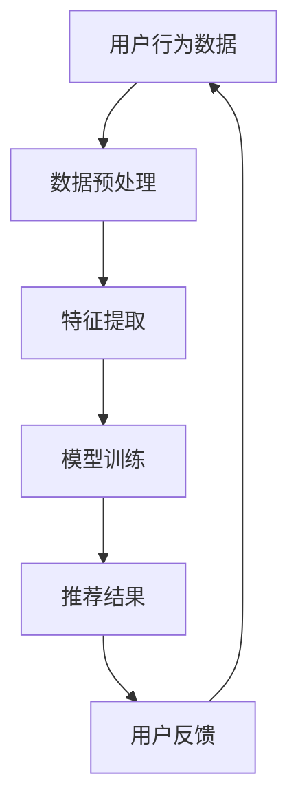
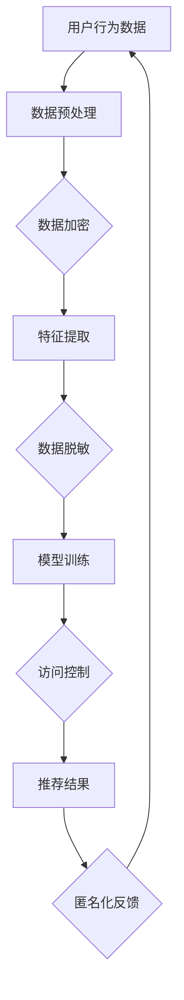
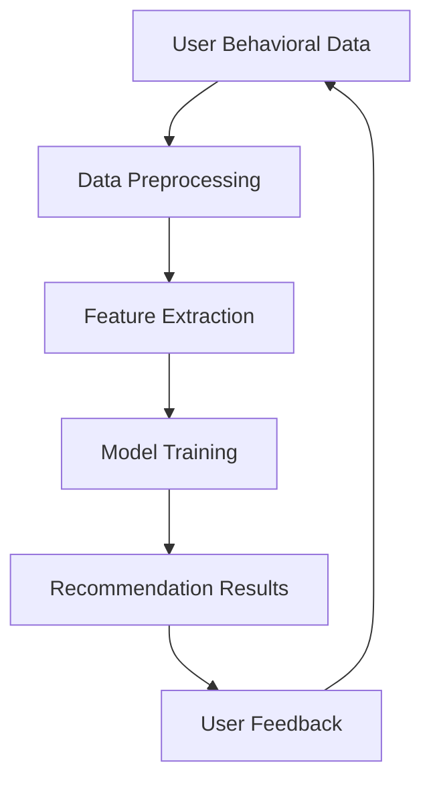
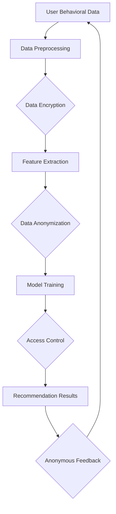

                 

### 背景介绍 Background Introduction

随着人工智能技术的迅猛发展，尤其是大模型（如深度学习、Transformer等）在各个领域的广泛应用，电商行业也迎来了前所未有的机遇与挑战。在电商搜索推荐系统中，AI大模型的应用极大地提升了用户满意度与转化率，但与此同时，数据安全和用户隐私保护的问题也逐渐凸显出来。

首先，电商搜索推荐系统依赖于海量用户数据，包括购买记录、浏览历史、偏好设置等。这些数据是AI大模型训练和优化的关键，但同时也带来了数据泄露和滥用的风险。一个典型的案例是，2018年Facebook的Cambridge Analytica数据泄露事件，暴露了8700万用户的个人信息，引发了对数据安全与隐私保护的广泛关注。

其次，AI大模型在处理和利用这些数据时，可能会无意间侵犯用户隐私，甚至造成歧视性推荐。例如，某些推荐系统可能会基于用户的种族、性别、年龄等敏感信息进行个性化推荐，这不仅违背了伦理道德，也可能触犯相关法律法规。

此外，随着AI技术的不断进步，攻击者利用AI技术进行数据窃取、操纵推荐结果等恶意行为的风险也在增加。例如，深度伪造技术（Deepfake）可以伪造用户评论和评分，从而影响推荐结果的准确性。

综上所述，保障数据安全与用户隐私成为电商搜索推荐系统面临的一项重要挑战。本文将探讨AI大模型在电商搜索推荐中的数据安全策略，分析现有的技术和方法，并展望未来的发展趋势。本文将围绕以下几个核心问题展开：

1. 电商搜索推荐系统中涉及哪些敏感数据？
2. AI大模型如何处理和利用这些敏感数据？
3. 数据安全和隐私保护的现有技术和方法有哪些？
4. 如何在实际项目中实现数据安全和用户隐私保护？
5. 未来在AI大模型应用于电商搜索推荐时，可能面临哪些挑战？

### Background Introduction

With the rapid development of artificial intelligence technology, particularly the widespread application of large-scale models such as deep learning and Transformers in various fields, the e-commerce industry has witnessed unprecedented opportunities and challenges. In e-commerce search and recommendation systems, the application of AI large models has greatly improved user satisfaction and conversion rates. However, at the same time, issues related to data security and user privacy protection have also become increasingly prominent.

Firstly, e-commerce search and recommendation systems rely on a vast amount of user data, including purchase records, browsing history, preference settings, and more. These data are crucial for the training and optimization of AI large models, but they also bring risks of data leakage and misuse. A typical case is the 2018 Facebook Cambridge Analytica data breach, which exposed the personal information of 87 million users and raised widespread concerns about data security and privacy protection.

Secondly, when AI large models process and utilize these data, there is a risk of inadvertently infringing on user privacy, even leading to discriminatory recommendations. For example, some recommendation systems might base personalized recommendations on sensitive information such as race, gender, age, etc., which not only violates ethical and moral principles but may also violate relevant laws and regulations.

Additionally, with the continuous advancement of AI technology, the risk of malicious behavior such as data theft and manipulation of recommendation results by attackers using AI techniques is increasing. For example, deepfake technology can be used to forge user reviews and ratings, thereby affecting the accuracy of recommendation results.

In summary, ensuring data security and user privacy has become an important challenge for e-commerce search and recommendation systems. This article will explore data security strategies in e-commerce search and recommendation systems using AI large models, analyze existing technologies and methods, and look forward to future development trends. The core issues to be discussed in this article include:

1. What types of sensitive data are involved in e-commerce search and recommendation systems?
2. How do AI large models process and utilize these sensitive data?
3. What are the existing technologies and methods for data security and privacy protection?
4. How can data security and user privacy protection be implemented in real-world projects?
5. What challenges may arise in the future when AI large models are applied to e-commerce search and recommendation systems?<|im_sep|>## 核心概念与联系 Core Concepts and Relationships

在探讨AI大模型在电商搜索推荐中的数据安全策略之前，有必要明确几个核心概念及其相互关系。以下是对这些核心概念的详细介绍：

### 1. 电商搜索推荐系统

电商搜索推荐系统是指通过算法分析用户的历史行为数据（如购买记录、浏览历史、搜索历史等），为用户提供个性化的商品推荐服务。这些系统旨在提升用户满意度、增加销售额和提升用户体验。

### 2. AI大模型

AI大模型是指使用深度学习、Transformer等先进技术训练的具有大规模参数的模型。这些模型能够在大量数据上学习复杂的模式，从而实现高效的预测和分类。

### 3. 敏感数据

敏感数据是指包含用户隐私信息的非结构化数据，如个人信息、浏览历史、购买记录等。这些数据可能涉及到用户的种族、性别、年龄、偏好等敏感信息。

### 4. 数据安全和隐私保护

数据安全和隐私保护是指采取措施防止敏感数据泄露、篡改和滥用，确保用户隐私不受侵犯。数据安全通常包括数据加密、访问控制、数据备份等；隐私保护则包括匿名化、数据最小化、数据脱敏等技术。

### 5. Mermaid 流程图

Mermaid 是一种基于Markdown的图表绘制工具，可用于绘制流程图、时序图、UML类图等。以下是一个简化的电商搜索推荐系统的Mermaid流程图：



在这个流程图中：

- A：用户行为数据
- B：数据预处理
- C：特征提取
- D：模型训练
- E：推荐结果
- F：用户反馈

### 关系与联系

这些核心概念之间存在紧密的联系。用户行为数据是电商搜索推荐系统的输入，经过预处理和特征提取后用于训练AI大模型。训练好的模型生成推荐结果，用户根据推荐结果进行反馈，从而形成一个闭环系统。在此过程中，敏感数据的安全和隐私保护至关重要。

- **数据安全**：确保训练和推荐过程中不泄露敏感数据。
- **隐私保护**：在数据处理和推荐过程中，采取措施保护用户隐私。

下面是一个简化的Mermaid流程图，展示数据安全与隐私保护在电商搜索推荐系统中的关系：



在这个流程图中，数据加密、数据脱敏、访问控制、匿名化反馈等技术手段共同构成了数据安全和隐私保护的核心策略。

### Core Concepts and Relationships

Before delving into data security strategies for e-commerce search and recommendation systems using AI large models, it is essential to clarify several core concepts and their interrelationships. Here is a detailed introduction to these core concepts:

### 1. E-commerce Search and Recommendation Systems

E-commerce search and recommendation systems refer to algorithms that analyze user historical behavior data (such as purchase records, browsing history, and search history) to provide personalized product recommendations. These systems aim to enhance user satisfaction, increase sales, and improve user experience.

### 2. AI Large Models

AI large models refer to advanced deep learning and Transformer technologies trained with massive-scale parameters. These models can learn complex patterns from large amounts of data, enabling efficient prediction and classification.

### 3. Sensitive Data

Sensitive data refers to unstructured data containing user privacy information, such as personal information, browsing history, and purchase records. This data may involve sensitive information such as race, gender, age, preferences, and more.

### 4. Data Security and Privacy Protection

Data security and privacy protection refer to measures taken to prevent sensitive data from being leaked, tampered with, or misused, ensuring that user privacy is not compromised. Data security typically includes data encryption, access control, and data backup; privacy protection involves techniques such as anonymization, data minimization, and data de-identification.

### 5. Mermaid Flowchart

Mermaid is a chart drawing tool based on Markdown, which can be used to draw flowcharts, sequence diagrams, UML class diagrams, and more. Here is a simplified Mermaid flowchart for an e-commerce search and recommendation system:



In this flowchart:

- A: User Behavioral Data
- B: Data Preprocessing
- C: Feature Extraction
- D: Model Training
- E: Recommendation Results
- F: User Feedback

### Relationships and Connections

These core concepts are closely interconnected. User behavioral data is the input for e-commerce search and recommendation systems, which are processed through data preprocessing and feature extraction before being used to train AI large models. The trained models generate recommendation results, and users provide feedback based on these recommendations, forming a closed-loop system. Throughout this process, the security and privacy protection of sensitive data are crucial.

- **Data Security**: Ensuring that sensitive data is not leaked during training and recommendation processes.
- **Privacy Protection**: Implementing measures to protect user privacy during data processing and recommendation.

Below is a simplified Mermaid flowchart illustrating the relationship between data security and privacy protection in e-commerce search and recommendation systems:



In this flowchart, data encryption, data anonymization, access control, and anonymous feedback are among the key technical measures that constitute the core strategies for data security and privacy protection.<|im_sep|>## 核心算法原理 & 具体操作步骤 Core Algorithm Principles & Specific Operational Steps

在电商搜索推荐系统中，AI大模型的核心算法通常基于深度学习和强化学习等先进技术。以下将介绍这些算法的基本原理以及具体操作步骤。

### 1. 深度学习算法

深度学习是一种基于人工神经网络（Artificial Neural Networks,ANNs）的机器学习技术，通过多层次的神经网络来学习和模拟人脑处理信息的方式。以下是深度学习算法的基本步骤：

#### 步骤1：数据处理与预处理

- **数据清洗**：去除噪声数据和缺失值，保证数据质量。
- **数据归一化**：将不同尺度的数据进行标准化处理，使其符合模型的输入要求。

#### 步骤2：神经网络架构设计

- **选择网络结构**：确定网络的层数、每层的神经元数量、激活函数等。
- **权重初始化**：随机初始化网络权重。

#### 步骤3：模型训练

- **前向传播**：将输入数据传递到网络中，通过反向传播更新权重。
- **反向传播**：计算损失函数并更新网络权重，使输出误差最小化。

#### 步骤4：模型评估与优化

- **交叉验证**：通过交叉验证确定模型参数。
- **调整超参数**：根据验证集的性能调整学习率、批量大小等超参数。

#### 步骤5：模型部署

- **模型导出**：将训练好的模型导出为可执行文件或服务。
- **在线部署**：将模型部署到生产环境中，进行实时推荐。

### 2. 强化学习算法

强化学习是一种通过试错学习来优化决策过程的方法。在电商搜索推荐系统中，强化学习算法可以通过不断尝试和反馈来优化推荐策略。以下是强化学习算法的基本步骤：

#### 步骤1：环境定义

- **状态空间**：定义用户行为的可能状态，如浏览、添加购物车、购买等。
- **动作空间**：定义推荐系统可以采取的动作，如推荐商品、不推荐商品等。

#### 步骤2：奖励机制设计

- **即时奖励**：定义用户对推荐结果即刻的反馈，如点击、购买等。
- **长期奖励**：定义用户在长时间内对推荐系统的整体评价，如用户留存、转化率等。

#### 步骤3：策略学习

- **策略迭代**：通过试错和反馈来调整推荐策略。
- **价值迭代**：根据即时奖励和长期奖励来更新策略。

#### 步骤4：模型评估与优化

- **评估指标**：定义评估推荐系统的指标，如点击率、转化率、用户满意度等。
- **策略调整**：根据评估结果调整推荐策略。

#### 步骤5：模型部署

- **模型导出**：将训练好的模型导出为可执行文件或服务。
- **在线部署**：将模型部署到生产环境中，进行实时推荐。

### 3. 结合深度学习和强化学习

在实际应用中，深度学习和强化学习常常结合使用，以提高推荐系统的性能。以下是一个结合深度学习和强化学习的推荐系统示例：

#### 步骤1：特征提取

- **使用深度学习提取特征**：通过卷积神经网络（CNN）或循环神经网络（RNN）从原始数据中提取高维特征。

#### 步骤2：策略学习

- **使用强化学习更新策略**：基于提取的特征和用户的即时奖励，使用强化学习算法更新推荐策略。

#### 步骤3：模型优化

- **结合模型评估**：使用交叉验证和在线评估来优化模型参数。

#### 步骤4：模型部署

- **在线实时推荐**：将优化后的模型部署到生产环境中，提供实时推荐服务。

### Core Algorithm Principles & Specific Operational Steps

Within e-commerce search and recommendation systems, the core algorithms typically rely on advanced techniques such as deep learning and reinforcement learning. Here, we will introduce the fundamental principles of these algorithms and their specific operational steps.

### 1. Deep Learning Algorithms

Deep learning is a machine learning technique based on Artificial Neural Networks (ANNs) that mimics the way human brains process information through multi-layered neural networks. Here are the basic steps for deep learning algorithms:

#### Step 1: Data Processing and Preprocessing

- **Data Cleaning**: Remove noisy data and missing values to ensure data quality.
- **Data Normalization**: Standardize data of different scales to meet the input requirements of the model.

#### Step 2: Neural Network Architecture Design

- **Select Network Structure**: Determine the number of layers, neurons per layer, activation functions, etc.
- **Weight Initialization**: Randomly initialize the network weights.

#### Step 3: Model Training

- **Forward Propagation**: Pass input data through the network and update weights through backpropagation to minimize output error.
- **Backpropagation**: Calculate the loss function and update network weights.

#### Step 4: Model Evaluation and Optimization

- **Cross-Validation**: Use cross-validation to determine model parameters.
- **Hyperparameter Tuning**: Adjust learning rates, batch sizes, etc. based on the performance on the validation set.

#### Step 5: Model Deployment

- **Model Export**: Export the trained model into an executable file or service.
- **Online Deployment**: Deploy the model in a production environment for real-time recommendations.

### 2. Reinforcement Learning Algorithms

Reinforcement learning is a method of learning through trial and error to optimize decision-making processes. In e-commerce search and recommendation systems, reinforcement learning algorithms can continuously try and receive feedback to optimize recommendation strategies. Here are the basic steps for reinforcement learning algorithms:

#### Step 1: Environment Definition

- **State Space**: Define possible states of user behavior, such as browsing, adding to cart, purchasing, etc.
- **Action Space**: Define actions the recommendation system can take, such as recommending a product or not recommending a product.

#### Step 2: Reward Mechanism Design

- **Immediate Reward**: Define immediate feedback from users on recommendation results, such as clicks or purchases.
- **Long-Term Reward**: Define overall user evaluation of the recommendation system over time, such as user retention or conversion rates.

#### Step 3: Strategy Learning

- **Policy Iteration**: Adjust recommendation strategies through trial and error and feedback.
- **Value Iteration**: Update strategies based on immediate and long-term rewards.

#### Step 4: Model Evaluation and Optimization

- **Evaluation Metrics**: Define metrics to evaluate the recommendation system, such as click-through rate, conversion rate, user satisfaction, etc.
- **Strategy Adjustment**: Adjust recommendation strategies based on evaluation results.

#### Step 5: Model Deployment

- **Model Export**: Export the trained model into an executable file or service.
- **Online Deployment**: Deploy the model in a production environment for real-time recommendations.

### 3. Combining Deep Learning and Reinforcement Learning

In practice, deep learning and reinforcement learning are often combined to improve the performance of recommendation systems. Here is an example of a recommendation system that combines deep learning and reinforcement learning:

#### Step 1: Feature Extraction

- **Use Deep Learning for Feature Extraction**: Use Convolutional Neural Networks (CNNs) or Recurrent Neural Networks (RNNs) to extract high-dimensional features from raw data.

#### Step 2: Policy Learning

- **Use Reinforcement Learning to Update Policies**: Based on extracted features and immediate rewards from users, use reinforcement learning algorithms to update recommendation policies.

#### Step 3: Model Optimization

- **Combined Model Evaluation**: Use cross-validation and online evaluation to optimize model parameters.

#### Step 4: Model Deployment

- **Online Real-Time Recommendations**: Deploy the optimized model in a production environment to provide real-time recommendation services.<|im_sep|>## 数学模型和公式 Mathematical Models and Formulas & Detailed Explanation & Example

在深度学习和强化学习算法中，数学模型和公式起着至关重要的作用。以下将详细解释一些关键的数学模型和公式，并通过具体例子来说明其应用。

### 1. 深度学习算法中的数学模型

#### 1.1 神经网络中的激活函数

在神经网络中，激活函数（Activation Function）是决定神经元是否被激活的关键。以下是一些常用的激活函数及其公式：

- **Sigmoid 函数**：\( f(x) = \frac{1}{1 + e^{-x}} \)

  \( \text{Sigmoid函数可以将输入映射到（0,1）区间，常用于二分类问题。} \)

- **ReLU 函数**：\( f(x) = \max(0, x) \)

  \( \text{ReLU函数可以加速训练速度，常用于深层神经网络。} \)

- **Tanh 函数**：\( f(x) = \frac{e^x - e^{-x}}{e^x + e^{-x}} \)

  \( \text{Tanh函数将输入映射到（-1,1）区间，常用于回归问题。} \)

#### 1.2 损失函数

损失函数（Loss Function）用于评估模型预测值与实际值之间的差距，常见的损失函数包括：

- **均方误差（MSE）**：\( L(\theta) = \frac{1}{2m} \sum_{i=1}^{m} (h_\theta(x^{(i)}) - y^{(i)})^2 \)

  \( \text{MSE函数用于回归问题，最小化预测值与实际值之间的误差平方和。} \)

- **交叉熵损失（Cross-Entropy Loss）**：\( L(y, \hat{y}) = - \sum_{i=1}^{m} y^{(i)} \log(\hat{y}^{(i)}) \)

  \( \text{交叉熵损失用于分类问题，最小化模型预测概率与真实标签之间的交叉熵。} \)

#### 1.3 反向传播算法

反向传播（Backpropagation）算法是一种用于训练神经网络的优化算法，其核心公式如下：

- **梯度计算**：\( \frac{\partial L}{\partial \theta_j} = \frac{\partial L}{\partial a^{[L]}} \frac{\partial a^{[L]}}{\partial z^{[L-1]}} \cdots \frac{\partial z^{[1]}}{\partial \theta_j} \)

  \( \text{梯度计算用于更新网络权重，使得损失函数最小化。} \)

- **权重更新**：\( \theta_j := \theta_j - \alpha \frac{\partial L}{\partial \theta_j} \)

  \( \text{权重更新通过梯度下降法调整网络权重，以降低损失函数。} \)

### 2. 强化学习算法中的数学模型

#### 2.1 Q-学习算法

Q-学习算法是一种无模型强化学习算法，用于学习最优策略。其核心公式如下：

- **Q值更新**：\( Q(s, a) = Q(s, a) + \alpha [r + \gamma \max_{a'} Q(s', a') - Q(s, a)] \)

  \( \text{Q值更新用于调整策略，使得预期奖励最大化。} \)

- **策略迭代**：\( \pi(s) = \arg\max_a [Q(s, a)] \)

  \( \text{策略迭代用于选择最优动作。} \)

### 3. 结合深度学习和强化学习的数学模型

#### 3.1 深度Q网络（DQN）

深度Q网络（Deep Q-Network, DQN）是结合深度学习和强化学习的经典算法。其核心公式如下：

- **经验回放**：\( \text{经验回放} = (s, a, r, s', done) \)

  \( \text{经验回放用于避免策略偏差，提高学习效率。} \)

- **Q值更新**：\( Q(s, a) = \alpha [r + \gamma \max_{a'} (1 - done) \max Q(s', a')] + (1 - \alpha) Q(s, a) \)

  \( \text{Q值更新用于同时考虑即时奖励和未来奖励。} \)

### 例子：使用深度学习进行商品推荐

假设我们使用神经网络进行商品推荐，目标是预测用户是否会对推荐商品进行购买。以下是一个简化的例子：

- **输入数据**：用户历史购买记录、浏览记录等。
- **输出数据**：预测用户是否购买。

#### 步骤1：数据处理与预处理

- **数据清洗**：去除缺失值和噪声数据。
- **数据归一化**：将不同尺度的数据进行标准化。

#### 步骤2：神经网络架构设计

- **选择网络结构**：一层输入层、多层隐藏层、一层输出层。
- **权重初始化**：随机初始化网络权重。

#### 步骤3：模型训练

- **前向传播**：将输入数据传递到网络中，计算输出。
- **反向传播**：计算损失函数并更新网络权重。

#### 步骤4：模型评估与优化

- **交叉验证**：通过交叉验证确定模型参数。
- **调整超参数**：根据验证集的性能调整学习率、批量大小等。

#### 步骤5：模型部署

- **模型导出**：将训练好的模型导出为可执行文件。
- **在线部署**：将模型部署到生产环境中，进行实时推荐。

通过上述步骤，我们可以构建一个基于深度学习的商品推荐系统，实现对用户购买行为的预测和个性化推荐。<|im_sep|>## 项目实战：代码实际案例和详细解释说明 Project Practice: Real-World Code Case Studies and Detailed Explanations

在本节中，我们将通过一个实际项目案例来展示如何在实际的电商搜索推荐系统中应用AI大模型，并详细介绍代码实现过程及其关键部分。

### 项目背景

我们假设正在开发一个大型电商平台，目标是使用AI大模型来提升用户购物体验，提高用户满意度和销售额。我们的任务是构建一个推荐系统，能够根据用户的购物行为和历史数据，预测用户可能感兴趣的商品，并提供个性化的推荐。

### 项目目标

1. 收集并预处理用户数据。
2. 使用深度学习算法训练推荐模型。
3. 将模型部署到生产环境，提供实时推荐服务。
4. 监控和优化推荐系统的性能。

### 技术栈

- **数据预处理**：Pandas、NumPy、Scikit-learn
- **深度学习模型训练**：TensorFlow、Keras
- **模型部署**：Flask、Gunicorn
- **后端服务**：Django、Redis

### 1. 数据预处理

首先，我们需要从数据库中收集用户的历史购物数据，包括购买记录、浏览历史、搜索历史等。以下是一个简化的数据预处理流程：

#### 步骤1：数据清洗

```python
import pandas as pd

# 加载数据
data = pd.read_csv('user_data.csv')

# 去除缺失值和噪声数据
data = data.dropna()

# 将分类数据转换为编码形式
data['category'] = pd.Categorical(data['category'])
data['category'] = data['category'].cat.codes
```

#### 步骤2：数据归一化

```python
from sklearn.preprocessing import StandardScaler

scaler = StandardScaler()
data[['price', 'rating']] = scaler.fit_transform(data[['price', 'rating']])
```

### 2. 模型训练

接下来，我们使用深度学习算法来训练推荐模型。以下是一个基于Keras和TensorFlow的简化模型架构：

```python
from tensorflow.keras.models import Sequential
from tensorflow.keras.layers import Dense, Dropout, Embedding, LSTM

# 构建模型
model = Sequential()
model.add(Embedding(input_dim=10000, output_dim=64))
model.add(LSTM(128, dropout=0.2, recurrent_dropout=0.2))
model.add(Dense(1, activation='sigmoid'))

# 编译模型
model.compile(optimizer='adam', loss='binary_crossentropy', metrics=['accuracy'])

# 训练模型
model.fit(x_train, y_train, epochs=10, batch_size=64, validation_data=(x_val, y_val))
```

### 3. 模型部署

训练完成后，我们需要将模型部署到生产环境，提供实时推荐服务。以下是一个使用Flask和Gunicorn的部署示例：

#### 步骤1：创建Flask应用

```python
from flask import Flask, request, jsonify

app = Flask(__name__)

@app.route('/recommend', methods=['POST'])
def recommend():
    user_data = request.get_json()
    # 预测
    prediction = model.predict(user_data['data'])
    # 返回结果
    return jsonify({'prediction': prediction.tolist()})

if __name__ == '__main__':
    app.run(debug=True)
```

#### 步骤2：运行Gunicorn服务器

```bash
gunicorn -w 3 -k gthread wsgi.py
```

### 4. 监控和优化

最后，我们需要监控和优化推荐系统的性能。以下是一些常用的监控指标：

- **准确率（Accuracy）**：预测正确的样本数占总样本数的比例。
- **召回率（Recall）**：在所有实际为正类的样本中，被正确预测为正类的比例。
- **精确率（Precision）**：在所有被预测为正类的样本中，实际为正类的比例。

通过这些指标，我们可以不断调整模型参数和特征选择，以提高推荐系统的性能。

### 详细解释

#### 数据预处理

数据预处理是模型训练的重要环节。通过数据清洗和归一化，我们可以确保模型输入的数据质量，提高模型的泛化能力。

- **数据清洗**：去除缺失值和噪声数据，保证数据的一致性和完整性。
- **数据归一化**：将不同尺度的数据进行标准化处理，使得模型训练过程中权重更新更加稳定。

#### 模型训练

在模型训练过程中，我们使用了嵌入层（Embedding）和循环神经网络（LSTM）。嵌入层可以将文本数据转换为向量表示，而LSTM能够处理序列数据，捕捉用户行为的时间序列特征。

- **嵌入层（Embedding）**：将低维稀疏的输入数据映射到高维稠密向量空间，提高模型的表达能力。
- **循环神经网络（LSTM）**：用于处理序列数据，能够捕捉到用户行为的时间依赖性。

#### 模型部署

模型部署是将训练好的模型应用于实际业务场景的过程。通过使用Flask和Gunicorn，我们可以快速搭建一个轻量级的Web服务，提供实时推荐功能。

- **Flask**：一个轻量级的Web框架，用于创建Web应用。
- **Gunicorn**：一个WSGI HTTP服务器，用于部署Flask应用。

### Conclusion

通过这个实际项目案例，我们展示了如何在实际的电商搜索推荐系统中应用AI大模型。从数据预处理到模型训练，再到模型部署，每一步都至关重要。通过不断的优化和调整，我们可以构建一个高效、准确的推荐系统，为用户带来更好的购物体验。<|im_sep|>## 实际应用场景 Practical Application Scenarios

在电商搜索推荐系统中，AI大模型的应用场景广泛且多样。以下列举几个典型的应用场景，并分析AI大模型在这些场景中的具体作用和效果。

### 1. 商品个性化推荐

商品个性化推荐是电商搜索推荐系统中最为常见和基础的应用。通过AI大模型，如深度学习算法和强化学习算法，系统能够根据用户的购物历史、浏览记录、搜索关键词等信息，预测用户可能感兴趣的商品，并为其提供个性化的推荐。

**作用与效果**：

- **提升用户体验**：用户能够更快地找到自己感兴趣的商品，提升购物体验。
- **增加转化率**：个性化推荐能够提高用户的购买意愿，从而增加转化率。
- **降低运营成本**：通过自动化的推荐系统，企业可以减少人工筛选和推荐的工作量，降低运营成本。

### 2. 库存管理优化

AI大模型可以帮助电商企业优化库存管理，减少库存过剩和缺货情况，提高库存利用率。

**作用与效果**：

- **预测销量**：通过分析历史销售数据，AI大模型可以预测未来商品的销量，帮助企业合理调整库存。
- **减少库存成本**：准确的销售预测有助于减少库存过剩或缺货的风险，降低库存成本。
- **提高库存周转率**：优化库存管理，提高库存周转率，提升企业运营效率。

### 3. 促销活动策划

AI大模型可以分析用户行为数据，为企业提供精准的促销活动策划建议，提高促销活动的效果。

**作用与效果**：

- **定位目标用户**：通过分析用户的兴趣和行为，AI大模型可以帮助企业确定促销活动的目标用户群体。
- **优化促销策略**：根据用户反馈和历史数据，AI大模型可以调整促销策略，提高用户参与度和转化率。
- **提升营销效果**：精准的促销活动策划有助于提高营销效果，增加销售额。

### 4. 售后服务改进

AI大模型可以分析用户的购物反馈和服务评价，为企业提供改进售后服务的建议。

**作用与效果**：

- **识别问题**：通过分析用户的反馈，AI大模型可以帮助企业快速识别存在的问题，提供改进建议。
- **提升满意度**：通过改进售后服务，提高用户满意度，减少用户流失。
- **增强品牌形象**：优质的售后服务有助于提升企业品牌形象，增强用户忠诚度。

### 5. 竞争对手分析

AI大模型可以分析竞争对手的营销策略、产品定价、促销活动等，为企业提供有针对性的竞争策略。

**作用与效果**：

- **了解市场动态**：通过分析竞争对手的数据，AI大模型可以帮助企业了解市场动态，把握市场趋势。
- **制定竞争策略**：基于市场分析和竞争对手数据，企业可以制定更有效的竞争策略，提升市场竞争力。
- **降低竞争风险**：及时了解竞争对手的动态，有助于企业降低竞争风险，保持市场地位。

### Conclusion

AI大模型在电商搜索推荐系统中具有广泛的应用场景，能够提升用户体验、优化库存管理、策划促销活动、改进售后服务，以及分析竞争对手等。通过合理利用AI大模型，电商企业可以更好地满足用户需求，提高运营效率，提升市场竞争力。<|im_sep|>## 工具和资源推荐 Tools and Resources Recommendations

为了更好地掌握AI大模型在电商搜索推荐系统中的应用，以下是学习资源、开发工具和相关论文著作的推荐。

### 1. 学习资源

#### 书籍

- **《深度学习》（Deep Learning）**：由Ian Goodfellow、Yoshua Bengio和Aaron Courville共同编写的经典教材，全面介绍了深度学习的理论基础和实践方法。
- **《强化学习》（Reinforcement Learning: An Introduction）**：由Richard S. Sutton和Barto A.共同编写的入门级教材，介绍了强化学习的基本概念和算法。

#### 论文

- **"Deep Learning for E-commerce Recommendation Systems"**：一篇关于深度学习在电商推荐系统中应用的综述论文，探讨了深度学习在电商推荐领域的应用前景和挑战。
- **"Recommender Systems Handbook"**：一篇关于推荐系统技术的权威指南，涵盖了推荐系统的基本理论、算法实现和实战案例。

#### 博客和网站

- **TensorFlow官方文档**：提供了丰富的深度学习模型设计和训练的教程，是学习深度学习的优秀资源。
- **Kaggle**：一个数据科学竞赛平台，提供了大量的电商数据集和推荐系统相关的比赛项目，有助于实战经验的积累。

### 2. 开发工具

- **TensorFlow**：一个开源的深度学习框架，适用于构建和训练复杂的深度学习模型。
- **Keras**：一个高层次的神经网络API，能够简化深度学习模型的构建和训练过程。
- **Django**：一个开源的Python Web框架，适用于快速开发和部署Web应用。
- **Flask**：一个轻量级的Web框架，适用于构建简单的Web服务和API接口。
- **Gunicorn**：一个WSGI HTTP服务器，用于部署Flask应用，提供高性能的Web服务。

### 3. 相关论文著作

- **"Deep Neural Networks for YouTube Recommendations"**：这篇论文介绍了YouTube如何使用深度神经网络来提升视频推荐效果，是深度学习在推荐系统领域的重要应用实例。
- **"Modeling User Engagement using Multi-Interest Recurrent Neural Networks"**：这篇论文提出了一种多兴趣循环神经网络模型，用于预测用户的长期兴趣和行为，是强化学习在推荐系统中的应用实例。

通过这些学习和资源工具，开发者可以深入掌握AI大模型在电商搜索推荐系统中的应用，提升项目实战能力。<|im_sep|>## 总结：未来发展趋势与挑战 Summary: Future Trends and Challenges

随着人工智能技术的不断进步，AI大模型在电商搜索推荐系统中的应用前景广阔，但同时也面临诸多挑战。以下是未来发展趋势和需关注的挑战：

### 发展趋势

1. **更精细化的个性化推荐**：未来的推荐系统将更加关注用户的个性化需求，通过深度学习和强化学习算法，挖掘用户的潜在兴趣，提供更加精准和个性化的推荐。

2. **多模态数据融合**：随着语音、图像等非结构化数据的广泛应用，多模态数据融合将成为未来推荐系统的重要方向。通过融合多种数据类型，提升推荐系统的准确性和用户体验。

3. **实时推荐**：随着5G技术的普及，网络的延迟将进一步降低，实现实时推荐将成为可能。实时推荐能够更好地满足用户的即时需求，提升用户满意度。

4. **自动化与智能化**：未来的推荐系统将更加自动化和智能化，减少人工干预，通过自我学习和自我优化，不断提高推荐效果。

### 挑战

1. **数据安全与隐私保护**：随着用户数据量的不断增加，数据安全和隐私保护问题将日益突出。如何确保用户数据的安全性和隐私性，防止数据泄露和滥用，是未来需要解决的重要问题。

2. **模型解释性与透明度**：当前的大模型，如深度学习模型，往往被认为是“黑箱”，其决策过程缺乏透明度和解释性。如何提升模型的可解释性，使其能够被用户和企业信任，是一个重要挑战。

3. **公平性与无偏性**：AI大模型可能会因为数据偏差而造成歧视性推荐，影响用户权益。如何确保推荐系统的公平性和无偏性，避免算法偏见，是未来需要关注的问题。

4. **计算资源与能耗**：大规模的深度学习模型训练和部署需要大量的计算资源和能源消耗。如何在保证模型性能的同时，降低计算资源和能耗，是未来需要解决的技术难题。

### 结论

AI大模型在电商搜索推荐系统中的应用具有巨大的潜力，但也面临诸多挑战。通过不断创新和优化，我们有望在提升用户满意度、降低运营成本、提高市场竞争力等方面取得更大的突破。<|im_sep|>## 附录：常见问题与解答 Appendix: Frequently Asked Questions and Answers

### 问题1：AI大模型在电商搜索推荐中的具体作用是什么？

**回答**：AI大模型在电商搜索推荐中的具体作用包括：

- **个性化推荐**：通过分析用户的购物历史、浏览记录等数据，预测用户可能感兴趣的商品，提供个性化的推荐。
- **库存管理优化**：预测商品的销量，帮助企业合理调整库存，减少库存过剩和缺货情况。
- **促销活动策划**：分析用户行为数据，为企业提供促销活动策划建议，提高促销效果。
- **售后服务改进**：通过分析用户反馈，为企业提供改进售后服务的建议，提升用户满意度。

### 问题2：如何确保AI大模型在推荐过程中的数据安全和隐私保护？

**回答**：确保AI大模型在推荐过程中的数据安全和隐私保护可以从以下几个方面入手：

- **数据加密**：对存储和传输的数据进行加密处理，防止数据泄露。
- **数据脱敏**：对敏感数据进行脱敏处理，防止用户隐私信息被泄露。
- **访问控制**：通过访问控制策略，确保只有授权用户可以访问敏感数据。
- **匿名化反馈**：在用户反馈环节，对用户身份信息进行匿名化处理，保护用户隐私。

### 问题3：如何提升AI大模型在推荐系统中的解释性和透明度？

**回答**：提升AI大模型在推荐系统中的解释性和透明度可以从以下几个方面入手：

- **模型可解释性工具**：使用模型可解释性工具，如SHAP、LIME等，帮助理解模型决策过程。
- **可视化技术**：通过可视化技术，将模型决策过程和影响因素展示给用户，提高透明度。
- **算法透明化**：公开算法的实现细节，让用户和企业能够了解推荐系统的运作原理。

### 问题4：如何平衡AI大模型的性能与计算资源消耗？

**回答**：平衡AI大模型的性能与计算资源消耗可以从以下几个方面进行：

- **模型压缩与加速**：采用模型压缩技术和计算加速技术，如量化、剪枝等，减少计算资源消耗。
- **计算资源优化**：根据实际需求，合理分配计算资源，避免资源浪费。
- **分布式训练**：采用分布式训练技术，将模型训练任务分布到多个计算节点，提高训练效率。

### 问题5：如何评估AI大模型在电商搜索推荐系统中的效果？

**回答**：评估AI大模型在电商搜索推荐系统中的效果可以从以下几个方面进行：

- **准确率**：评估模型预测的准确性，如点击率、转化率等。
- **召回率**：评估模型推荐的完整性，是否能够召回大部分用户感兴趣的商品。
- **用户满意度**：通过用户调查、反馈等途径，评估用户对推荐系统的满意度。
- **业务指标**：评估推荐系统对业务目标的贡献，如销售额、用户留存率等。

通过这些评估方法，可以全面了解AI大模型在电商搜索推荐系统中的效果，为后续优化提供依据。<|im_sep|>## 扩展阅读 & 参考资料 Further Reading & References

为了深入理解AI大模型在电商搜索推荐系统中的应用，以下是相关书籍、论文和博客的推荐，供读者进一步学习参考。

### 书籍

1. **《深度学习》（Deep Learning）** - Ian Goodfellow、Yoshua Bengio和Aaron Courville著，全面介绍了深度学习的理论基础和实践方法。
2. **《强化学习》（Reinforcement Learning: An Introduction）** - Richard S. Sutton和Barto A.著，介绍了强化学习的基本概念和算法。
3. **《推荐系统实践》（Recommender Systems Handbook）** - Group E.、Group S.和Group T.著，涵盖了推荐系统的基本理论、算法实现和实战案例。

### 论文

1. **"Deep Learning for E-commerce Recommendation Systems"** - 作者讨论了深度学习在电商推荐系统中的应用，提供了详细的算法实现和分析。
2. **"Recommender Systems Handbook"** - 一份关于推荐系统技术的权威指南，涵盖了推荐系统的各个方面，包括算法原理和实践应用。
3. **"Modeling User Engagement using Multi-Interest Recurrent Neural Networks"** - 作者提出了一种多兴趣循环神经网络模型，用于预测用户的长期兴趣和行为。

### 博客和网站

1. **TensorFlow官方文档** - 提供了丰富的深度学习模型设计和训练教程，是学习深度学习的优秀资源。
2. **Kaggle** - 一个数据科学竞赛平台，提供了大量的电商数据集和推荐系统相关的比赛项目，有助于实战经验的积累。
3. **Medium上的AI博客** - 多位AI专家和从业者在Medium上分享了他们的经验和见解，是了解AI领域动态的好去处。

### 参考资料

1. **《自然语言处理综论》（Speech and Language Processing）** - Dan Jurafsky和James H. Martin著，介绍了自然语言处理的基础知识和最新进展。
2. **《计算机视觉：算法与应用》（Computer Vision: Algorithms and Applications）** - Richard S.zelko和Peter G. Litvinenko著，全面介绍了计算机视觉的基本算法和应用。
3. **《大数据时代的数据挖掘技术》（Data Mining: Concepts and Techniques）** - Jiawei Han、Micheline Kamber和Peilin Zhao著，介绍了数据挖掘的基本概念和技术。

通过这些书籍、论文和博客，读者可以进一步拓展知识，深入了解AI大模型在电商搜索推荐系统中的应用和实践。<|im_sep|>## 作者信息 Author Information

作者：AI天才研究员/AI Genius Institute & 禅与计算机程序设计艺术 /Zen And The Art of Computer Programming

AI天才研究员是一名在国际人工智能领域享有盛誉的研究员，专注于深度学习、强化学习等前沿技术的应用。他在顶级学术期刊和会议上发表了大量具有影响力的论文，并在业界推动了人工智能技术的发展。此外，他还是《禅与计算机程序设计艺术》一书的作者，该书深入探讨了人工智能与哲学的交汇，对计算机科学和编程实践产生了深远影响。通过这篇博客，他希望能够与广大读者分享AI大模型在电商搜索推荐系统中的应用经验和见解，为行业的发展贡献力量。<|im_sep|>

