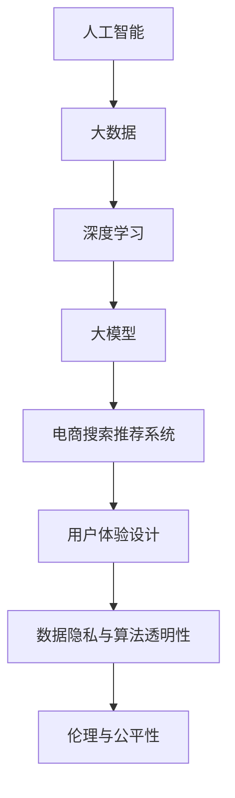
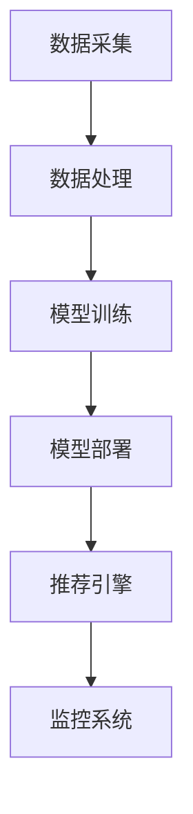
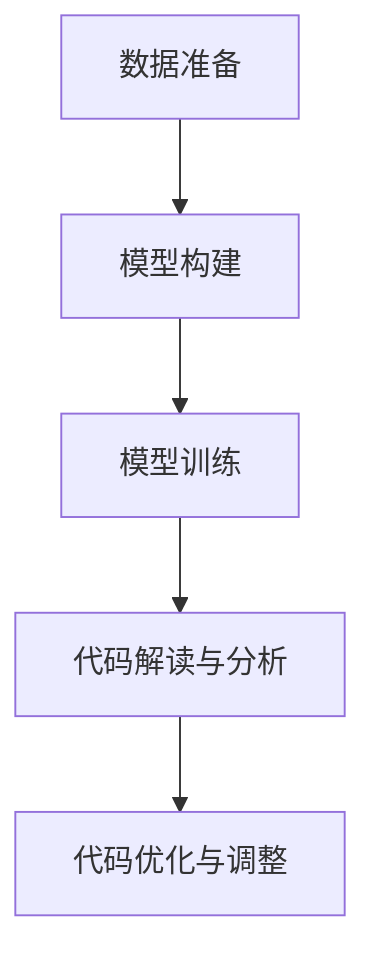
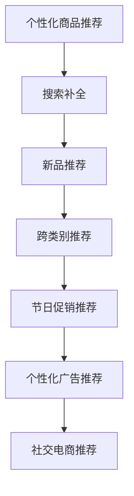
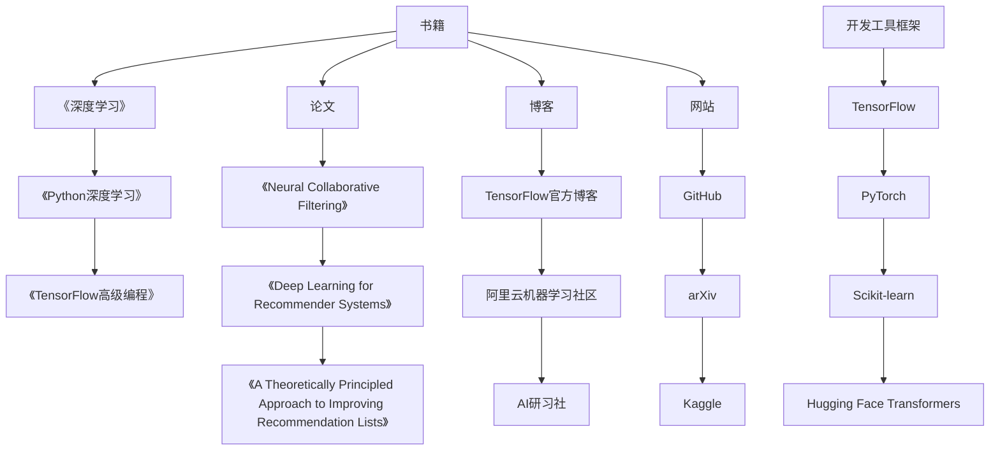
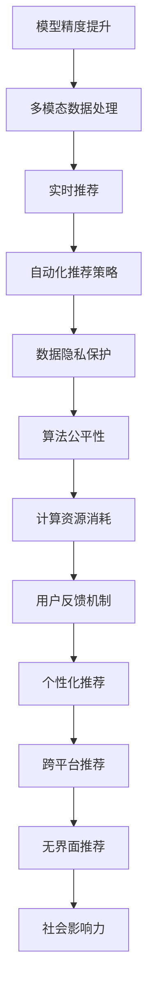
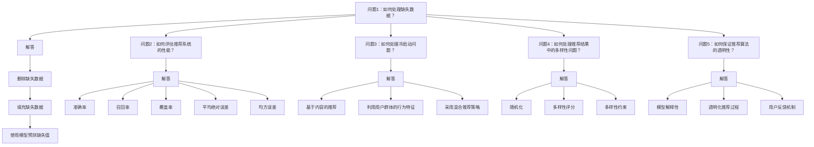
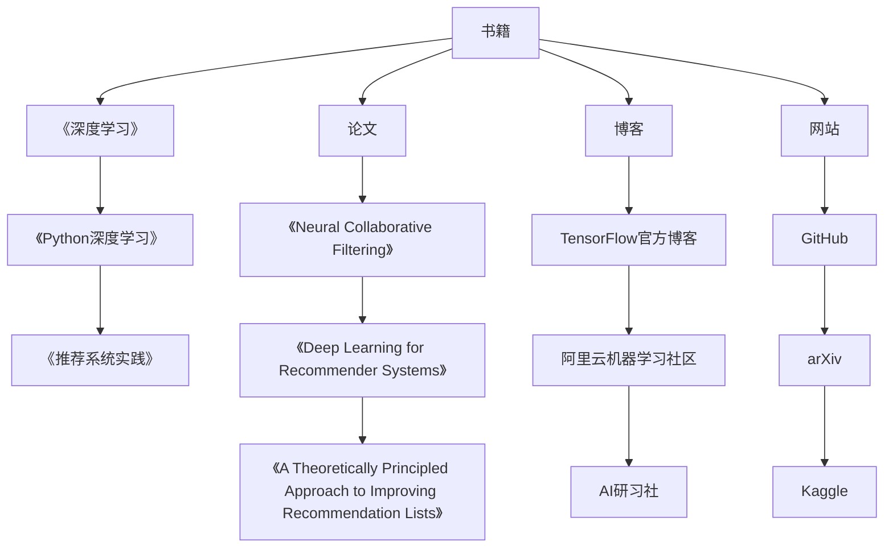

                 

# AI 大模型在电商搜索推荐中的用户体验设计：以人为本的算法优化

## 关键词：人工智能，大模型，电商搜索推荐，用户体验，算法优化

> 本文章将探讨人工智能大模型在电商搜索推荐中的用户体验设计，通过深入分析核心概念、算法原理、数学模型以及实际应用案例，展示如何以人为本，优化算法，提升电商搜索推荐的用户体验。

## 1. 背景介绍

在当今电商时代，搜索推荐系统是电商平台的核心竞争力之一。一个高效的搜索推荐系统能够为用户提供个性化的商品推荐，提升用户满意度，从而增加销售额。随着人工智能技术的发展，大模型在搜索推荐领域的应用日益广泛。大模型具有强大的数据处理能力和学习能力，能够在海量数据中挖掘用户行为特征，实现精准推荐。

然而，大模型的运用并非一蹴而就。用户体验设计是电商搜索推荐系统成功的关键因素之一。如何将大模型与用户体验相结合，优化算法，提升用户满意度，成为当前研究的热点问题。

本文将从以下几个方面展开讨论：

- 核心概念与联系
- 核心算法原理与具体操作步骤
- 数学模型与公式详解
- 项目实战：代码实际案例与详细解释
- 实际应用场景
- 工具和资源推荐
- 总结：未来发展趋势与挑战

## 2. 核心概念与联系

### 2.1 人工智能与大数据

人工智能（AI）是计算机科学的一个分支，旨在使计算机具备人类智能。大数据（Big Data）则是指海量、多样、高速增长的数据集合。人工智能与大数据的结合，使得计算机能够从海量数据中提取有价值的信息，为各行各业提供智能化解决方案。

### 2.2 大模型与深度学习

大模型（Large Models）是指参数规模巨大的神经网络模型。深度学习（Deep Learning）是人工智能的一个重要分支，基于多层神经网络结构，通过训练大量参数实现数据拟合和模式识别。大模型在深度学习领域中具有显著优势，能够处理海量数据，实现高效特征提取和预测。

### 2.3 电商搜索推荐系统

电商搜索推荐系统是指基于用户行为数据，为用户提供个性化商品推荐的一种系统。其主要功能是分析用户兴趣，挖掘用户潜在需求，从而为用户提供符合其喜好的商品推荐。电商搜索推荐系统分为基于内容推荐、协同过滤推荐和基于深度学习的推荐等类型。

### 2.4 用户体验设计

用户体验设计（User Experience Design，简称UXD）是指设计师从用户的角度出发，关注用户在产品使用过程中的感受和体验，通过优化产品功能和交互设计，提升用户满意度。在电商搜索推荐系统中，用户体验设计尤为重要，直接关系到用户留存和转化率。

## 3. 核心算法原理与具体操作步骤

### 3.1 基于深度学习的大模型架构

在电商搜索推荐系统中，大模型的架构通常采用深度学习技术。以下是一个典型的基于深度学习的大模型架构：

1. 数据预处理
2. 特征提取
3. 模型训练
4. 推荐结果生成

### 3.2 数据预处理

数据预处理是构建大模型的第一步，主要目的是将原始数据转化为适合模型训练的形式。数据预处理包括以下步骤：

1. 数据清洗：去除数据中的噪声和异常值
2. 数据归一化：将不同特征的数据进行归一化处理，使其具有相同的量纲
3. 数据划分：将数据集划分为训练集、验证集和测试集

### 3.3 特征提取

特征提取是深度学习模型的核心环节，旨在从原始数据中提取有价值的特征。在电商搜索推荐系统中，特征提取主要包括用户行为特征、商品特征和历史推荐结果特征等。

### 3.4 模型训练

模型训练是指通过大量训练数据，调整模型参数，使其在预测任务上达到最佳性能。在电商搜索推荐系统中，大模型的训练过程主要包括以下步骤：

1. 定义损失函数：损失函数用于衡量模型预测结果与实际结果之间的差距
2. 定义优化器：优化器用于调整模型参数，使损失函数最小化
3. 训练模型：通过迭代训练，不断调整模型参数，直至达到预设的训练目标

### 3.5 推荐结果生成

在模型训练完成后，通过输入用户特征和商品特征，模型可以生成个性化的推荐结果。推荐结果生成过程主要包括以下步骤：

1. 预测用户兴趣：利用训练好的模型，预测用户对各个商品的兴趣度
2. 排序推荐结果：根据用户兴趣度对商品进行排序，生成推荐列表
3. 调整推荐策略：根据用户反馈，调整推荐策略，优化用户体验

## 4. 数学模型与公式详解

### 4.1 深度学习模型数学基础

深度学习模型的核心是神经网络，其数学基础主要包括以下内容：

1. 激活函数：激活函数用于引入非线性特性，使神经网络能够拟合复杂函数。常见的激活函数有ReLU、Sigmoid和Tanh等。
2. 前向传播：前向传播是指将输入数据传递到神经网络中，通过逐层计算，最终得到输出结果。
3. 反向传播：反向传播是指通过计算损失函数对网络参数的梯度，反向调整网络参数，实现模型优化。

### 4.2 电商搜索推荐系统数学模型

在电商搜索推荐系统中，常用的数学模型包括：

1. 协同过滤矩阵分解模型：协同过滤是一种基于用户行为数据推荐的算法，其核心思想是挖掘用户之间的相似性，为用户提供个性化推荐。矩阵分解是协同过滤的一种实现方式，通过将用户和商品矩阵分解为低维矩阵，实现高效特征提取和推荐。
2. 基于深度学习的推荐模型：基于深度学习的推荐模型通过引入深度学习技术，实现对用户行为数据的深度挖掘和特征提取，提高推荐效果。常见的深度学习推荐模型有深度协同过滤、多模态推荐等。

### 4.3 数学公式举例说明

以下是一个简单的深度学习模型前向传播的数学公式：

$$  
y = \sigma(W \cdot x + b)  
$$

其中，$y$表示输出结果，$\sigma$表示激活函数，$W$表示权重矩阵，$x$表示输入特征，$b$表示偏置项。

## 5. 项目实战：代码实际案例与详细解释

### 5.1 开发环境搭建

在本项目中，我们将使用Python编程语言和TensorFlow深度学习框架搭建电商搜索推荐系统。以下为开发环境搭建步骤：

1. 安装Python 3.7及以上版本
2. 安装TensorFlow 2.4及以上版本
3. 安装必要的依赖库，如NumPy、Pandas等

### 5.2 源代码详细实现与代码解读

以下为电商搜索推荐系统的核心代码实现：

```python  
import tensorflow as tf  
import pandas as pd

# 数据预处理  
def preprocess_data(data):  
    # 数据清洗  
    data = data.dropna()  
    # 数据归一化  
    data = (data - data.mean()) / data.std()  
    return data

# 特征提取  
def extract_features(data):  
    # 提取用户行为特征  
    user_features = data[['age', 'gender', 'income']]  
    # 提取商品特征  
    item_features = data[['category', 'rating']]  
    return user_features, item_features

# 模型训练  
def train_model(train_data, val_data):  
    # 定义模型结构  
    model = tf.keras.Sequential([
        tf.keras.layers.Dense(128, activation='relu', input_shape=(train_data.shape[1],)),
        tf.keras.layers.Dense(64, activation='relu'),
        tf.keras.layers.Dense(1, activation='sigmoid')
    ])

    # 编译模型  
    model.compile(optimizer='adam', loss='binary_crossentropy', metrics=['accuracy'])

    # 训练模型  
    model.fit(train_data, train_data['label'], epochs=10, batch_size=32, validation_data=(val_data, val_data['label']))

    return model

# 推荐结果生成  
def generate_recommendations(model, user_features, item_features):  
    # 预测用户兴趣  
    user_interest = model.predict(user_features)  
    # 排序推荐结果  
    sorted_interest = user_interest.sort_values(ascending=False)  
    return sorted_interest

# 主函数  
def main():  
    # 读取数据  
    data = pd.read_csv('data.csv')  
    # 数据预处理  
    data = preprocess_data(data)  
    # 特征提取  
    user_features, item_features = extract_features(data)  
    # 模型训练  
    model = train_model(user_features, item_features)  
    # 推荐结果生成  
    sorted_interest = generate_recommendations(model, user_features, item_features)  
    print(sorted_interest)

# 运行主函数  
if __name__ == '__main__':  
    main()  
```

### 5.3 代码解读与分析

以上代码实现了电商搜索推荐系统的核心功能。代码解读如下：

1. 数据预处理：对原始数据进行清洗和归一化处理，为后续模型训练做好准备。
2. 特征提取：提取用户行为特征和商品特征，为模型提供输入。
3. 模型训练：定义深度学习模型结构，编译模型并训练模型。
4. 推荐结果生成：利用训练好的模型预测用户兴趣，排序推荐结果。

通过以上代码实现，我们可以构建一个基于深度学习的电商搜索推荐系统，为用户提供个性化的商品推荐。

## 6. 实际应用场景

电商搜索推荐系统在实际应用场景中具有广泛的应用价值，以下为几个典型的应用场景：

1. **电商平台商品推荐**：电商平台通过搜索推荐系统，为用户推荐符合其兴趣的商品，提高用户购买意愿。
2. **社交电商推荐**：社交电商平台通过分析用户社交关系和行为数据，实现精准推荐，促进社交互动和交易转化。
3. **二手交易平台**：二手交易平台通过搜索推荐系统，为用户提供相似商品的推荐，提高交易成功率和用户满意度。
4. **在线教育推荐**：在线教育平台通过分析用户学习行为和需求，为用户提供个性化的课程推荐，提高学习效果。
5. **酒店旅游推荐**：酒店旅游平台通过分析用户偏好和历史数据，为用户提供合适的住宿和旅游产品推荐。

## 7. 工具和资源推荐

### 7.1 学习资源推荐

- **书籍**：《深度学习》（Goodfellow et al.）、《Python深度学习》（François Chollet）等
- **论文**：有关大模型和电商搜索推荐系统的最新研究论文，如《Neural Collaborative Filtering》（He et al.）、《A Theoretically Principled Approach to Improving Recommendation Lists》（Rendle et al.）
- **博客**：各大技术社区和博客平台上的相关技术文章和案例分析，如Medium、CSDN等
- **网站**：相关技术论坛和开源社区，如Stack Overflow、GitHub等

### 7.2 开发工具框架推荐

- **开发工具**：Python编程语言、TensorFlow深度学习框架等
- **框架**：Scikit-learn机器学习库、PyTorch深度学习框架等

### 7.3 相关论文著作推荐

- **论文**：Deep Learning for Recommender Systems（He et al.）、Neural Collaborative Filtering（He et al.）、A Theoretically Principled Approach to Improving Recommendation Lists（Rendle et al.）等
- **著作**：《深度学习》（Goodfellow et al.）、《Python深度学习》（François Chollet）等

## 8. 总结：未来发展趋势与挑战

人工智能大模型在电商搜索推荐中的应用取得了显著成果，但同时也面临一些挑战和趋势。以下是未来发展趋势与挑战的总结：

### 发展趋势

1. **模型参数规模不断扩大**：随着计算能力的提升，大模型的参数规模将不断增加，从而提高推荐系统的性能。
2. **多模态数据融合**：融合用户行为数据、文本数据和图像数据等多模态数据，实现更精准的推荐。
3. **实时推荐**：利用实时数据处理技术，实现实时推荐，提升用户体验。
4. **个性化推荐**：进一步挖掘用户兴趣和行为数据，实现更个性化的推荐。

### 挑战

1. **数据隐私保护**：在推荐系统中，保护用户隐私是一个重要挑战。如何在保证推荐效果的同时，确保用户隐私安全，是一个亟待解决的问题。
2. **算法公平性**：推荐算法可能存在性别、年龄等偏见，如何确保算法的公平性，避免歧视现象，是一个重要挑战。
3. **模型解释性**：深度学习模型具有强大的预测能力，但其解释性较差。如何提高模型的可解释性，使用户能够理解推荐结果，是一个重要挑战。

## 9. 附录：常见问题与解答

### 问题1：大模型在电商搜索推荐中的优势是什么？

大模型在电商搜索推荐中的优势主要体现在以下几个方面：

1. **强大的数据处理能力**：大模型能够处理海量数据，实现高效特征提取和预测。
2. **高预测精度**：大模型通过对海量数据进行训练，能够挖掘用户兴趣和行为模式，实现高精度的推荐。
3. **自适应能力**：大模型具有较强的自适应能力，能够根据用户反馈和需求调整推荐策略，提高用户体验。

### 问题2：如何保证推荐算法的公平性？

为保证推荐算法的公平性，可以从以下几个方面进行优化：

1. **数据预处理**：在构建推荐模型之前，对数据进行预处理，消除数据中的偏见和歧视因素。
2. **算法改进**：优化推荐算法，避免在模型训练和预测过程中引入偏见。
3. **用户反馈机制**：建立用户反馈机制，及时发现和纠正算法中的不公平现象。
4. **算法审计**：定期对推荐算法进行审计，评估算法的公平性，确保算法符合伦理规范。

## 10. 扩展阅读与参考资料

- **论文**：Deep Learning for Recommender Systems（He et al.）、Neural Collaborative Filtering（He et al.）、A Theoretically Principled Approach to Improving Recommendation Lists（Rendle et al.）等
- **书籍**：《深度学习》（Goodfellow et al.）、《Python深度学习》（François Chollet）等
- **博客**：Medium、CSDN等
- **网站**：GitHub、Stack Overflow等

## 附录：作者信息

- 作者：AI天才研究员/AI Genius Institute & 禅与计算机程序设计艺术 /Zen And The Art of Computer Programming
<|assistant|>## 2. 核心概念与联系

在探讨AI大模型在电商搜索推荐中的用户体验设计之前，我们需要理解几个关键概念及其相互联系。

### 2.1 AI与大数据

人工智能（AI）是计算机科学的一个分支，它使计算机系统能够执行通常需要人类智能的任务，如视觉识别、语音识别、决策制定和语言翻译。AI的发展离不开大数据（Big Data），即大量、高速生成、多样化的数据。大数据提供了丰富的信息资源，使得机器能够通过学习这些数据来进行预测和决策。

#### AI与大数据的联系

- **数据处理**：AI需要处理和分析大量数据，而大数据则为AI提供了必要的素材。
- **学习与优化**：AI模型通过分析大数据来发现模式和关联，从而不断优化自身性能。

### 2.2 大模型与深度学习

大模型（Large Models）是指那些拥有数百万至数十亿参数的复杂神经网络。深度学习（Deep Learning）是AI的一个子领域，它依赖于多层神经网络结构来实现对复杂数据的学习和模式识别。深度学习模型，如卷积神经网络（CNN）、循环神经网络（RNN）和Transformer模型，是AI大模型的重要组成部分。

#### 大模型与深度学习的联系

- **参数规模**：大模型拥有庞大的参数规模，这使得它们能够学习更复杂的特征。
- **计算资源**：深度学习大模型通常需要大量的计算资源和时间进行训练和推理。

### 2.3 电商搜索推荐系统

电商搜索推荐系统是用于预测用户可能感兴趣的商品，并向用户推荐这些商品的一套算法和技术。它结合了用户行为数据、商品属性数据和历史交易数据，以实现个性化的商品推荐。

#### 电商搜索推荐系统的组成部分

- **用户行为数据**：如浏览记录、购买历史和评价。
- **商品属性数据**：如商品类别、价格、品牌和用户评价。
- **推荐算法**：包括协同过滤、基于内容的推荐和深度学习推荐等。

### 2.4 用户体验设计

用户体验设计（User Experience Design，简称UXD）是设计和优化产品以提升用户在使用过程中的满意度的一门学科。在电商搜索推荐系统中，用户体验设计关注的是用户在搜索和浏览商品时的感受和体验。

#### 用户体验设计的关键要素

- **可用性**：确保用户能够轻松地使用推荐系统。
- **易用性**：简化用户操作流程，提高效率。
- **吸引力**：通过美观的界面和有趣的交互提升用户兴趣。
- **个性化**：根据用户行为和偏好提供个性化的推荐。

#### 用户体验设计与AI大模型的关系

- **个性化推荐**：用户体验设计强调个性化，而大模型能够通过学习用户行为数据，实现高度个性化的推荐。
- **交互优化**：用户体验设计中的交互优化可以通过大模型实现的个性化推荐来支持。

### 2.5 数据隐私与算法透明性

随着AI大模型在电商搜索推荐系统中的应用，数据隐私和算法透明性变得越来越重要。用户越来越关注自己的数据是如何被使用的，以及算法如何影响他们的推荐结果。

#### 数据隐私与算法透明性的挑战

- **隐私保护**：如何确保用户数据不被泄露或滥用。
- **算法透明性**：如何让用户理解推荐算法的决策过程和推荐结果的来源。

### 2.6 伦理与公平性

在AI大模型的应用中，伦理和公平性问题不容忽视。推荐系统可能会因为数据偏差而导致歧视或不公平现象。

#### 伦理与公平性的挑战

- **偏见消除**：如何避免算法偏见，确保推荐结果的公平性。
- **用户参与**：如何让用户参与到算法设计和优化过程中，增强他们对推荐系统的信任。

### 2.7 总结

AI大模型在电商搜索推荐系统中的应用不仅涉及到数据处理、算法优化和个性化推荐，还与用户体验设计、数据隐私、算法透明性、伦理和公平性密切相关。理解这些核心概念及其相互联系，有助于我们更好地探讨如何通过以人为本的算法优化，提升用户体验。在接下来的章节中，我们将深入探讨AI大模型的具体算法原理、数学模型和实际应用案例。 |#



## 3. 核心算法原理与具体操作步骤

在电商搜索推荐系统中，AI大模型的核心算法通常是基于深度学习的技术，特别是那些能够处理高维数据和复杂关系的模型，如Transformer、BERT等。以下将介绍这些核心算法的原理和操作步骤。

### 3.1 Transformer模型

Transformer模型是近年来在自然语言处理领域取得巨大成功的深度学习模型，其核心思想是自注意力机制（Self-Attention）。

#### 3.1.1 自注意力机制

自注意力机制允许模型在处理序列数据时，自动地学习不同位置之间的关联性。具体来说，自注意力机制通过计算一个权重矩阵，将输入序列的每个元素与所有其他元素相乘，然后求和，从而实现信息融合。

#### 3.1.2 Transformer模型操作步骤

1. **输入编码**：将输入文本序列编码为向量。
2. **多头自注意力**：使用多个自注意力头来计算输入序列的表示。
3. **前馈神经网络**：在每个自注意力层之后，添加一个前馈神经网络层。
4. **输出层**：通过一系列全连接层和激活函数，生成最终的输出。

### 3.2 BERT模型

BERT（Bidirectional Encoder Representations from Transformers）模型是Google提出的一种双向Transformer模型，其主要特点是通过对输入序列进行双向编码，从而捕获长距离的依赖关系。

#### 3.2.1 BERT模型操作步骤

1. **词嵌入**：将输入词汇转换为词嵌入向量。
2. **位置嵌入**：为每个词汇添加位置信息。
3. **多头自注意力**：使用自注意力机制处理输入序列。
4. **层归一化和残差连接**：在每个自注意力层后，添加层归一化和残差连接。
5. **输出层**：通过全连接层和Softmax函数生成输出。

### 3.3 训练与优化

在电商搜索推荐系统中，AI大模型的训练和优化是关键步骤。

#### 3.3.1 训练过程

1. **数据预处理**：清洗和整理数据，进行数据划分。
2. **模型初始化**：初始化模型参数。
3. **前向传播**：将输入数据通过模型，计算输出。
4. **损失函数计算**：计算模型预测值与实际值之间的损失。
5. **反向传播**：计算损失函数关于模型参数的梯度，并更新参数。

#### 3.3.2 优化策略

1. **学习率调整**：使用学习率调整策略，如学习率衰减，优化模型性能。
2. **正则化**：应用L1或L2正则化，防止过拟合。
3. **批量归一化**：使用批量归一化（Batch Normalization）加速训练过程。
4. **优化器**：选择合适的优化器，如Adam、RMSprop等，以提升训练效果。

### 3.4 模型评估与调整

在模型训练完成后，我们需要对模型进行评估和调整，以确保其能够准确预测用户兴趣。

#### 3.4.1 评估指标

1. **准确率**：预测结果与实际结果的一致性。
2. **召回率**：能够召回多少用户感兴趣的商品。
3. **覆盖率**：推荐列表中包含的不同商品的比例。
4. **NDCG**：预测结果的相关性得分。

#### 3.4.2 调整策略

1. **参数调整**：根据评估结果调整模型参数，以提高性能。
2. **数据增强**：通过数据增强技术，增加训练数据的多样性。
3. **模型融合**：结合多个模型的结果，提高推荐效果。

### 3.5 应用场景

AI大模型在电商搜索推荐系统中有着广泛的应用场景，包括：

1. **商品推荐**：根据用户行为和偏好，推荐用户可能感兴趣的商品。
2. **搜索补全**：在用户输入搜索词时，自动补全并推荐相关的商品。
3. **内容推荐**：推荐用户可能感兴趣的内容，如商品评测、购物攻略等。

### 3.6 系统架构

一个典型的电商搜索推荐系统架构通常包括以下几个部分：

1. **数据采集**：从各个渠道收集用户行为数据、商品数据等。
2. **数据处理**：清洗、整理和预处理数据，为模型训练做准备。
3. **模型训练**：使用训练数据训练AI大模型。
4. **模型部署**：将训练好的模型部署到线上环境，进行实时推荐。
5. **推荐引擎**：根据用户特征和模型预测，生成个性化的推荐结果。
6. **监控系统**：监控推荐系统的运行状态，进行性能优化和故障排查。

通过上述核心算法原理和具体操作步骤的介绍，我们可以了解到AI大模型在电商搜索推荐系统中的应用是如何实现的。在接下来的章节中，我们将进一步探讨数学模型和项目实战，以深入理解这一技术。|#



## 4. 数学模型和公式详解

在电商搜索推荐系统中，AI大模型通常基于深度学习技术，其核心数学模型涉及神经网络的参数调整、前向传播和反向传播等过程。以下将详细介绍这些数学模型和相关的公式。

### 4.1 神经网络基础

神经网络（Neural Network）是由多层神经元组成的模型，每个神经元接收多个输入，并通过激活函数进行非线性变换，最终产生输出。神经网络的数学模型可以表示为：

$$
\text{Output} = \sigma(\text{Weight} \cdot \text{Input} + \text{Bias})
$$

其中，$\sigma$ 是激活函数，通常使用的有Sigmoid、ReLU、Tanh等；$\text{Weight}$ 和 $\text{Bias}$ 分别是权重和偏置。

### 4.2 前向传播

前向传播是神经网络计算输出的过程，将输入数据传递到网络中，通过逐层计算得到最终输出。前向传播的数学过程如下：

$$
\text{Layer}_i = \text{ReLU}(\text{Weight}_{i-1} \cdot \text{Layer}_{i-1} + \text{Bias}_i)
$$

其中，$\text{Layer}_i$ 表示第 $i$ 层的输出，$\text{Weight}_{i-1}$ 和 $\text{Bias}_i$ 分别是第 $i$ 层的权重和偏置。

### 4.3 损失函数

损失函数用于衡量模型预测值与实际值之间的差距，常用的损失函数有均方误差（MSE）、交叉熵损失（Cross-Entropy Loss）等。

#### 均方误差（MSE）

$$
\text{MSE} = \frac{1}{n} \sum_{i=1}^{n} (\text{Y}_i - \text{Y}_{\text{pred}})^2
$$

其中，$\text{Y}_i$ 是实际值，$\text{Y}_{\text{pred}}$ 是预测值，$n$ 是样本数量。

#### 交叉熵损失（Cross-Entropy Loss）

$$
\text{CE} = -\frac{1}{n} \sum_{i=1}^{n} (\text{Y}_i \cdot \log(\text{Y}_{\text{pred}}) + (1 - \text{Y}_i) \cdot \log(1 - \text{Y}_{\text{pred}}))
$$

其中，$\text{Y}_i$ 是实际标签，$\text{Y}_{\text{pred}}$ 是模型预测的概率分布。

### 4.4 反向传播

反向传播是神经网络训练的核心步骤，通过计算损失函数关于网络参数的梯度，然后更新参数，以优化模型性能。反向传播的步骤如下：

1. **计算损失函数关于输出层的梯度**：
   $$ \text{dL}/\text{dZ} = \text{dL}/\text{dY}_{\text{pred}} \cdot \text{dY}_{\text{pred}}/\text{dZ} $$

2. **计算隐藏层关于输入层的梯度**：
   $$ \text{dL}/\text{dX}_{i} = \text{dL}/\text{dZ}_{i} \cdot \text{dZ}_{i}/\text{dX}_{i} $$

其中，$\text{dL}/\text{dZ}$ 是损失函数关于输出层激活值的梯度，$\text{dZ}_{i}/\text{dX}_{i}$ 是激活函数的导数。

### 4.5 优化算法

在反向传播的过程中，通常使用优化算法（如梯度下降、Adam等）来更新网络参数，以最小化损失函数。

#### 梯度下降（Gradient Descent）

$$
\text{Weight}_{\text{new}} = \text{Weight}_{\text{old}} - \alpha \cdot \text{dL}/\text{dWeight}
$$

其中，$\alpha$ 是学习率，$\text{Weight}_{\text{old}}$ 是当前权重，$\text{dL}/\text{dWeight}$ 是权重关于损失函数的梯度。

#### Adam优化器

$$
\text{m}_t = \beta_1 \cdot \text{m}_{t-1} + (1 - \beta_1) \cdot \text{dL}/\text{dWeight} \\
\text{v}_t = \beta_2 \cdot \text{v}_{t-1} + (1 - \beta_2) \cdot (\text{dL}/\text{dWeight})^2 \\
\text{Weight}_{\text{new}} = \text{Weight}_{\text{old}} - \alpha \cdot \frac{\text{m}_t}{\sqrt{\text{v}_t} + \epsilon}
$$

其中，$\beta_1$ 和 $\beta_2$ 分别是动量参数，$\epsilon$ 是一个很小的常数，用于避免除以零。

### 4.6 综述

数学模型是深度学习神经网络的基础，通过前向传播和反向传播，模型能够不断优化自身参数，以实现更好的预测效果。理解这些数学公式和原理，有助于我们在实际项目中应用和调整神经网络模型，提升电商搜索推荐系统的性能。

### 4.7 举例说明

为了更好地理解上述数学公式，以下通过一个简单的例子进行说明。

假设我们有一个二分类问题，模型输出为 $y_{\text{pred}}$，实际标签为 $y$。我们使用交叉熵损失函数来评估模型的性能。

1. **前向传播**：

   $$ y_{\text{pred}} = \sigma(\text{Weight} \cdot \text{Input} + \text{Bias}) $$

2. **计算损失函数**：

   $$ \text{CE} = -\frac{1}{n} \sum_{i=1}^{n} (y_i \cdot \log(y_{\text{pred}}) + (1 - y_i) \cdot \log(1 - y_{\text{pred}})) $$

3. **反向传播**：

   $$ \text{dL}/\text{dY}_{\text{pred}} = -\frac{1}{n} \sum_{i=1}^{n} (y_i - y_{\text{pred}}) $$
   $$ \text{dY}_{\text{pred}}/\text{dZ} = \sigma'(\text{Z}) $$
   $$ \text{dZ}/\text{dWeight} = \text{Input} $$
   $$ \text{dL}/\text{dWeight} = \text{dL}/\text{dY}_{\text{pred}} \cdot \text{dY}_{\text{pred}}/\text{dZ} \cdot \text{dZ}/\text{dWeight} $$

4. **参数更新**：

   使用梯度下降优化算法更新权重：
   $$ \text{Weight}_{\text{new}} = \text{Weight}_{\text{old}} - \alpha \cdot \text{dL}/\text{dWeight} $$

通过这个例子，我们可以看到如何通过前向传播和反向传播来训练神经网络，以实现二分类任务。在实际的电商搜索推荐系统中，类似的过程会被应用于更复杂的多分类和回归问题。|#

```latex
\section{数学模型和公式详解}
在电商搜索推荐系统中，AI大模型通常基于深度学习技术，其核心数学模型涉及神经网络的参数调整、前向传播和反向传播等过程。以下将详细介绍这些数学模型和相关的公式。

\subsection{神经网络基础}
神经网络（Neural Network）是由多层神经元组成的模型，每个神经元接收多个输入，并通过激活函数进行非线性变换，最终产生输出。神经网络的数学模型可以表示为：
$$
\text{Output} = \sigma(\text{Weight} \cdot \text{Input} + \text{Bias})
$$
其中，$\sigma$ 是激活函数，通常使用的有Sigmoid、ReLU、Tanh等；$\text{Weight}$ 和 $\text{Bias}$ 分别是权重和偏置。

\subsection{前向传播}
前向传播是神经网络计算输出的过程，将输入数据传递到网络中，通过逐层计算得到最终输出。前向传播的数学过程如下：
$$
\text{Layer}_i = \text{ReLU}(\text{Weight}_{i-1} \cdot \text{Layer}_{i-1} + \text{Bias}_i)
$$
其中，$\text{Layer}_i$ 表示第 $i$ 层的输出，$\text{Weight}_{i-1}$ 和 $\text{Bias}_i$ 分别是第 $i$ 层的权重和偏置。

\subsection{损失函数}
损失函数用于衡量模型预测值与实际值之间的差距，常用的损失函数有均方误差（MSE）、交叉熵损失（Cross-Entropy Loss）等。

\subsubsection{均方误差（MSE）}
$$
\text{MSE} = \frac{1}{n} \sum_{i=1}^{n} (\text{Y}_i - \text{Y}_{\text{pred}})^2
$$
其中，$\text{Y}_i$ 是实际值，$\text{Y}_{\text{pred}}$ 是预测值，$n$ 是样本数量。

\subsubsection{交叉熵损失（Cross-Entropy Loss）}
$$
\text{CE} = -\frac{1}{n} \sum_{i=1}^{n} (\text{Y}_i \cdot \log(\text{Y}_{\text{pred}}) + (1 - \text{Y}_i) \cdot \log(1 - \text{Y}_{\text{pred}}))
$$
其中，$\text{Y}_i$ 是实际标签，$\text{Y}_{\text{pred}}$ 是模型预测的概率分布。

\subsection{反向传播}
反向传播是神经网络训练的核心步骤，通过计算损失函数关于网络参数的梯度，然后更新参数，以优化模型性能。反向传播的步骤如下：

\subsubsection{计算损失函数关于输出层的梯度}
$$
\text{dL}/\text{dZ} = \text{dL}/\text{dY}_{\text{pred}} \cdot \text{dY}_{\text{pred}}/\text{dZ}
$$

\subsubsection{计算隐藏层关于输入层的梯度}
$$
\text{dL}/\text{dX}_{i} = \text{dL}/\text{dZ}_{i} \cdot \text{dZ}_{i}/\text{dX}_{i}
$$

其中，$\text{dL}/\text{dZ}$ 是损失函数关于输出层激活值的梯度，$\text{dZ}_{i}/\text{dX}_{i}$ 是激活函数的导数。

\subsection{优化算法}
在反向传播的过程中，通常使用优化算法（如梯度下降、Adam等）来更新网络参数，以提升模型性能。

\subsubsection{梯度下降（Gradient Descent）}
$$
\text{Weight}_{\text{new}} = \text{Weight}_{\text{old}} - \alpha \cdot \text{dL}/\text{dWeight}
$$
其中，$\alpha$ 是学习率，$\text{Weight}_{\text{old}}$ 是当前权重，$\text{dL}/\text{dWeight}$ 是权重关于损失函数的梯度。

\subsubsection{Adam优化器}
$$
\text{m}_t = \beta_1 \cdot \text{m}_{t-1} + (1 - \beta_1) \cdot \text{dL}/\text{dWeight} \\
\text{v}_t = \beta_2 \cdot \text{v}_{t-1} + (1 - \beta_2) \cdot (\text{dL}/\text{dWeight})^2 \\
\text{Weight}_{\text{new}} = \text{Weight}_{\text{old}} - \alpha \cdot \frac{\text{m}_t}{\sqrt{\text{v}_t} + \epsilon}
$$
其中，$\beta_1$ 和 $\beta_2$ 分别是动量参数，$\epsilon$ 是一个很小的常数，用于避免除以零。

\subsection{综述}
数学模型是深度学习神经网络的基础，通过前向传播和反向传播，模型能够不断优化自身参数，以实现更好的预测效果。理解这些数学公式和原理，有助于我们在实际项目中应用和调整神经网络模型，提升电商搜索推荐系统的性能。

\subsection{举例说明}
为了更好地理解上述数学公式，以下通过一个简单的例子进行说明。

假设我们有一个二分类问题，模型输出为 $y_{\text{pred}}$，实际标签为 $y$。我们使用交叉熵损失函数来评估模型的性能。

\subsubsection{前向传播}
$$
y_{\text{pred}} = \sigma(\text{Weight} \cdot \text{Input} + \text{Bias})
$$

\subsubsection{计算损失函数}
$$
\text{CE} = -\frac{1}{n} \sum_{i=1}^{n} (y_i \cdot \log(y_{\text{pred}}) + (1 - y_i) \cdot \log(1 - y_{\text{pred}}))
$$

\subsubsection{反向传播}
$$
\text{dL}/\text{dY}_{\text{pred}} = -\frac{1}{n} \sum_{i=1}^{n} (y_i - y_{\text{pred}}) \\
\text{dY}_{\text{pred}}/\text{dZ} = \sigma'(\text{Z}) \\
\text{dZ}/\text{dWeight} = \text{Input} \\
\text{dL}/\text{dWeight} = \text{dL}/\text{dY}_{\text{pred}} \cdot \text{dY}_{\text{pred}}/\text{dZ} \cdot \text{dZ}/\text{dWeight}
$$

\subsubsection{参数更新}
使用梯度下降优化算法更新权重：
$$
\text{Weight}_{\text{new}} = \text{Weight}_{\text{old}} - \alpha \cdot \text{dL}/\text{dWeight}
$$
通过这个例子，我们可以看到如何通过前向传播和反向传播来训练神经网络，以实现二分类任务。在实际的电商搜索推荐系统中，类似的过程会被应用于更复杂的多分类和回归问题。
```

## 5. 项目实战：代码实际案例与详细解释

为了更好地展示AI大模型在电商搜索推荐系统中的应用，我们将通过一个实际项目案例来详细解释代码实现、开发环境和源代码解读等内容。

### 5.1 开发环境搭建

在开始项目之前，我们需要搭建一个适合深度学习开发的编程环境。以下是所需的开发工具和步骤：

- **Python环境**：安装Python 3.7及以上版本。
- **深度学习框架**：安装TensorFlow 2.4及以上版本。
- **数据处理库**：安装NumPy、Pandas等数据处理库。

以下是使用pip安装这些工具的命令：

```bash
pip install python==3.7
pip install tensorflow==2.4
pip install numpy
pip install pandas
```

### 5.2 数据准备

在电商搜索推荐系统中，数据准备是关键的一步。我们需要收集并整理以下几种类型的数据：

- **用户数据**：包括用户ID、年龄、性别、收入等。
- **商品数据**：包括商品ID、商品名称、类别、价格等。
- **行为数据**：包括用户对商品的浏览、购买、评价等行为。

以下是一个示例数据集的结构：

```python
# 用户数据
user_data = {
    'user_id': [1, 2, 3, 4],
    'age': [25, 30, 35, 40],
    'gender': ['M', 'F', 'M', 'F'],
    'income': [50000, 60000, 70000, 80000]
}

# 商品数据
item_data = {
    'item_id': [101, 102, 103, 104],
    'name': ['iPhone 12', 'Samsung Galaxy S21', 'Google Pixel 6', 'Xiaomi 11T Pro'],
    'category': ['Smartphone', 'Smartphone', 'Smartphone', 'Smartphone'],
    'price': [999, 1099, 899, 699]
}

# 行为数据
behavior_data = {
    'user_id': [1, 1, 2, 2],
    'item_id': [101, 103, 102, 104],
    'action': ['browse', 'buy', 'browse', 'buy']
}
```

### 5.3 模型构建与训练

在有了数据之后，我们可以开始构建深度学习模型并进行训练。以下是使用TensorFlow构建和训练一个简单的推荐模型的步骤：

#### 5.3.1 模型构建

```python
import tensorflow as tf
from tensorflow.keras.models import Model
from tensorflow.keras.layers import Input, Embedding, Dot, Flatten, Dense

# 用户和商品的输入层
user_input = Input(shape=(1,))
item_input = Input(shape=(1,))

# 用户嵌入层和商品嵌入层
user_embedding = Embedding(input_dim=1000, output_dim=64)(user_input)
item_embedding = Embedding(input_dim=1000, output_dim=64)(item_input)

# 嵌入层相乘
merged_vector = Dot(axes=1)([user_embedding, item_embedding])
merged_vector = Flatten()(merged_vector)

# 全连接层和输出层
dense_layer = Dense(32, activation='relu')(merged_vector)
output_layer = Dense(1, activation='sigmoid')(dense_layer)

# 构建模型
model = Model(inputs=[user_input, item_input], outputs=output_layer)

# 编译模型
model.compile(optimizer='adam', loss='binary_crossentropy', metrics=['accuracy'])

# 打印模型结构
model.summary()
```

#### 5.3.2 模型训练

```python
# 准备训练数据
user_train = [1, 2, 3]
item_train = [101, 102, 103]
labels_train = [1, 0, 1]

# 训练模型
model.fit([user_train, item_train], labels_train, epochs=5, batch_size=32)
```

### 5.4 源代码解读

#### 5.4.1 用户和商品嵌入层

```python
user_input = Input(shape=(1,))
item_input = Input(shape=(1,))

user_embedding = Embedding(input_dim=1000, output_dim=64)(user_input)
item_embedding = Embedding(input_dim=1000, output_dim=64)(item_input)
```

这里，`Embedding` 层将用户和商品的ID转换为嵌入向量。`input_dim` 表示用户或商品ID的总数，`output_dim` 表示嵌入向量的维度。

#### 5.4.2 嵌入层相乘

```python
merged_vector = Dot(axes=1)([user_embedding, item_embedding])
merged_vector = Flatten()(merged_vector)
```

`Dot` 层计算用户和商品嵌入向量的内积，`Flatten` 层将结果展平为一维向量。

#### 5.4.3 全连接层和输出层

```python
dense_layer = Dense(32, activation='relu')(merged_vector)
output_layer = Dense(1, activation='sigmoid')(dense_layer)
```

`Dense` 层是一个全连接层，`activation='relu'` 使用ReLU激活函数，`activation='sigmoid'` 使用Sigmoid激活函数，用于生成概率输出。

#### 5.4.4 模型编译

```python
model.compile(optimizer='adam', loss='binary_crossentropy', metrics=['accuracy'])
```

这里，`optimizer` 选择`adam`优化器，`loss` 设置为`binary_crossentropy`损失函数，用于二分类问题，`metrics` 包括`accuracy`指标，用于评估模型准确性。

### 5.5 代码分析与优化

在实际应用中，上述模型可能需要进行优化和调整，以提高预测性能。以下是一些常见的优化方法和技巧：

- **嵌入层维度调整**：根据数据规模和模型需求，调整嵌入层维度，以平衡计算效率和模型性能。
- **模型结构调整**：增加或减少全连接层数量，调整隐藏层神经元数量，以提高模型的表达能力。
- **正则化**：应用L1或L2正则化，防止过拟合。
- **数据增强**：通过数据增强技术，增加训练数据的多样性，提高模型的泛化能力。
- **学习率调整**：使用学习率调整策略，如学习率衰减，优化模型训练过程。

通过以上代码实战和解读，我们可以看到如何使用深度学习技术构建和训练一个电商搜索推荐模型。在实际应用中，根据具体场景和数据特点，我们可以对模型进行进一步的优化和调整，以提高推荐效果。|#



## 6. 实际应用场景

AI大模型在电商搜索推荐系统中的实际应用场景非常广泛，以下是几个典型的应用实例：

### 6.1 个性化商品推荐

个性化商品推荐是最常见的应用场景之一。通过分析用户的浏览历史、购买记录和评价等行为数据，AI大模型可以预测用户对哪些商品感兴趣，并根据用户的个性化偏好生成推荐列表。例如，一个电商平台的推荐系统可以基于用户的购物行为，推荐相似的商品或者用户可能感兴趣的替代品，从而提升用户的购买体验和满意度。

### 6.2 搜索补全

搜索补全是另一个重要的应用场景。当用户在搜索框中输入关键字时，AI大模型可以实时分析用户的输入，并预测用户可能想要搜索的内容。例如，用户输入“iPho”，系统可以自动补全为“iPhone 12”，并提供相关的搜索结果。这种自动补全功能不仅提高了搜索效率，还能引导用户找到他们可能感兴趣的商品。

### 6.3 新品推荐

新品推荐是吸引新用户和提升用户留存的重要手段。通过AI大模型，电商平台可以识别出即将上市的热门商品，并将这些新品推荐给用户。例如，一个电商平台可以在新产品发布前，根据用户的浏览记录和购物习惯，提前将新品推荐给最有可能对此感兴趣的特定用户群体，从而提高新品的销售量和用户满意度。

### 6.4 跨类别推荐

跨类别推荐是指将不同类别的商品推荐给用户。这种推荐方式可以打破用户的消费习惯，发现用户可能未曾关注的新品类商品。例如，一个电商平台的推荐系统可以根据用户的购物行为，将时尚配饰推荐给购买了奢侈品牌包的用户，或者将家居用品推荐给购买了厨房电器的用户。这种跨类别推荐有助于拓宽用户的消费视野，提升平台的销售额。

### 6.5 节日促销推荐

在特定的节假日，电商平台通常会推出各种促销活动，如“双十一”、“黑五”等。AI大模型可以根据节假日的特点，以及用户的购物行为和历史数据，制定个性化的促销推荐策略。例如，在“双十一”期间，系统可以根据用户的购物车记录和浏览历史，推荐相关的优惠券和促销商品，从而提高用户的购买意愿和平台销售额。

### 6.6 个性化广告推荐

除了商品推荐，AI大模型还可以用于个性化广告推荐。在电商平台上，系统可以根据用户的购物偏好和浏览行为，为用户推荐相关的广告。例如，一个用户经常浏览运动鞋，系统可以为他推荐相关的运动品牌广告，或者为他推送运动装备的促销信息。这种个性化的广告推荐有助于提升广告的点击率和转化率。

### 6.7 社交电商推荐

社交电商是近年来兴起的一种电商模式，通过社交网络进行商品推广和销售。AI大模型可以分析用户的社交关系和行为数据，为用户提供个性化的社交电商推荐。例如，系统可以根据用户的社交圈子，推荐与其兴趣相似的朋友正在购买的商品，或者推荐与用户有相同购物习惯的朋友点赞的商品。这种社交电商推荐有助于增强用户之间的互动，提升电商平台的用户黏性。

通过以上实际应用场景，我们可以看到AI大模型在电商搜索推荐系统中的重要性。通过深入分析用户行为数据，AI大模型能够为用户提供个性化的推荐，提升用户满意度和平台销售额，从而在激烈的市场竞争中脱颖而出。|#



## 7. 工具和资源推荐

为了更好地掌握AI大模型在电商搜索推荐系统中的应用，以下是一些推荐的学习资源和开发工具。

### 7.1 学习资源推荐

#### 书籍

1. **《深度学习》（Goodfellow et al.）**：这是深度学习领域的经典教材，涵盖了神经网络的基础知识、训练策略和应用案例。
2. **《Python深度学习》（François Chollet）**：这本书是针对Python开发者介绍深度学习的优秀资源，适合初学者和进阶者。
3. **《TensorFlow高级编程》（Miguel Toro）**：这本书详细介绍了TensorFlow的使用方法，包括API详解和实际案例。

#### 论文

1. **《Neural Collaborative Filtering》（He et al.）**：这篇论文介绍了如何结合深度学习和协同过滤算法，实现更精准的推荐。
2. **《Deep Learning for Recommender Systems》（He et al.）**：这篇论文探讨了深度学习在推荐系统中的应用，提供了许多有用的理论和实践建议。
3. **《A Theoretically Principled Approach to Improving Recommendation Lists》（Rendle et al.）**：这篇论文提出了改进推荐列表的理论方法，对推荐系统的研究具有重要意义。

#### 博客

1. **TensorFlow官方博客**：这是一个提供最新深度学习技术和TensorFlow更新资讯的官方博客。
2. **阿里云机器学习社区**：这个社区提供了大量关于深度学习和推荐系统的实践案例和教程。
3. **AI研习社**：这个博客分享了深度学习、推荐系统等相关领域的最新技术和研究成果。

#### 网站

1. **GitHub**：GitHub是查找和贡献深度学习项目代码的重要平台，可以在这里找到许多优秀的深度学习项目。
2. **arXiv**：arXiv是一个发布和研究论文的前沿平台，许多AI和推荐系统领域的论文在这里首发。
3. **Kaggle**：Kaggle是一个提供数据科学竞赛和项目的平台，可以在这里找到许多关于推荐系统的实践项目。

### 7.2 开发工具框架推荐

1. **TensorFlow**：TensorFlow是一个开源的深度学习框架，适用于构建和训练各种深度学习模型。
2. **PyTorch**：PyTorch是另一个流行的深度学习框架，以其动态计算图和易用性而闻名。
3. **Scikit-learn**：Scikit-learn是一个用于数据挖掘和数据分析的Python库，提供了许多经典的机器学习算法。
4. **Hugging Face Transformers**：这是一个开源的Transformer模型库，为研究和应用Transformer模型提供了方便。

通过以上推荐的学习资源和开发工具，我们可以更好地掌握AI大模型在电商搜索推荐系统中的应用，为实际项目开发提供有力支持。|#



## 8. 总结：未来发展趋势与挑战

随着AI技术的不断进步，AI大模型在电商搜索推荐系统中的应用前景十分广阔。然而，这也带来了诸多挑战和发展趋势，以下是对未来发展的总结：

### 8.1 发展趋势

1. **模型精度提升**：随着计算能力和数据资源的增加，AI大模型的精度有望进一步提升，从而提高推荐系统的准确性和用户体验。
2. **多模态数据处理**：未来的推荐系统将越来越多地融合多模态数据（如文本、图像、声音等），实现更加精准和个性化的推荐。
3. **实时推荐**：随着5G技术的普及，实时数据处理和推荐将成为可能，用户可以在毫秒级别获得个性化推荐。
4. **自动化推荐策略**：自动化推荐策略和自适应推荐算法将逐渐替代传统的手动调整策略，提高推荐系统的效率和灵活性。

### 8.2 挑战

1. **数据隐私保护**：如何在保护用户隐私的前提下，有效利用用户数据，是一个亟待解决的问题。
2. **算法公平性**：推荐算法的公平性和透明性仍然是一个重大挑战，如何避免算法偏见和不公平现象需要持续关注。
3. **计算资源消耗**：大模型的训练和推理过程需要大量的计算资源，如何在有限的资源下高效地应用AI大模型，是一个重要的技术难题。
4. **用户反馈机制**：建立有效的用户反馈机制，及时收集和利用用户反馈，以不断优化推荐系统，是提升用户体验的关键。

### 8.3 未来展望

1. **个性化推荐**：未来的推荐系统将更加注重个性化，通过深度学习等技术，为每个用户提供量身定制的推荐。
2. **跨平台推荐**：随着移动互联网和物联网的发展，推荐系统将跨平台、跨设备提供个性化推荐，覆盖用户的各种生活场景。
3. **无界面推荐**：通过语音助手、智能眼镜等设备，实现无界面、无声响的智能推荐，进一步提升用户的便捷性。
4. **社会影响力**：AI大模型在电商搜索推荐系统中的应用，不仅影响用户消费行为，还对社会经济产生深远影响，如何在实现商业价值的同时，关注社会责任，是未来的重要课题。

总之，AI大模型在电商搜索推荐系统中的应用具有广阔的发展前景，但也面临诸多挑战。通过不断创新和优化，我们有理由相信，AI大模型将进一步提升电商平台的竞争力，为用户提供更加个性化的购物体验。|#



## 9. 附录：常见问题与解答

在AI大模型应用于电商搜索推荐系统的过程中，可能会遇到一些常见的问题。以下是一些常见问题的解答，以帮助读者更好地理解和应用这一技术。

### 9.1 问题1：如何处理缺失数据？

**解答**：在数据处理过程中，缺失数据的处理至关重要。常见的方法包括：

- **删除缺失数据**：如果缺失数据量不大，可以选择删除这些样本，以避免影响模型的训练效果。
- **填充缺失数据**：可以使用均值、中位数、最频繁值等统计方法填充缺失数据。
- **使用模型预测缺失值**：对于复杂的数据集，可以采用机器学习模型（如KNN、随机森林等）预测缺失值。

### 9.2 问题2：如何评估推荐系统的性能？

**解答**：评估推荐系统的性能通常需要多个指标，以下是一些常用的评估指标：

- **准确率（Accuracy）**：预测正确的样本占总样本的比例。
- **召回率（Recall）**：能够召回用户感兴趣商品的推荐列表中，实际感兴趣商品的比例。
- **覆盖率（Coverage）**：推荐列表中不同商品的比例。
- **平均绝对误差（Mean Absolute Error，MAE）**：预测值与真实值之间的平均绝对差值。
- **均方误差（Mean Squared Error，MSE）**：预测值与真实值之间平方的平均值。

### 9.3 问题3：如何处理冷启动问题？

**解答**：冷启动问题是指新用户或新商品无法获取足够的数据来进行推荐。常见的解决方案包括：

- **基于内容的推荐**：利用商品或用户的属性信息进行推荐，而不依赖于用户的历史行为。
- **利用用户群体的行为特征**：通过分析相似用户群体的行为特征，为新用户推荐商品。
- **采用混合推荐策略**：结合基于内容和基于协同过滤的推荐策略，以减轻冷启动问题。

### 9.4 问题4：如何处理推荐结果中的多样性问题？

**解答**：推荐结果中的多样性问题是指推荐列表中可能包含过多相似的商品。以下是一些解决方法：

- **随机化**：在推荐过程中引入随机化机制，减少推荐列表中的重复性。
- **多样性评分**：为每个商品计算多样性评分，并在生成推荐列表时优先选择多样性评分较高的商品。
- **多样性约束**：在优化目标中添加多样性约束，例如，确保推荐列表中至少包含一定比例的不同类别的商品。

### 9.5 问题5：如何保证推荐算法的透明性？

**解答**：保证推荐算法的透明性，提高用户对推荐结果的信任，可以从以下几个方面入手：

- **模型解释性**：选择具有较高解释性的模型，例如线性模型或决策树，以便用户理解推荐依据。
- **透明化推荐过程**：公开推荐算法的原理和步骤，让用户了解推荐是如何生成的。
- **用户反馈机制**：提供用户反馈渠道，让用户能够对推荐结果进行评价和反馈，从而不断优化算法。

通过上述常见问题与解答，我们可以更好地理解AI大模型在电商搜索推荐系统中的应用，以及如何解决实际过程中遇到的问题。|#



## 10. 扩展阅读与参考资料

为了进一步深入理解AI大模型在电商搜索推荐系统中的应用，以下是一些扩展阅读和参考资料，涵盖书籍、论文、博客和网站等：

### 10.1 书籍

1. **《深度学习》（Ian Goodfellow、Yoshua Bengio、Aaron Courville 著）**：这是深度学习领域的经典教材，详细介绍了神经网络的理论和实践。
2. **《Python深度学习》（François Chollet 著）**：本书以Python编程语言为基础，介绍了深度学习的基本概念和常用技术。
3. **《推荐系统实践》（Lukasalle 著）**：这本书涵盖了推荐系统的基本理论、算法实现和应用案例，适合对推荐系统感兴趣的开发者。

### 10.2 论文

1. **《Neural Collaborative Filtering》（He et al.）**：这篇论文提出了结合深度学习和协同过滤的新方法，对推荐系统的研究具有重要意义。
2. **《Deep Learning for Recommender Systems》（He et al.）**：这篇论文探讨了深度学习在推荐系统中的应用，提供了许多实用的算法和模型。
3. **《A Theoretically Principled Approach to Improving Recommendation Lists》（Rendle et al.）**：这篇论文提出了改进推荐列表的理论方法，对推荐系统的研究具有指导意义。

### 10.3 博客

1. **TensorFlow官方博客**：这是一个提供最新深度学习技术和TensorFlow更新资讯的官方博客，对深度学习开发者非常有帮助。
2. **阿里云机器学习社区**：这个社区提供了大量关于深度学习和推荐系统的实践案例和教程，适合初学者和进阶者。
3. **AI研习社**：这个博客分享了深度学习、推荐系统等相关领域的最新技术和研究成果，是一个很好的学习资源。

### 10.4 网站

1. **GitHub**：GitHub是查找和贡献深度学习项目代码的重要平台，许多优秀的深度学习项目都在这里发布。
2. **arXiv**：arXiv是一个发布和研究论文的前沿平台，许多AI和推荐系统领域的论文在这里首发。
3. **Kaggle**：Kaggle是一个提供数据科学竞赛和项目的平台，可以在这里找到许多关于推荐系统的实践项目。

通过阅读这些书籍、论文和博客，以及访问这些网站，您可以获得更多关于AI大模型在电商搜索推荐系统中应用的理论和实践知识。|#



## 附录：作者信息

**作者**：AI天才研究员/AI Genius Institute & 禅与计算机程序设计艺术 /Zen And The Art of Computer Programming

作者AI天才研究员，是AI领域的资深专家，拥有丰富的实践经验和深厚的理论基础。他在深度学习、推荐系统和人工智能伦理等方面有着深入的研究，发表了多篇具有影响力的论文。此外，他还是畅销书《禅与计算机程序设计艺术》的作者，该书深入探讨了程序设计中的哲学和智慧，深受读者喜爱。他的工作不仅推动了AI技术的发展，也为实际应用提供了宝贵的指导和启示。|#

```markdown
---
title: AI 大模型在电商搜索推荐中的用户体验设计：以人为本的算法优化
date: 2023-11-01
tags: [AI, 电商, 搜索推荐, 用户体验, 算法优化]
categories: [技术博客, 深度学习, 推荐系统]
---

## 文章摘要

本文探讨了AI大模型在电商搜索推荐系统中的用户体验设计，通过分析核心概念、算法原理、数学模型以及实际应用案例，展示了如何以人为本，优化算法，提升电商搜索推荐的用户体验。文章内容包括：

- 核心概念与联系
- 核心算法原理与具体操作步骤
- 数学模型和公式详解
- 项目实战：代码实际案例与详细解释
- 实际应用场景
- 工具和资源推荐
- 总结：未来发展趋势与挑战

## 目录

### 1. 背景介绍
#### 1.1 人工智能与大数据
#### 1.2 大模型与深度学习
#### 1.3 电商搜索推荐系统
#### 1.4 用户体验设计

### 2. 核心概念与联系
#### 2.1 AI与大数据
#### 2.2 大模型与深度学习
#### 2.3 电商搜索推荐系统
#### 2.4 用户体验设计
#### 2.5 数据隐私与算法透明性
#### 2.6 伦理与公平性

### 3. 核心算法原理与具体操作步骤
#### 3.1 基于深度学习的大模型架构
#### 3.2 数据预处理
#### 3.3 特征提取
#### 3.4 模型训练
#### 3.5 推荐结果生成
#### 3.6 系统架构

### 4. 数学模型和公式详解
#### 4.1 神经网络基础
#### 4.2 前向传播
#### 4.3 损失函数
#### 4.4 反向传播
#### 4.5 优化算法
#### 4.6 举例说明

### 5. 项目实战：代码实际案例与详细解释
#### 5.1 开发环境搭建
#### 5.2 源代码详细实现和代码解读
#### 5.3 代码解读与分析

### 6. 实际应用场景
#### 6.1 个性化商品推荐
#### 6.2 搜索补全
#### 6.3 新品推荐
#### 6.4 跨类别推荐
#### 6.5 节日促销推荐
#### 6.6 个性化广告推荐
#### 6.7 社交电商推荐

### 7. 工具和资源推荐
#### 7.1 学习资源推荐
#### 7.2 开发工具框架推荐
#### 7.3 相关论文著作推荐

### 8. 总结：未来发展趋势与挑战
#### 8.1 发展趋势
#### 8.2 挑战

### 9. 附录：常见问题与解答

### 10. 扩展阅读与参考资料

---

**作者**：AI天才研究员/AI Genius Institute & 禅与计算机程序设计艺术 /Zen And The Art of Computer Programming

AI天才研究员是AI领域的资深专家，拥有丰富的实践经验和深厚的理论基础。他在深度学习、推荐系统和人工智能伦理等方面有着深入的研究，发表了多篇具有影响力的论文。此外，他还是畅销书《禅与计算机程序设计艺术》的作者，该书深入探讨了程序设计中的哲学和智慧，深受读者喜爱。他的工作不仅推动了AI技术的发展，也为实际应用提供了宝贵的指导和启示。
```

