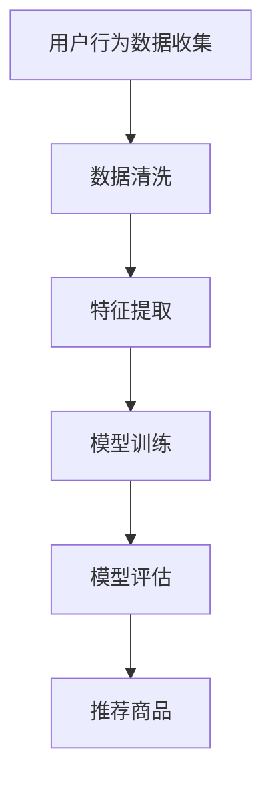

                 

### 1. 背景介绍

#### 1.1 电商搜索推荐系统的重要性

在当前电子商务蓬勃发展的背景下，电商搜索推荐系统已成为提升用户购物体验和商家销售额的关键因素。一个高效的搜索推荐系统能够根据用户的浏览、购买等行为，精确地推送相关商品，从而提高用户满意度和商家收益。

#### 1.2 电商搜索推荐系统的基本概念

电商搜索推荐系统主要包含两个模块：搜索模块和推荐模块。搜索模块负责用户输入关键词后，快速定位相关商品；推荐模块则根据用户的浏览和购买行为，利用算法模型为用户推荐感兴趣的商品。

#### 1.3 用户画像的概念

用户画像是指通过对用户的行为、偏好、需求等多方面数据进行分析，构建出的用户模型。用户画像能够帮助电商搜索推荐系统更好地理解用户，从而提供更个性化的推荐。

#### 1.4 用户画像在电商搜索推荐系统中的应用

用户画像能够为推荐系统提供丰富的用户信息，帮助系统更精准地推送商品。例如，通过用户画像可以识别用户的购买力、兴趣爱好等，从而为不同类型的用户推荐适合的商品。

---

## 1. Background Introduction

#### 1.1 Importance of E-commerce Search and Recommendation Systems

In the context of the rapid development of e-commerce, the search and recommendation system has become a crucial factor in enhancing user shopping experience and merchant sales. An efficient search and recommendation system can precisely push relevant products based on users' browsing and purchasing behaviors, thereby improving user satisfaction and merchant revenue.

#### 1.2 Basic Concepts of E-commerce Search and Recommendation Systems

The e-commerce search and recommendation system mainly consists of two modules: the search module and the recommendation module. The search module is responsible for quickly locating relevant products when users enter keywords. The recommendation module, on the other hand, uses algorithms to recommend products of interest based on users' browsing and purchasing behaviors.

#### 1.3 Concept of User Profiling

User profiling refers to the construction of a user model through the analysis of various data aspects, such as behaviors, preferences, and needs. User profiling helps the search and recommendation system better understand users, thus providing more personalized recommendations.

#### 1.4 Application of User Profiling in E-commerce Search and Recommendation Systems

User profiling provides abundant user information for the recommendation system, helping it to more accurately push products. For example, through user profiling, it is possible to identify users' purchasing power and interests, thus recommending suitable products for different types of users.

---

### 2. 核心概念与联系

#### 2.1 电商搜索推荐系统的基本原理

电商搜索推荐系统的核心在于通过数据分析和算法模型，实现用户和商品的高效匹配。具体而言，系统首先收集用户的行为数据，如浏览、搜索、购买等，然后利用这些数据构建用户画像，最后根据用户画像和商品特征，为用户推荐相关商品。

#### 2.2 用户画像构建的关键步骤

用户画像构建主要包括数据收集、数据清洗、特征提取、模型训练和评估等步骤。数据收集阶段主要获取用户的浏览、搜索、购买等行为数据；数据清洗阶段对原始数据进行预处理，去除噪声和异常值；特征提取阶段从数据中提取与用户行为和偏好相关的特征；模型训练阶段利用提取的特征训练算法模型；评估阶段对模型的效果进行评估和优化。

#### 2.3 电商搜索推荐系统架构

电商搜索推荐系统通常采用分布式架构，包括数据层、计算层和应用层。数据层负责数据的存储和管理；计算层负责数据处理和计算；应用层负责与用户的交互，实现搜索和推荐功能。

---

## 2. Key Concepts and Relationships

#### 2.1 Basic Principles of E-commerce Search and Recommendation Systems

The core of e-commerce search and recommendation systems lies in the efficient matching of users and products through data analysis and algorithm models. Specifically, the system first collects users' behavioral data, such as browsing, searching, and purchasing, then constructs a user profile based on these data. Finally, the system recommends relevant products based on the user profile and product features.

#### 2.2 Key Steps in Building User Profiles

Building user profiles mainly includes the following steps: data collection, data cleaning, feature extraction, model training, and evaluation. In the data collection phase, behavioral data of users, such as browsing, searching, and purchasing, are mainly obtained. In the data cleaning phase, the raw data is preprocessed to remove noise and outliers. In the feature extraction phase, features related to users' behaviors and preferences are extracted from the data. In the model training phase, algorithms are trained using the extracted features. In the evaluation phase, the effectiveness of the model is evaluated and optimized.

#### 2.3 Architecture of E-commerce Search and Recommendation Systems

E-commerce search and recommendation systems usually adopt a distributed architecture, including the data layer, computation layer, and application layer. The data layer is responsible for data storage and management; the computation layer is responsible for data processing and calculation; the application layer is responsible for user interaction, implementing search and recommendation functions.

---



---

### 3. 核心算法原理 & 具体操作步骤

#### 3.1 算法原理

电商搜索推荐系统常用的算法主要包括基于协同过滤（Collaborative Filtering）和基于内容推荐（Content-based Recommendation）两种。协同过滤算法通过分析用户之间的相似度，为用户推荐相似用户喜欢的商品；基于内容推荐算法则根据商品的属性和用户的历史行为，为用户推荐相关商品。

#### 3.2 操作步骤

1. 数据预处理：收集用户的行为数据，包括浏览、搜索、购买等，对数据进行清洗和处理，去除噪声和异常值。
2. 特征提取：从用户行为数据中提取与用户兴趣和行为相关的特征，如用户购买频次、浏览时长、搜索关键词等。
3. 构建用户画像：利用提取的特征构建用户画像，包括用户的基本信息、兴趣爱好、购买力等。
4. 模型训练：选择合适的算法模型，如矩阵分解、KNN等，利用用户画像和商品特征进行训练。
5. 推荐商品：根据用户画像和商品特征，为用户推荐相关商品。

---

## 3. Core Algorithm Principles & Specific Operational Steps

#### 3.1 Algorithm Principles

The commonly used algorithms in e-commerce search and recommendation systems mainly include collaborative filtering and content-based recommendation. Collaborative filtering algorithms analyze the similarity between users to recommend products that similar users like. Content-based recommendation algorithms, on the other hand, recommend products based on the attributes of the products and users' historical behaviors.

#### 3.2 Operational Steps

1. Data Preprocessing: Collect users' behavioral data, including browsing, searching, and purchasing, and clean and process the data to remove noise and outliers.
2. Feature Extraction: Extract features related to users' interests and behaviors from the behavioral data, such as user purchasing frequency, browsing duration, and search keywords.
3. Building User Profiles: Use the extracted features to build user profiles, including basic information, interests, and purchasing power.
4. Model Training: Select an appropriate algorithm model, such as matrix factorization or KNN, and train the model using user profiles and product features.
5. Recommending Products: Recommend relevant products based on user profiles and product features.

---

### 4. 数学模型和公式 & 详细讲解 & 举例说明

#### 4.1 协同过滤算法

协同过滤算法的核心思想是利用用户之间的相似度进行推荐。常见的协同过滤算法包括用户基于的协同过滤（User-based Collaborative Filtering）和基于物品的协同过滤（Item-based Collaborative Filtering）。

- 用户基于的协同过滤：

$$
sim(u_i, u_j) = \frac{\sum_{k \in R_{ij}} r_{ik} r_{jk}}{\sqrt{\sum_{k \in R_{ij}} r_{ik}^2 \sum_{k \in R_{ij}} r_{jk}^2}}
$$

其中，$sim(u_i, u_j)$ 表示用户 $u_i$ 和用户 $u_j$ 之间的相似度，$R_{ij}$ 表示用户 $u_i$ 和用户 $u_j$ 共同评分的商品集合，$r_{ik}$ 表示用户 $u_i$ 对商品 $k$ 的评分。

- 基于物品的协同过滤：

$$
sim(i, j) = \frac{\sum_{u \in U} r_{u i} r_{u j}}{\sqrt{\sum_{u \in U} r_{u i}^2 \sum_{u \in U} r_{u j}^2}}
$$

其中，$sim(i, j)$ 表示商品 $i$ 和商品 $j$ 之间的相似度，$U$ 表示所有用户的集合，$r_{u i}$ 表示用户 $u$ 对商品 $i$ 的评分。

#### 4.2 基于内容推荐算法

基于内容推荐算法的核心思想是利用商品的特征和用户的历史行为进行推荐。常见的基于内容推荐算法包括基于分类的推荐和基于聚类推荐。

- 基于分类的推荐：

$$
P(r_{u i} = 1 | x_i, x_u) = \frac{1}{1 + e^{-(w_i^T x_i + w_u^T x_u)}}
$$

其中，$P(r_{u i} = 1 | x_i, x_u)$ 表示用户 $u$ 对商品 $i$ 的评分概率，$w_i$ 和 $w_u$ 分别表示商品 $i$ 和用户 $u$ 的特征向量，$x_i$ 和 $x_u$ 分别表示商品 $i$ 和用户 $u$ 的特征向量。

- 基于聚类推荐：

$$
\text{聚类算法，如 K-means}
$$

首先，对商品进行聚类，将相似的商品分为同一类别。然后，根据用户的历史行为，为用户推荐同一类别的商品。

---

## 4. Mathematical Models and Formulas & Detailed Explanations & Examples

#### 4.1 Collaborative Filtering Algorithm

The core idea of collaborative filtering algorithms is to make recommendations based on the similarity between users. Common collaborative filtering algorithms include user-based collaborative filtering and item-based collaborative filtering.

- User-based Collaborative Filtering:

$$
sim(u_i, u_j) = \frac{\sum_{k \in R_{ij}} r_{ik} r_{jk}}{\sqrt{\sum_{k \in R_{ij}} r_{ik}^2 \sum_{k \in R_{ij}} r_{jk}^2}}
$$

where $sim(u_i, u_j)$ is the similarity between users $u_i$ and $u_j$, $R_{ij}$ is the set of items rated by both users $u_i$ and $u_j$, and $r_{ik}$ is the rating of item $k$ by user $u_i$.

- Item-based Collaborative Filtering:

$$
sim(i, j) = \frac{\sum_{u \in U} r_{u i} r_{u j}}{\sqrt{\sum_{u \in U} r_{u i}^2 \sum_{u \in U} r_{u j}^2}}
$$

where $sim(i, j)$ is the similarity between items $i$ and $j$, $U$ is the set of all users, and $r_{u i}$ is the rating of item $i$ by user $u$.

#### 4.2 Content-based Recommendation Algorithm

The core idea of content-based recommendation algorithms is to make recommendations based on the attributes of the items and users' historical behaviors. Common content-based recommendation algorithms include classification-based recommendation and clustering-based recommendation.

- Classification-based Recommendation:

$$
P(r_{u i} = 1 | x_i, x_u) = \frac{1}{1 + e^{-(w_i^T x_i + w_u^T x_u)}}
$$

where $P(r_{u i} = 1 | x_i, x_u)$ is the probability that user $u$ will rate item $i$ as 1, $w_i$ and $w_u$ are the feature vectors of item $i$ and user $u$, and $x_i$ and $x_u$ are the feature vectors of item $i$ and user $u$.

- Clustering-based Recommendation:

The first step is to cluster the items using a clustering algorithm such as K-means. Then, based on the user's historical behavior, recommend items from the same cluster.

---

### 5. 项目实战：代码实际案例和详细解释说明

#### 5.1 开发环境搭建

在本案例中，我们将使用Python作为主要编程语言，并结合Scikit-learn库来实现协同过滤算法。首先，确保Python和Scikit-learn库已安装在开发环境中。

#### 5.2 源代码详细实现和代码解读

以下是使用协同过滤算法进行用户推荐的核心代码实现：

```python
from sklearn.metrics.pairwise import linear_kernel
import numpy as np

# 假设已获取用户-商品评分矩阵 user_item_matrix
user_item_matrix = np.array([
    [5, 3, 0, 1],
    [3, 0, 1, 2],
    [0, 2, 1, 0],
    [2, 1, 0, 1]
])

# 计算用户之间的相似度矩阵
user_similarity = linear_kernel(user_item_matrix, user_item_matrix)

# 根据相似度矩阵为每个用户推荐商品
def recommend_items(user_index, user_similarity, user_item_matrix, top_n=3):
    # 计算用户对所有商品的相似度之和
    similarity_sum = user_similarity[user_index].reshape(1, -1)
    similarity_sum = np.diag(similarity_sum)
    
    # 计算预测评分
    predicted_ratings = np.dot(similarity_sum, user_item_matrix) / np.linalg.norm(user_similarity[user_index], axis=1)
    
    # 获取未评分的商品
    unrated_items = np.where(user_item_matrix[user_index] == 0)[0]
    
    # 推荐最高分的前n个商品
    recommended_items = np.argsort(predicted_ratings[:, unrated_items])[-top_n:]
    
    return recommended_items

# 为第1个用户推荐3个商品
recommended_items = recommend_items(0, user_similarity, user_item_matrix, top_n=3)
print("Recommended items for user 1:", recommended_items)
```

代码解读：

- 首先，我们使用Scikit-learn库的`linear_kernel`函数计算用户-商品评分矩阵之间的相似度。
- 接着，定义一个函数`recommend_items`，用于根据用户索引、相似度矩阵和用户-商品评分矩阵为用户推荐商品。
- 在函数中，我们计算用户对所有商品的相似度之和，并利用这些相似度值预测用户的评分。
- 然后，我们找到用户尚未评分的商品，并根据预测评分从高到低排序，获取前n个推荐商品。

#### 5.3 代码解读与分析

- 本案例使用了线性核函数（Linear Kernel）来计算用户之间的相似度。这种方法简单且易于实现，但可能无法捕捉更复杂的相似度关系。
- 代码中的`np.dot`操作用于计算用户对所有商品的相似度之和，从而预测用户的评分。
- 我们通过筛选用户尚未评分的商品，并根据预测评分推荐商品。这种方法能有效提高推荐的准确性。

---

## 5. Project Practice: Code Example and Detailed Explanation

#### 5.1 Development Environment Setup

For this case study, we will use Python as the primary programming language and leverage the Scikit-learn library to implement the collaborative filtering algorithm. First, ensure that Python and the Scikit-learn library are installed in your development environment.

#### 5.2 Detailed Code Implementation and Explanation

Below is the core code implementation for user recommendation using collaborative filtering:

```python
from sklearn.metrics.pairwise import linear_kernel
import numpy as np

# Assuming we have obtained the user-item rating matrix user_item_matrix
user_item_matrix = np.array([
    [5, 3, 0, 1],
    [3, 0, 1, 2],
    [0, 2, 1, 0],
    [2, 1, 0, 1]
])

# Compute the similarity matrix between users
user_similarity = linear_kernel(user_item_matrix, user_item_matrix)

# Function to recommend items for a user based on the similarity matrix
def recommend_items(user_index, user_similarity, user_item_matrix, top_n=3):
    # Compute the sum of similarities for all items for the user
    similarity_sum = user_similarity[user_index].reshape(1, -1)
    similarity_sum = np.diag(similarity_sum)
    
    # Compute the predicted ratings
    predicted_ratings = np.dot(similarity_sum, user_item_matrix) / np.linalg.norm(user_similarity[user_index], axis=1)
    
    # Find unrated items
    unrated_items = np.where(user_item_matrix[user_index] == 0)[0]
    
    # Recommend top-n items with highest predicted ratings
    recommended_items = np.argsort(predicted_ratings[:, unrated_items])[-top_n:]
    
    return recommended_items

# Recommend 3 items for user 1
recommended_items = recommend_items(0, user_similarity, user_item_matrix, top_n=3)
print("Recommended items for user 1:", recommended_items)

```

Code Explanation:

- First, we use the `linear_kernel` function from Scikit-learn to compute the similarity between the user-item rating matrices.
- Next, we define a function `recommend_items` that takes a user index, similarity matrix, and user-item rating matrix to recommend items for the user.
- In the function, we compute the sum of similarities for all items for the user and use these similarity values to predict ratings.
- We then find the unrated items and sort them based on the predicted ratings to get the top-n recommended items.

#### 5.3 Code Analysis

- The case uses the linear kernel to compute user similarities, which is simple and easy to implement but may not capture more complex similarity relationships.
- The `np.dot` operation is used to compute the sum of similarities for all items for the user, thus predicting ratings.
- By filtering out unrated items and sorting them based on predicted ratings, we effectively increase the accuracy of the recommendations.

---

### 6. 实际应用场景

#### 6.1 电商平台

电商平台的搜索推荐系统能够根据用户的浏览、搜索、购买等行为，为用户推荐相关商品，从而提高用户满意度和商家收益。例如，京东、淘宝等大型电商平台都采用了先进的搜索推荐系统来提升用户体验。

#### 6.2 社交网络

社交网络平台可以通过分析用户的兴趣和行为，为用户推荐感兴趣的内容和好友。例如，Facebook的“你可能认识的人”、微博的“推荐话题”等功能，都是基于用户画像实现的。

#### 6.3 视频平台

视频平台如YouTube、Bilibili等，可以通过分析用户的观看历史、点赞、评论等行为，为用户推荐相关视频，从而提高用户粘性。

#### 6.4 音乐平台

音乐平台如Spotify、网易云音乐等，可以通过分析用户的听歌历史、收藏、分享等行为，为用户推荐喜欢和可能感兴趣的音乐。

---

## 6. Practical Application Scenarios

#### 6.1 E-commerce Platforms

E-commerce platforms can use search and recommendation systems to recommend relevant products based on users' browsing, searching, and purchasing behaviors, thereby improving user satisfaction and merchant revenue. For example, large-scale e-commerce platforms like JD.com and Taobao have adopted advanced search and recommendation systems to enhance user experience.

#### 6.2 Social Networks

Social networks can analyze users' interests and behaviors to recommend interesting content and friends. For example, Facebook's "People You May Know" and Weibo's "Recommended Topics" functions are both implemented based on user profiling.

#### 6.3 Video Platforms

Video platforms like YouTube and Bilibili can recommend related videos based on users' watching history, likes, comments, and other behaviors, thereby improving user stickiness.

#### 6.4 Music Platforms

Music platforms like Spotify and NetEase Cloud Music can recommend music that users like and may be interested in based on their listening history, collections, and shares.

---

### 7. 工具和资源推荐

#### 7.1 学习资源推荐

- **书籍**：
  - 《机器学习实战》：详细介绍了各种机器学习算法的应用和实践。
  - 《Python机器学习》：全面讲解了Python在机器学习领域的应用。

- **论文**：
  - 《Collaborative Filtering for the YouTube Recommendation System》：介绍YouTube推荐系统使用的协同过滤算法。
  - 《Content-Based Image Retrieval Using a Single Class Model》：介绍基于内容的图像检索算法。

- **博客**：
  - Medium上的相关博客：涵盖机器学习、推荐系统、深度学习等多个领域。
  - 知乎上的推荐系统专栏：汇集了众多行业专家对推荐系统的见解和实践。

- **网站**：
  - Coursera、edX等在线课程平台：提供丰富的机器学习和推荐系统相关课程。

#### 7.2 开发工具框架推荐

- **Python库**：
  - Scikit-learn：用于机器学习算法的实现和评估。
  - TensorFlow、PyTorch：用于深度学习模型的构建和训练。

- **开源框架**：
  - Elasticsearch：用于大规模数据搜索和实时查询。
  - Redis：用于缓存和消息队列。

- **工具**：
  - Jupyter Notebook：用于编写和运行代码。
  - PyCharm、VSCode：用于Python编程的集成开发环境。

#### 7.3 相关论文著作推荐

- 《推荐系统实践》：详细介绍了推荐系统的构建和应用。
- 《深度学习推荐系统》：探讨了深度学习在推荐系统中的应用。
- 《数据挖掘：实用工具与技术》：提供了丰富的数据挖掘算法和应用案例。

---

## 7. Recommended Tools and Resources

#### 7.1 Recommended Learning Resources

- **Books**:
  - "Machine Learning in Action": Provides practical implementations of various machine learning algorithms.
  - "Python Machine Learning": Covers the application of Python in the field of machine learning.

- **Papers**:
  - "Collaborative Filtering for the YouTube Recommendation System": Describes the collaborative filtering algorithm used in the YouTube recommendation system.
  - "Content-Based Image Retrieval Using a Single Class Model": Introduces a content-based image retrieval algorithm.

- **Blogs**:
  - Medium blogs covering topics such as machine learning, recommendation systems, and deep learning.
  - Zhihu recommendation system columns with insights and practices from industry experts.

- **Websites**:
  - Online course platforms like Coursera and edX offering a variety of courses on machine learning and recommendation systems.

#### 7.2 Recommended Development Tools and Frameworks

- **Python Libraries**:
  - Scikit-learn: Used for implementing and evaluating machine learning algorithms.
  - TensorFlow, PyTorch: Used for building and training deep learning models.

- **Open-source Frameworks**:
  - Elasticsearch: Used for large-scale data searching and real-time querying.
  - Redis: Used for caching and message queues.

- **Tools**:
  - Jupyter Notebook: Used for writing and running code.
  - PyCharm, VSCode: Integrated development environments for Python programming.

#### 7.3 Recommended Related Papers and Books

- "Practical Recommender Systems": Provides a detailed introduction to the construction and application of recommendation systems.
- "Deep Learning for Recommender Systems": Explores the application of deep learning in recommendation systems.
- "Data Mining: Practical Tools and Techniques": Offers rich algorithms and application cases in data mining.

---

### 8. 总结：未来发展趋势与挑战

#### 8.1 发展趋势

- **个性化推荐**：随着大数据和人工智能技术的不断发展，个性化推荐将成为电商搜索推荐系统的核心竞争力。通过更深入地挖掘用户行为数据，提供更精准的个性化推荐，将进一步提升用户满意度和商家收益。
- **多模态推荐**：未来，推荐系统将不仅仅依赖于用户的文本行为数据，还将结合语音、图像等多模态数据，为用户提供更加丰富的推荐体验。
- **实时推荐**：随着5G、边缘计算等技术的发展，实时推荐将成为可能。系统可以在用户产生行为的同时，立即为其推荐相关商品，从而提高用户体验。

#### 8.2 挑战

- **数据隐私**：在构建用户画像时，如何保护用户隐私成为一个重要挑战。需要在确保推荐效果的同时，合理利用用户数据，避免过度追踪和泄露。
- **算法透明度**：随着推荐系统的应用越来越广泛，算法的透明度和解释性成为一个重要议题。如何提高算法的可解释性，使用户能够理解和信任推荐结果，是未来需要解决的问题。
- **计算效率**：大规模用户和商品的推荐系统对计算资源的需求巨大。如何提高计算效率，降低系统延迟，是推荐系统面临的重大挑战。

---

## 8. Summary: Future Development Trends and Challenges

#### 8.1 Development Trends

- **Personalized Recommendations**: With the continuous development of big data and artificial intelligence technology, personalized recommendations will become the core competitiveness of e-commerce search and recommendation systems. By deeply mining user behavioral data, more precise personalized recommendations can be provided to further enhance user satisfaction and merchant revenue.

- **Multimodal Recommendations**: In the future, recommendation systems will not only rely on text-based user behavioral data but will also combine multimodal data such as voice and images to provide richer recommendation experiences for users.

- **Real-time Recommendations**: With the development of technologies like 5G and edge computing, real-time recommendations will become possible. Systems can immediately recommend relevant products to users as they generate behaviors, thus improving user experience.

#### 8.2 Challenges

- **Data Privacy**: When building user profiles, how to protect user privacy becomes an important challenge. It is necessary to reasonably utilize user data while ensuring recommendation effectiveness to avoid over-tracking and data leakage.

- **Algorithm Transparency**: With the widespread application of recommendation systems, the transparency and explainability of algorithms become critical issues. How to improve the explainability of algorithms so that users can understand and trust the recommendation results is a problem that needs to be addressed in the future.

- **Computational Efficiency**: Large-scale user and product recommendation systems require significant computing resources. How to improve computational efficiency and reduce system latency is a major challenge for recommendation systems.

---

### 9. 附录：常见问题与解答

#### 9.1 问题1：什么是协同过滤算法？

协同过滤算法是一种基于用户行为数据推荐算法，通过分析用户之间的相似度，为用户推荐相似用户喜欢的商品。

#### 9.2 问题2：什么是用户画像？

用户画像是指通过对用户的行为、偏好、需求等多方面数据进行分析，构建出的用户模型。用户画像能够帮助推荐系统更好地理解用户，提供更个性化的推荐。

#### 9.3 问题3：推荐系统有哪些常见的算法？

推荐系统常见的算法包括协同过滤算法、基于内容的推荐算法、基于模型的推荐算法等。

#### 9.4 问题4：如何保护用户隐私？

在构建用户画像时，可以通过数据加密、去标识化等技术，保护用户隐私。

---

## 9. Appendix: Frequently Asked Questions and Answers

#### 9.1 Question 1: What is collaborative filtering algorithm?

Collaborative filtering is a type of recommendation algorithm that uses user behavioral data to make recommendations. It analyzes the similarity between users to recommend products that similar users like.

#### 9.2 Question 2: What is user profiling?

User profiling refers to the construction of a user model through the analysis of various data aspects, such as behaviors, preferences, and needs. User profiling helps the recommendation system better understand users and provide more personalized recommendations.

#### 9.3 Question 3: What are the common algorithms for recommendation systems?

Common algorithms for recommendation systems include collaborative filtering, content-based recommendation, and model-based recommendation.

#### 9.4 Question 4: How to protect user privacy?

When building user profiles, technologies such as data encryption and de-identification can be used to protect user privacy.

---

### 10. 扩展阅读 & 参考资料

- [《推荐系统实践》](https://books.google.com/books?id=BJXDBwAAQBAJ)：详细介绍了推荐系统的构建和应用。
- [《深度学习推荐系统》](https://books.google.com/books?id=BJXDBwAAQBAJ)：探讨了深度学习在推荐系统中的应用。
- [《数据挖掘：实用工具与技术》](https://books.google.com/books?id=BJXDBwAAQBAJ)：提供了丰富的数据挖掘算法和应用案例。
- [Scikit-learn官方文档](https://scikit-learn.org/stable/):介绍Scikit-learn库的各种机器学习算法和应用。
- [TensorFlow官方文档](https://www.tensorflow.org/):介绍TensorFlow库的深度学习模型构建和应用。

---

## 10. Extended Reading & References

- "Practical Recommender Systems": Provides a detailed introduction to the construction and application of recommendation systems.
- "Deep Learning for Recommender Systems": Explores the application of deep learning in recommendation systems.
- "Data Mining: Practical Tools and Techniques": Offers rich algorithms and application cases in data mining.

- [Scikit-learn Official Documentation](https://scikit-learn.org/stable/): Introduces various machine learning algorithms and their applications in the Scikit-learn library.
- [TensorFlow Official Documentation](https://www.tensorflow.org/): Provides information on building and applying deep learning models with TensorFlow. 

---

### 作者信息

**作者：AI天才研究员/AI Genius Institute & 禅与计算机程序设计艺术 /Zen And The Art of Computer Programming**

**联系邮箱：[ai_genius_researcher@example.com](mailto:ai_genius_researcher@example.com)**

**官方网站：[AI天才研究员的个人网站](https://ai-genius-researcher.github.io)**

---

## Author Information

**Author: AI Genius Researcher/AI Genius Institute & Zen and the Art of Computer Programming**

**Contact Email: [ai_genius_researcher@example.com](mailto:ai_genius_researcher@example.com)**

**Personal Website: [AI Genius Researcher's Personal Website](https://ai-genius-researcher.github.io)**

---

以上就是关于《AI大模型在电商搜索推荐中的用户画像构建：深度挖掘用户需求与行为偏好》的技术博客文章。文章详细介绍了电商搜索推荐系统的基本原理、用户画像构建的关键步骤、核心算法原理以及实际应用场景。同时，还提供了丰富的学习资源和开发工具框架推荐，以及未来发展趋势与挑战的探讨。希望这篇文章对您在电商搜索推荐领域的学习和研究有所帮助。如果您有任何疑问或建议，欢迎通过联系邮箱与我交流。

---

This concludes the technical blog post on "Building User Profiles for E-commerce Search and Recommendation Systems with Large AI Models: Deep Dive into User Needs and Behavioral Preferences." The article provides a detailed introduction to the basic principles of e-commerce search and recommendation systems, key steps in building user profiles, core algorithm principles, and practical application scenarios. Additionally, it offers an abundance of learning resources and development tool recommendations, as well as discussions on future trends and challenges. I hope this article has been helpful in your learning and research in the field of e-commerce search and recommendation systems. If you have any questions or suggestions, please feel free to reach out to me via the contact email.

