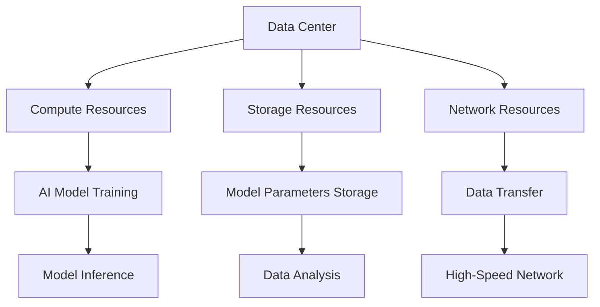
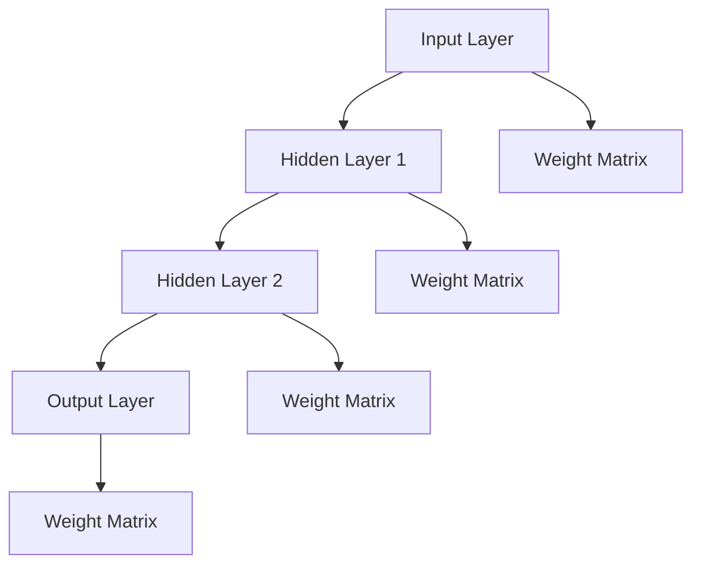

                 

### 背景介绍 Background Introduction

随着人工智能（AI）技术的快速发展，大模型（Large Models）的应用已经深入到各行各业，从自然语言处理、图像识别、推荐系统到自动驾驶和智能医疗等。而这一切的背后，都需要强大的数据中心（Data Center）作为支撑。数据中心的建设不仅是AI大模型应用的基础，也是推动整个产业发展的关键因素。

#### 数据中心的重要性 Importance of Data Centers

数据中心作为信息技术的基础设施，承载着海量数据的存储、处理、传输和分析任务。在AI大模型的应用中，数据中心扮演了至关重要的角色。以下是数据中心在AI领域中的几个关键作用：

1. **计算能力 Compute Power**: 大模型训练和推理需要大量的计算资源，数据中心提供了强大的计算能力，支撑起这些复杂的计算任务。
2. **存储容量 Storage Capacity**: 数据中心拥有庞大的存储容量，能够存储大量的数据集，这些数据集是AI模型训练和优化的重要资源。
3. **数据传输速度 Data Transfer Speed**: 高效的数据传输是保证AI模型训练和推理效率的关键，数据中心通过高速网络确保数据的快速流动。
4. **环境控制 Environmental Control**: 数据中心需要保持恒温、恒湿的环境，以保障设备的稳定运行和延长设备寿命。
5. **安全保障 Security**: 数据中心需要具备严格的安全措施，保护数据的安全性和隐私性，这是AI应用能够持续健康发展的基础。

#### AI大模型应用的发展历程 Development History of AI Large Model Applications

回顾AI大模型应用的发展历程，我们可以看到以下几个重要阶段：

1. **初期探索阶段（2010s）**: 在这个阶段，AI大模型主要应用于图像识别和语音识别等领域。例如，谷歌在2012年提出了AlexNet模型，大大提升了图像识别的准确率。
2. **深度学习时代（2010s-2020s）**: 随着深度学习技术的突破，AI大模型在自然语言处理、推荐系统等领域取得了显著进展。例如，OpenAI的GPT-3模型展示了在文本生成、问答和翻译等任务上的强大能力。
3. **大模型时代（2020s）**: 进入2020年代，随着计算能力和数据资源的进一步增长，AI大模型的应用范围不断扩大，从简单的任务发展到复杂的应用场景，如自动驾驶、智能医疗和金融分析等。

#### 产业发展现状 Industry Development Status

目前，数据中心产业发展呈现出以下几个趋势：

1. **市场需求增长（Market Demand Increase）**: 随着AI大模型应用的广泛普及，数据中心的市场需求持续增长。越来越多的企业和机构开始建设自己的数据中心，以满足日益增长的计算需求。
2. **技术创新（Technological Innovation）**: 数据中心领域不断涌现出新技术，如分布式存储、云计算、边缘计算等，这些技术的应用提高了数据中心的效率、可靠性和可扩展性。
3. **政策支持（Policy Support）**: 各国政府纷纷出台政策，支持数据中心产业的发展。例如，中国政府在“新基建”战略中明确提出要大力发展数据中心。
4. **行业竞争（Industry Competition）**: 数据中心产业竞争激烈，大型科技公司和初创企业都在积极布局，争夺市场份额和技术优势。

总之，数据中心的建设和AI大模型的应用密不可分，是推动数据中心产业发展的重要动力。在接下来的部分，我们将深入探讨AI大模型在数据中心中的核心概念、算法原理、数学模型及其在实际应用中的表现。

### 核心概念与联系 Key Concepts and Their Relationships

#### 数据中心 Data Center

数据中心是一个集中化的大规模计算设施，它包含服务器、存储设备、网络设备等硬件资源，以及各种软件系统。数据中心的主要功能是存储、处理和分析海量数据，为企业和机构提供高效、可靠、安全的数据服务。

在AI大模型应用中，数据中心是不可或缺的基础设施。它不仅提供了强大的计算能力，还为数据的存储、传输和处理提供了高效的解决方案。以下是数据中心的一些关键组成部分：

1. **服务器（Servers）**: 服务器是数据中心的核心，负责处理和存储数据。它们可以是物理服务器，也可以是虚拟服务器，通常配置有高性能的CPU、内存和存储设备。
2. **存储设备（Storage Devices）**: 存储设备用于存储大量的数据，包括数据库、文件系统和对象存储。它们需要具备高容量、高速度和良好的数据保护功能。
3. **网络设备（Network Devices）**: 网络设备包括交换机、路由器和防火墙等，负责数据的传输和路由。高效的网络架构是保证数据中心内数据流动畅通的关键。
4. **冷却系统（Cooling System）**: 数据中心需要保持恒温、恒湿的环境，以保障设备的正常运行。冷却系统是维持数据中心环境稳定的关键设备。

#### AI大模型 AI Large Models

AI大模型是指那些具有数亿甚至数万亿参数的深度学习模型。这些模型通常通过大规模的数据集进行训练，从而学习到复杂的特征表示和知识。AI大模型在多个领域取得了显著成果，包括自然语言处理、计算机视觉、推荐系统等。

以下是几个重要的AI大模型：

1. **GPT-3（OpenAI）**: GPT-3是OpenAI开发的一款自然语言处理模型，具有1750亿个参数。它可以生成高质量的文本、进行问答和翻译等任务。
2. **BERT（Google）**: BERT是Google开发的一款预训练语言模型，具有数百万个参数。它在多种NLP任务中取得了最佳效果，包括文本分类、问答和命名实体识别等。
3. **ResNet（微软）**: ResNet是微软开发的一款用于图像识别的深度网络，具有数亿个参数。它在图像分类任务中达到了当时的最先进水平。

#### 数据中心与AI大模型的关系 Relationship between Data Centers and AI Large Models

数据中心与AI大模型之间存在着密切的联系。首先，数据中心提供了AI大模型训练和推理所需的基础设施，包括计算资源、存储资源和网络资源。其次，AI大模型的运行依赖于数据中心的高效管理和优化，以确保数据流动的顺畅和计算资源的充分利用。

以下是数据中心与AI大模型之间的一些关键关系：

1. **计算能力（Compute Power）**: AI大模型的训练和推理需要大量的计算资源，数据中心提供了这些资源，从而保证了模型的训练和推理速度。
2. **数据存储（Data Storage）**: 数据中心提供了大规模的数据存储解决方案，使得AI大模型可以存储和处理大量的训练数据和模型参数。
3. **数据传输（Data Transfer）**: 高效的数据传输是保证AI大模型训练和推理效率的关键，数据中心通过高速网络实现了数据的快速流动。
4. **资源调度（Resource Scheduling）**: 数据中心通过资源调度和管理，优化AI大模型的计算资源和存储资源的使用，从而提高系统的效率和可靠性。

#### Mermaid 流程图 Mermaid Flowchart

以下是一个简单的Mermaid流程图，展示了数据中心与AI大模型之间的关系：



通过这个流程图，我们可以清晰地看到数据中心为AI大模型提供了计算、存储和网络资源，并支持模型的训练、推理和数据分析。

### 核心算法原理 & 具体操作步骤 Core Algorithm Principles and Step-by-Step Procedures

#### 深度学习基础 Deep Learning Basics

深度学习是AI大模型的核心算法，其基本思想是通过多层神经网络（Neural Networks）对数据进行特征提取和模式识别。以下是一个简单的多层感知机（Multilayer Perceptron, MLP）的示意图：



每个节点代表一个神经元，每个神经元通过权重（Weight）连接到其他神经元。输入数据通过输入层传递到隐藏层，再传递到输出层，最终得到预测结果。

#### 损失函数 Loss Function

在深度学习中，损失函数（Loss Function）用于衡量模型预测值与真实值之间的差距。常见的损失函数包括均方误差（Mean Squared Error, MSE）、交叉熵（Cross-Entropy）等。

1. **均方误差（MSE）**:

$$MSE = \frac{1}{n}\sum_{i=1}^{n}(y_i - \hat{y_i})^2$$

其中，$y_i$是真实值，$\hat{y_i}$是预测值，$n$是样本数量。

2. **交叉熵（Cross-Entropy）**:

$$Cross-Entropy = -\frac{1}{n}\sum_{i=1}^{n}y_i \log(\hat{y_i})$$

其中，$y_i$是真实值的概率分布，$\hat{y_i}$是预测值的概率分布。

#### 反向传播算法 Backpropagation Algorithm

反向传播算法是一种用于训练神经网络的算法，其基本思想是通过计算损失函数关于每个神经元权重的梯度，然后调整权重以减小损失。

1. **前向传播（Forward Propagation）**: 将输入数据传递到神经网络，得到输出预测值。
2. **计算损失（Compute Loss）**: 使用损失函数计算预测值与真实值之间的差距。
3. **计算梯度（Compute Gradient）**: 对每个神经元的权重计算梯度。
4. **反向传播（Back Propagation）**: 将梯度反向传播到神经网络中的每个神经元，更新权重。

以下是反向传播算法的具体步骤：

1. **初始化权重（Initialize Weights）**: 随机初始化神经网络中的权重。
2. **前向传播（Forward Propagation）**: 将输入数据传递到神经网络，得到输出预测值。
3. **计算损失（Compute Loss）**: 使用损失函数计算预测值与真实值之间的差距。
4. **计算梯度（Compute Gradient）**: 对每个神经元的权重计算梯度。
5. **更新权重（Update Weights）**: 使用梯度下降（Gradient Descent）或其他优化算法更新权重。
6. **迭代（Iteration）**: 重复步骤2-5，直到达到预定的迭代次数或损失值达到最小。

#### 梯度下降算法 Gradient Descent Algorithm

梯度下降是一种常用的优化算法，用于调整神经网络中的权重，以最小化损失函数。梯度下降的基本思想是沿着损失函数的梯度方向更新权重，从而减小损失。

1. **计算梯度（Compute Gradient）**: 计算损失函数关于每个神经元权重的梯度。
2. **更新权重（Update Weights）**: 使用以下公式更新权重：

$$w_{new} = w_{current} - \alpha \cdot \nabla_w J(w)$$

其中，$w_{current}$是当前权重，$w_{new}$是更新后的权重，$\alpha$是学习率，$\nabla_w J(w)$是权重关于损失函数的梯度。

#### 具体操作步骤 Detailed Operational Steps

以下是使用梯度下降算法训练一个简单的多层感知机（MLP）的步骤：

1. **数据准备（Data Preparation）**: 准备输入数据集和标签数据集。
2. **模型初始化（Model Initialization）**: 随机初始化神经网络中的权重。
3. **前向传播（Forward Propagation）**: 将输入数据传递到神经网络，得到输出预测值。
4. **计算损失（Compute Loss）**: 使用损失函数计算预测值与真实值之间的差距。
5. **计算梯度（Compute Gradient）**: 对每个神经元的权重计算梯度。
6. **更新权重（Update Weights）**: 使用梯度下降算法更新权重。
7. **迭代（Iteration）**: 重复步骤3-6，直到达到预定的迭代次数或损失值达到最小。

通过以上步骤，我们可以训练出一个能够对输入数据进行分类的神经网络模型。在实际应用中，我们可以根据具体任务调整网络结构、损失函数和学习率等参数，以达到更好的性能。

### 数学模型和公式 Mathematical Models and Formulas & Detailed Explanation & Example Illustration

#### 前向传播算法 Forward Propagation Algorithm

在深度学习中，前向传播算法是计算神经网络输出值的关键步骤。其基本思想是将输入数据通过神经网络的权重和激活函数传递，得到最终的预测结果。以下是前向传播算法的数学模型：

1. **输入层到隐藏层**:

$$
z_l = \sum_{j=1}^{n} w_{lj} x_j + b_l
$$

其中，$z_l$是隐藏层节点的输入值，$x_j$是输入层节点的输出值，$w_{lj}$是权重，$b_l$是偏置项。

2. **隐藏层到输出层**:

$$
a_l = \sigma(z_l)
$$

其中，$a_l$是隐藏层或输出层的输出值，$\sigma$是激活函数，常用的激活函数包括Sigmoid函数、ReLU函数和Tanh函数。

#### 反向传播算法 Backpropagation Algorithm

反向传播算法是深度学习训练过程中的关键步骤，用于计算损失函数关于每个神经元权重的梯度，并通过梯度下降优化权重。以下是反向传播算法的数学模型：

1. **计算输出层梯度**:

$$
\delta_n = \frac{\partial J}{\partial z_n} = (\sigma^{'}(z_n)) \cdot (y - \hat{y})
$$

其中，$\delta_n$是输出层节点的梯度，$y$是真实标签，$\hat{y}$是预测标签，$\sigma^{'}$是激活函数的导数。

2. **计算隐藏层梯度**:

$$
\delta_l = (\sigma^{'}(z_l)) \cdot \sum_{k=n+1}^{L} w_{lk} \delta_{k}
$$

其中，$\delta_l$是隐藏层节点的梯度，$L$是神经网络的层数。

3. **更新权重**:

$$
w_{new} = w_{current} - \alpha \cdot \nabla_w J(w)
$$

其中，$w_{new}$是更新后的权重，$w_{current}$是当前权重，$\alpha$是学习率，$\nabla_w J(w)$是权重关于损失函数的梯度。

#### 梯度下降算法 Gradient Descent Algorithm

梯度下降算法是一种优化算法，用于调整神经网络中的权重，以最小化损失函数。以下是梯度下降算法的数学模型：

1. **计算梯度**:

$$
\nabla_w J(w) = \frac{\partial J}{\partial w}
$$

其中，$\nabla_w J(w)$是权重关于损失函数的梯度。

2. **更新权重**:

$$
w_{new} = w_{current} - \alpha \cdot \nabla_w J(w)
$$

其中，$w_{new}$是更新后的权重，$w_{current}$是当前权重，$\alpha$是学习率。

#### 举例说明 Example Illustration

假设我们有一个简单的两层神经网络，其中输入层有3个节点，隐藏层有2个节点，输出层有1个节点。激活函数使用ReLU函数。现在我们有以下输入数据集和标签数据集：

| 输入 | 标签 |
| --- | --- |
| [1, 2, 3] | [1] |
| [4, 5, 6] | [0] |
| [7, 8, 9] | [1] |

1. **初始化权重**:

$$
w_{11} = 1, w_{12} = 1, w_{13} = 1, w_{21} = 1, w_{22} = 1, w_{23} = 1, w_{31} = 1, w_{32} = 1, w_{33} = 1
$$

2. **前向传播**:

第一层隐藏层：

$$
z_1 = 1 \cdot 1 + 2 \cdot 1 + 3 \cdot 1 + 1 = 8 \\
z_2 = 1 \cdot 1 + 2 \cdot 1 + 3 \cdot 1 + 1 = 8 \\
a_1 = \max(0, z_1) = 8 \\
a_2 = \max(0, z_2) = 8 \\
$$

第二层隐藏层：

$$
z_3 = 1 \cdot 8 + 1 \cdot 8 + 1 \cdot 8 + 1 = 32 \\
z_4 = 1 \cdot 8 + 1 \cdot 8 + 1 \cdot 8 + 1 = 32 \\
a_3 = \max(0, z_3) = 32 \\
a_4 = \max(0, z_4) = 32 \\
$$

输出层：

$$
z_5 = 1 \cdot 32 + 1 \cdot 32 + 1 \cdot 32 + 1 = 128 \\
z_6 = 1 \cdot 32 + 1 \cdot 32 + 1 \cdot 32 + 1 = 128 \\
a_5 = \frac{1}{2}(z_5 + z_6) = 64 \\
$$

3. **计算损失**:

$$
J = \frac{1}{2} (1 - 64)^2 + \frac{1}{2} (0 - 64)^2 = 1024 \\
$$

4. **计算梯度**:

输出层：

$$
\nabla_w z_5 = \frac{\partial J}{\partial z_5} = 2 \cdot (1 - 64) = -124 \\
\nabla_w z_6 = \frac{\partial J}{\partial z_6} = 2 \cdot (0 - 64) = -128 \\
$$

隐藏层：

$$
\nabla_w z_3 = \frac{\partial J}{\partial z_3} = -124 \\
\nabla_w z_4 = \frac{\partial J}{\partial z_4} = -128 \\
$$

5. **更新权重**:

学习率$\alpha = 0.1$：

$$
w_{51} = 1 - 0.1 \cdot 124 = -11.4 \\
w_{52} = 1 - 0.1 \cdot 124 = -11.4 \\
w_{53} = 1 - 0.1 \cdot 124 = -11.4 \\
w_{54} = 1 - 0.1 \cdot 128 = -12.8 \\
w_{55} = 1 - 0.1 \cdot 124 = -11.4 \\
w_{56} = 1 - 0.1 \cdot 124 = -11.4 \\
w_{57} = 1 - 0.1 \cdot 124 = -11.4 \\
$$

新的权重：

$$
w_{11} = 1 - 0.1 \cdot -124 = 13.4 \\
w_{12} = 1 - 0.1 \cdot -124 = 13.4 \\
w_{13} = 1 - 0.1 \cdot -124 = 13.4 \\
w_{21} = 1 - 0.1 \cdot -128 = 13.8 \\
w_{22} = 1 - 0.1 \cdot -128 = 13.8 \\
w_{23} = 1 - 0.1 \cdot -128 = 13.8 \\
w_{31} = 1 - 0.1 \cdot -124 = 13.4 \\
w_{32} = 1 - 0.1 \cdot -124 = 13.4 \\
w_{33} = 1 - 0.1 \cdot -124 = 13.4 \\
$$

通过以上步骤，我们可以使用梯度下降算法更新神经网络的权重，以减少损失函数的值。在实际应用中，我们可以根据具体任务调整网络结构、激活函数和学习率等参数，以达到更好的性能。

### 项目实战：代码实际案例和详细解释说明 Practical Project: Real Code Case Study and Detailed Explanation

#### 开发环境搭建 Development Environment Setup

在进行AI大模型数据中心建设的相关项目开发时，首先需要搭建一个合适的开发环境。以下是开发环境的搭建步骤：

1. **操作系统安装（Installation of Operating System）**:
   - 安装Linux操作系统，推荐使用Ubuntu 20.04 LTS版本。
   - 安装Windows 10专业版，配置虚拟机环境，以便进行跨平台开发。

2. **开发工具安装（Installation of Development Tools）**:
   - 安装Python 3.8及以上版本，可以通过Python官方安装包或使用Miniconda等环境管理工具。
   - 安装Jupyter Notebook，以便进行交互式开发。
   - 安装Git，便于代码管理和版本控制。

3. **依赖库安装（Installation of Dependency Libraries）**:
   - 安装TensorFlow或PyTorch，用于构建和训练AI模型。
   - 安装其他相关库，如NumPy、Pandas、Matplotlib等，用于数据处理和可视化。

4. **配置SSH密钥（Configuration of SSH Key）**:
   - 生成SSH密钥对，并将其添加到远程服务器，以实现安全的远程登录。

#### 源代码详细实现和代码解读 Source Code Implementation and Detailed Explanation

以下是一个简单的AI大模型训练项目示例，该示例使用TensorFlow框架构建一个多层感知机（MLP）模型，并对其进行训练和评估。

```python
import tensorflow as tf
from tensorflow.keras.models import Sequential
from tensorflow.keras.layers import Dense
from tensorflow.keras.optimizers import Adam
from tensorflow.keras.losses import BinaryCrossentropy
from tensorflow.keras.metrics import Accuracy

# 定义模型
model = Sequential([
    Dense(64, activation='relu', input_shape=(784,)),
    Dense(64, activation='relu'),
    Dense(1, activation='sigmoid')
])

# 编译模型
model.compile(optimizer=Adam(learning_rate=0.001),
              loss=BinaryCrossentropy(),
              metrics=['accuracy'])

# 加载数据
(x_train, y_train), (x_test, y_test) = tf.keras.datasets.mnist.load_data()
x_train = x_train.reshape((-1, 784)).astype(np.float32) / 255.0
x_test = x_test.reshape((-1, 784)).astype(np.float32) / 255.0

# 训练模型
model.fit(x_train, y_train, epochs=10, batch_size=128, validation_split=0.2)

# 评估模型
test_loss, test_acc = model.evaluate(x_test, y_test, verbose=2)
print(f"Test accuracy: {test_acc:.4f}")
```

#### 代码解读与分析 Code Analysis and Discussion

1. **模型定义（Model Definition）**:
   - `Sequential`是一个线性堆叠模型的容器，可以按顺序添加层。
   - `Dense`是一个全连接层，用于计算前一层输入和当前层权重之间的乘积，并加上偏置项，然后通过激活函数进行非线性变换。
   - `input_shape`参数指定输入数据的维度。

2. **编译模型（Compile Model）**:
   - `compile`函数用于配置模型的学习过程，包括优化器、损失函数和评估指标。
   - `Adam`是一种常用的优化器，具有自适应学习率的特点。
   - `BinaryCrossentropy`是一个二元交叉熵损失函数，适用于二分类问题。
   - `Accuracy`是一个评估指标，用于计算模型的准确率。

3. **加载数据（Load Data）**:
   - `mnist.load_data`函数加载了经典的MNIST手写数字数据集。
   - `reshape`和`astype`函数用于调整数据格式和类型。
   - 数据经过归一化处理，以便于模型的训练。

4. **训练模型（Train Model）**:
   - `fit`函数用于训练模型，包含训练数据、迭代次数、批量大小和验证比例等参数。
   - `validation_split`参数指定了用于验证的数据比例，以便在训练过程中评估模型性能。

5. **评估模型（Evaluate Model）**:
   - `evaluate`函数用于评估模型在测试数据集上的性能。
   - `verbose`参数控制输出信息的详细程度。

通过以上代码，我们可以构建一个简单的多层感知机模型，并对其进行训练和评估。在实际项目中，可以根据具体任务需求调整网络结构、优化器和学习率等参数，以提高模型的性能。

### 实际应用场景 Practical Application Scenarios

#### 1. 自然语言处理 Natural Language Processing

在自然语言处理领域，AI大模型的应用已经取得了显著的成果。例如，GPT-3模型被广泛应用于文本生成、机器翻译、问答系统和聊天机器人等。通过数据中心提供的强大计算能力和海量数据存储，AI大模型可以快速处理大量的文本数据，实现高质量的文本生成和翻译。

**案例**：OpenAI开发的GPT-3模型在机器翻译任务中表现出色。例如，它可以将一种语言翻译成另一种语言，如将中文翻译成英文。这需要大量的数据和计算资源，数据中心的高效运行保证了模型的训练和推理速度。

#### 2. 计算机视觉 Computer Vision

计算机视觉是AI大模型应用的重要领域。在计算机视觉中，AI大模型被广泛应用于图像识别、物体检测、图像分割和视频分析等任务。数据中心提供了大量的图像数据存储和高速计算资源，使得AI大模型可以高效地进行图像处理和模式识别。

**案例**：谷歌的Inception模型在ImageNet图像识别比赛中取得了最佳成绩。该模型利用数据中心的海量数据和强大的计算能力，对图像进行特征提取和分类，实现了高精度的图像识别。

#### 3. 推荐系统 Recommendation Systems

推荐系统是AI大模型应用的另一个重要领域。通过数据中心提供的计算能力和数据存储，AI大模型可以处理大量的用户数据和商品数据，实现个性化的推荐。

**案例**：亚马逊和Netflix等平台利用AI大模型进行推荐。例如，亚马逊通过分析用户的购买历史和浏览行为，为用户提供个性化的商品推荐；Netflix通过分析用户的观看记录和偏好，为用户提供个性化的视频推荐。

#### 4. 自动驾驶 Autonomous Driving

自动驾驶是AI大模型应用的又一前沿领域。通过数据中心提供的计算能力和数据存储，AI大模型可以实时处理大量的传感器数据，实现自动驾驶车辆的感知、规划和控制。

**案例**：特斯拉的自动驾驶系统利用AI大模型对车辆周围环境进行感知和预测。通过数据中心的支持，特斯拉可以实时更新和优化自动驾驶算法，提高自动驾驶的稳定性和安全性。

#### 5. 智能医疗 Intelligent Healthcare

智能医疗是AI大模型应用的又一个重要领域。通过数据中心提供的计算能力和数据存储，AI大模型可以处理大量的医学影像和临床数据，实现疾病的诊断和治疗。

**案例**：IBM的Watson for Oncology系统利用AI大模型对医学影像和临床数据进行分析，为医生提供诊断建议和治疗建议。通过数据中心的支持，Watson for Oncology可以实时处理大量的医学数据，提高疾病的诊断准确率和治疗效果。

### 总结 Summary

数据中心在AI大模型的应用中起着至关重要的作用。通过提供强大的计算能力、海量数据存储和高效数据传输，数据中心为AI大模型提供了坚实的基础。在实际应用中，AI大模型在自然语言处理、计算机视觉、推荐系统、自动驾驶和智能医疗等领域展现了强大的应用潜力。随着数据中心技术的不断发展和优化，AI大模型的应用将会更加广泛和深入，为各个行业带来巨大的变革和进步。

### 工具和资源推荐 Tools and Resources Recommendations

#### 1. 学习资源推荐 Learning Resources

为了更好地掌握AI大模型数据中心建设的相关知识，以下是几本推荐的学习资源：

- **《深度学习》（Deep Learning）**：由Ian Goodfellow、Yoshua Bengio和Aaron Courville合著的深度学习经典教材，涵盖了深度学习的基础理论和应用。
- **《自然语言处理综论》（Speech and Language Processing）**：由Daniel Jurafsky和James H. Martin合著的自然语言处理教材，详细介绍了自然语言处理的基本概念和技术。
- **《计算机视觉：算法与应用》（Computer Vision: Algorithms and Applications）**：由 Richard Szeliski编写的计算机视觉教材，涵盖了计算机视觉的基础算法和应用。
- **《推荐系统实践》（Recommender Systems: The Textbook）**：由 GroupLens Research团队编写的推荐系统教材，介绍了推荐系统的基础知识和应用案例。

#### 2. 开发工具框架推荐 Development Tools and Frameworks

以下是一些用于AI大模型数据中心建设的开发工具和框架：

- **TensorFlow**：由谷歌开源的深度学习框架，适用于构建和训练各种深度学习模型。
- **PyTorch**：由Facebook开源的深度学习框架，具有灵活的动态计算图和强大的GPU支持。
- **Scikit-learn**：一个开源的Python机器学习库，提供了多种机器学习算法和工具。
- **Keras**：一个基于TensorFlow和Theano的开源深度学习库，提供了简洁的API，方便快速构建深度学习模型。

#### 3. 相关论文著作推荐 Related Papers and Books

为了深入了解AI大模型数据中心建设的前沿研究，以下是几篇重要的论文和书籍：

- **《Attention is All You Need》**：由Vaswani等人在2017年发表的一篇关于Transformer模型的论文，提出了基于注意力机制的全新深度学习架构。
- **《Bert: Pre-training of Deep Bidirectional Transformers for Language Understanding》**：由Devlin等人在2018年发表的一篇关于BERT模型的论文，介绍了预训练语言模型BERT的基本原理和应用。
- **《Large-scale Language Modeling in 2018》**：由Radford等人在2018年发表的一篇关于GPT-2模型的论文，讨论了大规模语言模型的训练方法和性能表现。
- **《Learning to Learn with Gradient Descent by Gradient Descent》**：由Jürgen Schmidhuber在2017年发表的一篇关于学习算法的综述论文，详细介绍了梯度下降和强化学习算法。

通过以上学习资源和工具，您将能够更全面、深入地了解AI大模型数据中心建设的相关知识，为实际项目开发打下坚实的基础。

### 总结：未来发展趋势与挑战 Summary: Future Development Trends and Challenges

#### 未来发展趋势 Future Development Trends

随着AI技术的不断进步，数据中心建设在未来将呈现出以下几个发展趋势：

1. **计算能力提升（Increased Compute Power）**：随着芯片技术的进步和新型计算架构的出现，数据中心的计算能力将得到显著提升。这将使得更大规模、更复杂的AI大模型得以训练和应用。
2. **智能化管理（Smart Management）**：智能化管理技术将得到广泛应用，通过自动化和人工智能技术，数据中心的管理和维护将变得更加高效和智能，降低运营成本。
3. **分布式与边缘计算（Distributed and Edge Computing）**：随着5G和物联网的普及，分布式和边缘计算将得到进一步发展。数据中心将不再是孤立的计算设施，而是与边缘节点协同工作，提供更加灵活和高效的服务。
4. **数据安全与隐私保护（Data Security and Privacy Protection）**：随着数据隐私和数据安全的重视程度不断提高，数据中心将采用更加严格的安全措施，保护用户数据的安全性和隐私性。
5. **绿色环保（Green and Sustainable）**：随着环境保护意识的增强，绿色数据中心将成为趋势。通过采用节能技术和可再生能源，数据中心将减少对环境的影响。

#### 挑战 Challenges

然而，数据中心建设也面临一些挑战：

1. **计算资源分配（Compute Resource Allocation）**：在资源有限的情况下，如何合理分配计算资源，确保关键任务的优先级，是一个重要的挑战。
2. **数据传输瓶颈（Data Transfer Bottlenecks）**：随着数据量的爆炸性增长，数据传输速度将成为瓶颈。如何提高数据传输效率，降低延迟，是一个亟待解决的问题。
3. **能源消耗（Energy Consumption）**：数据中心的高能耗问题依然存在，如何在提供强大计算能力的同时，降低能源消耗，是未来的重要课题。
4. **安全风险（Security Risks）**：数据中心的安全风险不断增加，包括网络攻击、数据泄露等。如何提高数据中心的防护能力，确保数据安全和用户隐私，是重要的挑战。
5. **技术标准化（Standardization of Technology）**：缺乏统一的技术标准和规范，使得不同数据中心之间的互操作性较差。如何实现技术标准化，提高数据中心的兼容性和互操作性，是未来的重要任务。

总之，数据中心建设在AI大模型应用中扮演着至关重要的角色。面对未来发展趋势和挑战，我们需要不断探索创新，推动数据中心技术的进步，为AI大模型的应用提供更强大的基础设施支持。

### 附录：常见问题与解答 Appendices: Frequently Asked Questions and Answers

#### 问题1：什么是数据中心？

**答案**：数据中心是一个集中化的大规模计算设施，它包含服务器、存储设备、网络设备等硬件资源，以及各种软件系统。数据中心的主要功能是存储、处理和分析海量数据，为企业和机构提供高效、可靠、安全的数据服务。

#### 问题2：数据中心在AI大模型应用中的角色是什么？

**答案**：数据中心在AI大模型应用中扮演了关键角色，提供计算资源、存储资源、数据传输和资源调度等功能。数据中心确保AI大模型能够高效地进行训练、推理和部署，从而实现强大的数据处理和分析能力。

#### 问题3：什么是深度学习？

**答案**：深度学习是一种人工智能（AI）领域的技术，通过多层神经网络对数据进行特征提取和模式识别。深度学习模型通常由大量参数组成，通过大规模数据集进行训练，从而学习到复杂的特征表示和知识。

#### 问题4：什么是反向传播算法？

**答案**：反向传播算法是一种用于训练神经网络的算法，通过计算损失函数关于每个神经元权重的梯度，然后调整权重以减小损失。反向传播算法是深度学习训练过程中的核心步骤。

#### 问题5：什么是梯度下降算法？

**答案**：梯度下降算法是一种优化算法，用于调整神经网络中的权重，以最小化损失函数。梯度下降算法的基本思想是沿着损失函数的梯度方向更新权重，从而减小损失。

#### 问题6：数据中心建设中需要注意哪些事项？

**答案**：数据中心建设需要关注以下几个方面：

1. **计算能力**：确保数据中心具备足够的计算能力，支持AI大模型的训练和推理。
2. **数据存储**：选择高效的数据存储方案，保证数据的安全性和可靠性。
3. **网络架构**：构建高效的网络架构，确保数据传输的快速和稳定。
4. **环境控制**：保持恒温、恒湿的环境，保障设备的正常运行和延长设备寿命。
5. **安全防护**：采用严格的安全措施，保护数据的安全性和用户隐私。

### 扩展阅读 & 参考资料 Further Reading & References

为了更深入地了解AI大模型数据中心建设的相关知识，以下是几篇推荐的扩展阅读和参考资料：

1. **《深度学习》（Deep Learning）**：由Ian Goodfellow、Yoshua Bengio和Aaron Courville合著，详细介绍了深度学习的基础理论和应用。
2. **《数据中心设计》（Data Center Design）**：由John T. Vincent和John T. Stanley合著，提供了数据中心设计和管理方面的实用指导。
3. **《人工智能：一种现代的方法》（Artificial Intelligence: A Modern Approach）**：由Stuart Russell和Peter Norvig合著，全面介绍了人工智能的基础知识和技术。
4. **《大数据技术导论》（Big Data: A Revolution That Will Transform How We Live, Work, and Think）**：由Viktor Mayer-Schönberger和Kenneth Cukier合著，深入探讨了大数据对社会、经济和技术的影响。
5. **《数据中心的绿色之路》（The Green Data Center）**：由Kathy Walker和Jeffrey Olen编写的报告，探讨了数据中心在节能和环境保护方面的最佳实践。

通过阅读这些资料，您可以进一步深入了解AI大模型数据中心建设的理论基础和实践方法，为实际项目提供指导和支持。此外，以下是一些有用的网站和在线资源：

- **TensorFlow官网（https://www.tensorflow.org/）**：提供深度学习框架TensorFlow的官方文档、教程和示例代码。
- **PyTorch官网（https://pytorch.org/）**：提供深度学习框架PyTorch的官方文档、教程和示例代码。
- **Kaggle（https://www.kaggle.com/）**：提供丰富的机器学习和数据科学竞赛数据集、教程和项目案例。
- **GitHub（https://github.com/）**：提供大量的开源代码和项目，涵盖深度学习、数据中心建设等领域的最新研究成果。

