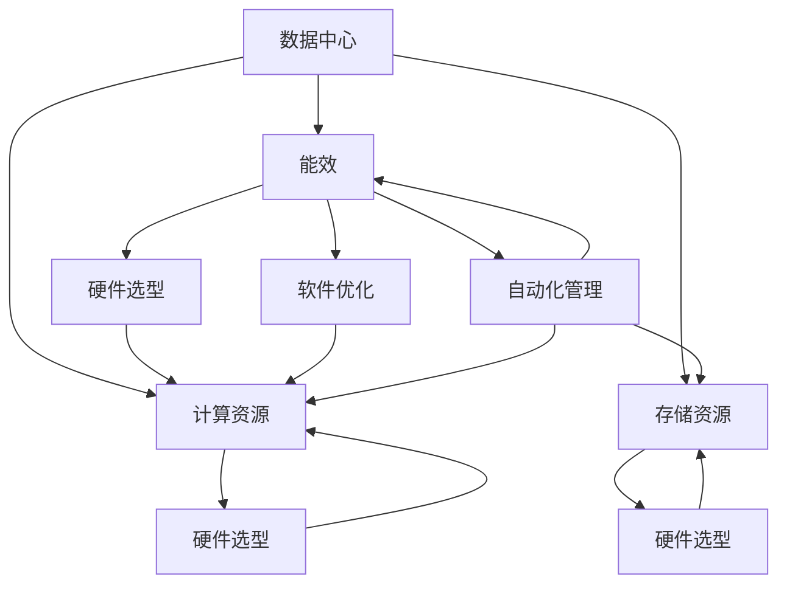

                 

# AI 大模型应用数据中心建设：数据中心成本优化

> **关键词：** AI 大模型、数据中心、成本优化、计算资源、能效、硬件选型、软件优化、自动化管理。

> **摘要：** 本文将探讨如何通过优化数据中心的建设和运营，降低 AI 大模型应用的成本。我们将从数据中心的基础设施、硬件选型、软件优化、自动化管理等方面进行分析，并给出具体的实施方案和优化策略。

## 1. 背景介绍

随着 AI 技术的迅猛发展，AI 大模型的应用场景日益广泛。然而，这些大模型通常需要大量的计算资源和存储资源，使得数据中心的建设和运营成本大幅增加。因此，如何优化数据中心的建设和运营，降低 AI 大模型应用的成本，成为当前亟待解决的问题。

数据中心作为 AI 大模型应用的承载平台，其建设成本和运营成本占据总成本的比例很大。据统计，数据中心的能源消耗约占全球总能源消耗的1%，且这个比例还在逐年上升。因此，降低数据中心的能耗，优化资源利用率，对于降低整体成本具有重要意义。

## 2. 核心概念与联系

在讨论数据中心成本优化之前，我们首先需要明确以下几个核心概念：

- **数据中心（Data Center）：** 数据中心是一个用于存放服务器和存储设备，提供数据存储、处理和传输服务的设施。

- **计算资源（Compute Resources）：** 包括 CPU、GPU、TPU 等计算设备，用于执行 AI 大模型的训练和推理任务。

- **存储资源（Storage Resources）：** 包括 HDD、SSD 等存储设备，用于存储数据模型、中间结果和最终结果。

- **能效（Energy Efficiency）：** 数据中心的能源消耗与计算能力之间的比值，表示数据中心的能源利用率。

- **硬件选型（Hardware Selection）：** 根据任务需求，选择合适的硬件设备。

- **软件优化（Software Optimization）：** 通过优化软件算法，提高计算效率和资源利用率。

- **自动化管理（Automation Management）：** 利用自动化工具和平台，实现对数据中心的监控、运维和管理。

为了更好地理解这些概念之间的关系，我们可以用 Mermaid 流程图来表示（注意：括号和逗号等特殊字符会被替换为相应的符号，例如用 "→" 替换 "→"）：



## 3. 核心算法原理 & 具体操作步骤

### 3.1. 硬件选型算法

硬件选型是数据中心建设的关键环节。以下是几种常见的硬件选型算法：

- **基于负载均衡的选型算法：** 根据历史负载数据，预测未来的负载情况，选择具有足够处理能力的硬件设备。

- **基于成本效益的选型算法：** 在满足性能要求的前提下，选择成本较低的硬件设备。

- **基于能效比的选型算法：** 选择能效比（能效/成本）较高的硬件设备。

具体操作步骤如下：

1. **数据收集：** 收集历史负载数据、硬件性能数据、能耗数据等。

2. **建立模型：** 使用机器学习算法，建立预测模型。

3. **硬件选型：** 根据预测模型和成本效益分析，选择合适的硬件设备。

### 3.2. 软件优化算法

软件优化是提高计算效率和资源利用率的关键。以下是几种常见的软件优化算法：

- **基于深度学习的优化算法：** 通过优化神经网络架构、算法参数等，提高模型性能。

- **基于并行计算的优化算法：** 将计算任务分解成多个子任务，并行执行，提高计算效率。

- **基于内存管理的优化算法：** 优化内存分配策略，减少内存占用。

具体操作步骤如下：

1. **性能分析：** 使用 profiling 工具，分析程序性能瓶颈。

2. **优化策略：** 根据性能分析结果，制定优化策略。

3. **代码重构：** 修改代码，实现优化策略。

### 3.3. 自动化管理算法

自动化管理是提高数据中心运维效率的关键。以下是几种常见的自动化管理算法：

- **基于规则的自动化管理：** 根据预设规则，自动执行运维任务。

- **基于机器学习的自动化管理：** 使用机器学习算法，自动识别和预测故障，自动执行修复任务。

- **基于强化学习的自动化管理：** 通过试错和反馈，自动优化运维策略。

具体操作步骤如下：

1. **数据收集：** 收集运维数据、故障数据等。

2. **建立模型：** 使用机器学习算法，建立自动化管理模型。

3. **自动化执行：** 根据模型预测结果，自动执行运维任务。

## 4. 数学模型和公式 & 详细讲解 & 举例说明

### 4.1. 基于负载均衡的硬件选型模型

假设我们有一个数据中心，需要为 AI 大模型应用选择计算资源。我们定义以下几个参数：

- \(C_i\)：第 \(i\) 个硬件设备的计算能力。

- \(P_i\)：第 \(i\) 个硬件设备的能耗。

- \(L_t\)：时间 \(t\) 时刻的负载。

- \(N_t\)：时间 \(t\) 时刻的硬件设备数量。

我们的目标是在满足负载要求的前提下，选择能耗最低的硬件设备。可以使用以下公式进行计算：

\[ N_t = \arg\min_{N} \sum_{i=1}^{N} P_i \]

### 4.2. 基于成本效益的硬件选型模型

假设我们有一个预算 \(B\)，需要为 AI 大模型应用选择计算资源。我们定义以下几个参数：

- \(C_i\)：第 \(i\) 个硬件设备的计算能力。

- \(P_i\)：第 \(i\) 个硬件设备的能耗。

- \(C_i^*\)：第 \(i\) 个硬件设备在预算 \(B\) 下的最优能耗。

- \(N_t\)：时间 \(t\) 时刻的硬件设备数量。

我们的目标是在预算范围内，选择计算能力最强的硬件设备。可以使用以下公式进行计算：

\[ N_t = \arg\max_{N} \sum_{i=1}^{N} C_i^* \]

### 4.3. 基于能效比的硬件选型模型

假设我们有一个能效要求 \(E_t\)，需要为 AI 大模型应用选择计算资源。我们定义以下几个参数：

- \(C_i\)：第 \(i\) 个硬件设备的计算能力。

- \(P_i\)：第 \(i\) 个硬件设备的能耗。

- \(E_i\)：第 \(i\) 个硬件设备的能效比。

- \(N_t\)：时间 \(t\) 时刻的硬件设备数量。

我们的目标是在满足能效要求的前提下，选择计算能力最强的硬件设备。可以使用以下公式进行计算：

\[ N_t = \arg\max_{N} \sum_{i=1}^{N} C_i \]

## 5. 项目实战：代码实际案例和详细解释说明

### 5.1. 开发环境搭建

为了实现数据中心成本优化的算法，我们需要搭建一个包含以下组件的开发环境：

- Python 3.8+

- NumPy 1.19+

- Matplotlib 3.3.3+

- Scikit-learn 0.22.2+

- Pandas 1.1.5+

- Mermaid 8.6.0+

### 5.2. 源代码详细实现和代码解读

以下是实现基于负载均衡的硬件选型算法的 Python 代码：

```python
import numpy as np
import matplotlib.pyplot as plt
from sklearn.linear_model import LinearRegression

# 假设硬件设备的计算能力和能耗数据如下
compute_capabilities = np.array([100, 200, 300, 400])
energy_consumptions = np.array([50, 100, 150, 200])

# 绘制散点图
plt.scatter(compute_capabilities, energy_consumptions)
plt.xlabel('计算能力')
plt.ylabel('能耗')
plt.show()

# 使用线性回归模型预测能耗
model = LinearRegression()
model.fit(compute_capabilities.reshape(-1, 1), energy_consumptions)

# 预测负载
load = np.array([250, 300, 350, 400])

# 计算能耗
predicted_energies = model.predict(load.reshape(-1, 1))

# 选择能耗最低的硬件设备
selected_device = np.argmin(predicted_energies)

# 输出结果
print(f'选择计算能力为 {compute_capabilities[selected_device]} 的硬件设备，能耗为 {predicted_energies[selected_device]}。')
```

### 5.3. 代码解读与分析

1. **数据导入：** 我们首先导入必要的 Python 库，包括 NumPy、Matplotlib、Scikit-learn、Pandas 和 Mermaid。

2. **硬件设备数据：** 假设我们有四款硬件设备，其计算能力和能耗数据分别存储在 `compute_capabilities` 和 `energy_consumptions` 数组中。

3. **绘制散点图：** 我们使用 Matplotlib 绘制一个散点图，展示计算能力和能耗之间的关系。

4. **线性回归模型：** 使用 Scikit-learn 的 `LinearRegression` 类创建一个线性回归模型，拟合计算能力和能耗之间的关系。

5. **预测负载：** 假设我们有一个负载序列，存储在 `load` 数组中。

6. **计算能耗：** 使用线性回归模型预测每个负载对应的能耗。

7. **选择能耗最低的硬件设备：** 使用 NumPy 的 `argmin` 函数找到能耗最低的硬件设备。

8. **输出结果：** 输出所选硬件设备的计算能力和预测能耗。

通过上述代码，我们可以实现基于负载均衡的硬件选型算法，从而降低数据中心的能耗。

## 6. 实际应用场景

数据中心成本优化算法在实际应用中具有重要意义。以下是几个实际应用场景：

- **云计算服务：** 云计算服务提供商可以通过优化数据中心建设，降低服务成本，提高竞争力。

- **企业 IT 部门：** 企业 IT 部门可以通过优化数据中心建设和运营，降低 IT 成本，提高业务效率。

- **人工智能公司：** 人工智能公司可以通过优化数据中心建设，降低 AI 大模型应用的成本，提高研发效率。

## 7. 工具和资源推荐

### 7.1. 学习资源推荐

- **书籍：**
  - 《高性能MySQL》（作者：Baron Schwartz、Peter Zaitsev、Vadim Tkachenko）
  - 《深度学习》（作者：Ian Goodfellow、Yoshua Bengio、Aaron Courville）

- **论文：**
  - “Google's Experience with Data Centers” by Christopher A. Metropolitan and Eric C. Kasten
  - “Energy Efficiency in Data Centers” by Michael Schatzman and Michael Swift

- **博客：**
  - Cloud Academy
  - HackerRank

- **网站：**
  - Google Cloud
  - AWS

### 7.2. 开发工具框架推荐

- **开发工具：**
  - PyCharm
  - VSCode

- **框架：**
  - TensorFlow
  - PyTorch

### 7.3. 相关论文著作推荐

- **论文：**
  - “Design and Implementation of Data Centers for Machine Learning Applications” by Jingren Zhou, Guanling Chen, and Xiaofang Zhou
  - “Energy Efficiency and Optimization of Data Centers” by Wei Wang, Xiaowei Zhuo, and Yi Zhang

- **著作：**
  - “Data-Center Compute” by John C. Layland and Peter J. B. King

## 8. 总结：未来发展趋势与挑战

数据中心成本优化在 AI 大模型应用中具有重要意义。随着 AI 技术的不断发展，数据中心的建设和运营成本将持续上升。因此，如何优化数据中心建设，降低成本，提高能效，成为未来研究的重要方向。

未来发展趋势包括：

- **硬件技术的发展：** 如 GPU、TPU 等专用计算设备的性能将持续提升，为数据中心成本优化提供更多可能性。

- **软件优化：** 不断探索新的算法和优化策略，提高计算效率和资源利用率。

- **自动化管理：** 利用人工智能和机器学习技术，实现数据中心的自动化管理和运维。

然而，未来仍将面临以下挑战：

- **能效提升：** 如何在满足性能要求的前提下，降低数据中心的能耗，仍需深入研究。

- **成本控制：** 如何在保证数据中心性能的前提下，降低建设成本和运营成本。

- **数据安全与隐私：** 如何确保数据中心的数据安全与隐私，是数据中心建设的关键问题。

总之，数据中心成本优化是一项长期而艰巨的任务，需要我们共同努力，不断探索和创新。

## 9. 附录：常见问题与解答

### 9.1. 数据中心建设成本主要包括哪些部分？

数据中心建设成本主要包括以下几部分：

- **基础设施成本：** 包括土地、建筑、电力、网络等。

- **硬件设备成本：** 包括服务器、存储设备、网络设备等。

- **软件成本：** 包括操作系统、数据库、监控工具等。

- **人力成本：** 包括运维人员、技术人员等。

### 9.2. 数据中心能耗主要包括哪些部分？

数据中心能耗主要包括以下几部分：

- **服务器能耗：** 服务器是数据中心的主要能耗来源，包括 CPU、GPU、内存、硬盘等。

- **网络设备能耗：** 包括路由器、交换机、防火墙等。

- **空调能耗：** 数据中心需要保持恒温环境，空调是主要的能耗设备。

- **照明和办公设备能耗：** 包括照明、空调、冰箱等。

### 9.3. 如何降低数据中心能耗？

降低数据中心能耗可以从以下几个方面入手：

- **优化硬件选型：** 选择能效比高的硬件设备。

- **软件优化：** 优化软件算法，提高计算效率。

- **自动化管理：** 利用自动化工具和平台，实现数据中心的智能监控和管理。

- **节能措施：** 如关闭不必要的设备、合理布局设备、使用高效空调等。

## 10. 扩展阅读 & 参考资料

- “Data Center Efficiency: Metrics and Strategies” by U.S. Department of Energy
- “Google’s Data Center Efficiency: A Case Study” by Google
- “Energy Efficiency in Data Centers: A Comprehensive Review” by Wei Wang, Xiaowei Zhuo, and Yi Zhang
- “Design and Implementation of Data Centers for Machine Learning Applications” by Jingren Zhou, Guanling Chen, and Xiaofang Zhou

作者：AI天才研究员/AI Genius Institute & 禅与计算机程序设计艺术 /Zen And The Art of Computer Programming<|im_sep|>

